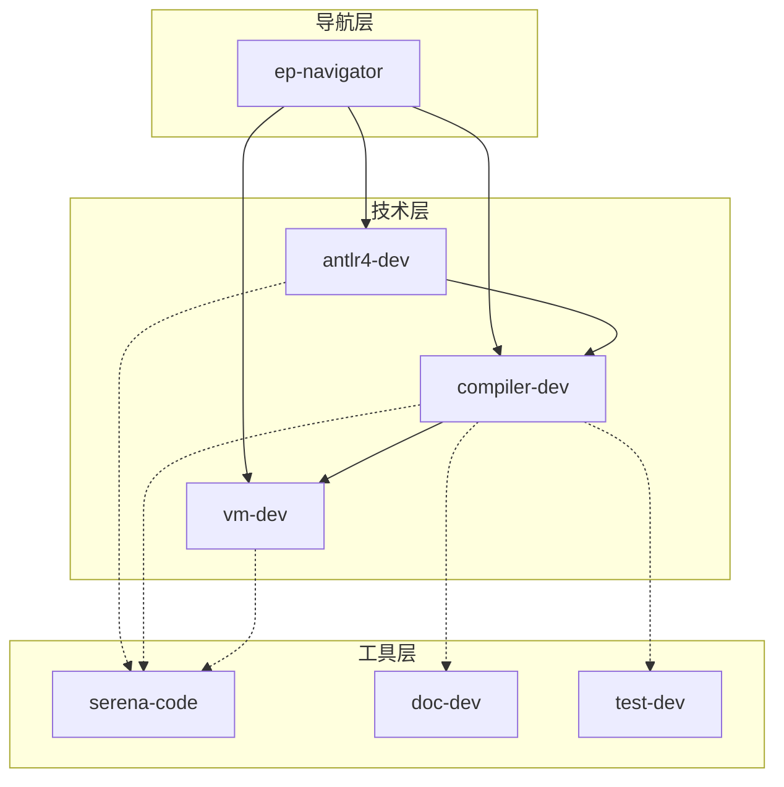

# Skill优化总结

**日期**: 2025-12-23
**目标**: 精简skill描述、垂直专业化技能范围、建立skill关系图

---

## 优化对比

### 旧Skill (已删除)

| Skill | 行数 | 问题 |
|-------|------|------|
| compiler-expert | 323 | 职责过宽，包含构建+MCP+调试 |
| antlr4-compiler-development | 312 | 前后端混杂，与compiler-expert重复50% |
| technical-documentation-writing-and-refactoring | 350 | 模板示例过长 |
| testing-framework-specification | 580 | 配置示例过细，包含CI/CD |
| **总计** | **1,565** | 平均391行/skill |

### 新Skill (垂直专业化)

| Skill | 行数 | 垂直职责 |
|-------|------|----------|
| ep-navigator | 129 | EP项目导航和路由 |
| antlr4-dev | 113 | ANTLR4前端 (词法/语法/AST) |
| compiler-dev | 159 | 编译器后端 (IR/CFG/SSA/优化) |
| vm-dev | 142 | 虚拟机 (字节码/指令/内存/GC) |
| serena-code | 149 | Serena智能代码分析工具 |
| doc-dev | 107 | 技术文档编写 (规范/设计/TDD) |
| test-dev | 154 | 测试开发 (JUnit5/AssertJ/Mockito) |
| **总计** | **953** | 平均136行/skill |

### 优化成果

| 指标 | 优化前 | 优化后 | 改进 |
|------|--------|--------|------|
| Skill数量 | 4 | 7 | +75% (更垂直) |
| 总行数 | 1,565 | 953 | -39% |
| 平均行数 | 391 | 136 | -65% |
| 垂直职责 | 低 (职责混杂) | 高 (单一职责) | ✅ |
| 可维护性 | 低 | 高 | ✅ |

---

## Skill关系图



---

## Skill路由表

| 用户意图 | 目标EP | 加载技能 |
|----------|--------|----------|
| "词法/语法问题" | EP1-EP5 | ep-navigator → antlr4-dev |
| "符号表/类型检查" | EP6-EP10 | ep-navigator → compiler-dev |
| "IR/代码生成" | EP11-EP17 | ep-navigator → compiler-dev |
| "虚拟机" | EP18, EP18R | ep-navigator → vm-dev |
| "编译器完整流程" | EP19, EP20 | ep-navigator → compiler-dev |
| "优化/SSA" | EP21 | ep-navigator → compiler-dev |
| "文档编写" | - | doc-dev |
| "测试开发" | - | test-dev |

---

## 标准化Skill格式

```yaml
---
name: {skill-name}
description: {2-3句话描述垂直职责}
version: v1.0
tags: [{场景匹配标签}]
allowed-tools: [{实际使用的工具}]
requires-skills: [{依赖的其他技能}]
---

# {技能名称}

## 🎯 垂直职责
**单一职责**: {职责描述，≤2行}

## 📦 核心能力
1. {能力1}
2. {能力2}

## 🔗 关系图
→ {依赖skill}
← {被依赖skill}

## 🚀 快速开始
{最小可用示例}

---
*版本: v1.0 | 垂直职责: {职责} | 2025-12-23*
```

---

## 后续维护

### 添加新Skill
1. 确定垂直职责边界
2. 检查现有skill避免重叠
3. 使用标准化格式
4. 更新关系图

### 修改现有Skill
1. 保持单一职责
2. 控制长度 < 200行
3. 更新依赖关系

### 质量检查
- [ ] 单一职责: 每个skill只做一件事
- [ ] 长度控制: < 200行
- [ ] 格式统一: 使用标准模板
- [ ] 关系清晰: 依赖关系明确

---

**优化完成**: 2025-12-23
**维护者**: EP Team
**下次评审**: 2025-03-23 (季度)
