# EP导航专家

## 🎯 垂直职责
**单一职责**: EP项目知识图谱导航和路由决策

## 📊 EP依赖关系图



```mermaid
graph TD
    %% 基础层
    EP1[EP1: Lexer] --> EP2[EP2: Parser]
    EP2 --> EP3[EP3: AST]
    EP3 --> EP4[EP4: Listener]
    EP4 --> EP5[EP5: Visitor]
    EP5 --> EP6[EP6: Symbol Table]
    EP6 --> EP7[EP7: Types]
    EP7 --> EP8[EP8: Type Checking]
    EP8 --> EP9[EP9: Scopes]
    EP9 --> EP10[EP10: Interpreter]

    %% 编译器层
    EP10 --> EP11[EP11: IR Design]
    EP11 --> EP12[EP12: IR Gen]
    EP12 --> EP13[EP13: Bytecode]
    EP13 --> EP14[EP14: VM Entry]
    EP14 --> EP15[EP15: Function Call]
    EP15 --> EP16[EP16: Control Flow]
    EP16 --> EP17[EP17: Arrays]

    %% å端分支
    EP17 --> EP18[EP18: Stack VM]
    EP17 --> EP18R[EP18R: Register VM]
    EP17 --> EP19[EP19: Compiler Interpreter]
    EP17 --> EP20[EP20: Full Compiler]

    %% 优化层
    EP20 --> EP21[EP21: Optimization]

    %% 虚拟机分支
    EP18 -.-> EP18R
    EP19 -.-> EP20
```

## 🚀 快速路由表

| 用户意图 | 目标EP | 加载记忆 | 加载技能 |
|----------|--------|----------|----------|
| "词法/语法问题" | EP1-EP5 | 无需 | antlr4-dev |
| "符号表/类型检查" | EP6-EP10 | EP{编号}.md | compiler-dev |
| "IR/代码生成" | EP11-EP17 | EP{编号}.md | compiler-dev |
| "虚拟机" | EP18, EP18R | EP18.md | vm-dev |
| "编译器完整流程" | EP19, EP20 | EP19.md, EP20.md | compiler-dev |
| "优化/SSA" | EP21 | EP21_TECH_MEM.md | compiler-dev |
| "文档编写" | - | - | doc-dev |
| "测试开发" | - | - | test-dev |

## 📦 核心能力

### 1. EP识别
从用户输入自动识别目标EP：
```bash
输入: "在ep18中添加垃圾回收"
→ 识别: EP18
→ 加载: docs/ep-memory/EP18.md
→ 加载技能: vm-dev
```

### 2. 跨EP对比
```bash
输入: "对比ep18和ep18r的ABI设计"
→ 加载: EP18.md + EP18R.md
→ 对比维度: 调用约定、栈帧布局、参数传递
→ 输出: 标准化对比表
```

### 3. 依赖分析
```bash
输入: "修改EP5的Visitor接口"
→ 分析: 影响EP6-EP21所有使用Visitor的模块
→ 报告: 受影响EP列表 + 风险评估
```

## 🔗 关系图
→ **被所有技能依赖** (优先加载)
← 无依赖

## 📂 关键文件映射

| EP | 核心目录 | 入口文件 | 关键记忆 |
|----|----------|----------|----------|
| EP1-5 | `ep20/src/main/antlr4/` | `Cymbol.g4` | 无 |
| EP6-10 | `ep20/src/main/java/org/teachfx/antlr4/ep20/symtab/` | `Symbol.java` | EP{编号}.md |
| EP11-17 | `ep20/src/main/java/org/teachfx/antlr4/ep20/` | `Compiler.java` | EP{编号}.md |
| EP18 | `ep18/src/main/java/org/teachfx/antlr4/ep18/stackvm/` | `CymbolStackVM.java` | EP18.md |
| EP18R | `ep18r/src/main/java/org/teachfx/antlr4/ep18r/regvm/` | `CymbolRegisterVM.java` | EP18R.md |
| EP19 | `ep19/src/main/java/org/teachfx/antlr4/ep19/` | `Compiler.java` | EP19.md |
| EP20 | `ep20/src/main/java/org/teachfx/antlr4/ep20/` | `Compiler.java` | EP20.md |
| EP21 | `ep21/src/main/java/org/teachfx/antlr4/ep21/` | `Optimizer.java` | EP21_TECH_MEM.md |

## ✅ 使用流程

```bash
# 1. 识别EP
用户输入包含 "ep{数字}" 或特定关键词

# 2. 加载记忆
mcp__serena__read_memory("EP{编号}.md")

# 3. 加载技能
根据上表加载对应的垂直技能

# 4. 执行任务
使用垂直技能的专业知识执行

# 5. 更新记忆
任务完成后更新对应的EP记忆
```

---
*版本: v1.0 | 垂直职责: EP路由导航 | 2025-12-23*
