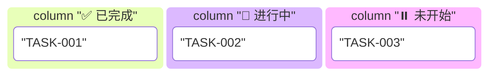

# 技术文档编写与重构 Skill

**版本**: v1.0 | **更新**: 2025-12-21 | **适用范围**: EP系列项目

## 📌 核心目标

建立统一文档体系：**标准化**结构、**可追踪**进度、**量化**质量、**自动化**生成。

## 📚 三大文档类型

### 1️⃣ 规范文档 (Specification)
**设计契约**，定义高层约定和设计指导。

**类型**: ABI规范、API规范、语言规范、架构规范
**模板结构**:
```markdown
# {标题}
**版本**: vX.Y | **日期**: YYYY-MM-DD | **状态**: 草稿/评审中/已通过

## 1. 概述
### 1.1 设计目标
- 目标1: 具体描述
- 目标2: 可衡量目标

### 1.2 适用范围
- 场景1: 说明
- 场景2: 说明

### 1.3 术语定义
| 术语 | 定义 |
|------|------|

## 2. 技术规范
### 2.1 核心概念
### 2.2 规范细节
### 2.3 边界条件

## 3. 实现指南
### 3.1 使用示例
```java
// 代码示例
```

## 附录A: 版本历史
| 变更 |  版本 | 日期 |负责人 |
|------|------|------|--------|

## 附录B: 参考文档
```

### 2️⃣ 设计文档 (Design)
**实现指南**，展示技术细节和模块说明。

**类型**: 核心设计、模块设计、详细设计、集成设计
**模板结构**:
```markdown
# {EP} {模块} 设计文档
**版本**: vX.Y | **日期**: YYYY-MM-DD

## 1. 设计概述
### 1.1 设计目标
### 1.2 架构上下文
### 1.3 关键设计决策
| 决策点 | 选项 | 选择 | 理由 |
|--------|------|------|------|

## 2. 详细设计
### 2.1 核心组件设计
**类图**:
```
ClassA --* ClassB
```

**接口定义**:
```java
interface ComponentA {
    ReturnType methodName(ParamType param);
}
```

### 2.2 交互设计
序列图/状态图

## 3. 技术细节
### 3.1 算法实现
```java
// 详细算法
```

### 3.2 性能考量
- 时间复杂度: O(n)
- 优化策略: 说明

## 4. 测试验证
### 4.1 单元测试策略
### 4.2 集成测试场景

## 附录: 实现状态
- [ ] 核心功能
- [ ] 单元测试
- [ ] 性能优化
```

### 3️⃣ TDD任务计划
**任务驱动计划**，包含任务-子任务-二级任务分解。

**模板结构**:
```markdown
# TDD重构计划: {主题}
**版本**: vX.Y | **日期**: YYYY-MM-DD

## 1. 概述
### 1.1 重构目标
### 1.2 重构原则
1. **测试先行**: 先写测试再实现
2. **小步快跑**: 每次只改一个独立部分
3. **持续集成**: 每更改都通过测试
4. **文档同步**: 代码与文档同步更新

### 1.3 成功标准
| 指标 | 目标值 | 测量方式 |
|------|--------|----------|
| 测试覆盖率 | ≥95% | JaCoCo |
| 规范符合率 | 100% | 评审 |
| 文档完整性 | 100% | 检查清单 |

## 2. 任务追踪表
### 2.1 状态看板


### 2.2 详细追踪
| 层级 | 任务ID | 描述 | 状态 | 优先级 |
|------|--------|------|------|--------|
| 阶段 | Phase1 | 名称 | ✅/🔄/⏸️ | 高/中/低 |

## 3. 任务示例
### Phase 1: {名称} (预计: X天)
#### TASK-1.1: {任务名称}
**目标**: 明确可衡量的目标

**子任务**:
1. 子任务1
   - [ ] 标准1
   - [ ] 标准2

**验收标准**:
- [ ] 所有测试通过
- [ ] 覆盖率≥95%
- [ ] 文档更新

**状态**: ✅/🔄/⏸️
**负责人**: 姓名
**截止**: YYYY-MM-DD
```

## 🎯 测试策略

### 测试金字塔模型
```
    端到端测试 (10%)
        ↑
        |
    集成测试 (30%)
        ↑
        |
    单元测试 (60%) ← 基础
```

### 测试类型
**单元测试** (JUnit 5 + AssertJ)
```java
@Test
@DisplayName("应正确执行功能")
void testFunction() {
    // Given - 准备数据
    Type data = prepare();

    // When - 执行操作
    Type result = method(data);

    // Then - 验证结果
    assertThat(result).isEqualTo(expected);
}
```

**覆盖率要求**:
| 组件 | 行覆盖率 | 分支覆盖率 | 方法覆盖率 |
|------|----------|------------|------------|
| 核心引擎 | ≥95% | ≥90% | 100% |
| 指令实现 | ≥95% | ≥90% | 100% |
| 栈帧管理 | ≥95% | ≥90% | 100% |
| 内存管理 | ≥90% | ≥85% | 100% |
| **总体** | **≥93%** | **≥88%** | **100%** |

## 📊 质量保证

### 文档质量标准
| 维度 | 权重 | 目标分数 | 评分标准 |
|------|------|----------|----------|
| 文档完整性 | 30% | ≥90 | 所有必需章节 |
| 章节完整性 | 20% | ≥85 | 标准结构 |
| 任务追踪率 | 25% | 100 | 状态更新 |
| 更新及时性 | 15% | ≥90 | 同步更新 |
| 审核通过率 | 10% | ≥95 | 评审通过 |
| **综合** | **100%** | **≥90** | **加权平均** |

### 质量检查清单
**编写时**:
- [ ] 结构完整 (概述→规范→指南→附录)
- [ ] 示例可运行 (通过测试)
- [ ] 版本信息准确
- [ ] 术语定义清晰

**审核时**:
- [ ] 技术准确性验证
- [ ] 表述清晰性检查
- [ ] 示例完整性确认
- [ ] 规范符合性评审

## 🚀 快速开始

### 步骤1: 检查状态
```bash
# 识别缺失文档
echo "规范文档: {EP}_ABI_*.md"
echo "设计文档: {EP}*_设计文档.md"
echo "TDD计划: TDD*.md"
```

### 步骤2: 创建文档
```bash
# 使用模板
cp templates/specification.md docs/{EP}_ABI_设计文档.md
cp templates/design.md docs/{EP}_核心设计文档.md
cp templates/tdd-plan.md docs/TDD_重构计划.md
```

### 步骤3: 生成Agent
```bash
# 创建子Agent
fork sub-agent --task "编写{EP}规范" --input "requirements.md"
fork sub-agent --task "编写{EP}设计" --input "context.md"
fork sub-agent --task "创建{EP}TDD计划" --input "goals.md"
```

### 步骤4: 验证质量
```bash
# 质量检查
./scripts/validate-documents.sh
./scripts/generate-quality-report.sh

# 直到综合评分≥90
```

## 🔧 自动化工具

### 文档完整性检查
```bash
#!/bin/bash
# 检查必需文档
declare -A docs=(
    ["ABI规范"]="{EP}_ABI_设计文档.md"
    ["核心设计"]="{EP}_核心设计文档.md"
    ["TDD计划"]="TDD_重构计划.md"
)

for name in "${!docs[@]}"; do
    if [ -f "${docs[$name]}" ]; then
        echo "✅ $name: 存在"
    else
        echo "❌ $name: 缺失"
    fi
done
```

### 进度报告生成
```java
public class TDDProgressReporter {
    public String generateDailyReport() {
        int completed = plan.getCompletedTaskCount();
        int total = plan.getTotalTaskCount();
        double progress = 100.0 * completed / total;

        return String.format("""
            === 每日进度报告 ===
            日期: %s
            已完成: %d/%d (%.1f%%)
            整体进度: %.1f%%
            """, LocalDate.now(), completed, total, progress, progress);
    }
}
```

## ✅ 最佳实践

### 命名约定
**文档**:
- ✅ EP21_ABI_设计文档.md
- ✅ TDD_重构计划.md
- ❌ abi_doc.md (不规范)

**任务**:
- ✅ TASK-001: 测试框架升级
- ✅ TASK-2.1: 指令执行解耦
- ❌ 1.测试 (缺少TASK前缀)

### 更新频率
| 文档类型 | 频率 | 触发点 |
|----------|------|--------|
| 规范文档 | 每2-4周 | 新功能设计 |
| 设计文档 | 每周 | 架构调整 |
| TDD计划 | 每日 | 状态变化 |

### 审核流程
```
1. 自审: 结构、内容、示例
2. 同行评审: 技术、表述、示例
3. 架构师审核: 规范、决策、风险
4. 终审: 修改意见、状态更新
```

## 📖 参考资源

- **EP18R**: `ep18r/docs/` - 寄存器VM风格
- **EP18**: `ep18/docs/` - 栈式VM风格
- **EP21**: `ep21/docs/` - 现代编译器风格

**标准参考**:
- RISC-V Calling Convention
- JVM Specification
- LLVM Documentation

---

**版本**: v1.0.0 | **更新**: 2025-12-21 | **适用范围**: EP系列项目 | **维护**: 季度评审

*本Skill建立EP项目技术文档的标准化体系，当触发文档任务时加载并fork子Agent执行。*