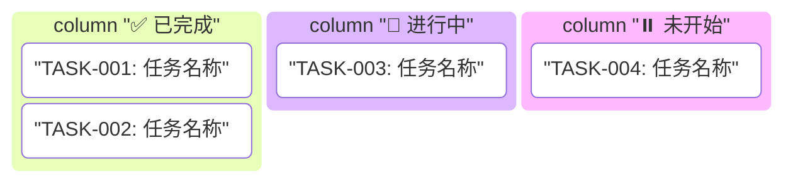
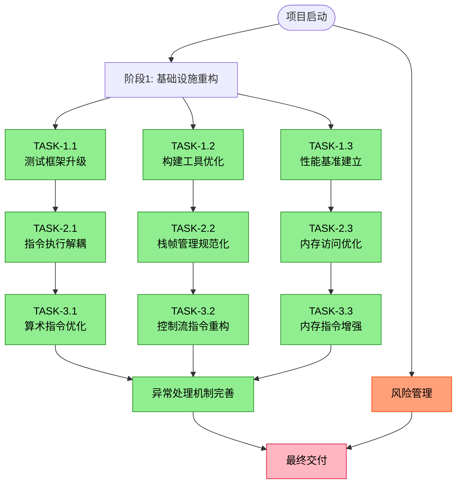

# 技术文档编写与重构 Skill

**文档版本**: v1.0
**创建日期**: 2025-12-21
**最后更新**: 2025-12-21
**制定者**: Claude Code
**基于**: EP18R、EP18、EP21文档风格分析

---

## 📌 Skill 概述

本Skill定义了EP系列项目中技术文档的标准化编写和重构方法，确保文档具备**高可读性、强可追踪性、量化可衡量性**。通过统一的文档结构和任务驱动模式，实现技术文档的具体化、可追踪、量化衡量进度。

### Skill 目标

1. **标准化**: 建立统一的文档结构和编写规范
2. **可追踪**: 通过任务分解和状态跟踪实现进度可视化
3. **量化**: 使用明确的指标衡量文档质量和完成度
4. **自动化**: 支持生成子Agent自动编写和重构文档
5. **教育价值**: 保留文档作为学习和教学资源的价值

### 适用范围

- 新建EP项目的技术文档编写
- 现有EP项目的技术文档重构
- 跨项目文档风格统一
- 文档类任务的自动化执行

---

## 📚 文档类型体系

一个标准的EP项目必须包含三种核心文档类型，形成完整的文档体系：

### 1️⃣ 规范文档（Specification Documents）

定义高层约定、设计指导和纲领性要求，是项目的**设计契约**。

#### 规范文档类型

| 文档类型 | 文件名模式 | 核心内容 | 参考实例 |
|----------|------------|----------|----------|
| **ABI规范** | `{EP}_ABI_设计文档.md` | 应用程序二进制接口、调用约定、寄存器约定、栈帧布局 | EP18R_ABI_设计文档.md |
| **API规范** | `{EP}_API_规范.md` | 公共API接口、类设计、方法签名 | 语言规范.md（第7章API） |
| **语言规范** | `语言规范.md` | 词法规则、语法规则、语义规则、类型系统 | EP21语言规范.md |
| **架构规范** | `架构设计规范.md` | 整体架构、分层设计、模块职责、接口契约 | EP21架构设计规范.md |
| **协议规范** | `{EP}_SPECIFICATION.md` | 通信协议、数据格式、交互流程 | OPENSPECKIT_SPECIFICATION.md |

#### 规范文档标准结构

```markdown
# {文档标题}

**文档版本**: vX.Y
**创建日期**: YYYY-MM-DD
**最后更新**: YYYY-MM-DD [更新说明]
**制定者**: 制定者名称
**基于**: 参考的文档或标准
**审核状态**: 草稿/评审中/已通过

---

## 1. 概述

### 1.1 设计目标
- 目标1: 具体描述
- 目标2: 可衡量的目标

### 1.2 适用范围
- 适用场景1
- 适用场景2

### 1.3 术语定义
| 术语 | 定义 |
|------|------|
| 术语1 | 定义说明 |

---

## 2. 技术规范

### 2.1 核心概念
详细描述核心概念和设计哲学

### 2.2 规范细节
具体的规范条款，使用表格、代码块等形式

### 2.3 边界条件
明确的边界条件和约束

---

## 3. 实现指南

### 3.1 使用示例
```java
// 代码示例
```

### 3.2 最佳实践
- 实践1: 说明
- 实践2: 说明

---

## 附录A: 版本历史

| 版本 | 日期 | 主要变更 | 负责人 |
|------|------|----------|--------|
| v1.0 | YYYY-MM-DD | 初始版本 | 姓名 |

## 附录B: 参考文档
1. 参考文档1
2. 参考文档2

## 附录C: 快速参考
快速查阅表格和常见用法

---

**文档状态**: 正式发布/草案/已废弃
**维护要求**: 任何变更必须同步更新
```

### 2️⃣ 设计文档（Design Documents）

详细设计、技术细节展示、模块详细说明等实现细节的**实现指南**。

#### 设计文档类型

| 文档类型 | 文件名模式 | 核心内容 | 参考实例 |
|----------|------------|----------|----------|
| **核心设计** | `{EP}_核心设计文档.md` | 虚拟机架构、指令集、执行引擎、内存管理 | EP18R_核心设计文档.md |
| **模块设计** | `{模块}_设计文档.md` | 单个模块的详细设计、类图、交互流程 | 各模块独立设计文档 |
| **详细设计** | `{EP}_详细设计.md` | 算法细节、数据结构、性能优化策略 | 高级技术实现指南.md |
| **集成设计** | `{EP}_集成设计.md` | 模块集成方案、依赖关系、接口设计 | GC_集成进度_20251221.md |

#### 设计文档标准结构

```markdown
# {EP} {模块名称} 设计文档

**文档版本**: vX.Y
**创建日期**: YYYY-MM-DD
**最后更新**: YYYY-MM-DD
**制定者**: 姓名
**基于**: 参考规范

---

## 1. 设计概述

### 1.1 设计目标
明确的设计目标和要解决的核心问题

### 1.2 架构上下文
在整体架构中的位置和依赖关系

### 1.3 关键设计决策
| 决策点 | 选项 | 选择 | 理由 |
|--------|------|------|------|
| 决策1 | A/B | A | 性能/可维护性等 |

---

## 2. 详细设计

### 2.1 核心组件设计
#### 2.1.1 组件A设计
**职责**: 单一职责描述

**类图**:
```
ClassA --* ClassB: 包含
ClassB --> ClassC: 依赖
```

**接口定义**:
```java
interface ComponentA {
    // 方法签名
    ReturnType methodName(ParamType param);
}
```

**实现细节**:
- 关键算法描述
- 数据结构设计
- 复杂度分析

### 2.2 交互设计
#### 2.2.1 序列图
createActor callActor destroyActor

#### 2.2.2 状态图
stateA --> stateB: 事件

---

## 3. 技术细节

### 3.1 算法实现
```java
// 详细算法代码
public void algorithm() {
    // 步骤1
    // 步骤2
}
```

### 3.2 性能考量
- 时间复杂度: O(n)
- 空间复杂度: O(n)
- 优化策略: 说明

### 3.3 异常处理
```java
try {
    // 操作
} catch (SpecificException e) {
    // 处理
}
```

---

## 4. 测试验证

### 4.1 单元测试策略
测试覆盖的核心功能点

### 4.2 集成测试场景
模块间的集成测试用例

---

## 附录A: 实现状态
- [ ] 核心功能实现
- [ ] 单元测试完成
- [ ] 性能优化完成
- [ ] 文档更新完成

---

**文档状态**: 实现中/已完成
**相关文件**: 列出相关源码文件路径
```

### 3️⃣ TDD任务计划（TDD Refactoring Plan）

包含任务-子任务-二级任务（如果有）的分解层级，任务驱动的项目计划表。

#### TDD任务计划结构

```markdown
# TDD重构计划：{重构主题}

**文档版本**: vX.Y
**创建日期**: YYYY-MM-DD
**最后更新**: YYYY-MM-DD [更新说明]
**制定者**: 姓名
**审核状态**: 已通过/评审中
**基于**: 参考的规范和设计文档

---

## 1. 概述

### 1.1 重构目标
通过测试驱动开发方法，实现{具体目标}，确保实现与{规范文档}完全一致。

### 1.2 重构原则
1. **测试先行**: 所有重构必须先写测试，再实现代码
2. **小步快跑**: 每次重构只修改一个小的、独立的部分
3. **持续集成**: 每个更改都必须通过所有测试
4. **文档同步**: 代码变更与文档更新同步进行

### 1.3 成功标准
| 指标 | 目标值 | 测量方式 |
|------|--------|----------|
| 测试覆盖率 | ≥95% | JaCoCo报告 |
| 规范符合率 | 100% | 规范评审 |
| 性能回归 | ≤5% | JMH基准测试 |
| 文档完整性 | 100% | 文档检查清单 |

---

## 2. 任务追踪表

### 2.1 任务执行状态看板



### 2.2 详细任务追踪表

| 层级 | 任务ID | 描述 | 状态 | 优先级 | 负责人 | 截止日期 | 备注 |
|------|--------|------|------|--------|--------|----------|------|
| **阶段** | **Phase1** | **阶段名称** | ✅/🔄/⏸️ | 高/中/低 | 姓名 | YYYY-MM-DD | 说明 |
| 子任务 | TASK-1.1 | 子任务描述 | ✅/🔄/⏸️ | 高/中/低 | 姓名 | YYYY-MM-DD | 说明 |
| 二级任务 | TASK-1.1.1 | 二级任务描述 | ✅/🔄/⏸️ | 高/中/低 | 姓名 | YYYY-MM-DD | 说明 |

**状态图标说明**:
- ✅ 已完成: 任务已完成并通过测试验证
- 🔄 进行中/部分完成: 任务已部分实现
- ⏸️ 未开始: 任务尚未开始

---

## 3. 阶段性任务描述

### Phase 1: {阶段名称} (预计: X天)

#### TASK-1.1: {任务名称}

**目标**
明确、可衡量的任务目标

**子任务**
1. **子任务1**: 具体描述
   - [ ] 完成标准1
   - [ ] 完成标准2

2. **子任务2**: 具体描述
   - [ ] 完成标准1
   - [ ] 完成标准2

**验收标准**
- [ ] 通过所有测试（包括单元测试、集成测试）
- [ ] 代码覆盖率达到95%以上
- [ ] 性能符合预期目标
- [ ] 文档同步更新

**测试策略**
- **单元测试**: 验证每个独立功能
- **集成测试**: 验证模块间协作
- **性能测试**: 验证性能指标
- **回归测试**: 确保无破坏

**依赖项**
- 本任务依赖的前置条件
- 相关文档和规范

**风险与缓解**
| 风险 | 概率 | 影响 | 缓解措施 |
|------|------|------|----------|
| 技术风险 | 高 | 中 | 具体缓解措施 |
| 资源风险 | 中 | 高 | 具体缓解措施 |

**负责人**
负责人姓名

**截止日期**
YYYY-MM-DD

**状态**
✅ 已完成 / 🔄 进行中 / ⏸️ 未开始

**交付物清单**
1. 源码文件: `src/main/java/...`
2. 测试文件: `src/test/java/...`
3. 文档更新: `{EP}_xxx文档.md`
4. 配置更新: `pom.xml` 或其他配置文件

#### TASK-1.2: {任务名称}
[同上结构]

---

## 4. 测试策略

### 4.1 测试金字塔模型

```
        端到端测试 (10%)
            ↑
            |
      集成测试 (30%)
            ↑
            |
      单元测试 (60%) - 基础
```

### 4.2 测试类型定义

#### 4.2.1 单元测试 (Unit Tests)
- **测试粒度**: 单个类或方法
- **覆盖率目标**: ≥85%
- **框架**: JUnit 5 + AssertJ
- **执行频率**: 每次提交
- **命名规范**: `test{被测场景}_{期望结果}_when{条件}`

```java
@Test
@DisplayName("应正确执行{功能}")
void test{Function}Returns{Result}() {
    // Given - 准备测试数据
    Type data = prepareData();

    // When - 执行被测操作
    Type result = testedMethod(data);

    // Then - 验证结果
    assertThat(result).isEqualTo(expected);
}
```

#### 4.2.2 集成测试 (Integration Tests)
- **测试粒度**: 模块间协作
- **验证目标**: 接口契约
- **框架**: JUnit 5 + 测试容器
- **执行频率**: 每日构建

#### 4.2.3 端到端测试 (End-to-End Tests)
- **测试粒度**: 完整系统
- **验证目标**: 用户场景
- **框架**: 自定义测试运行器
- **执行频率**: 发布前

### 4.3 测试数据管理

#### 4.3.1 测试数据分类
```
test-data/
├── valid/          # 有效程序
│   ├── simple/     # 简单程序
│   ├── complex/    # 复杂程序
│   └── edge-cases/ # 边界情况
├── invalid/        # 无效程序
│   ├── syntax/     # 语法错误
│   ├── semantic/   # 语义错误
│   └── type/       # 类型错误
└── performance/    # 性能测试程序
```

#### 4.3.2 测试夹具示例
```java
public class TestFixtures {
    // 简单示例
    public static final String SIMPLE_PROGRAM = """
        // 测试程序代码
    """;

    // 复杂示例
    public static final String COMPLEX_PROGRAM = """
        // 复杂测试程序
    """;
}
```

### 4.4 测试覆盖要求

| 组件 | 行覆盖率 | 分支覆盖率 | 方法覆盖率 | 断言密度 |
|------|----------|------------|------------|----------|
| 核心引擎 | ≥95% | ≥90% | 100% | ≥2/方法 |
| 指令实现 | ≥95% | ≥90% | 100% | ≥3/方法 |
| 栈帧管理 | ≥95% | ≥90% | 100% | ≥2/方法 |
| 内存管理 | ≥90% | ≥85% | 100% | ≥1/方法 |
| 异常处理 | ≥98% | ≥95% | 100% | ≥2/方法 |
| **总体** | **≥93%** | **≥88%** | **100%** | **≥2/方法** |

---

## 5. 风险管理

### 5.1 技术风险矩阵

| 风险项 | 可能性 | 影响程度 | 风险等级 | 缓解策略 | 负责人 |
|--------|--------|----------|----------|----------|--------|
| 性能回归 | 中 | 高 | 🔴 高 | 建立性能基准测试 | 姓名 |
| 兼容性破坏 | 低 | 高 | 🟡 中 | 保持向后兼容性测试 | 姓名 |
| 测试覆盖率不足 | 中 | 中 | 🟡 中 | 设置覆盖率阈值检查 | 姓名 |
| 技术债务积累 | 高 | 中 | 🟡 中 | 定期重构和清理 | 姓名 |

**风险等级说明**:
- 🔴 高: 需要立即关注和处理
- 🟡 中: 需要监控和计划处理
- 🟢 低: 可以接受或后续处理

### 5.2 风险缓解措施

#### 5.2.1 技术风险缓解
- **性能回归**: 每个重构阶段后运行JMH基准测试，确保性能下降不超过5%
- **兼容性破坏**: 维护回归测试套件，所有现有测试必须通过
- **代码质量下降**: 配置Checkstyle、SpotBugs、PMD等静态分析工具

#### 5.2.2 资源风险缓解
- **时间不足**: 优先级排序，采用MVP（最小可行产品）策略
- **人员不足**: 完善文档，支持并行开发
- **知识缺失**: 建立知识库，记录关键决策和技术细节

---

## 6. 质量保证

### 6.1 代码质量标准

#### 6.1.1 静态代码分析配置
```xml
<!-- Maven POM配置 -->
<plugins>
  <plugin>
    <groupId>org.apache.maven.plugins</groupId>
    <artifactId>maven-checkstyle-plugin</artifactId>
    <version>3.6.0</version>
    <configuration>
      <configLocation>checkstyle.xml</configLocation>
    </configuration>
  </plugin>
  
  <plugin>
    <groupId>com.github.spotbugs</groupId>
    <artifactId>spotbugs-maven-plugin</artifactId>
    <version>4.8.6.0</version>
  </plugin>
  
  <plugin>
    <groupId>org.jacoco</groupId>
    <artifactId>jacoco-maven-plugin</artifactId>
    <version>0.8.12</version>
  </plugin>
</plugins>
```

#### 6.1.2 质量阈值标准
```yaml
质量标准:
  测试覆盖率: 
    整体: ≥85%
    核心模块: ≥90%
  代码重复率: ≤5%
  圈复杂度: 
    方法级: ≤10
    类级: ≤50
  认知复杂度: 
    方法级: ≤15
  注释密度: ≥20%
  编译警告: 0
  静态检查错误: 0
```

### 6.2 文档质量标准

#### 6.2.1 文档完整性检查清单
- [ ] 所有公开API有完整的JavaDoc/文档字符串
- [ ] 所有配置选项有明确的说明文档
- [ ] 所有错误代码有详细解释和处理建议
- [ ] 所有示例代码可运行并通过测试
- [ ] 设计决策有明确的记录和理由

#### 6.2.2 文档准确性检查
- [ ] 文档与代码实现一致
- [ ] 示例程序通过完整测试
- [ ] API文档包含使用示例
- [ ] 错误处理有完整说明
- [ ] 版本历史记录完整

---

## 7. 进度跟踪与更新机制

### 7.1 定期更新要求

#### 7.1.1 每日更新
- **更新内容**: 当天完成的任务、遇到的问题、明天的计划
- **更新位置**: 本文档的"已完成工作"章节
- **责任人**: 任务负责人

#### 7.1.2 每周评审
- **评审内容**: 本周进度、任务完成度、风险状态
- **更新位置**: 本文档的"整体进度"和"风险管理"章节
- **参与人**: 全体团队成员

#### 7.1.3 里程碑回顾
- **回顾内容**: 里程碑达成情况、经验教训、改进措施
- **更新位置**: 本文档的"里程碑"章节
- **产出物**: 经验总结文档

### 7.2 更新内容规范

#### 7.2.1 已完成工作归档
```markdown
#### 已完成的工作（归档）

##### {任务名称}（YYYY-MM-DD完成）
**完成的任务**:
✅ 完成的任务1: 详细描述
✅ 完成的任务2: 详细描述
✅ 完成的任务3: 详细描述 (关键修复: xxxx问题)

**测试结果**:
- 测试通过率: 100% (11/11测试通过)
- 新增测试: 3个
- 代码覆盖率: 92%

**关键修复示例**:
```java
// 修复前的代码（有问题的）
badMethod(); ❌

// 修复后的代码（正确的）
goodMethod(); ✅
```

**交付物**:
- 源码文件: `src/main/java/...`
- 测试文件: `src/test/java/...`
- 文档更新: 本文档和{相关文档}

**经验总结**:
- 学到的经验: xxx
- 遇到的问题: xxx
- 改进建议: xxx
```

#### 7.2.2 进行中任务更新
```markdown
##### 进行中的工作（当前日期）

🔄 **TASK-{编号}**: {任务名称}
- **开始日期**: YYYY-MM-DD
- **当前进度**: 66% (2/3子任务完成)
- **下一个里程碑**: {具体交付物}
- **预计完成**: YYYY-MM-DD
- **遇到的问题**:
  - 问题1: 描述，当前状态
  - 问题2: 描述，当前状态
- **需要的支持**: xxx
```

#### 7.2.3 计划的调整
```markdown
##### 近期更新与调整（YYYY-MM-DD）

**进度更新**:
1. ✅ 完成TASK-001: {任务描述}
2. ✅ 完成TASK-002: {任务描述}
3. 🔄 TASK-003进行中: {进展描述}

**计划调整**:
- **原计划**: {原内容}
- **调整后**: {新内容}
- **调整原因**: {详细说明}
- **影响评估**: {对整体计划的影响}

**风险更新**:
- 🟢 风险1已缓解: {说明}
- 🟡 新发现风险2: {说明，缓解措施}
```

---

## 8. 进度跟踪与更新机制

### 8.1 定期更新要求

#### 8.1.1 每日更新
- **更新内容**: 当天完成的任务、遇到的问题、明天的计划
- **更新位置**: 本文档的"已完成工作"章节
- **责任人**: 任务负责人
- **时间**: 每日结束时

#### 8.1.2 每周评审
- **评审内容**: 本周进度、任务完成度、风险状态
- **更新位置**: 本文档的"整体进度"和"风险管理"章节
- **参与人**: 全体团队成员
- **时间**: 每周末

#### 8.1.3 里程碑回顾
- **回顾内容**: 里程碑达成情况、经验教训、改进措施
- **更新位置**: 本文档的"里程碑"章节
- **产出物**: 经验总结文档
- **时间**: 达到里程碑时

### 8.2 更新内容规范

#### 8.2.1 已完成工作归档格式
```markdown
##### 已完成的工作（归档）

###### {任务名称}（YYYY-MM-DD完成）
**完成的任务**:
- ✅ 完成的任务1: 详细描述
- ✅ 完成的任务2: 详细描述
- ✅ 完成的任务3: 详细描述 (关键修复: xxxx问题)

**测试结果**:
- 测试通过率: 100% (11/11测试通过)
- 新增测试: 3个
- 代码覆盖率: 92%

**关键修复示例**:
```java
// 修复前的代码（有问题的）
badMethod(); ❌

// 修复后的代码（正确的）
goodMethod(); ✅
```

**交付物**:
- 源码文件: `src/main/java/...`
- 测试文件: `src/test/java/...`
- 文档更新: 本文档和{相关文档}

**经验总结**:
- 学到的经验: xxx
- 遇到的问题: xxx
- 改进建议: xxx
```

#### 8.2.2 进行中的任务更新格式
```markdown
##### 进行中的工作（当前日期）

🔄 **TASK-{编号}**: {任务名称}
- **开始日期**: YYYY-MM-DD
- **当前进度**: 66% (2/3子任务完成)
- **下一个里程碑**: {具体交付物}
- **预计完成**: YYYY-MM-DD
- **遇到的问题**:
  - 问题1: 描述，当前状态
  - 问题2: 描述，当前状态
- **需要的支持**: xxx
```

#### 8.2.3 计划调整记录格式
```markdown
##### 近期更新与调整（YYYY-MM-DD）

**进度更新**:
1. ✅ 完成TASK-001: {任务描述}
2. ✅ 完成TASK-002: {任务描述}
3. 🔄 TASK-003进行中: {进展描述}

**计划调整**:
- **原计划**: {原内容}
- **调整后**: {新内容}
- **调整原因**: {详细说明}
- **影响评估**: {对整体计划的影响}

**风险更新**:
- 🟢 风险1已缓解: {说明}
- 🟡 新发现风险2: {说明，缓解措施}
```

---

## 9. 工具链与自动化

### 9.1 文档生成工具

#### 9.1.1 Mermaid图表生成

**项目执行图示例**:


**任务看板示例**:
```mermaid
kanban
  title EP项目重构计划看板
  column "✅ 已完成 (12)"
    "TASK-1.1: 测试框架升级"
    "TASK-1.2: 构建工具优化"
    "TASK-1.3: 性能基准建立"
  column "🔄 进行中 (3)"
    "TASK-4.1: 调试器实现"
    "TASK-4.2: 垃圾回收增强"
  column "⏸️ 未开始 (8)"
    "TASK-5.1: JIT编译探索"
```

### 9.2 自动化检查工具

#### 9.2.1 文档完整性检查脚本
```bash
#!/bin/bash
# docs/scripts/check-document-integrity.sh

echo "=========================================="
echo "文档完整性检查"
echo "=========================================="

# 检查必需文档是否存在
declare -A required_docs=(
    ["ABI规范"]="docs/specifications/${EP}_ABI_设计文档.md"
    ["核心设计"]="docs/design/${EP}_核心设计文档.md"
    ["TDD计划"]="docs/plans/TDD重构计划.md"
)

missing_docs=()
for doc_name in "${!required_docs[@]}"; do
    doc_path="${required_docs[$doc_name]}"
    if [ -f "$doc_path" ]; then
        echo "✅ $doc_name: 存在 ($doc_path)"
    else
        echo "❌ $doc_name: 缺失 ($doc_path)"
        missing_docs+=("$doc_name")
    fi
done

# 检查文档格式
echo ""
echo "检查文档格式..."
for doc_path in docs/**/*.md; do
    if grep -q "文档版本" "$doc_path" && grep -q "最后更新" "$doc_path"; then
        echo "✅ $doc_path: 格式正确"
    else
        echo "⚠️  $doc_path: 缺少必需元信息"
    fi
done

echo ""
echo "总结:"
echo "- 缺失文档: ${#missing_docs[@]}个"
echo "- 建议立即修复缺失的核心文档"
```

#### 9.2.2 进度报告生成器
```java
/**
 * TDD计划进度报告生成器
 */
public class TDDProgressReporter {
    private TDDPlan plan;
    
    /**
     * 生成每日进度报告
     */
    public String generateDailyReport() {
        StringBuilder report = new StringBuilder();
        report.append("=== 每日进度报告 ===\n");
        report.append("日期: ").append(LocalDate.now()).append("\n\n");
        
        // 任务统计
        int completed = plan.getCompletedTaskCount();
        int inProgress = plan.getInProgressTaskCount();
        int pending = plan.getPendingTaskCount();
        int total = completed + inProgress + pending;
        
        report.append("📊 任务统计:\n");
        report.append(String.format("- 已完成: %d个 (%.1f%%)\n", 
                                   completed, 100.0 * completed / total));
        report.append(String.format("- 进行中: %d个 (%.1f%%)\n", 
                                   inProgress, 100.0 * inProgress / total));
        report.append(String.format("- 未开始: %d个 (%.1f%%)\n", 
                                   pending, 100.0 * pending / total));
        
        // 整体进度
        double progress = plan.getOverallProgress();
        report.append(String.format("📈 整体进度: %.1f%%\n", progress * 100));
        
        // 阻塞问题
        List<Issue> blockers = plan.getBlockingIssues();
        if (!blockers.isEmpty()) {
            report.append("\n⚠️ 阻塞问题:\n");
            blockers.forEach(issue -> 
                report.append(String.format("  - %s\n", issue.getDescription()))
            );
        }
        
        return report.toString();
    }
    
    /**
     * 生成里程碑报告
     */
    public String generateMilestoneReport() {
        // 里程碑报告逻辑
        return "";
    }
    
    /**
     * 生成任务完成度报告
     */
    public String generateTaskCompletionReport() {
        // 任务完成度报告逻辑
        return "";
    }
}
```

---

## 10. 文档质量评估

### 10.1 完整性评估

#### 10.1.1 文档类型完整性
```java
public class DocumentCompletenessChecker {
    private static final String[] REQUIRED_DOCS = {
        "ABI_设计文档.md",
        "核心设计文档.md", 
        "TDD_重构计划.md"
    };
    
    /**
     * 检查文档类型完整性
     */
    public CompletenessResult check(String epName) {
        String docsPath = epName + "/docs/";
        CompletenessResult result = new CompletenessResult();
        
        for (String docName : REQUIRED_DOCS) {
            String fullPath = docsPath + docName;
            if (Files.exists(Paths.get(fullPath))) {
                result.addFound(docName);
            } else {
                result.addMissing(docName);
            }
        }
        
        return result;
    }
}
```

#### 10.1.2 章节完整性检查
```java
public class SectionCompletenessChecker {
    /**
     * 检查文档章节完整性
     */
    public List<String> checkMissingSections(String docPath) {
        List<String> requiredSections = Arrays.asList(
            "概述", "技术规范", "实现指南",
            "附录A: 版本历史", "附录B: 参考文档"
        );
        
        List<String> foundSections = extractSections(docPath);
        
        return requiredSections.stream()
            .filter(section -> !foundSections.contains(section))
            .collect(Collectors.toList());
    }
    
    private List<String> extractSections(String docPath) {
        // 从文档中提取章节标题
        return new ArrayList<>();
    }
}
```

### 10.2 可追踪性评估

```java
public class TraceabilityAssessor {
    /**
     * 评估任务追踪完整性
     */
    public TraceabilityResult assess(TDDPlan plan) {
        int totalTasks = plan.getTotalTasks();
        int tasksWithStatus = plan.getTasksWithStatus();
        int completedTasks = plan.getCompletedTasks();
        
        double traceabilityRate = (double) tasksWithStatus / totalTasks;
        double completionRate = (double) completedTasks / totalTasks;
        
        return new TraceabilityResult(traceabilityRate, completionRate);
    }
}
```

### 10.3 综合质量评分

| 评估维度 | 权重 | 评分标准 | 目标分数 |
|----------|------|----------|----------|
| 文档完整性 | 30% | 0-100分 | ≥90 |
| 章节完整性 | 20% | 0-100分 | ≥85 |
| 任务追踪率 | 25% | 0-100分 | 100 |
| 更新及时性 | 15% | 0-100分 | ≥90 |
| 审核通过率 | 10% | 0-100分 | ≥95 |
| **综合评分** | **100%** | **加权平均** | **≥90** |

**质量等级评定**:
- A级 (90-100): 优秀，可直接发布
- B级 (80-89): 良好，少量改进后可发布  
- C级 (70-79): 合格，需要较大改进
- D级 (60-69): 基本合格，需要全面改进
- E级 (<60): 需要重写，不符合要求

---

## 🎯 快速开始指南

### 第一步：检查当前状态

```bash
# 1. 统计现有文档数量
find . -name "*.md" -path "*/docs/*" | wc -l

# 2. 识别三类核心文档
echo "规范文档: {EP}_ABI_*.md - 找到/缺失"
echo "设计文档: {EP}*_设计文档.md - 找到/缺失"
echo "TDD计划: TDD*.md - 找到/缺失"

# 3. 检查文档质量
./scripts/check-document-quality.sh
```

### 第二步：创建缺失文档

对于每个缺失的文档类型，使用标准模板创建：

```bash
# 创建规范文档
cp templates/specification-template.md docs/specifications/${EP}_ABI_设计文档.md

# 创建设计文档  
cp templates/design-template.md docs/design/${EP}_核心设计文档.md

# 创建TDD计划
cp templates/tdd-plan-template.md docs/plans/TDD重构计划.md
```

### 第三步：生成子Agent

```bash
# 1. 生成规范编写Agent
fork sub-agent --task "编写${EP}_ABI规范" --input "specification-requirements.md"

# 2. 生成设计文档Agent
fork sub-agent --task "编写${EP}核心设计文档" --input "design-context.md"

# 3. 生成TDD计划Agent
fork sub-agent --task "创建${EP} TDD重构计划" --input "refactoring-goals.md"
```

### 第四步：执行任务

每个Agent按照本Skill定义的标准结构：
1. 读取模板和输入
2. 填充具体内容
3. 生成符合规范的文档
4. 自我验证完整性
5. 提交审核

### 第五步：质量验证

```bash
# 运行文档质量检查
./scripts/validate-documents.sh

# 生成分数报告
./scripts/generate-quality-report.sh

# 根据评分进行改进
直到综合评分 ≥ 90:
  - 识别失分点
  - 针对性改进
  - 重新评分
```

---

## 🔍 故障排除

### 常见问题与解决方案

#### 问题1: 文档与实际实现不一致
**症状**: 文档描述功能A，代码实现功能B

**解决方案**:
1. 立即停止开发
2. 确定哪个正确（文档 or 代码）
3. 修正错误的那个
4. 添加回归测试
5. 更新TDD计划

#### 问题2: 任务状态更新不及时
**症状**: TDD计划任务状态与实际进度不符

**解决方案**:
1. 建立每日站会机制
2. 设置逾期提醒（>3天自动提醒）
3. 将文档更新纳入提交流程
4. 指定文档负责人定期检查

#### 问题3: 文档缺乏示例
**症状**: 文档理论多，无可运行示例

**解决方案**:
1. 强制要求核心概念配示例
2. 示例必须通过集成测试
3. 添加示例完整性检查到CI
4. 将示例质量纳入评审标准

---

## 📖 最佳实践

### 11.1 命名约定

#### 文档命名
```
✅ 好: EP21_ABI_设计文档.md
✅ 好: 语言规范.md
❌ 差: abi_doc.md (缺少EP前缀,命名不规范)
✅ 好: TDD重构计划.md
❌ 差: plan.md (缺乏明确性)
```

#### 任务命名
```
✅ 好: TASK-001: 测试框架升级
✅ 好: TASK-2.1: 指令执行解耦
✅ 好: TASK-4.2.3: 循环引用检测增强
❌ 差: 1.测试 (缺少TASK前缀)
❌ 差: TASK1 (缺少横杠和描述)
```

### 11.2 更新频率建议

| 文档类型 | 更新频率 | 触发点 |
|----------|----------|--------|
| 规范文档 | 每2-4周 | 新功能设计 |
| 设计文档 | 每周 | 架构调整 |
| TDD计划 | 每日 | 任务状态变化 |

### 11.3 审核流程

```
1. 编写者自审:
   - [ ] 结构完整
   - [ ] 内容准确
   - [ ] 示例可运行

2. 同行评审:
   - [ ] 技术准确性
   - [ ] 表述清晰性
   - [ ] 示例完整性

3. 架构师审核:
   - [ ] 符合规范
   - [ ] 决策合理
   - [ ] 风险可控

4. 终审通过:
   - [ ] 审核意见修改
   - [ ] 状态更新"已通过"
```

---

## 📚 参考资源

### 参考文档
1. **EP18R**: `ep18r/docs/` - 寄存器VM文档风格参考
2. **EP18**: `ep18/docs/` - 栈式VM文档风格参考  
3. **EP21**: `ep21/docs/` - 现代编译器文档风格参考

### 参考标准
- **RISC-V Calling Convention**: QEMU/RISC-V规范风格
- **JVM Specification**: Java虚拟机规范结构
- **LLVM Documentation**: LLVM项目文档风格

### 工具资源
- **Mermaid**: https://mermaid-js.github.io - 图表生成
- **Maven Site Plugin**: Maven项目文档生成
- **Javadoc**: Java API文档自动生成工具
- **PlantUML**: UML图表生成工具

---

**Skill版本**: v1.0.0  
**最后更新**: 2025-12-21  
**适用范围**: 所有EP系列项目  
**维护周期**: 每季度评审  

---

*📝 本Skill总结了EP18R、EP18、EP21项目的技术文档最佳实践，建立了可量化、可追踪、可自动化的技术文档体系。当触发文档类任务时，应优先加载本Skill并fork new sub-agent执行具体编写工作。*
