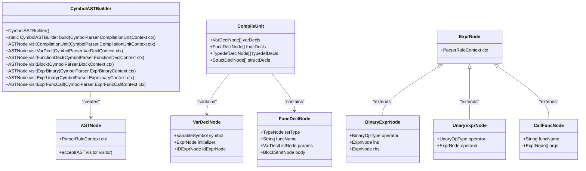
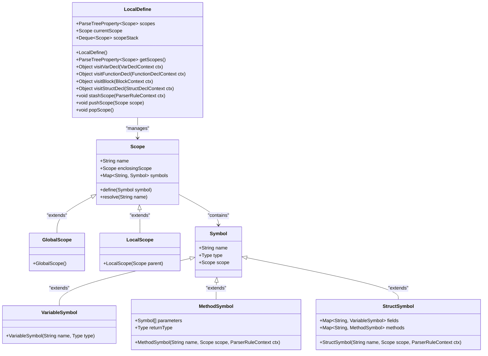
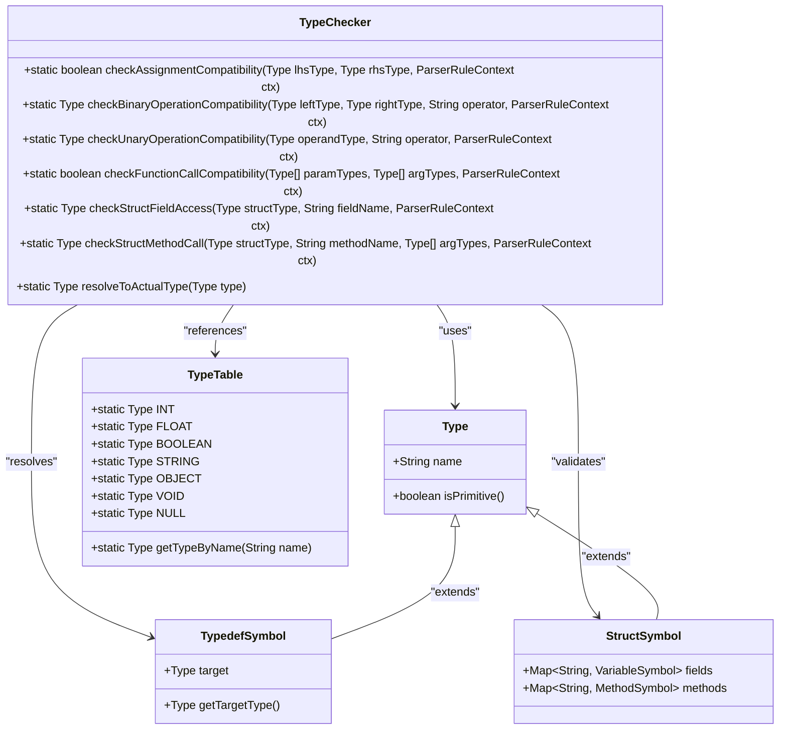
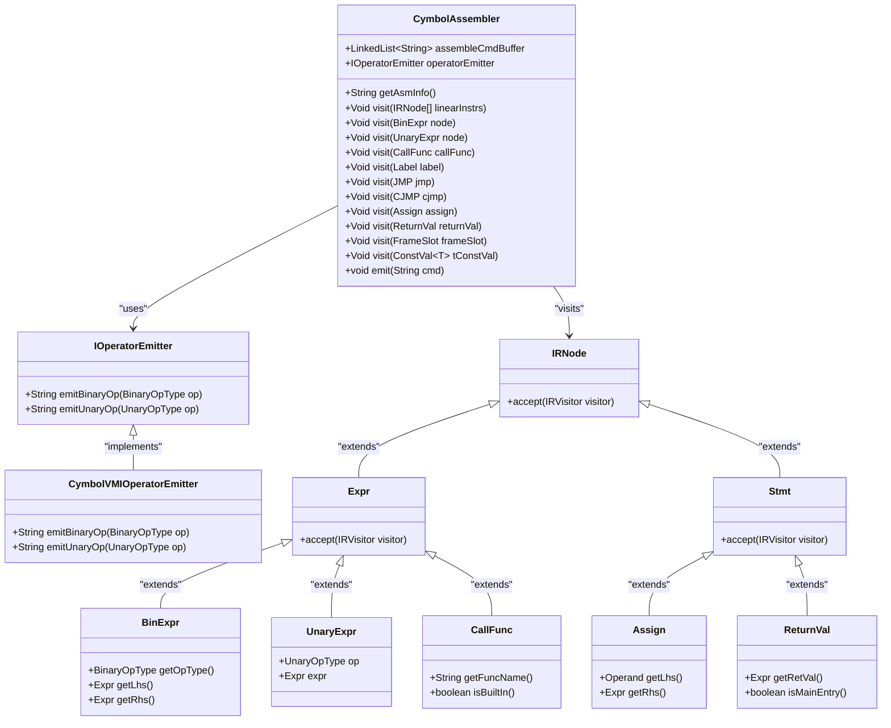
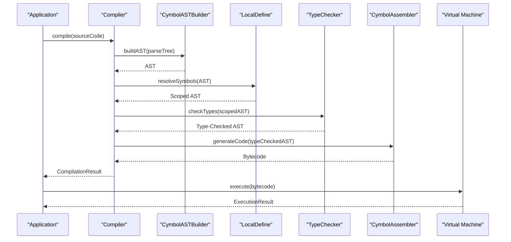

# API Reference

<cite>
**Referenced Files in This Document**   
- [Compiler.java](file://ep14/src/main/java/org/teachfx/antlr4/ep14/Compiler.java)
- [Compiler.java](file://ep16/src/main/java/org/teachfx/antlr4/ep16/Compiler.java)
- [Compiler.java](file://ep17/src/main/java/org/teachfx/antlr4/ep17/Compiler.java)
- [Compiler.java](file://ep19/src/main/java/org/teachfx/antlr4/ep19/Compiler.java)
- [Compiler.java](file://ep20/src/main/java/org/teachfx/antlr4/ep20/Compiler.java)
- [Compiler.java](file://ep21/src/main/java/org/teachfx/antlr4/ep21/Compiler.java)
- [CymbolASTBuilder.java](file://ep20/src/main/java/org/teachfx/antlr4/ep20/pass/ast/CymbolASTBuilder.java)
- [CymbolASTBuilder.java](file://ep21/src/main/java/org/teachfx/antlr4/ep21/pass/ast/CymbolASTBuilder.java)
- [LocalDefine.java](file://ep16/src/main/java/org/teachfx/antlr4/ep16/visitor/LocalDefine.java)
- [LocalDefine.java](file://ep19/src/main/java/org/teachfx/antlr4/ep19/pass/LocalDefine.java)
- [LocalDefine.java](file://ep20/src/main/java/org/teachfx/antlr4/ep20/pass/symtab/LocalDefine.java)
- [LocalDefine.java](file://ep21/src/main/java/org/teachfx/antlr4/ep21/pass/symtab/LocalDefine.java)
- [TypeChecker.java](file://ep19/src/main/java/org/teachfx/antlr4/ep19/symtab/TypeChecker.java)
- [TypeChecker.java](file://ep20/src/main/java/org/teachfx/antlr4/ep20/pass/sematic/TypeChecker.java)
- [TypeChecker.java](file://ep21/src/main/java/org/teachfx/antlr4/ep21/pass/sematic/TypeChecker.java)
- [CymbolAssembler.java](file://ep19/src/main/java/org/teachfx/antlr4/ep19/pass/CymbolAssembler.java)
- [CymbolAssembler.java](file://ep20/src/main/java/org/teachfx/antlr4/ep20/pass/codegen/CymbolAssembler.java)
- [CymbolAssembler.java](file://ep21/src/main/java/org/teachfx/antlr4/ep21/pass/codegen/CymbolAssembler.java)
</cite>

## Table of Contents
1. [Introduction](#introduction)
2. [Compiler Class Overview](#compiler-class-overview)
3. [Compilation Phases](#compilation-phases)
   - [AST Construction](#ast-construction)
   - [Symbol Resolution](#symbol-resolution)
   - [Type Checking](#type-checking)
   - [Code Generation](#code-generation)
4. [Configuration and Builder Patterns](#configuration-and-builder-patterns)
5. [Usage Examples](#usage-examples)
6. [Thread Safety and Lifecycle Management](#thread-safety-and-lifecycle-management)
7. [Version Compatibility](#version-compatibility)

## Introduction
This document provides comprehensive API documentation for the compiler framework's public interfaces. It details the Compiler class and its public methods for programmatic access to compilation functionality. The documentation covers all major compilation phases including AST construction, symbol resolution, type checking, and code generation. This reference is designed for developers who want to integrate the compiler as a library in their applications.

## Compiler Class Overview

The Compiler class serves as the main entry point for the compilation process. It orchestrates the various compilation phases and provides a unified interface for programmatic access to compilation functionality. The class follows a builder pattern for configuration and supports customization of the compilation workflow.

**Section sources**
- [Compiler.java](file://ep14/src/main/java/org/teachfx/antlr4/ep14/Compiler.java)
- [Compiler.java](file://ep16/src/main/java/org/teachfx/antlr4/ep16/Compiler.java)
- [Compiler.java](file://ep17/src/main/java/org/teachfx/antlr4/ep17/Compiler.java)
- [Compiler.java](file://ep19/src/main/java/org/teachfx/antlr4/ep19/Compiler.java)
- [Compiler.java](file://ep20/src/main/java/org/teachfx/antlr4/ep20/Compiler.java)
- [Compiler.java](file://ep21/src/main/java/org/teachfx/antlr4/ep21/Compiler.java)

## Compilation Phases

### AST Construction

The AST construction phase is handled by the CymbolASTBuilder class, which transforms the parse tree into an Abstract Syntax Tree (AST). The builder implements the visitor pattern to traverse the parse tree and construct corresponding AST nodes.

**Diagram sources**
- [CymbolASTBuilder.java](file://ep20/src/main/java/org/teachfx/antlr4/ep20/pass/ast/CymbolASTBuilder.java)
- [CymbolASTBuilder.java](file://ep21/src/main/java/org/teachfx/antlr4/ep21/pass/ast/CymbolASTBuilder.java)

**Section sources**
- [CymbolASTBuilder.java](file://ep20/src/main/java/org/teachfx/antlr4/ep20/pass/ast/CymbolASTBuilder.java)
- [CymbolASTBuilder.java](file://ep21/src/main/java/org/teachfx/antlr4/ep21/pass/ast/CymbolASTBuilder.java)

### Symbol Resolution

The symbol resolution phase is implemented by the LocalDefine class, which establishes symbol tables and resolves references between symbols. This phase creates a hierarchical scope structure and binds identifiers to their corresponding symbol definitions.

**Diagram sources**
- [LocalDefine.java](file://ep16/src/main/java/org/teachfx/antlr4/ep16/visitor/LocalDefine.java)
- [LocalDefine.java](file://ep19/src/main/java/org/teachfx/antlr4/ep19/pass/LocalDefine.java)
- [LocalDefine.java](file://ep20/src/main/java/org/teachfx/antlr4/ep20/pass/symtab/LocalDefine.java)
- [LocalDefine.java](file://ep21/src/main/java/org/teachfx/antlr4/ep21/pass/symtab/LocalDefine.java)

**Section sources**
- [LocalDefine.java](file://ep16/src/main/java/org/teachfx/antlr4/ep16/visitor/LocalDefine.java)
- [LocalDefine.java](file://ep19/src/main/java/org/teachfx/antlr4/ep19/pass/LocalDefine.java)
- [LocalDefine.java](file://ep20/src/main/java/org/teachfx/antlr4/ep20/pass/symtab/LocalDefine.java)
- [LocalDefine.java](file://ep21/src/main/java/org/teachfx/antlr4/ep21/pass/symtab/LocalDefine.java)

### Type Checking

The type checking phase validates type compatibility across the program. The TypeChecker class implements static type checking rules for assignments, expressions, function calls, and other language constructs. It ensures type safety and reports type errors during compilation.

**Diagram sources**
- [TypeChecker.java](file://ep19/src/main/java/org/teachfx/antlr4/ep19/symtab/TypeChecker.java)
- [TypeChecker.java](file://ep20/src/main/java/org/teachfx/antlr4/ep20/pass/sematic/TypeChecker.java)
- [TypeChecker.java](file://ep21/src/main/java/org/teachfx/antlr4/ep21/pass/sematic/TypeChecker.java)

**Section sources**
- [TypeChecker.java](file://ep19/src/main/java/org/teachfx/antlr4/ep19/symtab/TypeChecker.java)
- [TypeChecker.java](file://ep20/src/main/java/org/teachfx/antlr4/ep20/pass/sematic/TypeChecker.java)
- [TypeChecker.java](file://ep21/src/main/java/org/teachfx/antlr4/ep21/pass/sematic/TypeChecker.java)

### Code Generation

The code generation phase transforms the typed AST into executable bytecode. The CymbolAssembler class implements the code generation logic, translating high-level language constructs into stack-based virtual machine instructions.

**Diagram sources**
- [CymbolAssembler.java](file://ep19/src/main/java/org/teachfx/antlr4/ep19/pass/CymbolAssembler.java)
- [CymbolAssembler.java](file://ep20/src/main/java/org/teachfx/antlr4/ep20/pass/codegen/CymbolAssembler.java)
- [CymbolAssembler.java](file://ep21/src/main/java/org/teachfx/antlr4/ep21/pass/codegen/CymbolAssembler.java)

**Section sources**
- [CymbolAssembler.java](file://ep19/src/main/java/org/teachfx/antlr4/ep19/pass/CymbolAssembler.java)
- [CymbolAssembler.java](file://ep20/src/main/java/org/teachfx/antlr4/ep20/pass/codegen/CymbolAssembler.java)
- [CymbolAssembler.java](file://ep21/src/main/java/org/teachfx/antlr4/ep21/pass/codegen/CymbolAssembler.java)

## Configuration and Builder Patterns

The compiler framework provides flexible configuration options through builder patterns. Developers can customize the compilation workflow by configuring various aspects of the compilation process, including optimization levels, debugging information, and target platform settings.

**Section sources**
- [Compiler.java](file://ep19/src/main/java/org/teachfx/antlr4/ep19/Compiler.java)
- [Compiler.java](file://ep20/src/main/java/org/teachfx/antlr4/ep20/Compiler.java)
- [Compiler.java](file://ep21/src/main/java/org/teachfx/antlr4/ep21/Compiler.java)

## Usage Examples

The following examples demonstrate how to integrate the compiler as a library and use its public APIs for programmatic compilation.

**Diagram sources**
- [Compiler.java](file://ep20/src/main/java/org/teachfx/antlr4/ep20/Compiler.java)
- [CymbolASTBuilder.java](file://ep20/src/main/java/org/teachfx/antlr4/ep20/pass/ast/CymbolASTBuilder.java)
- [LocalDefine.java](file://ep20/src/main/java/org/teachfx/antlr4/ep20/pass/symtab/LocalDefine.java)
- [TypeChecker.java](file://ep20/src/main/java/org/teachfx/antlr4/ep20/pass/sematic/TypeChecker.java)
- [CymbolAssembler.java](file://ep20/src/main/java/org/teachfx/antlr4/ep20/pass/codegen/CymbolAssembler.java)

**Section sources**
- [Compiler.java](file://ep20/src/main/java/org/teachfx/antlr4/ep20/Compiler.java)
- [CymbolASTBuilder.java](file://ep20/src/main/java/org/teachfx/antlr4/ep20/pass/ast/CymbolASTBuilder.java)
- [LocalDefine.java](file://ep20/src/main/java/org/teachfx/antlr4/ep20/pass/symtab/LocalDefine.java)
- [TypeChecker.java](file://ep20/src/main/java/org/teachfx/antlr4/ep20/pass/sematic/TypeChecker.java)
- [CymbolAssembler.java](file://ep20/src/main/java/org/teachfx/antlr4/ep20/pass/codegen/CymbolAssembler.java)

## Thread Safety and Lifecycle Management

The compiler components are designed with thread safety considerations in mind. Each compilation unit should use its own instance of the compiler to avoid concurrency issues. The lifecycle of compiler components follows a clear pattern from initialization to cleanup.

**Section sources**
- [Compiler.java](file://ep20/src/main/java/org/teachfx/antlr4/ep20/Compiler.java)
- [Compiler.java](file://ep21/src/main/java/org/teachfx/antlr4/ep21/Compiler.java)

## Version Compatibility

The compiler framework maintains backward compatibility across versions. Deprecated APIs are marked with appropriate annotations and will be supported for at least two major releases before removal. Developers should consult the deprecation policy for migration guidance when upgrading between versions.

**Section sources**
- [Compiler.java](file://ep19/src/main/java/org/teachfx/antlr4/ep19/Compiler.java)
- [Compiler.java](file://ep20/src/main/java/org/teachfx/antlr4/ep20/Compiler.java)
- [Compiler.java](file://ep21/src/main/java/org/teachfx/antlr4/ep21/Compiler.java)