# AST Construction API

<cite>
**Referenced Files in This Document**   
- [CymbolASTBuilder.java](file://ep20/src/main/java/org/teachfx/antlr4/ep20/pass/ast/CymbolASTBuilder.java)
- [ASTNode.java](file://ep20/src/main/java/org/teachfx/antlr4/ep20/ast/ASTNode.java)
- [ExprNode.java](file://ep20/src/main/java/org/teachfx/antlr4/ep20/ast/expr/ExprNode.java)
- [StmtNode.java](file://ep20/src/main/java/org/teachfx/antlr4/ep20/ast/stmt/StmtNode.java)
- [VarDeclNode.java](file://ep20/src/main/java/org/teachfx/antlr4/ep20/ast/decl/VarDeclNode.java)
- [BlockStmtNode.java](file://ep20/src/main/java/org/teachfx/antlr4/ep20/ast/stmt/BlockStmtNode.java)
- [BinaryExprNode.java](file://ep20/src/main/java/org/teachfx/antlr4/ep20/ast/expr/BinaryExprNode.java)
- [ASTVisitor.java](file://ep20/src/main/java/org/teachfx/antlr4/ep20/ast/ASTVisitor.java)
</cite>

## Table of Contents
1. [Introduction](#introduction)
2. [Core Components](#core-components)
3. [Architecture Overview](#architecture-overview)
4. [Detailed Component Analysis](#detailed-component-analysis)
5. [Dependency Analysis](#dependency-analysis)
6. [Performance Considerations](#performance-considerations)
7. [Troubleshooting Guide](#troubleshooting-guide)
8. [Conclusion](#conclusion)

## Introduction
This document provides comprehensive API documentation for the AST construction components in the Cymbol compiler implementation, focusing on the CymbolASTBuilder class and its role in transforming ANTLR4 parse trees into abstract syntax trees (AST). The documentation covers the visitor pattern implementation, AST node hierarchy, and various AST node types including expressions, statements, and declarations. It also explains how to programmatically use the AST builder, traverse the resulting AST, and handle errors during AST construction with recovery strategies for malformed input.

## Core Components
The AST construction system is built around the CymbolASTBuilder class which implements the visitor pattern to traverse the ANTLR4 parse tree and construct AST nodes. The core components include the ASTNode base class, various specialized node types for different language constructs, and the ASTVisitor interface for traversing the constructed AST. The system follows a hierarchical structure where the CompileUnit serves as the root node containing declarations, statements, and other program elements.

**Section sources**
- [CymbolASTBuilder.java](file://ep20/src/main/java/org/teachfx/antlr4/ep20/pass/ast/CymbolASTBuilder.java#L25-L317)
- [ASTNode.java](file://ep20/src/main/java/org/teachfx/antlr4/ep20/ast/ASTNode.java#L8-L46)

## Architecture Overview
The AST construction architecture follows a visitor pattern implementation where the CymbolASTBuilder traverses the ANTLR4 parse tree and constructs corresponding AST nodes. The architecture separates the parse tree representation from the abstract syntax tree, allowing for semantic analysis and code generation in subsequent compilation phases. The AST nodes maintain references to their corresponding parse tree contexts for error reporting and source location tracking.

**Diagram sources**
- [CymbolASTBuilder.java](file://ep20/src/main/java/org/teachfx/antlr4/ep20/pass/ast/CymbolASTBuilder.java#L25-L317)
- [ASTNode.java](file://ep20/src/main/java/org/teachfx/antlr4/ep20/ast/ASTNode.java#L8-L46)
- [ExprNode.java](file://ep20/src/main/java/org/teachfx/antlr4/ep20/ast/expr/ExprNode.java#L8-L41)
- [StmtNode.java](file://ep20/src/main/java/org/teachfx/antlr4/ep20/ast/stmt/StmtNode.java#L8-L22)
- [VarDeclNode.java](file://ep20/src/main/java/org/teachfx/antlr4/ep20/ast/decl/VarDeclNode.java#L8-L67)
- [BlockStmtNode.java](file://ep20/src/main/java/org/teachfx/antlr4/ep20/ast/stmt/BlockStmtNode.java#L8-L47)
- [BinaryExprNode.java](file://ep20/src/main/java/org/teachfx/antlr4/ep20/ast/expr/BinaryExprNode.java#L8-L96)
- [ASTVisitor.java](file://ep20/src/main/java/org/teachfx/antlr4/ep20/ast/ASTVisitor.java#L8-L123)

## Detailed Component Analysis

### CymbolASTBuilder Analysis
The CymbolASTBuilder class is the core component responsible for transforming ANTLR4 parse trees into abstract syntax trees. It extends CymbolBaseVisitor and implements the CymbolVisitor interface, following the visitor pattern to traverse the parse tree and construct corresponding AST nodes. The builder provides a static factory method `build()` that takes a CompilationUnitContext and returns a fully constructed CymbolASTBuilder instance.

**Diagram sources**
- [CymbolASTBuilder.java](file://ep20/src/main/java/org/teachfx/antlr4/ep20/pass/ast/CymbolASTBuilder.java#L25-L317)

**Section sources**
- [CymbolASTBuilder.java](file://ep20/src/main/java/org/teachfx/antlr4/ep20/pass/ast/CymbolASTBuilder.java#L25-L317)

### AST Node Hierarchy Analysis
The AST node hierarchy is structured with ASTNode as the abstract base class that all AST nodes extend. The hierarchy separates nodes into different categories based on their role in the program structure: expressions, statements, declarations, and types. Each node type contains specific properties and methods relevant to its purpose, while inheriting common functionality from the base ASTNode class.

```mermaid
classDiagram
class ASTNode {
+ParserRuleContext ctx
+Location getLocation()
+void accept(ASTVisitor visitor)
}
class ExprNode {
+TypeNode exprType
+boolean isLValue
}
class StmtNode {
+Scope scope
}
class DeclNode {
+String declName
+Object refSymbol
}
class TypeNode {
+Type baseType
}
ASTNode <|-- ExprNode
ASTNode <|-- StmtNode
ASTNode <|-- DeclNode
ASTNode <|-- TypeNode
ASTNode <|-- CompileUnit
class BinaryExprNode {
+BinaryOpType opType
+ExprNode lhs
+ExprNode rhs
}
class IDExprNode {
+String name
+VariableSymbol refSymbol
}
class IntExprNode {
+int value
}
class FloatExprNode {
+double value
}
class BoolExprNode {
+boolean value
}
class StringExprNode {
+String value
}
class UnaryExprNode {
+UnaryOpType opType
+ExprNode operand
}
class CallFuncNode {
+String funcName
+ExprNode[] arguments
}
class ArrayAccessNode {
+ExprNode array
+ExprNode index
}
class FieldAccessNode {
+ExprNode object
+String fieldName
}
class CastExprNode {
+TypeNode targetType
+ExprNode expression
}
class ArrayLiteralNode {
+ExprNode[] elements
}
class BlockStmtNode {
+StmtNode[] statements
+ScopeType scopeType
}
class IfStmtNode {
+ExprNode condition
+StmtNode thenBranch
+StmtNode elseBranch
}
class WhileStmtNode {
+ExprNode condition
+StmtNode body
}
class ReturnStmtNode {
+ExprNode returnValue
}
class AssignStmtNode {
+ExprNode left
+ExprNode right
}
class ExprStmtNode {
+ExprNode expression
}
class VarDeclStmtNode {
+VarDeclNode declaration
}
class VarDeclNode {
+VariableSymbol symbol
+ExprNode initializer
+IDExprNode idNode
}
class FuncDeclNode {
+TypeNode returnType
+String funcName
+VarDeclListNode parameters
+BlockStmtNode body
}
class StructDeclNode {
+String structName
+StructMemberNode[] members
}
class StructMemberNode {
+TypeNode memberType
+String memberName
+int arraySize
}
class TypedefDeclNode {
+TypeNode originalType
+String aliasName
}
class CompileUnit {
+VarDeclNode[] globalVars
+FuncDeclNode[] functions
+TypedefDeclNode[] typedefs
+StructDeclNode[] structs
}
ExprNode <|-- BinaryExprNode
ExprNode <|-- IDExprNode
ExprNode <|-- IntExprNode
ExprNode <|-- FloatExprNode
ExprNode <|-- BoolExprNode
ExprNode <|-- StringExprNode
ExprNode <|-- UnaryExprNode
ExprNode <|-- CallFuncNode
ExprNode <|-- ArrayAccessNode
ExprNode <|-- FieldAccessNode
ExprNode <|-- CastExprNode
ExprNode <|-- ArrayLiteralNode
StmtNode <|-- BlockStmtNode
StmtNode <|-- IfStmtNode
StmtNode <|-- WhileStmtNode
StmtNode <|-- ReturnStmtNode
StmtNode <|-- AssignStmtNode
StmtNode <|-- ExprStmtNode
StmtNode <|-- VarDeclStmtNode
StmtNode <|-- BreakStmtNode
StmtNode <|-- ContinueStmtNode
DeclNode <|-- VarDeclNode
DeclNode <|-- FuncDeclNode
DeclNode <|-- StructDeclNode
DeclNode <|-- TypedefDeclNode
ASTNode "1" *-- "0..*" ASTNode : contains
CompileUnit "1" *-- "0..*" VarDeclNode : contains
CompileUnit "1" *-- "0..*" FuncDeclNode : contains
CompileUnit "1" *-- "0..*" TypedefDeclNode : contains
CompileUnit "1" *-- "0..*" StructDeclNode : contains
BlockStmtNode "1" *-- "0..*" StmtNode : contains
BinaryExprNode "1" -- "1" ExprNode : left
BinaryExprNode "1" -- "1" ExprNode : right
AssignStmtNode "1" -- "1" ExprNode : left
AssignStmtNode "1" -- "1" ExprNode : right
CallFuncNode "1" *-- "0..*" ExprNode : arguments
IfStmtNode "1" -- "1" ExprNode : condition
IfStmtNode "1" -- "1" StmtNode : then
IfStmtNode "1" -- "0..1" StmtNode : else
WhileStmtNode "1" -- "1" ExprNode : condition
WhileStmtNode "1" -- "1" StmtNode : body
ReturnStmtNode "1" -- "0..1" ExprNode : value
VarDeclNode "1" -- "0..1" ExprNode : initializer
FuncDeclNode "1" -- "1" TypeNode : return type
FuncDeclNode "1" -- "1" VarDeclListNode : parameters
FuncDeclNode "1" -- "0..1" BlockStmtNode : body
StructDeclNode "1" *-- "0..*" StructMemberNode : members
StructMemberNode "1" -- "1" TypeNode : type
TypedefDeclNode "1" -- "1" TypeNode : original type
ArrayAccessNode "1" -- "1" ExprNode : array
ArrayAccessNode "1" -- "1" ExprNode : index
FieldAccessNode "1" -- "1" ExprNode : object
FieldAccessNode "1" -- "1" String : field name
CastExprNode "1" -- "1" TypeNode : target type
CastExprNode "1" -- "1" ExprNode : expression
ArrayLiteralNode "1" *-- "0..*" ExprNode : elements
```

**Diagram sources**
- [ASTNode.java](file://ep20/src/main/java/org/teachfx/antlr4/ep20/ast/ASTNode.java#L8-L46)
- [ExprNode.java](file://ep20/src/main/java/org/teachfx/antlr4/ep20/ast/expr/ExprNode.java#L8-L41)
- [StmtNode.java](file://ep20/src/main/java/org/teachfx/antlr4/ep20/ast/stmt/StmtNode.java#L8-L22)
- [VarDeclNode.java](file://ep20/src/main/java/org/teachfx/antlr4/ep20/ast/decl/VarDeclNode.java#L8-L67)
- [BlockStmtNode.java](file://ep20/src/main/java/org/teachfx/antlr4/ep20/ast/stmt/BlockStmtNode.java#L8-L47)
- [BinaryExprNode.java](file://ep20/src/main/java/org/teachfx/antlr4/ep20/ast/expr/BinaryExprNode.java#L8-L96)

**Section sources**
- [ASTNode.java](file://ep20/src/main/java/org/teachfx/antlr4/ep20/ast/ASTNode.java#L8-L46)
- [ExprNode.java](file://ep20/src/main/java/org/teachfx/antlr4/ep20/ast/expr/ExprNode.java#L8-L41)
- [StmtNode.java](file://ep20/src/main/java/org/teachfx/antlr4/ep20/ast/stmt/StmtNode.java#L8-L22)

### Visitor Pattern Implementation Analysis
The visitor pattern implementation allows for separation of algorithms from the object structure on which they operate. The CymbolASTBuilder implements the visitor pattern to traverse the parse tree and construct AST nodes, while the ASTVisitor interface enables traversal of the constructed AST for semantic analysis, code generation, or other operations. This design follows the classic visitor pattern where each node type has a corresponding visit method.

**Diagram sources**
- [CymbolASTBuilder.java](file://ep20/src/main/java/org/teachfx/antlr4/ep20/pass/ast/CymbolASTBuilder.java#L25-L317)

**Section sources**
- [CymbolASTBuilder.java](file://ep20/src/main/java/org/teachfx/antlr4/ep20/pass/ast/CymbolASTBuilder.java#L25-L317)

## Dependency Analysis
The AST construction components have a clear dependency hierarchy where higher-level components depend on lower-level ones. The CymbolASTBuilder depends on all AST node classes to construct the tree, while AST nodes depend on the base ASTNode class and related utility classes. The visitor pattern creates a bidirectional dependency between the AST nodes and the visitor interface, enabling traversal operations.

**Diagram sources**
- [CymbolASTBuilder.java](file://ep20/src/main/java/org/teachfx/antlr4/ep20/pass/ast/CymbolASTBuilder.java#L25-L317)
- [ASTNode.java](file://ep20/src/main/java/org/teachfx/antlr4/ep20/ast/ASTNode.java#L8-L46)
- [ExprNode.java](file://ep20/src/main/java/org/teachfx/antlr4/ep20/ast/expr/ExprNode.java#L8-L41)
- [StmtNode.java](file://ep20/src/main/java/org/teachfx/antlr4/ep20/ast/stmt/StmtNode.java#L8-L22)
- [VarDeclNode.java](file://ep20/src/main/java/org/teachfx/antlr4/ep20/ast/decl/VarDeclNode.java#L8-L67)
- [BlockStmtNode.java](file://ep20/src/main/java/org/teachfx/antlr4/ep20/ast/stmt/BlockStmtNode.java#L8-L47)
- [BinaryExprNode.java](file://ep20/src/main/java/org/teachfx/antlr4/ep20/ast/expr/BinaryExprNode.java#L8-L96)
- [ASTVisitor.java](file://ep20/src/main/java/org/teachfx/antlr4/ep20/ast/ASTVisitor.java#L8-L123)

**Section sources**
- [CymbolASTBuilder.java](file://ep20/src/main/java/org/teachfx/antlr4/ep20/pass/ast/CymbolASTBuilder.java#L25-L317)
- [ASTNode.java](file://ep20/src/main/java/org/teachfx/antlr4/ep20/ast/ASTNode.java#L8-L46)

## Performance Considerations
The AST construction process is designed to be efficient by leveraging the visitor pattern and streaming operations where appropriate. The CymbolASTBuilder processes the parse tree in a single pass, constructing AST nodes as it traverses the tree. The use of Java streams in methods like visitFormalParameters and visitArrayInitializer provides efficient processing of collections. The AST nodes are lightweight objects that maintain references to their parse tree contexts rather than duplicating source text, minimizing memory usage.

## Troubleshooting Guide
When encountering issues with AST construction, consider the following common problems and solutions:

1. **Null pointer exceptions during AST construction**: Ensure that all parse tree contexts are properly handled and that optional elements (like initializers) are checked for null values before processing.

2. **Incorrect AST node relationships**: Verify that parent-child relationships between nodes are properly established, especially in complex statements like if-else or while loops.

3. **Type resolution issues**: Check that type nodes are properly constructed and that symbol references are correctly established, particularly for variable declarations and function calls.

4. **Malformed input handling**: The AST builder should gracefully handle malformed input by implementing error recovery strategies, such as skipping invalid nodes or providing default values.

5. **Visitor method not being called**: Ensure that all grammar rules have corresponding visit methods in the CymbolASTBuilder class and that the method signatures match the parse tree context types.

**Section sources**
- [CymbolASTBuilder.java](file://ep20/src/main/java/org/teachfx/antlr4/ep20/pass/ast/CymbolASTBuilder.java#L25-L317)

## Conclusion
The AST construction API provides a robust framework for transforming ANTLR4 parse trees into abstract syntax trees for the Cymbol programming language. The CymbolASTBuilder class implements the visitor pattern to traverse the parse tree and construct a hierarchical AST representation of the source code. The AST node hierarchy is well-organized with clear separation between expressions, statements, declarations, and types. The system supports comprehensive language features including variables, functions, control flow statements, and complex expressions. The visitor pattern enables extensible processing of the AST for semantic analysis, code generation, and other compilation phases. The implementation demonstrates good software engineering practices with clear separation of concerns and efficient memory usage.