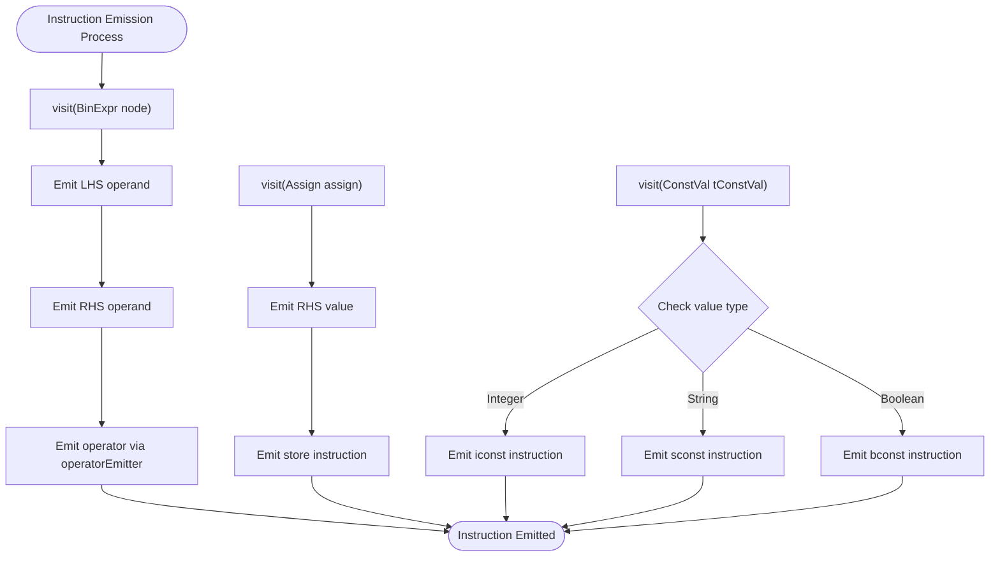
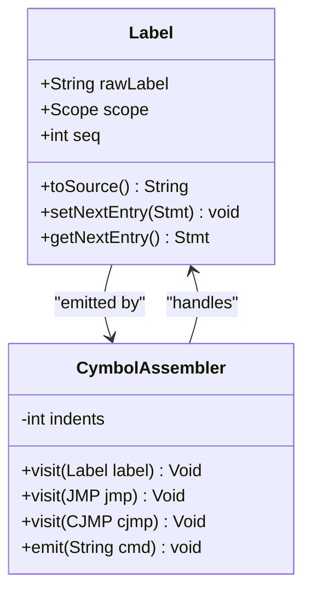
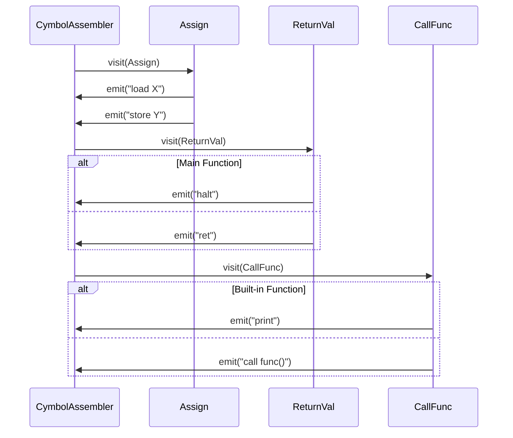
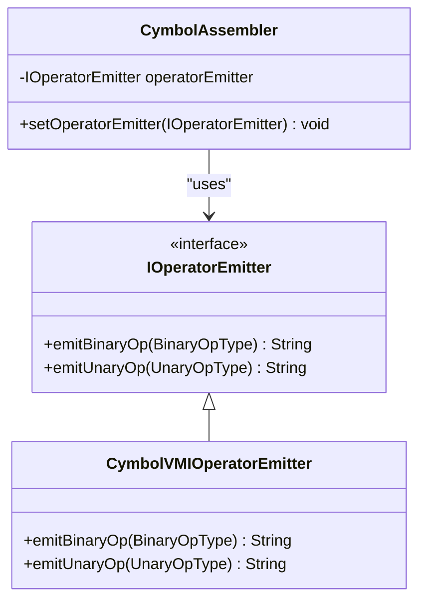
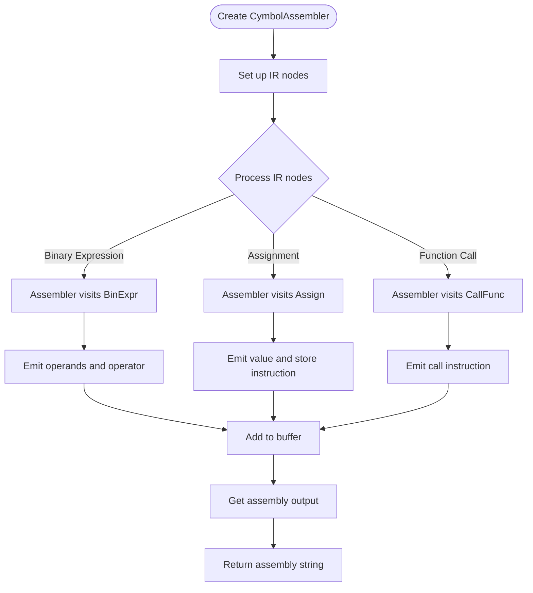
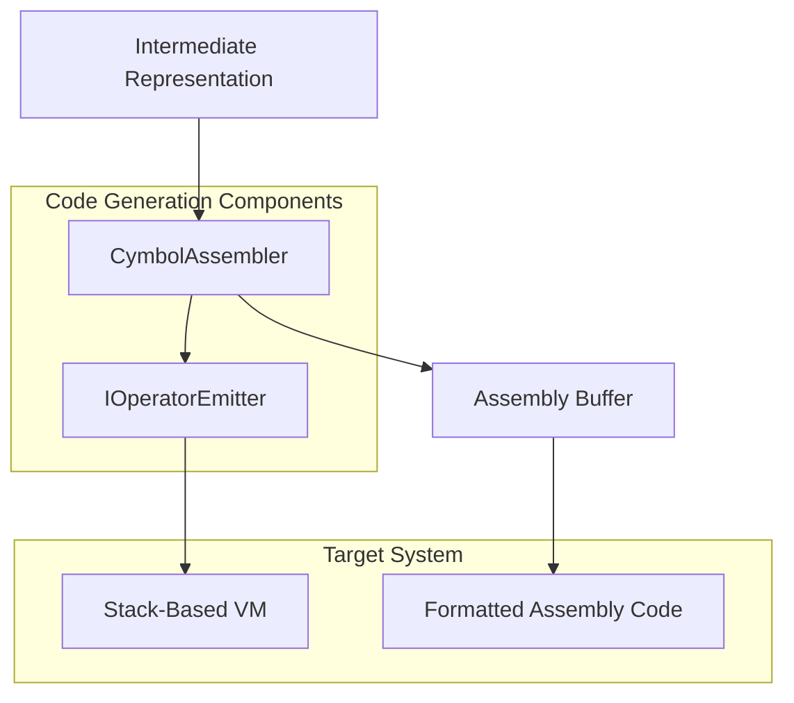

# Code Generation API

<cite>
**Referenced Files in This Document**   
- [CymbolAssembler.java](file://ep20/src/main/java/org/teachfx/antlr4/ep20/pass/codegen/CymbolAssembler.java)
- [IOperatorEmitter.java](file://ep20/src/main/java/org/teachfx/antlr4/ep20/pass/codegen/IOperatorEmitter.java)
- [CymbolVMIOperatorEmitter.java](file://ep20/src/main/java/org/teachfx/antlr4/ep20/pass/codegen/CymbolVMIOperatorEmitter.java)
- [BinExpr.java](file://ep20/src/main/java/org/teachfx/antlr4/ep20/ir/expr/arith/BinExpr.java)
- [Assign.java](file://ep20/src/main/java/org/teachfx/antlr4/ep20/ir/stmt/Assign.java)
- [ReturnVal.java](file://ep20/src/main/java/org/teachfx/antlr4/ep20/ir/stmt/ReturnVal.java)
- [FrameSlot.java](file://ep20/src/main/java/org/teachfx/antlr4/ep20/ir/expr/addr/FrameSlot.java)
- [Label.java](file://ep20/src/main/java/org/teachfx/antlr4/ep20/ir/stmt/Label.java)
</cite>

## Table of Contents
1. [Introduction](#introduction)
2. [Core Components](#core-components)
3. [Instruction Emission API](#instruction-emission-api)
4. [Label Management](#label-management)
5. [Function Code Generation](#function-code-generation)
6. [Extensibility Mechanism](#extensibility-mechanism)
7. [Programmatic Usage Examples](#programmatic-usage-examples)
8. [Output Format Customization](#output-format-customization)
9. [Source Location Mapping](#source-location-mapping)
10. [Architecture Overview](#architecture-overview)

## Introduction
This document provides comprehensive documentation for the code generation components in the Cymbol compiler, focusing on the transformation of intermediate representation (IR) into assembly code for a stack-based virtual machine. The API enables programmatic code generation, instruction emission, label management, and function code generation through the `CymbolAssembler` class and the `IOperatorEmitter` interface. The system supports extensibility for custom code generators and maintains source location information for debugging purposes.

## Core Components

The code generation system consists of two primary components: the `CymbolAssembler` class responsible for traversing the intermediate representation and emitting assembly instructions, and the `IOperatorEmitter` interface that defines the contract for operator-specific instruction generation. These components work together to transform high-level IR nodes into low-level virtual machine instructions.

**Section sources**
- [CymbolAssembler.java](file://ep20/src/main/java/org/teachfx/antlr4/ep20/pass/codegen/CymbolAssembler.java#L17-L154)
- [IOperatorEmitter.java](file://ep20/src/main/java/org/teachfx/antlr4/ep20/pass/codegen/IOperatorEmitter.java#L4-L8)

## Instruction Emission API

The instruction emission API provides methods for generating virtual machine instructions from intermediate representation nodes. The `CymbolAssembler` implements the `IRVisitor` interface to traverse the IR tree and emit appropriate assembly commands for each node type.

**Diagram sources**
- [CymbolAssembler.java](file://ep20/src/main/java/org/teachfx/antlr4/ep20/pass/codegen/CymbolAssembler.java#L55-L70)
- [CymbolAssembler.java](file://ep20/src/main/java/org/teachfx/antlr4/ep20/pass/codegen/CymbolAssembler.java#L120-L140)

## Label Management

The label management system handles the creation and emission of labels for control flow instructions. Labels are used for function entries, jump targets, and conditional branching. The assembler maintains proper indentation and nesting for readable assembly output.

**Diagram sources**
- [Label.java](file://ep20/src/main/java/org/teachfx/antlr4/ep20/ir/stmt/Label.java#L0-L114)
- [CymbolAssembler.java](file://ep20/src/main/java/org/teachfx/antlr4/ep20/pass/codegen/CymbolAssembler.java#L80-L105)

## Function Code Generation

The function code generation system handles the emission of function entry points, parameter handling, local variable management, and return instructions. The assembler generates appropriate prologue and epilogue code for functions, including special handling for the main entry point.

**Diagram sources**
- [CymbolAssembler.java](file://ep20/src/main/java/org/teachfx/antlr4/ep20/pass/codegen/CymbolAssembler.java#L107-L118)
- [CymbolAssembler.java](file://ep20/src/main/java/org/teachfx/antlr4/ep20/pass/codegen/CymbolAssembler.java#L119-L135)
- [Assign.java](file://ep20/src/main/java/org/teachfx/antlr4/ep20/ir/stmt/Assign.java#L0-L66)

## Extensibility Mechanism

The extensibility mechanism is implemented through the `IOperatorEmitter` interface, which allows for custom code generation strategies. The default implementation `CymbolVMIOperatorEmitter` maps Cymbol operators to stack-based virtual machine instructions, but alternative implementations can be provided for different target architectures.

**Diagram sources**
- [IOperatorEmitter.java](file://ep20/src/main/java/org/teachfx/antlr4/ep20/pass/codegen/IOperatorEmitter.java#L4-L8)
- [CymbolVMIOperatorEmitter.java](file://ep20/src/main/java/org/teachfx/antlr4/ep20/pass/codegen/CymbolVMIOperatorEmitter.java#L4-L64)
- [CymbolAssembler.java](file://ep20/src/main/java/org/teachfx/antlr4/ep20/pass/codegen/CymbolAssembler.java#L18-L19)

## Programmatic Usage Examples

The code generation API can be used programmatically to generate assembly code from intermediate representation. The following examples demonstrate common usage patterns for the API.

**Diagram sources**
- [CymbolAssembler.java](file://ep20/src/main/java/org/teachfx/antlr4/ep20/pass/codegen/CymbolAssembler.java#L35-L53)
- [CymbolAssembler.java](file://ep20/src/main/java/org/teachfx/antlr4/ep20/pass/codegen/CymbolAssembler.java#L145-L152)

## Output Format Customization

The output format can be customized through the `emit` method and indentation system. The assembler automatically handles proper indentation for nested blocks and control structures, producing human-readable assembly code. The `getAsmInfo` method returns the complete assembly output as a formatted string.

**Section sources**
- [CymbolAssembler.java](file://ep20/src/main/java/org/teachfx/antlr4/ep20/pass/codegen/CymbolAssembler.java#L30-L33)
- [CymbolAssembler.java](file://ep20/src/main/java/org/teachfx/antlr4/ep20/pass/codegen/CymbolAssembler.java#L148-L152)

## Source Location Mapping

The code generation system preserves source location information through the intermediate representation nodes. While the current implementation focuses on instruction emission, the IR nodes contain references to their original source locations, enabling future debugging and error reporting capabilities.

**Section sources**
- [CymbolAssembler.java](file://ep20/src/main/java/org/teachfx/antlr4/ep20/pass/codegen/CymbolAssembler.java#L17-L154)

## Architecture Overview

The code generation architecture follows a visitor pattern to traverse the intermediate representation tree and emit corresponding assembly instructions. The system is designed with separation of concerns, where the assembler handles the traversal and emission logic, while the operator emitter handles the mapping of high-level operators to low-level instructions.

**Diagram sources**
- [CymbolAssembler.java](file://ep20/src/main/java/org/teachfx/antlr4/ep20/pass/codegen/CymbolAssembler.java#L17-L154)
- [IOperatorEmitter.java](file://ep20/src/main/java/org/teachfx/antlr4/ep20/pass/codegen/IOperatorEmitter.java#L4-L8)