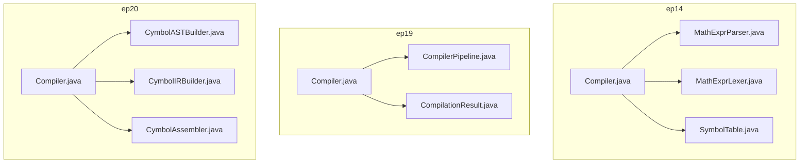
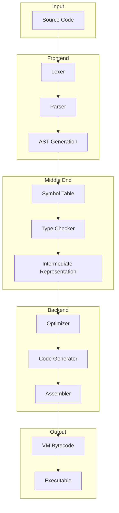
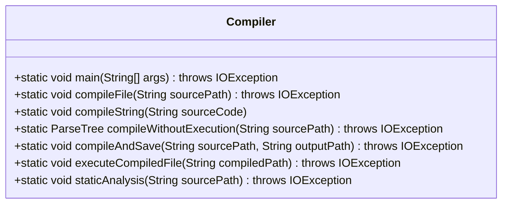
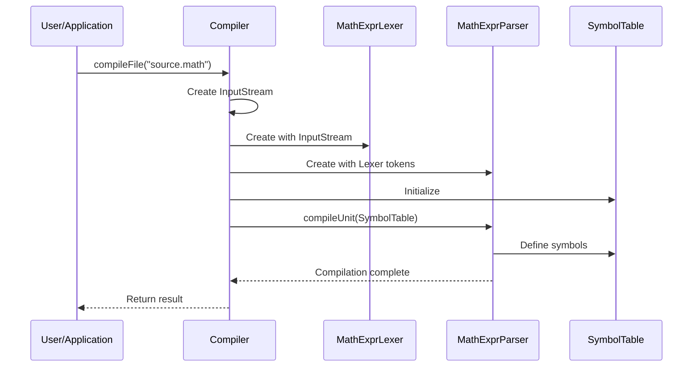
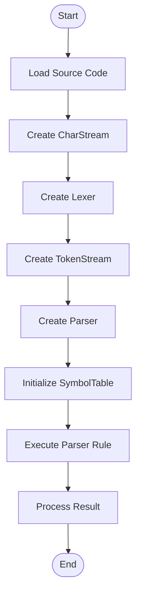
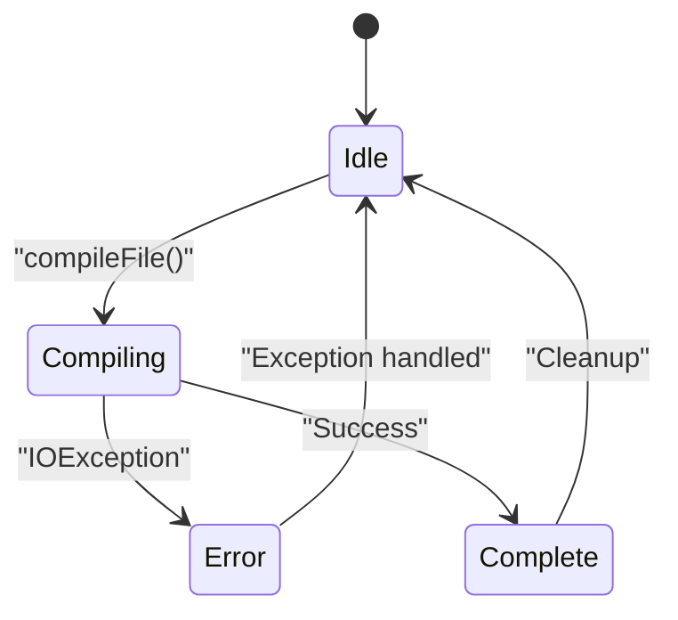
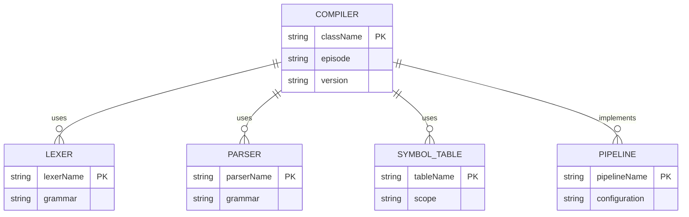

# Compiler Class API

<cite>
**Referenced Files in This Document**   
- [Compiler.java](file://ep14/src/main/java/org/teachfx/antlr4/ep14/Compiler.java)
- [MathExprParser.java](file://ep14/src/main/java/org/teachfx/antlr4/ep14/compiler/MathExprParser.java)
- [SymbolTable.java](file://ep14/src/main/java/org/teachfx/antlr4/ep14/symtab/SymbolTable.java)
- [MathExprLexer.java](file://ep14/src/main/java/org/teachfx/antlr4/ep14/compiler/MathExprLexer.java)
- [Compiler.java](file://ep19/src/main/java/org/teachfx/antlr4/ep19/Compiler.java)
- [Compiler.java](file://ep20/src/main/java/org/teachfx/antlr4/ep20/Compiler.java)
</cite>

## Table of Contents
1. [Introduction](#introduction)
2. [Project Structure](#project-structure)
3. [Core Components](#core-components)
4. [Architecture Overview](#architecture-overview)
5. [Detailed Component Analysis](#detailed-component-analysis)
6. [Dependency Analysis](#dependency-analysis)
7. [Performance Considerations](#performance-considerations)
8. [Troubleshooting Guide](#troubleshooting-guide)
9. [Conclusion](#conclusion)

## Introduction
The Compiler class serves as the main entry point for the compilation process in the ANTLR4-based language implementation framework. This documentation provides comprehensive API details for the Compiler class, covering its public methods, compilation workflow orchestration, usage patterns, and integration capabilities. The Compiler class coordinates various compilation phases including lexical analysis, parsing, symbol table management, and code generation, providing both command-line interface and programmatic API access.

## Project Structure
The Compiler class is implemented across multiple episodes in the project, with evolving functionality and complexity. The core implementation resides in the ep14, ep19, and ep20 directories, each representing different stages of development. The class structure follows a progressive enhancement pattern, starting with basic compilation functionality and evolving to support advanced features like static analysis, optimization, and code generation.

**Diagram sources**
- [Compiler.java](file://ep14/src/main/java/org/teachfx/antlr4/ep14/Compiler.java)
- [Compiler.java](file://ep19/src/main/java/org/teachfx/antlr4/ep19/Compiler.java)
- [Compiler.java](file://ep20/src/main/java/org/teachfx/antlr4/ep20/Compiler.java)

**Section sources**
- [Compiler.java](file://ep14/src/main/java/org/teachfx/antlr4/ep14/Compiler.java)
- [Compiler.java](file://ep19/src/main/java/org/teachfx/antlr4/ep19/Compiler.java)
- [Compiler.java](file://ep20/src/main/java/org/teachfx/antlr4/ep20/Compiler.java)

## Core Components
The Compiler class serves as the central orchestrator of the compilation process, coordinating various components including the lexer, parser, symbol table, and code generator. In the ep14 implementation, the compiler focuses on basic compilation workflow with symbol resolution. The ep19 version introduces a pipeline-based architecture with configurable compilation stages, while ep20 extends this with intermediate representation generation and assembly code production.

**Section sources**
- [Compiler.java](file://ep14/src/main/java/org/teachfx/antlr4/ep14/Compiler.java)
- [Compiler.java](file://ep19/src/main/java/org/teachfx/antlr4/ep19/Compiler.java)
- [Compiler.java](file://ep20/src/main/java/org/teachfx/antlr4/ep20/Compiler.java)

## Architecture Overview
The Compiler class implements a multi-phase compilation architecture that transforms source code through various stages of processing. The architecture follows the classic compiler design pattern with distinct phases for lexical analysis, syntax analysis, semantic analysis, and code generation. The ep14 implementation demonstrates the basic structure, while later versions introduce more sophisticated features like compilation pipelines and intermediate representations.

**Diagram sources**
- [Compiler.java](file://ep14/src/main/java/org/teachfx/antlr4/ep14/Compiler.java)
- [Compiler.java](file://ep20/src/main/java/org/teachfx/antlr4/ep20/Compiler.java)

## Detailed Component Analysis

### Compiler Class Analysis
The Compiler class provides the main entry point for the compilation process, with the main method serving as the command-line interface. The class coordinates the entire compilation workflow, from source code input to final code generation. Different implementations across episodes show the evolution of the compiler's capabilities.

#### Public Methods
The Compiler class exposes several public static methods for programmatic usage:

**Diagram sources**
- [Compiler.java](file://ep19/src/main/java/org/teachfx/antlr4/ep19/Compiler.java)

#### Compilation Workflow
The compilation workflow is orchestrated through a sequence of phases, each handled by specialized components. The ep14 implementation shows a simple linear workflow, while later versions introduce more complex processing pipelines.

**Diagram sources**
- [Compiler.java](file://ep14/src/main/java/org/teachfx/antlr4/ep14/Compiler.java)
- [MathExprParser.java](file://ep14/src/main/java/org/teachfx/antlr4/ep14/compiler/MathExprParser.java)
- [SymbolTable.java](file://ep14/src/main/java/org/teachfx/antlr4/ep14/symtab/SymbolTable.java)

#### Code Examples
The following examples demonstrate programmatic usage of the Compiler class:

**Diagram sources**
- [Compiler.java](file://ep14/src/main/java/org/teachfx/antlr4/ep14/Compiler.java)

**Section sources**
- [Compiler.java](file://ep14/src/main/java/org/teachfx/antlr4/ep14/Compiler.java)
- [MathExprParser.java](file://ep14/src/main/java/org/teachfx/antlr4/ep14/compiler/MathExprParser.java)
- [SymbolTable.java](file://ep14/src/main/java/org/teachfx/antlr4/ep14/symtab/SymbolTable.java)

### Thread Safety and Lifecycle Management
The Compiler class is designed to be used in a single-threaded context for each compilation task. Each instance of the compiler components is intended for one compilation process, following a create-use-discard lifecycle pattern. The static methods provide thread-safe access points, but the underlying components should not be shared between threads.

**Diagram sources**
- [Compiler.java](file://ep19/src/main/java/org/teachfx/antlr4/ep19/Compiler.java)

## Dependency Analysis
The Compiler class has dependencies on various ANTLR4 runtime components and project-specific classes. The dependency structure evolves across episodes, with increasing complexity and modularity.

**Diagram sources**
- [Compiler.java](file://ep14/src/main/java/org/teachfx/antlr4/ep14/Compiler.java)
- [Compiler.java](file://ep19/src/main/java/org/teachfx/antlr4/ep19/Compiler.java)
- [Compiler.java](file://ep20/src/main/java/org/teachfx/antlr4/ep20/Compiler.java)

**Section sources**
- [Compiler.java](file://ep14/src/main/java/org/teachfx/antlr4/ep14/Compiler.java)
- [Compiler.java](file://ep19/src/main/java/org/teachfx/antlr4/ep19/Compiler.java)
- [Compiler.java](file://ep20/src/main/java/org/teachfx/antlr4/ep20/Compiler.java)

## Performance Considerations
The Compiler class performance is influenced by several factors including source code size, complexity of the grammar, and the number of compilation phases. The implementation uses ANTLR4's efficient parsing algorithms, but memory usage can increase with large source files due to the construction of parse trees and symbol tables.

## Troubleshooting Guide
Common issues when using the Compiler class include file not found exceptions, syntax errors in source code, and classpath issues. The compiler provides error messages through the standard error stream, and logging is available in later implementations for detailed diagnostics.

**Section sources**
- [Compiler.java](file://ep19/src/main/java/org/teachfx/antlr4/ep19/Compiler.java)
- [Compiler.java](file://ep20/src/main/java/org/teachfx/antlr4/ep20/Compiler.java)

## Conclusion
The Compiler class provides a comprehensive API for programmatic compilation of source code in the ANTLR4-based language implementation framework. From the basic implementation in ep14 to the advanced pipeline-based architecture in ep19 and ep20, the class demonstrates the evolution of compiler design patterns. The API supports various use cases including file compilation, string compilation, static analysis, and execution of compiled code, making it suitable for integration into larger applications and development tools.