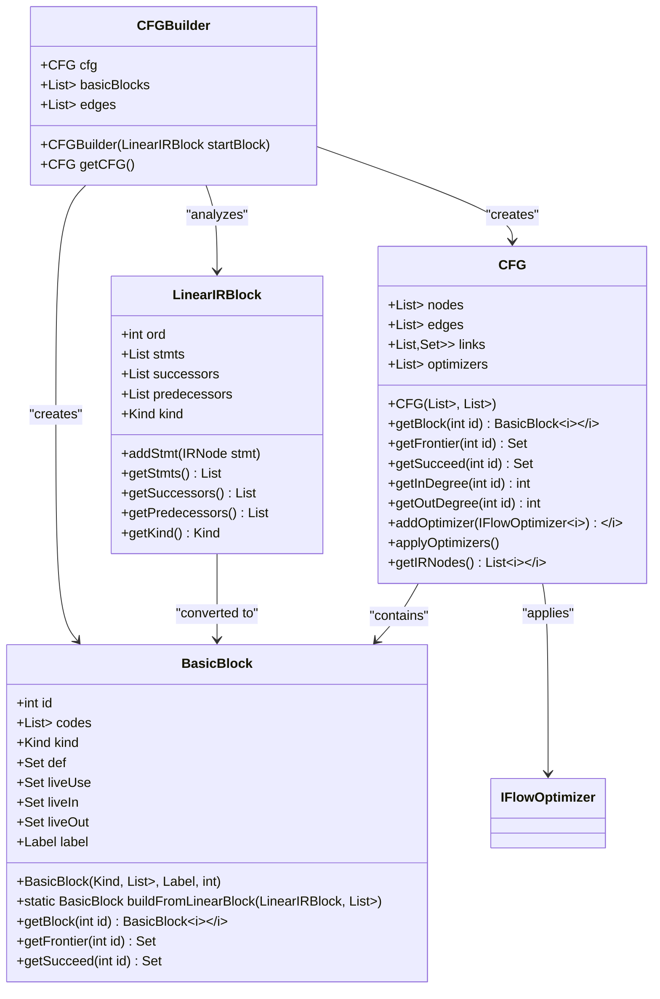
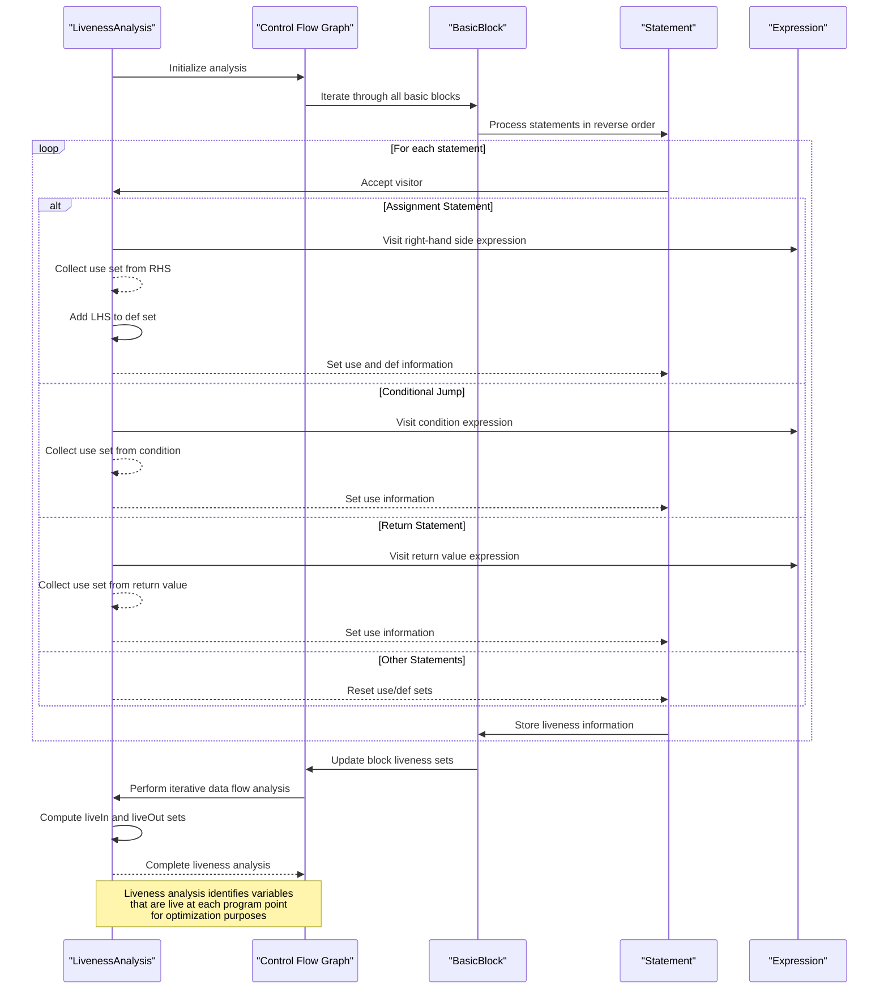
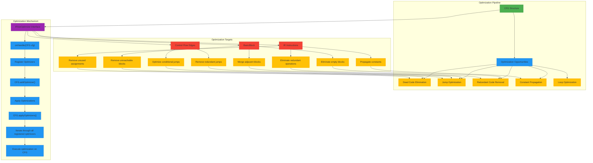
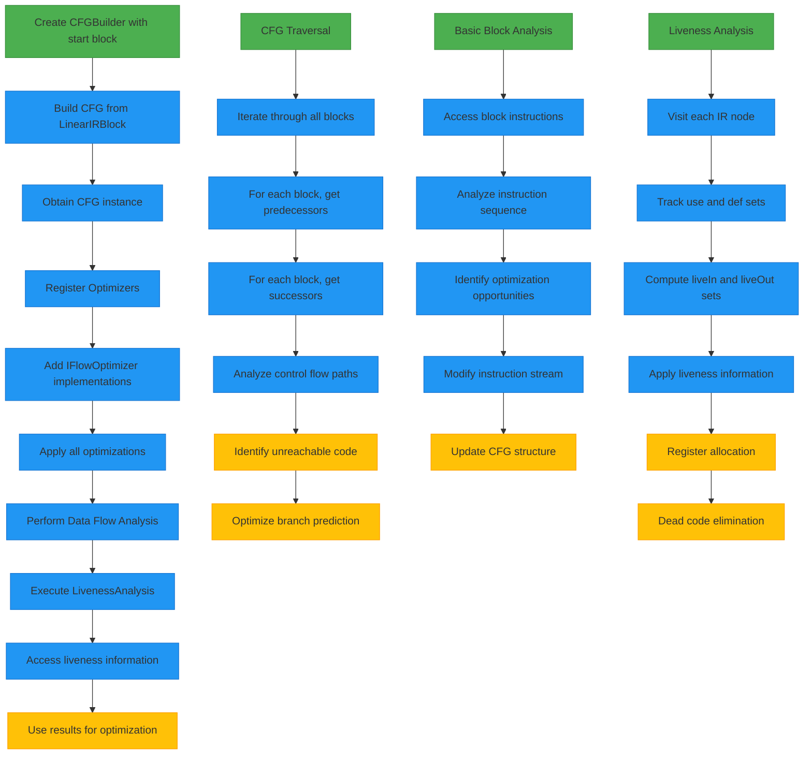

# Control Flow Analysis API

<cite>
**Referenced Files in This Document**   
- [CFGBuilder.java](file://ep20/src/main/java/org/teachfx/antlr4/ep20/pass/cfg/CFGBuilder.java)
- [CFG.java](file://ep20/src/main/java/org/teachfx/antlr4/ep20/pass/cfg/CFG.java)
- [LivenessAnalysis.java](file://ep20/src/main/java/org/teachfx/antlr4/ep20/pass/cfg/LivenessAnalysis.java)
- [BasicBlock.java](file://ep20/src/main/java/org/teachfx/antlr4/ep20/pass/cfg/BasicBlock.java)
- [LinearIRBlock.java](file://ep20/src/main/java/org/teachfx/antlr4/ep20/pass/cfg/LinearIRBlock.java)
- [IFlowOptimizer.java](file://ep20/src/main/java/org/teachfx/antlr4/ep20/pass/cfg/IFlowOptimizer.java)
</cite>

## Table of Contents
1. [Introduction](#introduction)
2. [Control Flow Graph Construction](#control-flow-graph-construction)
3. [CFG API for Traversal and Analysis](#cfg-api-for-traversal-and-analysis)
4. [Liveness Analysis Implementation](#liveness-analysis-implementation)
5. [Compiler Optimizations Enabled by CFG](#compiler-optimizations-enabled-by-cfg)
6. [Programmatic Usage Examples](#programmatic-usage-examples)

## Introduction
The Control Flow Analysis API provides a comprehensive framework for constructing and analyzing control flow graphs (CFGs) from intermediate representation (IR) code. This system enables sophisticated compiler optimizations through data flow analysis, with a focus on liveness analysis to identify variables that are live at each program point. The API is designed to transform linear IR code into structured control flow graphs composed of basic blocks, facilitating advanced analysis and optimization passes.

**Section sources**
- [CFGBuilder.java](file://ep20/src/main/java/org/teachfx/antlr4/ep20/pass/cfg/CFGBuilder.java#L9-L62)
- [CFG.java](file://ep20/src/main/java/org/teachfx/antlr4/ep20/pass/cfg/CFG.java#L17-L157)

## Control Flow Graph Construction
The CFG construction process begins with linear IR blocks that are transformed into basic blocks and connected through control flow edges. The `CFGBuilder` class analyzes `LinearIRBlock` instances to create a structured control flow graph.

**Diagram sources**
- [CFGBuilder.java](file://ep20/src/main/java/org/teachfx/antlr4/ep20/pass/cfg/CFGBuilder.java#L9-L62)
- [LinearIRBlock.java](file://ep20/src/main/java/org/teachfx/antlr4/ep20/pass/cfg/LinearIRBlock.java#L13-L236)
- [BasicBlock.java](file://ep20/src/main/java/org/teachfx/antlr4/ep20/pass/cfg/BasicBlock.java#L15-L130)
- [CFG.java](file://ep20/src/main/java/org/teachfx/antlr4/ep20/pass/cfg/CFG.java#L17-L157)

**Section sources**
- [CFGBuilder.java](file://ep20/src/main/java/org/teachfx/antlr4/ep20/pass/cfg/CFGBuilder.java#L9-L62)
- [LinearIRBlock.java](file://ep20/src/main/java/org/teachfx/antlr4/ep20/pass/cfg/LinearIRBlock.java#L13-L236)

## CFG API for Traversal and Analysis
The CFG class provides a comprehensive API for traversing control flow paths and performing data flow analysis. The graph structure enables bidirectional navigation through predecessor and successor relationships, with methods to query node connectivity and perform graph-wide operations.

```mermaid
flowchart TD
Start["CFG Traversal Start"] --> GetBlock["getBlock(id)"]
GetBlock --> InDegree["getInDegree(id)"]
GetBlock --> OutDegree["getOutDegree(id)"]
GetBlock --> Frontier["getFrontier(id)"]
GetBlock --> Succeed["getSucceed(id)"]
GetBlock --> InEdges["getInEdges(key)"]
Frontier --> Predecessors["Returns Set<Integer> of predecessor block IDs"]
Succeed --> Successors["Returns Set<Integer> of successor block IDs"]
InDegree --> Count["Returns integer count of incoming edges"]
OutDegree --> Count["Returns integer count of outgoing edges"]
InEdges --> Stream["Returns Stream<Triple> of incoming edges"]
CFG --> Iterator["Implements Iterable<BasicBlock<I>>"]
Iterator --> ForEach["Enables for-each iteration over all blocks"]
CFG --> Optimizers["Contains List<IFlowOptimizer<I>>"]
Optimizers --> Add["addOptimizer(IFlowOptimizer<I>)"]
Optimizers --> Apply["applyOptimizers()"]
Add --> Register["Registers optimizer for later application"]
Apply --> Execute["Executes all registered optimizers on CFG"]
CFG --> IRNodes["getIRNodes()"]
IRNodes --> FlatList["Returns flattened List<I> of all IR nodes in CFG"]
style Start fill:#4CAF50,stroke:#388E3C
style GetBlock fill:#2196F3,stroke:#1976D2
style InDegree fill:#2196F3,stroke:#1976D2
style OutDegree fill:#2196F3,stroke:#1976D2
style Frontier fill:#2196F3,stroke:#1976D2
style Succeed fill:#2196F3,stroke:#1976D2
style InEdges fill:#2196F3,stroke:#1976D2
style Predecessors fill:#FFC107,stroke:#FFA000
style Successors fill:#FFC107,stroke:#FFA000
style Count fill:#FFC107,stroke:#FFA000
style Stream fill:#FFC107,stroke:#FFA000
style Iterator fill:#9C27B0,stroke:#7B1FA2
style ForEach fill:#FFC107,stroke:#FFA000
style Optimizers fill:#F44336,stroke:#D32F2F
style Add fill:#2196F3,stroke:#1976D2
style Apply fill:#2196F3,stroke:#1976D2
style Register fill:#FFC107,stroke:#FFA000
style Execute fill:#FFC107,stroke:#FFA000
style IRNodes fill:#2196F3,stroke:#1976D2
style FlatList fill:#FFC107,stroke:#FFA000
```

**Diagram sources**
- [CFG.java](file://ep20/src/main/java/org/teachfx/antlr4/ep20/pass/cfg/CFG.java#L17-L157)

**Section sources**
- [CFG.java](file://ep20/src/main/java/org/teachfx/antlr4/ep20/pass/cfg/CFG.java#L17-L157)

## Liveness Analysis Implementation
The liveness analysis implementation uses the visitor pattern to traverse IR nodes and identify variables that are live at each program point. This data flow analysis determines which variables are used before being redefined in subsequent code paths.

**Diagram sources**
- [LivenessAnalysis.java](file://ep20/src/main/java/org/teachfx/antlr4/ep20/pass/cfg/LivenessAnalysis.java#L16-L146)

**Section sources**
- [LivenessAnalysis.java](file://ep20/src/main/java/org/teachfx/antlr4/ep20/pass/cfg/LivenessAnalysis.java#L16-L146)

## Compiler Optimizations Enabled by CFG
The CFG structure enables various compiler optimizations through the `IFlowOptimizer` interface, which allows registration and application of optimization passes on the control flow graph.

**Diagram sources**
- [CFG.java](file://ep20/src/main/java/org/teachfx/antlr4/ep20/pass/cfg/CFG.java#L17-L157)
- [IFlowOptimizer.java](file://ep20/src/main/java/org/teachfx/antlr4/ep20/pass/cfg/IFlowOptimizer.java#L4-L6)

**Section sources**
- [CFG.java](file://ep20/src/main/java/org/teachfx/antlr4/ep20/pass/cfg/CFG.java#L17-L157)
- [IFlowOptimizer.java](file://ep20/src/main/java/org/teachfx/antlr4/ep20/pass/cfg/IFlowOptimizer.java#L4-L6)

## Programmatic Usage Examples
The Control Flow Analysis API can be used programmatically to perform optimization and analysis tasks on the intermediate representation code.

**Diagram sources**
- [CFGBuilder.java](file://ep20/src/main/java/org/teachfx/antlr4/ep20/pass/cfg/CFGBuilder.java#L9-L62)
- [CFG.java](file://ep20/src/main/java/org/teachfx/antlr4/ep20/pass/cfg/CFG.java#L17-L157)
- [LivenessAnalysis.java](file://ep20/src/main/java/org/teachfx/antlr4/ep20/pass/cfg/LivenessAnalysis.java#L16-L146)

**Section sources**
- [CFGBuilder.java](file://ep20/src/main/java/org/teachfx/antlr4/ep20/pass/cfg/CFGBuilder.java#L9-L62)
- [CFG.java](file://ep20/src/main/java/org/teachfx/antlr4/ep20/pass/cfg/CFG.java#L17-L157)
- [LivenessAnalysis.java](file://ep20/src/main/java/org/teachfx/antlr4/ep20/pass/cfg/LivenessAnalysis.java#L16-L146)