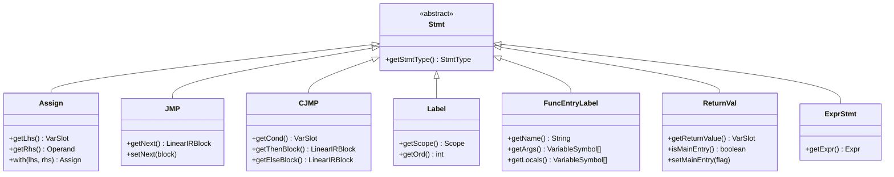

# Intermediate Representation API

<cite>
**Referenced Files in This Document**   
- [CymbolIRBuilder.java](file://ep20/src/main/java/org/teachfx/antlr4/ep20/pass/ir/CymbolIRBuilder.java)
- [IRNode.java](file://ep20/src/main/java/org/teachfx/antlr4/ep20/ir/IRNode.java)
- [Expr.java](file://ep20/src/main/java/org/teachfx/antlr4/ep20/ir/expr/Expr.java)
- [Stmt.java](file://ep20/src/main/java/org/teachfx/antlr4/ep20/ir/stmt/Stmt.java)
- [Operand.java](file://ep20/src/main/java/org/teachfx/antlr4/ep20/ir/expr/Operand.java)
- [Prog.java](file://ep20/src/main/java/org/teachfx/antlr4/ep20/ir/Prog.java)
- [LinearIRBlock.java](file://ep20/src/main/java/org/teachfx/antlr4/ep20/pass/cfg/LinearIRBlock.java)
- [CFGBuilder.java](file://ep20/src/main/java/org/teachfx/antlr4/ep20/pass/cfg/CFGBuilder.java)
</cite>

## Table of Contents
1. [Introduction](#introduction)
2. [IR Node Hierarchy](#ir-node-hierarchy)
3. [Intermediate Representation Components](#intermediate-representation-components)
4. [CymbolIRBuilder API](#cymbolirbuilder-api)
5. [Three-Address Code Generation](#three-address-code-generation)
6. [Control Flow Instructions](#control-flow-instructions)
7. [Function Call Representation](#function-call-representation)
8. [Basic Block and CFG Construction](#basic-block-and-cfg-construction)
9. [IR Traversal and Manipulation](#ir-traversal-and-manipulation)
10. [Optimization Support](#optimization-support)

## Introduction
The Intermediate Representation (IR) system provides a low-level, platform-independent representation of Cymbol programs that serves as the foundation for optimization and code generation. The IR is structured as three-address code organized into basic blocks, forming a Control Flow Graph (CFG). This documentation details the API for creating, manipulating, and traversing the IR, with a focus on the CymbolIRBuilder class that transforms the Abstract Syntax Tree (AST) into IR.

The IR system enables various compiler optimizations by providing a simplified representation of program logic that abstracts away high-level language constructs. The three-address code format ensures that each instruction has at most three operands, making data dependencies explicit and facilitating analysis.

## IR Node Hierarchy
The IR node hierarchy forms the foundation of the intermediate representation system, with all IR components inheriting from the base IRNode class. The hierarchy is organized into expressions, statements, and operands, each serving specific roles in representing program logic.

**Diagram sources**
- [IRNode.java](file://ep20/src/main/java/org/teachfx/antlr4/ep20/ir/IRNode.java#L2-L4)
- [Expr.java](file://ep20/src/main/java/org/teachfx/antlr4/ep20/ir/expr/Expr.java#L2-L8)
- [Stmt.java](file://ep20/src/main/java/org/teachfx/antlr4/ep20/ir/stmt/Stmt.java#L2-L19)
- [Operand.java](file://ep20/src/main/java/org/teachfx/antlr4/ep20/ir/expr/Operand.java#L2-L7)
- [Prog.java](file://ep20/src/main/java/org/teachfx/antlr4/ep20/ir/Prog.java#L2-L137)

**Section sources**
- [IRNode.java](file://ep20/src/main/java/org/teachfx/antlr4/ep20/ir/IRNode.java#L2-L4)
- [Expr.java](file://ep20/src/main/java/org/teachfx/antlr4/ep20/ir/expr/Expr.java#L2-L8)
- [Stmt.java](file://ep20/src/main/java/org/teachfx/antlr4/ep20/ir/stmt/Stmt.java#L2-L19)

## Intermediate Representation Components
The IR components are organized into expressions, statements, and operands, each representing different aspects of program logic. Expressions represent computations that produce values, statements represent actions or control flow, and operands represent the data being manipulated.

### Expression Components
Expression components represent computational operations that produce values. These include arithmetic operations, function calls, and value expressions.

**Diagram sources**
- [BinExpr.java](file://ep20/src/main/java/org/teachfx/antlr4/ep20/ir/expr/arith/BinExpr.java)
- [UnaryExpr.java](file://ep20/src/main/java/org/teachfx/antlr4/ep20/ir/expr/arith/UnaryExpr.java)
- [CallFunc.java](file://ep20/src/main/java/org/teachfx/antlr4/ep20/ir/expr/CallFunc.java)

### Statement Components
Statement components represent actions and control flow instructions in the IR. These include assignments, jumps, conditional jumps, labels, and return statements.

**Diagram sources**
- [Assign.java](file://ep20/src/main/java/org/teachfx/antlr4/ep20/ir/stmt/Assign.java)
- [JMP.java](file://ep20/src/main/java/org/teachfx/antlr4/ep20/ir/stmt/JMP.java)
- [CJMP.java](file://ep20/src/main/java/org/teachfx/antlr4/ep20/ir/stmt/CJMP.java)
- [Label.java](file://ep20/src/main/java/org/teachfx/antlr4/ep20/ir/stmt/Label.java)
- [FuncEntryLabel.java](file://ep20/src/main/java/org/teachfx/antlr4/ep20/ir/stmt/FuncEntryLabel.java)
- [ReturnVal.java](file://ep20/src/main/java/org/teachfx/antlr4/ep20/ir/stmt/ReturnVal.java)
- [ExprStmt.java](file://ep20/src/main/java/org/teachfx/antlr4/ep20/ir/stmt/ExprStmt.java)

### Operand Components
Operand components represent the data values used in expressions and statements. These include variable slots, constant values, frame slots, and operand slots.

**Diagram sources**
- [Operand.java](file://ep20/src/main/java/org/teachfx/antlr4/ep20/ir/expr/Operand.java#L2-L7)
- [ConstVal.java](file://ep20/src/main/java/org/teachfx/antlr4/ep20/ir/expr/val/ConstVal.java)
- [FrameSlot.java](file://ep20/src/main/java/org/teachfx/antlr4/ep20/ir/expr/addr/FrameSlot.java)
- [OperandSlot.java](file://ep20/src/main/java/org/teachfx/antlr4/ep20/ir/expr/addr/OperandSlot.java)

## CymbolIRBuilder API
The CymbolIRBuilder class is responsible for transforming the AST into three-address code and basic blocks. It implements the ASTVisitor interface to traverse the AST and generate corresponding IR nodes. The builder maintains state including the current basic block, evaluation stack, and control flow stacks for break and continue statements.

**Diagram sources**
- [CymbolIRBuilder.java](file://ep20/src/main/java/org/teachfx/antlr4/ep20/pass/ir/CymbolIRBuilder.java#L37-L472)
- [Prog.java](file://ep20/src/main/java/org/teachfx/antlr4/ep20/ir/Prog.java#L2-L137)
- [LinearIRBlock.java](file://ep20/src/main/java/org/teachfx/antlr4/ep20/pass/cfg/LinearIRBlock.java)

**Section sources**
- [CymbolIRBuilder.java](file://ep20/src/main/java/org/teachfx/antlr4/ep20/pass/ir/CymbolIRBuilder.java#L37-L472)

## Three-Address Code Generation
The CymbolIRBuilder generates three-address code by visiting AST nodes and creating corresponding IR instructions. Each instruction typically has at most three operands, following the form `result = operand1 op operand2`. The builder uses an evaluation stack to manage temporary values and ensure proper instruction ordering.

### Expression Translation
Arithmetic and logical expressions are translated into three-address code by recursively visiting operands and creating appropriate IR nodes. The evaluation stack manages temporary results and ensures proper operand ordering.

**Diagram sources**
- [CymbolIRBuilder.java](file://ep20/src/main/java/org/teachfx/antlr4/ep20/pass/ir/CymbolIRBuilder.java#L137-L155)
- [BinExpr.java](file://ep20/src/main/java/org/teachfx/antlr4/ep20/ir/expr/arith/BinExpr.java)

### Variable Access and Assignment
Variable declarations and assignments are translated into frame slot references and assignment instructions. The builder uses symbol information to map variables to their storage locations.

**Diagram sources**
- [CymbolIRBuilder.java](file://ep20/src/main/java/org/teachfx/antlr4/ep20/pass/ir/CymbolIRBuilder.java#L67-L81)
- [Assign.java](file://ep20/src/main/java/org/teachfx/antlr4/ep20/ir/stmt/Assign.java)

## Control Flow Instructions
Control flow statements such as if-else and while loops are translated into conditional and unconditional jumps, forming basic blocks connected in a control flow graph. The builder manages control flow stacks to handle break and continue statements.

### If-Else Statement Translation
If-else statements are translated into conditional jump instructions that branch to then-block or else-block based on the condition evaluation.

**Diagram sources**
- [CymbolIRBuilder.java](file://ep20/src/main/java/org/teachfx/antlr4/ep20/pass/ir/CymbolIRBuilder.java#L287-L317)
- [CJMP.java](file://ep20/src/main/java/org/teachfx/antlr4/ep20/ir/stmt/CJMP.java)

### While Loop Translation
While loops are translated into a loop structure with condition checking, body execution, and back-branching to create the loop.

**Diagram sources**
- [CymbolIRBuilder.java](file://ep20/src/main/java/org/teachfx/antlr4/ep20/pass/ir/CymbolIRBuilder.java#L259-L285)
- [JMP.java](file://ep20/src/main/java/org/teachfx/antlr4/ep20/ir/stmt/JMP.java)

## Function Call Representation
Function calls are represented in the IR using the CallFunc instruction, which captures the function name, argument count, and symbol information. Arguments are evaluated and pushed onto the evaluation stack before the call instruction is generated.

### Function Declaration Processing
Function declarations are processed by creating a new basic block for the function body and setting up the entry and exit points.

**Diagram sources**
- [CymbolIRBuilder.java](file://ep20/src/main/java/org/teachfx/antlr4/ep20/pass/ir/CymbolIRBuilder.java#L91-L125)
- [FuncEntryLabel.java](file://ep20/src/main/java/org/teachfx/antlr4/ep20/ir/stmt/FuncEntryLabel.java)

### Function Call Processing
Function calls are processed by evaluating arguments and generating a CallFunc instruction that references the function symbol.

**Diagram sources**
- [CymbolIRBuilder.java](file://ep20/src/main/java/org/teachfx/antlr4/ep20/pass/ir/CymbolIRBuilder.java#L235-L247)
- [CallFunc.java](file://ep20/src/main/java/org/teachfx/antlr4/ep20/ir/expr/CallFunc.java)

## Basic Block and CFG Construction
The IR builder constructs basic blocks and connects them to form a Control Flow Graph (CFG). Basic blocks are sequences of instructions with a single entry and exit point, and the CFG represents the flow of control between these blocks.

### Basic Block Management
The builder maintains the current basic block and provides methods to create new blocks and manage control flow.

**Diagram sources**
- [LinearIRBlock.java](file://ep20/src/main/java/org/teachfx/antlr4/ep20/pass/cfg/LinearIRBlock.java)
- [CymbolIRBuilder.java](file://ep20/src/main/java/org/teachfx/antlr4/ep20/pass/ir/CymbolIRBuilder.java#L37-L472)

### CFG Construction
The builder constructs the CFG by connecting basic blocks with jump instructions and provides a method to generate the complete CFG from the IR.

**Diagram sources**
- [CymbolIRBuilder.java](file://ep20/src/main/java/org/teachfx/antlr4/ep20/pass/ir/CymbolIRBuilder.java#L465-L472)
- [CFGBuilder.java](file://ep20/src/main/java/org/teachfx/antlr4/ep20/pass/cfg/CFGBuilder.java)
- [CFG.java](file://ep20/src/main/java/org/teachfx/antlr4/ep20/pass/cfg/CFG.java)

## IR Traversal and Manipulation
The IR system provides APIs for traversing and manipulating the generated IR. The Prog class serves as the container for all IR blocks and provides methods for linearizing instructions and accessing the complete IR.

### IR Traversal
The IR can be traversed in various ways, including linear traversal of instructions and graph traversal of basic blocks.

**Diagram sources**
- [Prog.java](file://ep20/src/main/java/org/teachfx/antlr4/ep20/ir/Prog.java#L2-L137)
- [CFG.java](file://ep20/src/main/java/org/teachfx/antlr4/ep20/pass/cfg/CFG.java)

### IR Manipulation
The IR can be manipulated through the builder API, which provides methods for adding instructions, managing control flow, and handling operands.

**Diagram sources**
- [CymbolIRBuilder.java](file://ep20/src/main/java/org/teachfx/antlr4/ep20/pass/ir/CymbolIRBuilder.java#L37-L472)
- [Prog.java](file://ep20/src/main/java/org/teachfx/antlr4/ep20/ir/Prog.java#L2-L137)
- [LinearIRBlock.java](file://ep20/src/main/java/org/teachfx/antlr4/ep20/pass/cfg/LinearIRBlock.java)

## Optimization Support
The IR system includes built-in support for optimizations through the Prog class, which provides methods for basic block optimization and instruction linearization. The three-address code format and explicit control flow make the IR amenable to various optimization techniques.

### Basic Block Optimization
The Prog class includes optimization methods for handling empty blocks and inserting labels.

**Diagram sources**
- [Prog.java](file://ep20/src/main/java/org/teachfx/antlr4/ep20/ir/Prog.java#L2-L137)

### Optimization Opportunities
The IR structure enables various optimization opportunities, including constant folding, dead code elimination, and common subexpression elimination.

**Diagram sources**
- [Prog.java](file://ep20/src/main/java/org/teachfx/antlr4/ep20/ir/Prog.java#L2-L137)
- [CymbolIRBuilder.java](file://ep20/src/main/java/org/teachfx/antlr4/ep20/pass/ir/CymbolIRBuilder.java#L37-L472)