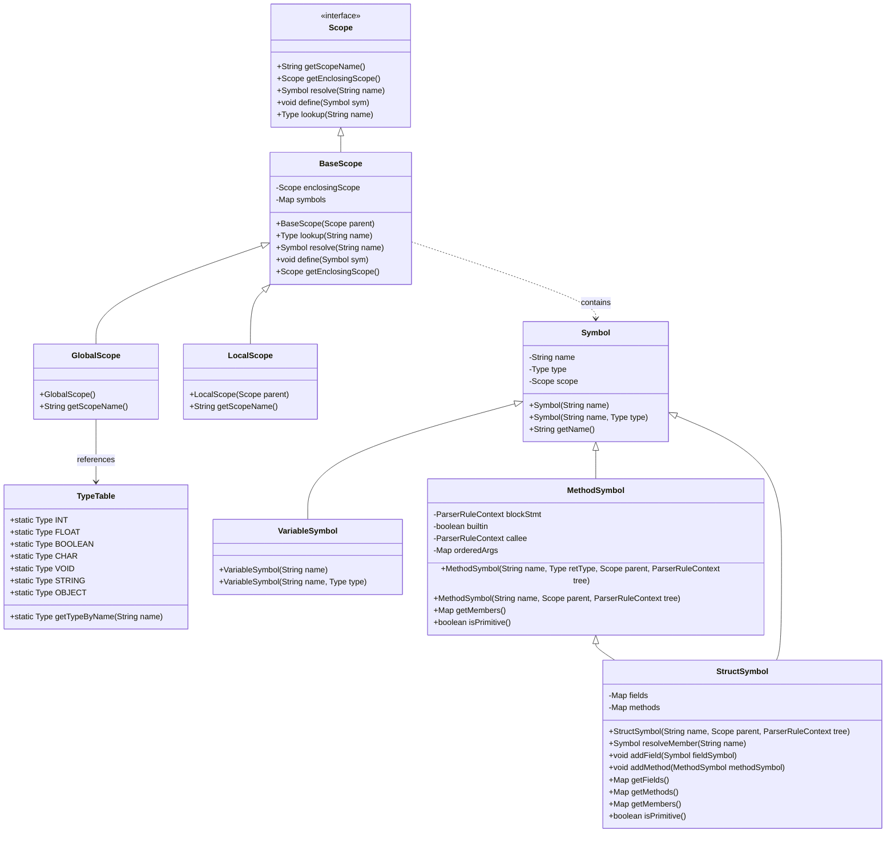
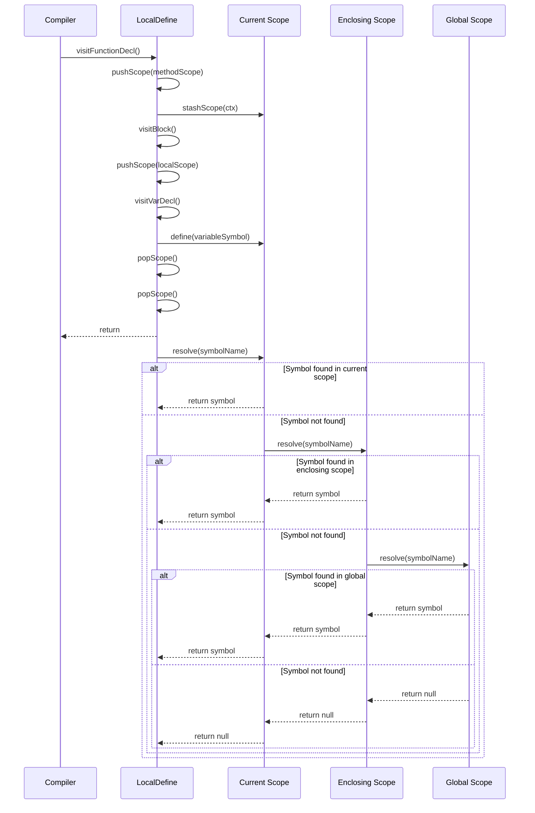
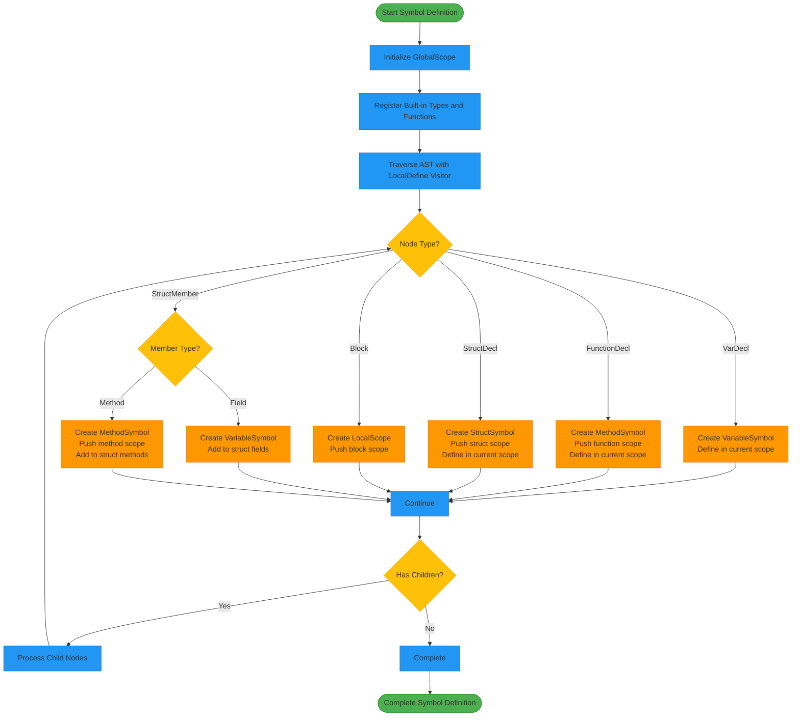
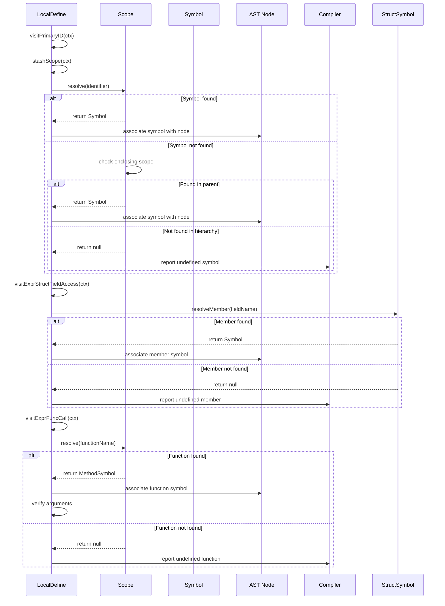
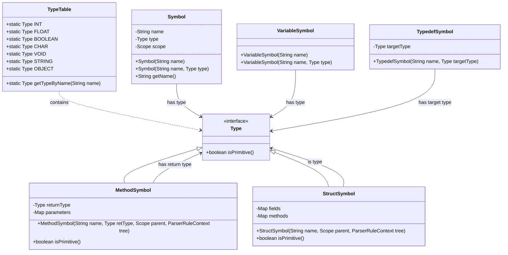
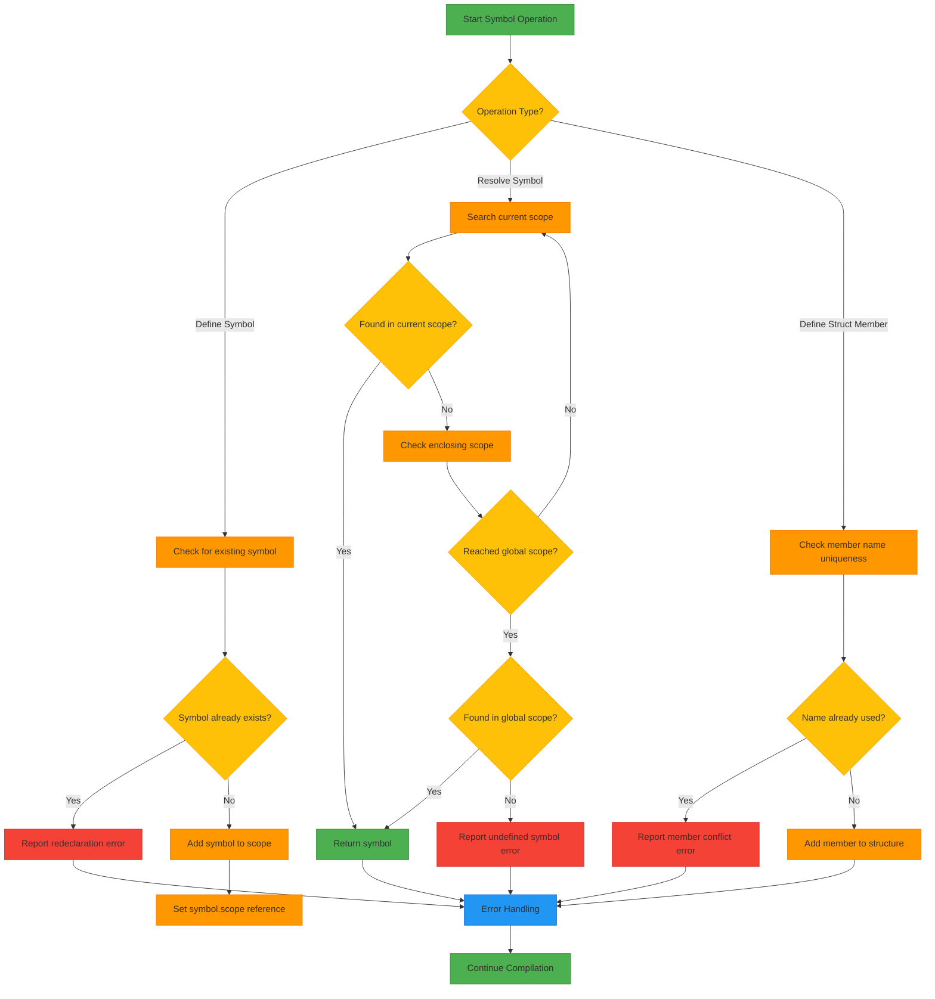

# Symbol Resolution API

<cite>
**Referenced Files in This Document**   
- [LocalDefine.java](file://ep19/src/main/java/org/teachfx/antlr4/ep19/pass/LocalDefine.java)
- [BaseScope.java](file://ep19/src/main/java/org/teachfx/antlr4/ep19/symtab/scope/BaseScope.java)
- [GlobalScope.java](file://ep19/src/main/java/org/teachfx/antlr4/ep19/symtab/scope/GlobalScope.java)
- [LocalScope.java](file://ep19/src/main/java/org/teachfx/antlr4/ep19/symtab/scope/LocalScope.java)
- [Symbol.java](file://ep19/src/main/java/org/teachfx/antlr4/ep19/symtab/symbol/Symbol.java)
- [VariableSymbol.java](file://ep19/src/main/java/org/teachfx/antlr4/ep19/symtab/symbol/VariableSymbol.java)
- [MethodSymbol.java](file://ep19/src/main/java/org/teachfx/antlr4/ep19/symtab/symbol/MethodSymbol.java)
- [StructSymbol.java](file://ep19/src/main/java/org/teachfx/antlr4/ep19/symtab/symbol/StructSymbol.java)
- [TypeTable.java](file://ep19/src/main/java/org/teachfx/antlr4/ep19/symtab/TypeTable.java)
</cite>

## Table of Contents
1. [Introduction](#introduction)
2. [Symbol Table Architecture](#symbol-table-architecture)
3. [Scope Management System](#scope-management-system)
4. [Symbol Creation and Definition](#symbol-creation-and-definition)
5. [Symbol Resolution Process](#symbol-resolution-process)
6. [Type System Integration](#type-system-integration)
7. [API Usage Examples](#api-usage-examples)
8. [Error Handling and Conflict Detection](#error-handling-and-conflict-detection)
9. [Conclusion](#conclusion)

## Introduction
The Symbol Resolution API provides a comprehensive system for managing symbols and their scopes within the Cymbol programming language compiler. This documentation focuses on the LocalDefine class, which plays a central role in building and maintaining the symbol table during compilation. The system supports multiple scope types including global, local, and method scopes, and handles various symbol types such as variables, functions, and structures. The API enables programmatic access to symbol information, type resolution, and conflict detection, forming the foundation for subsequent compilation phases like type checking and code generation.

## Symbol Table Architecture



**Diagram sources**
- [BaseScope.java](file://ep19/src/main/java/org/teachfx/antlr4/ep19/symtab/scope/BaseScope.java#L1-L67)
- [GlobalScope.java](file://ep19/src/main/java/org/teachfx/antlr4/ep19/symtab/scope/GlobalScope.java#L1-L15)
- [LocalScope.java](file://ep19/src/main/java/org/teachfx/antlr4/ep19/symtab/scope/LocalScope.java#L1-L13)
- [Symbol.java](file://ep19/src/main/java/org/teachfx/antlr4/ep19/symtab/symbol/Symbol.java#L1-L40)
- [VariableSymbol.java](file://ep19/src/main/java/org/teachfx/antlr4/ep19/symtab/symbol/VariableSymbol.java#L1-L15)
- [MethodSymbol.java](file://ep19/src/main/java/org/teachfx/antlr4/ep19/symtab/symbol/MethodSymbol.java#L1-L39)
- [StructSymbol.java](file://ep19/src/main/java/org/teachfx/antlr4/ep19/symtab/symbol/StructSymbol.java#L1-L101)
- [TypeTable.java](file://ep19/src/main/java/org/teachfx/antlr4/ep19/symtab/TypeTable.java)

**Section sources**
- [BaseScope.java](file://ep19/src/main/java/org/teachfx/antlr4/ep19/symtab/scope/BaseScope.java#L1-L67)
- [GlobalScope.java](file://ep19/src/main/java/org/teachfx/antlr4/ep19/symtab/scope/GlobalScope.java#L1-L15)
- [LocalScope.java](file://ep19/src/main/java/org/teachfx/antlr4/ep19/symtab/scope/LocalScope.java#L1-L13)

## Scope Management System

The scope management system implements a hierarchical structure that mirrors the lexical scoping rules of the Cymbol language. The system is built around three primary scope types: global, local, and method scopes, all of which inherit from the BaseScope class. The GlobalScope serves as the root of the scope hierarchy and is automatically populated with built-in types and functions during initialization. LocalScope instances are created for block-level scoping within functions and control structures, enabling proper handling of variable shadowing and local declarations.

The scope resolution process follows a chain-of-responsibility pattern, where symbol lookups first check the current scope and then propagate upward through the enclosing scope hierarchy until the symbol is found or the global scope is reached. This design ensures that inner scopes can access symbols from outer scopes while maintaining isolation between unrelated scopes. The system maintains a stack of active scopes during compilation, allowing the LocalDefine visitor to manage scope entry and exit operations as it traverses the abstract syntax tree.



**Diagram sources**
- [LocalDefine.java](file://ep19/src/main/java/org/teachfx/antlr4/ep19/pass/LocalDefine.java#L1-L324)
- [BaseScope.java](file://ep19/src/main/java/org/teachfx/antlr4/ep19/symtab/scope/BaseScope.java#L1-L67)

**Section sources**
- [LocalDefine.java](file://ep19/src/main/java/org/teachfx/antlr4/ep19/pass/LocalDefine.java#L1-L324)
- [BaseScope.java](file://ep19/src/main/java/org/teachfx/antlr4/ep19/symtab/scope/BaseScope.java#L1-L67)

## Symbol Creation and Definition

The symbol creation and definition process is orchestrated by the LocalDefine class, which acts as an AST visitor to traverse the syntax tree and establish symbols in appropriate scopes. During initialization, the LocalDefine constructor creates a GlobalScope instance and populates it with built-in types (int, float, bool, char, void, String, Object) and built-in functions (print, main). This ensures that fundamental language elements are available throughout the compilation process.

Symbol definition occurs through the define() method inherited from the BaseScope class, which adds symbols to the current scope's symbol map and establishes the bidirectional relationship between symbols and their scopes. The system handles different symbol types through specialized visitor methods: visitVarDecl() for variable declarations, visitFunctionDecl() for function definitions, visitStructDecl() for structure declarations, and visitTypedefDecl() for type aliases. Each visitor method creates the appropriate symbol type, associates it with the current scope, and manages scope transitions when necessary.

For complex declarations like structure members, the system handles both fields and methods within the visitStructMemeber() method. Field declarations create VariableSymbol instances and add them to the structure's field map, while method declarations create MethodSymbol instances and establish a new scope for the method body. The system maintains proper scope nesting by pushing and popping scopes during traversal, ensuring that symbols are defined in the correct lexical context.



**Diagram sources**
- [LocalDefine.java](file://ep19/src/main/java/org/teachfx/antlr4/ep19/pass/LocalDefine.java#L1-L324)
- [Symbol.java](file://ep19/src/main/java/org/teachfx/antlr4/ep19/symtab/symbol/Symbol.java#L1-L40)
- [VariableSymbol.java](file://ep19/src/main/java/org/teachfx/antlr4/ep19/symtab/symbol/VariableSymbol.java#L1-L15)
- [MethodSymbol.java](file://ep19/src/main/java/org/teachfx/antlr4/ep19/symtab/symbol/MethodSymbol.java#L1-L39)
- [StructSymbol.java](file://ep19/src/main/java/org/teachfx/antlr4/ep19/symtab/symbol/StructSymbol.java#L1-L101)

**Section sources**
- [LocalDefine.java](file://ep19/src/main/java/org/teachfx/antlr4/ep19/pass/LocalDefine.java#L1-L324)
- [Symbol.java](file://ep19/src/main/java/org/teachfx/antlr4/ep19/symtab/symbol/Symbol.java#L1-L40)

## Symbol Resolution Process

The symbol resolution process enables the compiler to locate and retrieve symbol information based on identifier names within the appropriate lexical context. The resolution mechanism is implemented through the resolve() method in the BaseScope class, which performs a hierarchical search starting from the current scope and progressing through enclosing scopes until the symbol is found or all scopes have been exhausted. This approach ensures that the nearest declaration of a symbol is used, implementing the standard lexical scoping rules.

The LocalDefine class plays a crucial role in the resolution process by maintaining a ParseTreeProperty that associates AST nodes with their corresponding scopes. The stashScope() method records the current scope for each relevant AST node, creating a mapping that subsequent compilation phases can use to determine the context in which identifiers should be resolved. This information is essential for accurate symbol resolution during type checking and code generation.

For structure members, the system provides specialized resolution through the resolveMember() method in the StructSymbol class. This method searches only within the structure's own members (both fields and methods) without traversing the scope hierarchy, ensuring that structure member access is resolved correctly. The system also handles method calls and function invocations by resolving the called function's symbol in the current scope and verifying that the appropriate number and types of arguments are provided.



**Diagram sources**
- [LocalDefine.java](file://ep19/src/main/java/org/teachfx/antlr4/ep19/pass/LocalDefine.java#L1-L324)
- [BaseScope.java](file://ep19/src/main/java/org/teachfx/antlr4/ep19/symtab/scope/BaseScope.java#L1-L67)
- [StructSymbol.java](file://ep19/src/main/java/org/teachfx/antlr4/ep19/symtab/symbol/StructSymbol.java#L1-L101)

**Section sources**
- [LocalDefine.java](file://ep19/src/main/java/org/teachfx/antlr4/ep19/pass/LocalDefine.java#L1-L324)
- [BaseScope.java](file://ep19/src/main/java/org/teachfx/antlr4/ep19/symtab/scope/BaseScope.java#L1-L67)

## Type System Integration

The symbol resolution system is tightly integrated with the type system through the TypeTable class, which maintains references to all built-in types and provides type resolution services. During symbol creation, the system associates type information with symbols either directly through the Symbol constructor or via the type field in derived symbol classes. The TypeTable contains static references to fundamental types (INT, FLOAT, BOOLEAN, CHAR, VOID, STRING, OBJECT) that are automatically available in the global scope.

Type information is stored and retrieved through multiple mechanisms: symbols maintain a direct reference to their type through the type field, while scopes provide type lookup services through the lookup() method. The system supports both explicit type declarations and implicit type resolution, allowing for flexible type handling in the language. For structure types, the StructSymbol class implements the Type interface, enabling structures to be used as first-class types in variable declarations and function signatures.

The integration between symbols and types enables comprehensive type checking during subsequent compilation phases. Method symbols maintain information about their return types and parameter types, allowing the type checker to verify function calls and assignments. Variable symbols store their declared types, enabling type safety checks for operations and assignments. The system also supports type aliases through the TypedefSymbol class, which creates new names for existing types while maintaining the underlying type information.



**Diagram sources**
- [TypeTable.java](file://ep19/src/main/java/org/teachfx/antlr4/ep19/symtab/TypeTable.java)
- [Symbol.java](file://ep19/src/main/java/org/teachfx/antlr4/ep19/symtab/symbol/Symbol.java#L1-L40)
- [VariableSymbol.java](file://ep19/src/main/java/org/teachfx/antlr4/ep19/symtab/symbol/VariableSymbol.java#L1-L15)
- [MethodSymbol.java](file://ep19/src/main/java/org/teachfx/antlr4/ep19/symtab/symbol/MethodSymbol.java#L1-L39)
- [StructSymbol.java](file://ep19/src/main/java/org/teachfx/antlr4/ep19/symtab/symbol/StructSymbol.java#L1-L101)

**Section sources**
- [TypeTable.java](file://ep19/src/main/java/org/teachfx/antlr4/ep19/symtab/TypeTable.java)
- [Symbol.java](file://ep19/src/main/java/org/teachfx/antlr4/ep19/symtab/symbol/Symbol.java#L1-L40)

## API Usage Examples

The Symbol Resolution API provides several key methods for programmatic access to symbol information and scope management. The primary entry point is the LocalDefine class, which processes the AST and builds the symbol table. After processing, the getScopes() method returns a ParseTreeProperty that maps AST nodes to their corresponding scopes, enabling other compilation phases to determine the context of any node.

To create and define symbols, clients can use the define() method on any Scope instance, passing a Symbol object of the appropriate type. For example, defining a variable symbol involves creating a VariableSymbol instance with the desired name and type, then calling define() on the current scope. The system automatically handles the bidirectional relationship between the symbol and its scope.

Symbol lookup is performed using the resolve() method on Scope instances, which searches for a symbol by name in the current scope and its ancestors. For structure member resolution, the resolveMember() method on StructSymbol instances should be used instead, as it searches only within the structure's members without traversing the scope hierarchy.

```mermaid
flowchart TD
A[Initialize Compiler] --> B[Create LocalDefine Instance]
B --> C[Process AST with LocalDefine]
C --> D[Retrieve Scope Information]
D --> E{Operation Type?}
E --> |Define Symbol| F[Create Symbol Instance]
F --> G[Call scope.define(symbol)]
G --> H[Symbol Added to Scope]
E --> |Resolve Symbol| I[Call scope.resolve(name)]
I --> J{Symbol Found?}
J --> |Yes| K[Return Symbol Reference]
J --> |No| L[Return Null]
E --> |Access Scope Info| M[Use getScopes() Property]
M --> N[Retrieve Scope for AST Node]
H --> O[Continue Compilation]
K --> O
L --> O
N --> O
O --> P[Proceed to Next Phase]
style A fill:#4CAF50,stroke:#388E3C
style P fill:#4CAF50,stroke:#388E3C
style B fill:#2196F3,stroke:#1976D2
style C fill:#2196F3,stroke:#1976D2
style D fill:#2196F3,stroke:#1976D2
style E fill:#FFC107,stroke:#FFA000
style F fill:#FF9800,stroke:#F57C00
style G fill:#FF9800,stroke:#F57C00
style H fill:#FF9800,stroke:#F57C00
style I fill:#FF9800,stroke:#F57C00
style J fill:#FFC107,stroke:#FFA000
style K fill:#FF9800,stroke:#F57C00
style L fill:#FF9800,stroke:#F57C00
style M fill:#FF9800,stroke:#F57C00
style N fill:#FF9800,stroke:#F57C00
style O fill:#2196F3,stroke:#1976D2
```

**Diagram sources**
- [LocalDefine.java](file://ep19/src/main/java/org/teachfx/antlr4/ep19/pass/LocalDefine.java#L1-L324)
- [BaseScope.java](file://ep19/src/main/java/org/teachfx/antlr4/ep19/symtab/scope/BaseScope.java#L1-L67)
- [Symbol.java](file://ep19/src/main/java/org/teachfx/antlr4/ep19/symtab/symbol/Symbol.java#L1-L40)

**Section sources**
- [LocalDefine.java](file://ep19/src/main/java/org/teachfx/antlr4/ep19/pass/LocalDefine.java#L1-L324)
- [BaseScope.java](file://ep19/src/main/java/org/teachfx/antlr4/ep19/symtab/scope/BaseScope.java#L1-L67)

## Error Handling and Conflict Detection

The symbol resolution system includes comprehensive error handling and conflict detection mechanisms to identify and report semantic errors in the source code. The primary error conditions detected include redeclarations of symbols within the same scope and references to undefined symbols. When a symbol is defined, the system checks whether a symbol with the same name already exists in the current scope, preventing duplicate declarations.

For undefined symbol references, the system returns null when resolve() is called with a name that cannot be found in the current scope or any of its enclosing scopes. Subsequent compilation phases can then generate appropriate error messages indicating that an identifier is undefined. The system also detects conflicts in structure member declarations, ensuring that field and method names within a structure are unique.

The LocalDefine class includes logging capabilities through the SLF4J framework, which outputs debug information about symbol definition and scope transitions. This logging can be invaluable for debugging compilation issues and understanding the symbol resolution process. The system follows a fail-fast approach, reporting errors as soon as they are detected rather than attempting to continue with potentially invalid symbol information.



**Diagram sources**
- [LocalDefine.java](file://ep19/src/main/java/org/teachfx/antlr4/ep19/pass/LocalDefine.java#L1-L324)
- [BaseScope.java](file://ep19/src/main/java/org/teachfx/antlr4/ep19/symtab/scope/BaseScope.java#L1-L67)
- [StructSymbol.java](file://ep19/src/main/java/org/teachfx/antlr4/ep19/symtab/symbol/StructSymbol.java#L1-L101)

**Section sources**
- [LocalDefine.java](file://ep19/src/main/java/org/teachfx/antlr4/ep19/pass/LocalDefine.java#L1-L324)
- [BaseScope.java](file://ep19/src/main/java/org/teachfx/antlr4/ep19/symtab/scope/BaseScope.java#L1-L67)

## Conclusion
The Symbol Resolution API provides a robust foundation for managing identifiers and their associated information throughout the compilation process. The LocalDefine class serves as the central component for building the symbol table, establishing scopes, and defining symbols in their appropriate lexical contexts. The hierarchical scope system supports the full range of Cymbol's scoping rules, from global declarations to nested block scopes, while ensuring proper symbol resolution and conflict detection.

The integration between symbols and types enables comprehensive type checking and verification in subsequent compilation phases. By maintaining bidirectional relationships between symbols and their scopes, and between symbols and their types, the system provides efficient access to semantic information needed for code generation and optimization. The API's design follows established compiler construction patterns, making it both effective for the current implementation and extensible for future language features.

The comprehensive error handling and conflict detection mechanisms ensure that semantic errors are identified early in the compilation process, providing clear feedback to developers. The logging capabilities and well-defined interfaces make the system maintainable and debuggable, supporting ongoing development and enhancement of the Cymbol compiler.