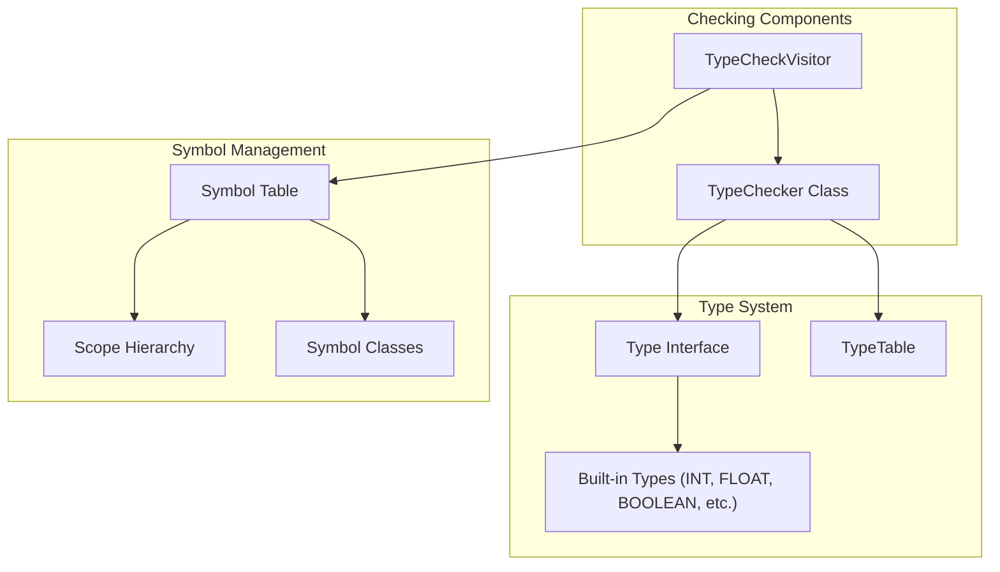
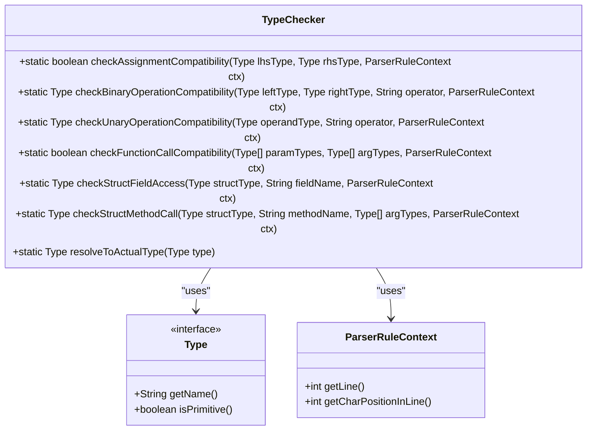
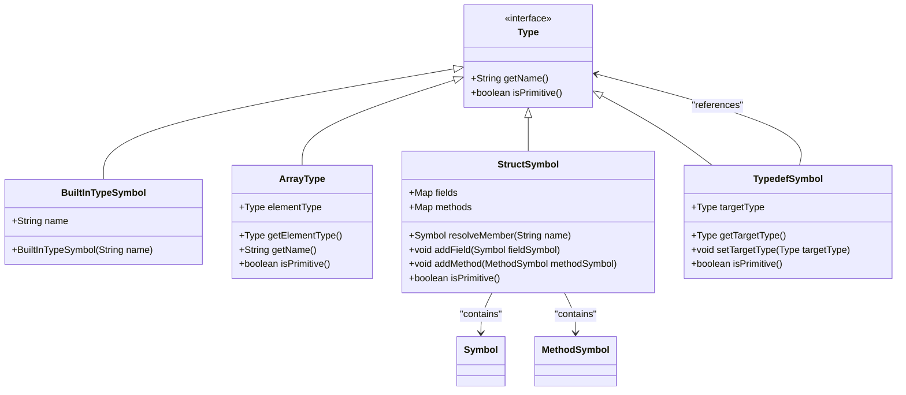
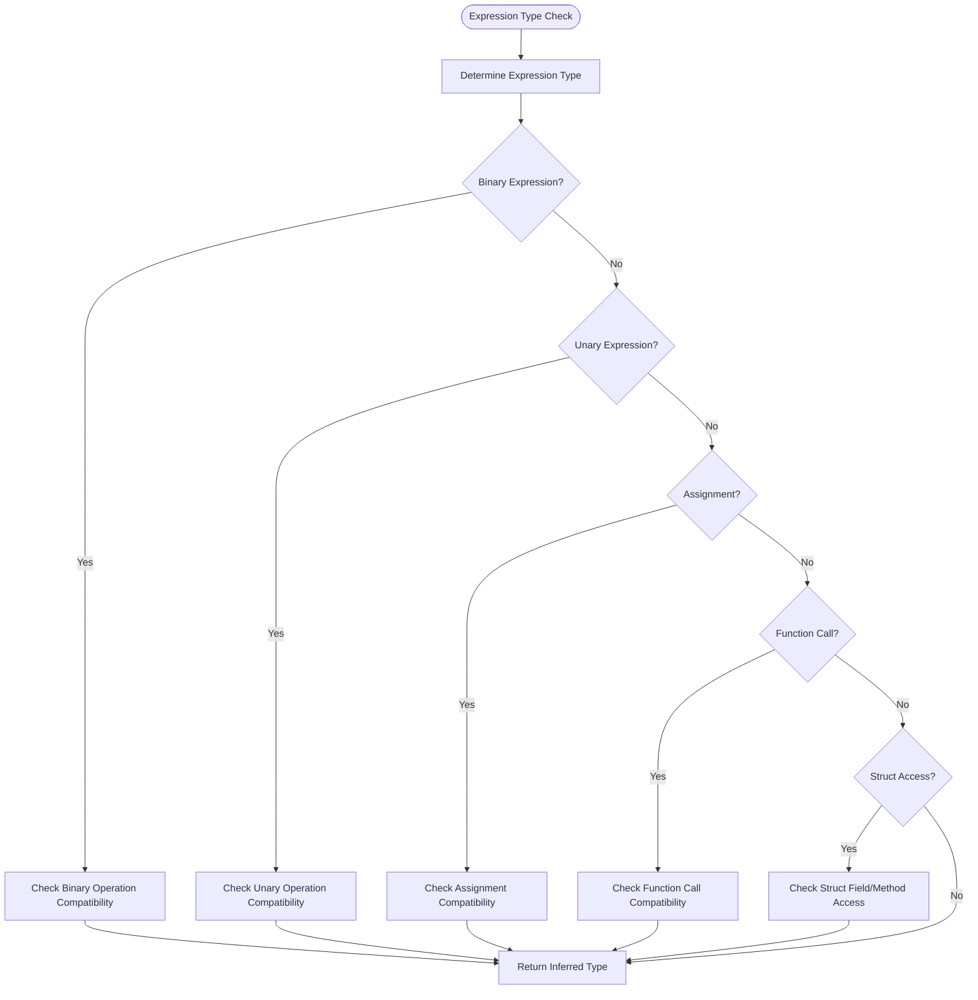
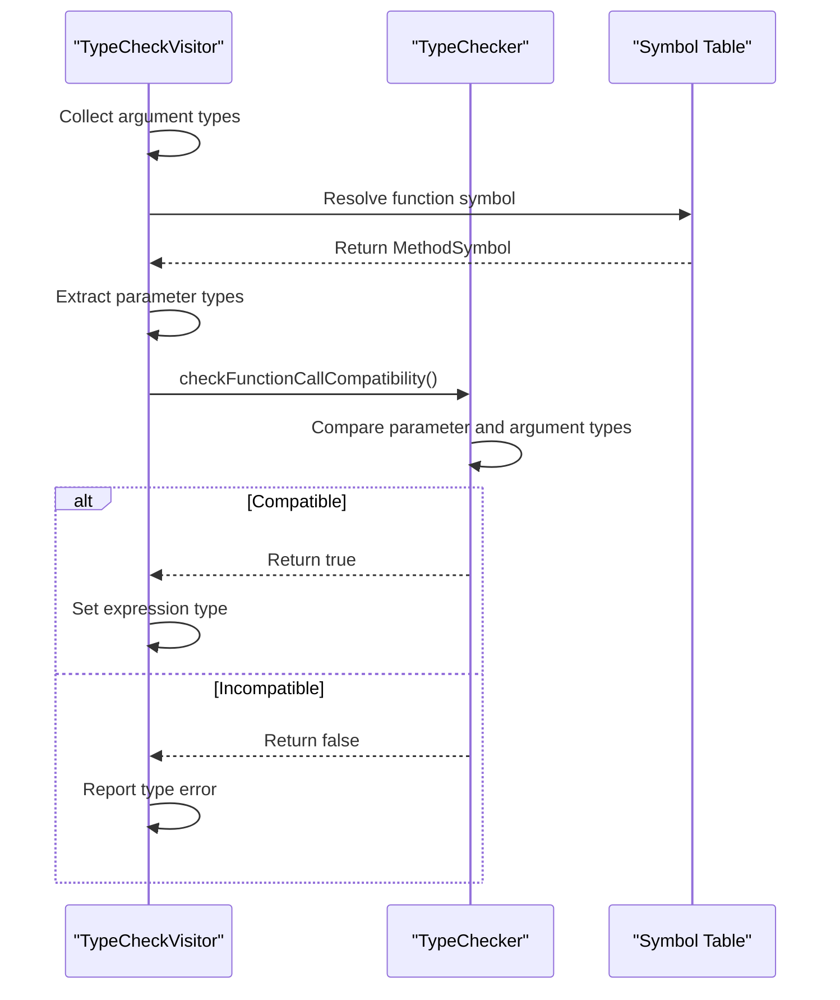
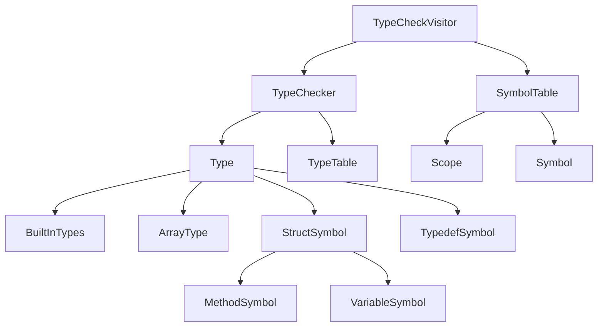

# Type Checking API

<cite>
**Referenced Files in This Document**   
- [TypeChecker.java](file://ep19/src/main/java/org/teachfx/antlr4/ep19/symtab/TypeChecker.java)
- [TypeCheckVisitor.java](file://ep19/src/main/java/org/teachfx/antlr4/ep19/pass/TypeCheckVisitor.java)
- [Type.java](file://ep19/src/main/java/org/teachfx/antlr4/ep19/symtab/Type.java)
- [TypeTable.java](file://ep19/src/main/java/org/teachfx/antlr4/ep19/symtab/TypeTable.java)
- [StructSymbol.java](file://ep19/src/main/java/org/teachfx/antlr4/ep19/symtab/symbol/StructSymbol.java)
- [MethodSymbol.java](file://ep19/src/main/java/org/teachfx/antlr4/ep19/symtab/symbol/MethodSymbol.java)
- [TypedefSymbol.java](file://ep19/src/main/java/org/teachfx/antlr4/ep19/symtab/symbol/TypedefSymbol.java)
- [ArrayType.java](file://ep19/src/main/java/org/teachfx/antlr4/ep19/symtab/type/ArrayType.java)
</cite>

## Table of Contents
1. [Introduction](#introduction)
2. [Core Components](#core-components)
3. [Architecture Overview](#architecture-overview)
4. [Detailed Component Analysis](#detailed-component-analysis)
5. [Dependency Analysis](#dependency-analysis)
6. [Performance Considerations](#performance-considerations)
7. [Troubleshooting Guide](#troubleshooting-guide)
8. [Conclusion](#conclusion)

## Introduction
The Type Checking API provides a comprehensive system for validating type correctness in the Cymbol programming language. Centered around the TypeChecker class, this API handles type inference, compatibility checking, and operator resolution across expressions, function calls, and assignments. The system integrates with the symbol table to validate types against declared symbols and supports a rich type hierarchy including built-in types, arrays, and structs. This documentation details the API's functionality, type coercion rules, and error handling mechanisms.

## Core Components

The Type Checking API consists of several key components that work together to ensure type safety throughout the compilation process. The TypeChecker class provides static utility methods for type compatibility checks, while the TypeCheckVisitor traverses the AST to apply these checks in context. The type system is built on interfaces and classes that represent different type categories and their relationships.

**Section sources**
- [TypeChecker.java](file://ep19/src/main/java/org/teachfx/antlr4/ep19/symtab/TypeChecker.java#L11-L316)
- [TypeCheckVisitor.java](file://ep19/src/main/java/org/teachfx/antlr4/ep19/pass/TypeCheckVisitor.java#L0-L627)
- [Type.java](file://ep19/src/main/java/org/teachfx/antlr4/ep19/symtab/Type.java#L0-L6)

## Architecture Overview

The type checking system follows a visitor pattern architecture where the TypeCheckVisitor traverses the AST and delegates specific type checks to the static methods in TypeChecker. The system maintains type information through the compilation process, using the symbol table to resolve identifiers and their associated types. Type compatibility is determined through a combination of exact type matching, inheritance relationships, and defined coercion rules.

**Diagram sources**
- [TypeChecker.java](file://ep19/src/main/java/org/teachfx/antlr4/ep19/symtab/TypeChecker.java#L11-L316)
- [TypeCheckVisitor.java](file://ep19/src/main/java/org/teachfx/antlr4/ep19/pass/TypeCheckVisitor.java#L0-L627)
- [Type.java](file://ep19/src/main/java/org/teachfx/antlr4/ep19/symtab/Type.java#L0-L6)

## Detailed Component Analysis

### TypeChecker Class Analysis
The TypeChecker class provides static methods for various type checking operations. It serves as the core utility for determining type compatibility across different language constructs.

#### Type Compatibility Checking

**Diagram sources**
- [TypeChecker.java](file://ep19/src/main/java/org/teachfx/antlr4/ep19/symtab/TypeChecker.java#L11-L316)

#### Type Hierarchy and Representation
The type system is built around the Type interface, which defines the basic contract for all types in the language. Concrete implementations represent different type categories:

**Diagram sources**
- [Type.java](file://ep19/src/main/java/org/teachfx/antlr4/ep19/symtab/Type.java#L0-L6)
- [TypeTable.java](file://ep19/src/main/java/org/teachfx/antlr4/ep19/symtab/TypeTable.java#L0-L33)
- [ArrayType.java](file://ep19/src/main/java/org/teachfx/antlr4/ep19/symtab/type/ArrayType.java#L0-L56)
- [StructSymbol.java](file://ep19/src/main/java/org/teachfx/antlr4/ep19/symtab/symbol/StructSymbol.java#L0-L101)
- [TypedefSymbol.java](file://ep19/src/main/java/org/teachfx/antlr4/ep19/symtab/symbol/TypedefSymbol.java#L0-L55)

### Type Inference and Expression Validation
The TypeCheckVisitor class implements the visitor pattern to traverse the AST and perform type checking on expressions and statements. It uses the TypeChecker utilities to validate type compatibility in context.

#### Expression Type Checking Flow

**Diagram sources**
- [TypeCheckVisitor.java](file://ep19/src/main/java/org/teachfx/antlr4/ep19/pass/TypeCheckVisitor.java#L0-L627)

#### Function Call Type Checking

**Diagram sources**
- [TypeCheckVisitor.java](file://ep19/src/main/java/org/teachfx/antlr4/ep19/pass/TypeCheckVisitor.java#L0-L627)
- [TypeChecker.java](file://ep19/src/main/java/org/teachfx/antlr4/ep19/symtab/TypeChecker.java#L11-L316)

## Dependency Analysis

The type checking system has a well-defined dependency structure that ensures proper type validation throughout the compilation process. The core dependencies flow from the visitor pattern implementation to the utility methods and symbol resolution components.

**Diagram sources**
- [TypeChecker.java](file://ep19/src/main/java/org/teachfx/antlr4/ep19/symtab/TypeChecker.java#L11-L316)
- [TypeCheckVisitor.java](file://ep19/src/main/java/org/teachfx/antlr4/ep19/pass/TypeCheckVisitor.java#L0-L627)
- [Type.java](file://ep19/src/main/java/org/teachfx/antlr4/ep19/symtab/Type.java#L0-L6)

**Section sources**
- [TypeChecker.java](file://ep19/src/main/java/org/teachfx/antlr4/ep19/symtab/TypeChecker.java#L11-L316)
- [TypeCheckVisitor.java](file://ep19/src/main/java/org/teachfx/antlr4/ep19/pass/TypeCheckVisitor.java#L0-L627)
- [Type.java](file://ep19/src/main/java/org/teachfx/antlr4/ep19/symtab/Type.java#L0-L6)
- [TypeTable.java](file://ep19/src/main/java/org/teachfx/antlr4/ep19/symtab/TypeTable.java#L0-L33)

## Performance Considerations

The type checking system is designed for efficiency with static utility methods that avoid object instantiation overhead. The use of the visitor pattern allows for single-pass type checking during AST traversal, minimizing processing time. Type resolution is optimized through direct symbol table lookups and caching of resolved types in the ParseTreeProperty structure.

## Troubleshooting Guide

When encountering type errors, the system provides detailed error messages through the CompilerLogger. Common issues include incompatible assignment types, mismatched function parameters, and invalid operations on types. The error messages include source location information to aid in debugging. For complex type resolution issues involving typedefs, the resolveToActualType method can be used to trace the underlying type.

**Section sources**
- [TypeChecker.java](file://ep19/src/main/java/org/teachfx/antlr4/ep19/symtab/TypeChecker.java#L11-L316)
- [TypeCheckVisitor.java](file://ep19/src/main/java/org/teachfx/antlr4/ep19/pass/TypeCheckVisitor.java#L0-L627)

## Conclusion

The Type Checking API provides a robust and comprehensive system for ensuring type safety in the Cymbol programming language. By combining static utility methods with a visitor pattern implementation, the system efficiently validates type compatibility across all language constructs. The flexible type hierarchy supports built-in types, arrays, structs, and typedefs, while the well-defined coercion rules enable safe type conversions. This API serves as a critical component in the compilation process, preventing type-related errors before program execution.