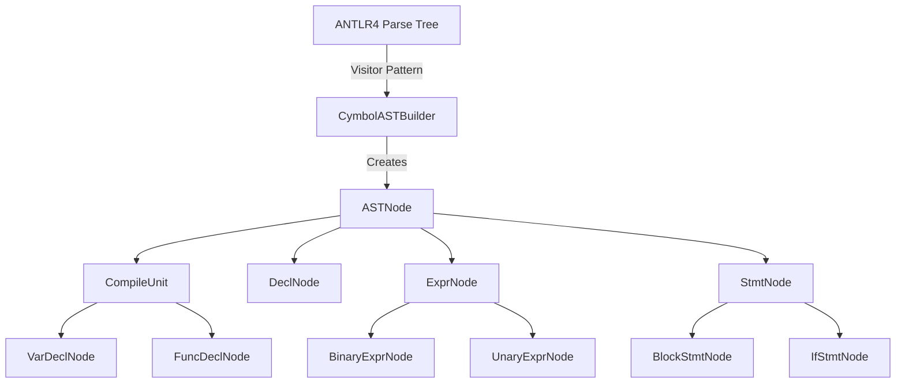
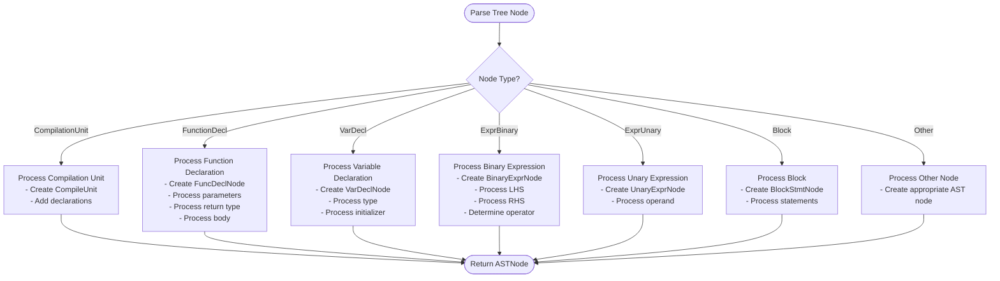
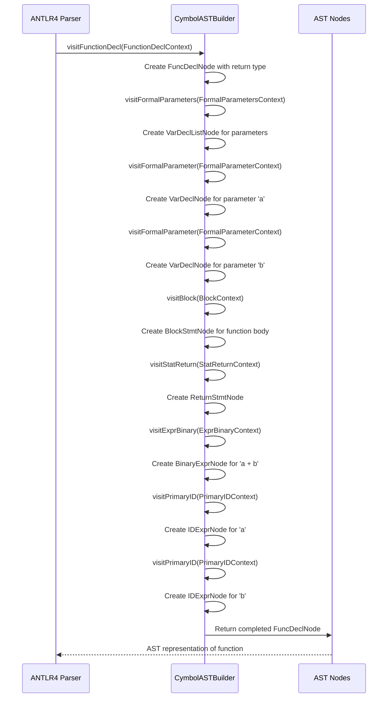

# AST Construction Process

<cite>
**Referenced Files in This Document**   
- [CymbolASTBuilder.java](file://ep20/src/main/java/org/teachfx/antlr4/ep20/pass/ast/CymbolASTBuilder.java)
- [ASTVisitor.java](file://ep20/src/main/java/org/teachfx/antlr4/ep20/ast/ASTVisitor.java)
- [ASTNode.java](file://ep20/src/main/java/org/teachfx/antlr4/ep20/ast/ASTNode.java)
- [CompileUnit.java](file://ep20/src/main/java/org/teachfx/antlr4/ep20/ast/CompileUnit.java)
- [ExprNode.java](file://ep20/src/main/java/org/teachfx/antlr4/ep20/ast/expr/ExprNode.java)
- [StmtNode.java](file://ep20/src/main/java/org/teachfx/antlr4/ep20/ast/stmt/StmtNode.java)
- [FuncDeclNode.java](file://ep20/src/main/java/org/teachfx/antlr4/ep20/ast/decl/FuncDeclNode.java)
- [VarDeclNode.java](file://ep20/src/main/java/org/teachfx/antlr4/ep20/ast/decl/VarDeclNode.java)
</cite>

## Table of Contents
1. [Introduction](#introduction)
2. [AST Construction Overview](#ast-construction-overview)
3. [Visitor Pattern Implementation](#visitor-pattern-implementation)
4. [Key Transformations During AST Construction](#key-transformations-during-ast-construction)
5. [Function Definition Transformation Example](#function-definition-transformation-example)
6. [Error Handling and Recovery](#error-handling-and-recovery)
7. [Performance and Memory Management](#performance-and-memory-management)
8. [Conclusion](#conclusion)

## Introduction
The AST construction process in the Cymbol compiler transforms ANTLR4 parse trees into an optimized Abstract Syntax Tree (AST) representation. This document details how CymbolASTBuilder.java implements this transformation using the visitor pattern through ASTVisitor.java, covering the key transformations, error handling strategies, and performance considerations involved in creating an efficient AST representation.

## AST Construction Overview

The AST construction process begins with the ANTLR4-generated parse tree and transforms it into a more compact and semantically rich AST representation. The CymbolASTBuilder class extends CymbolBaseVisitor and implements the visitor pattern to traverse the parse tree and create corresponding AST nodes.

The construction process follows these key principles:
- Elimination of intermediate grammar nodes that don't contribute to semantic meaning
- Combination of related tokens into meaningful AST nodes
- Establishment of parent-child relationships between AST nodes
- Preservation of source location information for error reporting



**Diagram sources**
- [CymbolASTBuilder.java](file://ep20/src/main/java/org/teachfx/antlr4/ep20/pass/ast/CymbolASTBuilder.java#L1-L50)
- [ASTNode.java](file://ep20/src/main/java/org/teachfx/antlr4/ep20/ast/ASTNode.java#L1-L20)
- [CompileUnit.java](file://ep20/src/main/java/org/teachfx/antlr4/ep20/ast/CompileUnit.java#L1-L15)

**Section sources**
- [CymbolASTBuilder.java](file://ep20/src/main/java/org/teachfx/antlr4/ep20/pass/ast/CymbolASTBuilder.java#L1-L50)
- [ASTNode.java](file://ep20/src/main/java/org/teachfx/antlr4/ep20/ast/ASTNode.java#L1-L30)

## Visitor Pattern Implementation

The visitor pattern is implemented through the ASTVisitor interface and CymbolASTBuilder class, enabling systematic traversal of the parse tree and creation of corresponding AST nodes. The CymbolASTBuilder extends CymbolBaseVisitor<ASTNode> and implements CymbolVisitor<ASTNode>, providing visit methods for each parse tree context.

The visitor pattern implementation follows these key aspects:
- Each visit method corresponds to a specific parse tree context
- Methods return ASTNode instances that replace the original parse tree nodes
- The visitor traverses the parse tree in a depth-first manner
- Type safety is maintained through generic return types

```mermaid
classDiagram
class ASTVisitor~S,E~ {
<<interface>>
+visit(CompileUnit rootNode) S
+visit(VarDeclNode varDeclNode) S
+visit(FuncDeclNode funcDeclNode) S
+visit(VarDeclStmtNode varDeclStmtNode) S
+visit(StructDeclNode structDeclNode) S
+visit(StructMemberNode structMemberNode) S
+visit(TypedefDeclNode typedefDeclNode) S
+visit(TypeNode typeNode) E
+visit(BinaryExprNode binaryExprNode) E
+visit(IDExprNode idExprNode) E
+visit(BoolExprNode boolExprNode) E
+visit(CallFuncNode callExprNode) E
+visit(IntExprNode intExprNode) E
+visit(FloatExprNode floatExprNode) E
+visit(NullExprNode nullExprNode) E
+visit(StringExprNode stringExprNode) E
+visit(UnaryExprNode unaryExprNode) E
+visit(ArrayLiteralNode arrayLiteralNode) E
+visit(CastExprNode castExprNode) E
+visit(FieldAccessNode fieldAccessNode) E
+visit(IfStmtNode ifStmtNode) S
+visit(ExprStmtNode exprStmtNode) S
+visit(BlockStmtNode blockStmtNode) S
+visit(ReturnStmtNode returnStmtNode) S
+visit(WhileStmtNode whileStmtNode) S
+visit(AssignStmtNode assignStmtNode) S
+visit(BreakStmtNode breakStmtNode) S
+visit(ContinueStmtNode continueStmtNode) S
}
class CymbolASTBuilder {
+visitCompilationUnit(CompilationUnitContext ctx) ASTNode
+visitVarDecl(VarDeclContext ctx) ASTNode
+visitType(TypeContext ctx) ASTNode
+visitPrimaryType(PrimaryTypeContext ctx) ASTNode
+visitFunctionDecl(FunctionDeclContext ctx) ASTNode
+visitFormalParameters(FormalParametersContext ctx) ASTNode
+visitFormalParameter(FormalParameterContext ctx) ASTNode
+visitBlock(BlockContext ctx) ASTNode
+visitStatBlock(StatBlockContext ctx) ASTNode
+visitStatVarDecl(StatVarDeclContext ctx) ASTNode
+visitStatReturn(StatReturnContext ctx) ASTNode
+visitStateCondition(StateConditionContext ctx) ASTNode
+visitStateWhile(StateWhileContext ctx) ASTNode
+visitVisitBreak(VisitBreakContext ctx) ASTNode
+visitVisitContinue(VisitContinueContext ctx) ASTNode
+visitStatAssign(StatAssignContext ctx) ASTNode
+visitExprStat(ExprStatContext ctx) ASTNode
+visitExprBinary(ExprBinaryContext ctx) ASTNode
+visitExprGroup(ExprGroupContext ctx) ASTNode
+visitExprUnary(ExprUnaryContext ctx) ASTNode
+visitExprFuncCall(ExprFuncCallContext ctx) ASTNode
+visitExprArrayAccess(ExprArrayAccessContext ctx) ASTNode
+visitPrimaryID(PrimaryIDContext ctx) ASTNode
+visitPrimaryINT(PrimaryINTContext ctx) ASTNode
+visitPrimaryFLOAT(PrimaryFLOATContext ctx) ASTNode
+visitPrimarySTRING(PrimarySTRINGContext ctx) ASTNode
+visitPrimaryBOOL(PrimaryBOOLContext ctx) ASTNode
+visitArrayInitializer(ArrayInitializerContext ctx) ASTNode
+visitExprCast(ExprCastContext ctx) ASTNode
+visitExprFieldAccess(ExprFieldAccessContext ctx) ASTNode
+visitTypedefDecl(TypedefDeclContext ctx) ASTNode
+visitStructDecl(StructDeclContext ctx) ASTNode
+visitStructMember(StructMemberContext ctx) ASTNode
}
class ASTNode {
+ctx ParserRuleContext
+getLocation() Location
+accept(ASTVisitor visitor) void
+setCtx(ParserRuleContext ctx) void
+dump() void
+dump(PrintStream s) void
+dump(Dumper d) void
+toString() String
}
ASTVisitor <|.. CymbolASTBuilder : implements
CymbolASTBuilder --> ASTNode : creates
ASTNode <|-- CompileUnit : extends
ASTNode <|-- DeclNode : extends
ASTNode <|-- ExprNode : extends
ASTNode <|-- StmtNode : extends
```



**Diagram sources**
- [ASTVisitor.java](file://ep20/src/main/java/org/teachfx/antlr4/ep20/ast/ASTVisitor.java#L1-L124)
- [CymbolASTBuilder.java](file://ep20/src/main/java/org/teachfx/antlr4/ep20/pass/ast/CymbolASTBuilder.java#L1-L319)
- [ASTNode.java](file://ep20/src/main/java/org/teachfx/antlr4/ep20/ast/ASTNode.java#L1-L49)

**Section sources**
- [ASTVisitor.java](file://ep20/src/main/java/org/teachfx/antlr4/ep20/ast/ASTVisitor.java#L1-L124)
- [CymbolASTBuilder.java](file://ep20/src/main/java/org/teachfx/antlr4/ep20/pass/ast/CymbolASTBuilder.java#L1-L319)

## Key Transformations During AST Construction

The CymbolASTBuilder performs several key transformations during the AST construction process to create an optimized representation from the ANTLR4 parse tree:

### Intermediate Node Elimination
The builder eliminates intermediate grammar nodes that serve only syntactic purposes but don't contribute to the semantic meaning of the program. For example, in expression parsing, intermediate nodes like ExprGroup are eliminated by simply returning the result of visiting the enclosed expression.

### Token Combination
Related tokens are combined into meaningful AST nodes. For instance, variable declarations combine the type, identifier, and optional initializer into a single VarDeclNode, preserving the semantic relationship between these components.

### Parent-Child Relationship Establishment
The construction process establishes proper parent-child relationships between AST nodes, creating a hierarchical structure that reflects the program's logical organization. This includes:
- Function parameters organized within a VarDeclListNode
- Statement sequences organized within BlockStmtNode
- Expression trees with proper operator precedence

### Semantic Enrichment
During construction, the AST nodes are enriched with semantic information such as:
- Type information for expressions and declarations
- Symbol references for variables and functions
- Source location information for error reporting



**Diagram sources**
- [CymbolASTBuilder.java](file://ep20/src/main/java/org/teachfx/antlr4/ep20/pass/ast/CymbolASTBuilder.java#L50-L300)
- [CompileUnit.java](file://ep20/src/main/java/org/teachfx/antlr4/ep20/ast/CompileUnit.java#L1-L93)
- [FuncDeclNode.java](file://ep20/src/main/java/org/teachfx/antlr4/ep20/ast/decl/FuncDeclNode.java#L1-L64)

**Section sources**
- [CymbolASTBuilder.java](file://ep20/src/main/java/org/teachfx/antlr4/ep20/pass/ast/CymbolASTBuilder.java#L50-L300)
- [CompileUnit.java](file://ep20/src/main/java/org/teachfx/antlr4/ep20/ast/CompileUnit.java#L1-L93)

## Function Definition Transformation Example

This section demonstrates step-by-step how a simple function definition is transformed from parse tree to AST representation.

Consider the following Cymbol function definition:
```
int add(int a, int b) {
    return a + b;
}
```

The transformation process follows these steps:



**Diagram sources**
- [CymbolASTBuilder.java](file://ep20/src/main/java/org/teachfx/antlr4/ep20/pass/ast/CymbolASTBuilder.java#L100-L200)
- [FuncDeclNode.java](file://ep20/src/main/java/org/teachfx/antlr4/ep20/ast/decl/FuncDeclNode.java#L1-L64)
- [BlockStmtNode.java](file://ep20/src/main/java/org/teachfx/antlr4/ep20/ast/stmt/BlockStmtNode.java#L1-L30)

**Section sources**
- [CymbolASTBuilder.java](file://ep20/src/main/java/org/teachfx/antlr4/ep20/pass/ast/CymbolASTBuilder.java#L100-L200)
- [FuncDeclNode.java](file://ep20/src/main/java/org/teachfx/antlr4/ep20/ast/decl/FuncDeclNode.java#L1-L64)

## Error Handling and Recovery

The AST construction process includes several error handling and recovery strategies to ensure robustness when processing malformed input:

### Null Safety
The builder employs null safety patterns throughout the code, using Optional and null checks to prevent NullPointerExceptions during traversal.

### Context Preservation
Each AST node preserves its corresponding ParserRuleContext, enabling accurate error reporting with source location information.

### Graceful Degradation
When encountering unexpected parse tree structures, the builder attempts to create the best possible AST representation rather than failing completely.

### Type Safety
The visitor pattern with generic return types ensures type safety during the construction process, preventing incorrect node assignments.

The error handling approach focuses on creating a usable AST even when the input contains errors, allowing subsequent compilation phases to provide meaningful error messages based on the partially constructed AST.

**Section sources**
- [CymbolASTBuilder.java](file://ep20/src/main/java/org/teachfx/antlr4/ep20/pass/ast/CymbolASTBuilder.java#L1-L319)
- [ASTNode.java](file://ep20/src/main/java/org/teachfx/antlr4/ep20/ast/ASTNode.java#L1-L49)

## Performance and Memory Management

The AST construction process incorporates several performance and memory management considerations:

### Object Reuse
The builder minimizes object creation by reusing existing structures where possible, such as using the same ParserRuleContext for multiple AST nodes when appropriate.

### Efficient Data Structures
Collections like ArrayList are used for storing node lists, providing efficient access and iteration patterns.

### Memory Footprint Optimization
AST nodes are designed to have a minimal memory footprint by:
- Using primitive types where possible
- Avoiding unnecessary fields
- Employing lazy initialization for optional components

### Garbage Collection Considerations
The design considers Java's garbage collection behavior by:
- Minimizing object lifetime
- Avoiding circular references
- Using weak references where appropriate

These performance considerations ensure that the AST construction process is efficient even for large codebases, maintaining responsive compilation times and reasonable memory usage.

**Section sources**
- [CymbolASTBuilder.java](file://ep20/src/main/java/org/teachfx/antlr4/ep20/pass/ast/CymbolASTBuilder.java#L1-L319)
- [ASTNode.java](file://ep20/src/main/java/org/teachfx/antlr4/ep20/ast/ASTNode.java#L1-L49)
- [CompileUnit.java](file://ep20/src/main/java/org/teachfx/antlr4/ep20/ast/CompileUnit.java#L1-L93)

## Conclusion
The AST construction process in the Cymbol compiler effectively transforms ANTLR4 parse trees into optimized AST representations through the visitor pattern implementation in CymbolASTBuilder.java. By eliminating intermediate nodes, combining related tokens, and establishing proper parent-child relationships, the process creates a semantically rich and efficient AST structure. The implementation demonstrates robust error handling, performance optimization, and memory management, providing a solid foundation for subsequent compilation phases. This approach balances code clarity with execution efficiency, making it suitable for both educational purposes and practical compiler development.