# AST Declarations

<cite>
**Referenced Files in This Document**   
- [DeclNode.java](file://ep20/src/main/java/org/teachfx/antlr4/ep20/ast/decl/DeclNode.java)
- [VarDeclNode.java](file://ep20/src/main/java/org/teachfx/antlr4/ep20/ast/decl/VarDeclNode.java)
- [VarDeclListNode.java](file://ep20/src/main/java/org/teachfx/antlr4/ep20/ast/decl/VarDeclListNode.java)
- [FuncDeclNode.java](file://ep20/src/main/java/org/teachfx/antlr4/ep20/ast/decl/FuncDeclNode.java)
- [StructDeclNode.java](file://ep20/src/main/java/org/teachfx/antlr4/ep20/ast/decl/StructDeclNode.java)
- [StructMemberNode.java](file://ep20/src/main/java/org/teachfx/antlr4/ep20/ast/decl/StructMemberNode.java)
- [TypedefDeclNode.java](file://ep20/src/main/java/org/teachfx/antlr4/ep20/ast/decl/TypedefDeclNode.java)
- [VariableSymbol.java](file://ep20/src/main/java/org/teachfx/antlr4/ep20/symtab/symbol/VariableSymbol.java)
- [ScopedSymbol.java](file://ep20/src/main/java/org/teachfx/antlr4/ep20/symtab/symbol/ScopedSymbol.java)
</cite>

## Table of Contents
1. [Introduction](#introduction)
2. [Core Components](#core-components)
3. [Declaration Hierarchy](#declaration-hierarchy)
4. [Symbol Binding and Scope Management](#symbol-binding-and-scope-management)
5. [Visitor Pattern for Semantic Analysis](#visitor-pattern-for-semantic-analysis)
6. [Declaration Order and Forward References](#declaration-order-and-forward-references)
7. [Conclusion](#conclusion)

## Introduction
This document provides a comprehensive analysis of the Abstract Syntax Tree (AST) declaration hierarchy in the Cymbol compiler implementation. It details how declarations are structured, how they establish symbol table entries, and how they participate in semantic analysis through the visitor pattern. The focus is on the base `DeclNode` class and its concrete implementations for functions, variables, structures, and type aliases.

## Core Components

The AST declaration system is built around a hierarchy of node classes that represent different kinds of declarations in the source language. These nodes are responsible for capturing declaration metadata, establishing symbol bindings, and supporting semantic analysis passes.

**Section sources**
- [DeclNode.java](file://ep20/src/main/java/org/teachfx/antlr4/ep20/ast/decl/DeclNode.java#L1-L36)
- [VarDeclNode.java](file://ep20/src/main/java/org/teachfx/antlr4/ep20/ast/decl/VarDeclNode.java#L1-L67)
- [FuncDeclNode.java](file://ep20/src/main/java/org/teachfx/antlr4/ep20/ast/decl/FuncDeclNode.java#L1-L63)

## Declaration Hierarchy

### Base Declaration Class
The `DeclNode` class serves as the abstract base for all declaration types in the AST. It defines common properties and behaviors that are inherited by all specific declaration nodes.

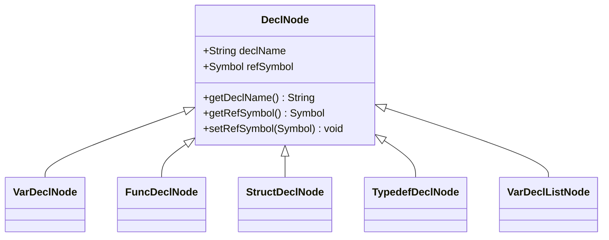

**Diagram sources**
- [DeclNode.java](file://ep20/src/main/java/org/teachfx/antlr4/ep20/ast/decl/DeclNode.java#L1-L36)

**Section sources**
- [DeclNode.java](file://ep20/src/main/java/org/teachfx/antlr4/ep20/ast/decl/DeclNode.java#L1-L36)

### Variable Declarations
Variable declarations are represented by two classes: `VarDeclNode` for individual variables and `VarDeclListNode` for lists of variable declarations. The `VarDeclNode` captures the variable's name, type, and optional initializer expression.

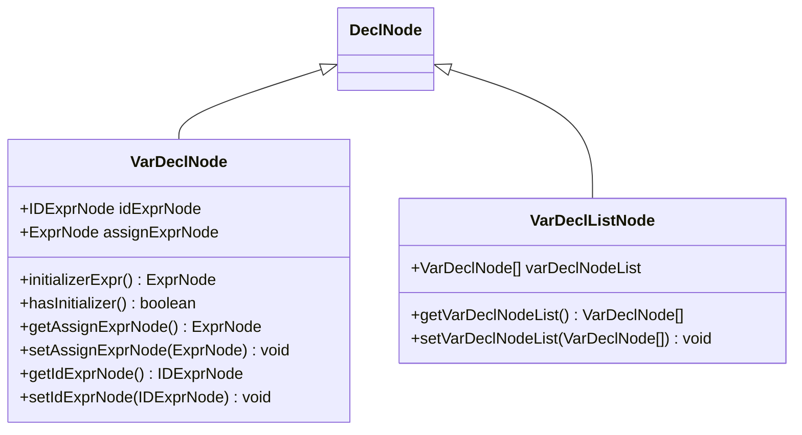

**Diagram sources**
- [VarDeclNode.java](file://ep20/src/main/java/org/teachfx/antlr4/ep20/ast/decl/VarDeclNode.java#L1-L67)
- [VarDeclListNode.java](file://ep20/src/main/java/org/teachfx/antlr4/ep20/ast/decl/VarDeclListNode.java#L1-L36)

**Section sources**
- [VarDeclNode.java](file://ep20/src/main/java/org/teachfx/antlr4/ep20/ast/decl/VarDeclNode.java#L1-L67)
- [VarDeclListNode.java](file://ep20/src/main/java/org/teachfx/antlr4/ep20/ast/decl/VarDeclListNode.java#L1-L36)

### Function Declarations
Function declarations are represented by `FuncDeclNode`, which captures the function's return type, name, parameters, and body. Parameters are stored as a `VarDeclListNode`, representing a list of parameter declarations.

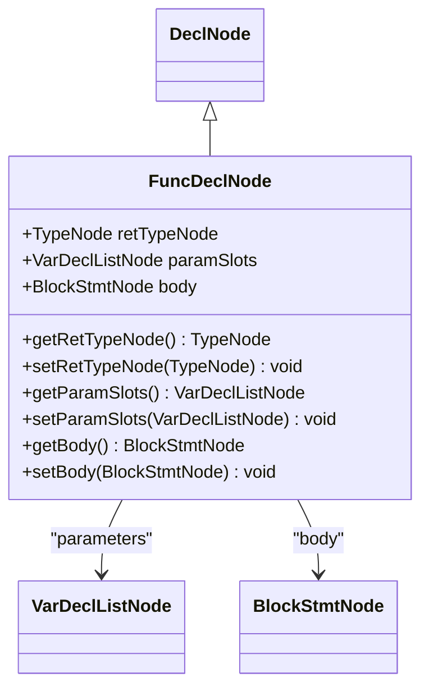

**Diagram sources**
- [FuncDeclNode.java](file://ep20/src/main/java/org/teachfx/antlr4/ep20/ast/decl/FuncDeclNode.java#L1-L63)

**Section sources**
- [FuncDeclNode.java](file://ep20/src/main/java/org/teachfx/antlr4/ep20/ast/decl/FuncDeclNode.java#L1-L63)

### Structure Declarations
Structure declarations are represented by `StructDeclNode` and `StructMemberNode`. The `StructDeclNode` contains the structure name and a list of members, while each `StructMemberNode` represents an individual field with its type, name, and array size (if applicable).

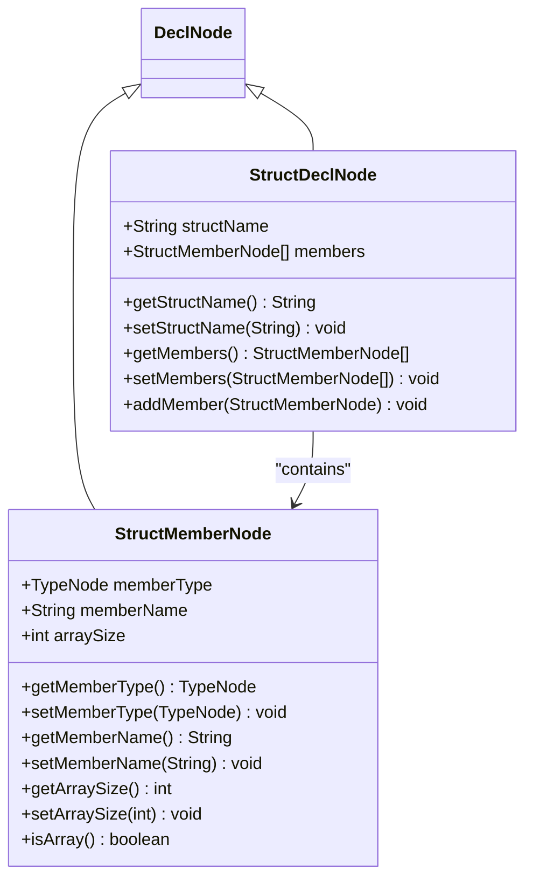

**Diagram sources**
- [StructDeclNode.java](file://ep20/src/main/java/org/teachfx/antlr4/ep20/ast/decl/StructDeclNode.java#L1-L62)
- [StructMemberNode.java](file://ep20/src/main/java/org/teachfx/antlr4/ep20/ast/decl/StructMemberNode.java#L1-L73)

**Section sources**
- [StructDeclNode.java](file://ep20/src/main/java/org/teachfx/antlr4/ep20/ast/decl/StructDeclNode.java#L1-L62)
- [StructMemberNode.java](file://ep20/src/main/java/org/teachfx/antlr4/ep20/ast/decl/StructMemberNode.java#L1-L73)

### Type Alias Declarations
Type aliases are represented by `TypedefDeclNode`, which captures the original type being aliased and the new alias name. This allows for creating alternative names for existing types in the language.

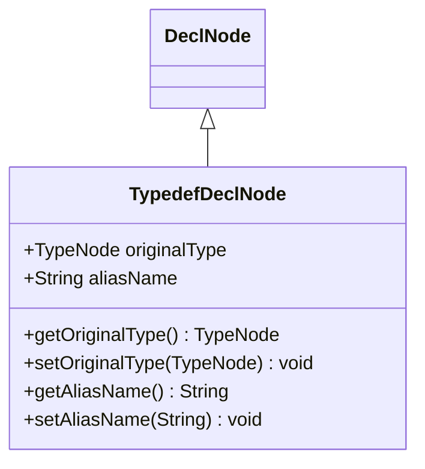

**Diagram sources**
- [TypedefDeclNode.java](file://ep20/src/main/java/org/teachfx/antlr4/ep20/ast/decl/TypedefDeclNode.java#L1-L53)

**Section sources**
- [TypedefDeclNode.java](file://ep20/src/main/java/org/teachfx/antlr4/ep20/ast/decl/TypedefDeclNode.java#L1-L53)

## Symbol Binding and Scope Management

### Symbol Table Integration
Declarations establish entries in the symbol table through the `refSymbol` field in `DeclNode`. When a declaration is processed, a corresponding symbol object (such as `VariableSymbol`) is created and linked to the declaration node. This binding enables semantic analysis to resolve identifiers to their declarations.

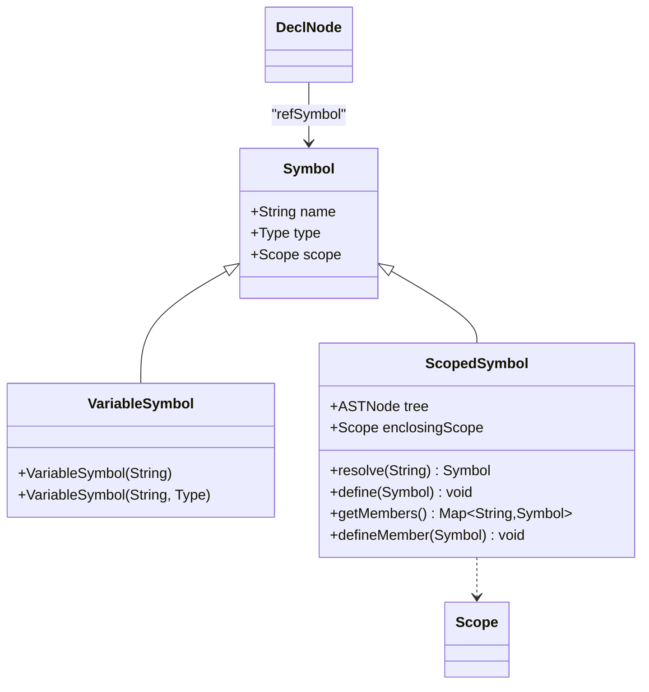

**Diagram sources**
- [VariableSymbol.java](file://ep20/src/main/java/org/teachfx/antlr4/ep20/symtab/symbol/VariableSymbol.java#L1-L18)
- [ScopedSymbol.java](file://ep20/src/main/java/org/teachfx/antlr4/ep20/symtab/symbol/ScopedSymbol.java#L1-L69)
- [DeclNode.java](file://ep20/src/main/java/org/teachfx/antlr4/ep20/ast/decl/DeclNode.java#L1-L36)

**Section sources**
- [VariableSymbol.java](file://ep20/src/main/java/org/teachfx/antlr4/ep20/symtab/symbol/VariableSymbol.java#L1-L18)
- [ScopedSymbol.java](file://ep20/src/main/java/org/teachfx/antlr4/ep20/symtab/symbol/ScopedSymbol.java#L1-L69)

### Scope Resolution
The symbol table system uses a hierarchical scope structure where each scope can have an enclosing scope. When resolving a symbol, the system first checks the current scope and then traverses up the chain of enclosing scopes until the symbol is found or the global scope is reached.

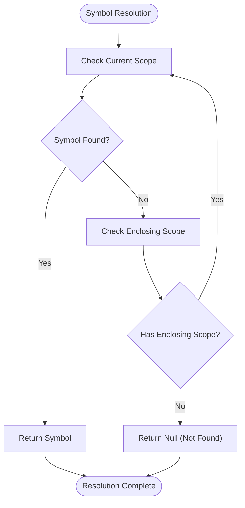

**Diagram sources**
- [ScopedSymbol.java](file://ep20/src/main/java/org/teachfx/antlr4/ep20/symtab/symbol/ScopedSymbol.java#L1-L69)

## Visitor Pattern for Semantic Analysis

### AST Traversal Mechanism
The visitor pattern is implemented through the `ASTVisitor` interface and the `accept` methods in each AST node. This enables separation of traversal logic from the AST structure, allowing multiple analysis passes (such as symbol collection and type checking) to be implemented independently.

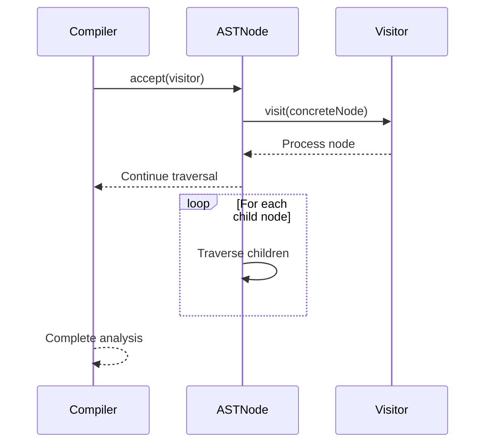

**Diagram sources**
- [VarDeclNode.java](file://ep20/src/main/java/org/teachfx/antlr4/ep20/ast/decl/VarDeclNode.java#L1-L67)
- [FuncDeclNode.java](file://ep20/src/main/java/org/teachfx/antlr4/ep20/ast/decl/FuncDeclNode.java#L1-L63)

**Section sources**
- [VarDeclNode.java](file://ep20/src/main/java/org/teachfx/antlr4/ep20/ast/decl/VarDeclNode.java#L1-L67)
- [FuncDeclNode.java](file://ep20/src/main/java/org/teachfx/antlr4/ep20/ast/decl/FuncDeclNode.java#L1-L63)

### Symbol Collection Process
During the symbol collection phase, a visitor traverses the AST and processes declaration nodes to populate the symbol table. For each declaration, the visitor creates the appropriate symbol object and adds it to the current scope.

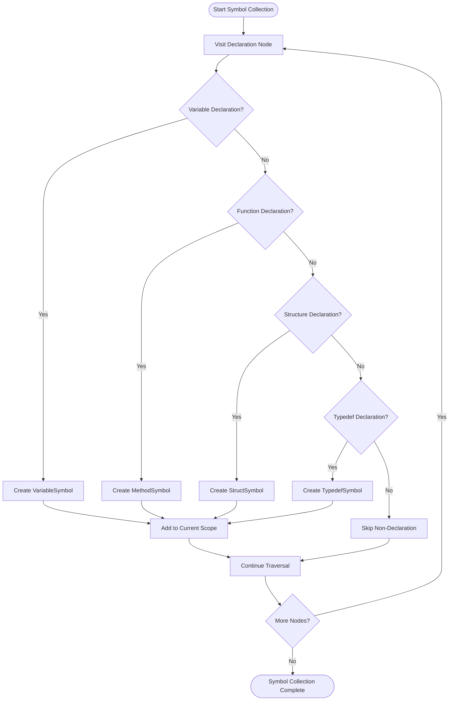

**Diagram sources**
- [ScopedSymbol.java](file://ep20/src/main/java/org/teachfx/antlr4/ep20/symtab/symbol/ScopedSymbol.java#L1-L69)
- [VariableSymbol.java](file://ep20/src/main/java/org/teachfx/antlr4/ep20/symtab/symbol/VariableSymbol.java#L1-L18)

## Declaration Order and Forward References

### Declaration Processing Sequence
The order of declarations affects semantic analysis, particularly for resolving identifiers and checking type correctness. The compiler processes declarations in the order they appear in the source code, which impacts how forward references are handled.

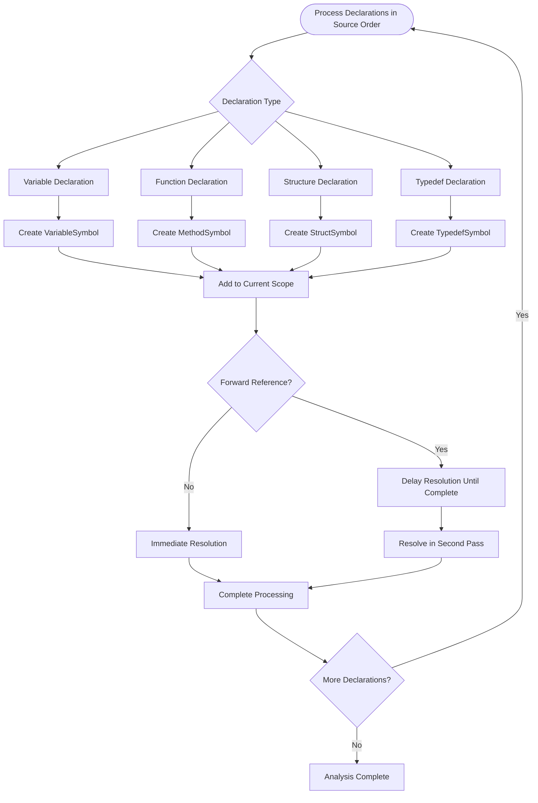

**Diagram sources**
- [DeclNode.java](file://ep20/src/main/java/org/teachfx/antlr4/ep20/ast/decl/DeclNode.java#L1-L36)
- [ScopedSymbol.java](file://ep20/src/main/java/org/teachfx/antlr4/ep20/symtab/symbol/ScopedSymbol.java#L1-L69)

**Section sources**
- [DeclNode.java](file://ep20/src/main/java/org/teachfx/antlr4/ep20/ast/decl/DeclNode.java#L1-L36)
- [ScopedSymbol.java](file://ep20/src/main/java/org/teachfx/antlr4/ep20/symtab/symbol/ScopedSymbol.java#L1-L69)

### Forward Reference Handling
Forward references occur when an identifier is used before its declaration. The compiler handles these by using a two-phase approach: first collecting all declarations to build the symbol table, then performing type checking and other analyses that require complete symbol information.

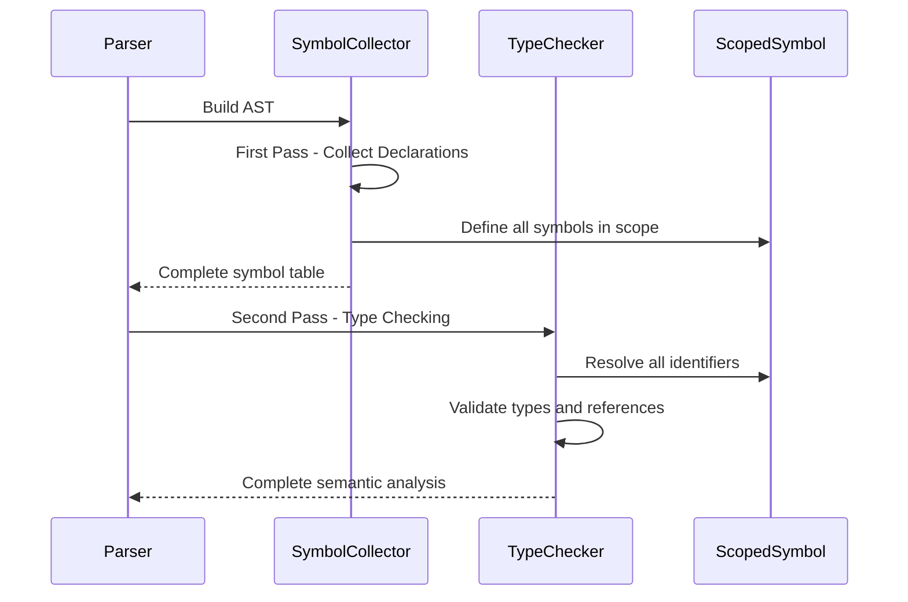

**Diagram sources**
- [ScopedSymbol.java](file://ep20/src/main/java/org/teachfx/antlr4/ep20/symtab/symbol/ScopedSymbol.java#L1-L69)

## Conclusion
The AST declaration hierarchy provides a robust foundation for representing and analyzing program declarations in the Cymbol compiler. By using an inheritance-based structure with `DeclNode` as the base class, the system maintains consistency across different declaration types while allowing for specialized behavior. The integration with the symbol table system through the visitor pattern enables efficient semantic analysis, including symbol collection and type checking. The hierarchical scope management supports proper name resolution, and the two-phase analysis approach handles forward references effectively. This design demonstrates a clean separation of concerns between syntax representation, symbol management, and semantic analysis.