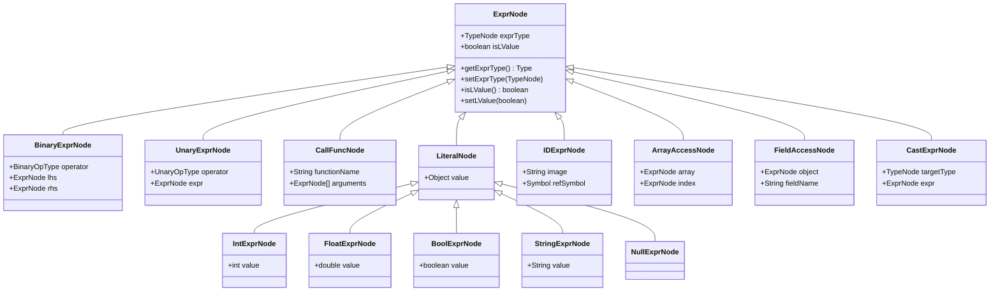
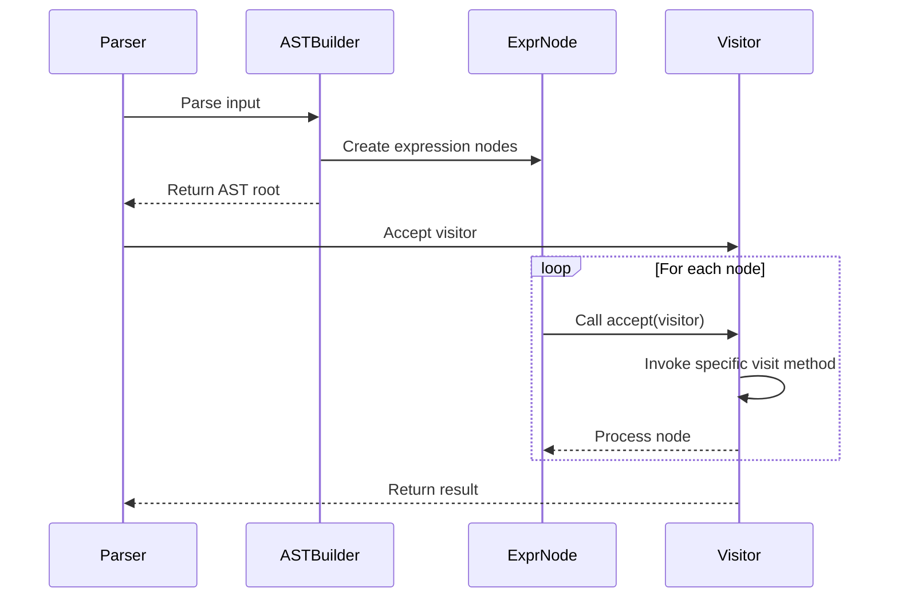
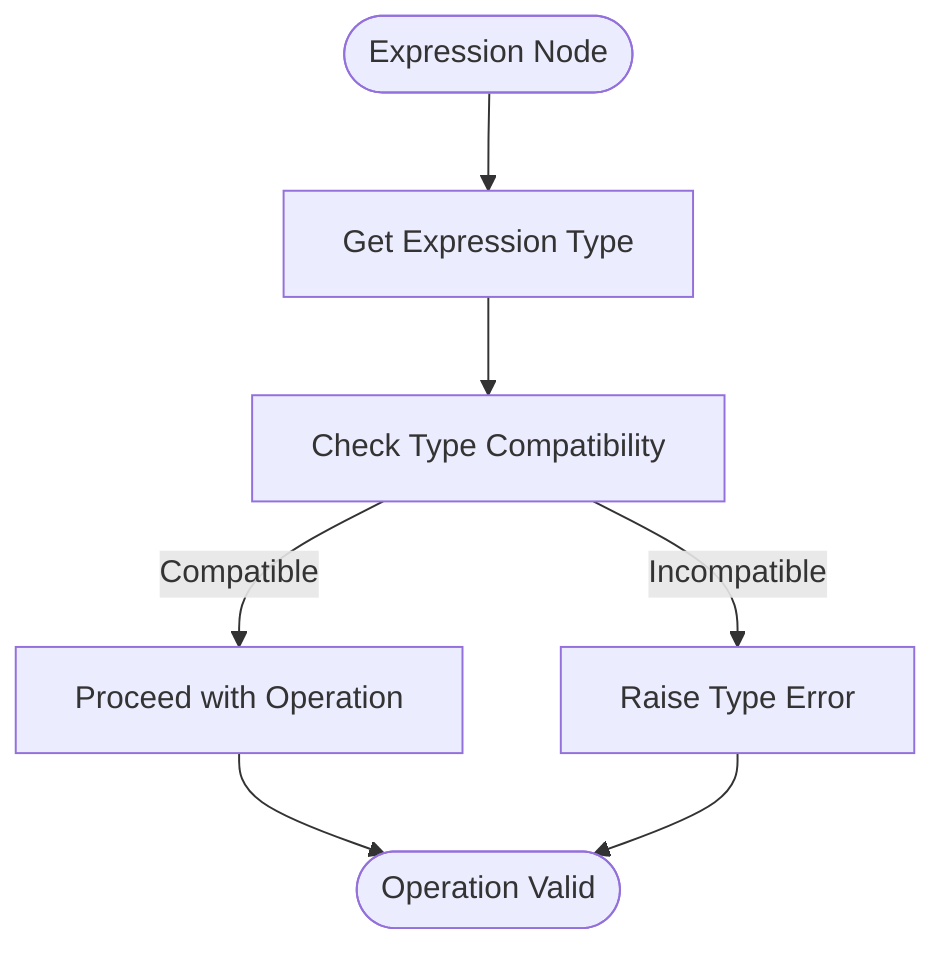
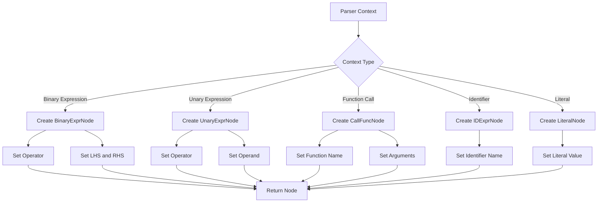
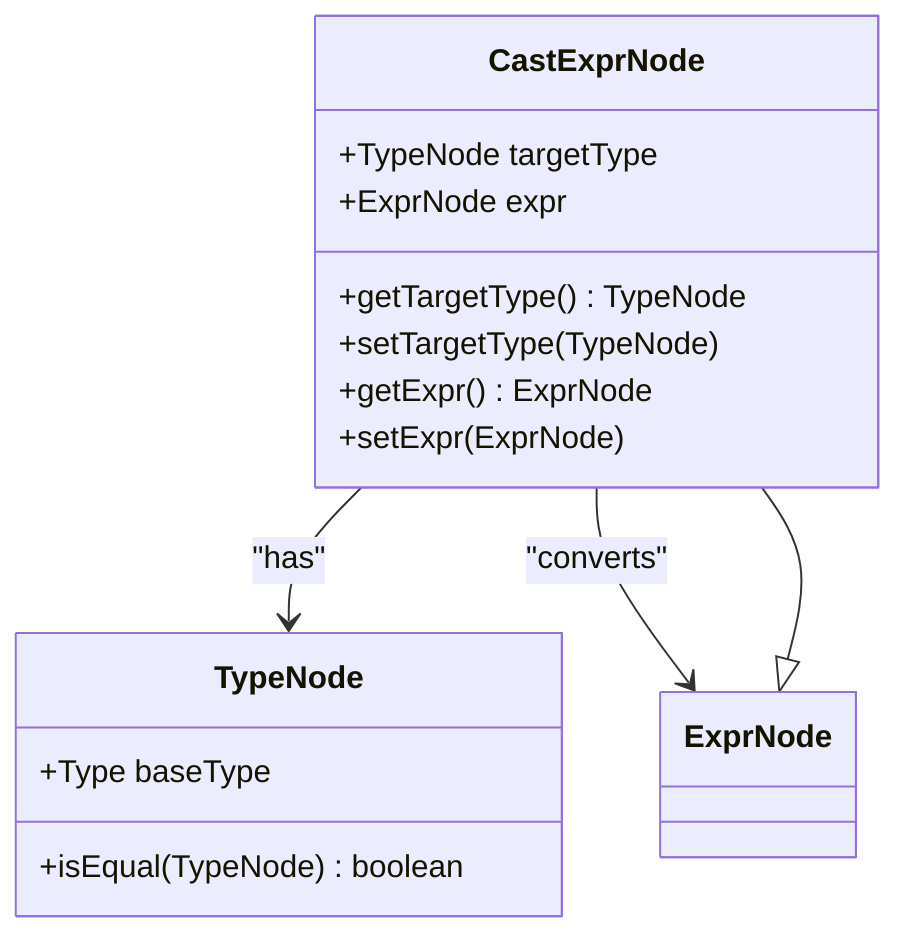
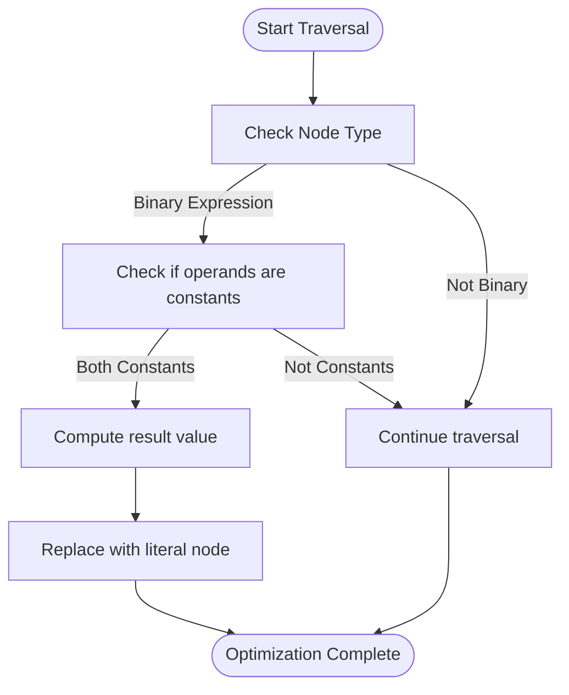

# AST Expressions

<cite>
**Referenced Files in This Document**   
- [ExprNode.java](file://ep20/src/main/java/org/teachfx/antlr4/ep20/ast/expr/ExprNode.java)
- [ASTVisitor.java](file://ep20/src/main/java/org/teachfx/antlr4/ep20/ast/ASTVisitor.java)
- [CymbolASTBuilder.java](file://ep20/src/main/java/org/teachfx/antlr4/ep20/pass/ast/CymbolASTBuilder.java)
- [CastExprNode.java](file://ep20/src/main/java/org/teachfx/antlr4/ep20/ast/expr/CastExprNode.java)
- [IDExprNode.java](file://ep20/src/main/java/org/teachfx/antlr4/ep20/ast/expr/IDExprNode.java)
- [TypeTable.java](file://ep20/src/main/java/org/teachfx/antlr4/ep20/symtab/type/TypeTable.java)
</cite>

## Table of Contents
1. [Introduction](#introduction)
2. [Core Components](#core-components)
3. [Expression Hierarchy](#expression-hierarchy)
4. [Visitor Pattern Implementation](#visitor-pattern-implementation)
5. [Expression Typing and Semantic Analysis](#expression-typing-and-semantic-analysis)
6. [Expression Construction and Traversal](#expression-construction-and-traversal)
7. [Type Conversion and Casting](#type-conversion-and-casting)
8. [Constant Folding and Optimization](#constant-folding-and-optimization)
9. [Conclusion](#conclusion)

## Introduction
This document provides a comprehensive analysis of the Abstract Syntax Tree (AST) expression hierarchy in the Antlr4-based compiler implementation. It details how expression nodes are structured, typed, and processed throughout the compilation pipeline. The focus is on the ExprNode base class and its concrete implementations that represent various expression types in the language.

## Core Components

The AST expression system is built around several key components that work together to represent and process expressions. The ExprNode class serves as the foundation for all expression types, providing common properties such as type information and l-value status. The ASTVisitor interface enables the visitor pattern for traversing and processing expression nodes, while the CymbolASTBuilder constructs the expression tree from parser contexts.

**Section sources**
- [ExprNode.java](file://ep20/src/main/java/org/teachfx/antlr4/ep20/ast/expr/ExprNode.java#L1-L40)
- [ASTVisitor.java](file://ep20/src/main/java/org/teachfx/antlr4/ep20/ast/ASTVisitor.java#L1-L123)
- [CymbolASTBuilder.java](file://ep20/src/main/java/org/teachfx/antlr4/ep20/pass/ast/CymbolASTBuilder.java#L1-L318)

## Expression Hierarchy

**Diagram sources**
- [ExprNode.java](file://ep20/src/main/java/org/teachfx/antlr4/ep20/ast/expr/ExprNode.java#L1-L40)
- [BinaryExprNode.java](file://ep20/src/main/java/org/teachfx/antlr4/ep20/ast/expr/BinaryExprNode.java#L1-L30)
- [UnaryExprNode.java](file://ep20/src/main/java/org/teachfx/antlr4/ep20/ast/expr/UnaryExprNode.java#L1-L30)
- [CallFuncNode.java](file://ep20/src/main/java/org/teachfx/antlr4/ep20/ast/expr/CallFuncNode.java#L1-L30)
- [LiteralNode.java](file://ep20/src/main/java/org/teachfx/antlr4/ep20/ast/expr/LiteralNode.java#L1-L20)
- [IDExprNode.java](file://ep20/src/main/java/org/teachfx/antlr4/ep20/ast/expr/IDExprNode.java#L1-L70)
- [ArrayAccessNode.java](file://ep20/src/main/java/org/teachfx/antlr4/ep20/ast/expr/ArrayAccessNode.java#L1-L30)
- [FieldAccessNode.java](file://ep20/src/main/java/org/teachfx/antlr4/ep20/ast/expr/FieldAccessNode.java#L1-L30)
- [CastExprNode.java](file://ep20/src/main/java/org/teachfx/antlr4/ep20/ast/expr/CastExprNode.java#L1-L53)

**Section sources**
- [ExprNode.java](file://ep20/src/main/java/org/teachfx/antlr4/ep20/ast/expr/ExprNode.java#L1-L40)
- [BinaryExprNode.java](file://ep20/src/main/java/org/teachfx/antlr4/ep20/ast/expr/BinaryExprNode.java#L1-L30)
- [UnaryExprNode.java](file://ep20/src/main/java/org/teachfx/antlr4/ep20/ast/expr/UnaryExprNode.java#L1-L30)

## Visitor Pattern Implementation

The visitor pattern is implemented through the ASTVisitor interface, which defines methods for visiting different types of AST nodes. This enables separation of algorithms from the object structure, allowing for easy extension of operations on the AST without modifying the node classes themselves. The visitor interface uses double dispatch to ensure the correct visit method is called for each node type.

**Diagram sources**
- [ASTVisitor.java](file://ep20/src/main/java/org/teachfx/antlr4/ep20/ast/ASTVisitor.java#L1-L123)
- [ExprNode.java](file://ep20/src/main/java/org/teachfx/antlr4/ep20/ast/expr/ExprNode.java#L1-L40)
- [CymbolASTBuilder.java](file://ep20/src/main/java/org/teachfx/antlr4/ep20/pass/ast/CymbolASTBuilder.java#L1-L318)

**Section sources**
- [ASTVisitor.java](file://ep20/src/main/java/org/teachfx/antlr4/ep20/ast/ASTVisitor.java#L1-L123)
- [ExprNode.java](file://ep20/src/main/java/org/teachfx/antlr4/ep20/ast/expr/ExprNode.java#L1-L40)

## Expression Typing and Semantic Analysis

Expression typing is resolved during semantic analysis by associating each expression node with a type. The ExprNode class contains a TypeNode field that stores the expression's type, which is determined during the semantic analysis phase. Type checking ensures that operations are performed on compatible types and that assignments respect type constraints.

**Diagram sources**
- [ExprNode.java](file://ep20/src/main/java/org/teachfx/antlr4/ep20/ast/expr/ExprNode.java#L1-L40)
- [TypeTable.java](file://ep20/src/main/java/org/teachfx/antlr4/ep20/symtab/type/TypeTable.java#L1-L20)

**Section sources**
- [ExprNode.java](file://ep20/src/main/java/org/teachfx/antlr4/ep20/ast/expr/ExprNode.java#L1-L40)
- [TypeTable.java](file://ep20/src/main/java/org/teachfx/antlr4/ep20/symtab/type/TypeTable.java#L1-L20)

## Expression Construction and Traversal

Expression nodes are constructed by the CymbolASTBuilder during the parsing phase. The builder visits parser contexts and creates corresponding AST nodes, establishing parent-child relationships that form the expression tree. Expression traversal is facilitated by the visitor pattern, allowing systematic processing of the entire tree or specific subtrees.

**Diagram sources**
- [CymbolASTBuilder.java](file://ep20/src/main/java/org/teachfx/antlr4/ep20/pass/ast/CymbolASTBuilder.java#L1-L318)
- [ExprNode.java](file://ep20/src/main/java/org/teachfx/antlr4/ep20/ast/expr/ExprNode.java#L1-L40)

**Section sources**
- [CymbolASTBuilder.java](file://ep20/src/main/java/org/teachfx/antlr4/ep20/pass/ast/CymbolASTBuilder.java#L1-L318)

## Type Conversion and Casting

Type conversion is handled through the CastExprNode class, which represents explicit type casting operations in the source code. The cast expression contains a target type and an expression to be converted. During semantic analysis, the type checker verifies that the cast is valid according to the language's type system rules.

**Diagram sources**
- [CastExprNode.java](file://ep20/src/main/java/org/teachfx/antlr4/ep20/ast/expr/CastExprNode.java#L1-L53)
- [TypeNode.java](file://ep20/src/main/java/org/teachfx/antlr4/ep20/ast/type/TypeNode.java#L1-L20)

**Section sources**
- [CastExprNode.java](file://ep20/src/main/java/org/teachfx/antlr4/ep20/ast/expr/CastExprNode.java#L1-L53)

## Constant Folding and Optimization

Constant folding can be implemented as a visitor that traverses the expression tree and evaluates constant expressions at compile time. When the visitor encounters a binary operation with two constant operands, it can replace the expression node with a literal node containing the computed value, optimizing the generated code.

**Diagram sources**
- [BinaryExprNode.java](file://ep20/src/main/java/org/teachfx/antlr4/ep20/ast/expr/BinaryExprNode.java#L1-L30)
- [IntExprNode.java](file://ep20/src/main/java/org/teachfx/antlr4/ep20/ast/expr/IntExprNode.java#L1-L20)
- [FloatExprNode.java](file://ep20/src/main/java/org/teachfx/antlr4/ep20/ast/expr/FloatExprNode.java#L1-L20)

**Section sources**
- [BinaryExprNode.java](file://ep20/src/main/java/org/teachfx/antlr4/ep20/ast/expr/BinaryExprNode.java#L1-L30)

## Conclusion

The AST expression hierarchy provides a robust foundation for representing and processing expressions in the compiler. The ExprNode base class establishes common properties for all expressions, while concrete subclasses represent specific expression types. The visitor pattern enables flexible processing of the expression tree for semantic analysis, optimization, and code generation. Type information is maintained throughout the compilation process, ensuring type safety and enabling optimizations like constant folding.