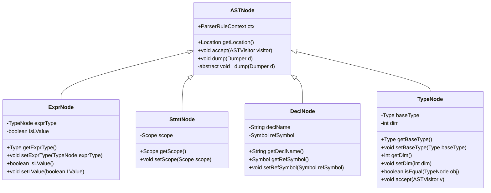
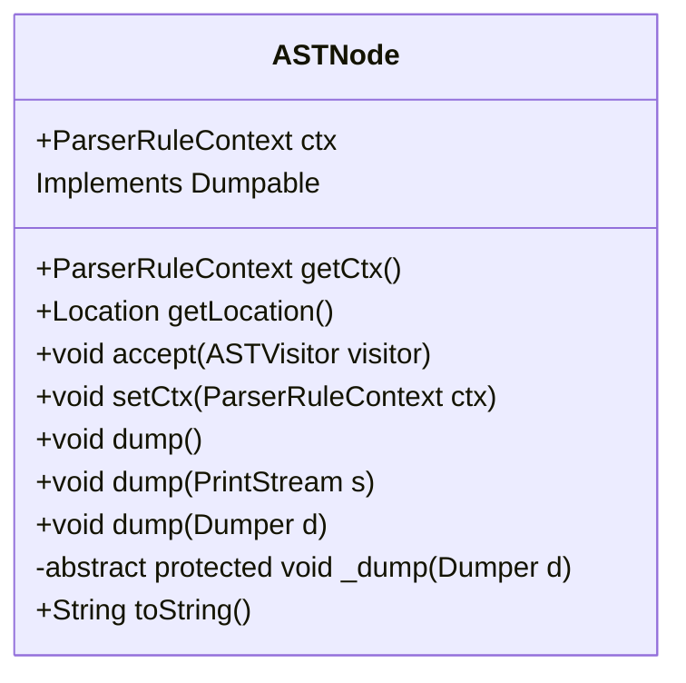
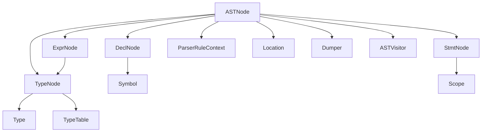

# AST Node Hierarchy

<cite>
**Referenced Files in This Document**   
- [ASTNode.java](file://ep20/src/main/java/org/teachfx/antlr4/ep20/ast/ASTNode.java)
- [ExprNode.java](file://ep20/src/main/java/org/teachfx/antlr4/ep20/ast/expr/ExprNode.java)
- [StmtNode.java](file://ep20/src/main/java/org/teachfx/antlr4/ep20/ast/stmt/StmtNode.java)
- [DeclNode.java](file://ep20/src/main/java/org/teachfx/antlr4/ep20/ast/decl/DeclNode.java)
- [TypeNode.java](file://ep20/src/main/java/org/teachfx/antlr4/ep20/ast/type/TypeNode.java)
</cite>

## Table of Contents
1. [Introduction](#introduction)
2. [Core Components](#core-components)
3. [Architecture Overview](#architecture-overview)
4. [Detailed Component Analysis](#detailed-component-analysis)
5. [Dependency Analysis](#dependency-analysis)
6. [Conclusion](#conclusion)

## Introduction
This document provides a comprehensive analysis of the Abstract Syntax Tree (AST) node hierarchy in the Cymbol compiler implementation. The AST serves as the central data structure for representing source code during compilation, enabling semantic analysis, type checking, and code generation. The design follows object-oriented principles with a well-defined inheritance hierarchy that categorizes nodes by syntactic role.

## Core Components

The AST node hierarchy is built around a base `ASTNode` class that provides common functionality for all node types. The hierarchy is organized into four primary subcategories: expressions, statements, declarations, and types. Each category has its own base class that extends `ASTNode` and defines category-specific properties and behaviors.

**Section sources**
- [ASTNode.java](file://ep20/src/main/java/org/teachfx/antlr4/ep20/ast/ASTNode.java#L8-L46)
- [ExprNode.java](file://ep20/src/main/java/org/teachfx/antlr4/ep20/ast/expr/ExprNode.java#L7-L40)
- [StmtNode.java](file://ep20/src/main/java/org/teachfx/antlr4/ep20/ast/stmt/StmtNode.java#L6-L21)
- [DeclNode.java](file://ep20/src/main/java/org/teachfx/antlr4/ep20/ast/decl/DeclNode.java#L6-L35)
- [TypeNode.java](file://ep20/src/main/java/org/teachfx/antlr4/ep20/ast/type/TypeNode.java#L9-L69)

## Architecture Overview

The AST node hierarchy follows a classic compiler design pattern with a root base class and specialized subclasses for different syntactic categories. This architecture enables type-safe tree manipulation and supports pattern matching during semantic analysis phases.



**Diagram sources**
- [ASTNode.java](file://ep20/src/main/java/org/teachfx/antlr4/ep20/ast/ASTNode.java#L8-L46)
- [ExprNode.java](file://ep20/src/main/java/org/teachfx/antlr4/ep20/ast/expr/ExprNode.java#L7-L40)
- [StmtNode.java](file://ep20/src/main/java/org/teachfx/antlr4/ep20/ast/stmt/StmtNode.java#L6-L21)
- [DeclNode.java](file://ep20/src/main/java/org/teachfx/antlr4/ep20/ast/decl/DeclNode.java#L6-L35)
- [TypeNode.java](file://ep20/src/main/java/org/teachfx/antlr4/ep20/ast/type/TypeNode.java#L9-L69)

## Detailed Component Analysis

### ASTNode Base Class Analysis
The `ASTNode` class serves as the abstract base class for all AST nodes in the compiler. It provides fundamental properties and methods that are common across all node types, establishing a consistent interface for tree traversal and debugging.

The class maintains a reference to the ANTLR parser context (`ParserRuleContext`) which enables retrieval of source location information through the `getLocation()` method. This location information is crucial for error reporting and debugging. The class also implements the visitor pattern through the `accept(ASTVisitor visitor)` method, enabling separation of algorithms from the object structure.



**Diagram sources**
- [ASTNode.java](file://ep20/src/main/java/org/teachfx/antlr4/ep20/ast/ASTNode.java#L8-L46)

**Section sources**
- [ASTNode.java](file://ep20/src/main/java/org/teachfx/antlr4/ep20/ast/ASTNode.java#L8-L46)

### Expression Node Hierarchy
The `ExprNode` class extends `ASTNode` and serves as the base class for all expression nodes in the AST. It introduces type-related properties that are essential for semantic analysis, including type information and l-value status.

Expression nodes carry type information through the `exprType` field of type `TypeNode`, which allows the compiler to perform type checking and inference. The `isLValue` flag indicates whether the expression can appear on the left-hand side of an assignment, which is critical for enforcing language semantics.

```mermaid
classDiagram
class ExprNode {
-TypeNode exprType
-boolean isLValue
+ExprNode()
+boolean isEqual(Type types)
+void setExprType(TypeNode exprType)
+boolean isLValue()
+void setLValue(boolean LValue)
+Type getExprType()
-void _dump(Dumper d)
}
ASTNode <|-- ExprNode
ExprNode : exprType : TypeNode
ExprNode : isLValue : boolean
```

**Diagram sources**
- [ExprNode.java](file://ep20/src/main/java/org/teachfx/antlr4/ep20/ast/expr/ExprNode.java#L7-L40)

**Section sources**
- [ExprNode.java](file://ep20/src/main/java/org/teachfx/antlr4/ep20/ast/expr/ExprNode.java#L7-L40)

### Statement Node Hierarchy
The `StmtNode` class extends `ASTNode` and serves as the base class for all statement nodes. It introduces scope management capabilities that are essential for symbol resolution and name binding during semantic analysis.

Statement nodes maintain a reference to their associated `Scope`, which contains the symbol table for that lexical scope. This enables the compiler to resolve identifiers, check for name conflicts, and enforce scoping rules. The scope is set during the symbol resolution phase and used throughout subsequent compilation phases.

```mermaid
classDiagram
class StmtNode {
-Scope scope
+Scope getScope()
+void setScope(Scope scope)
-void _dump(Dumper d)
}
ASTNode <|-- StmtNode
StmtNode : scope : Scope
```

**Diagram sources**
- [StmtNode.java](file://ep20/src/main/java/org/teachfx/antlr4/ep20/ast/stmt/StmtNode.java#L6-L21)

**Section sources**
- [StmtNode.java](file://ep20/src/main/java/org/teachfx/antlr4/ep20/ast/stmt/StmtNode.java#L6-L21)

### Declaration Node Hierarchy
The `DeclNode` class extends `ASTNode` and serves as the base class for all declaration nodes. It provides common functionality for named declarations, including name storage and symbol table integration.

Declaration nodes maintain the declared name through the `declName` field and a reference to the corresponding `Symbol` in the symbol table. The `setRefSymbol` method automatically synchronizes the declaration name with the symbol name, ensuring consistency between the AST and symbol table. This integration is crucial for semantic analysis and code generation.

```mermaid
classDiagram
class DeclNode {
-String declName
-Symbol refSymbol
+String getDeclName()
+Symbol getRefSymbol()
+void setRefSymbol(Symbol refSymbol)
+DeclNode()
+DeclNode(String name)
-void _dump(Dumper d)
}
ASTNode <|-- DeclNode
DeclNode : declName : String
DeclNode : refSymbol : Symbol
```

**Diagram sources**
- [DeclNode.java](file://ep20/src/main/java/org/teachfx/antlr4/ep20/ast/decl/DeclNode.java#L6-L35)

**Section sources**
- [DeclNode.java](file://ep20/src/main/java/org/teachfx/antlr4/ep20/ast/decl/DeclNode.java#L6-L35)

### Type Node Hierarchy
The `TypeNode` class extends `ASTNode` and represents type information in the AST. Unlike other node types, `TypeNode` is a concrete class that encapsulates type data for expressions, variables, and function signatures.

Type nodes maintain a reference to the underlying `Type` object and dimension information for array types. The class provides utility methods for type comparison (`isEqual`) and includes static instances for common types (IntNode, VoidNode, etc.) to reduce object creation. The class also implements the visitor pattern, allowing type-specific processing during semantic analysis.

```mermaid
classDiagram
class TypeNode {
-Type baseType
-int dim
+Type getBaseType()
+void setBaseType(Type baseType)
+int getDim()
+void setDim(int dim)
+static TypeNode IntNode
+static TypeNode VoidNode
+static TypeNode StrNode
+static TypeNode ObjNode
+static TypeNode BoolNode
+TypeNode()
+TypeNode(Type baseType)
+TypeNode(Type type, ParserRuleContext ctx)
+boolean isEqual(TypeNode obj)
+boolean isEqual(Type types)
+void accept(ASTVisitor v)
-void _dump(Dumper d)
}
ASTNode <|-- TypeNode
TypeNode : baseType : Type
TypeNode : dim : int
```

**Diagram sources**
- [TypeNode.java](file://ep20/src/main/java/org/teachfx/antlr4/ep20/ast/type/TypeNode.java#L9-L69)

**Section sources**
- [TypeNode.java](file://ep20/src/main/java/org/teachfx/antlr4/ep20/ast/type/TypeNode.java#L9-L69)

## Dependency Analysis

The AST node hierarchy demonstrates a clear dependency structure where specialized node types depend on the base `ASTNode` class and related infrastructure classes. The hierarchy enables polymorphic behavior while maintaining type safety through inheritance.



**Diagram sources**
- [ASTNode.java](file://ep20/src/main/java/org/teachfx/antlr4/ep20/ast/ASTNode.java#L8-L46)
- [ExprNode.java](file://ep20/src/main/java/org/teachfx/antlr4/ep20/ast/expr/ExprNode.java#L7-L40)
- [StmtNode.java](file://ep20/src/main/java/org/teachfx/antlr4/ep20/ast/stmt/StmtNode.java#L6-L21)
- [DeclNode.java](file://ep20/src/main/java/org/teachfx/antlr4/ep20/ast/decl/DeclNode.java#L6-L35)
- [TypeNode.java](file://ep20/src/main/java/org/teachfx/antlr4/ep20/ast/type/TypeNode.java#L9-L69)

**Section sources**
- [ASTNode.java](file://ep20/src/main/java/org/teachfx/antlr4/ep20/ast/ASTNode.java#L8-L46)
- [ExprNode.java](file://ep20/src/main/java/org/teachfx/antlr4/ep20/ast/expr/ExprNode.java#L7-L40)
- [StmtNode.java](file://ep20/src/main/java/org/teachfx/antlr4/ep20/ast/stmt/StmtNode.java#L6-L21)
- [DeclNode.java](file://ep20/src/main/java/org/teachfx/antlr4/ep20/ast/decl/DeclNode.java#L6-L35)
- [TypeNode.java](file://ep20/src/main/java/org/teachfx/antlr4/ep20/ast/type/TypeNode.java#L9-L69)

## Conclusion
The AST node hierarchy in the Cymbol compiler provides a robust foundation for representing and manipulating source code during compilation. The design effectively uses inheritance to categorize nodes by syntactic role while maintaining common functionality through the base `ASTNode` class. The four primary sub-hierarchies—expressions, statements, declarations, and types—each serve distinct purposes in the compilation process and provide specialized properties and methods for their respective domains.

The hierarchy supports type-safe tree manipulation through well-defined interfaces and enables pattern matching via the visitor pattern. This design facilitates modular compiler construction, where different phases (parsing, semantic analysis, code generation) can operate on the same AST structure with minimal coupling. The integration with symbol tables and type systems ensures that semantic constraints are properly enforced throughout the compilation pipeline.