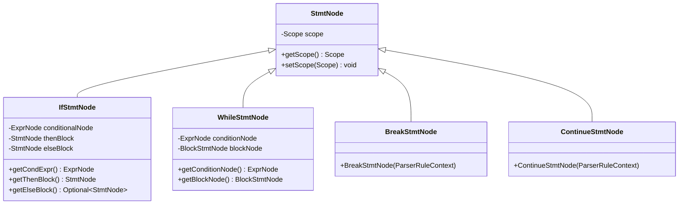
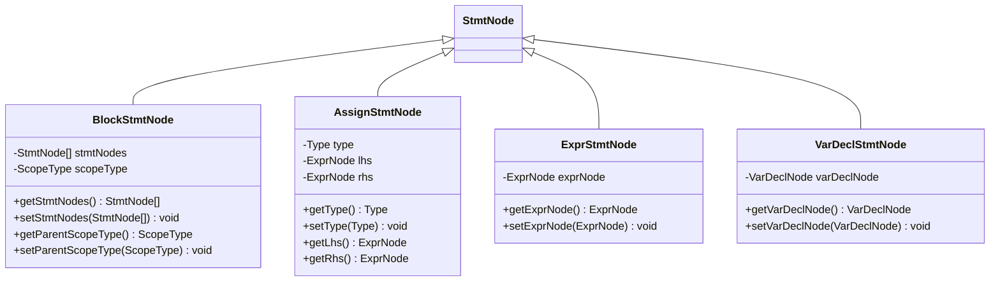
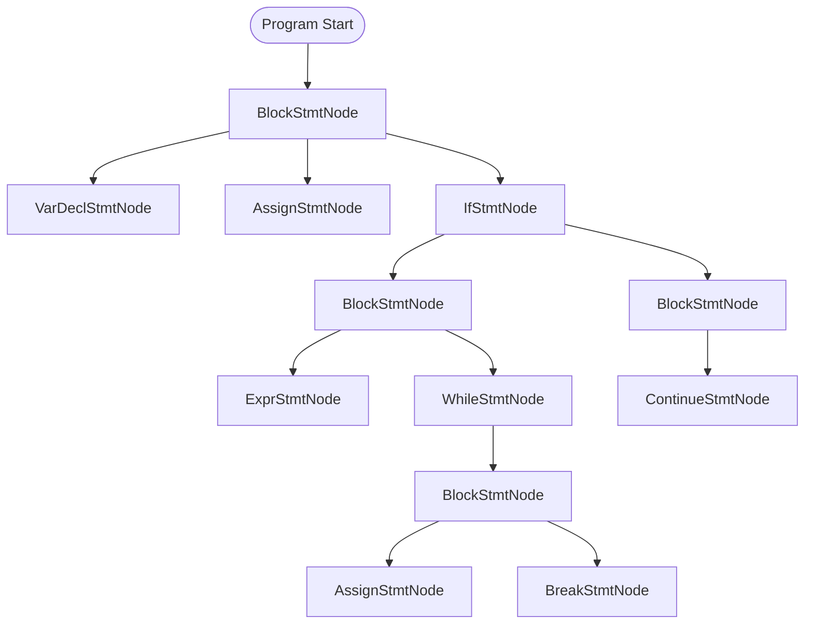
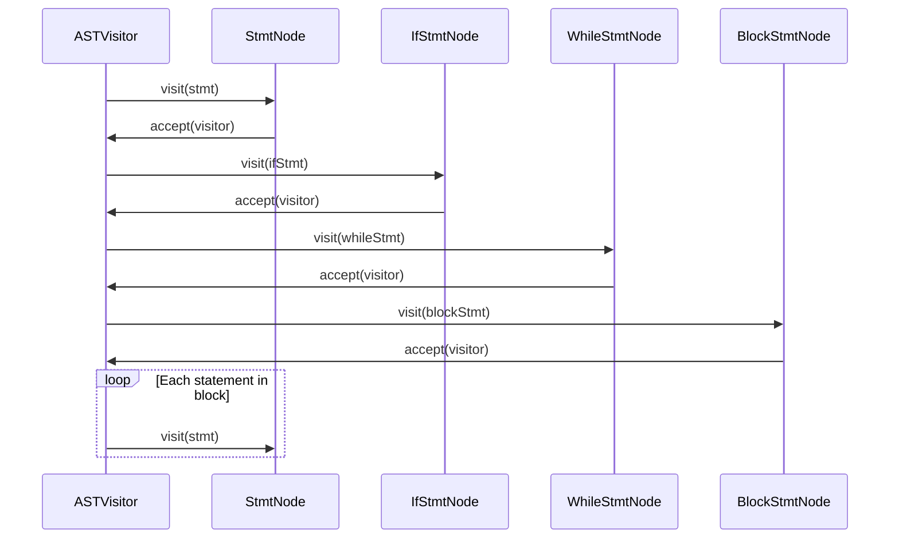

# AST Statements

<cite>
**Referenced Files in This Document**   
- [StmtNode.java](file://ep20/src/main/java/org/teachfx/antlr4/ep20/ast/stmt/StmtNode.java)
- [BlockStmtNode.java](file://ep20/src/main/java/org/teachfx/antlr4/ep20/ast/stmt/BlockStmtNode.java)
- [IfStmtNode.java](file://ep20/src/main/java/org/teachfx/antlr4/ep20/ast/stmt/IfStmtNode.java)
- [WhileStmtNode.java](file://ep20/src/main/java/org/teachfx/antlr4/ep20/ast/stmt/WhileStmtNode.java)
- [AssignStmtNode.java](file://ep20/src/main/java/org/teachfx/antlr4/ep20/ast/stmt/AssignStmtNode.java)
- [ExprStmtNode.java](file://ep20/src/main/java/org/teachfx/antlr4/ep20/ast/stmt/ExprStmtNode.java)
- [VarDeclStmtNode.java](file://ep20/src/main/java/org/teachfx/antlr4/ep20/ast/stmt/VarDeclStmtNode.java)
- [BreakStmtNode.java](file://ep20/src/main/java/org/teachfx/antlr4/ep20/ast/stmt/BreakStmtNode.java)
- [ContinueStmtNode.java](file://ep20/src/main/java/org/teachfx/antlr4/ep20/ast/stmt/ContinueStmtNode.java)
- [ScopeType.java](file://ep20/src/main/java/org/teachfx/antlr4/ep20/ast/stmt/ScopeType.java)
</cite>

## Table of Contents
1. [Introduction](#introduction)
2. [StmtNode Base Class](#stmtnode-base-class)
3. [Statement Types](#statement-types)
   - [Control Flow Statements](#control-flow-statements)
   - [Assignment Statements](#assignment-statements)
   - [Expression Statements](#expression-statements)
   - [Variable Declaration Statements](#variable-declaration-statements)
   - [Block Statements](#block-statements)
4. [Lexical Scoping and Scope Management](#lexical-scoping-and-scope-management)
5. [Statement Sequencing and Nesting](#statement-sequencing-and-nesting)
6. [Visitor Pattern for Control Flow Analysis](#visitor-pattern-for-control-flow-analysis)
7. [Statement Typing and Semantic Validation](#statement-typing-and-semantic-validation)
8. [Conclusion](#conclusion)

## Introduction
This document provides a comprehensive analysis of the Abstract Syntax Tree (AST) statement hierarchy in the compiler implementation. It details how the `StmtNode` class serves as the foundational base for all executable statements, defining core control flow properties and execution semantics. The document explores various statement types including control flow constructs, assignments, expressions, declarations, and blocks, explaining their structural relationships and behavioral characteristics within the AST framework.

## StmtNode Base Class
The `StmtNode` class serves as the abstract base class for all executable statements in the AST hierarchy. It extends `ASTNode` and introduces scope management capabilities through integration with the symbol table system. The class encapsulates fundamental statement properties including a reference to the lexical scope in which the statement executes, enabling semantic analysis and code generation passes to access contextual information.

Key responsibilities of `StmtNode` include:
- Maintaining reference to the enclosing `Scope` for lexical scoping
- Providing the foundation for the visitor pattern through the `accept()` method
- Supporting debugging and visualization via the `_dump()` method
- Storing parser context information for error reporting and source mapping

The abstract nature of `StmtNode` ensures that all concrete statement implementations inherit consistent behavior while allowing specialized implementations for different statement types.

**Section sources**
- [StmtNode.java](file://ep20/src/main/java/org/teachfx/antlr4/ep20/ast/stmt/StmtNode.java#L1-L23)

## Statement Types

### Control Flow Statements
Control flow statements manage program execution branching and looping logic. The AST implements several control flow constructs:

#### If Statement
The `IfStmtNode` represents conditional execution with optional else branch. It contains:
- A conditional expression (`ExprNode`) that evaluates to boolean
- A then-block (`StmtNode`) executed when condition is true
- An optional else-block (`StmtNode`) executed when condition is false

The structure supports both if-then and if-then-else patterns through optional else block handling.

#### While Statement
The `WhileStmtNode` implements looping constructs with:
- A condition expression (`ExprNode`) evaluated before each iteration
- A loop body (`BlockStmtNode`) containing statements to execute repeatedly

Execution continues while the condition evaluates to true, providing pre-test loop semantics.

#### Break and Continue Statements
`BreakStmtNode` and `ContinueStmtNode` provide loop control mechanisms:
- `BreakStmtNode` terminates the enclosing loop immediately
- `ContinueStmtNode` skips to the next iteration of the enclosing loop

Both are leaf nodes in the AST with no child expressions, serving as control flow directives.

**Diagram sources**
- [StmtNode.java](file://ep20/src/main/java/org/teachfx/antlr4/ep20/ast/stmt/StmtNode.java#L1-L23)
- [IfStmtNode.java](file://ep20/src/main/java/org/teachfx/antlr4/ep20/ast/stmt/IfStmtNode.java#L1-L61)
- [WhileStmtNode.java](file://ep20/src/main/java/org/teachfx/antlr4/ep20/ast/stmt/WhileStmtNode.java#L1-L47)
- [BreakStmtNode.java](file://ep20/src/main/java/org/teachfx/antlr4/ep20/ast/stmt/BreakStmtNode.java#L1-L24)
- [ContinueStmtNode.java](file://ep20/src/main/java/org/teachfx/antlr4/ep20/ast/stmt/ContinueStmtNode.java#L1-L21)

**Section sources**
- [IfStmtNode.java](file://ep20/src/main/java/org/teachfx/antlr4/ep20/ast/stmt/IfStmtNode.java#L1-L61)
- [WhileStmtNode.java](file://ep20/src/main/java/org/teachfx/antlr4/ep20/ast/stmt/WhileStmtNode.java#L1-L47)
- [BreakStmtNode.java](file://ep20/src/main/java/org/teachfx/antlr4/ep20/ast/stmt/BreakStmtNode.java#L1-L24)
- [ContinueStmtNode.java](file://ep20/src/main/java/org/teachfx/antlr4/ep20/ast/stmt/ContinueStmtNode.java#L1-L21)

### Assignment Statements
The `AssignStmtNode` class represents variable assignment operations in the AST. It contains:
- Left-hand side (`ExprNode`) representing the target of assignment
- Right-hand side (`ExprNode`) representing the value to assign
- Type information (`Type`) determined during semantic analysis

The assignment statement supports type checking and ensures type compatibility between LHS and RHS expressions during validation.

**Section sources**
- [AssignStmtNode.java](file://ep20/src/main/java/org/teachfx/antlr4/ep20/ast/stmt/AssignStmtNode.java#L1-L57)

### Expression Statements
The `ExprStmtNode` wraps expressions that are used as statements, typically for their side effects. It contains:
- A single `ExprNode` representing the expression to evaluate
- Parser context for source location tracking

This pattern allows expressions like function calls or increment operations to be used as standalone statements.

**Section sources**
- [ExprStmtNode.java](file://ep20/src/main/java/org/teachfx/antlr4/ep20/ast/stmt/ExprStmtNode.java#L1-L35)

### Variable Declaration Statements
The `VarDeclStmtNode` represents variable declaration statements in the AST. It encapsulates:
- A `VarDeclNode` containing declaration details (name, type, initializer)
- Integration with scope management for symbol table updates

This separation allows declaration logic to be reused across different contexts while maintaining statement semantics.

**Section sources**
- [VarDeclStmtNode.java](file://ep20/src/main/java/org/teachfx/antlr4/ep20/ast/stmt/VarDeclStmtNode.java#L1-L35)

### Block Statements
The `BlockStmtNode` represents compound statements or statement blocks. It contains:
- A list of `StmtNode` children representing sequential statements
- `ScopeType` enumeration indicating the block's scoping behavior
- Reference to parent scope type for nested scope resolution

Block statements enable grouping of multiple statements and introduce new lexical scopes.

**Diagram sources**
- [BlockStmtNode.java](file://ep20/src/main/java/org/teachfx/antlr4/ep20/ast/stmt/BlockStmtNode.java#L1-L48)
- [AssignStmtNode.java](file://ep20/src/main/java/org/teachfx/antlr4/ep20/ast/stmt/AssignStmtNode.java#L1-L57)
- [ExprStmtNode.java](file://ep20/src/main/java/org/teachfx/antlr4/ep20/ast/stmt/ExprStmtNode.java#L1-L35)
- [VarDeclStmtNode.java](file://ep20/src/main/java/org/teachfx/antlr4/ep20/ast/stmt/VarDeclStmtNode.java#L1-L35)

## Lexical Scoping and Scope Management
The AST statement hierarchy integrates with the symbol table system to manage lexical scoping through the `ScopeType` enumeration and `BlockStmtNode`. Each block statement can introduce a new scope, with `ScopeType` indicating the nature of the scope (e.g., function body, loop body, compound statement).

Key aspects include:
- `BlockStmtNode` maintains reference to its parent's scope type
- Statements inherit scope from their enclosing `BlockStmtNode`
- Scope resolution follows lexical nesting rules during semantic analysis
- Variable declarations register symbols in the appropriate scope

This design enables proper name resolution and prevents variable capture issues in nested constructs.

**Section sources**
- [BlockStmtNode.java](file://ep20/src/main/java/org/teachfx/antlr4/ep20/ast/stmt/BlockStmtNode.java#L1-L48)
- [ScopeType.java](file://ep20/src/main/java/org/teachfx/antlr4/ep20/ast/stmt/ScopeType.java)

## Statement Sequencing and Nesting
Statements can be sequenced and nested to form complex program structures. The AST represents sequencing through:
- `BlockStmtNode` containing ordered lists of `StmtNode` children
- Natural ordering reflecting source code sequence
- Hierarchical nesting through parent-child relationships

Nesting patterns include:
- Blocks within control flow statements (if, while)
- Control flow statements within blocks
- Mixed statement types in sequence
- Deeply nested scopes through multiple block levels

This hierarchical structure preserves program logic while enabling analysis passes to traverse execution order.

**Diagram sources**
- [BlockStmtNode.java](file://ep20/src/main/java/org/teachfx/antlr4/ep20/ast/stmt/BlockStmtNode.java#L1-L48)
- [IfStmtNode.java](file://ep20/src/main/java/org/teachfx/antlr4/ep20/ast/stmt/IfStmtNode.java#L1-L61)
- [WhileStmtNode.java](file://ep20/src/main/java/org/teachfx/antlr4/ep20/ast/stmt/WhileStmtNode.java#L1-L47)

## Visitor Pattern for Control Flow Analysis
The AST implements the visitor pattern through `ASTVisitor` interface, enabling control flow analysis and code generation. Each statement node implements the `accept()` method that dispatches to the appropriate visitor method.

Key benefits include:
- Separation of traversal logic from AST structure
- Easy extension of analysis passes without modifying AST classes
- Support for multiple visitor implementations (e.g., type checker, code generator)
- Consistent traversal of statement hierarchies

The visitor pattern allows semantic analysis phases to systematically process all statements, collecting control flow information, validating types, and generating intermediate code.

**Diagram sources**
- [StmtNode.java](file://ep20/src/main/java/org/teachfx/antlr4/ep20/ast/stmt/StmtNode.java#L1-L23)
- [IfStmtNode.java](file://ep20/src/main/java/org/teachfx/antlr4/ep20/ast/stmt/IfStmtNode.java#L1-L61)
- [WhileStmtNode.java](file://ep20/src/main/java/org/teachfx/antlr4/ep20/ast/stmt/WhileStmtNode.java#L1-L47)
- [BlockStmtNode.java](file://ep20/src/main/java/org/teachfx/antlr4/ep20/ast/stmt/BlockStmtNode.java#L1-L48)

## Statement Typing and Semantic Validation
Statement typing and validation occur during semantic analysis phase. The process involves:
- Type checking assignments for compatibility between LHS and RHS
- Validating control flow conditions evaluate to boolean
- Ensuring break/continue statements appear within appropriate loops
- Verifying variable declarations do not conflict with existing symbols
- Checking expression statements have valid side effects

The `Type` field in `AssignStmtNode` stores inferred type information, while other statements rely on their child expressions' types. The visitor pattern enables systematic traversal of all statements for comprehensive validation.

**Section sources**
- [AssignStmtNode.java](file://ep20/src/main/java/org/teachfx/antlr4/ep20/ast/stmt/AssignStmtNode.java#L1-L57)
- [IfStmtNode.java](file://ep20/src/main/java/org/teachfx/antlr4/ep20/ast/stmt/IfStmtNode.java#L1-L61)
- [ExprStmtNode.java](file://ep20/src/main/java/org/teachfx/antlr4/ep20/ast/stmt/ExprStmtNode.java#L1-L35)

## Conclusion
The AST statement hierarchy provides a robust foundation for representing executable code constructs in the compiler. Through the `StmtNode` base class and its concrete implementations, the system captures control flow, variable manipulation, and program structure with precision. The integration of scope management, visitor pattern, and type validation enables comprehensive semantic analysis and code generation, forming a critical component of the overall compilation process.