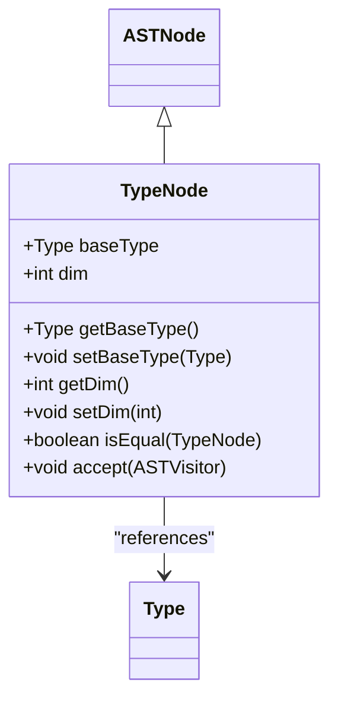
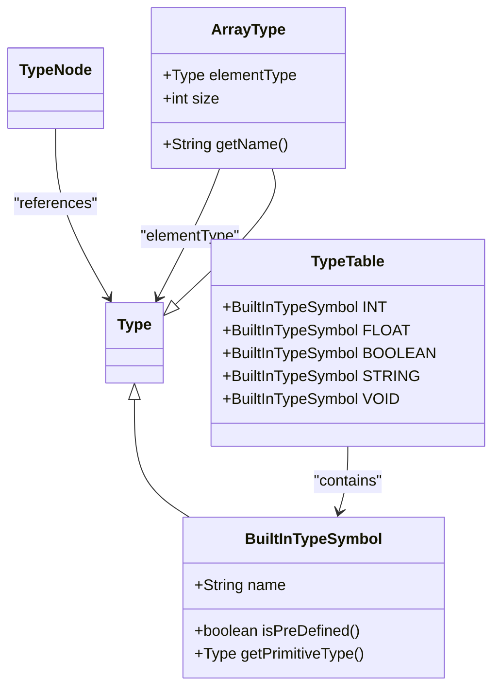
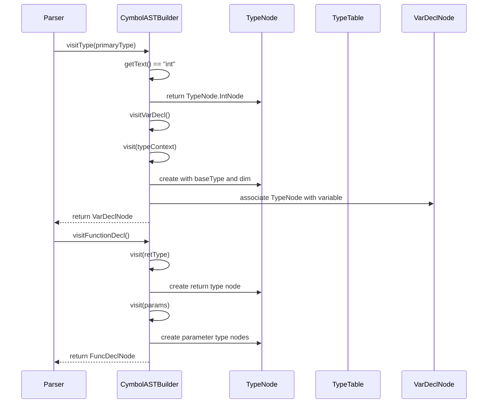
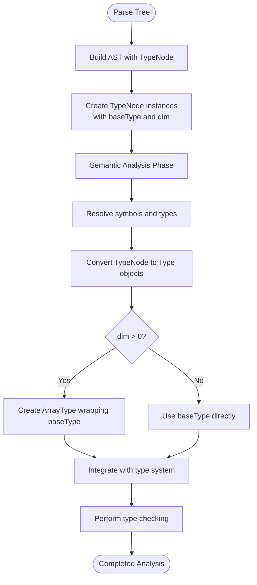

# AST Type Representations

<cite>
**Referenced Files in This Document**   
- [TypeNode.java](file://ep20/src/main/java/org/teachfx/antlr4/ep20/ast/type/TypeNode.java)
- [Type.java](file://ep20/src/main/java/org/teachfx/antlr4/ep20/symtab/type/Type.java)
- [TypeTable.java](file://ep20/src/main/java/org/teachfx/antlr4/ep20/symtab/type/TypeTable.java)
- [CymbolASTBuilder.java](file://ep20/src/main/java/org/teachfx/antlr4/ep20/pass/ast/CymbolASTBuilder.java)
- [ArrayType.java](file://ep20/src/main/java/org/teachfx/antlr4/ep20/symtab/type/ArrayType.java)
- [VarDeclNode.java](file://ep20/src/main/java/org/teachfx/antlr4/ep20/ast/decl/VarDeclNode.java)
- [FuncDeclNode.java](file://ep20/src/main/java/org/teachfx/antlr4/ep20/ast/decl/FuncDeclNode.java)
</cite>

## Table of Contents
1. [Introduction](#introduction)
2. [TypeNode Structure and Properties](#typenode-structure-and-properties)
3. [Primitive and Composite Type Representation](#primitive-and-composite-type-representation)
4. [Type Node Construction Examples](#type-node-construction-examples)
5. [Conversion to Semantic Type Objects](#conversion-to-semantic-type-objects)
6. [Role in Type Checking](#role-in-type-checking)
7. [Error Detection Capabilities](#error-detection-capabilities)
8. [Conclusion](#conclusion)

## Introduction
The TypeNode class serves as a critical component in the abstract syntax tree (AST) representation of type expressions within the compiler framework. It acts as an intermediary between syntactic type declarations in source code and the semantic type system objects used during later compilation phases. This document details how TypeNode captures various type constructs during parsing before symbol resolution, its role in type checking, and its transformation into actual Type objects during semantic analysis.

**Section sources**
- [TypeNode.java](file://ep20/src/main/java/org/teachfx/antlr4/ep20/ast/type/TypeNode.java#L1-L70)

## TypeNode Structure and Properties
The TypeNode class extends ASTNode and contains two primary properties: baseType and dim. The baseType field holds a reference to a Type object representing the fundamental type (e.g., int, float, bool), while the dim field indicates the number of array dimensions. This structure allows TypeNode to represent both simple scalar types and complex array types through dimensionality.

TypeNode provides getter and setter methods for both properties, enabling manipulation during AST construction and traversal. The class also implements the accept method from the visitor pattern, allowing AST visitors to process type nodes during tree traversal. Additionally, TypeNode includes equality comparison methods that check both base type and dimensionality when determining type equivalence.

**Diagram sources**
- [TypeNode.java](file://ep20/src/main/java/org/teachfx/antlr4/ep20/ast/type/TypeNode.java#L1-L70)
- [Type.java](file://ep20/src/main/java/org/teachfx/antlr4/ep20/symtab/type/Type.java#L1-L15)

**Section sources**
- [TypeNode.java](file://ep20/src/main/java/org/teachfx/antlr4/ep20/ast/type/TypeNode.java#L1-L70)

## Primitive and Composite Type Representation
TypeNode supports representation of both primitive types and composite types through its design. Primitive types such as int, float, bool, string, and void are represented using static TypeNode instances initialized with corresponding BuiltInTypeSymbol objects from the TypeTable. These static instances (IntNode, FloatNode, BoolNode, etc.) provide convenient access to commonly used types.

For composite types, particularly arrays, TypeNode uses the dim field to indicate dimensionality. When an array type is encountered during parsing, the TypeNode is created with the appropriate base type and dim value reflecting the number of array dimensions. This approach allows the same TypeNode class to represent types like int (dim=0), int[] (dim=1), and int[][] (dim=2).

The Type interface, implemented by BuiltInTypeSymbol and ArrayType, provides methods to query type properties such as whether a type is predefined, whether it's a function type, and what its primitive type is. This interface enables uniform handling of different type kinds during semantic analysis.

**Diagram sources**
- [TypeTable.java](file://ep20/src/main/java/org/teachfx/antlr4/ep20/symtab/type/TypeTable.java#L1-L21)
- [BuiltInTypeSymbol.java](file://ep20/src/main/java/org/teachfx/antlr4/ep20/symtab/type/BuiltInTypeSymbol.java#L1-L41)
- [ArrayType.java](file://ep20/src/main/java/org/teachfx/antlr4/ep20/symtab/type/ArrayType.java#L1-L54)

**Section sources**
- [TypeTable.java](file://ep20/src/main/java/org/teachfx/antlr4/ep20/symtab/type/TypeTable.java#L1-L21)
- [BuiltInTypeSymbol.java](file://ep20/src/main/java/org/teachfx/antlr4/ep20/symtab/type/BuiltInTypeSymbol.java#L1-L41)
- [ArrayType.java](file://ep20/src/main/java/org/teachfx/antlr4/ep20/symtab/type/ArrayType.java#L1-L54)

## Type Node Construction Examples
TypeNode instances are constructed during AST building when processing various language constructs. The CymbolASTBuilder visitor handles type node creation by visiting type contexts in the parse tree. For primitive types, the builder matches the type name and returns the corresponding static TypeNode instance.

In variable declarations, TypeNode captures the declared type before the variable's symbol is fully resolved. For example, in a declaration like "int x = 5;", the TypeNode captures the "int" type information and associates it with the variable declaration node. Similarly, in function signatures, TypeNode represents both parameter types and return types, preserving type information until semantic analysis.

For array types, the builder increments the dim field based on the number of bracket pairs encountered. Type definitions and struct members also utilize TypeNode to capture their respective types, ensuring consistent type representation across different language constructs.

**Diagram sources**
- [CymbolASTBuilder.java](file://ep20/src/main/java/org/teachfx/antlr4/ep20/pass/ast/CymbolASTBuilder.java#L1-L319)
- [TypeNode.java](file://ep20/src/main/java/org/teachfx/antlr4/ep20/ast/type/TypeNode.java#L1-L70)
- [VarDeclNode.java](file://ep20/src/main/java/org/teachfx/antlr4/ep20/ast/decl/VarDeclNode.java#L1-L68)
- [FuncDeclNode.java](file://ep20/src/main/java/org/teachfx/antlr4/ep20/ast/decl/FuncDeclNode.java#L1-L64)

**Section sources**
- [CymbolASTBuilder.java](file://ep20/src/main/java/org/teachfx/antlr4/ep20/pass/ast/CymbolASTBuilder.java#L1-L319)

## Conversion to Semantic Type Objects
During semantic analysis, TypeNode instances are converted to actual Type objects that participate in the type system. This conversion occurs when symbols are resolved and type checking is performed. The baseType field in TypeNode references a Type object from the TypeTable, which serves as the foundation for the semantic type.

For array types, the dim field is used to construct ArrayType objects that wrap the base type and specify the dimensionality. The TypeChecker visitor processes TypeNode instances and converts them to their semantic equivalents, enabling proper type checking and validation. This conversion bridges the gap between syntactic type representation in the AST and the semantic type system used for analysis.

The getBaseType method in TypeNode facilitates this conversion by returning the primitive type through the getPrimitiveType method of the Type interface. This ensures that even when dealing with array types or other composite types, the underlying primitive type can be accessed for comparison and checking purposes.

**Diagram sources**
- [TypeNode.java](file://ep20/src/main/java/org/teachfx/antlr4/ep20/ast/type/TypeNode.java#L1-L70)
- [Type.java](file://ep20/src/main/java/org/teachfx/antlr4/ep20/symtab/type/Type.java#L1-L15)
- [ArrayType.java](file://ep20/src/main/java/org/teachfx/antlr4/ep20/symtab/type/ArrayType.java#L1-L54)
- [CymbolASTBuilder.java](file://ep20/src/main/java/org/teachfx/antlr4/ep20/pass/ast/CymbolASTBuilder.java#L1-L319)

**Section sources**
- [TypeNode.java](file://ep20/src/main/java/org/teachfx/antlr4/ep20/ast/type/TypeNode.java#L1-L70)
- [Type.java](file://ep20/src/main/java/org/teachfx/antlr4/ep20/symtab/type/Type.java#L1-L15)
- [ArrayType.java](file://ep20/src/main/java/org/teachfx/antlr4/ep20/symtab/type/ArrayType.java#L1-L54)

## Role in Type Checking
TypeNode plays a crucial role in the type checking process by preserving type information from the parsing phase through to semantic analysis. During type checking, the TypeChecker visitor examines TypeNode instances associated with variables, function parameters, and return types to ensure type consistency.

The isEqual method in TypeNode enables direct comparison of type nodes, checking both base type and dimensionality. This method supports both TypeNode-to-TypeNode and TypeNode-to-Type comparisons, providing flexibility in type checking scenarios. When checking assignment compatibility, function call arguments, or return type matching, the type checker uses these comparison capabilities to validate type correctness.

TypeNode also supports early detection of type-related issues by capturing type information before full symbol resolution. This allows the compiler to identify obvious type mismatches and report them even if other aspects of the program contain errors that would prevent complete semantic analysis.

**Section sources**
- [TypeNode.java](file://ep20/src/main/java/org/teachfx/antlr4/ep20/ast/type/TypeNode.java#L1-L70)

## Error Detection Capabilities
TypeNode enables early detection of syntax-level type errors by capturing type information during parsing. Since TypeNode instances are created as the AST is built, type-related issues can be identified before the semantic analysis phase begins. This includes detecting invalid type names, mismatched array dimensions, and improper use of type constructors.

The design of TypeNode with explicit baseType and dim fields makes it possible to validate type expressions at the syntactic level. For example, when processing an array declaration, the parser can verify that the dimensionality is properly specified and that the base type is valid. Similarly, when processing type casts, the presence of a TypeNode allows validation of the target type syntax before semantic checking occurs.

By separating syntactic type representation from semantic type objects, the compiler can provide more precise error messages that distinguish between syntax errors in type expressions and semantic errors in type usage. This separation improves the developer experience by providing clearer feedback about the nature and location of type-related issues.

**Section sources**
- [TypeNode.java](file://ep20/src/main/java/org/teachfx/antlr4/ep20/ast/type/TypeNode.java#L1-L70)
- [CymbolASTBuilder.java](file://ep20/src/main/java/org/teachfx/antlr4/ep20/pass/ast/CymbolASTBuilder.java#L1-L319)

## Conclusion
The TypeNode class serves as a vital bridge between syntactic type declarations and semantic type system objects in the compiler architecture. By capturing primitive types, composite types, and type constructors during parsing, TypeNode preserves essential type information that enables comprehensive type checking and error detection. Its design supports both simple scalar types and complex array types through the baseType and dim fields, providing a flexible representation that accommodates various type constructs.

The conversion of TypeNode instances to actual Type objects during semantic analysis ensures a smooth transition from syntactic representation to semantic processing. This architecture enables early detection of type-related issues while maintaining the separation of concerns between parsing and semantic analysis phases. The implementation demonstrates effective use of the visitor pattern and object-oriented design principles to create a robust type representation system that supports the compiler's type checking capabilities.