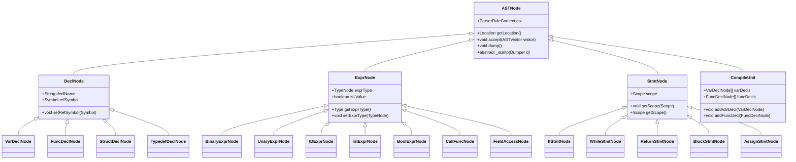
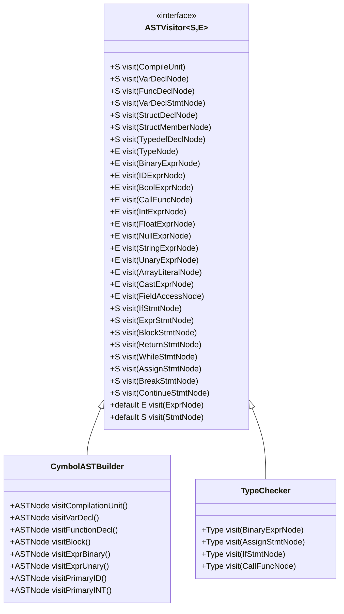
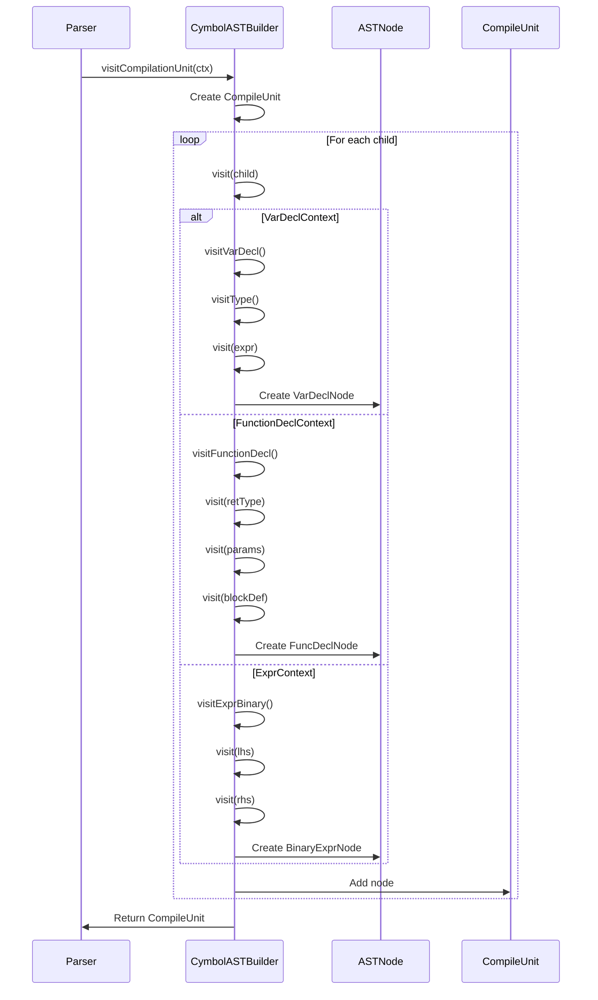
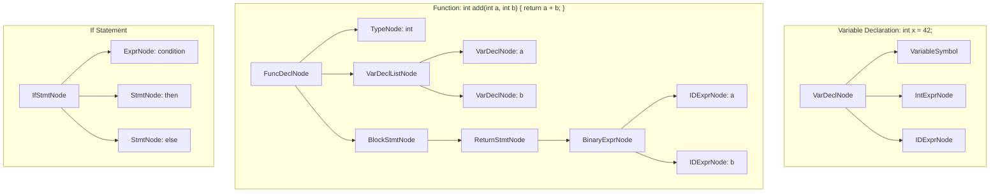

# Abstract Syntax Tree (AST)

<cite>
**Referenced Files in This Document**   
- [ASTNode.java](file://ep20/src/main/java/org/teachfx/antlr4/ep20/ast/ASTNode.java)
- [ASTVisitor.java](file://ep20/src/main/java/org/teachfx/antlr4/ep20/ast/ASTVisitor.java)
- [CymbolASTBuilder.java](file://ep20/src/main/java/org/teachfx/antlr4/ep20/pass/ast/CymbolASTBuilder.java)
- [ExprNode.java](file://ep20/src/main/java/org/teachfx/antlr4/ep20/ast/expr/ExprNode.java)
- [StmtNode.java](file://ep20/src/main/java/org/teachfx/antlr4/ep20/ast/stmt/StmtNode.java)
- [DeclNode.java](file://ep20/src/main/java/org/teachfx/antlr4/ep20/ast/decl/DeclNode.java)
- [CompileUnit.java](file://ep20/src/main/java/org/teachfx/antlr4/ep20/ast/CompileUnit.java)
- [TypeNode.java](file://ep20/src/main/java/org/teachfx/antlr4/ep20/ast/type/TypeNode.java)
- [BinaryExprNode.java](file://ep20/src/main/java/org/teachfx/antlr4/ep20/ast/expr/BinaryExprNode.java)
- [IfStmtNode.java](file://ep20/src/main/java/org/teachfx/antlr4/ep20/ast/stmt/IfStmtNode.java)
- [VarDeclNode.java](file://ep20/src/main/java/org/teachfx/antlr4/ep20/ast/decl/VarDeclNode.java)
- [FuncDeclNode.java](file://ep20/src/main/java/org/teachfx/antlr4/ep20/ast/decl/FuncDeclNode.java)
</cite>

## Table of Contents
1. [Introduction](#introduction)
2. [AST Node Hierarchy](#ast-node-hierarchy)
3. [Visitor Pattern Implementation](#visitor-pattern-implementation)
4. [AST Construction Process](#ast-construction-process)
5. [AST Representations of Language Constructs](#ast-representations-of-language-constructs)
6. [Advantages of ASTs Over Parse Trees](#advantages-of-asts-over-parse-trees)
7. [Memory Considerations in AST Representation](#memory-considerations-in-ast-representation)
8. [Role in Semantic Analysis and Code Generation](#role-in-semantic-analysis-and-code-generation)
9. [Conclusion](#conclusion)

## Introduction
The Abstract Syntax Tree (AST) is a fundamental data structure in compiler design that represents the syntactic structure of source code in a hierarchical, tree-like format. Unlike parse trees, ASTs omit syntactic details such as parentheses and punctuation, focusing instead on the essential structure of the program. This document provides a comprehensive analysis of the AST implementation in the Cymbol compiler, detailing its node hierarchy, visitor pattern, construction process, and role in subsequent compilation phases.

**Section sources**
- [ASTNode.java](file://ep20/src/main/java/org/teachfx/antlr4/ep20/ast/ASTNode.java#L1-L48)
- [ASTVisitor.java](file://ep20/src/main/java/org/teachfx/antlr4/ep20/ast/ASTVisitor.java#L1-L123)

## AST Node Hierarchy

The AST implementation is built around a class hierarchy rooted at `ASTNode.java`, which serves as the base class for all AST nodes. This abstract class provides common functionality such as source location tracking via `ParserRuleContext`, debugging capabilities through the `Dumpable` interface, and support for the visitor pattern.

The hierarchy branches into three primary categories:
- **Declarations**: Represented by `DeclNode.java`, this category includes variable declarations (`VarDeclNode`), function declarations (`FuncDeclNode`), struct declarations (`StructDeclNode`), and typedefs (`TypedefDeclNode`)
- **Expressions**: Derived from `ExprNode.java`, this includes binary operations (`BinaryExprNode`), unary operations (`UnaryExprNode`), literals (`IntExprNode`, `BoolExprNode`, etc.), function calls (`CallFuncNode`), and field access (`FieldAccessNode`)
- **Statements**: Inherited from `StmtNode.java`, this encompasses control flow constructs like `IfStmtNode`, `WhileStmtNode`, `ReturnStmtNode`, and block statements (`BlockStmtNode`)

Each node type encapsulates relevant semantic information such as type annotations, symbol references, and scope information, enabling rich semantic analysis in later compilation stages.

**Diagram sources**
- [ASTNode.java](file://ep20/src/main/java/org/teachfx/antlr4/ep20/ast/ASTNode.java#L1-L48)
- [DeclNode.java](file://ep20/src/main/java/org/teachfx/antlr4/ep20/ast/decl/DeclNode.java#L1-L36)
- [ExprNode.java](file://ep20/src/main/java/org/teachfx/antlr4/ep20/ast/expr/ExprNode.java#L1-L41)
- [StmtNode.java](file://ep20/src/main/java/org/teachfx/antlr4/ep20/ast/stmt/StmtNode.java#L1-L22)
- [CompileUnit.java](file://ep20/src/main/java/org/teachfx/antlr4/ep20/ast/CompileUnit.java)

**Section sources**
- [ASTNode.java](file://ep20/src/main/java/org/teachfx/antlr4/ep20/ast/ASTNode.java#L1-L48)
- [DeclNode.java](file://ep20/src/main/java/org/teachfx/antlr4/ep20/ast/decl/DeclNode.java#L1-L36)
- [ExprNode.java](file://ep20/src/main/java/org/teachfx/antlr4/ep20/ast/expr/ExprNode.java#L1-L41)
- [StmtNode.java](file://ep20/src/main/java/org/teachfx/antlr4/ep20/ast/stmt/StmtNode.java#L1-L22)

## Visitor Pattern Implementation

The visitor pattern is implemented through the `ASTVisitor.java` interface, which defines a comprehensive set of visit methods for every AST node type. This design enables type-safe traversal of the AST without requiring explicit type checking or casting.

The interface uses Java generics with two type parameters: `S` for statement nodes and `E` for expression nodes, allowing visitors to return different types based on the node category. Default methods in the interface handle polymorphic dispatch for expression and statement hierarchies, ensuring that visiting a base type automatically delegates to the appropriate concrete type.

This implementation supports multiple visitor use cases:
- **Semantic analysis**: Type checking, symbol resolution, and scope validation
- **Code generation**: Translation of AST nodes to intermediate or target code
- **Optimization**: Pattern matching and transformation of AST subtrees
- **Debugging**: AST visualization and serialization

The visitor pattern decouples algorithms from the object structure, making it easy to add new operations on the AST without modifying the node classes themselves.

**Diagram sources**
- [ASTVisitor.java](file://ep20/src/main/java/org/teachfx/antlr4/ep20/ast/ASTVisitor.java#L1-L123)
- [CymbolASTBuilder.java](file://ep20/src/main/java/org/teachfx/antlr4/ep20/pass/ast/CymbolASTBuilder.java#L1-L318)

**Section sources**
- [ASTVisitor.java](file://ep20/src/main/java/org/teachfx/antlr4/ep20/ast/ASTVisitor.java#L1-L123)

## AST Construction Process

The AST construction process is implemented in `CymbolASTBuilder.java`, which extends ANTLR's `CymbolBaseVisitor` to transform parse trees into ASTs. This visitor operates during the parsing phase, creating AST nodes as the parser recognizes grammar constructs.

The construction process follows these key principles:
- **Bottom-up construction**: Child nodes are created before their parents, ensuring proper hierarchy
- **Context preservation**: Each AST node maintains a reference to its corresponding `ParserRuleContext` for error reporting and source mapping
- **Semantic enrichment**: Nodes are populated with type information, symbol references, and other semantic data during construction

The builder handles various language constructs through specialized visit methods:
- **Compilation unit**: Collects top-level declarations into a `CompileUnit` node
- **Declarations**: Creates `VarDeclNode` and `FuncDeclNode` instances with associated type information
- **Expressions**: Constructs expression trees with proper operator precedence and associativity
- **Statements**: Builds control flow structures with correct scoping

The process begins with the `visitCompilationUnit` method, which serves as the entry point, and proceeds recursively through the parse tree, transforming each node into its corresponding AST representation.

**Diagram sources**
- [CymbolASTBuilder.java](file://ep20/src/main/java/org/teachfx/antlr4/ep20/pass/ast/CymbolASTBuilder.java#L1-L318)

**Section sources**
- [CymbolASTBuilder.java](file://ep20/src/main/java/org/teachfx/antlr4/ep20/pass/ast/CymbolASTBuilder.java#L1-L318)

## AST Representations of Language Constructs

The AST provides structured representations for various language constructs, each capturing the essential semantic information while eliminating syntactic noise.

### Variable Declaration
A variable declaration like `int x = 42;` is represented as a `VarDeclNode` containing:
- A `VariableSymbol` with name and type
- An optional initializer expression (`IntExprNode`)
- The identifier (`IDExprNode`) with symbol reference

### Function Declaration
A function `int add(int a, int b) { return a + b; }` creates:
- `FuncDeclNode` with return type, name, parameters, and body
- `VarDeclListNode` for parameters
- `BlockStmtNode` containing `ReturnStmtNode`
- `BinaryExprNode` for the addition operation

### Control Flow
An `if` statement generates:
- `IfStmtNode` with condition, then-branch, and optional else-branch
- `ExprNode` for the condition
- `BlockStmtNode` or `StmtNode` for branches

### Expressions
Binary operations form expression trees where operators are internal nodes and operands are leaves, naturally representing precedence and associativity.

**Diagram sources**
- [VarDeclNode.java](file://ep20/src/main/java/org/teachfx/antlr4/ep20/ast/decl/VarDeclNode.java)
- [FuncDeclNode.java](file://ep20/src/main/java/org/teachfx/antlr4/ep20/ast/decl/FuncDeclNode.java)
- [IfStmtNode.java](file://ep20/src/main/java/org/teachfx/antlr4/ep20/ast/stmt/IfStmtNode.java)
- [BinaryExprNode.java](file://ep20/src/main/java/org/teachfx/antlr4/ep20/ast/expr/BinaryExprNode.java)

**Section sources**
- [VarDeclNode.java](file://ep20/src/main/java/org/teachfx/antlr4/ep20/ast/decl/VarDeclNode.java)
- [FuncDeclNode.java](file://ep20/src/main/java/org/teachfx/antlr4/ep20/ast/decl/FuncDeclNode.java)
- [IfStmtNode.java](file://ep20/src/main/java/org/teachfx/antlr4/ep20/ast/stmt/IfStmtNode.java)
- [BinaryExprNode.java](file://ep20/src/main/java/org/teachfx/antlr4/ep20/ast/expr/BinaryExprNode.java)

## Advantages of ASTs Over Parse Trees

ASTs offer several significant advantages over parse trees in compiler design:

### Reduced Complexity
ASTs eliminate syntactic elements like parentheses, semicolons, and braces that are necessary for parsing but irrelevant to program semantics. This simplification reduces tree size and complexity, making traversal and analysis more efficient.

### Focus on Semantics
By removing syntactic noise, ASTs highlight the essential structure of the program. This makes it easier to implement semantic analysis, optimization, and code generation algorithms that focus on meaningful program constructs.

### Natural Operator Precedence
The hierarchical structure of ASTs naturally represents operator precedence and associativity without requiring additional parsing rules. For example, in `a + b * c`, the multiplication appears as a child of the addition, correctly reflecting precedence.

### Efficient Traversal
The streamlined structure enables more efficient tree traversal algorithms. Visitors can process nodes without filtering out syntactic elements, leading to cleaner, faster code.

### Better Memory Efficiency
Smaller tree size translates to reduced memory consumption, which is particularly important for large programs or when multiple ASTs are maintained during compilation.

### Enhanced Readability
ASTs provide a clearer representation of program structure for debugging and visualization tools, making it easier to understand and analyze the compiled code.

## Memory Considerations in AST Representation

The AST implementation incorporates several memory optimization strategies:

### Shared Type Nodes
Common type representations like `TypeNode.IntNode` and `TypeNode.BoolNode` are implemented as static instances, avoiding redundant object creation for frequently used types.

### Context References
Instead of storing source text or position information directly, nodes maintain references to `ParserRuleContext`, which provides this information on demand. This reduces memory overhead while preserving debugging capabilities.

### Lazy Initialization
Fields like `exprType` in `ExprNode` are initialized only when needed, avoiding unnecessary memory allocation for nodes that don't require type information during certain phases.

### Efficient Collections
The use of immutable lists and streams in node construction minimizes memory allocations and enables efficient functional-style processing.

### Symbol References
Rather than duplicating symbol information, nodes maintain references to shared `Symbol` objects in the symbol table, ensuring consistency and reducing memory usage.

These optimizations ensure that the AST representation remains memory-efficient even for large programs, supporting scalable compilation without excessive resource consumption.

**Section sources**
- [TypeNode.java](file://ep20/src/main/java/org/teachfx/antlr4/ep20/ast/type/TypeNode.java)
- [ExprNode.java](file://ep20/src/main/java/org/teachfx/antlr4/ep20/ast/expr/ExprNode.java#L1-L41)
- [ASTNode.java](file://ep20/src/main/java/org/teachfx/antlr4/ep20/ast/ASTNode.java#L1-L48)

## Role in Semantic Analysis and Code Generation

The AST serves as the primary data structure for both semantic analysis and code generation phases:

### Semantic Analysis
During semantic analysis, visitors traverse the AST to:
- **Resolve symbols**: Bind identifier references to their declarations using the symbol table
- **Check types**: Verify type compatibility in expressions and assignments
- **Validate scope**: Ensure variables are used within their declared scope
- **Detect errors**: Identify semantic violations like type mismatches or undefined variables

The `TypeChecker` visitor, for example, uses the AST structure to enforce type rules, propagating type information upward from leaves to root.

### Code Generation
In code generation, the AST is traversed to produce target code:
- **Expression evaluation**: Convert expression trees to three-address code or machine instructions
- **Control flow translation**: Transform high-level constructs like `if` and `while` into conditional jumps
- **Function layout**: Generate function prologues, epilogues, and parameter handling
- **Optimization opportunities**: The AST structure enables pattern-based optimizations like constant folding and dead code elimination

The separation of concerns between AST construction and these later phases allows for modular, maintainable compiler design where each phase can be developed and tested independently.

**Section sources**
- [ASTVisitor.java](file://ep20/src/main/java/org/teachfx/antlr4/ep20/ast/ASTVisitor.java#L1-L123)
- [CymbolASTBuilder.java](file://ep20/src/main/java/org/teachfx/antlr4/ep20/pass/ast/CymbolASTBuilder.java#L1-L318)
- [TypeChecker.java](file://ep20/src/main/java/org/teachfx/antlr4/ep20/pass/sementic/TypeChecker.java)

## Conclusion
The Abstract Syntax Tree implementation provides a robust foundation for the Cymbol compiler, enabling efficient parsing, comprehensive semantic analysis, and flexible code generation. By organizing nodes into a clear hierarchy and implementing the visitor pattern, the design supports extensibility and maintainability. The AST construction process transforms parse trees into a semantically rich representation that eliminates syntactic noise while preserving essential program structure. This representation facilitates subsequent compilation phases, from type checking to code generation, while incorporating memory optimizations for scalability. The AST's role as an intermediate representation bridges the gap between source code and executable output, serving as the central data structure in the compilation pipeline.