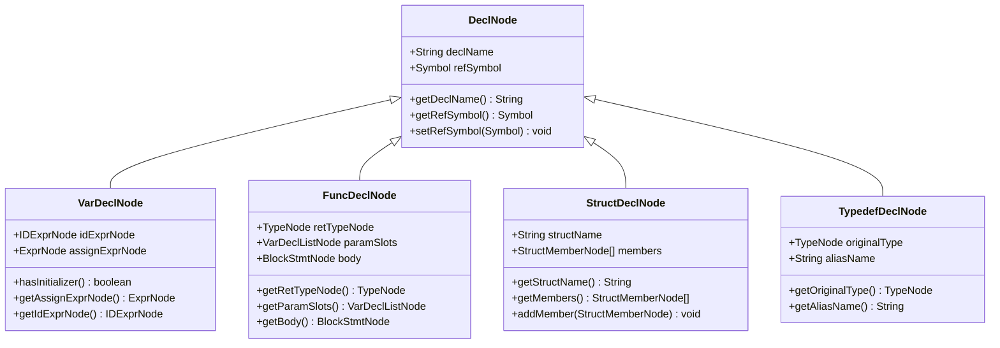
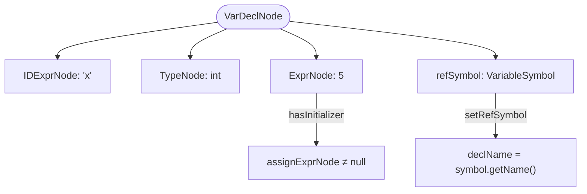
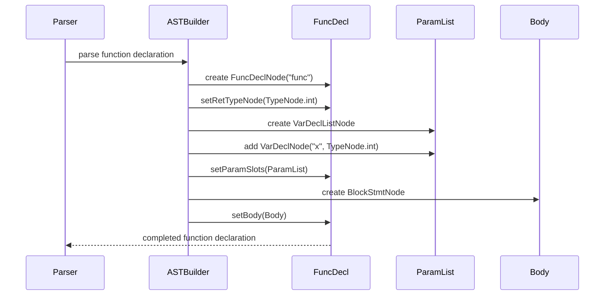
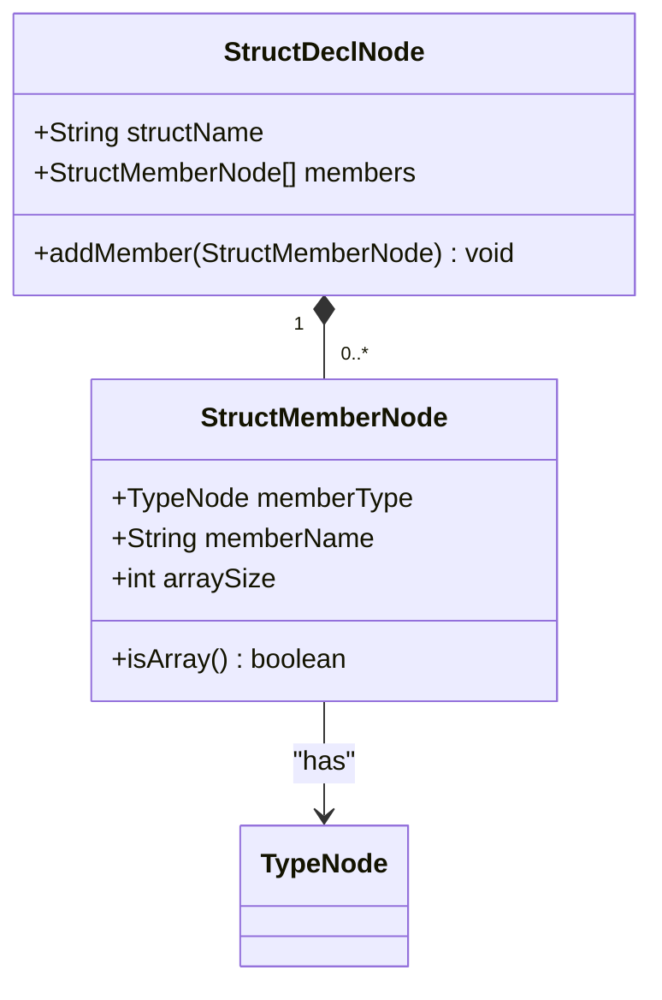
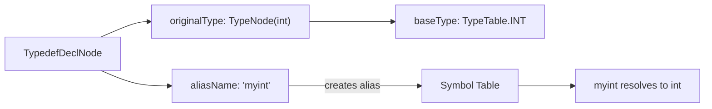
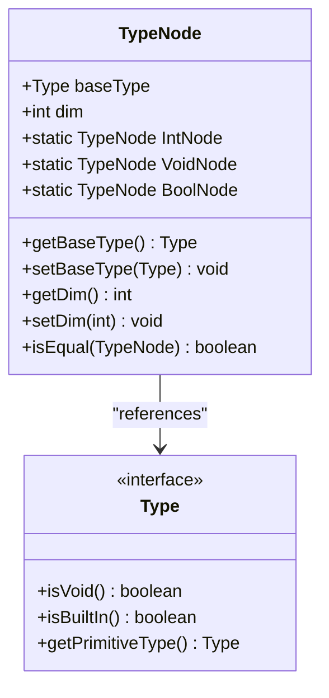
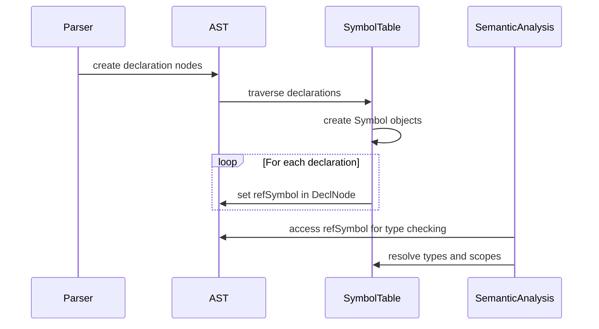
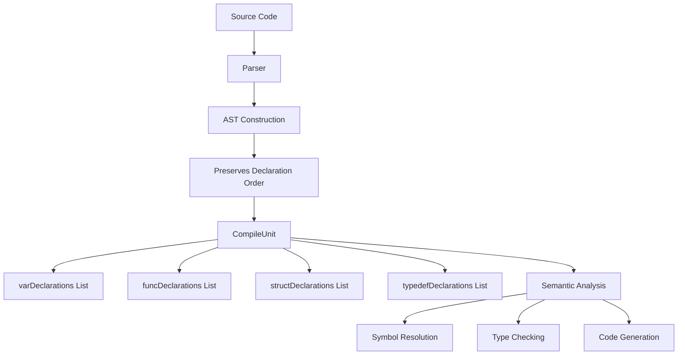

# Declaration Nodes

<cite>
**Referenced Files in This Document**   
- [DeclNode.java](file://ep20/src/main/java/org/teachfx/antlr4/ep20/ast/decl/DeclNode.java)
- [VarDeclNode.java](file://ep20/src/main/java/org/teachfx/antlr4/ep20/ast/decl/VarDeclNode.java)
- [FuncDeclNode.java](file://ep20/src/main/java/org/teachfx/antlr4/ep20/ast/decl/FuncDeclNode.java)
- [StructDeclNode.java](file://ep20/src/main/java/org/teachfx/antlr4/ep20/ast/decl/StructDeclNode.java)
- [TypedefDeclNode.java](file://ep20/src/main/java/org/teachfx/antlr4/ep20/ast/decl/TypedefDeclNode.java)
- [StructMemberNode.java](file://ep20/src/main/java/org/teachfx/antlr4/ep20/ast/decl/StructMemberNode.java)
- [TypeNode.java](file://ep20/src/main/java/org/teachfx/antlr4/ep20/ast/type/TypeNode.java)
- [Symbol.java](file://ep20/src/main/java/org/teachfx/antlr4/ep20/symtab/symbol/Symbol.java)
- [VariableSymbol.java](file://ep20/src/main/java/org/teachfx/antlr4/ep20/symtab/symbol/VariableSymbol.java)
- [MethodSymbol.java](file://ep20/src/main/java/org/teachfx/antlr4/ep20/symtab/symbol/MethodSymbol.java)
- [CompileUnit.java](file://ep20/src/main/java/org/teachfx/antlr4/ep20/ast/CompileUnit.java)
</cite>

## Table of Contents
1. [Introduction](#introduction)
2. [Core Declaration Node Types](#core-declaration-node-types)
3. [Variable Declarations](#variable-declarations)
4. [Function Declarations](#function-declarations)
5. [Struct Declarations](#struct-declarations)
6. [Typedef Declarations](#typedef-declarations)
7. [Type Representation in AST](#type-representation-in-ast)
8. [Relationship with Symbol Table](#relationship-with-symbol-table)
9. [Forward Declarations and Recursive Types](#forward-declarations-and-recursive-types)
10. [Declaration Order and Semantic Analysis](#declaration-order-and-semantic-analysis)

## Introduction
This document details the representation and structure of declaration nodes in the Abstract Syntax Tree (AST) for a compiler implementation using ANTLR4. It covers how various declarations—variables, functions, structs, and typedefs—are captured in the AST before symbol table population, the properties stored in each node, and their relationship with semantic analysis phases.

**Section sources**
- [DeclNode.java](file://ep20/src/main/java/org/teachfx/antlr4/ep20/ast/decl/DeclNode.java)

## Core Declaration Node Types
The AST declaration hierarchy is built around a base `DeclNode` class that serves as the foundation for all declaration types. Specific declaration nodes inherit from this base to represent different kinds of declarations in the source code.



**Diagram sources**
- [DeclNode.java](file://ep20/src/main/java/org/teachfx/antlr4/ep20/ast/decl/DeclNode.java)
- [VarDeclNode.java](file://ep20/src/main/java/org/teachfx/antlr4/ep20/ast/decl/VarDeclNode.java)
- [FuncDeclNode.java](file://ep20/src/main/java/org/teachfx/antlr4/ep20/ast/decl/FuncDeclNode.java)
- [StructDeclNode.java](file://ep20/src/main/java/org/teachfx/antlr4/ep20/ast/decl/StructDeclNode.java)
- [TypedefDeclNode.java](file://ep20/src/main/java/org/teachfx/antlr4/ep20/ast/decl/TypedefDeclNode.java)

**Section sources**
- [DeclNode.java](file://ep20/src/main/java/org/teachfx/antlr4/ep20/ast/decl/DeclNode.java)
- [VarDeclNode.java](file://ep20/src/main/java/org/teachfx/antlr4/ep20/ast/decl/VarDeclNode.java)
- [FuncDeclNode.java](file://ep20/src/main/java/org/teachfx/antlr4/ep20/ast/decl/FuncDeclNode.java)
- [StructDeclNode.java](file://ep20/src/main/java/org/teachfx/antlr4/ep20/ast/decl/StructDeclNode.java)
- [TypedefDeclNode.java](file://ep20/src/main/java/org/teachfx/antlr4/ep20/ast/decl/TypedefDeclNode.java)

## Variable Declarations
Variable declarations are represented by `VarDeclNode`, which captures the variable's identifier, type information via symbol reference, and optional initializer expression. The node maintains a reference to the corresponding `VariableSymbol` that will be populated during semantic analysis.

The AST structure for a variable declaration like `int x = 5;` includes:
- An `IDExprNode` representing the identifier 'x'
- A `TypeNode` indicating the base type (int)
- An optional `ExprNode` for the initializer (5 in this case)
- A reference to a `VariableSymbol` that will be resolved during symbol table construction



**Diagram sources**
- [VarDeclNode.java](file://ep20/src/main/java/org/teachfx/antlr4/ep20/ast/decl/VarDeclNode.java)
- [VariableSymbol.java](file://ep20/src/main/java/org/teachfx/antlr4/ep20/symtab/symbol/VariableSymbol.java)

**Section sources**
- [VarDeclNode.java](file://ep20/src/main/java/org/teachfx/antlr4/ep20/ast/decl/VarDeclNode.java)
- [VariableSymbol.java](file://ep20/src/main/java/org/teachfx/antlr4/ep20/symtab/symbol/VariableSymbol.java)

## Function Declarations
Function declarations are represented by `FuncDeclNode`, which captures the function name, return type, parameter list, and function body. Parameters are stored as a `VarDeclListNode`, allowing multiple parameters to be managed as a collection of variable declarations.

For a function declaration like `int func(int x) { return x + 1; }`, the AST structure includes:
- Return type node (`TypeNode` for 'int')
- Function name ('func')
- Parameter list containing one `VarDeclNode` for parameter 'x'
- Body represented as a `BlockStmtNode` containing the function statements

The parameter list enables proper scoping and type checking during semantic analysis, with each parameter treated as a local variable within the function's scope.



**Diagram sources**
- [FuncDeclNode.java](file://ep20/src/main/java/org/teachfx/antlr4/ep20/ast/decl/FuncDeclNode.java)
- [VarDeclListNode.java](file://ep20/src/main/java/org/teachfx/antlr4/ep20/ast/decl/VarDeclListNode.java)
- [BlockStmtNode.java](file://ep20/src/main/java/org/teachfx/antlr4/ep20/ast/stmt/BlockStmtNode.java)

**Section sources**
- [FuncDeclNode.java](file://ep20/src/main/java/org/teachfx/antlr4/ep20/ast/decl/FuncDeclNode.java)

## Struct Declarations
Struct declarations are represented by `StructDeclNode`, which contains the struct name and a list of `StructMemberNode` objects representing the fields. Each member has a type, name, and optional array size information.

A struct declaration like `struct Point { int x; int y; }` is structured in the AST as:
- Struct name: 'Point'
- Members list containing two `StructMemberNode` instances
- Each member has a `TypeNode` (int), name (x/y), and array size (0 for non-arrays)

The `StructDeclNode` allows for recursive member definitions and supports nested struct types through proper symbol resolution during semantic analysis.



**Diagram sources**
- [StructDeclNode.java](file://ep20/src/main/java/org/teachfx/antlr4/ep20/ast/decl/StructDeclNode.java)
- [StructMemberNode.java](file://ep20/src/main/java/org/teachfx/antlr4/ep20/ast/decl/StructMemberNode.java)
- [TypeNode.java](file://ep20/src/main/java/org/teachfx/antlr4/ep20/ast/type/TypeNode.java)

**Section sources**
- [StructDeclNode.java](file://ep20/src/main/java/org/teachfx/antlr4/ep20/ast/decl/StructDeclNode.java)
- [StructMemberNode.java](file://ep20/src/main/java/org/teachfx/antlr4/ep20/ast/decl/StructMemberNode.java)

## Typedef Declarations
Typedef declarations are represented by `TypedefDeclNode`, which creates an alias for an existing type. The node stores both the original type (`TypeNode`) and the alias name.

For a typedef like `typedef int myint;`, the AST captures:
- Original type: `TypeNode` representing 'int'
- Alias name: 'myint'

This allows the type system to resolve the alias to its underlying type during semantic analysis, enabling type equivalence checking and proper type resolution in variable declarations that use the typedef.



**Diagram sources**
- [TypedefDeclNode.java](file://ep20/src/main/java/org/teachfx/antlr4/ep20/ast/decl/TypedefDeclNode.java)
- [TypeNode.java](file://ep20/src/main/java/org/teachfx/antlr4/ep20/ast/type/TypeNode.java)

**Section sources**
- [TypedefDeclNode.java](file://ep20/src/main/java/org/teachfx/antlr4/ep20/ast/decl/TypedefDeclNode.java)

## Type Representation in AST
Type information in the AST is managed through `TypeNode` objects, which capture both the base type and dimensionality (for arrays). The base type is represented as a `Type` object from the symbol table, while the dimension indicates array levels.

Key properties of `TypeNode`:
- `baseType`: Reference to the underlying type (int, float, struct, etc.)
- `dim`: Dimensionality (0 for scalars, 1+ for arrays)
- Static instances for common types (IntNode, VoidNode, etc.)

This design allows the AST to represent complex type expressions while maintaining a clean separation between syntactic representation and semantic type information.



**Diagram sources**
- [TypeNode.java](file://ep20/src/main/java/org/teachfx/antlr4/ep20/ast/type/TypeNode.java)
- [Type.java](file://ep20/src/main/java/org/teachfx/antlr4/ep20/symtab/type/Type.java)

**Section sources**
- [TypeNode.java](file://ep20/src/main/java/org/teachfx/antlr4/ep20/ast/type/TypeNode.java)

## Relationship with Symbol Table
Declaration nodes in the AST serve as the syntactic foundation for symbol table entries created during semantic analysis. The relationship is established through the `refSymbol` field in `DeclNode`, which is populated during the symbol resolution phase.

The process flow is:
1. Parser creates AST declaration nodes from source code
2. Symbol table construction pass traverses AST
3. For each declaration, a corresponding `Symbol` object is created
4. The `refSymbol` field in the declaration node is set to point to this symbol
5. Subsequent analysis phases use this link to access semantic information

Different declaration types map to specific symbol types:
- `VarDeclNode` → `VariableSymbol`
- `FuncDeclNode` → `MethodSymbol`
- `StructDeclNode` → `StructSymbol`
- `TypedefDeclNode` → `TypedefSymbol`



**Diagram sources**
- [DeclNode.java](file://ep20/src/main/java/org/teachfx/antlr4/ep20/ast/decl/DeclNode.java)
- [Symbol.java](file://ep20/src/main/java/org/teachfx/antlr4/ep20/symtab/symbol/Symbol.java)
- [VariableSymbol.java](file://ep20/src/main/java/org/teachfx/antlr4/ep20/symtab/symbol/VariableSymbol.java)
- [MethodSymbol.java](file://ep20/src/main/java/org/teachfx/antlr4/ep20/symtab/symbol/MethodSymbol.java)

**Section sources**
- [DeclNode.java](file://ep20/src/main/java/org/teachfx/antlr4/ep20/ast/decl/DeclNode.java)
- [Symbol.java](file://ep20/src/main/java/org/teachfx/antlr4/ep20/symtab/symbol/Symbol.java)

## Forward Declarations and Recursive Types
The AST design supports forward declarations and recursive types through deferred symbol resolution. When a type is referenced before it's defined, the parser creates a placeholder declaration node, and the symbol table handles resolution during the semantic analysis phase.

For recursive types like:
```c
struct Node {
    int data;
    struct Node* next;
};
```

The AST represents this as:
- A `StructDeclNode` for 'Node'
- A `StructMemberNode` with a self-referential type
- The type resolution is deferred until the complete struct definition is processed

The symbol table uses forward reference tracking to resolve these circular dependencies, allowing the type checker to validate the recursive structure once all declarations are known.

```mermaid
graph TD
A[StructDeclNode: Node] --> B[Member: data]
A --> C[Member: next]
C --> D[TypeNode: Node*]
D --> A
style D stroke:#f66,stroke-width:2px
note right of D: Forward reference<br/>Resolved during<br/>semantic analysis
```

**Diagram sources**
- [StructDeclNode.java](file://ep20/src/main/java/org/teachfx/antlr4/ep20/ast/decl/StructDeclNode.java)
- [StructMemberNode.java](file://ep20/src/main/java/org/teachfx/antlr4/ep20/ast/decl/StructMemberNode.java)

**Section sources**
- [StructDeclNode.java](file://ep20/src/main/java/org/teachfx/antlr4/ep20/ast/decl/StructDeclNode.java)

## Declaration Order and Semantic Analysis
Declaration order significantly impacts semantic analysis and code generation. The AST structure preserves the original declaration order, which is crucial for:
- Resolving forward references
- Handling dependencies between declarations
- Generating code in the correct sequence

The `CompileUnit` node maintains separate lists for different declaration types (variables, functions, structs, typedefs), but the overall order from the source file is preserved within each category. This ordering ensures that:
- Variables are defined before use
- Functions are declared before calls
- Types are defined before instantiation

During semantic analysis, the declaration order determines the sequence of symbol table population and type checking, which in turn affects code generation and optimization opportunities.



**Diagram sources**
- [CompileUnit.java](file://ep20/src/main/java/org/teachfx/antlr4/ep20/ast/CompileUnit.java)
- [DeclNode.java](file://ep20/src/main/java/org/teachfx/antlr4/ep20/ast/decl/DeclNode.java)

**Section sources**
- [CompileUnit.java](file://ep20/src/main/java/org/teachfx/antlr4/ep20/ast/CompileUnit.java)