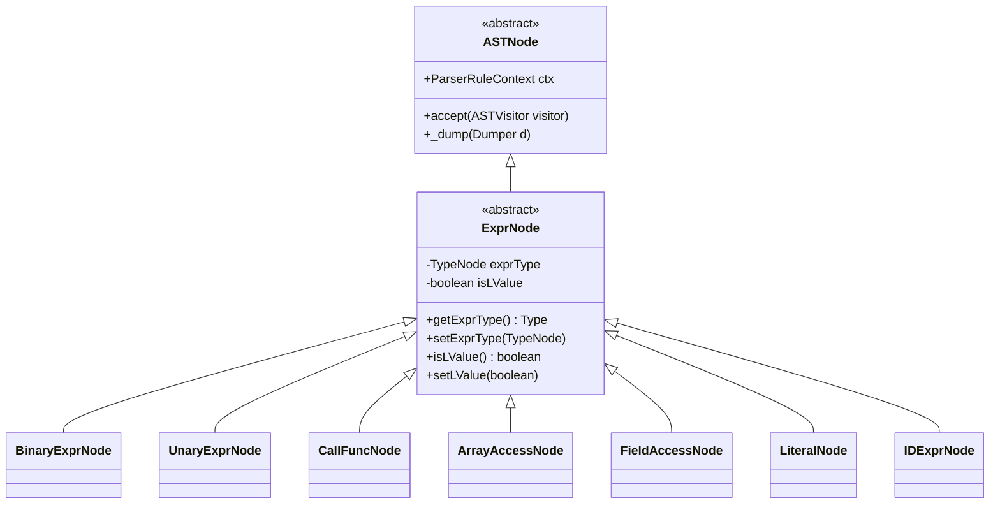
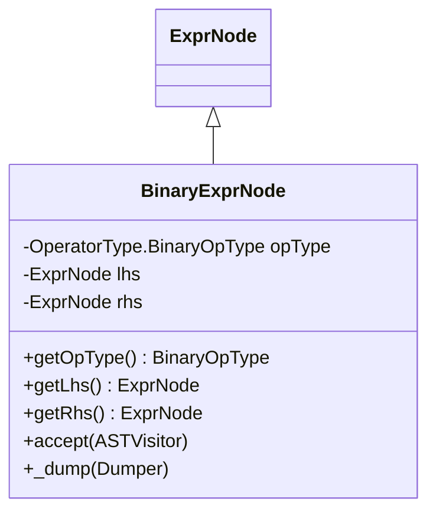
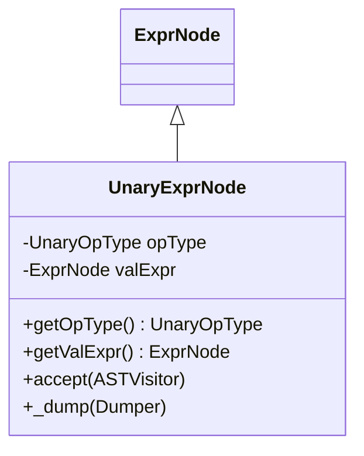
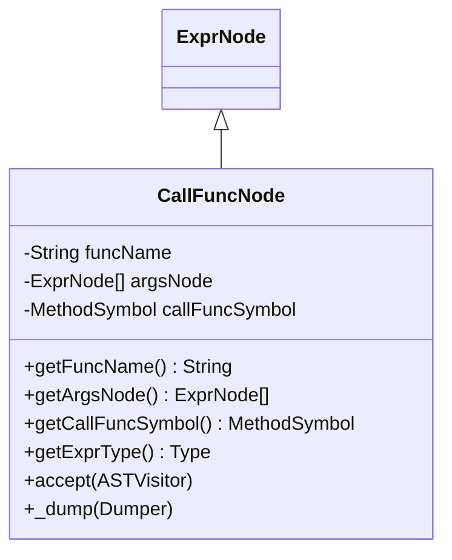
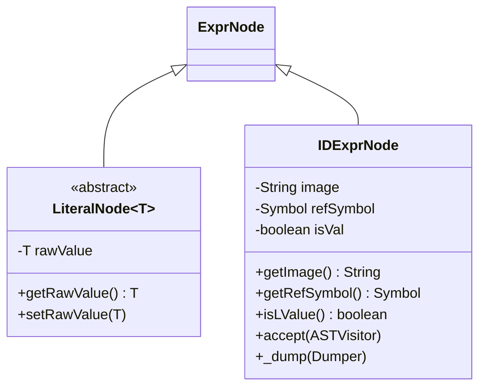
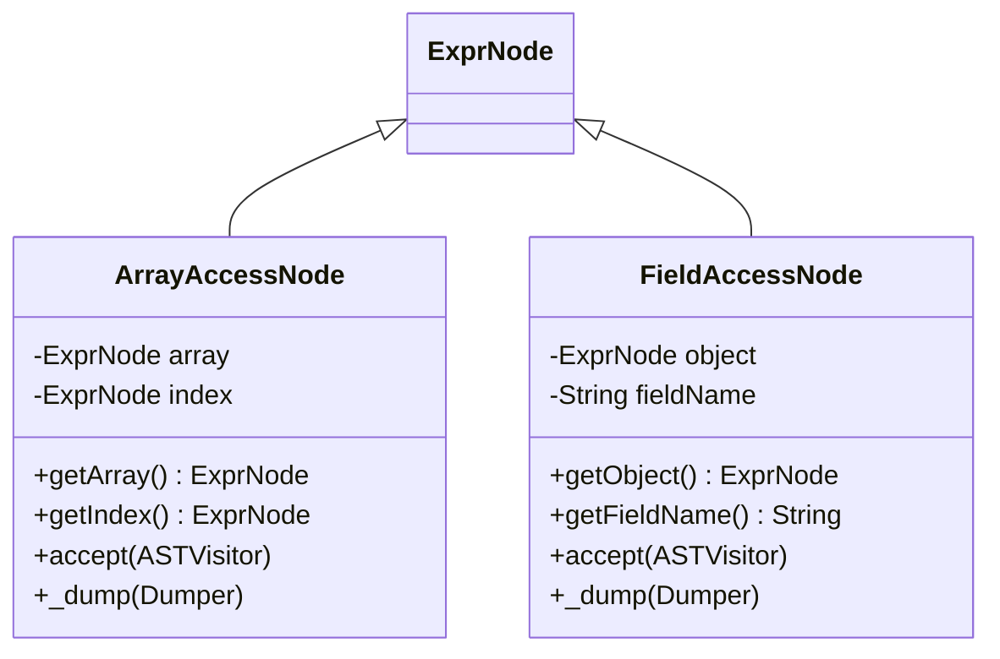
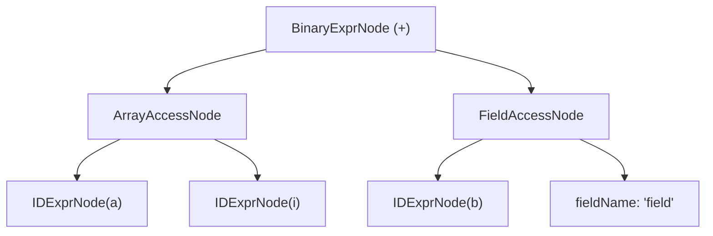

# Expression Nodes

<cite>
**Referenced Files in This Document**   
- [ExprNode.java](file://ep20/src/main/java/org/teachfx/antlr4/ep20/ast/expr/ExprNode.java)
- [BinaryExprNode.java](file://ep20/src/main/java/org/teachfx/antlr4/ep20/ast/expr/BinaryExprNode.java)
- [UnaryExprNode.java](file://ep20/src/main/java/org/teachfx/antlr4/ep20/ast/expr/UnaryExprNode.java)
- [CallFuncNode.java](file://ep20/src/main/java/org/teachfx/antlr4/ep20/ast/expr/CallFuncNode.java)
- [ArrayAccessNode.java](file://ep20/src/main/java/org/teachfx/antlr4/ep20/ast/expr/ArrayAccessNode.java)
- [FieldAccessNode.java](file://ep20/src/main/java/org/teachfx/antlr4/ep20/ast/expr/FieldAccessNode.java)
- [LiteralNode.java](file://ep20/src/main/java/org/teachfx/antlr4/ep20/ast/expr/LiteralNode.java)
- [IDExprNode.java](file://ep20/src/main/java/org/teachfx/antlr4/ep20/ast/expr/IDExprNode.java)
</cite>

## Table of Contents
1. [Introduction](#introduction)
2. [Core Expression Node Hierarchy](#core-expression-node-hierarchy)
3. [Binary Expression Nodes](#binary-expression-nodes)
4. [Unary Expression Nodes](#unary-expression-nodes)
5. [Function Call Nodes](#function-call-nodes)
6. [Literal and Identifier Nodes](#literal-and-identifier-nodes)
7. [Array and Field Access Nodes](#array-and-field-access-nodes)
8. [Expression Tree Construction and Operator Precedence](#expression-tree-construction-and-operator-precedence)
9. [Type Checking and Code Generation Roles](#type-checking-and-code-generation-roles)
10. [Constant Folding Implementation](#constant-folding-implementation)
11. [Complex Expression Representation Example](#complex-expression-representation-example)
12. [Conclusion](#conclusion)

## Introduction
This document provides a comprehensive analysis of expression node types in the Abstract Syntax Tree (AST) implementation of a programming language compiler built using ANTLR4. It details how various expression forms—binary operations, unary operations, function calls, literals, identifiers, array accesses, and field accesses—are represented as distinct node types within the AST. The document explains the structural properties of each node, their role in semantic analysis and code generation, and how complex expressions are hierarchically composed from simpler components.

**Section sources**
- [ExprNode.java](file://ep20/src/main/java/org/teachfx/antlr4/ep20/ast/expr/ExprNode.java)

## Core Expression Node Hierarchy
The foundation of all expression nodes is the abstract `ExprNode` class, which extends `ASTNode`. This base class encapsulates common attributes such as expression type information and l-value status, enabling uniform handling during type checking and code generation.



**Diagram sources**
- [ExprNode.java](file://ep20/src/main/java/org/teachfx/antlr4/ep20/ast/expr/ExprNode.java)

**Section sources**
- [ExprNode.java](file://ep20/src/main/java/org/teachfx/antlr4/ep20/ast/expr/ExprNode.java)

## Binary Expression Nodes
`BinaryExprNode` represents binary operations such as addition, subtraction, multiplication, and division. It stores references to left-hand side (LHS) and right-hand side (RHS) operand expressions and the operator type, which is defined via `OperatorType.BinaryOpType`.

Key properties:
- `lhs`: Left operand expression node
- `rhs`: Right operand expression node
- `opType`: Enum representing the binary operator (ADD, SUB, MUL, DIV)

Factory methods like `createAddNode`, `createMinNode`, etc., provide convenient construction of specific operation types.



**Diagram sources**
- [BinaryExprNode.java](file://ep20/src/main/java/org/teachfx/antlr4/ep20/ast/expr/BinaryExprNode.java)

**Section sources**
- [BinaryExprNode.java](file://ep20/src/main/java/org/teachfx/antlr4/ep20/ast/expr/BinaryExprNode.java)

## Unary Expression Nodes
`UnaryExprNode` models unary operations such as negation or logical NOT. It contains a single operand expression and the unary operator type from `OperatorType.UnaryOpType`.

Key properties:
- `valExpr`: The operand expression
- `opType`: The unary operator applied (e.g., NEGATE, NOT)

This node enables consistent traversal and evaluation of prefix unary expressions during interpretation or code emission.



**Diagram sources**
- [UnaryExprNode.java](file://ep20/src/main/java/org/teachfx/antlr4/ep20/ast/expr/UnaryExprNode.java)

**Section sources**
- [UnaryExprNode.java](file://ep20/src/main/java/org/teachfx/antlr4/ep20/ast/expr/UnaryExprNode.java)

## Function Call Nodes
`CallFuncNode` represents function invocation expressions. It stores the function name, a list of argument expressions, and a reference to the resolved `MethodSymbol` for type checking and code generation.

Key properties:
- `funcName`: Name of the called function
- `argsNode`: List of argument expressions
- `callFuncSymbol`: Resolved symbol containing return type and parameter info

The expression type is derived from the function's return type via `callFuncSymbol.getFuncType()`.



**Diagram sources**
- [CallFuncNode.java](file://ep20/src/main/java/org/teachfx/antlr4/ep20/ast/expr/CallFuncNode.java)

**Section sources**
- [CallFuncNode.java](file://ep20/src/main/java/org/teachfx/antlr4/ep20/ast/expr/CallFuncNode.java)

## Literal and Identifier Nodes
### Literal Nodes
`LiteralNode<T>` is an abstract generic base for literal values (integers, strings, booleans). It holds the raw value of type `T` and supports equality and hashing based on this value.

Concrete subclasses include:
- `IntExprNode`
- `StringExprNode`
- `BoolExprNode`
- `FloatExprNode`

### Identifier Nodes
`IDExprNode` represents variable or constant identifiers. It stores:
- `image`: The identifier name as a string
- `refSymbol`: Reference to the resolved symbol in the symbol table
- `isVal`: Flag indicating l-value status

Symbol resolution occurs during semantic analysis, linking the node to its declaration context.



**Diagram sources**
- [LiteralNode.java](file://ep20/src/main/java/org/teachfx/antlr4/ep20/ast/expr/LiteralNode.java)
- [IDExprNode.java](file://ep20/src/main/java/org/teachfx/antlr4/ep20/ast/expr/IDExprNode.java)

**Section sources**
- [LiteralNode.java](file://ep20/src/main/java/org/teachfx/antlr4/ep20/ast/expr/LiteralNode.java)
- [IDExprNode.java](file://ep20/src/main/java/org/teachfx/antlr4/ep20/ast/expr/IDExprNode.java)

## Array and Field Access Nodes
### Array Access Nodes
`ArrayAccessNode` models array indexing operations (`array[index]`). It contains:
- `array`: Expression evaluating to an array
- `index`: Expression evaluating to an index

This node supports both reading and writing to array elements, with l-value semantics determined during semantic analysis.

### Field Access Nodes
`FieldAccessNode` represents field access on structured data (`object.field`). It contains:
- `object`: Expression evaluating to a struct or object
- `fieldName`: Name of the accessed field

Field resolution and type checking depend on the symbol table's struct definitions.



**Diagram sources**
- [ArrayAccessNode.java](file://ep20/src/main/java/org/teachfx/antlr4/ep20/ast/expr/ArrayAccessNode.java)
- [FieldAccessNode.java](file://ep20/src/main/java/org/teachfx/antlr4/ep20/ast/expr/FieldAccessNode.java)

**Section sources**
- [ArrayAccessNode.java](file://ep20/src/main/java/org/teachfx/antlr4/ep20/ast/expr/ArrayAccessNode.java)
- [FieldAccessNode.java](file://ep20/src/main/java/org/teachfx/antlr4/ep20/ast/expr/FieldAccessNode.java)

## Expression Tree Construction and Operator Precedence
During parsing, ANTLR4's grammar rules enforce operator precedence by structuring the parse tree hierarchy. The AST builder (`CymbolASTBuilder`) translates this into a correctly nested expression tree.

For example, in `a + b * c`, multiplication has higher precedence, so the AST forms:
```
    BinaryExprNode (+)
   /               \
IDExprNode(a)   BinaryExprNode (*)
               /               \
         IDExprNode(b)     IDExprNode(c)
```

Parentheses override precedence by creating sub-expressions that are evaluated first.

**Section sources**
- [BinaryExprNode.java](file://ep20/src/main/java/org/teachfx/antlr4/ep20/ast/expr/BinaryExprNode.java)
- [UnaryExprNode.java](file://ep20/src/main/java/org/teachfx/antlr4/ep20/ast/expr/UnaryExprNode.java)

## Type Checking and Code Generation Roles
Expression nodes play critical roles in semantic analysis and code generation:

### Type Checking
- `getExprType()` provides the static type of any expression
- Binary operations validate operand compatibility
- Function calls check argument types against parameter types
- Field and array accesses resolve types from symbol table

### Code Generation
- Each node's `accept()` method enables visitor-based traversal
- The `ASTVisitor` pattern allows separation of concerns (e.g., `TypeChecker`, `CymbolAssembler`)
- Expression evaluation order is preserved during code emission
- L-value status determines whether an expression generates an address or value

**Section sources**
- [ExprNode.java](file://ep20/src/main/java/org/teachfx/antlr4/ep20/ast/expr/ExprNode.java)
- [CallFuncNode.java](file://ep20/src/main/java/org/teachfx/antlr4/ep20/ast/expr/CallFuncNode.java)

## Constant Folding Implementation
Constant folding can be implemented by analyzing expression subtrees during AST construction or in a separate optimization pass. For example:

```java
// Pseudocode for constant folding in BinaryExprNode
if (lhs instanceof IntExprNode && rhs instanceof IntExprNode) {
    int leftVal = ((IntExprNode)lhs).getRawValue();
    int rightVal = ((IntExprNode)rhs).getRawValue();
    int result = applyOperation(opType, leftVal, rightVal);
    return new IntExprNode(result, ctx);
}
```

This optimization replaces computable constant expressions with their literal results, reducing runtime computation.

**Section sources**
- [BinaryExprNode.java](file://ep20/src/main/java/org/teachfx/antlr4/ep20/ast/expr/BinaryExprNode.java)
- [IntExprNode.java](file://ep20/src/main/java/org/teachfx/antlr4/ep20/ast/expr/IntExprNode.java)

## Complex Expression Representation Example
Consider the expression: `a[i] + b.field`

Its AST representation is:



This structure preserves:
- Array indexing on `a` with index `i`
- Field access on object `b`
- Addition as the outermost operation
- Correct operand evaluation order

The type checker resolves `a` as an array type and `b` as a struct with field `field`, while code generation emits instructions for address calculation and value retrieval.

**Diagram sources**
- [BinaryExprNode.java](file://ep20/src/main/java/org/teachfx/antlr4/ep20/ast/expr/BinaryExprNode.java)
- [ArrayAccessNode.java](file://ep20/src/main/java/org/teachfx/antlr4/ep20/ast/expr/ArrayAccessNode.java)
- [FieldAccessNode.java](file://ep20/src/main/java/org/teachfx/antlr4/ep20/ast/expr/FieldAccessNode.java)
- [IDExprNode.java](file://ep20/src/main/java/org/teachfx/antlr4/ep20/ast/expr/IDExprNode.java)

**Section sources**
- [BinaryExprNode.java](file://ep20/src/main/java/org/teachfx/antlr4/ep20/ast/expr/BinaryExprNode.java)
- [ArrayAccessNode.java](file://ep20/src/main/java/org/teachfx/antlr4/ep20/ast/expr/ArrayAccessNode.java)
- [FieldAccessNode.java](file://ep20/src/main/java/org/teachfx/antlr4/ep20/ast/expr/FieldAccessNode.java)

## Conclusion
Expression nodes form the core of the AST's data manipulation capabilities, providing a structured, type-safe representation of all computational expressions in the source language. Through a well-defined hierarchy rooted in `ExprNode`, the system supports extensible expression types while enabling uniform processing for semantic analysis and code generation. The design facilitates advanced compiler optimizations like constant folding and ensures correct handling of operator precedence and complex nested expressions.