# Statement Nodes

<cite>
**Referenced Files in This Document**   
- [StmtNode.java](file://ep20/src/main/java/org/teachfx/antlr4/ep20/ast/stmt/StmtNode.java)
- [ScopeType.java](file://ep20/src/main/java/org/teachfx/antlr4/ep20/ast/stmt/ScopeType.java)
- [BlockStmtNode.java](file://ep20/src/main/java/org/teachfx/antlr4/ep20/ast/stmt/BlockStmtNode.java)
- [IfStmtNode.java](file://ep20/src/main/java/org/teachfx/antlr4/ep20/ast/stmt/IfStmtNode.java)
- [WhileStmtNode.java](file://ep20/src/main/java/org/teachfx/antlr4/ep20/ast/stmt/WhileStmtNode.java)
- [AssignStmtNode.java](file://ep20/src/main/java/org/teachfx/antlr4/ep20/ast/stmt/AssignStmtNode.java)
- [VarDeclStmtNode.java](file://ep20/src/main/java/org/teachfx/antlr4/ep20/ast/stmt/VarDeclStmtNode.java)
- [ExprStmtNode.java](file://ep20/src/main/java/org/teachfx/antlr4/ep20/ast/stmt/ExprStmtNode.java)
- [BreakStmtNode.java](file://ep20/src/main/java/org/teachfx/antlr4/ep20/ast/stmt/BreakStmtNode.java)
</cite>

## Table of Contents
1. [Introduction](#introduction)
2. [Statement Node Hierarchy](#statement-node-hierarchy)
3. [Control Flow Statements](#control-flow-statements)
4. [Compound Statements and Blocks](#compound-statements-and-blocks)
5. [Variable Declarations and Scoping](#variable-declarations-and-scoping)
6. [Expression and Assignment Statements](#expression-and-assignment-statements)
7. [Statement Sequencing and Fall-Through](#statement-sequencing-and-fall-through)
8. [Unreachable Code Detection](#unreachable-code-detection)

## Introduction
This document provides a comprehensive analysis of statement node representations in the AST (Abstract Syntax Tree) of the Cymbol language implementation. It details how various control flow constructs, declarations, and expressions are modeled as statement nodes, with emphasis on structural organization, scoping mechanisms, and execution flow. The analysis focuses on the `ep20` implementation, which features a well-defined hierarchy of statement types that support lexical scoping and structured control flow.

## Statement Node Hierarchy

The AST statement node hierarchy is rooted in the abstract `StmtNode` class, which serves as the base for all statement types. This class extends `ASTNode` and introduces scope management capabilities through integration with the symbol table system.

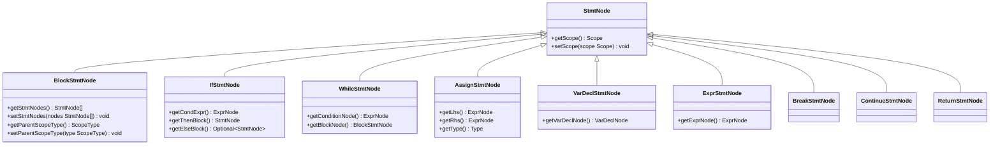

**Diagram sources**
- [StmtNode.java](file://ep20/src/main/java/org/teachfx/antlr4/ep20/ast/stmt/StmtNode.java#L1-L22)
- [BlockStmtNode.java](file://ep20/src/main/java/org/teachfx/antlr4/ep20/ast/stmt/BlockStmtNode.java#L1-L47)
- [IfStmtNode.java](file://ep20/src/main/java/org/teachfx/antlr4/ep20/ast/stmt/IfStmtNode.java#L1-L60)

**Section sources**
- [StmtNode.java](file://ep20/src/main/java/org/teachfx/antlr4/ep20/ast/stmt/StmtNode.java#L1-L22)

## Control Flow Statements

Control flow statements are represented as specialized `StmtNode` subclasses that encapsulate the logic and structure of conditional and iterative constructs. The `IfStmtNode` and `WhileStmtNode` classes provide the foundation for branching and looping control structures.

### Conditional Statements (If)
The `IfStmtNode` represents if-then-else constructs with optional else branches. It contains references to the conditional expression, then block, and optional else block, enabling traversal and evaluation of conditional logic.

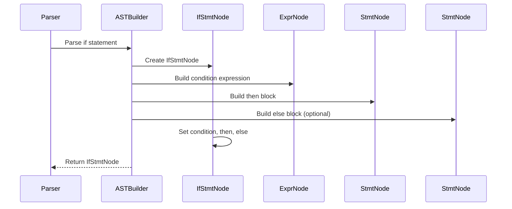

**Diagram sources**
- [IfStmtNode.java](file://ep20/src/main/java/org/teachfx/antlr4/ep20/ast/stmt/IfStmtNode.java#L1-L60)

### Loop Statements (While)
The `WhileStmtNode` represents while loops with a condition expression and a block statement body. The loop body is explicitly modeled as a `BlockStmtNode`, ensuring proper scoping and structured control flow.

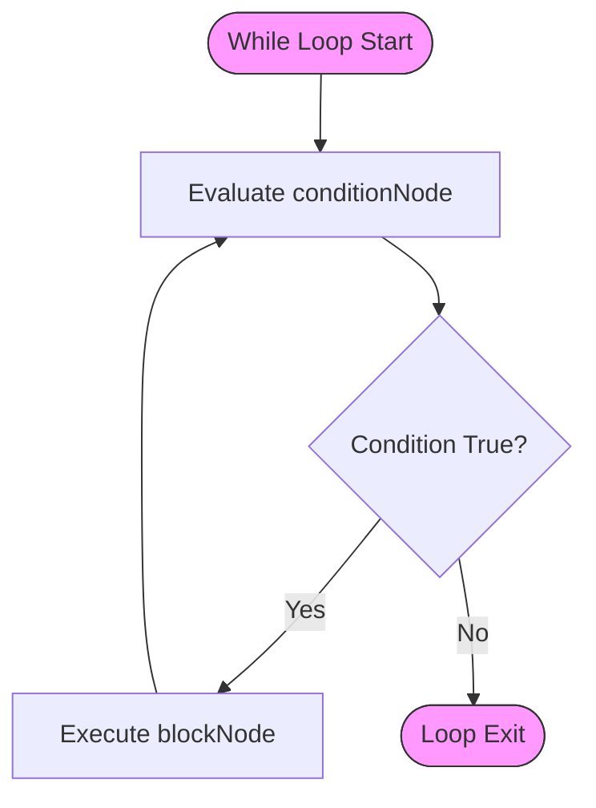

**Diagram sources**
- [WhileStmtNode.java](file://ep20/src/main/java/org/teachfx/antlr4/ep20/ast/stmt/WhileStmtNode.java#L1-L46)

**Section sources**
- [IfStmtNode.java](file://ep20/src/main/java/org/teachfx/antlr4/ep20/ast/stmt/IfStmtNode.java#L1-L60)
- [WhileStmtNode.java](file://ep20/src/main/java/org/teachfx/antlr4/ep20/ast/stmt/WhileStmtNode.java#L1-L46)

## Compound Statements and Blocks

Compound statements are represented by the `BlockStmtNode` class, which encapsulates a sequence of statements within a lexical scope. This node type is fundamental for structuring code blocks in functions, loops, conditionals, and other scoped constructs.

### Block Structure
A `BlockStmtNode` contains a list of `StmtNode` children and maintains information about its parent scope type. This enables proper scoping hierarchy construction during semantic analysis.

```mermaid
erDiagram
BLOCKSTMTNODE ||--o{ STMTNODE : contains
BLOCKSTMTNODE {
List~StmtNode~ stmtNodes
ScopeType scopeType
}
STMTNODE {
Scope scope
ParserRuleContext ctx
}
BLOCKSTMTNODE }o--|| SCOPETYPE : has
SCOPETYPE {
FuncScope
BlockScope
LoopScope
ClassScope
GlobalScope
}
```

**Diagram sources**
- [BlockStmtNode.java](file://ep20/src/main/java/org/teachfx/antlr4/ep20/ast/stmt/BlockStmtNode.java#L1-L47)
- [ScopeType.java](file://ep20/src/main/java/org/teachfx/antlr4/ep20/ast/stmt/ScopeType.java#L1-L9)

### Nested Control Flow
Nested control flow structures are represented through hierarchical composition of statement nodes. For example, an if statement within a while loop would have the `IfStmtNode` as a child of the `BlockStmtNode` that serves as the loop body.

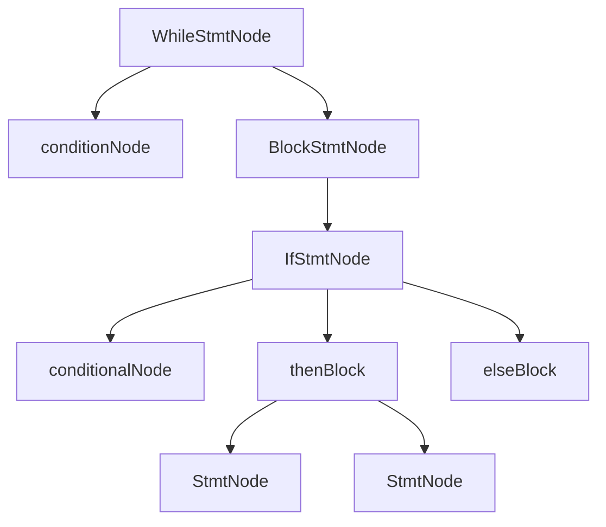

**Section sources**
- [BlockStmtNode.java](file://ep20/src/main/java/org/teachfx/antlr4/ep20/ast/stmt/BlockStmtNode.java#L1-L47)

## Variable Declarations and Scoping

Variable declarations and scoping are managed through the integration of statement nodes with the symbol table system. The `VarDeclStmtNode` and `BlockStmtNode` classes play key roles in establishing lexical scope boundaries.

### Declaration Statements
The `VarDeclStmtNode` wraps a `VarDeclNode` (from the decl package) and serves as a statement-level representation of variable declarations. This allows declarations to be treated as statements within block sequences.

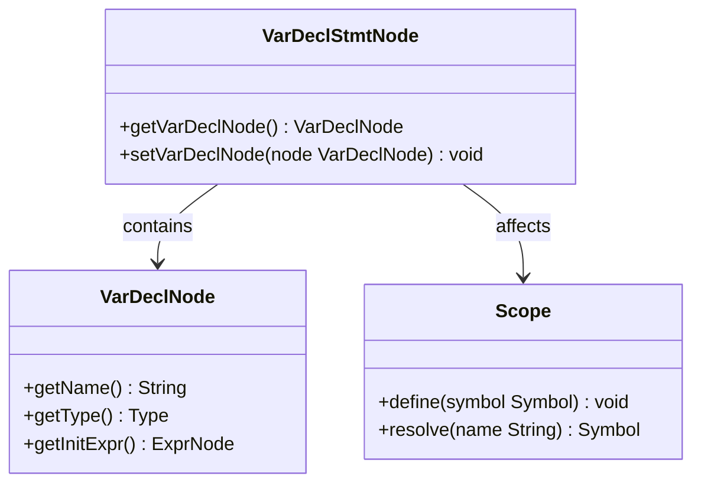

**Diagram sources**
- [VarDeclStmtNode.java](file://ep20/src/main/java/org/teachfx/antlr4/ep20/ast/stmt/VarDeclStmtNode.java#L1-L34)

### Scope Management
The `ScopeType` enum defines different types of lexical scopes (function, block, loop, class, global), which are associated with `BlockStmtNode` instances. During semantic analysis, these scope types guide the creation of appropriate scope objects in the symbol table hierarchy.

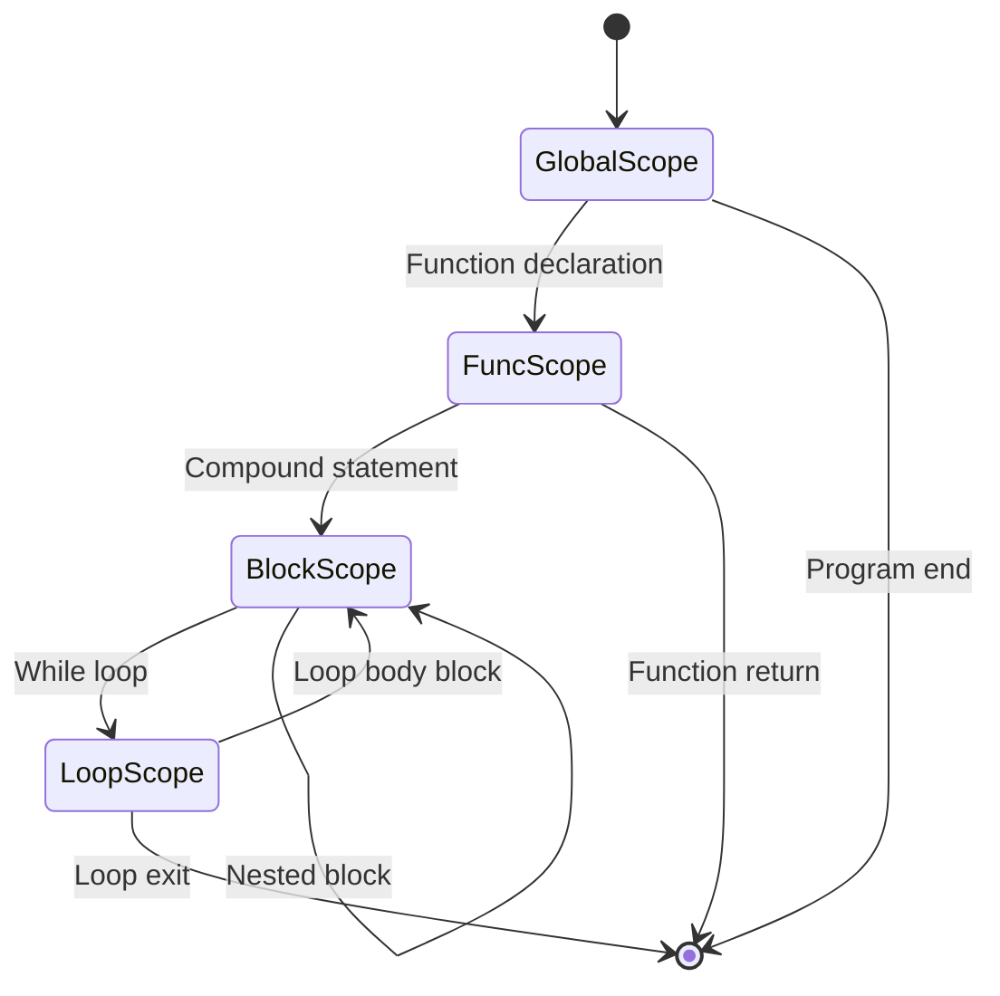

**Section sources**
- [VarDeclStmtNode.java](file://ep20/src/main/java/org/teachfx/antlr4/ep20/ast/stmt/VarDeclStmtNode.java#L1-L34)
- [ScopeType.java](file://ep20/src/main/java/org/teachfx/antlr4/ep20/ast/stmt/ScopeType.java#L1-L9)

## Expression and Assignment Statements

Expression and assignment statements represent computational operations that modify program state. These are modeled as specialized statement nodes that can be sequenced within blocks.

### Assignment Statements
The `AssignStmtNode` represents assignment operations with left-hand side (LHS) and right-hand side (RHS) expressions. It also maintains type information for type checking during semantic analysis.

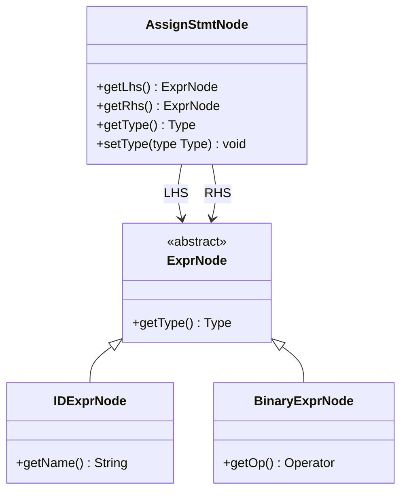

**Diagram sources**
- [AssignStmtNode.java](file://ep20/src/main/java/org/teachfx/antlr4/ep20/ast/stmt/AssignStmtNode.java#L1-L56)

### Expression Statements
The `ExprStmtNode` wraps any expression to be executed as a statement, such as function calls or increment operations. This allows expressions to be used in statement contexts while preserving their evaluation semantics.

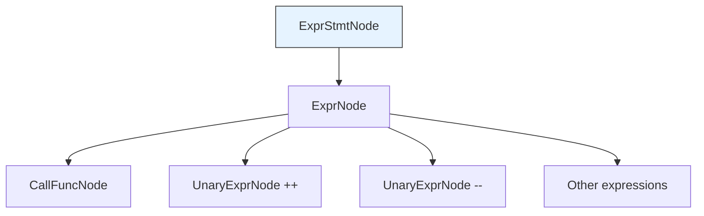

**Section sources**
- [AssignStmtNode.java](file://ep20/src/main/java/org/teachfx/antlr4/ep20/ast/stmt/AssignStmtNode.java#L1-L56)
- [ExprStmtNode.java](file://ep20/src/main/java/org/teachfx/antlr4/ep20/ast/stmt/ExprStmtNode.java#L1-L34)

## Statement Sequencing and Fall-Through

Statement sequencing is preserved through the list-based structure of `BlockStmtNode`, which maintains the order of statements as they appear in the source code. This ordered list ensures that execution proceeds in the correct sequence.

### Control Flow Continuity
The AST structure naturally supports fall-through behavior in control flow by maintaining the sequential relationship between statements. After executing one statement, control implicitly passes to the next in the block.

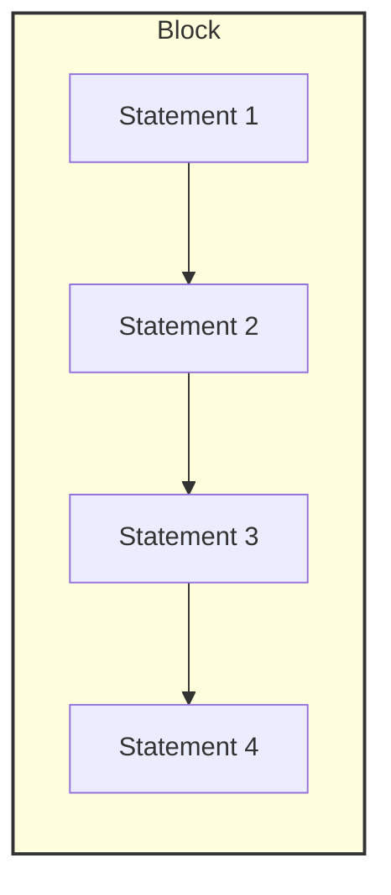

**Diagram sources**
- [BlockStmtNode.java](file://ep20/src/main/java/org/teachfx/antlr4/ep20/ast/stmt/BlockStmtNode.java#L1-L47)

### Break Statements
Explicit control transfer is supported through special statement nodes like `BreakStmtNode`, which represents break statements in loops. These nodes terminate the normal sequential flow and transfer control to the end of the enclosing loop.

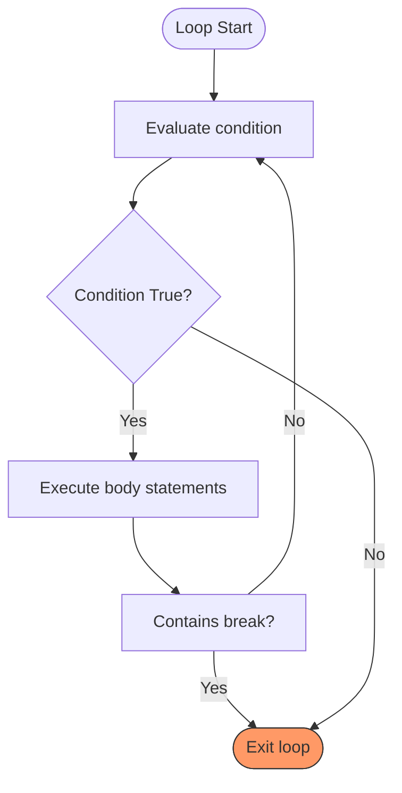

**Section sources**
- [BlockStmtNode.java](file://ep20/src/main/java/org/teachfx/antlr4/ep20/ast/stmt/BlockStmtNode.java#L1-L47)
- [BreakStmtNode.java](file://ep20/src/main/java/org/teachfx/antlr4/ep20/ast/stmt/BreakStmtNode.java#L1-L23)

## Unreachable Code Detection

Unreachable code detection can be implemented by analyzing the control flow graph derived from the statement node structure. The presence of unconditional control transfer statements (like break, return, or infinite loops) creates opportunities for unreachable code.

### Detection Algorithm
A reachability analysis can traverse the AST and track whether each statement node is reachable based on the control flow properties of preceding statements.

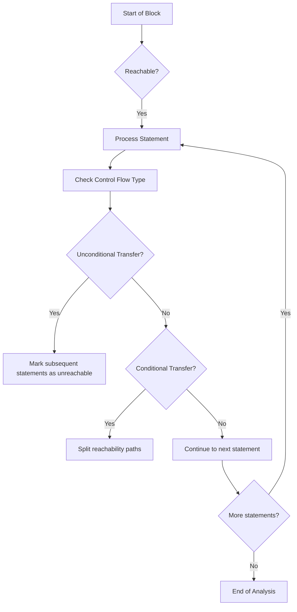

The analysis would consider:
- `ReturnStmtNode`: Makes all subsequent statements in the function unreachable
- `BreakStmtNode`: Makes subsequent statements in the loop body unreachable
- `WhileStmtNode` with constant true condition: Makes statements after the loop unreachable
- `IfStmtNode` with constant false condition: Makes then block unreachable

This analysis leverages the structured representation of control flow in the AST, where each control flow construct has a well-defined entry and exit pattern that can be analyzed for reachability implications.

**Section sources**
- [IfStmtNode.java](file://ep20/src/main/java/org/teachfx/antlr4/ep20/ast/stmt/IfStmtNode.java#L1-L60)
- [WhileStmtNode.java](file://ep20/src/main/java/org/teachfx/antlr4/ep20/ast/stmt/WhileStmtNode.java#L1-L46)
- [BreakStmtNode.java](file://ep20/src/main/java/org/teachfx/antlr4/ep20/ast/stmt/BreakStmtNode.java#L1-L23)
- [ReturnStmtNode.java](file://ep20/src/main/java/org/teachfx/antlr4/ep20/ast/stmt/ReturnStmtNode.java)