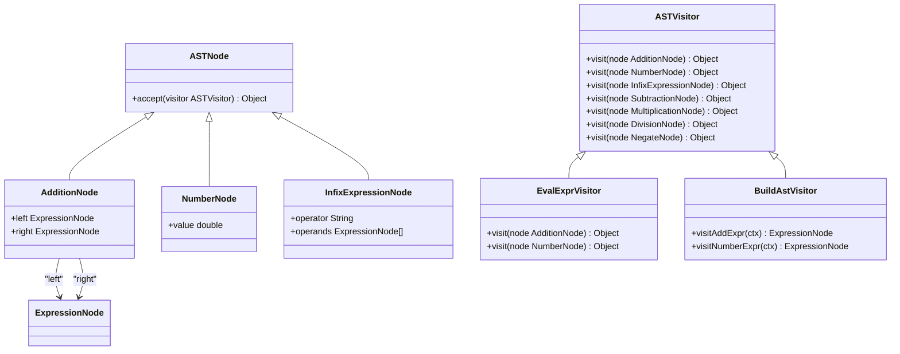
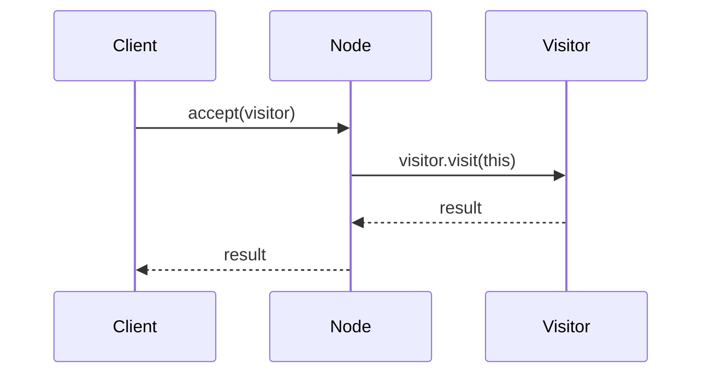
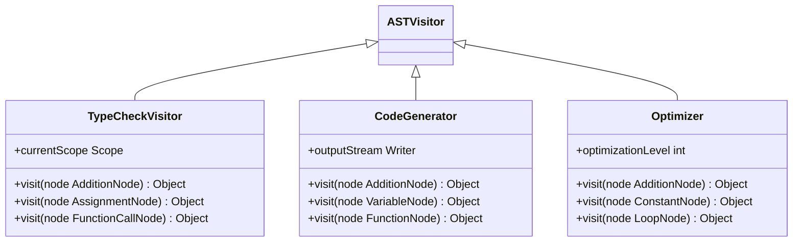
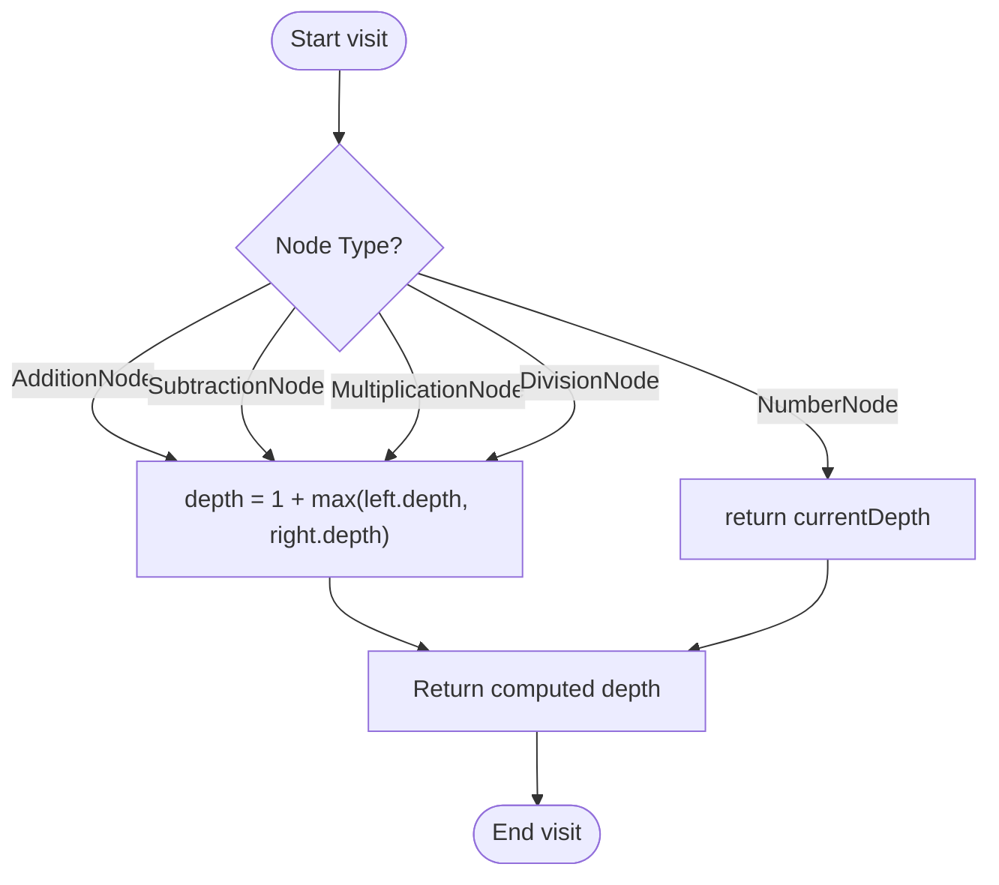
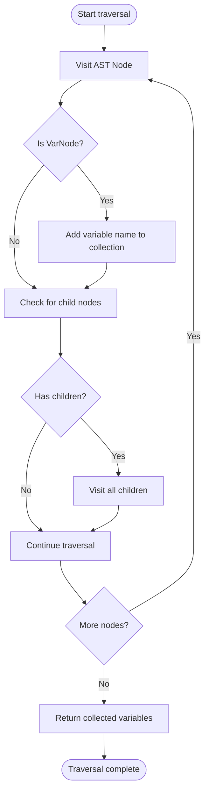

# Visitor Pattern Implementation

<cite>
**Referenced Files in This Document**   
- [ASTVisitor.java](file://ep11/src/main/java/org/teachfx/antlr4/ASTVisitor.java)
- [ASTNode.java](file://ep8/src/main/java/org/teachfx/antlr4/ASTNode.java)
- [BuildAstVisitor.java](file://ep11/src/main/java/org/teachfx/antlr4/BuildAstVisitor.java)
- [EvalExprVisitor.java](file://ep11/src/main/java/org/teachfx/antlr4/EvalExprVisitor.java)
- [ExpressionNode.java](file://ep11/src/main/java/org/teachfx/antlr4/ExpressionNode.java)
- [AdditionNode.java](file://ep11/src/main/java/org/teachfx/antlr4/AdditionNode.java)
- [NumberNode.java](file://ep11/src/main/java/org/teachfx/antlr4/NumberNode.java)
- [InfixExpressionNode.java](file://ep11/src/main/java/org/teachfx/antlr4/InfixExpressionNode.java)
- [TypeCheckVisitor.java](file://ep19/src/main/java/org/teachfx/antlr4/ep19/pass/TypeCheckVisitor.java)
- [CymbolASTVisitor.java](file://ep16/src/main/java/org/teachfx/antlr4/ep16/visitor/CymbolASTVisitor.java)
</cite>

## Table of Contents
1. [Introduction](#introduction)
2. [Core Components](#core-components)
3. [Visitor Pattern Architecture](#visitor-pattern-architecture)
4. [Double Dispatch Mechanism](#double-dispatch-mechanism)
5. [Concrete Visitor Implementations](#concrete-visitor-implementations)
6. [Expression Depth Calculation Example](#expression-depth-calculation-example)
7. [Variable Reference Collection](#variable-reference-collection)
8. [Advantages of Visitor Pattern](#advantages-of-visitor-pattern)
9. [Limitations and Alternatives](#limitations-and-alternatives)
10. [Conclusion](#conclusion)

## Introduction
The Visitor Pattern provides a powerful mechanism for extending operations on Abstract Syntax Trees (AST) without modifying the node classes themselves. This document explains how the ASTVisitor.java implementation enables clean traversal and processing of AST nodes through the double dispatch mechanism. The pattern allows separation of algorithms from the object structure on which they operate, making it ideal for compiler construction where multiple operations (type checking, code generation, optimization) need to be performed on the same AST structure.

## Core Components

The visitor pattern implementation revolves around several key components that work together to enable flexible AST processing. The ASTNode base class defines the foundation for all syntax tree elements, while ASTVisitor provides the interface for operations that can be performed on these nodes. Concrete node types like AdditionNode and NumberNode represent specific language constructs, and specialized visitors like EvalExprVisitor and TypeCheckVisitor implement particular processing logic.

**Section sources**
- [ASTNode.java](file://ep8/src/main/java/org/teachfx/antlr4/ASTNode.java#L1-L20)
- [ASTVisitor.java](file://ep11/src/main/java/org/teachfx/antlr4/ASTVisitor.java#L1-L15)

## Visitor Pattern Architecture

**Diagram sources**
- [ASTNode.java](file://ep8/src/main/java/org/teachfx/antlr4/ASTNode.java#L1-L15)
- [ASTVisitor.java](file://ep11/src/main/java/org/teachfx/antlr4/ASTVisitor.java#L1-L30)
- [AdditionNode.java](file://ep11/src/main/java/org/teachfx/antlr4/AdditionNode.java#L1-L10)
- [NumberNode.java](file://ep11/src/main/java/org/teachfx/antlr4/NumberNode.java#L1-L10)

**Section sources**
- [ASTNode.java](file://ep8/src/main/java/org/teachfx/antlr4/ASTNode.java#L1-L50)
- [ASTVisitor.java](file://ep11/src/main/java/org/teachfx/antlr4/ASTVisitor.java#L1-L40)

## Double Dispatch Mechanism

The double dispatch mechanism is the core of the visitor pattern's functionality. When a visitor processes an AST node, two method dispatches occur: first, the node's accept method is called, and second, the appropriate visit method on the visitor is invoked based on the concrete node type. This allows the correct operation to be executed for each specific node type without requiring type checking or casting within the visitor implementation.

The accept method in ASTNode.java enables this mechanism by taking a visitor as a parameter and calling the visitor's visit method with itself as an argument. This design ensures that the Java runtime selects the appropriate overloaded visit method based on the actual type of the node, not just its declared type.

**Diagram sources**
- [ASTNode.java](file://ep8/src/main/java/org/teachfx/antlr4/ASTNode.java#L15-L25)
- [ASTVisitor.java](file://ep11/src/main/java/org/teachfx/antlr4/ASTVisitor.java#L20-L35)

**Section sources**
- [ASTNode.java](file://ep8/src/main/java/org/teachfx/antlr4/ASTNode.java#L15-L30)
- [ASTVisitor.java](file://ep11/src/main/java/org/teachfx/antlr4/ASTVisitor.java#L20-L40)

## Concrete Visitor Implementations

Concrete visitors extend the ASTVisitor base class to implement specific operations on the AST. The EvalExprVisitor performs expression evaluation by recursively computing values from leaf nodes upward. The BuildAstVisitor constructs the AST from parser output by creating appropriate node instances for each grammar rule. The TypeCheckVisitor analyzes type compatibility across expressions and declarations.

Each concrete visitor implements visit methods for all relevant node types, allowing it to process the entire AST. This approach maintains separation of concerns by encapsulating each operation within its own visitor class, making the code more modular and easier to maintain.

**Diagram sources**
- [TypeCheckVisitor.java](file://ep19/src/main/java/org/teachfx/antlr4/ep19/pass/TypeCheckVisitor.java#L1-L20)
- [CymbolASTVisitor.java](file://ep16/src/main/java/org/teachfx/antlr4/ep16/visitor/CymbolASTVisitor.java#L1-L15)

**Section sources**
- [EvalExprVisitor.java](file://ep11/src/main/java/org/teachfx/antlr4/EvalExprVisitor.java#L1-L50)
- [BuildAstVisitor.java](file://ep11/src/main/java/org/teachfx/antlr4/BuildAstVisitor.java#L1-L45)

## Expression Depth Calculation Example

A simple visitor can be implemented to compute the maximum depth of expressions in the AST. The visitor traverses the tree, incrementing a depth counter at each level and maintaining the maximum depth encountered. When visiting leaf nodes like NumberNode, it returns the current depth. When visiting internal nodes like AdditionNode, it recursively visits child nodes with an incremented depth and returns the maximum of the results.

This example demonstrates how visitors can collect information about the AST structure without modifying the node classes. The same pattern can be applied to calculate other metrics such as node count, operator distribution, or complexity measures.

**Diagram sources**
- [ExpressionNode.java](file://ep11/src/main/java/org/teachfx/antlr4/ExpressionNode.java#L1-L15)
- [InfixExpressionNode.java](file://ep11/src/main/java/org/teachfx/antlr4/InfixExpressionNode.java#L1-L20)

**Section sources**
- [EvalExprVisitor.java](file://ep11/src/main/java/org/teachfx/antlr4/EvalExprVisitor.java#L25-L45)

## Variable Reference Collection

Another practical application of the visitor pattern is collecting all variable references in the AST. A visitor can traverse the tree and accumulate variable names in a set or list. When visiting a VarNode, it adds the variable name to the collection. This approach enables various analyses such as unused variable detection, variable renaming, or scope analysis.

The visitor pattern makes this operation straightforward to implement and maintain. Additional logic can be added to track declaration sites, usage counts, or cross-reference information without affecting the core AST structure or other visitors.

**Diagram sources**
- [ExpressionNode.java](file://ep11/src/main/java/org/teachfx/antlr4/ExpressionNode.java#L1-L15)
- [BuildAstVisitor.java](file://ep11/src/main/java/org/teachfx/antlr4/BuildAstVisitor.java#L20-L35)

**Section sources**
- [BuildAstVisitor.java](file://ep11/src/main/java/org/teachfx/antlr4/BuildAstVisitor.java#L20-L50)

## Advantages of Visitor Pattern

The visitor pattern offers several significant advantages for AST processing in compiler construction. First, it enables adding new operations without modifying existing node classes, adhering to the open/closed principle. Second, it maintains separation of concerns by encapsulating each operation in its own visitor class. Third, it provides type safety through method overloading rather than explicit type checking and casting.

The pattern also facilitates code reuse and modularity. Visitors can be composed or chained together, allowing complex processing pipelines to be constructed from simpler components. Additionally, the pattern makes it easy to implement operations that need to process the entire AST uniformly, such as pretty printing, optimization, or code generation.

## Limitations and Alternatives

While powerful, the visitor pattern has some limitations. It can be cumbersome when the AST structure changes frequently, as each new node type requires updating all visitor classes with a new visit method. The pattern also violates encapsulation to some extent, as visitors often need to access internal node data. Additionally, the double dispatch mechanism can have performance implications compared to direct method calls.

Alternative approaches include using pattern matching (available in some languages), implementing operations as methods on the nodes themselves, or using reflection-based dispatch. Each alternative has trade-offs in terms of type safety, performance, and maintainability. The choice depends on the specific requirements and constraints of the compiler project.

## Conclusion

The visitor pattern provides an elegant solution for implementing operations on ASTs in compiler construction. By leveraging double dispatch through the accept() method in ASTNode.java and visit() methods in ASTVisitor.java, it enables clean separation between the data structure and the algorithms that operate on it. This design allows for easy extension with new operations like type checking and code generation without modifying the core AST classes. While the pattern has some limitations, its benefits in terms of maintainability, type safety, and separation of concerns make it a valuable tool for building robust and extensible compilers.