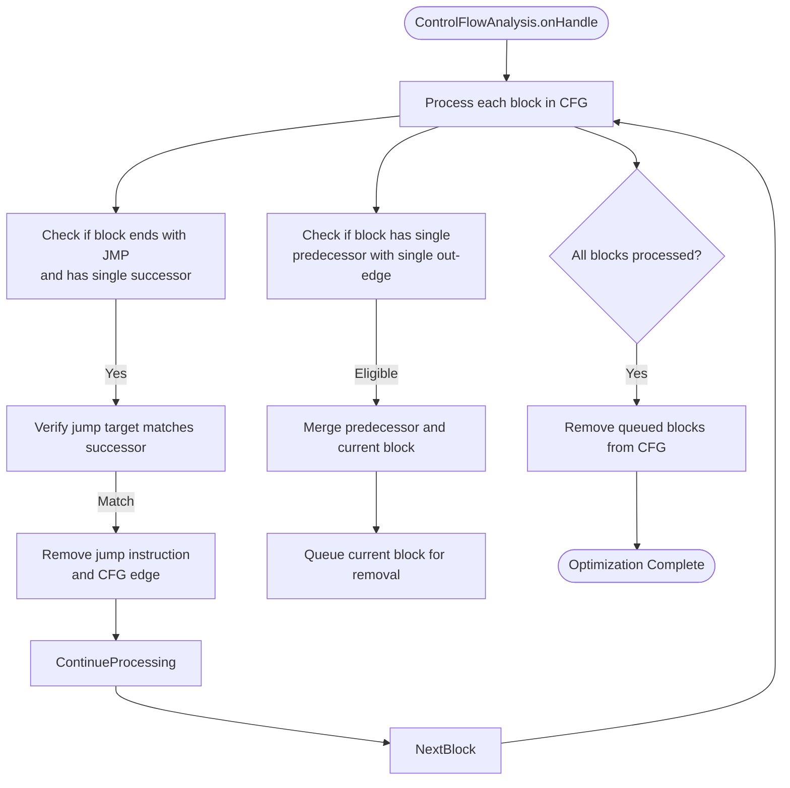
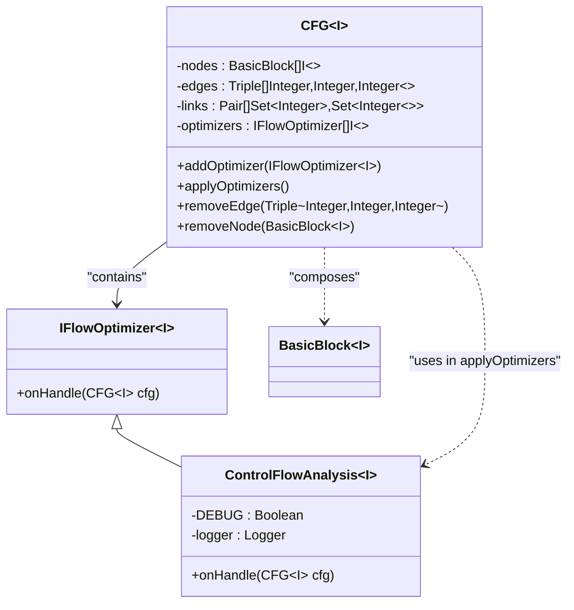
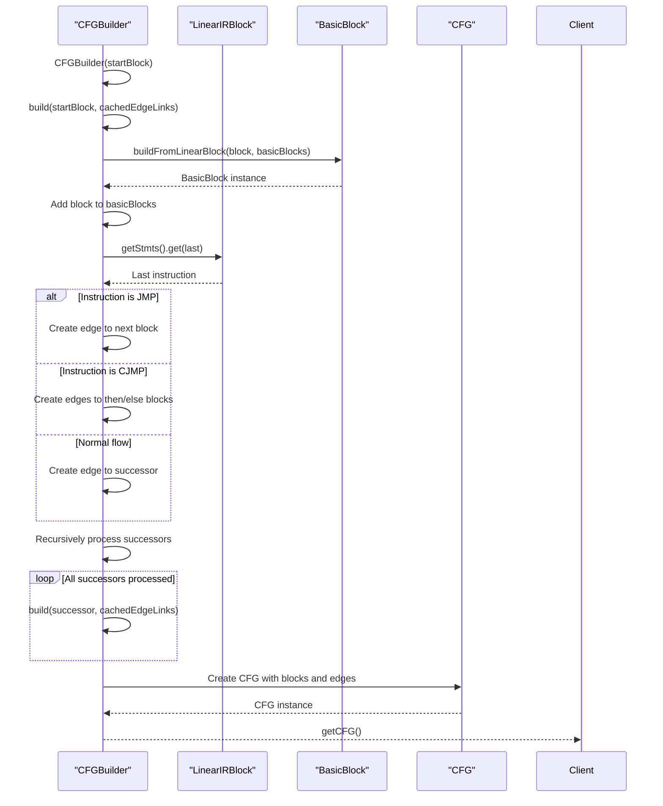
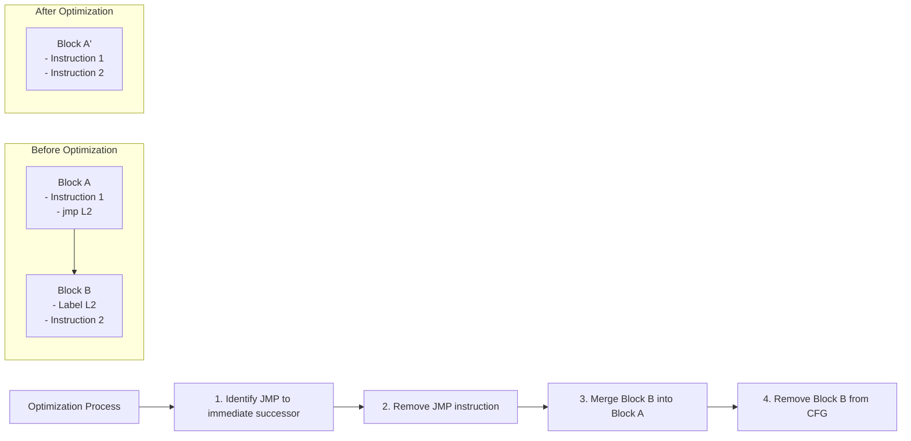
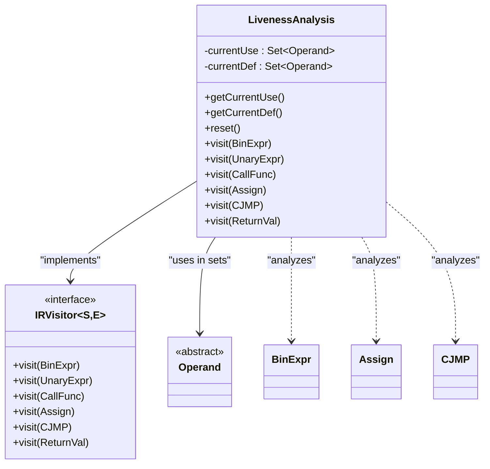
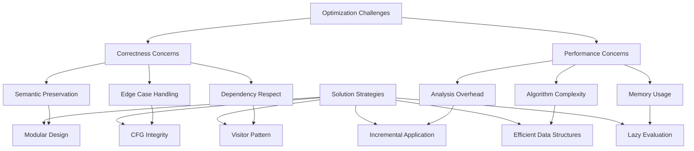
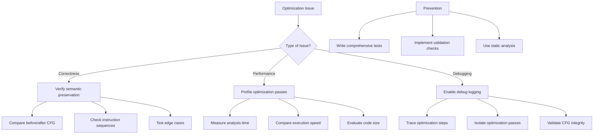
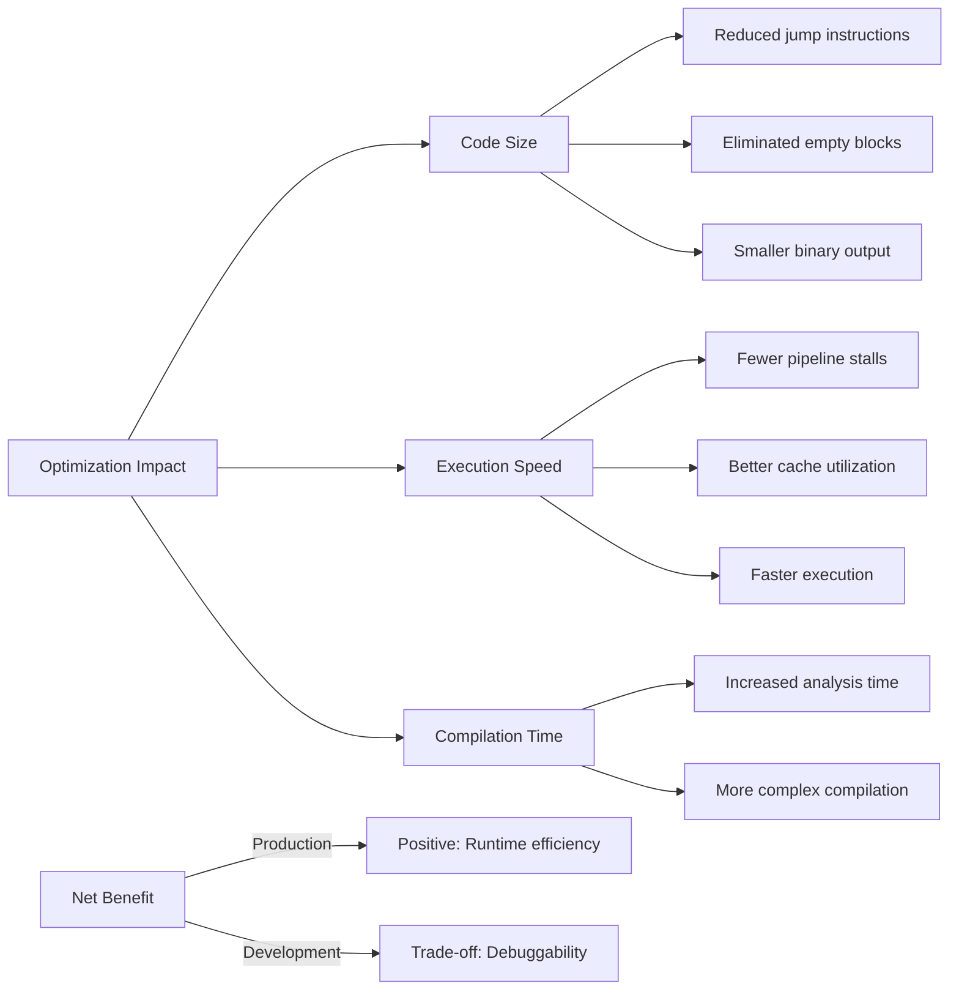

# Advanced Optimizations

<cite>
**Referenced Files in This Document**   
- [ControlFlowAnalysis.java](file://ep20/src/main/java/org/teachfx/antlr4/ep20/pass/cfg/ControlFlowAnalysis.java)
- [IFlowOptimizer.java](file://ep20/src/main/java/org/teachfx/antlr4/ep20/pass/cfg/IFlowOptimizer.java)
- [CFGBuilder.java](file://ep20/src/main/java/org/teachfx/antlr4/ep20/pass/cfg/CFGBuilder.java)
- [LivenessAnalysis.java](file://ep20/src/main/java/org/teachfx/antlr4/ep20/pass/cfg/LivenessAnalysis.java)
- [BasicBlock.java](file://ep20/src/main/java/org/teachfx/antlr4/ep20/pass/cfg/BasicBlock.java)
- [CFG.java](file://ep20/src/main/java/org/teachfx/antlr4/ep20/pass/cfg/CFG.java)
- [JMP.java](file://ep20/src/main/java/org/teachfx/antlr4/ep20/ir/stmt/JMP.java)
- [CJMP.java](file://ep21/src/main/java/org/teachfx/antlr4/ep21/ir/stmt/CJMP.java)
- [Prog.java](file://ep20/src/main/java/org/teachfx/antlr4/ep20/ir/Prog.java)
</cite>

## Table of Contents
1. [Introduction](#introduction)
2. [Control Flow Analysis Implementation](#control-flow-analysis-implementation)
3. [IFlowOptimizer Interface and Pluggable Architecture](#iflowoptimizer-interface-and-pluggable-architecture)
4. [CFGBuilder and Optimized Control Flow Structures](#cfgbuilder-and-optimized-control-flow-structures)
5. [Concrete Optimization Examples](#concrete-optimization-examples)
6. [Liveness Analysis and Optimization Passes](#liveness-analysis-and-optimization-passes)
7. [Correctness and Performance Challenges](#correctness-and-performance-challenges)
8. [Troubleshooting Optimization Issues](#troubleshooting-optimization-issues)
9. [Impact on Code Size and Execution Speed](#impact-on-code-size-and-execution-speed)
10. [Conclusion](#conclusion)

## Introduction
This document provides a comprehensive analysis of advanced optimization techniques in the Antlr4-based compiler implementation. It focuses on control flow optimizations beyond basic flow analysis, examining the architecture and implementation of key components that enable sophisticated code transformations. The document details how the system identifies and implements optimization opportunities through control flow analysis, pluggable optimizers, and data flow analysis.

## Control Flow Analysis Implementation

The ControlFlowAnalysis class implements optimization techniques that simplify control flow by eliminating redundant jumps and merging basic blocks. The implementation operates on a Control Flow Graph (CFG) and applies two primary optimization strategies:

1. **Jump Elimination**: When a basic block has a single outgoing edge and ends with a jump instruction (JMP) where the jump target matches the successor block, the jump instruction is removed and the edge is eliminated from the CFG.

2. **Block Merging**: When a basic block has a single predecessor and that predecessor has a single outgoing edge, the two blocks are merged. The predecessor absorbs the instructions of the current block (excluding labels), and the edge between them is removed.

The analysis processes all nodes in the CFG, first identifying jump instructions that can be eliminated, then queuing blocks for merging, and finally removing the merged blocks from the graph. This two-phase approach ensures that modifications to the graph structure don't interfere with the analysis of other nodes.

**Diagram sources**
- [ControlFlowAnalysis.java](file://ep20/src/main/java/org/teachfx/antlr4/ep20/pass/cfg/ControlFlowAnalysis.java#L28-L67)

**Section sources**
- [ControlFlowAnalysis.java](file://ep20/src/main/java/org/teachfx/antlr4/ep20/pass/cfg/ControlFlowAnalysis.java#L1-L68)

## IFlowOptimizer Interface and Pluggable Architecture

The IFlowOptimizer interface defines a pluggable architecture for control flow optimizations, enabling multiple optimization algorithms to be applied to the same CFG. The interface specifies a single method `onHandle(CFG<I> cfg)` that takes a control flow graph as input and applies optimization transformations.

This design allows for:
- **Modular optimization passes**: Each optimization technique can be implemented as a separate class
- **Chained execution**: Multiple optimizers can be registered with a CFG and executed in sequence
- **Extensibility**: New optimization algorithms can be added without modifying existing code
- **Reusability**: The same optimization can be applied to different types of intermediate representations

The pluggable architecture is implemented through the CFG class, which maintains a list of registered optimizers. When `applyOptimizers()` is called, each optimizer in the list is invoked in sequence, allowing for cumulative improvements to the control flow structure.

**Diagram sources**
- [IFlowOptimizer.java](file://ep20/src/main/java/org/teachfx/antlr4/ep20/pass/cfg/IFlowOptimizer.java#L1-L8)
- [CFG.java](file://ep20/src/main/java/org/teachfx/antlr4/ep20/pass/cfg/CFG.java#L1-L159)

**Section sources**
- [IFlowOptimizer.java](file://ep20/src/main/java/org/teachfx/antlr4/ep20/pass/cfg/IFlowOptimizer.java#L1-L8)
- [CFG.java](file://ep20/src/main/java/org/teachfx/antlr4/ep20/pass/cfg/CFG.java#L1-L159)

## CFGBuilder and Optimized Control Flow Structures

The CFGBuilder class is responsible for constructing optimized control flow graphs from linear intermediate representation blocks. It processes a LinearIRBlock and builds a CFG by:
1. Creating BasicBlock instances from LinearIRBlock instances
2. Establishing edges between blocks based on control flow instructions
3. Handling different types of control flow transfers (unconditional jumps, conditional jumps)

The builder uses a recursive approach to traverse the linear IR blocks, creating basic blocks and establishing edges based on the final instruction in each block:
- For unconditional jumps (JMP), an edge is created to the target block
- For conditional jumps (CJMP), edges are created to both the then and else blocks
- For normal flow, edges are created to successor blocks

The builder maintains a cache of edge links to prevent duplicate edges and uses triplets (source, destination, weight) to represent edges in the graph.

**Diagram sources**
- [CFGBuilder.java](file://ep20/src/main/java/org/teachfx/antlr4/ep20/pass/cfg/CFGBuilder.java#L1-L63)
- [BasicBlock.java](file://ep20/src/main/java/org/teachfx/antlr4/ep20/pass/cfg/BasicBlock.java#L1-L130)

**Section sources**
- [CFGBuilder.java](file://ep20/src/main/java/org/teachfx/antlr4/ep20/pass/cfg/CFGBuilder.java#L1-L63)

## Concrete Optimization Examples

### Jump Optimization
The ControlFlowAnalysis implementation performs jump optimization by eliminating redundant jump instructions when the jump target matches the natural flow successor. This occurs when:
- A block ends with a JMP instruction
- The block has only one successor
- The JMP target is the same as the successor block

When these conditions are met, the jump instruction is removed from the block, and the corresponding edge is removed from the CFG, simplifying the control flow.

### Dead Code Elimination
While not explicitly implemented in the provided ControlFlowAnalysis, the framework supports dead code elimination through the removal of unreachable basic blocks. When blocks are merged and intermediate blocks are removed from the CFG, any instructions in those blocks that are no longer reachable are effectively eliminated.

### Loop Invariant Detection
The current implementation does not include explicit loop invariant detection, but the CFG structure and data flow analysis framework provide the foundation for implementing this optimization. Liveness analysis could be extended to identify expressions within loops that do not change across iterations, allowing them to be moved outside the loop.

**Diagram sources**
- [ControlFlowAnalysis.java](file://ep20/src/main/java/org/teachfx/antlr4/ep20/pass/cfg/ControlFlowAnalysis.java#L28-L67)
- [BasicBlock.java](file://ep20/src/main/java/org/teachfx/antlr4/ep20/pass/cfg/BasicBlock.java#L1-L130)

**Section sources**
- [ControlFlowAnalysis.java](file://ep20/src/main/java/org/teachfx/antlr4/ep20/pass/cfg/ControlFlowAnalysis.java#L28-L67)

## Liveness Analysis and Optimization Passes

The LivenessAnalysis class implements a visitor pattern to track variable usage and definition within the intermediate representation. It maintains two sets for each analysis context:
- **currentUse**: Variables that are read (used) in the current context
- **currentDef**: Variables that are written (defined) in the current context

The analysis traverses the IR tree, updating these sets based on the type of node:
- **Assign statements**: The left-hand side is added to def, the right-hand side expressions are analyzed to populate use
- **Binary expressions**: Both operands are analyzed to determine usage
- **Conditional jumps**: The condition expression is analyzed for usage
- **Function calls**: Parameters are analyzed for usage

This liveness information is crucial for optimizations such as:
- **Register allocation**: Determining when variables are live helps allocate registers efficiently
- **Dead store elimination**: Identifying stores to variables that are never subsequently used
- **Common subexpression elimination**: Detecting expressions that produce the same value

The analysis resets its state at the beginning of each visit method to ensure isolated analysis of each node, with results combined appropriately by parent nodes.

**Diagram sources**
- [LivenessAnalysis.java](file://ep20/src/main/java/org/teachfx/antlr4/ep20/pass/cfg/LivenessAnalysis.java#L1-L147)

**Section sources**
- [LivenessAnalysis.java](file://ep20/src/main/java/org/teachfx/antlr4/ep20/pass/cfg/LivenessAnalysis.java#L1-L147)

## Correctness and Performance Challenges

Implementing control flow optimizations presents several challenges in maintaining correctness while improving performance:

### Correctness Challenges
1. **Preserving Semantics**: Optimizations must not change the observable behavior of the program
2. **Edge Case Handling**: Empty blocks, unreachable code, and complex control flow patterns require careful handling
3. **Instruction Dependencies**: Optimizations must respect data and control dependencies between instructions

The framework addresses these through:
- **Modular design**: Each optimization is isolated and can be tested independently
- **CFG integrity**: The graph structure maintains explicit edges between blocks, ensuring control flow remains well-defined
- **Visitor pattern**: Systematic traversal of IR nodes ensures comprehensive analysis

### Performance Challenges
1. **Optimization Overhead**: The cost of analysis must be justified by execution time savings
2. **Algorithm Complexity**: Some optimizations have high computational complexity
3. **Memory Usage**: Maintaining analysis data structures consumes memory

The implementation mitigates these by:
- **Incremental application**: Optimizations are applied in passes, allowing early benefits
- **Efficient data structures**: Using sets and maps for fast lookups
- **Lazy evaluation**: Analyzing only what's necessary for each optimization

**Section sources**
- [ControlFlowAnalysis.java](file://ep20/src/main/java/org/teachfx/antlr4/ep20/pass/cfg/ControlFlowAnalysis.java#L1-L68)
- [LivenessAnalysis.java](file://ep20/src/main/java/org/teachfx/antlr4/ep20/pass/cfg/LivenessAnalysis.java#L1-L147)

## Troubleshooting Optimization Issues

When encountering optimization-related bugs or performance regressions, consider the following troubleshooting approach:

### Common Issues
1. **Incorrect Code Generation**: Verify that optimizations preserve program semantics
2. **Infinite Loops**: Check that jump elimination doesn't create unintended loops
3. **Missing Instructions**: Ensure that block merging doesn't omit critical instructions
4. **Performance Degradation**: Profile to identify if optimization overhead exceeds benefits

### Debugging Strategies
1. **Enable Debug Logging**: The ControlFlowAnalysis class includes a DEBUG flag that can be set to trace optimization steps
2. **Compare Before/After**: Generate CFG visualizations before and after optimization to verify transformations
3. **Isolate Optimizations**: Test each optimization pass independently to identify problematic ones
4. **Check Edge Cases**: Test with empty blocks, single-instruction blocks, and complex control flow

### Verification Techniques
- **Round-trip Testing**: Compile, optimize, and execute test programs to verify correctness
- **Control Flow Validation**: Ensure all paths in the original CFG have corresponding paths in the optimized version
- **Liveness Verification**: Confirm that variable liveness is accurately tracked across optimizations

**Section sources**
- [ControlFlowAnalysis.java](file://ep20/src/main/java/org/teachfx/antlr4/ep20/pass/cfg/ControlFlowAnalysis.java#L1-L68)
- [Prog.java](file://ep20/src/main/java/org/teachfx/antlr4/ep20/ir/Prog.java#L36-L70)

## Impact on Code Size and Execution Speed

The implemented optimizations have significant impacts on both code size and execution speed:

### Code Size Reduction
1. **Jump Elimination**: Removes redundant jump instructions, reducing code size
2. **Block Merging**: Eliminates intermediate block boundaries and labels
3. **Dead Code Removal**: Removes unreachable instructions (when fully implemented)

These reductions lead to smaller binary output and improved instruction cache utilization.

### Execution Speed Improvements
1. **Reduced Branches**: Fewer jump instructions mean fewer pipeline stalls
2. **Better Locality**: Merged blocks improve instruction cache locality
3. **Simpler Control Flow**: Reduced complexity allows for more efficient execution

The optimizations follow the principle of "simplification before enhancement" - first making the control flow structure simpler and more regular, which enables more sophisticated optimizations in subsequent passes.

### Trade-offs
- **Compilation Time**: Analysis and transformation add to compilation time
- **Debuggability**: Optimized code may be harder to debug
- **Optimization Limits**: The current implementation focuses on local optimizations rather than global ones

The overall impact is positive for production code, where execution efficiency is prioritized over compilation speed and debuggability.

**Section sources**
- [ControlFlowAnalysis.java](file://ep20/src/main/java/org/teachfx/antlr4/ep20/pass/cfg/ControlFlowAnalysis.java#L1-L68)
- [CFGBuilder.java](file://ep20/src/main/java/org/teachfx/antlr4/ep20/pass/cfg/CFGBuilder.java#L1-L63)

## Conclusion
The advanced optimization framework provides a robust foundation for improving code quality through control flow analysis and transformation. The modular design with the IFlowOptimizer interface enables pluggable optimization algorithms, while the CFGBuilder creates optimized control flow structures from linear IR. The ControlFlowAnalysis implementation demonstrates practical techniques for jump optimization and block merging, with liveness analysis providing essential information for future optimizations. While challenges exist in maintaining correctness and managing performance trade-offs, the framework provides the tools necessary to implement sophisticated optimizations that improve both code size and execution speed. Future work could extend this foundation to include loop optimizations, global value numbering, and more advanced data flow analyses.