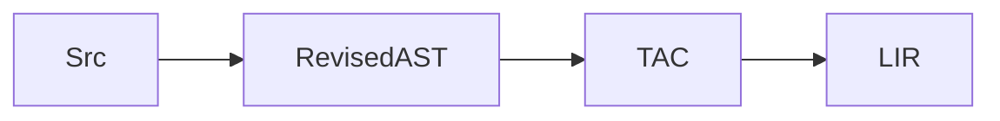
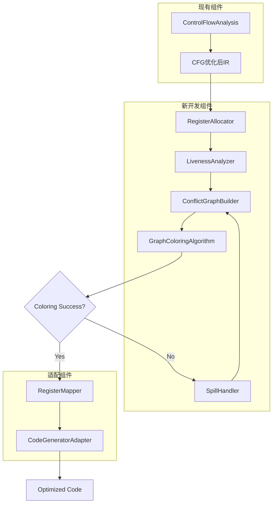
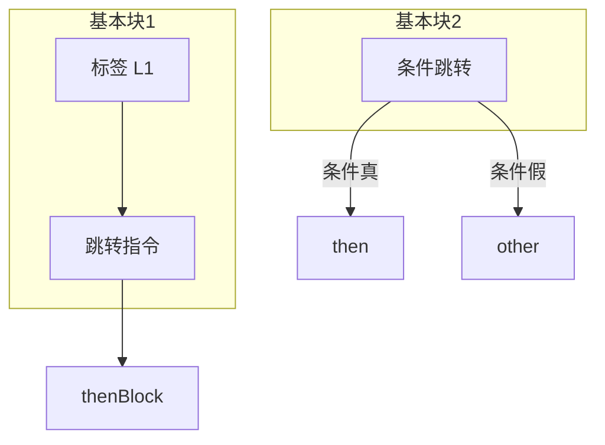
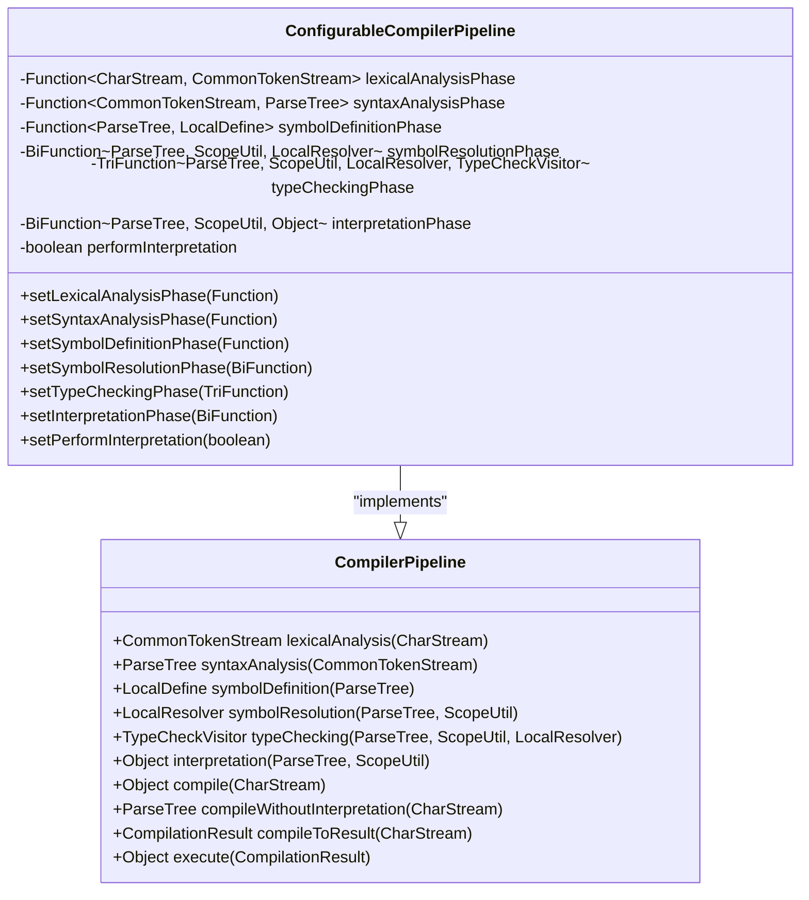
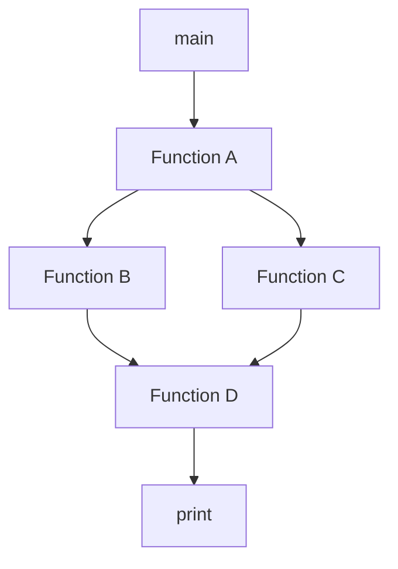

# Advanced Topics

<cite>
**Referenced Files in This Document**   
- [Compiler.java](file://ep21/src/main/java/org/teachfx/antlr4/ep21/Compiler.java)
- [register-allocation-design.md](file://ep20/docs/design/register-allocation-design.md)
- [ConfigurableCompilerPipeline.java](file://ep19/src/main/java/org/teachfx/antlr4/ep19/pipeline/ConfigurableCompilerPipeline.java)
- [CompilerPipeline.java](file://ep19/src/main/java/org/teachfx/antlr4/ep19/pipeline/CompilerPipeline.java)
- [CallGraphVisitor.java](file://ep17/src/main/java/org/teachfx/antlr4/ep17/visitor/CallGraphVisitor.java)
- [README.md](file://ep21/README.md)
</cite>

## Table of Contents
1. [JIT Compilation in EP21](#jit-compilation-in-ep21)
2. [Register Allocation Algorithms](#register-allocation-algorithms)
3. [Advanced Optimization Techniques](#advanced-optimization-techniques)
4. [Modular Compiler Pipeline Architecture](#modular-compiler-pipeline-architecture)
5. [Call Graph Construction and Interprocedural Analysis](#call-graph-construction-and-interprocedural-analysis)
6. [Language Extensions: Arrays and Structs](#language-extensions-arrays-and-structs)
7. [Implementation Challenges and Performance Impact](#implementation-challenges-and-performance-impact)

## JIT Compilation in EP21

EP21 extends the basic compiler architecture by introducing Just-In-Time (JIT) compilation capabilities that transform abstract syntax trees into optimized three-address code (TAC) for a register-based virtual machine. The compilation process follows a revised transformation pipeline that converts source code into an intermediate representation suitable for efficient execution.

The JIT compilation workflow begins with source code transformation into a revised abstract syntax tree (AST), which is then converted into three-address code. This TAC representation serves as input for low-level intermediate representation (LIR) generation, enabling efficient code generation for the target register machine. The transformation enables direct mapping of high-level constructs to optimized machine instructions, reducing interpretation overhead.

**Diagram sources**
- [README.md](file://ep21/README.md)

**Section sources**
- [Compiler.java](file://ep21/src/main/java/org/teachfx/antlr4/ep21/Compiler.java)
- [README.md](file://ep21/README.md)

## Register Allocation Algorithms

The compiler implements a graph-coloring register allocation algorithm to optimize virtual register usage and minimize memory access operations. This approach transforms the register allocation problem into a graph coloring problem where nodes represent virtual registers and edges represent conflicts between simultaneously live variables.

The algorithm follows a systematic process: first, liveness analysis identifies variables that are simultaneously live at each program point. Then, a conflict graph is constructed where conflicting variables cannot share the same physical register. The graph coloring algorithm attempts to assign colors (physical registers) to nodes (virtual registers) such that adjacent nodes receive different colors.

When the number of required registers exceeds available physical registers, the algorithm employs spill handling strategies. Variables with lower usage frequency or outside critical loops are selected for spilling to memory, generating appropriate load/store instructions to maintain correctness while optimizing register utilization.

**Diagram sources**
- [register-allocation-design.md](file://ep20/docs/design/register-allocation-design.md)

**Section sources**
- [register-allocation-design.md](file://ep20/docs/design/register-allocation-design.md)

## Advanced Optimization Techniques

Beyond basic flow analysis, the compiler implements sophisticated optimization techniques that operate on the intermediate representation. These optimizations include control flow analysis, liveness analysis, and data flow analysis, which collectively enable advanced transformations that improve code efficiency.

The optimization pipeline processes the intermediate representation through multiple phases, each targeting specific improvement opportunities. Control flow analysis constructs basic blocks and establishes the control flow graph (CFG), enabling optimizations that consider program structure. Liveness analysis determines variable lifetimes across basic blocks, providing critical information for register allocation and dead code elimination.

Data flow analysis techniques propagate information through the CFG to identify optimization opportunities such as constant propagation, copy propagation, and common subexpression elimination. These analyses operate on three-address code, transforming high-level expressions into optimized sequences of simple operations that can be efficiently mapped to target machine instructions.

**Diagram sources**
- [README.md](file://ep21/README.md)

**Section sources**
- [Compiler.java](file://ep21/src/main/java/org/teachfx/antlr4/ep21/Compiler.java)

## Modular Compiler Pipeline Architecture

The compiler features a modular pipeline architecture that enables configurable compilation workflows through the `ConfigurableCompilerPipeline` implementation. This design separates compilation phases into distinct, replaceable components, allowing customization of the compilation process without modifying core functionality.

The pipeline interface defines standard phases including lexical analysis, syntax analysis, symbol definition, symbol resolution, type checking, and interpretation. Each phase is implemented as a functional component that can be independently replaced or extended. The configurable implementation uses function references to delegate phase execution, enabling dynamic modification of the compilation workflow.

This architecture supports various compilation scenarios, from full compilation with execution to static analysis without interpretation. The pipeline can be configured to skip certain phases, add custom processing steps, or replace default implementations with optimized alternatives, providing flexibility for different use cases and optimization strategies.

**Diagram sources**
- [CompilerPipeline.java](file://ep19/src/main/java/org/teachfx/antlr4/ep19/pipeline/CompilerPipeline.java)
- [ConfigurableCompilerPipeline.java](file://ep19/src/main/java/org/teachfx/antlr4/ep19/pipeline/ConfigurableCompilerPipeline.java)

**Section sources**
- [CompilerPipeline.java](file://ep19/src/main/java/org/teachfx/antlr4/ep19/pipeline/CompilerPipeline.java)
- [ConfigurableCompilerPipeline.java](file://ep19/src/main/java/org/teachfx/antlr4/ep19/pipeline/ConfigurableCompilerPipeline.java)

## Call Graph Construction and Interprocedural Analysis

The compiler implements call graph construction to enable interprocedural analysis, which examines relationships and data flow between functions. The `CallGraphVisitor` traverses the abstract syntax tree to identify function declarations and calls, building a directed graph that represents the calling relationships within the program.

During traversal, the visitor maintains the current function context and records edges from the current function to any called functions. This information enables various interprocedural optimizations such as inlining, dead function elimination, and global data flow analysis. The call graph also serves as a foundation for more sophisticated analyses like points-to analysis and escape analysis.

Interprocedural analysis leverages the call graph to propagate information across function boundaries, enabling optimizations that consider the entire program structure rather than individual functions in isolation. This approach can identify opportunities for optimization that would be invisible to intra-procedural analysis alone.

**Diagram sources**
- [CallGraphVisitor.java](file://ep17/src/main/java/org/teachfx/antlr4/ep17/visitor/CallGraphVisitor.java)

**Section sources**
- [CallGraphVisitor.java](file://ep17/src/main/java/org/teachfx/antlr4/ep17/visitor/CallGraphVisitor.java)

## Language Extensions: Arrays and Structs

The compiler supports advanced language features including arrays and structs, which extend the basic type system with composite data types. Arrays provide indexed collections of homogeneous elements, while structs enable the definition of heterogeneous data structures with named fields.

These extensions require enhancements to the symbol table and type system to represent complex type information. The symbol table maintains information about array dimensions and element types, as well as struct member layouts and field types. Type checking algorithms are extended to handle array indexing operations and struct field access, ensuring type safety for these composite types.

Code generation for arrays involves calculating memory offsets based on index expressions and element sizes, while struct access requires computing offsets based on field positions within the structure layout. These operations are translated into appropriate pointer arithmetic and memory access instructions in the generated code.

**Section sources**
- [Compiler.java](file://ep21/src/main/java/org/teachfx/antlr4/ep21/Compiler.java)

## Implementation Challenges and Performance Impact

Implementing advanced compiler features presents several challenges that impact both compiler complexity and performance. Register allocation requires sophisticated graph algorithms that can be computationally expensive, potentially increasing compilation time. The trade-off between optimization quality and compilation speed must be carefully managed to maintain practical usability.

Memory management for complex data structures like arrays and structs introduces challenges in stack frame layout and variable lifetime analysis. The compiler must accurately track the scope and lifetime of composite objects to prevent memory leaks and ensure proper cleanup. Interprocedural analysis scales poorly with program size, requiring efficient data structures and algorithms to handle large codebases.

The modular pipeline architecture, while providing flexibility, adds indirection overhead that can impact compilation performance. Function calls between pipeline stages introduce runtime costs that must be balanced against the benefits of configurability. Careful implementation and optimization of the pipeline infrastructure are necessary to minimize this overhead.

Despite these challenges, the advanced features significantly improve generated code quality and execution performance. Register allocation reduces memory access overhead, while interprocedural optimizations eliminate redundant computations across function boundaries. The overall impact is a more efficient runtime execution at the cost of increased compilation complexity and time.

**Section sources**
- [register-allocation-design.md](file://ep20/docs/design/register-allocation-design.md)
- [ConfigurableCompilerPipeline.java](file://ep19/src/main/java/org/teachfx/antlr4/ep19/pipeline/ConfigurableCompilerPipeline.java)
- [CallGraphVisitor.java](file://ep17/src/main/java/org/teachfx/antlr4/ep17/visitor/CallGraphVisitor.java)