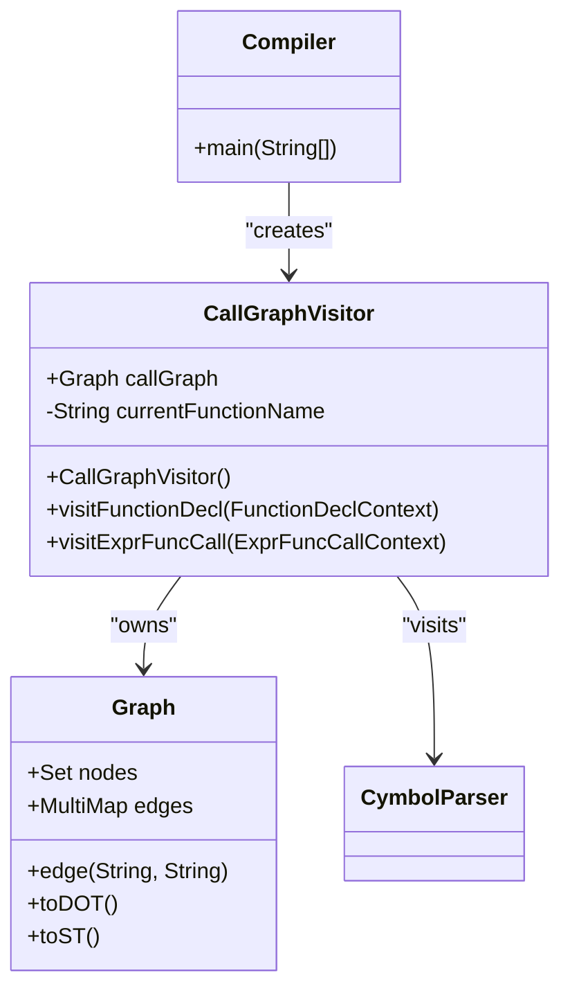
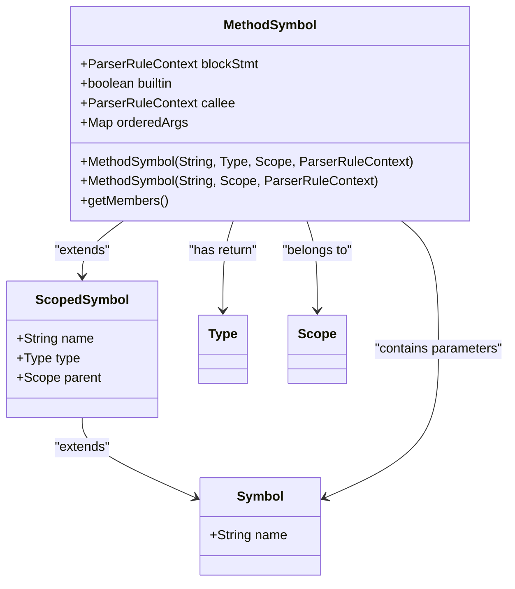
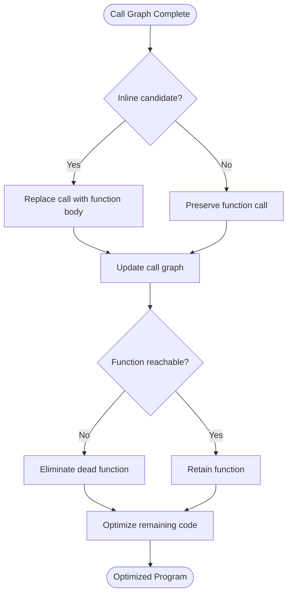
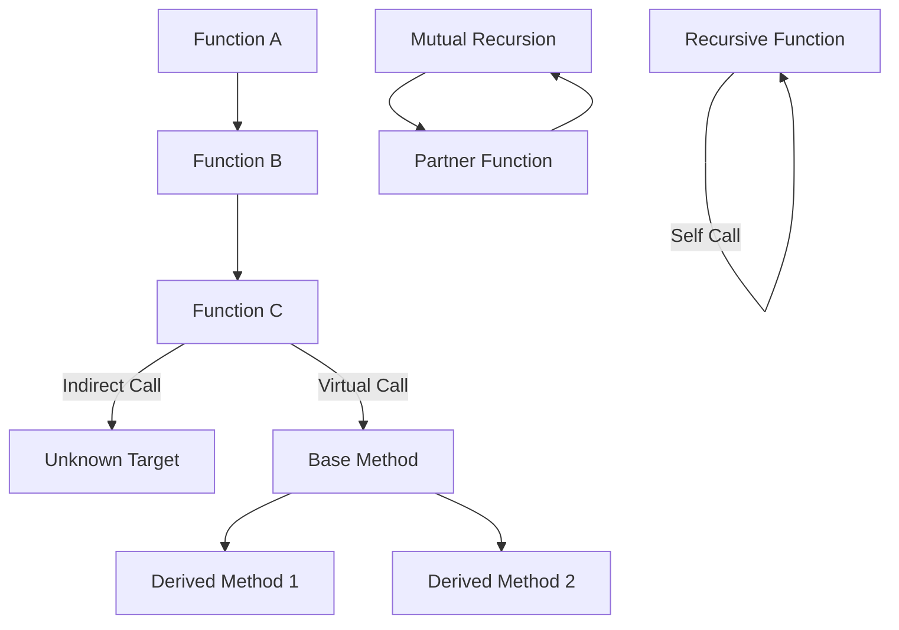
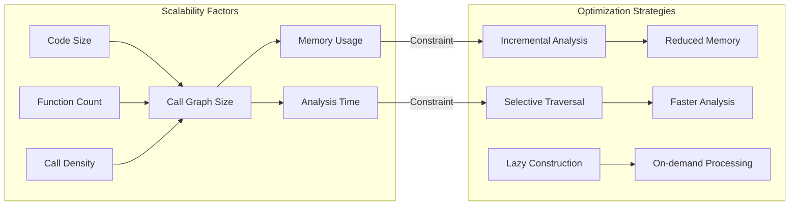

# Interprocedural Analysis

<cite>
**Referenced Files in This Document**   
- [CallGraphVisitor.java](file://ep17/src/main/java/org/teachfx/antlr4/ep17/visitor/CallGraphVisitor.java)
- [Graph.java](file://ep17/src/main/java/org/teachfx/antlr4/ep17/misc/Graph.java)
- [MethodSymbol.java](file://ep16/src/main/java/org/teachfx/antlr4/ep16/symtab/MethodSymbol.java)
- [Compiler.java](file://ep17/src/main/java/org/teachfx/antlr4/ep17/Compiler.java)
- [CymbolParser.java](file://ep17/src/main/java/org/teachfx/antlr4/ep17/parser/CymbolParser.java)
</cite>

## Table of Contents
1. [Introduction](#introduction)
2. [Call Graph Construction](#call-graph-construction)
3. [Method Symbol Integration](#method-symbol-integration)
4. [Optimization Applications](#optimization-applications)
5. [Challenges in Call Graph Analysis](#challenges-in-call-graph-analysis)
6. [Scalability Considerations](#scalability-considerations)
7. [Troubleshooting Guide](#troubleshooting-guide)
8. [Performance Optimization Techniques](#performance-optimization-techniques)

## Introduction
Interprocedural analysis is a critical component of modern compiler design, enabling comprehensive understanding of program behavior across function boundaries. This document details the implementation of call graph construction in the Cymbol compiler, focusing on the CallGraphVisitor class and its integration with MethodSymbol information. The analysis enables powerful optimizations by mapping function relationships and dependencies throughout the entire program.

## Call Graph Construction

The call graph construction process begins during AST traversal using the CallGraphVisitor implementation. This visitor systematically analyzes function declarations and calls to build a complete representation of interprocedural relationships. The Graph class serves as the underlying data structure, maintaining both nodes (functions) and edges (calls).

**Diagram sources**
- [CallGraphVisitor.java](file://ep17/src/main/java/org/teachfx/antlr4/ep17/visitor/CallGraphVisitor.java#L6-L35)
- [Graph.java](file://ep17/src/main/java/org/teachfx/antlr4/ep17/misc/Graph.java#L8-L77)
- [Compiler.java](file://ep17/src/main/java/org/teachfx/antlr4/ep17/Compiler.java#L1-L40)

**Section sources**
- [CallGraphVisitor.java](file://ep17/src/main/java/org/teachfx/antlr4/ep17/visitor/CallGraphVisitor.java#L6-L35)
- [Graph.java](file://ep17/src/main/java/org/teachfx/antlr4/ep17/misc/Graph.java#L8-L77)

## Method Symbol Integration

MethodSymbol plays a crucial role in interprocedural analysis by providing rich metadata about functions. The symbol contains essential information such as return types, parameter lists, and scope relationships. During call graph construction, MethodSymbol instances are used to validate function signatures and establish proper typing relationships between callers and callees.

**Diagram sources**
- [MethodSymbol.java](file://ep16/src/main/java/org/teachfx/antlr4/ep16/symtab/MethodSymbol.java#L7-L30)

**Section sources**
- [MethodSymbol.java](file://ep16/src/main/java/org/teachfx/antlr4/ep16/symtab/MethodSymbol.java#L7-L30)

## Optimization Applications

Call graph information enables several key compiler optimizations. The most significant applications include function inlining and dead function elimination. Inlining replaces function calls with the actual function body when beneficial, reducing call overhead and enabling further intra-procedural optimizations. Dead function elimination removes functions that are never called, reducing code size and compilation time.

**Diagram sources**
- [CallGraphVisitor.java](file://ep17/src/main/java/org/teachfx/antlr4/ep17/visitor/CallGraphVisitor.java#L6-L35)
- [MethodSymbol.java](file://ep16/src/main/java/org/teachfx/antlr4/ep16/symtab/MethodSymbol.java#L7-L30)

## Challenges in Call Graph Analysis

Call graph construction faces several challenges, particularly with indirect calls and recursion. Indirect calls through function pointers or virtual methods require sophisticated analysis to determine possible targets, often resulting in conservative approximations. Recursion introduces cycles in the call graph, requiring special handling to prevent infinite analysis loops and ensure termination.

**Diagram sources**
- [CallGraphVisitor.java](file://ep17/src/main/java/org/teachfx/antlr4/ep17/visitor/CallGraphVisitor.java#L6-L35)
- [CymbolParser.java](file://ep17/src/main/java/org/teachfx/antlr4/ep17/parser/CymbolParser.java#L0-L799)

## Scalability Considerations

For large codebases, call graph construction must balance accuracy with performance. The current implementation uses efficient data structures like OrderedHashSet and MultiMap to minimize memory overhead. However, as program size increases, the call graph can become prohibitively large, requiring incremental construction and selective analysis strategies to maintain reasonable compilation times.

**Diagram sources**
- [Graph.java](file://ep17/src/main/java/org/teachfx/antlr4/ep17/misc/Graph.java#L8-L77)
- [CallGraphVisitor.java](file://ep17/src/main/java/org/teachfx/antlr4/ep17/visitor/CallGraphVisitor.java#L6-L35)

## Troubleshooting Guide

Common issues in call graph analysis include missing function declarations, incorrect call edges, and incomplete symbol resolution. When troubleshooting, verify that all functions are properly declared in the symbol table and that the CallGraphVisitor correctly processes both declaration and call sites. Ensure that MethodSymbol instances are properly linked to their corresponding AST nodes and scopes.

**Section sources**
- [CallGraphVisitor.java](file://ep17/src/main/java/org/teachfx/antlr4/ep17/visitor/CallGraphVisitor.java#L6-L35)
- [MethodSymbol.java](file://ep16/src/main/java/org/teachfx/antlr4/ep16/symtab/MethodSymbol.java#L7-L30)

## Performance Optimization Techniques

To optimize call graph construction performance, consider implementing caching mechanisms for frequently accessed symbol information. Batch processing of function declarations can reduce overhead, while parallel traversal of independent compilation units can leverage multi-core processors. For very large programs, consider hierarchical call graph construction, analyzing modules separately before merging results.

**Section sources**
- [Graph.java](file://ep17/src/main/java/org/teachfx/antlr4/ep17/misc/Graph.java#L8-L77)
- [CallGraphVisitor.java](file://ep17/src/main/java/org/teachfx/antlr4/ep17/visitor/CallGraphVisitor.java#L6-L35)