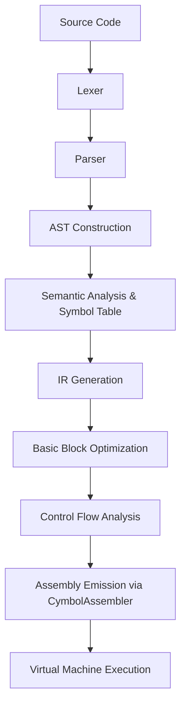
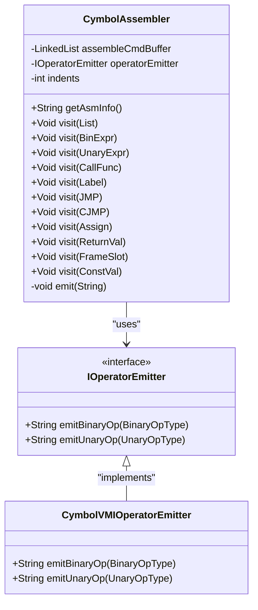
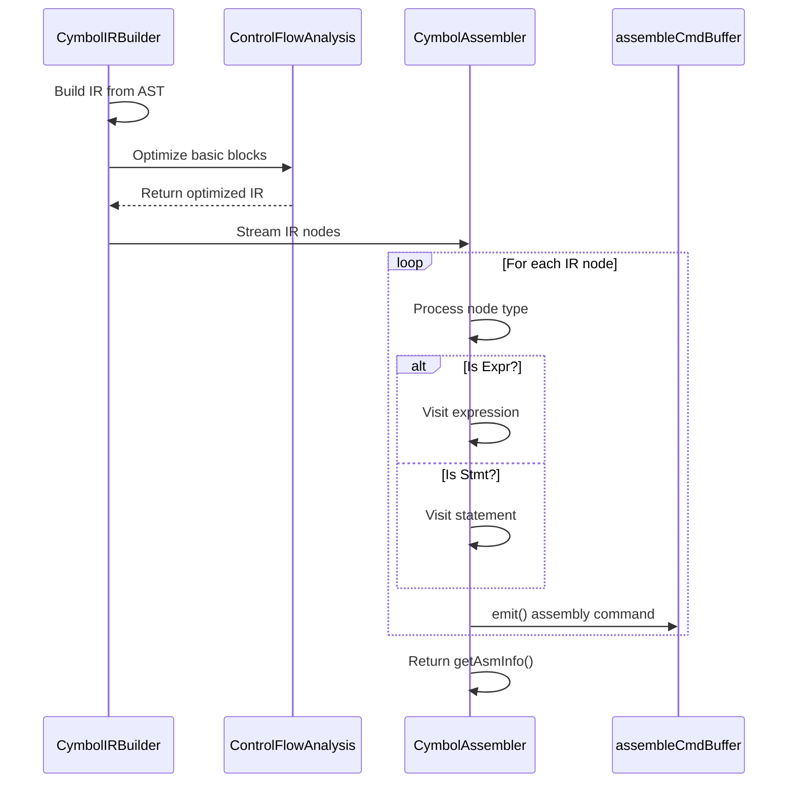
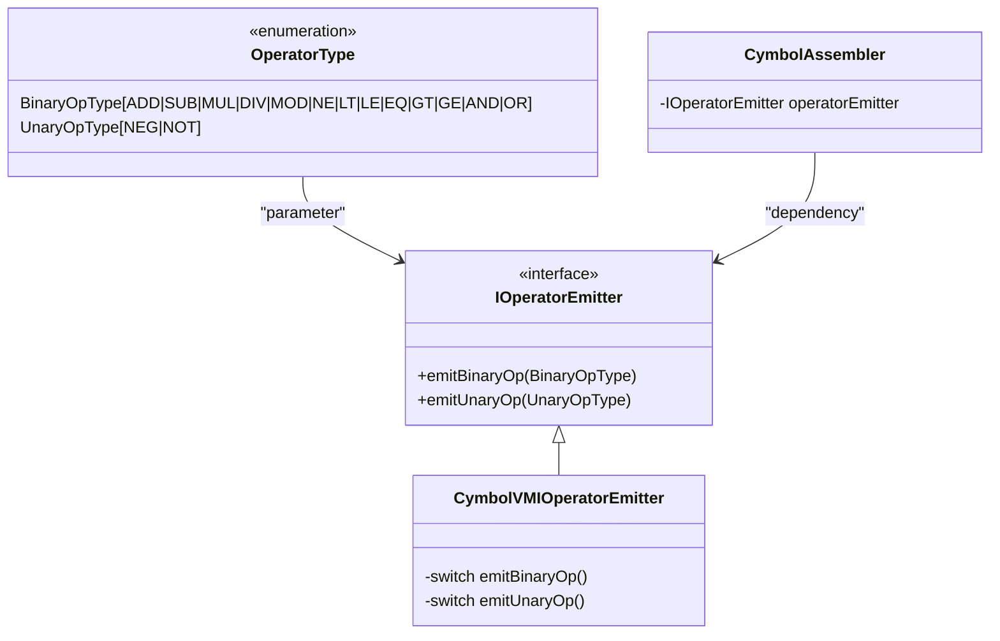
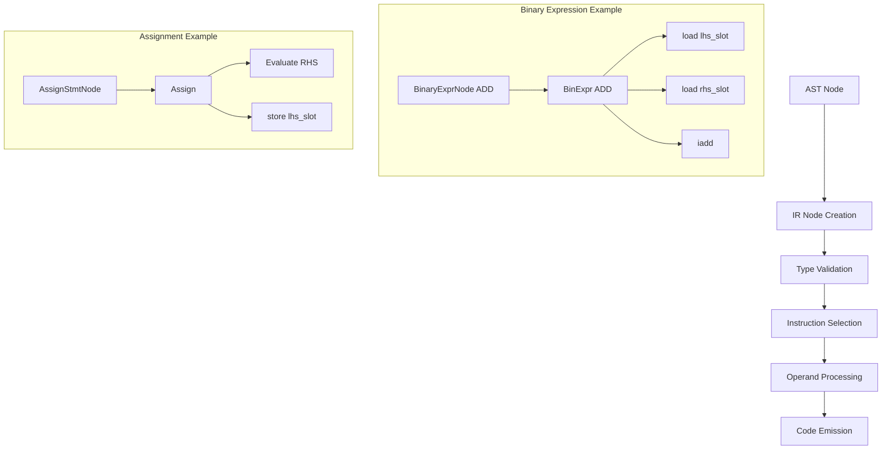

# JIT Compilation

<cite>
**Referenced Files in This Document**   
- [CymbolAssembler.java](file://ep21/src/main/java/org/teachfx/antlr4/ep21/pass/codegen/CymbolAssembler.java)
- [IOperatorEmitter.java](file://ep21/src/main/java/org/teachfx/antlr4/ep21/pass/codegen/IOperatorEmitter.java)
- [CymbolVMIOperatorEmitter.java](file://ep21/src/main/java/org/teachfx/antlr4/ep21/pass/codegen/CymbolVMIOperatorEmitter.java)
- [Compiler.java](file://ep21/src/main/java/org/teachfx/antlr4/ep21/Compiler.java)
- [BinExpr.java](file://ep21/src/main/java/org/teachfx/antlr4/ep21/ir/expr/arith/BinExpr.java)
- [Assign.java](file://ep21/src/main/java/org/teachfx/antlr4/ep21/ir/stmt/Assign.java)
- [ConstVal.java](file://ep21/src/main/java/org/teachfx/antlr4/ep21/ir/expr/val/ConstVal.java)
</cite>

## Table of Contents
1. [Introduction](#introduction)
2. [JIT Compilation Pipeline Overview](#jit-compilation-pipeline-overview)
3. [CymbolAssembler Integration](#cymbolassembler-integration)
4. [IR Generation and Assembly Emission](#ir-generation-and-assembly-emission)
5. [IOperatorEmitter Role in Instruction Selection](#ioperatoremitter-role-in-instruction-selection)
6. [AST to Instructions Translation](#ast-to-instructions-translation)
7. [Performance Implications](#performance-implications)
8. [Memory Management and Execution Efficiency](#memory-management-and-execution-efficiency)
9. [Troubleshooting JIT Issues](#troubleshooting-jit-issues)
10. [Conclusion](#conclusion)

## Introduction
This document details the Just-In-Time (JIT) compilation implementation in EP21, focusing on the integration of CymbolAssembler within the compilation pipeline. The system enables dynamic code generation by translating Abstract Syntax Tree (AST) nodes into executable instructions at runtime through an intermediate representation (IR) layer. The design emphasizes immediate assembly emission following IR construction, allowing for efficient execution without requiring ahead-of-time (AOT) compilation. This approach combines static analysis with runtime code generation to balance performance and flexibility in the Cymbol language execution environment.

## JIT Compilation Pipeline Overview
The JIT compilation process in EP21 follows a structured pipeline that transforms source code into executable virtual machine instructions. The pipeline begins with lexical and syntactic analysis using ANTLR-generated parsers, followed by AST construction. The AST undergoes semantic analysis and symbol table population before being converted to IR. The IR is optimized at the basic block level and then processed by the CymbolAssembler to generate stack-based virtual machine instructions. This immediate emission approach eliminates the need for intermediate object files, enabling true just-in-time execution. The pipeline's modular design allows for optimization passes between IR generation and assembly emission, providing opportunities for context-sensitive code improvements.

**Diagram sources**
- [Compiler.java](file://ep21/src/main/java/org/teachfx/antlr4/ep21/Compiler.java#L66-L94)
- [CymbolAssembler.java](file://ep21/src/main/java/org/teachfx/antlr4/ep21/pass/codegen/CymbolAssembler.java#L18-L154)

**Section sources**
- [Compiler.java](file://ep21/src/main/java/org/teachfx/antlr4/ep21/Compiler.java#L66-L94)

## CymbolAssembler Integration
The CymbolAssembler class serves as the critical bridge between IR generation and executable code emission in the JIT compilation pipeline. Implemented as an IRVisitor, it traverses the linearized IR instruction list and generates corresponding virtual machine assembly commands. The assembler maintains an internal command buffer that collects emitted instructions in sequence, preserving the execution order derived from the control flow graph. Its integration within the compilation pipeline occurs immediately after IR optimization, ensuring that the most efficient instruction sequence is translated to assembly. The assembler's design supports extensibility through the IOperatorEmitter interface, allowing different backends to be plugged in without modifying the core emission logic.

**Diagram sources**
- [CymbolAssembler.java](file://ep21/src/main/java/org/teachfx/antlr4/ep21/pass/codegen/CymbolAssembler.java#L18-L154)
- [IOperatorEmitter.java](file://ep21/src/main/java/org/teachfx/antlr4/ep21/pass/codegen/IOperatorEmitter.java#L4-L8)
- [CymbolVMIOperatorEmitter.java](file://ep21/src/main/java/org/teachfx/antlr4/ep21/pass/codegen/CymbolVMIOperatorEmitter.java#L4-L64)

**Section sources**
- [CymbolAssembler.java](file://ep21/src/main/java/org/teachfx/antlr4/ep21/pass/codegen/CymbolAssembler.java#L18-L154)

## IR Generation and Assembly Emission
The interaction between IR generation and immediate assembly emission represents a key aspect of the JIT compilation strategy in EP21. After the CymbolIRBuilder processes the AST and constructs the initial IR, the instructions are organized into basic blocks and optimized. The optimized IR nodes are then streamed directly to the CymbolAssembler for immediate translation to assembly code. This tight coupling eliminates intermediate storage requirements and enables context-aware emission decisions. Each IR node type implements the accept method to dispatch to the appropriate visitor method in CymbolAssembler, ensuring type-safe processing. The emission process maintains proper instruction ordering and handles control flow constructs like jumps and conditional branches through specialized IR statements.

**Diagram sources**
- [Compiler.java](file://ep21/src/main/java/org/teachfx/antlr4/ep21/Compiler.java#L66-L94)
- [CymbolAssembler.java](file://ep21/src/main/java/org/teachfx/antlr4/ep21/pass/codegen/CymbolAssembler.java#L18-L154)

**Section sources**
- [Compiler.java](file://ep21/src/main/java/org/teachfx/antlr4/ep21/Compiler.java#L66-L94)
- [CymbolAssembler.java](file://ep21/src/main/java/org/teachfx/antlr4/ep21/pass/codegen/CymbolAssembler.java#L18-L154)

## IOperatorEmitter Role in Dynamic Instruction Selection
The IOperatorEmitter interface plays a crucial role in enabling dynamic instruction selection and emission within the JIT compilation framework. By abstracting the mapping between high-level operator types and low-level virtual machine instructions, it provides a clean separation between IR processing and target-specific code generation. The CymbolVMIOperatorEmitter implementation contains the actual instruction mappings, translating binary and unary operator types to their corresponding stack machine opcodes. This design allows for multiple emitter implementations targeting different virtual machines or instruction sets without modifying the core assembler logic. The dynamic dispatch mechanism ensures that the appropriate instruction is selected at runtime based on the operator type, supporting extensibility and maintainability.

**Diagram sources**
- [IOperatorEmitter.java](file://ep21/src/main/java/org/teachfx/antlr4/ep21/pass/codegen/IOperatorEmitter.java#L4-L8)
- [CymbolVMIOperatorEmitter.java](file://ep21/src/main/java/org/teachfx/antlr4/ep21/pass/codegen/CymbolVMIOperatorEmitter.java#L4-L64)
- [CymbolAssembler.java](file://ep21/src/main/java/org/teachfx/antlr4/ep21/pass/codegen/CymbolAssembler.java#L18-L154)

**Section sources**
- [IOperatorEmitter.java](file://ep21/src/main/java/org/teachfx/antlr4/ep21/pass/codegen/IOperatorEmitter.java#L4-L8)
- [CymbolVMIOperatorEmitter.java](file://ep21/src/main/java/org/teachfx/antlr4/ep21/pass/codegen/CymbolVMIOperatorEmitter.java#L4-L64)

## AST to Instructions Translation
The translation of AST nodes to executable instructions at runtime follows a systematic process that preserves semantic meaning while optimizing for execution efficiency. When the CymbolIRBuilder visits AST nodes, it creates corresponding IR constructs that represent the computational operations. These IR nodes are then processed by the CymbolAssembler to generate specific virtual machine instructions. For example, a binary expression AST node results in a BinExpr IR node, which triggers the emission of operand loading instructions followed by the appropriate arithmetic opcode. Literal values are translated to immediate value instructions with proper type handling. Variable accesses are converted to load/store operations based on their frame slot allocation. This multi-stage translation ensures that complex AST structures are accurately represented in the linear instruction sequence.

**Diagram sources**
- [BinExpr.java](file://ep21/src/main/java/org/teachfx/antlr4/ep21/ir/expr/arith/BinExpr.java#L0-L59)
- [Assign.java](file://ep21/src/main/java/org/teachfx/antlr4/ep21/ir/stmt/Assign.java#L0-L65)
- [ConstVal.java](file://ep21/src/main/java/org/teachfx/antlr4/ep21/ir/expr/val/ConstVal.java#L0-L42)

**Section sources**
- [BinExpr.java](file://ep21/src/main/java/org/teachfx/antlr4/ep21/ir/expr/arith/BinExpr.java#L0-L59)
- [Assign.java](file://ep21/src/main/java/org/teachfx/antlr4/ep21/ir/stmt/Assign.java#L0-L65)
- [ConstVal.java](file://ep21/src/main/java/org/teachfx/antlr4/ep21/ir/expr/val/ConstVal.java#L0-L42)

## Performance Implications
The JIT compilation approach in EP21 presents specific performance implications and trade-offs compared to traditional AOT compilation. The immediate assembly emission strategy reduces startup time by eliminating separate compilation phases, enabling faster execution initiation. However, this comes at the cost of repeated compilation for frequently executed code paths unless caching mechanisms are implemented. The tight integration between IR generation and assembly emission minimizes memory overhead by avoiding intermediate representation storage. Runtime type checking and dynamic instruction selection introduce minimal overhead due to the optimized visitor pattern implementation. The stack-based virtual machine design favors code density over execution speed, trading some performance for simplicity and portability. Profile-guided optimizations could further enhance performance by identifying hot code paths for aggressive optimization.

**Section sources**
- [CymbolAssembler.java](file://ep21/src/main/java/org/teachfx/antlr4/ep21/pass/codegen/CymbolAssembler.java#L18-L154)
- [Compiler.java](file://ep21/src/main/java/org/teachfx/antlr4/ep21/Compiler.java#L66-L94)

## Memory Management and Execution Efficiency
Memory management in the JIT compilation system focuses on efficient buffer utilization and object lifecycle management. The CymbolAssembler uses a LinkedList to collect assembly commands, providing O(1) insertion at the end while maintaining insertion order. The indents field enables proper code formatting without additional string processing overhead. IR nodes are processed in a streaming fashion, minimizing memory footprint by avoiding complete IR tree retention. The use of visitor pattern with double dispatch ensures type-safe processing without reflection overhead. Execution efficiency is enhanced through direct method calls in the visitor implementation and minimal object creation during emission. The final assembly output is generated as a single string join operation, reducing string concatenation costs. Memory allocation for frame slots is determined during semantic analysis, enabling efficient stack management during execution.

**Section sources**
- [CymbolAssembler.java](file://ep21/src/main/java/org/teachfx/antlr4/ep21/pass/codegen/CymbolAssembler.java#L18-L154)
- [Compiler.java](file://ep21/src/main/java/org/teachfx/antlr4/ep21/Compiler.java#L66-L94)

## Troubleshooting JIT Issues
Common JIT-related issues in the EP21 implementation typically involve instruction emission errors and runtime type mismatches. Instruction emission problems may occur when unsupported operator types are encountered, resulting in null return values from the IOperatorEmitter. These can be diagnosed by verifying that all operator types in the OperatorType enumeration have corresponding cases in the CymbolVMIOperatorEmitter switch statements. Runtime type mismatches often stem from incorrect IR construction, where operand types don't match expected instruction requirements. Debugging such issues involves tracing the IR generation process from AST nodes to ensure proper type propagation. Assembly buffer corruption can occur if the indent management logic becomes inconsistent, which can be detected by examining the formatting of emitted instructions. Comprehensive logging in the Compiler class helps identify pipeline failures at various stages.

**Section sources**
- [CymbolAssembler.java](file://ep21/src/main/java/org/teachfx/antlr4/ep21/pass/codegen/CymbolAssembler.java#L18-L154)
- [CymbolVMIOperatorEmitter.java](file://ep21/src/main/java/org/teachfx/antlr4/ep21/pass/codegen/CymbolVMIOperatorEmitter.java#L4-L64)
- [Compiler.java](file://ep21/src/main/java/org/teachfx/antlr4/ep21/Compiler.java#L66-L94)

## Conclusion
The JIT compilation implementation in EP21 demonstrates an effective approach to dynamic code generation through the integration of CymbolAssembler within the compilation pipeline. By enabling immediate assembly emission following IR generation, the system achieves a balance between compilation speed and execution efficiency. The separation of concerns between IR processing and instruction selection through the IOperatorEmitter interface provides flexibility for future extensions. The translation of AST nodes to executable instructions follows a systematic process that preserves semantic integrity while optimizing for the target virtual machine. While the current implementation favors simplicity and correctness, opportunities exist for enhancing performance through instruction caching and profile-guided optimization. The comprehensive error handling and debugging support facilitate maintenance and troubleshooting of the JIT compilation system.