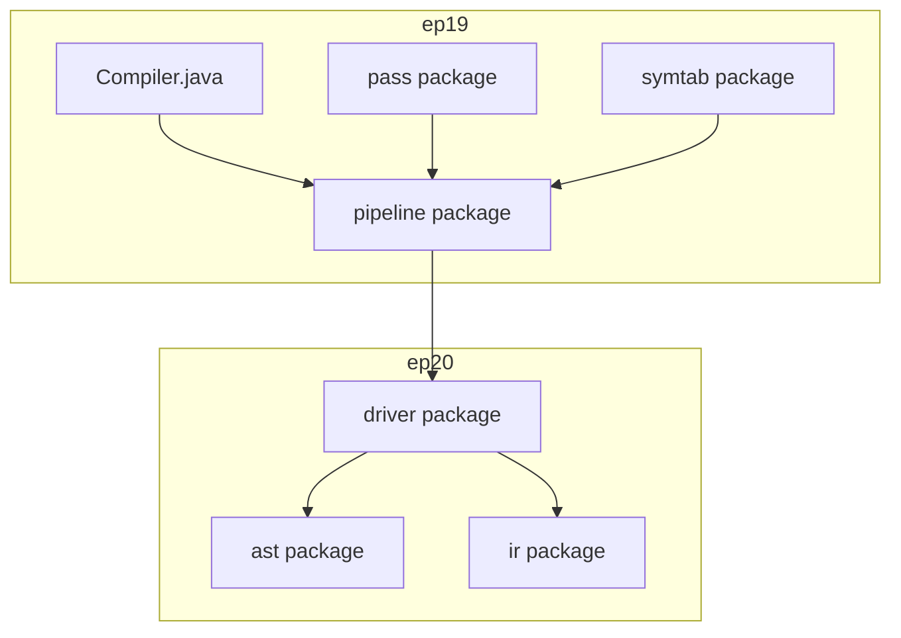
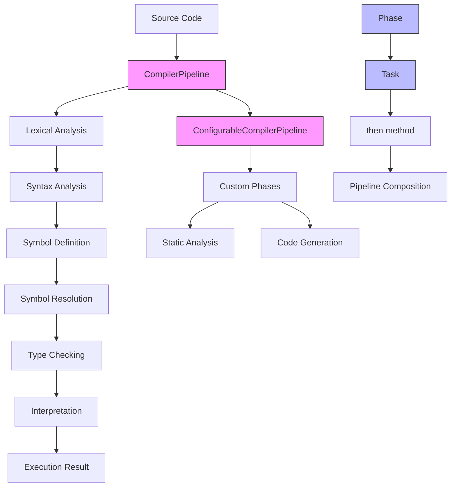
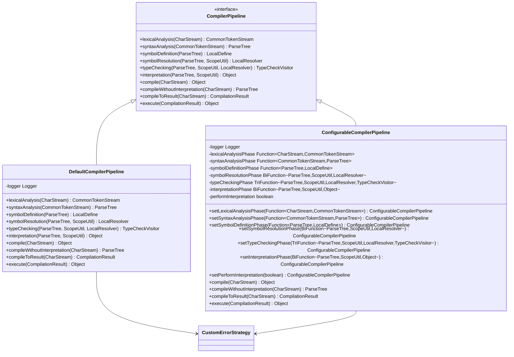
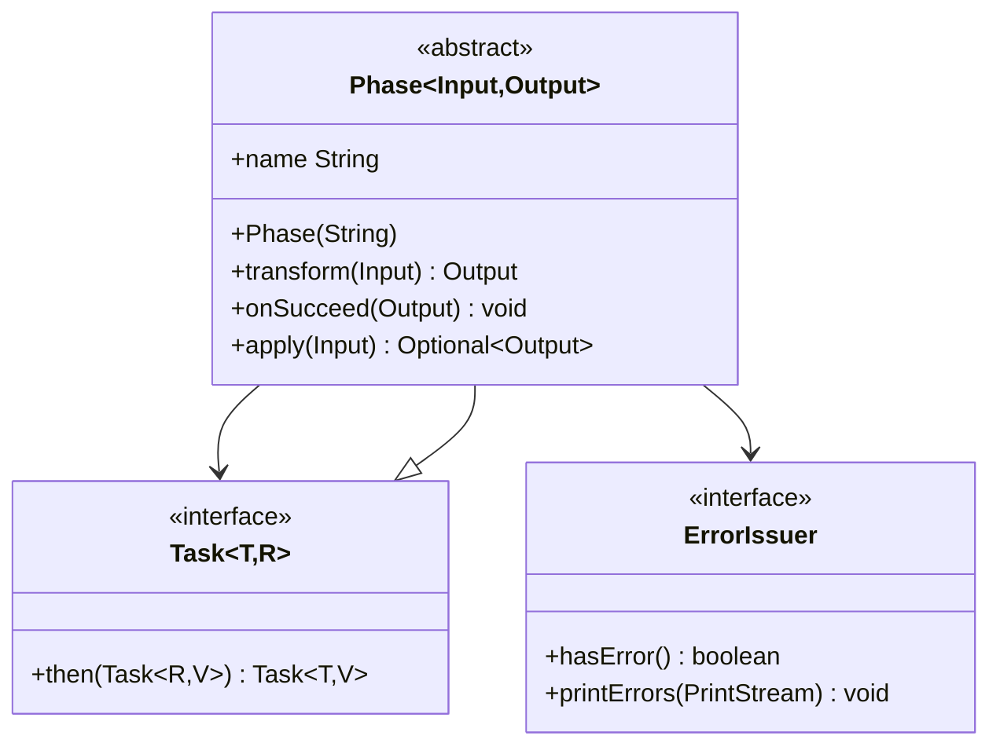
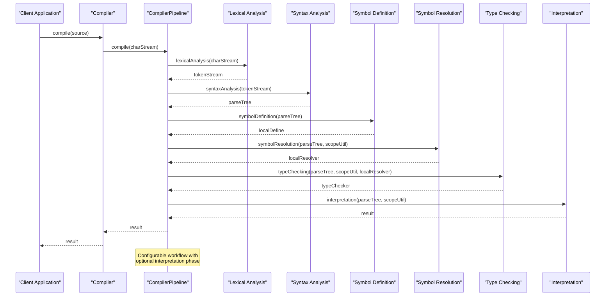
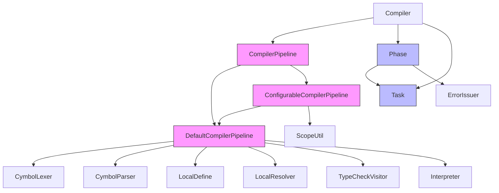

# Modular Compiler Pipeline

<cite>
**Referenced Files in This Document**   
- [CompilerPipeline.java](file://ep19/src/main/java/org/teachfx/antlr4/ep19/pipeline/CompilerPipeline.java)
- [DefaultCompilerPipeline.java](file://ep19/src/main/java/org/teachfx/antlr4/ep19/pipeline/DefaultCompilerPipeline.java)
- [ConfigurableCompilerPipeline.java](file://ep19/src/main/java/org/teachfx/antlr4/ep19/pipeline/ConfigurableCompilerPipeline.java)
- [Compiler.java](file://ep19/src/main/java/org/teachfx/antlr4/ep19/Compiler.java)
- [Phase.java](file://ep20/src/main/java/org/teachfx/antlr4/ep20/driver/Phase.java)
- [Task.java](file://ep20/src/main/java/org/teachfx/antlr4/ep20/driver/Task.java)
- [README.md](file://ep19/README.md)
</cite>

## Table of Contents
1. [Introduction](#introduction)
2. [Project Structure](#project-structure)
3. [Core Components](#core-components)
4. [Architecture Overview](#architecture-overview)
5. [Detailed Component Analysis](#detailed-component-analysis)
6. [Dependency Analysis](#dependency-analysis)
7. [Performance Considerations](#performance-considerations)
8. [Troubleshooting Guide](#troubleshooting-guide)
9. [Conclusion](#conclusion)

## Introduction
The Modular Compiler Pipeline architecture represents a significant evolution in compiler design, enabling configurable compilation workflows through flexible abstractions. This document details the implementation of the CompilerPipeline interface and its supporting components, which allow for customizable compilation stages, extensible phase definitions, and adaptable execution flows. The system has evolved from earlier implementations to support both default and configurable compilation workflows, providing a foundation for static analysis tools, incremental compilation, and specialized compilation scenarios.

## Project Structure
The modular compiler pipeline is organized within the ep19 and ep20 directories, with core pipeline components located in the `pipeline` package. The architecture follows a layered approach with clear separation between compilation phases, configuration mechanisms, and execution logic. The pipeline components are designed to work with the existing compiler infrastructure while providing enhanced configurability and extensibility.

**Diagram sources**
- [CompilerPipeline.java](file://ep19/src/main/java/org/teachfx/antlr4/ep19/pipeline/CompilerPipeline.java)
- [Compiler.java](file://ep19/src/main/java/org/teachfx/antlr4/ep19/Compiler.java)
- [Phase.java](file://ep20/src/main/java/org/teachfx/antlr4/ep20/driver/Phase.java)

**Section sources**
- [CompilerPipeline.java](file://ep19/src/main/java/org/teachfx/antlr4/ep19/pipeline/CompilerPipeline.java)
- [Compiler.java](file://ep19/src/main/java/org/teachfx/antlr4/ep19/Compiler.java)

## Core Components
The modular compiler pipeline is built around three core components: the CompilerPipeline interface, its DefaultCompilerPipeline implementation, and the ConfigurableCompilerPipeline extension. These components work together to provide a flexible foundation for compilation workflows. The Phase and Task abstractions from ep20 further enhance the pipeline's capabilities by introducing composable compilation stages.

**Section sources**
- [CompilerPipeline.java](file://ep19/src/main/java/org/teachfx/antlr4/ep19/pipeline/CompilerPipeline.java)
- [DefaultCompilerPipeline.java](file://ep19/src/main/java/org/teachfx/antlr4/ep19/pipeline/DefaultCompilerPipeline.java)
- [ConfigurableCompilerPipeline.java](file://ep19/src/main/java/org/teachfx/antlr4/ep19/pipeline/ConfigurableCompilerPipeline.java)

## Architecture Overview
The modular compiler pipeline architecture implements a configurable workflow system that orchestrates compilation stages through well-defined interfaces and abstractions. The design enables both standard compilation processes and customized workflows through dependency injection and functional programming patterns.

**Diagram sources**
- [CompilerPipeline.java](file://ep19/src/main/java/org/teachfx/antlr4/ep19/pipeline/CompilerPipeline.java)
- [ConfigurableCompilerPipeline.java](file://ep19/src/main/java/org/teachfx/antlr4/ep19/pipeline/ConfigurableCompilerPipeline.java)
- [Phase.java](file://ep20/src/main/java/org/teachfx/antlr4/ep20/driver/Phase.java)
- [Task.java](file://ep20/src/main/java/org/teachfx/antlr4/ep20/driver/Task.java)

## Detailed Component Analysis

### CompilerPipeline Interface
The CompilerPipeline interface defines the contract for compilation workflows, specifying methods for each compilation phase. This interface enables polymorphic behavior and dependency injection, allowing different pipeline implementations to be substituted based on requirements.

**Diagram sources**
- [CompilerPipeline.java](file://ep19/src/main/java/org/teachfx/antlr4/ep19/pipeline/CompilerPipeline.java)
- [DefaultCompilerPipeline.java](file://ep19/src/main/java/org/teachfx/antlr4/ep19/pipeline/DefaultCompilerPipeline.java)
- [ConfigurableCompilerPipeline.java](file://ep19/src/main/java/org/teachfx/antlr4/ep19/pipeline/ConfigurableCompilerPipeline.java)

**Section sources**
- [CompilerPipeline.java](file://ep19/src/main/java/org/teachfx/antlr4/ep19/pipeline/CompilerPipeline.java)
- [DefaultCompilerPipeline.java](file://ep19/src/main/java/org/teachfx/antlr4/ep19/pipeline/DefaultCompilerPipeline.java)
- [ConfigurableCompilerPipeline.java](file://ep19/src/main/java/org/teachfx/antlr4/ep19/pipeline/ConfigurableCompilerPipeline.java)

### Phase and Task Abstractions
The Phase and Task abstractions provide a functional programming foundation for composable compilation stages. These components enable pipeline composition through Kleisli composition, allowing phases to be chained together with proper error handling and result propagation.

**Diagram sources**
- [Phase.java](file://ep20/src/main/java/org/teachfx/antlr4/ep20/driver/Phase.java)
- [Task.java](file://ep20/src/main/java/org/teachfx/antlr4/ep20/driver/Task.java)

**Section sources**
- [Phase.java](file://ep20/src/main/java/org/teachfx/antlr4/ep20/driver/Phase.java)
- [Task.java](file://ep20/src/main/java/org/teachfx/antlr4/ep20/driver/Task.java)

### Pipeline Configuration and Execution
The compilation workflow is orchestrated through a sequence of phases that transform the source code through various representations. The pipeline supports both complete compilation and partial workflows for specialized use cases.

**Diagram sources**
- [CompilerPipeline.java](file://ep19/src/main/java/org/teachfx/antlr4/ep19/pipeline/CompilerPipeline.java)
- [Compiler.java](file://ep19/src/main/java/org/teachfx/antlr4/ep19/Compiler.java)

**Section sources**
- [CompilerPipeline.java](file://ep19/src/main/java/org/teachfx/antlr4/ep19/pipeline/CompilerPipeline.java)
- [Compiler.java](file://ep19/src/main/java/org/teachfx/antlr4/ep19/Compiler.java)

## Dependency Analysis
The modular compiler pipeline components have well-defined dependencies that enable loose coupling and high cohesion. The architecture uses dependency injection and interface-based design to minimize direct dependencies between components.

**Diagram sources**
- [CompilerPipeline.java](file://ep19/src/main/java/org/teachfx/antlr4/ep19/pipeline/CompilerPipeline.java)
- [DefaultCompilerPipeline.java](file://ep19/src/main/java/org/teachfx/antlr4/ep19/pipeline/DefaultCompilerPipeline.java)
- [ConfigurableCompilerPipeline.java](file://ep19/src/main/java/org/teachfx/antlr4/ep19/pipeline/ConfigurableCompilerPipeline.java)
- [Phase.java](file://ep20/src/main/java/org/teachfx/antlr4/ep20/driver/Phase.java)
- [Task.java](file://ep20/src/main/java/org/teachfx/antlr4/ep20/driver/Task.java)

**Section sources**
- [CompilerPipeline.java](file://ep19/src/main/java/org/teachfx/antlr4/ep19/pipeline/CompilerPipeline.java)
- [DefaultCompilerPipeline.java](file://ep19/src/main/java/org/teachfx/antlr4/ep19/pipeline/DefaultCompilerPipeline.java)
- [ConfigurableCompilerPipeline.java](file://ep19/src/main/java/org/teachfx/antlr4/ep19/pipeline/ConfigurableCompilerPipeline.java)
- [Phase.java](file://ep20/src/main/java/org/teachfx/antlr4/ep20/driver/Phase.java)
- [Task.java](file://ep20/src/main/java/org/teachfx/antlr4/ep20/driver/Task.java)

## Performance Considerations
The modular compiler pipeline introduces some overhead due to its configurable nature and functional composition patterns. However, this overhead is generally minimal compared to the computational cost of compilation phases themselves. The pipeline design allows for optimization opportunities through phase elimination, caching, and parallel execution of independent phases.

The ConfigurableCompilerPipeline implementation uses functional interfaces that may introduce slight performance penalties compared to direct method calls, but this is offset by the flexibility it provides. For performance-critical applications, the DefaultCompilerPipeline can be used directly to minimize indirection.

The Task interface's use of Optional for error handling provides clean error propagation but may create additional object allocations. However, this is generally acceptable given that compilation is typically not on a critical performance path for most applications.

## Troubleshooting Guide
When working with the modular compiler pipeline, several common issues may arise:

1. **Configuration Errors**: When using ConfigurableCompilerPipeline, ensure all phase functions are properly set before compilation begins.

2. **State Consistency**: Maintain consistency between compilation phases by ensuring that each phase receives the correct input state from the previous phase.

3. **Error Handling**: The pipeline uses Optional to represent failed phases. Always check for empty results when chaining phases.

4. **Phase Order**: Ensure compilation phases are executed in the correct order: lexical analysis → syntax analysis → symbol definition → symbol resolution → type checking → interpretation.

5. **Resource Management**: The pipeline does not automatically manage resources like file handles. Ensure proper resource cleanup in client code.

**Section sources**
- [CompilerPipeline.java](file://ep19/src/main/java/org/teachfx/antlr4/ep19/pipeline/CompilerPipeline.java)
- [ConfigurableCompilerPipeline.java](file://ep19/src/main/java/org/teachfx/antlr4/ep19/pipeline/ConfigurableCompilerPipeline.java)
- [Phase.java](file://ep20/src/main/java/org/teachfx/antlr4/ep20/driver/Phase.java)

## Conclusion
The modular compiler pipeline architecture provides a flexible and extensible foundation for compilation workflows. By separating the pipeline interface from its implementations, the design enables both standard compilation processes and customized workflows. The introduction of Phase and Task abstractions enhances composability and error handling, while the ConfigurableCompilerPipeline allows for dynamic configuration of compilation stages.

This architecture supports various use cases, from complete compilation and execution to static analysis and incremental compilation. The modular design facilitates testing by allowing individual phases to be tested in isolation, and enables extensibility by providing clear extension points for custom compilation passes.

The pipeline's evolution from earlier implementations demonstrates a progression toward more flexible and configurable compilation systems, balancing performance considerations with architectural benefits. Future enhancements could include parallel phase execution, advanced caching mechanisms, and integration with external analysis tools.