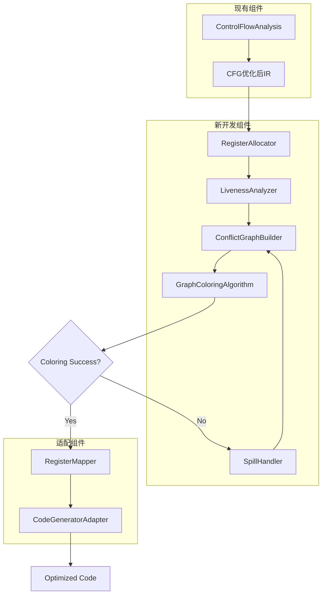
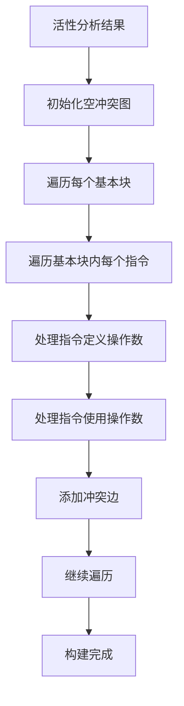
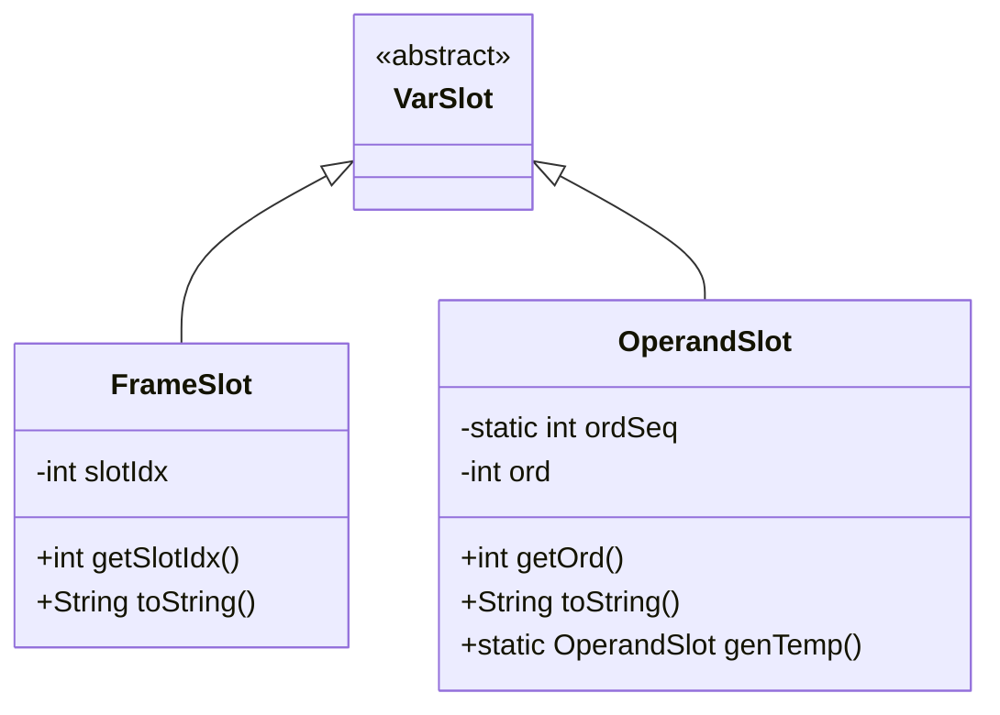
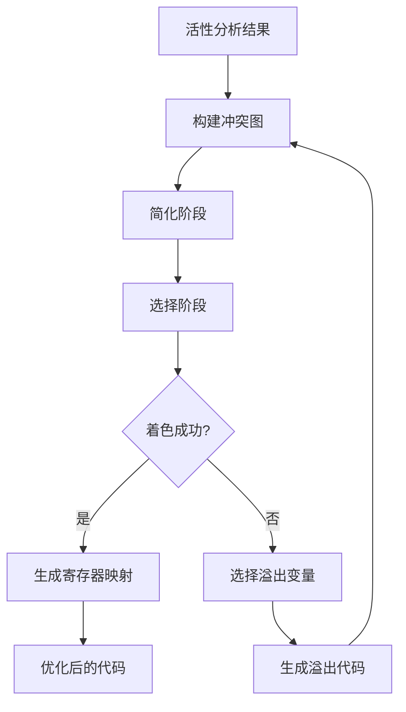

# Register Allocation

<cite>
**Referenced Files in This Document**   
- [register-allocation-design.md](file://ep20/docs/design/register-allocation-design.md)
- [register-allocation-algorithm-details.md](file://ep20/docs/design/register-allocation-algorithm-details.md)
- [register-allocation-api-design.md](file://ep20/docs/design/register-allocation-api-design.md)
- [LivenessAnalysis.java](file://ep20/src/main/java/org/teachfx/antlr4/ep20/pass/cfg/LivenessAnalysis.java)
- [FrameSlot.java](file://ep20/src/main/java/org/teachfx/antlr4/ep20/ir/expr/addr/FrameSlot.java)
- [OperandSlot.java](file://ep20/src/main/java/org/teachfx/antlr4/ep20/ir/expr/addr/OperandSlot.java)
</cite>

## Table of Contents
1. [Introduction](#introduction)
2. [Design Philosophy and Architecture](#design-philosophy-and-architecture)
3. [Liveness Analysis Algorithm](#liveness-analysis-algorithm)
4. [FrameSlot and OperandSlot Mechanisms](#frameslot-and-operandslot-mechanisms)
5. [Variable Usage Tracking Across Basic Blocks](#variable-usage-tracking-across-basic-blocks)
6. [Challenges in Stack-Based VM Context](#challenges-in-stack-based-vm-context)
7. [Register Spilling and Interference Graph](#register-spilling-and-interference-graph)
8. [Performance Considerations and Optimization](#performance-considerations-and-optimization)
9. [Conclusion](#conclusion)

## Introduction

This document provides a comprehensive analysis of the register allocation algorithms implemented in the EP20 Cymbol compiler. The register allocation system is designed to optimize code execution efficiency by mapping virtual registers to physical registers, thereby reducing memory access operations. The implementation follows a graph-coloring approach, which is a well-established technique in compiler optimization. The design is documented in detail in the register-allocation-design.md file, which outlines the technical requirements, system architecture, and implementation plan. The algorithm leverages liveness analysis to determine variable lifetimes and employs FrameSlot and OperandSlot mechanisms for virtual register management. This document explains how these design decisions translate into actual implementation and addresses the challenges of implementing register allocation in a stack-based VM context.

**Section sources**
- [register-allocation-design.md](file://ep20/docs/design/register-allocation-design.md#L1-L245)

## Design Philosophy and Architecture

The register allocation system in the EP20 compiler follows a modular architecture that integrates seamlessly with the existing compilation pipeline. The design philosophy emphasizes compatibility with the current architecture while introducing advanced optimization capabilities. The system is built around a graph-coloring algorithm that operates on a conflict graph constructed from liveness analysis results. The architecture consists of several key components: the RegisterAllocator as the main entry point, LivenessAnalyzer for determining variable lifetimes, ConflictGraphBuilder for constructing the interference graph, GraphColoringAlgorithm for assigning registers, SpillHandler for managing register overflow, and RegisterMapper for maintaining the virtual-to-physical register mapping. This component-based design ensures separation of concerns and facilitates testing and maintenance. The integration with the existing compilation flow is carefully designed to minimize disruption while maximizing optimization benefits.

**Diagram sources**
- [register-allocation-design.md](file://ep20/docs/design/register-allocation-design.md#L100-L150)

**Section sources**
- [register-allocation-design.md](file://ep20/docs/design/register-allocation-design.md#L1-L245)

## Liveness Analysis Algorithm

The liveness analysis algorithm is a fundamental component of the register allocation system, responsible for determining the lifetime of variables throughout the program. This analysis identifies when variables are "live" (will be used in the future) and when they are "dead" (will not be used again), which is crucial for constructing the interference graph. The implementation extends the existing liveness analysis to support register variables and provides cross-basic block analysis capabilities. The algorithm operates by traversing the control flow graph in reverse order, propagating liveness information from successor blocks to predecessor blocks. For each basic block, it calculates the live-in and live-out sets, which represent the variables that are live at the entry and exit of the block, respectively. The analysis handles various IR node types, including binary expressions, unary expressions, assignments, and control flow statements, tracking both uses and definitions of operands.

**Diagram sources**
- [register-allocation-algorithm-details.md](file://ep20/docs/design/register-allocation-algorithm-details.md#L50-L70)

**Section sources**
- [LivenessAnalysis.java](file://ep20/src/main/java/org/teachfx/antlr4/ep20/pass/cfg/LivenessAnalysis.java#L16-L146)

## FrameSlot and OperandSlot Mechanisms

The FrameSlot and OperandSlot mechanisms are central to the virtual register management system in the EP20 compiler. These classes represent different types of operand locations in the intermediate representation (IR) and play crucial roles in the register allocation process. The FrameSlot class represents a variable's location on the stack frame, with each instance corresponding to a specific slot index. It is used for variables that are allocated on the stack rather than in registers. The OperandSlot class, on the other hand, represents a temporary operand or virtual register that can potentially be allocated to a physical register. It maintains a sequence number (ord) to uniquely identify each temporary, which is essential for tracking variable usage and constructing the interference graph. These mechanisms enable the compiler to distinguish between stack-allocated and register-allocated variables, facilitating the register allocation process.

**Diagram sources**
- [FrameSlot.java](file://ep20/src/main/java/org/teachfx/antlr4/ep20/ir/expr/addr/FrameSlot.java#L6-L30)
- [OperandSlot.java](file://ep20/src/main/java/org/teachfx/antlr4/ep20/ir/expr/addr/OperandSlot.java#L6-L38)

**Section sources**
- [FrameSlot.java](file://ep20/src/main/java/org/teachfx/antlr4/ep20/ir/expr/addr/FrameSlot.java#L6-L30)
- [OperandSlot.java](file://ep20/src/main/java/org/teachfx/antlr4/ep20/ir/expr/addr/OperandSlot.java#L6-L38)

## Variable Usage Tracking Across Basic Blocks

The compiler tracks variable usage across basic blocks through a sophisticated liveness analysis that operates on the control flow graph (CFG). This tracking is essential for accurate register allocation, as it determines when variables are live and potentially interfere with each other. The analysis processes each basic block in reverse order, starting from the last instruction and working backward to the first. For each instruction, it identifies the operands that are used (read) and defined (written), updating the current liveness set accordingly. When processing a definition, the algorithm adds conflict edges between the defined operand and all currently live operands, as they cannot share the same register. The analysis also handles control flow by propagating liveness information between basic blocks: the live-out set of a block is the union of the live-in sets of its successors, and the live-in set is calculated as the union of uses within the block and the live-out set minus the definitions within the block.

**Section sources**
- [register-allocation-algorithm-details.md](file://ep20/docs/design/register-allocation-algorithm-details.md#L200-L300)
- [LivenessAnalysis.java](file://ep20/src/main/java/org/teachfx/antlr4/ep20/pass/cfg/LivenessAnalysis.java#L16-L146)

## Challenges in Stack-Based VM Context

Implementing register allocation in a stack-based VM context presents several unique challenges that differ from traditional register-based architectures. The primary challenge is the fundamental mismatch between the stack-based execution model and the register-based optimization approach. In a stack-based VM, operations typically consume and produce values on an operand stack, whereas register allocation assumes direct access to named registers. This requires careful adaptation of the code generation phase to handle both register-resident values and stack-based operations. Another challenge is the management of temporary values, which are naturally handled by the operand stack in a stack-based VM but need to be explicitly managed when using registers. The compiler must also handle the calling convention, as parameters and return values are typically passed on the stack in a stack-based VM, requiring special handling in the register allocation process. Additionally, the presence of stack manipulation instructions (like dup, swap, pop) complicates the liveness analysis and interference graph construction.

**Section sources**
- [register-allocation-design.md](file://ep20/docs/design/register-allocation-design.md#L1-L245)
- [register-allocation-algorithm-details.md](file://ep20/docs/design/register-allocation-algorithm-details.md#L1-L422)

## Register Spilling and Interference Graph

Register spilling and interference graph construction are critical components of the register allocation process, addressing the limitations of physical register availability. The interference graph, also known as the conflict graph, is a data structure that represents conflicts between virtual registers: an edge between two nodes indicates that the corresponding variables cannot be assigned to the same physical register because they are simultaneously live at some point in the program. The graph is constructed based on the results of liveness analysis, with nodes representing virtual registers (OperandSlot instances) and edges representing conflicts. When the graph coloring algorithm fails to find a valid coloring with the available number of physical registers, register spilling is employed. This process involves selecting one or more variables to be "spilled" to memory (typically the stack frame) rather than kept in registers. The selection of spill candidates is based on a cost-benefit analysis that considers factors such as usage frequency, live range length, and loop nesting depth.

**Diagram sources**
- [register-allocation-algorithm-details.md](file://ep20/docs/design/register-allocation-algorithm-details.md#L200-L300)

**Section sources**
- [register-allocation-algorithm-details.md](file://ep20/docs/design/register-allocation-algorithm-details.md#L200-L422)

## Performance Considerations and Optimization

The register allocation system incorporates several performance considerations and optimization strategies to ensure efficient register utilization while maintaining reasonable compilation times. The algorithm complexity is carefully managed through various optimization techniques, including degree estimation to avoid expensive exact degree calculations for high-degree nodes, and incremental graph updates to minimize the cost of modifying the interference graph during spill handling. The system employs heuristic strategies for both node selection (choosing which virtual register to process next) and color selection (choosing which physical register to assign), with options for degree-based node selection and least-used color selection. Performance monitoring is integrated into the system, with metrics collected for graph building time, coloring time, spill count, and memory access reduction. Configuration parameters allow tuning of the algorithm behavior, such as the maximum number of spill iterations and spill cost thresholds. The implementation also includes memory management optimizations, such as object pooling to reduce garbage collection pressure and sparse matrix representations for large conflict graphs.

**Section sources**
- [register-allocation-algorithm-details.md](file://ep20/docs/design/register-allocation-algorithm-details.md#L300-L422)
- [register-allocation-api-design.md](file://ep20/docs/design/register-allocation-api-design.md#L200-L256)

## Conclusion

The register allocation system in the EP20 Cymbol compiler represents a sophisticated optimization that significantly enhances code execution efficiency by reducing memory access operations. Through the implementation of a graph-coloring algorithm based on liveness analysis, the system effectively maps virtual registers to physical registers while handling the complexities of a stack-based VM context. The design leverages FrameSlot and OperandSlot mechanisms for virtual register management and employs advanced techniques for interference graph construction and register spilling. The modular architecture ensures compatibility with the existing compilation pipeline while providing a solid foundation for future enhancements. Performance considerations are addressed through various optimization strategies, ensuring that the benefits of register allocation are achieved without excessive compilation overhead. This comprehensive approach to register allocation demonstrates the compiler's maturity and its capability to generate highly optimized code for the target VM.