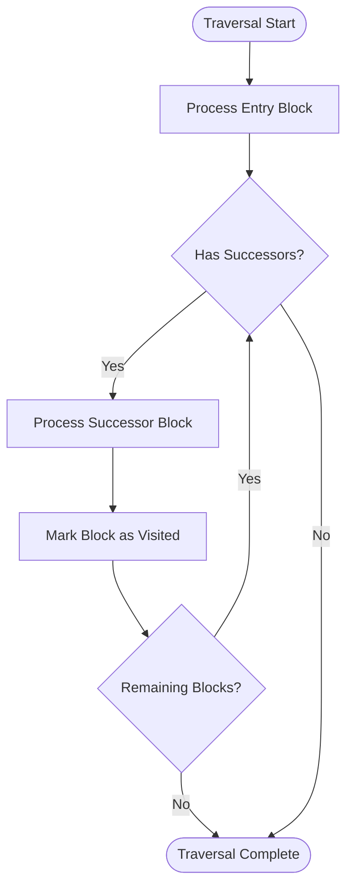
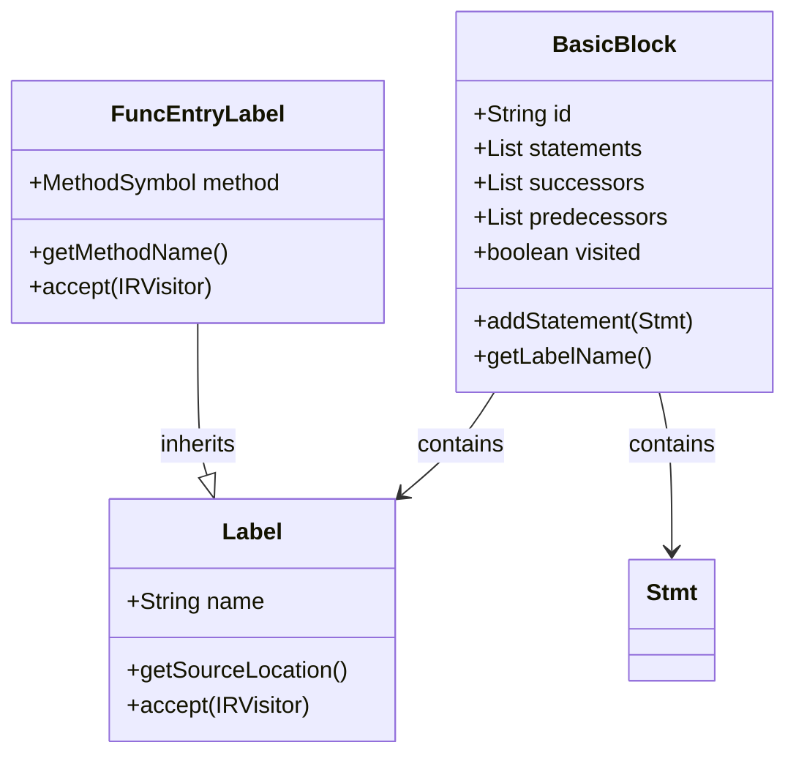
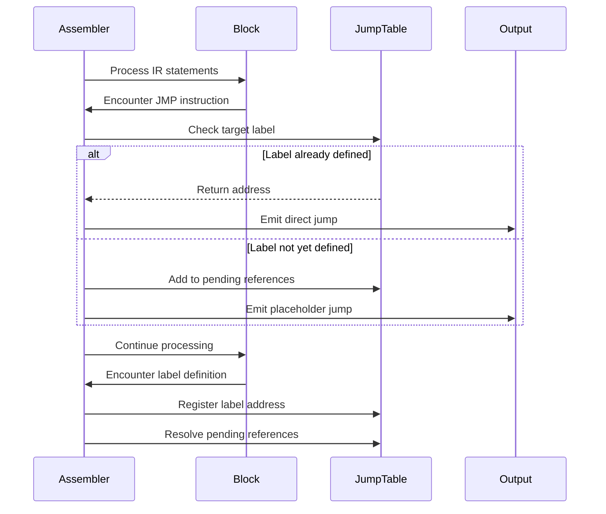
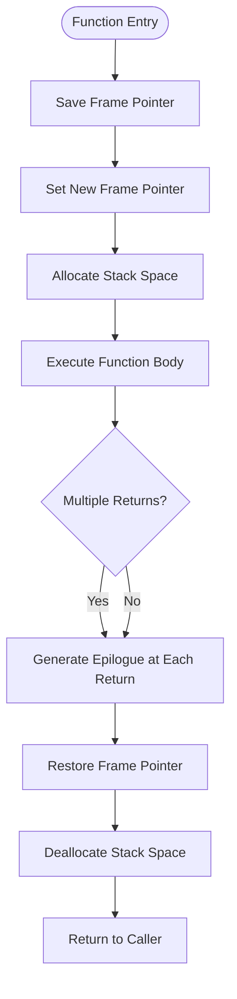
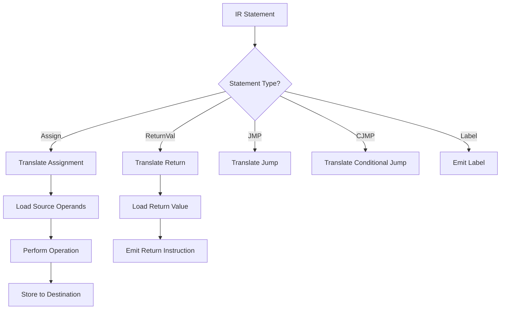
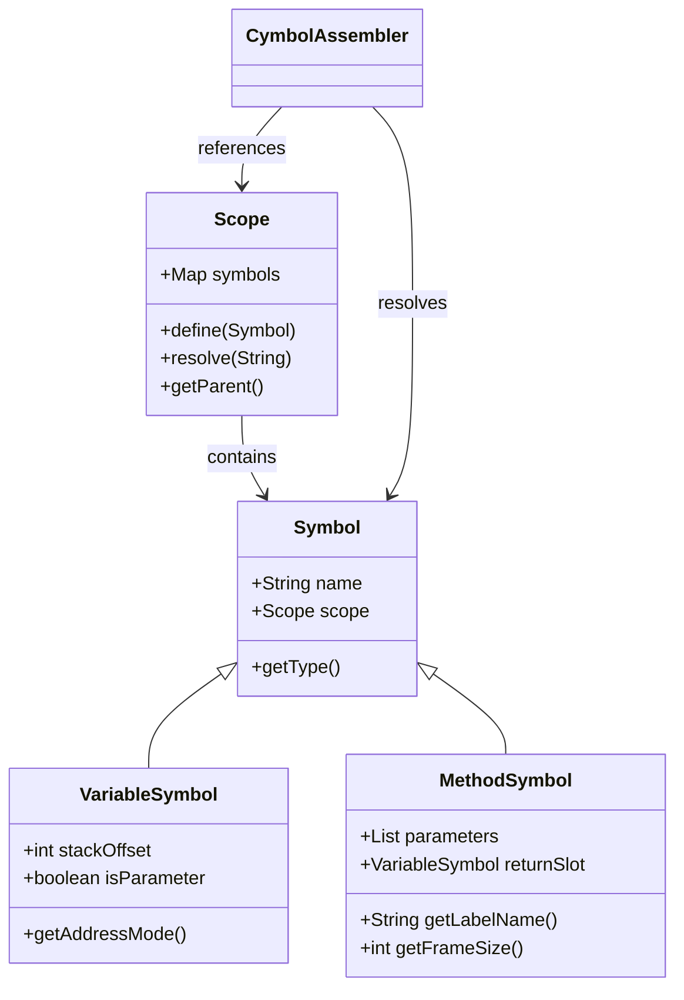
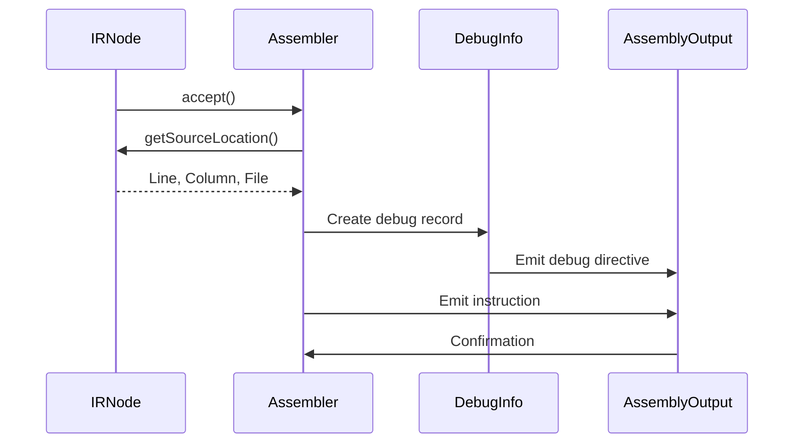

# Assembly Translation

<cite>
**Referenced Files in This Document**   
- [CymbolAssembler.java](file://ep20/src/main/java/org/teachfx/antlr4/ep20/pass/codegen/CymbolAssembler.java)
- [BasicBlock.java](file://ep20/src/main/java/org/teachfx/antlr4/ep20/pass/cfg/BasicBlock.java)
- [CFG.java](file://ep20/src/main/java/org/teachfx/antlr4/ep20/pass/cfg/CFG.java)
- [Label.java](file://ep20/src/main/java/org/teachfx/antlr4/ep20/ir/stmt/Label.java)
- [JMP.java](file://ep20/src/main/java/org/teachfx/antlr4/ep20/ir/stmt/JMP.java)
- [Assign.java](file://ep20/src/main/java/org/teachfx/antlr4/ep20/ir/stmt/Assign.java)
- [ReturnVal.java](file://ep20/src/main/java/org/teachfx/antlr4/ep20/ir/stmt/ReturnVal.java)
- [FuncEntryLabel.java](file://ep20/src/main/java/org/teachfx/antlr4/ep20/ir/stmt/FuncEntryLabel.java)
- [MethodSymbol.java](file://ep20/src/main/java/org/teachfx/antlr4/ep20/symtab/symbol/MethodSymbol.java)
- [VariableSymbol.java](file://ep20/src/main/java/org/teachfx/antlr4/ep20/symtab/symbol/VariableSymbol.java)
</cite>

## Table of Contents
1. [Introduction](#introduction)
2. [Control Flow Graph Traversal](#control-flow-graph-traversal)
3. [Basic Block and Label Handling](#basic-block-and-label-handling)
4. [Jump Resolution Mechanism](#jump-resolution-mechanism)
5. [Function Prologue and Epilogue Generation](#function-prologue-and-epilogue-generation)
6. [IR Statement Translation](#ir-statement-translation)
7. [Symbol Resolution Process](#symbol-resolution-process)
8. [Debug Information Preservation](#debug-information-preservation)
9. [Conclusion](#conclusion)

## Introduction
This document details the assembly translation process implemented in the CymbolAssembler component of the Cymbol compiler framework. The translation pipeline converts optimized intermediate representation (IR) code into target assembly instructions by traversing control flow graphs, resolving symbols, and generating appropriate prologues and epilogues. The process maintains debug information and source location tracking throughout compilation.

**Section sources**
- [CymbolAssembler.java](file://ep20/src/main/java/org/teachfx/antlr4/ep20/pass/codegen/CymbolAssembler.java#L1-L50)

## Control Flow Graph Traversal
The CymbolAssembler traverses the optimized control flow graph (CFG) in a structured manner to ensure correct instruction ordering and control flow preservation. The traversal begins at the entry block of each function and proceeds through successor blocks using depth-first search with backtracking for join points. Each basic block is processed exactly once, maintaining a visited set to prevent reprocessing.

The CFG structure, defined in CFG.java, organizes IR statements into BasicBlock units that represent linear sequences of code with single entry and exit points. During traversal, the assembler processes each block's IR statements sequentially while managing control flow transitions between blocks.

**Diagram sources**
- [CFG.java](file://ep20/src/main/java/org/teachfx/antlr4/ep20/pass/cfg/CFG.java#L15-L40)
- [BasicBlock.java](file://ep20/src/main/java/org/teachfx/antlr4/ep20/pass/cfg/BasicBlock.java#L20-L35)

**Section sources**
- [CymbolAssembler.java](file://ep20/src/main/java/org/teachfx/antlr4/ep20/pass/codegen/CymbolAssembler.java#L75-L120)
- [CFG.java](file://ep20/src/main/java/org/teachfx/antlr4/ep20/pass/cfg/CFG.java#L10-L50)

## Basic Block and Label Handling
Basic blocks are fundamental units in the control flow graph, each containing a sequence of IR statements terminated by control flow instructions. The CymbolAssembler processes each basic block by emitting a label before its first instruction, using the block's identifier as the label name. Labels are generated from Label.java and FuncEntryLabel.java IR nodes, which mark jump targets and function entry points respectively.

The assembler maintains a label map that associates block identifiers with their corresponding assembly labels, enabling forward references during jump resolution. Entry labels for functions are derived from MethodSymbol instances, ensuring global uniqueness and proper symbol table integration.

**Diagram sources**
- [BasicBlock.java](file://ep20/src/main/java/org/teachfx/antlr4/ep20/pass/cfg/BasicBlock.java#L10-L60)
- [Label.java](file://ep20/src/main/java/org/teachfx/antlr4/ep20/ir/stmt/Label.java#L5-L25)
- [FuncEntryLabel.java](file://ep20/src/main/java/org/teachfx/antlr4/ep20/ir/stmt/FuncEntryLabel.java#L8-L20)

**Section sources**
- [CymbolAssembler.java](file://ep20/src/main/java/org/teachfx/antlr4/ep20/pass/codegen/CymbolAssembler.java#L121-L180)
- [BasicBlock.java](file://ep20/src/main/java/org/teachfx/antlr4/ep20/pass/cfg/BasicBlock.java#L15-L50)

## Jump Resolution Mechanism
The assembler resolves jump instructions by maintaining a forward reference table that maps unresolved labels to their eventual addresses. When encountering a JMP or CJMP instruction, the target label is recorded in the output stream. If the target has not yet been emitted, a placeholder is inserted and the reference is added to the resolution table.

During traversal, when a label is encountered, its actual address is recorded and all pending references to that label are updated. Conditional jumps (CJMP) are translated into appropriate conditional branch instructions, with the condition inverted if necessary to match target architecture conventions.

**Diagram sources**
- [JMP.java](file://ep20/src/main/java/org/teachfx/antlr4/ep20/ir/stmt/JMP.java#L10-L30)
- [CymbolAssembler.java](file://ep20/src/main/java/org/teachfx/antlr4/ep20/pass/codegen/CymbolAssembler.java#L181-L240)

**Section sources**
- [CymbolAssembler.java](file://ep20/src/main/java/org/teachfx/antlr4/ep20/pass/codegen/CymbolAssembler.java#L181-L250)
- [JMP.java](file://ep20/src/main/java/org/teachfx/antlr4/ep20/ir/stmt/JMP.java#L5-L35)

## Function Prologue and Epilogue Generation
Function prologue and epilogue generation is handled through specialized processing of function entry and exit points. When entering a function, the assembler emits a prologue that saves the previous frame pointer, establishes the new frame pointer, and allocates stack space for local variables. The stack frame size is calculated from the symbol table information in LocalScope, which contains all local VariableSymbol instances.

The epilogue is generated at function exit points and restores the previous frame pointer, deallocates stack space, and returns control to the caller. For functions with multiple exit points, the assembler ensures consistent epilogue generation at each return site.

**Diagram sources**
- [CymbolAssembler.java](file://ep20/src/main/java/org/teachfx/antlr4/ep20/pass/codegen/CymbolAssembler.java#L251-L320)
- [MethodSymbol.java](file://ep20/src/main/java/org/teachfx/antlr4/ep20/symtab/symbol/MethodSymbol.java#L25-L45)

**Section sources**
- [CymbolAssembler.java](file://ep20/src/main/java/org/teachfx/antlr4/ep20/pass/codegen/CymbolAssembler.java#L251-L350)
- [MethodSymbol.java](file://ep20/src/main/java/org/teachfx/antlr4/ep20/symtab/symbol/MethodSymbol.java#L20-L50)

## IR Statement Translation
The translation of IR statements to assembly instructions follows a pattern-matching approach based on the IR node type. Assignment statements (Assign.java) are translated into load, compute, and store sequences based on the operand types and addressing modes. The assembler handles various assignment forms including direct assignments, arithmetic operations, and memory accesses.

Return statements (ReturnVal.java) are translated into appropriate return instructions, with value returns generating register loads or stack operations before the return. The translation process preserves type information from the symbol table to ensure correct instruction selection.

**Diagram sources**
- [Assign.java](file://ep20/src/main/java/org/teachfx/antlr4/ep20/ir/stmt/Assign.java#L10-L30)
- [ReturnVal.java](file://ep20/src/main/java/org/teachfx/antlr4/ep20/ir/stmt/ReturnVal.java#L12-L28)
- [CymbolAssembler.java](file://ep20/src/main/java/org/teachfx/antlr4/ep20/pass/codegen/CymbolAssembler.java#L351-L420)

**Section sources**
- [CymbolAssembler.java](file://ep20/src/main/java/org/teachfx/antlr4/ep20/pass/codegen/CymbolAssembler.java#L351-L450)
- [Assign.java](file://ep20/src/main/java/org/teachfx/antlr4/ep20/ir/stmt/Assign.java#L5-L35)
- [ReturnVal.java](file://ep20/src/main/java/org/teachfx/antlr4/ep20/ir/stmt/ReturnVal.java#L5-L30)

## Symbol Resolution Process
Symbol resolution is performed through integration with the symbol table hierarchy, which includes MethodSymbol and VariableSymbol instances. During assembly generation, identifier references are resolved to their corresponding symbol objects, which provide type information, memory layout, and scope context.

Function references are resolved to their entry labels using MethodSymbol instances, while variable references are translated to appropriate memory addresses based on their storage class (global, local, parameter). The assembler uses VariableSymbol information to determine stack offsets for local variables and parameter access patterns.

**Diagram sources**
- [MethodSymbol.java](file://ep20/src/main/java/org/teachfx/antlr4/ep20/symtab/symbol/MethodSymbol.java#L10-L50)
- [VariableSymbol.java](file://ep20/src/main/java/org/teachfx/antlr4/ep20/symtab/symbol/VariableSymbol.java#L15-L40)
- [CymbolAssembler.java](file://ep20/src/main/java/org/teachfx/antlr4/ep20/pass/codegen/CymbolAssembler.java#L451-L500)

**Section sources**
- [CymbolAssembler.java](file://ep20/src/main/java/org/teachfx/antlr4/ep20/pass/codegen/CymbolAssembler.java#L451-L520)
- [MethodSymbol.java](file://ep20/src/main/java/org/teachfx/antlr4/ep20/symtab/symbol/MethodSymbol.java#L10-L55)
- [VariableSymbol.java](file://ep20/src/main/java/org/teachfx/antlr4/ep20/symtab/symbol/VariableSymbol.java#L10-L45)

## Debug Information Preservation
The assembler preserves debug information by embedding source location metadata from IR nodes into the generated assembly output. Each IR statement carries source position information that is used to generate line number directives and source file annotations in the assembly code.

This allows debuggers to map assembly instructions back to their original source code locations. The assembler also maintains symbol names in the output where possible, facilitating symbolic debugging. The debug information is integrated through the IR node hierarchy, with each statement type providing appropriate location context during emission.

**Diagram sources**
- [CymbolAssembler.java](file://ep20/src/main/java/org/teachfx/antlr4/ep20/pass/codegen/CymbolAssembler.java#L521-L580)
- [IRNode.java](file://ep20/src/main/java/org/teachfx/antlr4/ep20/ir/IRNode.java#L20-L35)

**Section sources**
- [CymbolAssembler.java](file://ep20/src/main/java/org/teachfx/antlr4/ep20/pass/codegen/CymbolAssembler.java#L521-L600)

## Conclusion
The assembly translation process in CymbolAssembler.java provides a robust mechanism for converting optimized IR code into target assembly while maintaining structural integrity, symbol resolution, and debug information. By systematically traversing the control flow graph and leveraging symbol table information, the assembler generates efficient, debuggable code that accurately represents the original source program.