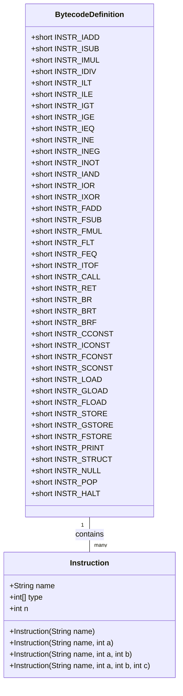
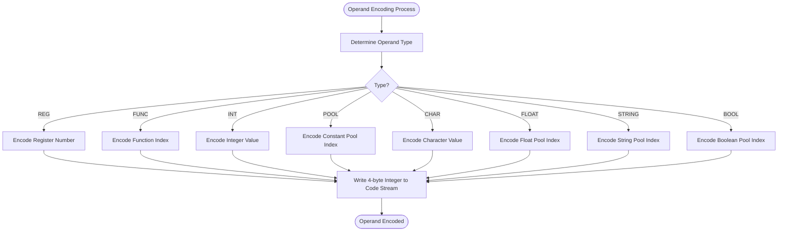
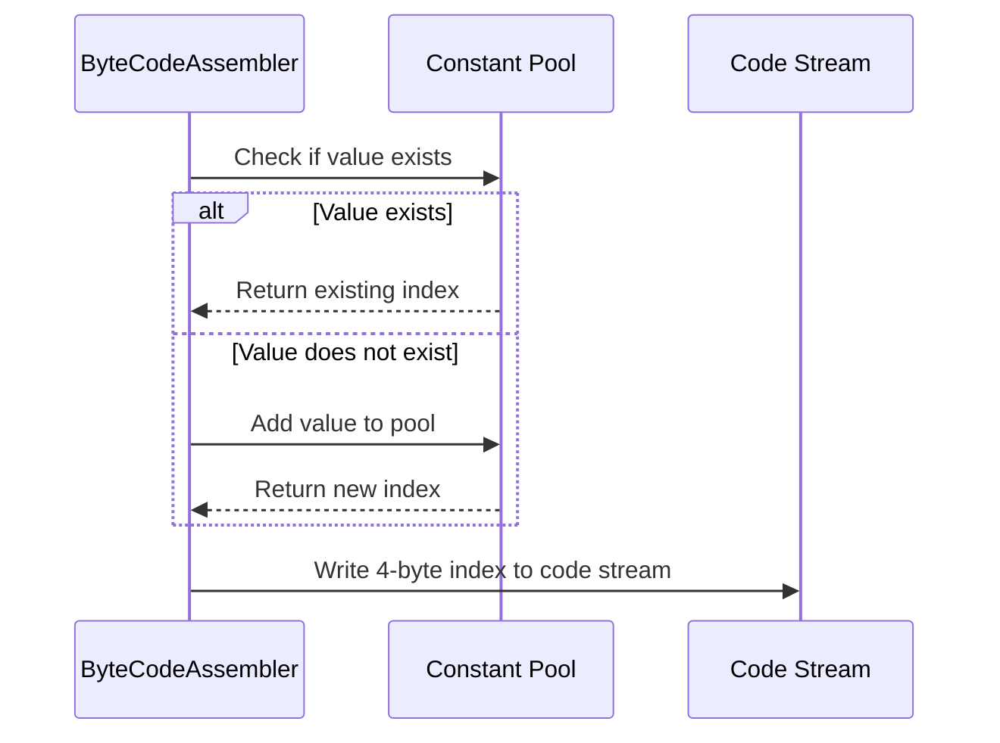
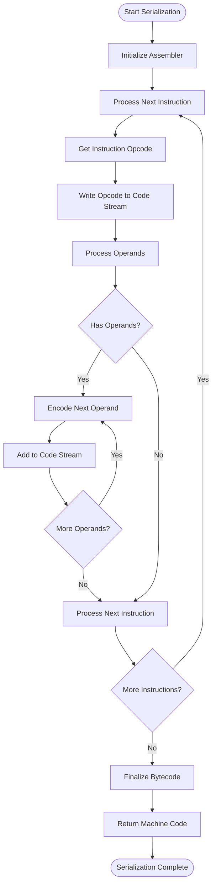
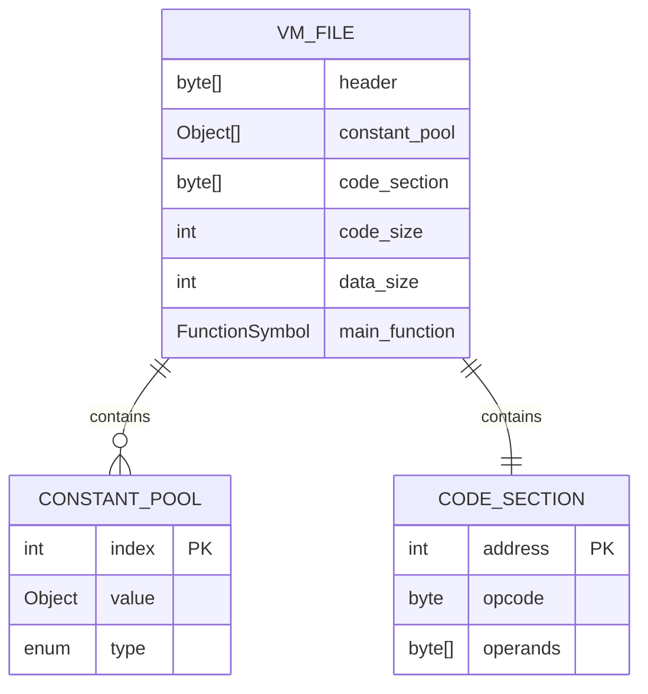
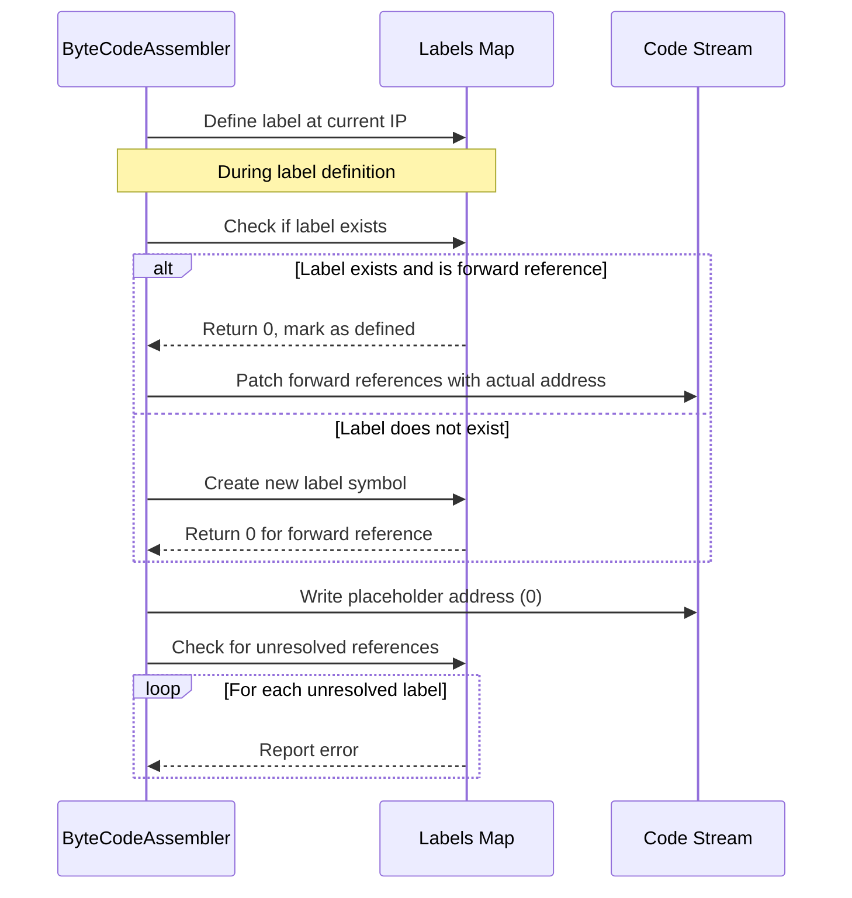
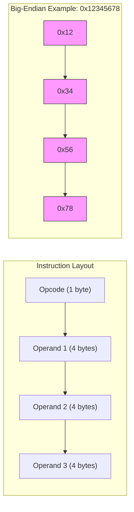

# Bytecode Encoding

<cite>
**Referenced Files in This Document**   
- [BytecodeDefinition.java](file://ep18/src/main/java/org/teachfx/antlr4/ep18/stackvm/BytecodeDefinition.java)
- [ByteCodeAssembler.java](file://ep18/src/main/java/org/teachfx/antlr4/ep18/stackvm/ByteCodeAssembler.java)
- [c.vm](file://ep18/src/main/resources/c.vm)
- [t.vm](file://ep18/src/main/resources/t.vm)
</cite>

## Table of Contents
1. [Introduction](#introduction)
2. [Instruction Format](#instruction-format)
3. [Operand Encoding](#operand-encoding)
4. [Immediate Value Handling](#immediate-value-handling)
5. [Bytecode Serialization Process](#bytecode-serialization-process)
6. [Output File Format](#output-file-format)
7. [Label Resolution and Address Calculation](#label-resolution-and-address-calculation)
8. [Encoding Examples](#encoding-examples)
9. [Endianness and Alignment](#endianness-and-alignment)
10. [Version Compatibility](#version-compatibility)

## Introduction
This document details the bytecode encoding process in the stack-based virtual machine implementation. The system converts assembly instructions into binary bytecode through a structured encoding process that defines instruction formats, operand types, and memory layout. The encoding process involves multiple stages including instruction definition, operand processing, constant pool management, and final binary serialization. The resulting bytecode is stored in .vm files that contain executable instructions for the virtual machine interpreter.

## Instruction Format
The bytecode instruction format is defined in BytecodeDefinition.java, which establishes a comprehensive instruction set for the virtual machine. Each instruction consists of an opcode followed by zero or more operands, with the opcode determining both the operation and the number of operands required.



**Diagram sources**
- [BytecodeDefinition.java](file://ep18/src/main/java/org/teachfx/antlr4/ep18/stackvm/BytecodeDefinition.java#L8-L135)

**Section sources**
- [BytecodeDefinition.java](file://ep18/src/main/java/org/teachfx/antlr4/ep18/stackvm/BytecodeDefinition.java#L8-L135)

## Operand Encoding
Operand encoding in the bytecode system follows a type-based approach where each operand type is encoded with a specific format. The system supports multiple operand types including registers, functions, integers, and constants from the constant pool. Each instruction definition in the instructions array specifies the expected operand types through the type array in the Instruction class.

The encoding process uses 4-byte signed integers for all operands, regardless of their logical type. This uniform size simplifies memory management and address calculation. The operand type information is used during disassembly and debugging to properly interpret the operand values, but does not affect the binary encoding size.



**Diagram sources**
- [BytecodeDefinition.java](file://ep18/src/main/java/org/teachfx/antlr4/ep18/stackvm/BytecodeDefinition.java#L26-L51)
- [ByteCodeAssembler.java](file://ep18/src/main/java/org/teachfx/antlr4/ep18/stackvm/ByteCodeAssembler.java#L15-L269)

**Section sources**
- [BytecodeDefinition.java](file://ep18/src/main/java/org/teachfx/antlr4/ep18/stackvm/BytecodeDefinition.java#L26-L51)
- [ByteCodeAssembler.java](file://ep18/src/main/java/org/teachfx/antlr4/ep18/stackvm/ByteCodeAssembler.java#L15-L269)

## Immediate Value Handling
Immediate values are handled through a combination of direct encoding and constant pool references. Integer immediates are directly encoded as 4-byte signed integers in the instruction stream, while floating-point values, strings, and other complex types are stored in the constant pool and referenced by index.

The constant pool serves as a repository for non-integer immediate values, preventing duplication and reducing code size. When an immediate value of type float, string, boolean, or function is encountered, the assembler checks if it already exists in the constant pool. If present, it uses the existing index; otherwise, it adds the value to the pool and uses the new index.



**Diagram sources**
- [ByteCodeAssembler.java](file://ep18/src/main/java/org/teachfx/antlr4/ep18/stackvm/ByteCodeAssembler.java#L15-L269)

**Section sources**
- [ByteCodeAssembler.java](file://ep18/src/main/java/org/teachfx/antlr4/ep18/stackvm/ByteCodeAssembler.java#L15-L269)

## Bytecode Serialization Process
The bytecode serialization process is managed by the ByteCodeAssembler class, which converts assembly instructions into binary format. The process begins with instruction opcode mapping, where instruction names are associated with their corresponding opcode values. As instructions are processed, they are serialized into a dynamically expanding byte array.

The serialization follows a structured pattern where each instruction is encoded with its opcode followed by its operands. The assembler maintains an instruction pointer (ip) that tracks the current position in the code stream. When additional space is needed, the code array is doubled in size to accommodate more instructions.



**Diagram sources**
- [ByteCodeAssembler.java](file://ep18/src/main/java/org/teachfx/antlr4/ep18/stackvm/ByteCodeAssembler.java#L15-L269)

**Section sources**
- [ByteCodeAssembler.java](file://ep18/src/main/java/org/teachfx/antlr4/ep18/stackvm/ByteCodeAssembler.java#L15-L269)

## Output File Format
The output .vm file format consists of multiple sections that organize the bytecode data for efficient execution. The format includes a header section, constant pool, and code section. While the exact binary layout is not explicitly defined in the source files, the structure can be inferred from the assembler and interpreter implementations.

The constant pool contains all referenced constants including strings, floating-point values, and function symbols. The code section contains the serialized bytecode instructions with opcodes and operands. The header likely includes metadata such as the main function address and data size information.



**Section sources**
- [ByteCodeAssembler.java](file://ep18/src/main/java/org/teachfx/antlr4/ep18/stackvm/ByteCodeAssembler.java#L15-L269)
- [c.vm](file://ep18/src/main/resources/c.vm)
- [t.vm](file://ep18/src/main/resources/t.vm)

## Label Resolution and Address Calculation
Label resolution is a critical phase in the bytecode encoding process that handles forward references and computes final instruction addresses. The ByteCodeAssembler maintains a labels map that tracks both defined labels and forward references. When a label is encountered, it is either defined with its current address or marked as a forward reference if it's used before definition.

During the finalization phase, the assembler checks for unresolved references and reports errors for any undefined labels. Forward references are resolved by patching the instruction stream with the correct addresses once the label is defined. This two-pass approach enables the use of labels in branch instructions regardless of their position in the code.



**Diagram sources**
- [ByteCodeAssembler.java](file://ep18/src/main/java/org/teachfx/antlr4/ep18/stackvm/ByteCodeAssembler.java#L15-L269)

**Section sources**
- [ByteCodeAssembler.java](file://ep18/src/main/java/org/teachfx/antlr4/ep18/stackvm/ByteCodeAssembler.java#L15-L269)

## Encoding Examples
The encoding process can be illustrated through examples from the provided .vm files. These examples demonstrate how high-level operations are translated into bytecode sequences.

For arithmetic operations, the encoding follows a stack-based approach where operands are loaded onto the stack and operations consume them. For example, adding two constants involves pushing both values with iconst instructions followed by an iadd instruction.

Control flow operations use labels and branch instructions. Conditional branches like brt and brf pop a boolean value from the stack and branch based on its value. Unconditional branches use the br instruction with a label target.

```mermaid
flowchart TD
subgraph ArithmeticExample["Arithmetic: x + y * 2"]
A1[iconst x] --> A2[load y]
A2 --> A3[iconst 2]
A3 --> A4[imul]
A4 --> A5[iadd]
end
subgraph ControlFlowExample["Control Flow: if (x > 0)"]
C1[load x]
C2[iconst 0]
C3[igt]
C4[brf Label]
C5[...]
C6[Label:]
end
subgraph FunctionCallExample["Function Call: f(a, b)"]
F1[iconst a]
F2[iconst b]
F3[call f()]
F4[...]
end
```

**Section sources**
- [c.vm](file://ep18/src/main/resources/c.vm)
- [t.vm](file://ep18/src/main/resources/t.vm)
- [ByteCodeAssembler.java](file://ep18/src/main/java/org/teachfx/antlr4/ep18/stackvm/ByteCodeAssembler.java#L15-L269)

## Endianness and Alignment
The bytecode format uses big-endian byte order for multi-byte values, as evidenced by the getInt and writeInt methods in ByteCodeAssembler. These methods explicitly shift bytes to the left with higher-order bytes at lower memory addresses. This consistent endianness ensures portability across different architectures.

All operands are aligned to 4-byte boundaries, with each operand occupying exactly 4 bytes regardless of its logical size. This uniform alignment simplifies address calculation and instruction decoding. The fixed 4-byte operand size also facilitates efficient memory access patterns during execution.

The instruction stream itself is byte-aligned, with opcodes occupying single bytes followed immediately by their 4-byte operands. This compact layout minimizes padding and optimizes code density.



**Diagram sources**
- [ByteCodeAssembler.java](file://ep18/src/main/java/org/teachfx/antlr4/ep18/stackvm/ByteCodeAssembler.java#L26-L63)

**Section sources**
- [ByteCodeAssembler.java](file://ep18/src/main/java/org/teachfx/antlr4/ep18/stackvm/ByteCodeAssembler.java#L26-L63)

## Version Compatibility
The bytecode format demonstrates considerations for version compatibility through its extensible instruction set design. New instructions can be added to the instructions array without breaking existing code, as long as opcode values are managed appropriately. The use of a constant pool for complex data types also enhances compatibility by abstracting data representation.

The system does not appear to include explicit version metadata in the bytecode format, which could present challenges for future format evolution. However, the modular design of the instruction definition system allows for relatively straightforward extension of the instruction set while maintaining backward compatibility with existing bytecode.

The separation of instruction definition from the assembler implementation enables updates to the instruction set without requiring changes to the core serialization logic. This architectural decision supports future enhancements while preserving compatibility with existing tools and workflows.

**Section sources**
- [BytecodeDefinition.java](file://ep18/src/main/java/org/teachfx/antlr4/ep18/stackvm/BytecodeDefinition.java#L8-L135)
- [ByteCodeAssembler.java](file://ep18/src/main/java/org/teachfx/antlr4/ep18/stackvm/ByteCodeAssembler.java#L15-L269)