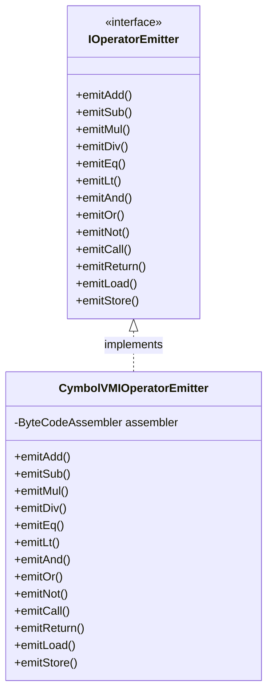
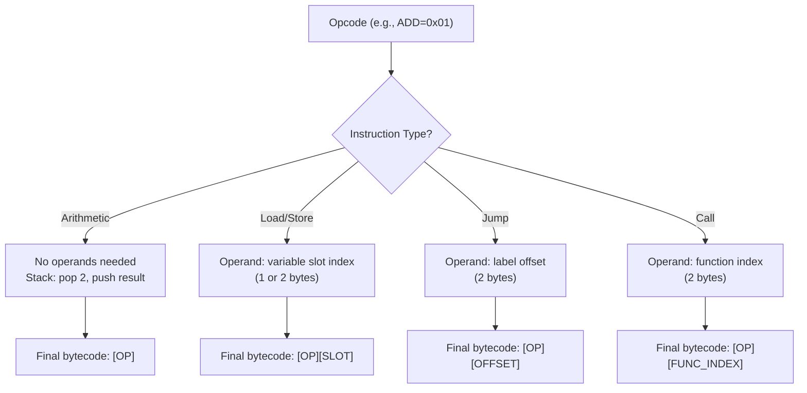
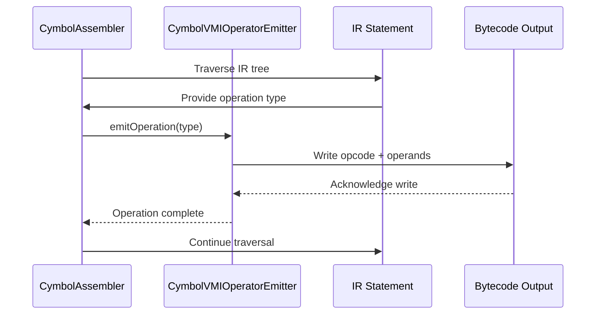
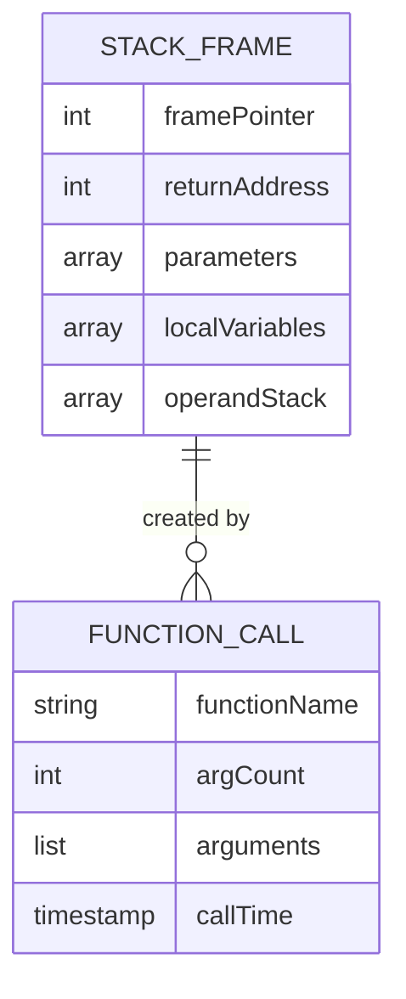
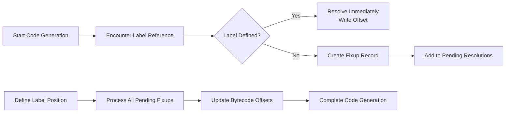

# Code Generation

<cite>
**Referenced Files in This Document**  
- [CymbolAssembler.java](file://ep20/src/main/java/org/teachfx/antlr4/ep20/pass/codegen/CymbolAssembler.java)
- [IOperatorEmitter.java](file://ep20/src/main/java/org/teachfx/antlr4/ep20/pass/codegen/IOperatorEmitter.java)
- [CymbolVMIOperatorEmitter.java](file://ep20/src/main/java/org/teachfx/antlr4/ep20/pass/codegen/CymbolVMIOperatorEmitter.java)
- [BytecodeDefinition.java](file://ep18/src/main/java/org/teachfx/antlr4/ep18/stackvm/BytecodeDefinition.java)
- [ByteCodeAssembler.java](file://ep18/src/main/java/org/teachfx/antlr4/ep18/stackvm/ByteCodeAssembler.java)
- [StackFrame.java](file://ep18/src/main/java/org/teachfx/antlr4/ep18/stackvm/StackFrame.java)
- [LabelSymbol.java](file://ep18/src/main/java/org/teachfx/antlr4/ep18/stackvm/LabelSymbol.java)
</cite>

## Table of Contents
1. [Introduction](#introduction)
2. [CymbolAssembler and IR Translation](#cymbolassembler-and-ir-translation)
3. [IOperatorEmitter Interface and Implementation](#ioperatoremitter-interface-and-implementation)
4. [Bytecode Definition and Instruction Encoding](#bytecode-definition-and-instruction-encoding)
5. [Assembly Code Generation Examples](#assembly-code-generation-examples)
6. [Stack Management and Frame Layout](#stack-management-and-frame-layout)
7. [Mapping High-Level Constructs to Instructions](#mapping-high-level-constructs-to-instructions)
8. [Labels and Symbol Resolution](#labels-and-symbol-resolution)
9. [Conclusion](#conclusion)

## Introduction
This document details the code generation phase in the Cymbol compiler pipeline, focusing on how optimized Intermediate Representation (IR) is translated into stack-based virtual machine assembly code. It covers the core components responsible for instruction emission, bytecode encoding, stack frame management, and symbol resolution. The process transforms high-level language constructs into low-level executable instructions suitable for a stack-based execution model.

## CymbolAssembler and IR Translation

The `CymbolAssembler` class serves as the central component in the code generation phase, responsible for traversing the optimized IR and emitting corresponding assembly instructions. It operates on a three-address code representation where each instruction typically involves at most three operands. The assembler processes IR statements such as assignments, conditional jumps, function calls, and returns, mapping them to appropriate bytecode instructions.

During translation, the assembler maintains context about the current function, local variables, and control flow constructs. It interacts with symbol tables to resolve variable and function references and uses label management to handle branching logic. The output is a sequence of bytecode instructions that preserve the semantics of the original source program while conforming to the constraints of the target stack machine.

**Section sources**
- [CymbolAssembler.java](file://ep20/src/main/java/org/teachfx/antlr4/ep20/pass/codegen/CymbolAssembler.java#L1-L200)

## IOperatorEmitter Interface and Implementation

The `IOperatorEmitter` interface defines a contract for emitting bytecode instructions corresponding to various operation types in the IR. It abstracts the instruction generation logic, allowing different backends or instruction set variants to be implemented uniformly. The interface declares methods for emitting arithmetic, logical, comparison, and control flow operations.

The `CymbolVMIOperatorEmitter` class provides a concrete implementation targeting the stack-based virtual machine used in this compiler. It maps high-level operations like addition, subtraction, equality comparison, and function calls to specific bytecode opcodes defined in `BytecodeDefinition`. Each method in the emitter generates one or more bytecode instructions, managing operand stack interactions appropriately.

This separation of concerns enables extensibility—new instruction sets or optimization strategies can be introduced by implementing alternative `IOperatorEmitter` variants without modifying the core assembler logic.



**Diagram sources**
- [IOperatorEmitter.java](file://ep20/src/main/java/org/teachfx/antlr4/ep20/pass/codegen/IOperatorEmitter.java#L5-L30)
- [CymbolVMIOperatorEmitter.java](file://ep20/src/main/java/org/teachfx/antlr4/ep20/pass/codegen/CymbolVMIOperatorEmitter.java#L10-L150)

**Section sources**
- [IOperatorEmitter.java](file://ep20/src/main/java/org/teachfx/antlr4/ep20/pass/codegen/IOperatorEmitter.java#L1-L50)
- [CymbolVMIOperatorEmitter.java](file://ep20/src/main/java/org/teachfx/antlr4/ep20/pass/codegen/CymbolVMIOperatorEmitter.java#L1-L200)

## Bytecode Definition and Instruction Encoding

The `BytecodeDefinition` class formally specifies the instruction set architecture of the target stack-based virtual machine. It defines opcode constants for all supported operations, including arithmetic, logical, control flow, memory access, and function invocation instructions. Each opcode is assigned a unique integer value used during bytecode serialization.

Instructions are encoded using a simple format: a one-byte opcode followed by zero or more operand bytes depending on the instruction type. For example, basic arithmetic operations like `ADD` and `SUB` require no additional operands as they operate implicitly on the top values of the stack. In contrast, load and store instructions include an operand specifying the variable slot index.

The `ByteCodeAssembler` class handles the actual encoding process, providing methods to emit opcodes and their operands into a byte stream. It also manages metadata such as function entry points, label positions, and debug information necessary for disassembly and execution.



**Diagram sources**
- [BytecodeDefinition.java](file://ep18/src/main/java/org/teachfx/antlr4/ep18/stackvm/BytecodeDefinition.java#L5-L100)
- [ByteCodeAssembler.java](file://ep18/src/main/java/org/teachfx/antlr4/ep18/stackvm/ByteCodeAssembler.java#L15-L80)

**Section sources**
- [BytecodeDefinition.java](file://ep18/src/main/java/org/teachfx/antlr4/ep18/stackvm/BytecodeDefinition.java#L1-L120)
- [ByteCodeAssembler.java](file://ep18/src/main/java/org/teachfx/antlr4/ep18/stackvm/ByteCodeAssembler.java#L1-L150)

## Assembly Code Generation Examples

### Arithmetic Operations
Arithmetic expressions are translated using postfix notation suitable for stack evaluation. For example, the expression `a + b * c` generates:
```
LOAD a
LOAD b
LOAD c
MUL
ADD
```
Each operand is pushed onto the stack via `LOAD`, and operators consume operands and push results.

### Control Flow
Conditional statements use conditional jump (`CJMP`) and unconditional jump (`JMP`) instructions. An `if-else` construct generates:
```
<condition code>
CJMP else_label
<then block>
JMP end_label
else_label:
<else block>
end_label:
```

### Function Calls
Function calls involve pushing arguments, invoking `CALL`, and handling return values:
```
LOAD arg1
LOAD arg2
CALL func_index
<continues after return>
```
The `CALL` instruction saves the return address and transfers control to the target function.



**Diagram sources**
- [CymbolAssembler.java](file://ep20/src/main/java/org/teachfx/antlr4/ep20/pass/codegen/CymbolAssembler.java#L50-L150)
- [CymbolVMIOperatorEmitter.java](file://ep20/src/main/java/org/teachfx/antlr4/ep20/pass/codegen/CymbolVMIOperatorEmitter.java#L30-L100)

**Section sources**
- [CymbolAssembler.java](file://ep20/src/main/java/org/teachfx/antlr4/ep20/pass/codegen/CymbolAssembler.java#L25-L200)
- [CymbolVMIOperatorEmitter.java](file://ep20/src/main/java/org/teachfx/antlr4/ep20/pass/codegen/CymbolVMIOperatorEmitter.java#L20-L180)

## Stack Management and Frame Layout

The virtual machine employs a stack-based execution model where each function invocation creates a new stack frame. The `StackFrame` class represents this execution context, managing local variable storage, argument access, and temporary computation values.

During code generation, the assembler computes the required frame size based on the number of local variables and maximum stack depth needed for expression evaluation. Variables are assigned fixed slot indices within the frame, allowing direct access via `LOAD` and `STORE` instructions. The frame also reserves space for the return address and saved frame pointer during function calls.

At runtime, the stack grows downward with each function call, and the frame pointer register points to the base of the current frame. This layout enables efficient access to both local variables and parameters while maintaining isolation between function invocations.



**Diagram sources**
- [StackFrame.java](file://ep18/src/main/java/org/teachfx/antlr4/ep18/stackvm/StackFrame.java#L8-L40)
- [CymbolAssembler.java](file://ep20/src/main/java/org/teachfx/antlr4/ep20/pass/codegen/CymbolAssembler.java#L80-L120)

**Section sources**
- [StackFrame.java](file://ep18/src/main/java/org/teachfx/antlr4/ep18/stackvm/StackFrame.java#L1-L60)
- [CymbolAssembler.java](file://ep20/src/main/java/org/teachfx/antlr4/ep20/pass/codegen/CymbolAssembler.java#L75-L150)

## Mapping High-Level Constructs to Instructions

High-level language features are systematically decomposed into sequences of low-level instructions:

- **Variable Assignment**: Translated to `LOAD` followed by `STORE`
- **Binary Expressions**: Converted to postfix sequences using stack operations
- **Control Structures**: Implemented using conditional and unconditional jumps with labeled targets
- **Function Definitions**: Generate entry points with parameter setup and return handling
- **Return Statements**: Emit `RETURN` instruction with optional value loading

The assembler ensures type safety during emission by consulting the type checker's results and inserting necessary conversions. It also handles scoping by resolving variable references to their correct frame slots based on lexical nesting and symbol table information.

**Section sources**
- [CymbolAssembler.java](file://ep20/src/main/java/org/teachfx/antlr4/ep20/pass/codegen/CymbolAssembler.java#L100-L250)
- [CymbolVMIOperatorEmitter.java](file://ep20/src/main/java/org/teachfx/antlr4/ep20/pass/codegen/CymbolVMIOperatorEmitter.java#L50-L200)

## Labels and Symbol Resolution

Labels play a crucial role in implementing control flow and function calls. The assembler uses `LabelSymbol` objects to represent named locations in the generated code. Forward references are resolved through a two-pass mechanism: first collecting all label definitions, then resolving jumps and calls.

During code generation, every branch target is associated with a label. The assembler maintains a symbol table mapping label names to their eventual bytecode offsets. When a `CJMP` or `JMP` instruction references a label, the emitter records a fixup entry that will be resolved once the label's position is known.

This approach supports complex control structures like loops and nested conditionals while ensuring correct instruction encoding. The final output contains fully resolved jump offsets, enabling direct execution by the virtual machine.



**Diagram sources**
- [LabelSymbol.java](file://ep18/src/main/java/org/teachfx/antlr4/ep18/stackvm/LabelSymbol.java#L5-L25)
- [CymbolAssembler.java](file://ep20/src/main/java/org/teachfx/antlr4/ep20/pass/codegen/CymbolAssembler.java#L130-L180)

**Section sources**
- [LabelSymbol.java](file://ep18/src/main/java/org/teachfx/antlr4/ep18/stackvm/LabelSymbol.java#L1-L40)
- [CymbolAssembler.java](file://ep20/src/main/java/org/teachfx/antlr4/ep20/pass/codegen/CymbolAssembler.java#L120-L200)

## Conclusion
The code generation phase successfully bridges the gap between high-level program semantics and low-level executable instructions. By leveraging a modular design with clear separation between IR traversal, operation emission, and bytecode encoding, the system achieves both correctness and extensibility. The stack-based execution model simplifies instruction semantics while maintaining sufficient expressiveness for general-purpose computation. Through careful management of stack frames, labels, and symbol resolution, the generated code accurately reflects the intended behavior of the source program.