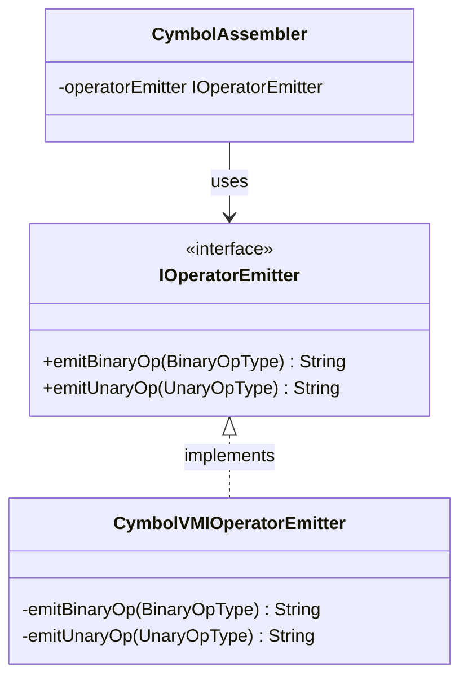
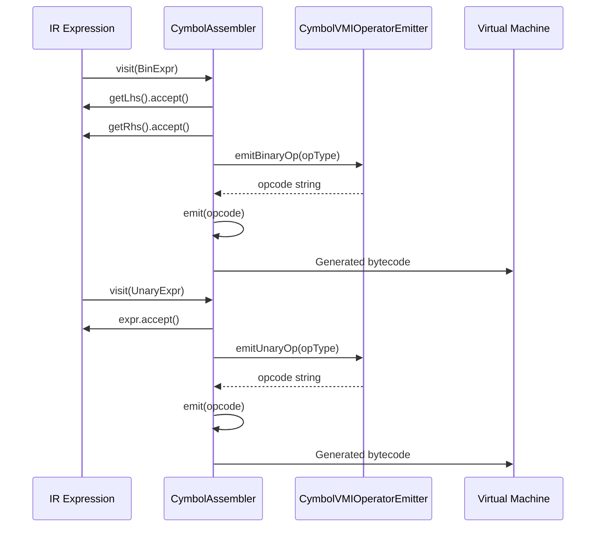
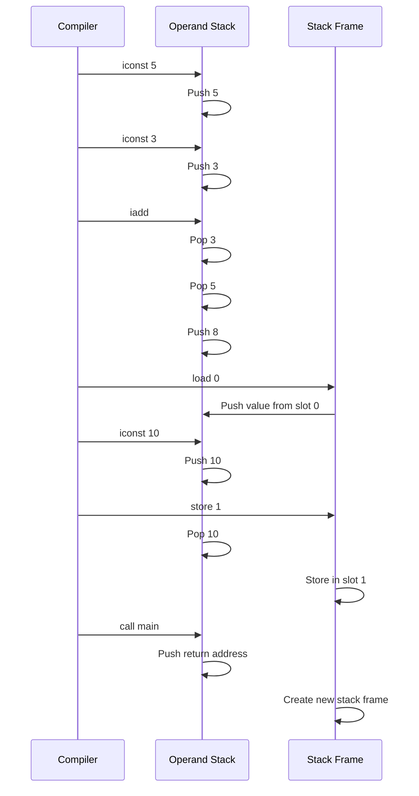

# Instruction Emission

<cite>
**Referenced Files in This Document**   
- [IOperatorEmitter.java](file://ep20/src/main/java/org/teachfx/antlr4/ep20/pass/codegen/IOperatorEmitter.java)
- [CymbolVMIOperatorEmitter.java](file://ep20/src/main/java/org/teachfx/antlr4/ep20/pass/codegen/CymbolVMIOperatorEmitter.java)
- [CymbolAssembler.java](file://ep20/src/main/java/org/teachfx/antlr4/ep20/pass/codegen/CymbolAssembler.java)
- [OperatorType.java](file://ep20/src/main/java/org/teachfx/antlr4/ep20/symtab/type/OperatorType.java)
- [BytecodeDefinition.java](file://ep18/src/main/java/org/teachfx/antlr4/ep18/stackvm/BytecodeDefinition.java)
- [StackFrame.java](file://ep18/src/main/java/org/teachfx/antlr4/ep18/stackvm/StackFrame.java)
- [VMInterpreter.java](file://ep18/src/main/java/org/teachfx/antlr4/ep18/VMInterpreter.java)
</cite>

## Table of Contents
1. [Introduction](#introduction)
2. [IOperatorEmitter Interface Contract](#ioperatoremitter-interface-contract)
3. [CymbolVMIOperatorEmitter Implementation](#cymbolvmioperatoremitter-implementation)
4. [Instruction Mapping and Generation](#instruction-mapping-and-generation)
5. [Stack-Based Operand Management](#stack-based-operand-management)
6. [Error Handling and Extensibility](#error-handling-and-extensibility)
7. [Conclusion](#conclusion)

## Introduction
The instruction emission mechanism in the Cymbol compiler framework provides a structured approach to generating stack-based virtual machine opcodes from intermediate representation (IR) expressions. This system decouples the instruction generation logic from the assembler implementation through a well-defined interface, enabling flexible and maintainable code generation. The mechanism translates high-level language constructs into low-level VM instructions while managing operand flow on the execution stack.

## IOperatorEmitter Interface Contract
The `IOperatorEmitter` interface defines the contract for instruction generation in the Cymbol compiler, establishing a clear separation between the assembler logic and the opcode emission process. This interface provides methods for emitting both binary and unary operations, serving as an abstraction layer that allows different emitter implementations to target various instruction sets.



**Diagram sources**
- [IOperatorEmitter.java](file://ep20/src/main/java/org/teachfx/antlr4/ep20/pass/codegen/IOperatorEmitter.java#L4-L8)
- [CymbolVMIOperatorEmitter.java](file://ep20/src/main/java/org/teachfx/antlr4/ep20/pass/codegen/CymbolVMIOperatorEmitter.java#L6-L65)
- [CymbolAssembler.java](file://ep20/src/main/java/org/teachfx/antlr4/ep20/pass/codegen/CymbolAssembler.java#L15-L16)

**Section sources**
- [IOperatorEmitter.java](file://ep20/src/main/java/org/teachfx/antlr4/ep20/pass/codegen/IOperatorEmitter.java#L4-L8)

## CymbolVMIOperatorEmitter Implementation
The `CymbolVMIOperatorEmitter` class implements the `IOperatorEmitter` interface to generate stack-based VM opcodes for the Cymbol virtual machine. This implementation maps high-level language operators to their corresponding bytecode instructions, handling both arithmetic/logical operations and control flow constructs.

The emitter processes binary operations such as addition, subtraction, multiplication, and division, as well as comparison operators (equality, inequality, less than, etc.) and logical operators (AND, OR). For unary operations, it handles negation and logical NOT. Each operator type is mapped to a specific opcode string that corresponds to the VM's instruction set.



**Diagram sources**
- [CymbolVMIOperatorEmitter.java](file://ep20/src/main/java/org/teachfx/antlr4/ep20/pass/codegen/CymbolVMIOperatorEmitter.java#L6-L65)
- [CymbolAssembler.java](file://ep20/src/main/java/org/teachfx/antlr4/ep20/pass/codegen/CymbolAssembler.java#L76-L131)

**Section sources**
- [CymbolVMIOperatorEmitter.java](file://ep20/src/main/java/org/teachfx/antlr4/ep20/pass/codegen/CymbolVMIOperatorEmitter.java#L6-L65)

## Instruction Mapping and Generation
The instruction emission process maps intermediate representation expressions to stack-based bytecode instructions through a systematic translation mechanism. Binary operations are translated by first evaluating both operands (pushing them onto the stack) and then applying the appropriate operator instruction.

For arithmetic operations, the mapping follows a consistent pattern where integer operations are prefixed with 'i' (e.g., 'iadd' for addition, 'isub' for subtraction). Comparison operations similarly use the 'i' prefix followed by the comparison type (e.g., 'ilt' for integer less than, 'ieq' for integer equality). Logical operations use 'iand' and 'ior' for AND and OR operations respectively.

Function invocation is handled through the `call` instruction, which transfers control to a named function. Control flow operations use branching instructions: unconditional jumps use 'br' while conditional jumps use 'brf' (branch if false). Return statements generate 'ret' for function returns and 'halt' for program termination.

```mermaid
flowchart TD
Start([IR Expression]) --> OperationType{"Operation Type?"}
OperationType --> |Binary| BinaryOps["Process LHS and RHS\nPush operands to stack\nEmit operator opcode"]
OperationType --> |Unary| UnaryOps["Process operand\nPush to stack\nEmit operator opcode"]
OperationType --> |Function Call| FunctionCall["Emit call instruction\nwith function name"]
OperationType --> |Control Flow| ControlFlow["Emit branch instruction\nwith target label"]
OperationType --> |Assignment| Assignment["Evaluate RHS\nEmit store instruction\nwith frame slot"]
BinaryOps --> iadd["iadd: Integer Addition"]
BinaryOps --> isub["isub: Integer Subtraction"]
BinaryOps --> imul["imul: Integer Multiplication"]
BinaryOps --> idiv["idiv: Integer Division"]
BinaryOps --> ilt["ilt: Integer Less Than"]
BinaryOps --> ieq["ieq: Integer Equality"]
BinaryOps --> iand["iand: Integer AND"]
UnaryOps --> ineg["ineg: Integer Negation"]
UnaryOps --> inot["inot: Integer NOT"]
FunctionCall --> call["call: Function Invocation"]
ControlFlow --> br["br: Unconditional Branch"]
ControlFlow --> brf["brf: Conditional Branch"]
Assignment --> store["store: Frame Storage"]
iadd --> End([Generated Bytecode])
isub --> End
imul --> End
idiv --> End
ilt --> End
ieq --> End
iand --> End
ineg --> End
inot --> End
call --> End
br --> End
brf --> End
store --> End
```

**Diagram sources**
- [CymbolVMIOperatorEmitter.java](file://ep20/src/main/java/org/teachfx/antlr4/ep20/pass/codegen/CymbolVMIOperatorEmitter.java#L6-L65)
- [CymbolAssembler.java](file://ep20/src/main/java/org/teachfx/antlr4/ep20/pass/codegen/CymbolAssembler.java#L38-L131)
- [BytecodeDefinition.java](file://ep18/src/main/java/org/teachfx/antlr4/ep18/stackvm/BytecodeDefinition.java#L26-L84)

**Section sources**
- [CymbolVMIOperatorEmitter.java](file://ep20/src/main/java/org/teachfx/antlr4/ep20/pass/codegen/CymbolVMIOperatorEmitter.java#L6-L65)
- [CymbolAssembler.java](file://ep20/src/main/java/org/teachfx/antlr4/ep20/pass/codegen/CymbolAssembler.java#L38-L131)

## Stack-Based Operand Management
The instruction emission mechanism relies on a stack-based architecture for operand management, where values are pushed and popped from an execution stack during bytecode generation and execution. The assembler processes expressions by first visiting their operands, which generates instructions to load values onto the stack, followed by emitting the operation instruction that consumes these values.

During binary operations, the left-hand side (LHS) and right-hand side (RHS) expressions are evaluated first, pushing their results onto the stack. The corresponding operator instruction then pops these two values, performs the operation, and pushes the result back onto the stack. For example, the expression `a + b` generates code that loads `a`, loads `b`, and then executes `iadd`, leaving the sum on the stack.

Variable access and assignment use frame slots to reference local variables within the current stack frame. The `load` instruction retrieves a value from a specified frame slot index and pushes it onto the operand stack, while the `store` instruction pops a value from the operand stack and stores it in the specified frame slot.



**Diagram sources**
- [CymbolAssembler.java](file://ep20/src/main/java/org/teachfx/antlr4/ep20/pass/codegen/CymbolAssembler.java#L118-L125)
- [VMInterpreter.java](file://ep18/src/main/java/org/teachfx/antlr4/ep18/VMInterpreter.java#L267-L298)
- [StackFrame.java](file://ep18/src/main/java/org/teachfx/antlr4/ep18/stackvm/StackFrame.java#L0-L12)

**Section sources**
- [CymbolAssembler.java](file://ep20/src/main/java/org/teachfx/antlr4/ep20/pass/codegen/CymbolAssembler.java#L118-L125)
- [VMInterpreter.java](file://ep18/src/main/java/org/teachfx/antlr4/ep18/VMInterpreter.java#L267-L298)

## Error Handling and Extensibility
The instruction emission system incorporates error handling for unsupported operations through null return values from the emission methods. When an unrecognized operator type is encountered, the `emitBinaryOp` and `emitUnaryOp` methods return null, which can be detected by the assembler to generate appropriate error messages or handle the situation gracefully.

The architecture supports extensibility through the interface-based design, allowing new instruction types to be added by either extending the existing emitter or creating new implementations of the `IOperatorEmitter` interface. New operators can be incorporated by adding entries to the `OperatorType` enum and corresponding cases in the switch statements of the emitter implementation.

The separation of concerns between the assembler and emitter components enables targeting different virtual machine architectures by implementing alternative emitter classes that translate the same IR expressions into different instruction sets. This design also facilitates testing, as the emitter logic can be unit tested independently of the full compilation pipeline.

**Section sources**
- [CymbolVMIOperatorEmitter.java](file://ep20/src/main/java/org/teachfx/antlr4/ep20/pass/codegen/CymbolVMIOperatorEmitter.java#L6-L65)
- [OperatorType.java](file://ep20/src/main/java/org/teachfx/antlr4/ep20/symtab/type/OperatorType.java#L4-L59)

## Conclusion
The instruction emission mechanism in the Cymbol compiler provides a robust and extensible framework for generating stack-based bytecode from high-level language constructs. By decoupling the instruction generation logic through the `IOperatorEmitter` interface, the system achieves separation of concerns, making it easier to maintain and extend. The `CymbolVMIOperatorEmitter` implementation effectively maps IR expressions to VM opcodes for arithmetic, logical, control flow, and function call operations, while the stack-based operand management ensures proper execution semantics. This architecture supports both error handling for unsupported operations and extensibility for new instruction types, providing a solid foundation for the compiler's code generation phase.