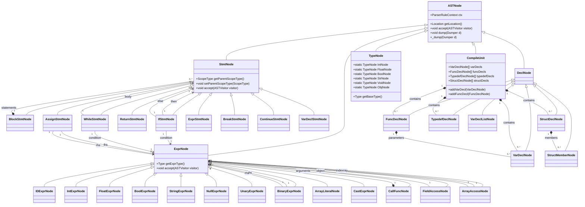
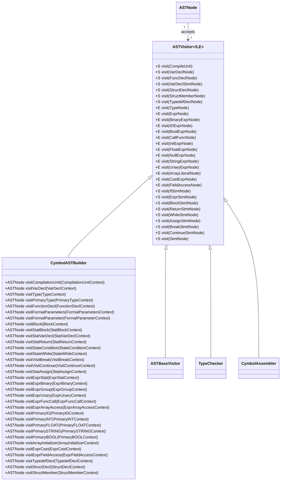
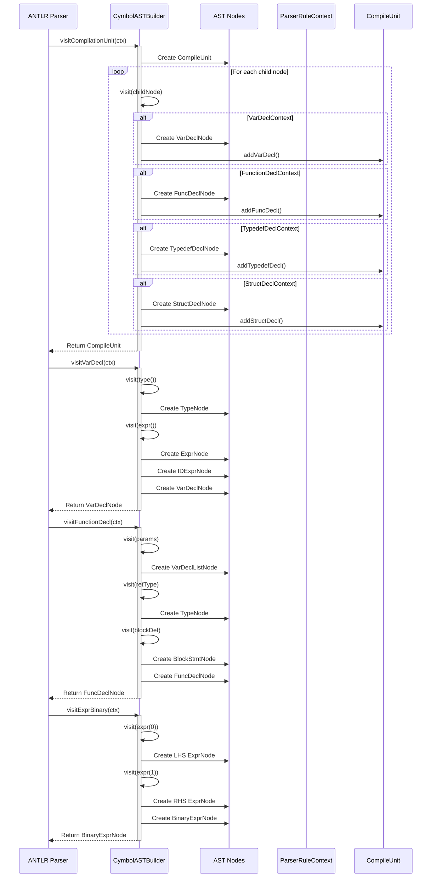
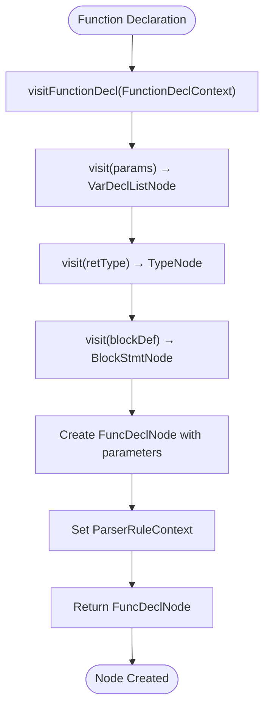
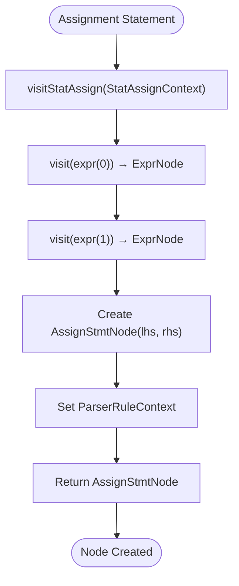
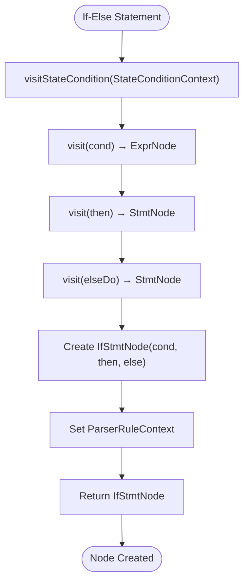
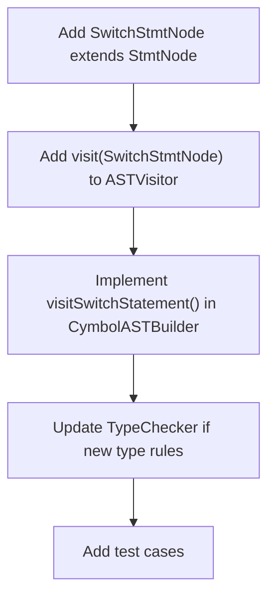

# Abstract Syntax Tree Construction

<cite>
**Referenced Files in This Document**   
- [ASTNode.java](file://ep20/src/main/java/org/teachfx/antlr4/ep20/ast/ASTNode.java)
- [ASTVisitor.java](file://ep20/src/main/java/org/teachfx/antlr4/ep20/ast/ASTVisitor.java)
- [CymbolASTBuilder.java](file://ep20/src/main/java/org/teachfx/antlr4/ep20/pass/ast/CymbolASTBuilder.java)
- [BinaryExprNode.java](file://ep20/src/main/java/org/teachfx/antlr4/ep20/ast/expr/BinaryExprNode.java)
- [IfStmtNode.java](file://ep20/src/main/java/org/teachfx/antlr4/ep20/ast/stmt/IfStmtNode.java)
- [CompileUnit.java](file://ep20/src/main/java/org/teachfx/antlr4/ep20/ast/CompileUnit.java)
- [TypeNode.java](file://ep20/src/main/java/org/teachfx/antlr4/ep20/ast/type/TypeNode.java)
- [ExprNode.java](file://ep20/src/main/java/org/teachfx/antlr4/ep20/ast/expr/ExprNode.java)
- [StmtNode.java](file://ep20/src/main/java/org/teachfx/antlr4/ep20/ast/stmt/StmtNode.java)
- [VarDeclNode.java](file://ep20/src/main/java/org/teachfx/antlr4/ep20/ast/decl/VarDeclNode.java)
- [FuncDeclNode.java](file://ep20/src/main/java/org/teachfx/antlr4/ep20/ast/decl/FuncDeclNode.java)
</cite>

## Table of Contents
1. [Introduction](#introduction)
2. [AST Node Hierarchy](#ast-node-hierarchy)
3. [Visitor Pattern Implementation](#visitor-pattern-implementation)
4. [AST Construction Process](#ast-construction-process)
5. [Node Creation Examples](#node-creation-examples)
6. [Design Rationale](#design-rationale)
7. [Extending the AST](#extending-the-ast)
8. [Conclusion](#conclusion)

## Introduction
The Abstract Syntax Tree (AST) construction process in the Cymbol language implementation transforms the ANTLR4 parse tree into a typed, hierarchical representation of program structure. This AST serves as the foundation for subsequent semantic analysis and code generation phases. The design emphasizes type safety, source location tracking, and extensibility through a well-defined visitor pattern. The AST accurately represents Cymbol language constructs including expressions, statements, declarations, and types, enabling robust compiler passes.

## AST Node Hierarchy

The AST node hierarchy is organized around a base `ASTNode` class that provides common functionality for all nodes in the tree. The hierarchy is structured to represent the various language constructs in a type-safe manner.

**Diagram sources**
- [ASTNode.java](file://ep20/src/main/java/org/teachfx/antlr4/ep20/ast/ASTNode.java)
- [CompileUnit.java](file://ep20/src/main/java/org/teachfx/antlr4/ep20/ast/CompileUnit.java)
- [ExprNode.java](file://ep20/src/main/java/org/teachfx/antlr4/ep20/ast/expr/ExprNode.java)
- [StmtNode.java](file://ep20/src/main/java/org/teachfx/antlr4/ep20/ast/stmt/StmtNode.java)
- [TypeNode.java](file://ep20/src/main/java/org/teachfx/antlr4/ep20/ast/type/TypeNode.java)
- [VarDeclNode.java](file://ep20/src/main/java/org/teachfx/antlr4/ep20/ast/decl/VarDeclNode.java)
- [FuncDeclNode.java](file://ep20/src/main/java/org/teachfx/antlr4/ep20/ast/decl/FuncDeclNode.java)

**Section sources**
- [ASTNode.java](file://ep20/src/main/java/org/teachfx/antlr4/ep20/ast/ASTNode.java#L1-L48)
- [CompileUnit.java](file://ep20/src/main/java/org/teachfx/antlr4/ep20/ast/CompileUnit.java)
- [ExprNode.java](file://ep20/src/main/java/org/teachfx/antlr4/ep20/ast/expr/ExprNode.java)
- [StmtNode.java](file://ep20/src/main/java/org/teachfx/antlr4/ep20/ast/stmt/StmtNode.java)

## Visitor Pattern Implementation

The visitor pattern is implemented through the `ASTVisitor` interface, which defines visit methods for all AST node types. This enables type-safe traversal and transformation of the AST without requiring instanceof checks or casting in client code.

**Diagram sources**
- [ASTVisitor.java](file://ep20/src/main/java/org/teachfx/antlr4/ep20/ast/ASTVisitor.java#L1-L123)
- [CymbolASTBuilder.java](file://ep20/src/main/java/org/teachfx/antlr4/ep20/pass/ast/CymbolASTBuilder.java#L1-L318)

**Section sources**
- [ASTVisitor.java](file://ep20/src/main/java/org/teachfx/antlr4/ep20/ast/ASTVisitor.java#L1-L123)
- [CymbolASTBuilder.java](file://ep20/src/main/java/org/teachfx/antlr4/ep20/pass/ast/CymbolASTBuilder.java#L1-L318)

## AST Construction Process

The AST construction process is handled by the `CymbolASTBuilder` class, which extends ANTLR's base visitor to convert the parse tree into a typed AST. The builder maintains parent-child relationships and source location information throughout the construction process.

**Diagram sources**
- [CymbolASTBuilder.java](file://ep20/src/main/java/org/teachfx/antlr4/ep20/pass/ast/CymbolASTBuilder.java#L1-L318)
- [ASTNode.java](file://ep20/src/main/java/org/teachfx/antlr4/ep20/ast/ASTNode.java#L1-L48)

**Section sources**
- [CymbolASTBuilder.java](file://ep20/src/main/java/org/teachfx/antlr4/ep20/pass/ast/CymbolASTBuilder.java#L1-L318)

## Node Creation Examples

### Function Declaration
The AST construction for a function declaration involves creating a `FuncDeclNode` with return type, parameter list, and body block.

**Diagram sources**
- [CymbolASTBuilder.java](file://ep20/src/main/java/org/teachfx/antlr4/ep20/pass/ast/CymbolASTBuilder.java#L100-L120)
- [FuncDeclNode.java](file://ep20/src/main/java/org/teachfx/antlr4/ep20/ast/decl/FuncDeclNode.java)

### Variable Assignment
Variable assignment statements are transformed into `AssignStmtNode` instances with left-hand side and right-hand side expressions.

**Diagram sources**
- [CymbolASTBuilder.java](file://ep20/src/main/java/org/teachfx/antlr4/ep20/pass/ast/CymbolASTBuilder.java#L180-L190)
- [AssignStmtNode.java](file://ep20/src/main/java/org/teachfx/antlr4/ep20/ast/stmt/AssignStmtNode.java)

### Control Flow Statement
Control flow statements like if-else are represented with conditional expressions and corresponding statement blocks.

**Diagram sources**
- [CymbolASTBuilder.java](file://ep20/src/main/java/org/teachfx/antlr4/ep20/pass/ast/CymbolASTBuilder.java#L160-L170)
- [IfStmtNode.java](file://ep20/src/main/java/org/teachfx/antlr4/ep20/ast/stmt/IfStmtNode.java#L1-L60)

## Design Rationale

The AST design follows several key principles that support semantic analysis and code generation:

1. **Type Safety**: Each node carries type information where applicable, enabling early detection of type errors.
2. **Source Location Tracking**: Every node maintains a reference to its parser context, allowing precise error reporting with line and column information.
3. **Extensibility**: The visitor pattern allows new operations to be added without modifying existing node classes.
4. **Immutability**: Once constructed, AST nodes are immutable, ensuring consistency during compiler passes.
5. **Hierarchical Structure**: The tree structure naturally represents program nesting and scope relationships.

The design supports semantic analysis by providing:
- Complete type information through `TypeNode` and `getExprType()` methods
- Symbol references in `IDExprNode` for name resolution
- Scope information through `ScopeType` in statement nodes
- Parent-child relationships for contextual analysis

For code generation, the AST provides:
- A clean separation between syntax and semantics
- Typed expressions that can be directly translated to target instructions
- Control flow structures that map directly to intermediate representation
- Declaration information for symbol table generation

**Section sources**
- [ASTNode.java](file://ep20/src/main/java/org/teachfx/antlr4/ep20/ast/ASTNode.java#L1-L48)
- [ASTVisitor.java](file://ep20/src/main/java/org/teachfx/antlr4/ep20/ast/ASTVisitor.java#L1-L123)
- [CymbolASTBuilder.java](file://ep20/src/main/java/org/teachfx/antlr4/ep20/pass/ast/CymbolASTBuilder.java#L1-L318)

## Extending the AST

To extend the AST for new language features, follow these steps:

1. **Add New Node Classes**: Create new classes extending the appropriate base node type (ExprNode, StmtNode, etc.)

2. **Update ASTVisitor Interface**: Add new visit methods to the `ASTVisitor` interface

3. **Implement in CymbolASTBuilder**: Add corresponding visit methods to handle the new parse tree contexts

4. **Update Type System**: If needed, extend the type system in `TypeTable` and `OperatorType`

Example for adding a switch statement:

When adding new expression types, also consider:
- Operator precedence and associativity
- Type coercion rules
- Constant folding opportunities
- Code generation patterns

The modular design ensures that extensions can be made with minimal impact on existing code, maintaining the integrity of the compiler architecture.

**Section sources**
- [ASTVisitor.java](file://ep20/src/main/java/org/teachfx/antlr4/ep20/ast/ASTVisitor.java#L1-L123)
- [CymbolASTBuilder.java](file://ep20/src/main/java/org/teachfx/antlr4/ep20/pass/ast/CymbolASTBuilder.java#L1-L318)
- [ASTNode.java](file://ep20/src/main/java/org/teachfx/antlr4/ep20/ast/ASTNode.java#L1-L48)

## Conclusion
The AST construction process in the Cymbol compiler transforms the ANTLR4 parse tree into a rich, typed representation that serves as the foundation for all subsequent compiler phases. The hierarchical node structure accurately represents language constructs while the visitor pattern enables flexible traversal and transformation. Source location tracking supports precise error reporting, and the extensible design allows for easy addition of new language features. This well-structured AST enables robust semantic analysis and efficient code generation, forming a critical component of the compiler architecture.