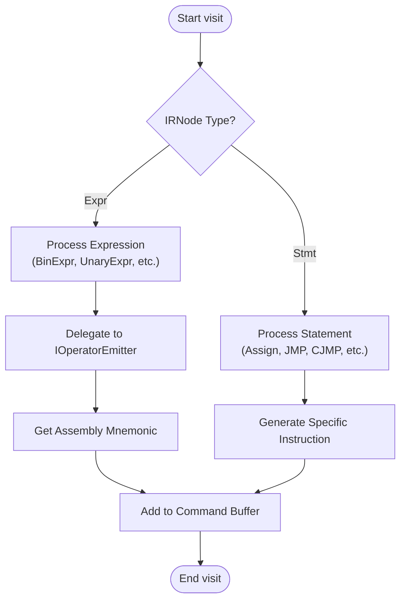
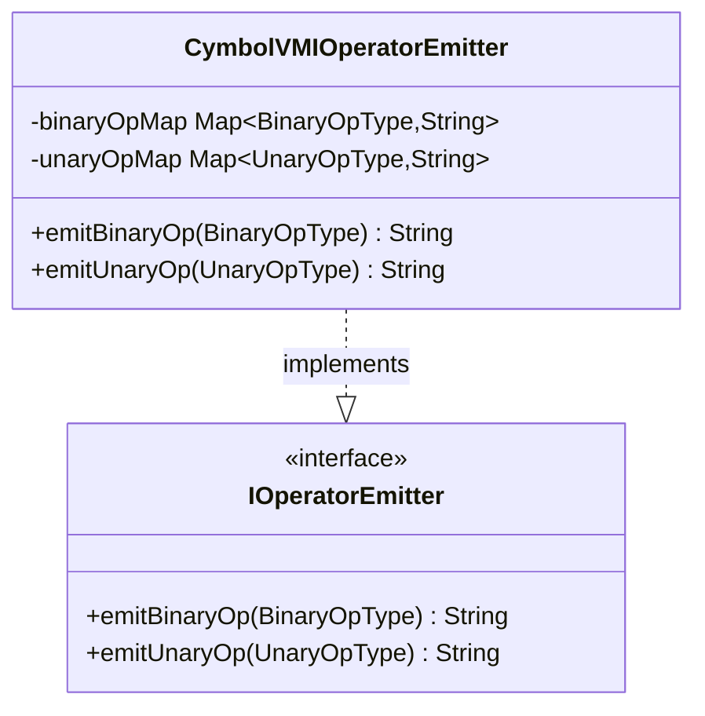
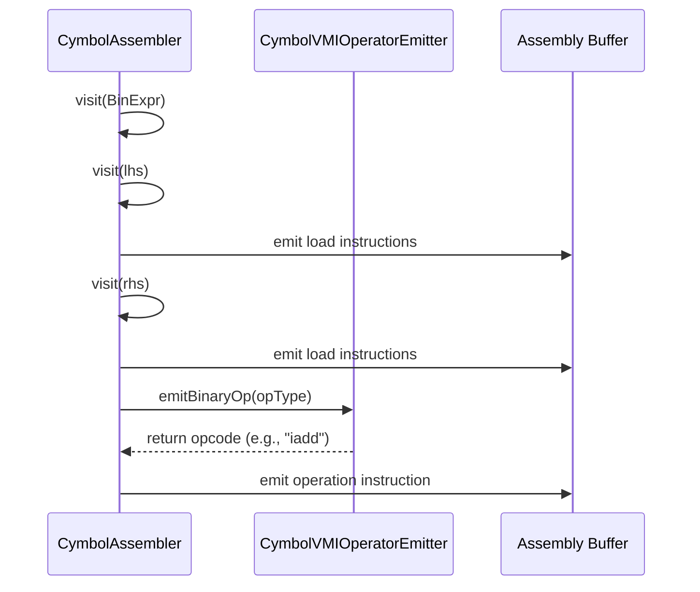
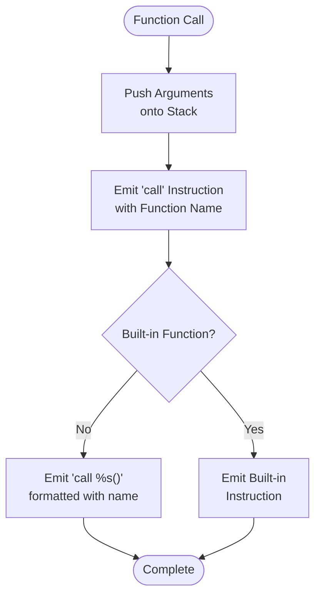
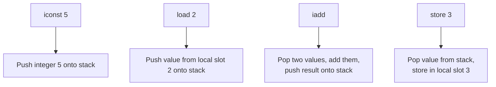
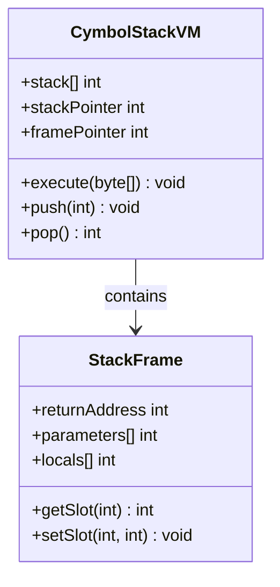
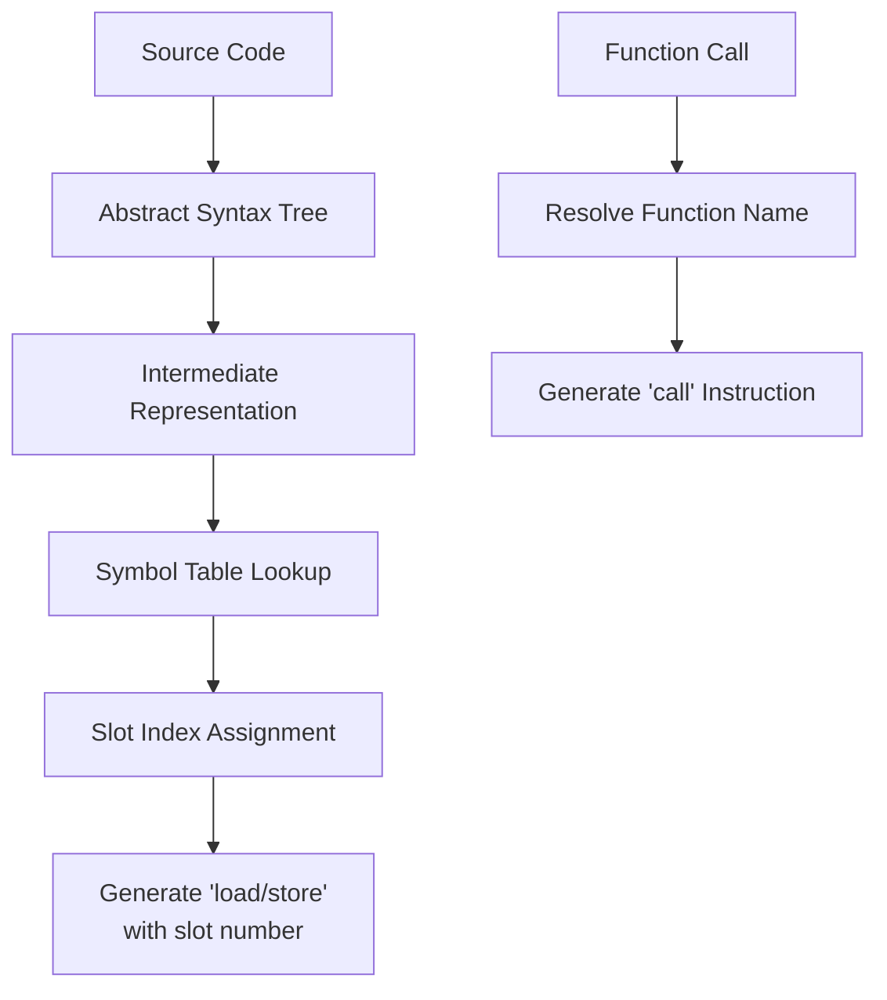
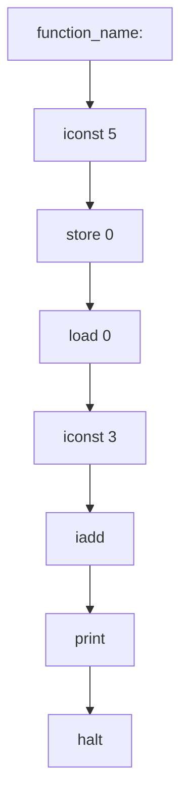

# Code Generation

<cite>
**Referenced Files in This Document**   
- [CymbolAssembler.java](file://ep20/src/main/java/org/teachfx/antlr4/ep20/pass/codegen/CymbolAssembler.java)
- [IOperatorEmitter.java](file://ep20/src/main/java/org/teachfx/antlr4/ep20/pass/codegen/IOperatorEmitter.java)
- [CymbolVMIOperatorEmitter.java](file://ep20/src/main/java/org/teachfx/antlr4/ep20/pass/codegen/CymbolVMIOperatorEmitter.java)
- [BytecodeDefinition.java](file://ep18/src/main/java/org/teachfx/antlr4/ep18/stackvm/BytecodeDefinition.java)
- [BinExpr.java](file://ep20/src/main/java/org/teachfx/antlr4/ep20/ir/expr/arith/BinExpr.java)
</cite>

## Table of Contents
1. [Introduction](#introduction)
2. [Core Components](#core-components)
3. [Architecture Overview](#architecture-overview)
4. [Detailed Component Analysis](#detailed-component-analysis)
5. [Instruction Emission Process](#instruction-emission-process)
6. [Stack Management and Frame Layout](#stack-management-and-frame-layout)
7. [Symbol Resolution and Debug Information](#symbol-resolution-and-debug-information)
8. [Conclusion](#conclusion)

## Introduction
This document details the code generation phase in the Cymbol compiler, focusing on how the optimized Intermediate Representation (IR) is translated into assembly instructions for a stack-based virtual machine. The process involves several key components that work together to generate executable bytecode from high-level language constructs. The system is designed with extensibility in mind, allowing for different target backends through abstraction layers. This documentation covers the translation process, instruction encoding, stack management, calling conventions, and debug information preservation.

## Core Components

The code generation system consists of three primary components that work in concert to transform IR into executable assembly code. The `CymbolAssembler` class serves as the main driver, traversing the IR tree and generating assembly instructions. It delegates operation-specific instruction generation to the `IOperatorEmitter` interface, which provides abstraction for different target architectures. The concrete implementation `CymbolVMIOperatorEmitter` generates specific opcodes for the stack-based virtual machine defined in EP18. These components work together to ensure clean separation between the assembly generation logic and the target-specific instruction encoding.

**Section sources**
- [CymbolAssembler.java](file://ep20/src/main/java/org/teachfx/antlr4/ep20/pass/codegen/CymbolAssembler.java#L1-L154)
- [IOperatorEmitter.java](file://ep20/src/main/java/org/teachfx/antlr4/ep20/pass/codegen/IOperatorEmitter.java#L1-L10)
- [CymbolVMIOperatorEmitter.java](file://ep20/src/main/java/org/teachfx/antlr4/ep20/pass/codegen/CymbolVMIOperatorEmitter.java#L1-L65)

## Architecture Overview

The code generation architecture follows a visitor pattern to traverse the optimized IR and generate assembly instructions. The process begins with the `CymbolAssembler` accepting a list of linearized IR instructions, which it processes by dispatching to appropriate visit methods based on instruction type. For each operation, the assembler uses the configured `IOperatorEmitter` to obtain the appropriate assembly mnemonic. The generated instructions are collected in a buffer and formatted with proper indentation to represent control flow structure.

```mermaid
graph TD
IR[Optimized IR] --> Assembler[CymbolAssembler]
Assembler --> Visitor[IRVisitor Pattern]
Visitor --> |Binary Expression| BinExpr[visit(BinExpr)]
Visitor --> |Unary Expression| UnaryExpr[visit(UnaryExpr)]
Visitor --> |Assignment| Assign[visit(Assign)]
Visitor --> |Control Flow| ControlFlow[visit(JMP/CJMP)]
Visitor --> |Function Call| FunctionCall[visit(CallFunc)]
Assembler --> Emitter[IOperatorEmitter]
Emitter --> Concrete[CymbolVMIOperatorEmitter]
Concrete --> Opcodes[VM Opcodes]
Assembler --> Buffer[Assembly Buffer]
Buffer --> Output[Formatted Assembly]
```

**Diagram sources**
- [CymbolAssembler.java](file://ep20/src/main/java/org/teachfx/antlr4/ep20/pass/codegen/CymbolAssembler.java#L1-L154)
- [IOperatorEmitter.java](file://ep20/src/main/java/org/teachfx/antlr4/ep20/pass/codegen/IOperatorEmitter.java#L1-L10)

## Detailed Component Analysis

### CymbolAssembler Implementation
The `CymbolAssembler` class implements the `IRVisitor` interface to traverse the optimized IR and generate assembly code. It maintains an assembly command buffer that collects generated instructions and handles formatting with indentation to represent control flow nesting. The assembler processes different types of IR nodes including arithmetic expressions, assignments, control flow statements, and function calls, translating each into the appropriate sequence of VM instructions.

#### Instruction Generation Flow


**Diagram sources**
- [CymbolAssembler.java](file://ep20/src/main/java/org/teachfx/antlr4/ep20/pass/codegen/CymbolAssembler.java#L1-L154)

**Section sources**
- [CymbolAssembler.java](file://ep20/src/main/java/org/teachfx/antlr4/ep20/pass/codegen/CymbolAssembler.java#L1-L154)

### IOperatorEmitter Interface
The `IOperatorEmitter` interface provides an abstraction layer for instruction emission, allowing the code generator to support multiple target architectures. It defines methods for emitting binary and unary operations, returning the appropriate assembly mnemonic for each operation type. This interface enables the separation of the assembly generation logic from the target-specific instruction encoding, making the code generator extensible.

#### Interface Contract


**Diagram sources**
- [IOperatorEmitter.java](file://ep20/src/main/java/org/teachfx/antlr4/ep20/pass/codegen/IOperatorEmitter.java#L1-L10)
- [CymbolVMIOperatorEmitter.java](file://ep20/src/main/java/org/teachfx/antlr4/ep20/pass/codegen/CymbolVMIOperatorEmitter.java#L1-L65)

**Section sources**
- [IOperatorEmitter.java](file://ep20/src/main/java/org/teachfx/antlr4/ep20/pass/codegen/IOperatorEmitter.java#L1-L10)
- [CymbolVMIOperatorEmitter.java](file://ep20/src/main/java/org/teachfx/antlr4/ep20/pass/codegen/CymbolVMIOperatorEmitter.java#L1-L65)

## Instruction Emission Process

### Binary Operation Translation
The code generator translates high-level binary operations into sequences of VM instructions following a stack-based evaluation model. For arithmetic operations, both operands are first loaded onto the stack, followed by the appropriate operation instruction. The `CymbolAssembler` processes binary expressions by visiting both operands (which generates the necessary load instructions) and then emitting the operation instruction obtained from the `IOperatorEmitter`.

#### Binary Expression Compilation


**Diagram sources**
- [CymbolAssembler.java](file://ep20/src/main/java/org/teachfx/antlr4/ep20/pass/codegen/CymbolAssembler.java#L1-L154)
- [BinExpr.java](file://ep20/src/main/java/org/teachfx/antlr4/ep20/ir/expr/arith/BinExpr.java#L1-L60)

### Control Flow and Function Call Translation
Control flow instructions and function calls are translated with careful attention to stack management and label resolution. Conditional jumps are implemented using the "brf" (branch if false) instruction, which pops a boolean value from the stack and branches if false. Function calls involve emitting a "call" instruction with the function name, while return statements generate "ret" for regular functions and "halt" for the main entry point.

#### Function Call Sequence


**Diagram sources**
- [CymbolAssembler.java](file://ep20/src/main/java/org/teachfx/antlr4/ep20/pass/codegen/CymbolAssembler.java#L1-L154)

## Stack Management and Frame Layout

### Stack-Based Evaluation Model
The virtual machine employs a stack-based evaluation model where all operations consume operands from and produce results to the operand stack. Local variables are stored in a frame with fixed slot indices, accessed using "load" and "store" instructions with the slot number as an operand. This model simplifies instruction encoding and enables efficient execution.

#### Stack Operation Examples


**Diagram sources**
- [BytecodeDefinition.java](file://ep18/src/main/java/org/teachfx/antlr4/ep18/stackvm/BytecodeDefinition.java#L1-L137)

### Frame Layout and Calling Conventions
Function calls follow a calling convention where parameters are passed via the stack, and each function has its own frame for local variables. The frame layout includes space for parameters (if any) followed by local variables, with each assigned a fixed slot index determined during compilation. Return values are passed back on the stack.

#### Frame Structure


**Diagram sources**
- [BytecodeDefinition.java](file://ep18/src/main/java/org/teachfx/antlr4/ep18/stackvm/BytecodeDefinition.java#L1-L137)

## Symbol Resolution and Debug Information

### Symbol Resolution Process
During code generation, symbolic references are resolved to concrete indices or addresses. Variable references are translated to "load" or "store" instructions with the appropriate slot number. Function calls are resolved to "call" instructions with the function name. Labels for control flow are resolved to their target addresses during the assembly process.

#### Symbol Resolution Flow


**Diagram sources**
- [CymbolAssembler.java](file://ep20/src/main/java/org/teachfx/antlr4/ep20/pass/codegen/CymbolAssembler.java#L1-L154)

### Debug Information Preservation
The code generator preserves source-level information in the generated assembly to support debugging. This includes maintaining the structure of the original code through indentation in the assembly output, preserving function and variable names in call instructions, and potentially including source line number information. The assembly format is designed to be human-readable, facilitating debugging and verification.

#### Assembly Format Example


**Diagram sources**
- [CymbolAssembler.java](file://ep20/src/main/java/org/teachfx/antlr4/ep20/pass/codegen/CymbolAssembler.java#L1-L154)

## Conclusion
The code generation phase successfully translates optimized IR into assembly instructions for a stack-based virtual machine through a well-structured and extensible architecture. The `CymbolAssembler` class, in conjunction with the `IOperatorEmitter` interface and its `CymbolVMIOperatorEmitter` implementation, provides a clean separation between the assembly generation logic and target-specific instruction encoding. The system effectively handles arithmetic operations, control flow, function calls, and memory operations while maintaining stack integrity and proper frame layout. The generated assembly preserves debug information and follows a consistent format that reflects the structure of the original source code, facilitating debugging and verification. This implementation demonstrates a robust approach to code generation that balances efficiency, correctness, and maintainability.