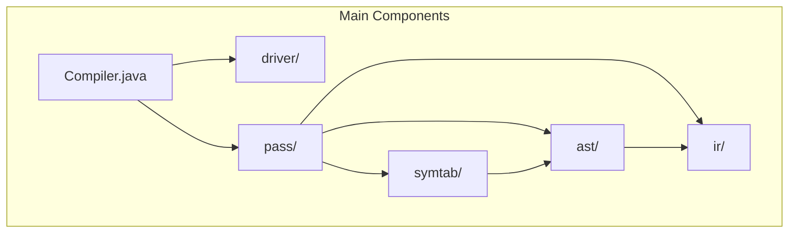
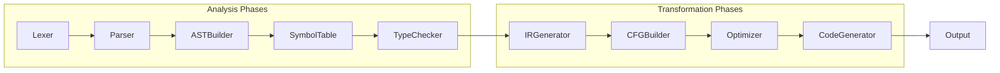
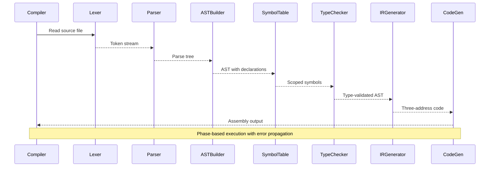
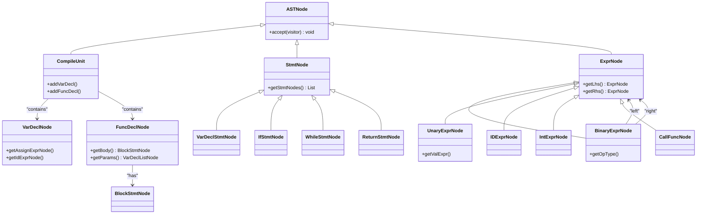
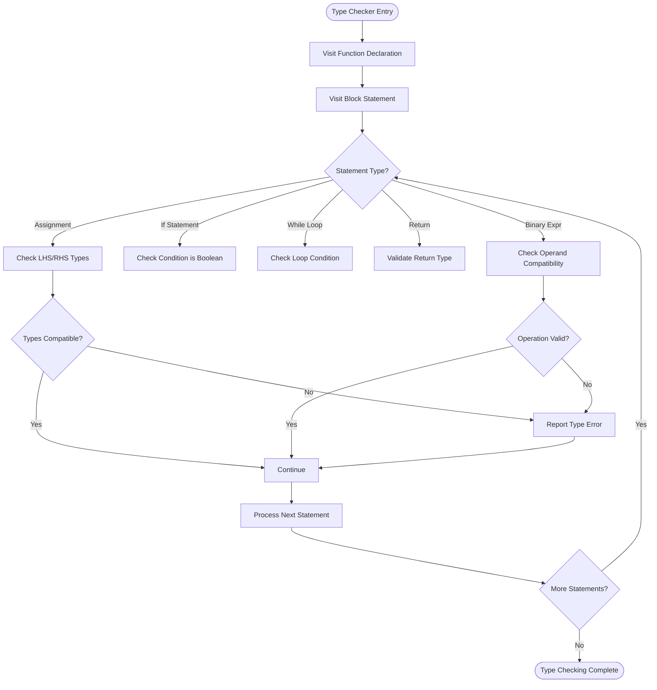
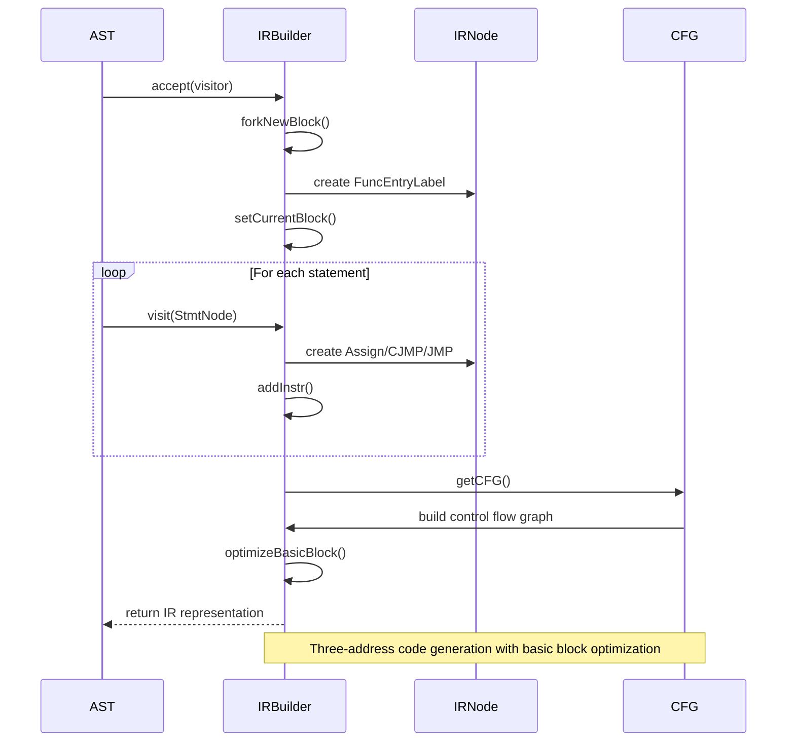

# Compiler Architecture

<cite>
**Referenced Files in This Document**   
- [Compiler.java](file://ep20/src/main/java/org/teachfx/antlr4/ep20/Compiler.java)
- [Phase.java](file://ep20/src/main/java/org/teachfx/antlr4/ep20/driver/Phase.java)
- [CymbolASTBuilder.java](file://ep20/src/main/java/org/teachfx/antlr4/ep20/pass/ast/CymbolASTBuilder.java)
- [TypeChecker.java](file://ep20/src/main/java/org/teachfx/antlr4/ep20/pass/sematic/TypeChecker.java)
- [CymbolIRBuilder.java](file://ep20/src/main/java/org/teachfx/antlr4/ep20/pass/ir/CymbolIRBuilder.java)
</cite>

## Table of Contents
1. [Introduction](#introduction)
2. [Project Structure](#project-structure)
3. [Core Components](#core-components)
4. [Architecture Overview](#architecture-overview)
5. [Detailed Component Analysis](#detailed-component-analysis)
6. [Dependency Analysis](#dependency-analysis)
7. [Performance Considerations](#performance-considerations)
8. [Troubleshooting Guide](#troubleshooting-guide)
9. [Conclusion](#conclusion)

## Introduction
This document provides comprehensive architectural documentation for a modular compiler framework implemented using ANTLR4. The system follows a phase-based pipeline architecture that transforms source code through distinct compilation stages: lexical analysis, parsing, abstract syntax tree (AST) construction, semantic analysis, intermediate representation (IR) generation, control flow analysis, optimization, and code generation. The design emphasizes modularity, extensibility, and clear separation of concerns between compilation phases. Key design patterns including Visitor, Composite, and Strategy are employed throughout the codebase to enable flexible traversal, manipulation, and transformation of program structures.

## Project Structure
The compiler framework is organized into a hierarchical package structure that reflects the modular pipeline architecture. Each major compilation phase is encapsulated within dedicated packages, promoting separation of concerns and maintainability.



**Diagram sources**
- [Compiler.java](file://ep20/src/main/java/org/teachfx/antlr4/ep20/Compiler.java)
- [CymbolASTBuilder.java](file://ep20/src/main/java/org/teachfx/antlr4/ep20/pass/ast/CymbolASTBuilder.java)

**Section sources**
- [Compiler.java](file://ep20/src/main/java/org/teachfx/antlr4/ep20/Compiler.java)
- [Phase.java](file://ep20/src/main/java/org/teachfx/antlr4/ep20/driver/Phase.java)

## Core Components
The compiler framework consists of several core components that work together in a pipeline fashion to transform source code into executable output. The primary components include the lexer and parser (generated by ANTLR4), AST builder, symbol table manager, type checker, IR generator, CFG builder, optimizer, and code generator. These components interact through well-defined interfaces and follow a strict phase-based execution model where each phase consumes the output of the previous phase. Error propagation is handled systematically through optional return types and error reporting mechanisms that allow the compiler to continue processing after encountering non-fatal errors.

**Section sources**
- [Compiler.java](file://ep20/src/main/java/org/teachfx/antlr4/ep20/Compiler.java)
- [CymbolASTBuilder.java](file://ep20/src/main/java/org/teachfx/antlr4/ep20/pass/ast/CymbolASTBuilder.java)
- [TypeChecker.java](file://ep20/src/main/java/org/teachfx/antlr4/ep20/pass/sematic/TypeChecker.java)

## Architecture Overview
The compiler implements a modular pipeline architecture where source code is progressively transformed through a series of discrete phases. Each phase performs a specific transformation or analysis task and passes its results to the subsequent phase. This design enables clear separation of concerns, facilitates debugging, and allows for easy extension with additional optimization passes or analysis tools.



**Diagram sources**
- [Compiler.java](file://ep20/src/main/java/org/teachfx/antlr4/ep20/Compiler.java)
- [CymbolIRBuilder.java](file://ep20/src/main/java/org/teachfx/antlr4/ep20/pass/ir/CymbolIRBuilder.java)

## Detailed Component Analysis

### Compilation Pipeline Analysis
The compiler's execution follows a well-defined sequence of phases, each responsible for a specific aspect of code processing. The pipeline begins with lexical and syntactic analysis, proceeds through semantic analysis and intermediate representation generation, and concludes with code generation.

#### Compilation Phase Sequence


**Diagram sources**
- [Compiler.java](file://ep20/src/main/java/org/teachfx/antlr4/ep20/Compiler.java)
- [Phase.java](file://ep20/src/main/java/org/teachfx/antlr4/ep20/driver/Phase.java)

**Section sources**
- [Compiler.java](file://ep20/src/main/java/org/teachfx/antlr4/ep20/Compiler.java)
- [Phase.java](file://ep20/src/main/java/org/teachfx/antlr4/ep20/driver/Phase.java)

### AST Component Analysis
The Abstract Syntax Tree (AST) component serves as the central data structure that represents the syntactic structure of the source program. The implementation follows the Composite design pattern, with a hierarchy of node types that can be uniformly traversed using the Visitor pattern.

#### AST Class Hierarchy


**Diagram sources**
- [CymbolASTBuilder.java](file://ep20/src/main/java/org/teachfx/antlr4/ep20/pass/ast/CymbolASTBuilder.java)
- [ASTNode.java](file://ep20/src/main/java/org/teachfx/antlr4/ep20/ast/ASTNode.java)

**Section sources**
- [CymbolASTBuilder.java](file://ep20/src/main/java/org/teachfx/antlr4/ep20/pass/ast/CymbolASTBuilder.java)
- [ASTNode.java](file://ep20/src/main/java/org/teachfx/antlr4/ep20/ast/ASTNode.java)

### Semantic Analysis Component
The semantic analysis phase ensures that the program is meaningful and type-correct according to the language's rules. This includes symbol resolution, type checking, and scope management. The implementation uses the Visitor pattern to traverse the AST and perform semantic checks.

#### Type Checking Flow


**Diagram sources**
- [TypeChecker.java](file://ep20/src/main/java/org/teachfx/antlr4/ep20/pass/sematic/TypeChecker.java)
- [ASTBaseVisitor.java](file://ep20/src/main/java/org/teachfx/antlr4/ep20/pass/ast/ASTBaseVisitor.java)

**Section sources**
- [TypeChecker.java](file://ep20/src/main/java/org/teachfx/antlr4/ep20/pass/sematic/TypeChecker.java)
- [ASTBaseVisitor.java](file://ep20/src/main/java/org/teachfx/antlr4/ep20/pass/ast/ASTBaseVisitor.java)

### IR Generation Component
The Intermediate Representation (IR) generator transforms the high-level AST into a lower-level, platform-independent representation suitable for optimization and code generation. The IR uses a three-address code format with basic blocks and control flow instructions.

#### IR Generation Process


**Diagram sources**
- [CymbolIRBuilder.java](file://ep20/src/main/java/org/teachfx/antlr4/ep20/pass/ir/CymbolIRBuilder.java)
- [LinearIRBlock.java](file://ep20/src/main/java/org/teachfx/antlr4/ep20/pass/cfg/LinearIRBlock.java)

**Section sources**
- [CymbolIRBuilder.java](file://ep20/src/main/java/org/teachfx/antlr4/ep20/pass/ir/CymbolIRBuilder.java)
- [Prog.java](file://ep20/src/main/java/org/teachfx/antlr4/ep20/ir/Prog.java)

## Dependency Analysis
The compiler framework exhibits a well-structured dependency graph that enforces the phase-based pipeline architecture. Dependencies flow primarily in one direction from earlier to later compilation phases, preventing circular dependencies and maintaining clear separation of concerns.

```mermaid
graph TD
Compiler --> Phase
Compiler --> CymbolASTBuilder
Compiler --> TypeChecker
Compiler --> CymbolIRBuilder
Compiler --> CymbolAssembler
CymbolASTBuilder --> ASTNode
CymbolASTBuilder --> TypeNode
CymbolASTBuilder --> VariableSymbol
TypeChecker --> ASTNode
TypeChecker --> ASTBaseVisitor
CymbolIRBuilder --> IRNode
CymbolIRBuilder --> Prog
CymbolIRBuilder --> CFGBuilder
CymbolIRBuilder --> FrameSlot
CymbolIRBuilder --> OperandSlot
CymbolAssembler --> IRNode
CymbolAssembler --> BytecodeDefinition
Style Compiler fill:#f9f,stroke:#333
Style Phase fill:#bbf,stroke:#333
Style CymbolASTBuilder fill:#f96,stroke:#333
Style TypeChecker fill:#6f9,stroke:#333
Style CymbolIRBuilder fill:#96f,stroke:#333
```

**Diagram sources**
- [Compiler.java](file://ep20/src/main/java/org/teachfx/antlr4/ep20/Compiler.java)
- [CymbolASTBuilder.java](file://ep20/src/main/java/org/teachfx/antlr4/ep20/pass/ast/CymbolASTBuilder.java)
- [TypeChecker.java](file://ep20/src/main/java/org/teachfx/antlr4/ep20/pass/sematic/TypeChecker.java)
- [CymbolIRBuilder.java](file://ep20/src/main/java/org/teachfx/antlr4/ep20/pass/ir/CymbolIRBuilder.java)

**Section sources**
- [Compiler.java](file://ep20/src/main/java/org/teachfx/antlr4/ep20/Compiler.java)
- [Phase.java](file://ep20/src/main/java/org/teachfx/antlr4/ep20/driver/Phase.java)

## Performance Considerations
The compiler framework incorporates several performance optimizations to ensure efficient processing of source code. The IR generation phase includes basic block optimization that eliminates redundant instructions and improves code density. The use of stack-based operand management in the IR builder reduces memory allocation overhead during code generation. The modular design allows for incremental compilation and caching of intermediate results, which can significantly improve build times for large codebases. The visitor pattern implementation avoids recursive descent parsing overhead by leveraging ANTLR4's efficient parse tree traversal mechanisms.

## Troubleshooting Guide
When diagnosing issues in the compiler framework, begin by examining the phase-based execution flow and error reporting mechanisms. Common issues include type mismatches in expressions, undefined symbol references, and control flow anomalies in generated IR. The logging system provides detailed trace information for each compilation phase, which can be enabled to track the progression of AST nodes through the pipeline. For semantic analysis issues, verify that symbol definitions are properly resolved in the appropriate scope. For code generation problems, inspect the intermediate representation and control flow graphs to identify structural issues in the generated code.

**Section sources**
- [Compiler.java](file://ep20/src/main/java/org/teachfx/antlr4/ep20/Compiler.java)
- [CymbolIRBuilder.java](file://ep20/src/main/java/org/teachfx/antlr4/ep20/pass/ir/CymbolIRBuilder.java)
- [TypeChecker.java](file://ep20/src/main/java/org/teachfx/antlr4/ep20/pass/sematic/TypeChecker.java)

## Conclusion
The compiler framework demonstrates a robust implementation of a modular pipeline architecture for language processing. By organizing compilation into distinct phases with well-defined interfaces, the design achieves excellent separation of concerns and extensibility. The strategic use of design patterns such as Visitor, Composite, and Builder enables flexible traversal and manipulation of program structures. The phase-based execution model with systematic error propagation ensures reliable processing of source code. The framework's modular design facilitates the addition of new language features and optimization passes, making it adaptable to evolving requirements. Future enhancements could include advanced optimization techniques, parallel compilation, and improved error recovery mechanisms.