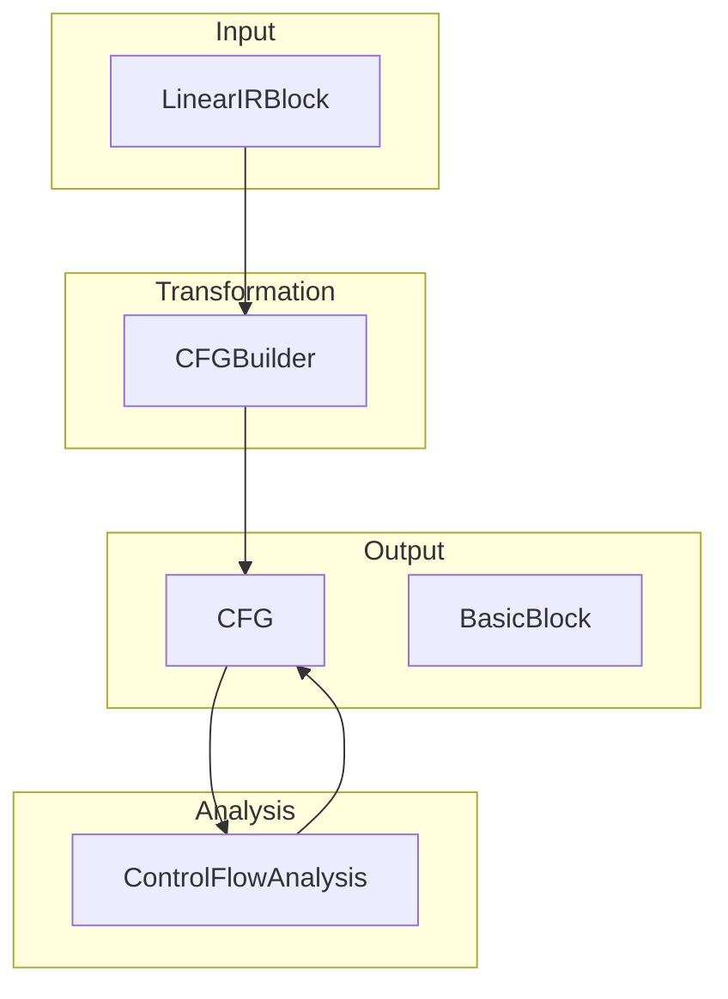
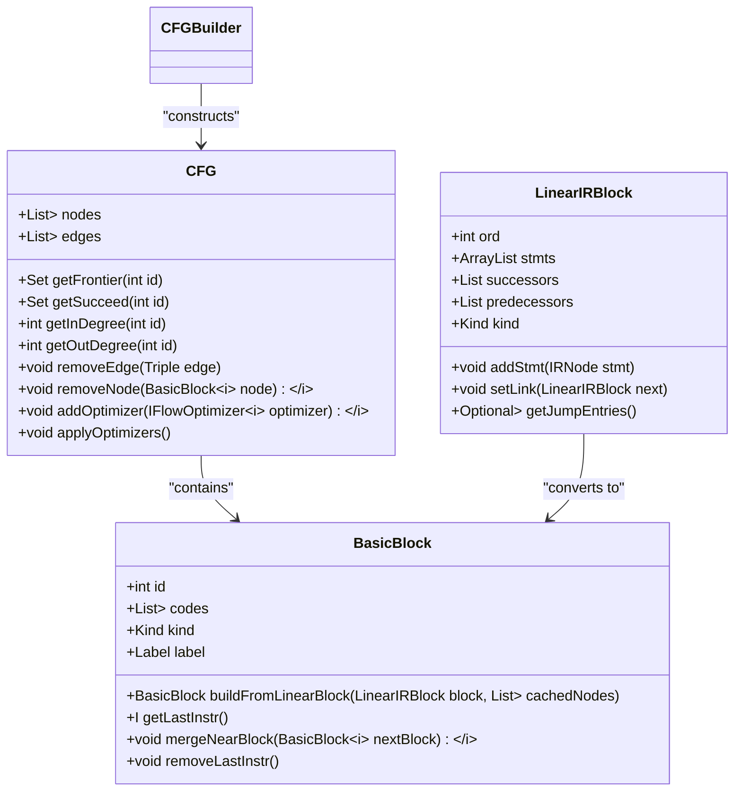
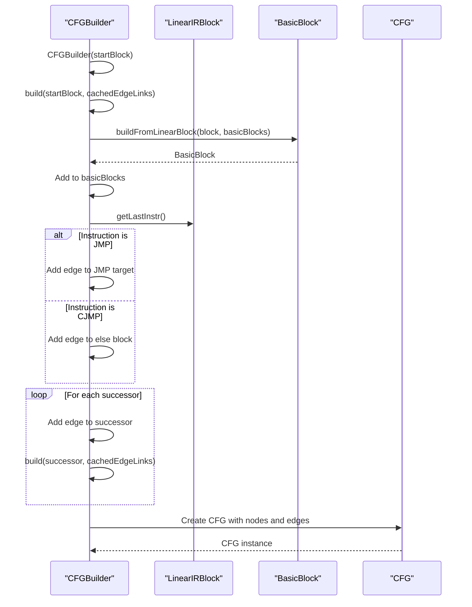
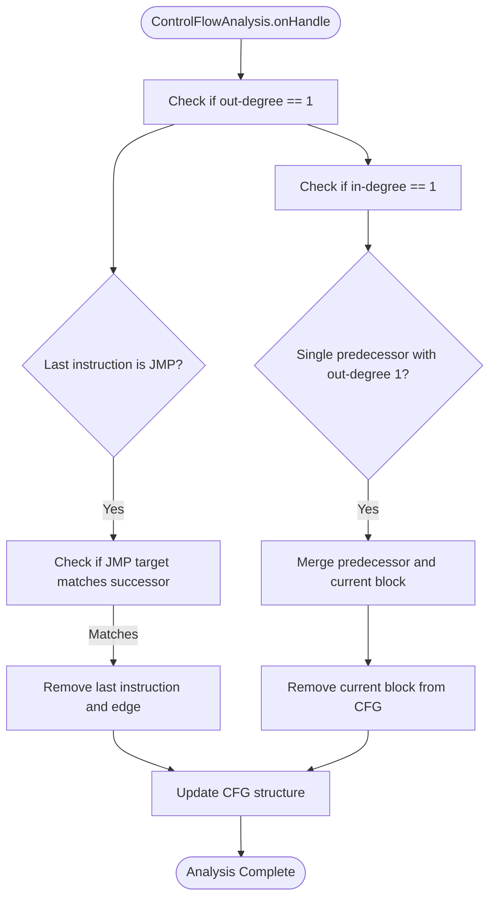
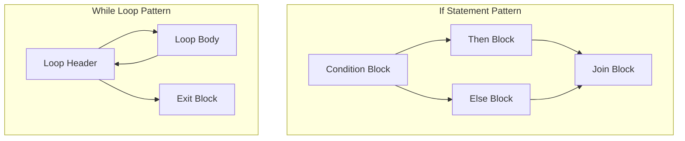

# Control Flow Analysis and CFG

<cite>
**Referenced Files in This Document**   
- [CFG.java](file://ep20/src/main/java/org/teachfx/antlr4/ep20/pass/cfg/CFG.java)
- [CFGBuilder.java](file://ep20/src/main/java/org/teachfx/antlr4/ep20/pass/cfg/CFGBuilder.java)
- [ControlFlowAnalysis.java](file://ep20/src/main/java/org/teachfx/antlr4/ep20/pass/cfg/ControlFlowAnalysis.java)
- [BasicBlock.java](file://ep20/src/main/java/org/teachfx/antlr4/ep20/pass/cfg/BasicBlock.java)
- [LinearIRBlock.java](file://ep20/src/main/java/org/teachfx/antlr4/ep20/pass/cfg/LinearIRBlock.java)
- [Loc.java](file://ep20/src/main/java/org/teachfx/antlr4/ep20/pass/cfg/Loc.java)
</cite>

## Table of Contents
1. [Introduction](#introduction)
2. [Core Components](#core-components)
3. [Architecture Overview](#architecture-overview)
4. [Detailed Component Analysis](#detailed-component-analysis)
5. [Control Flow Graph Construction Algorithm](#control-flow-graph-construction-algorithm)
6. [Data Flow Analysis and Optimization](#data-flow-analysis-and-optimization)
7. [Control Structure Patterns](#control-structure-patterns)
8. [Special Control Flow Considerations](#special-control-flow-considerations)
9. [Advanced Analyses Enabled by CFG](#advanced-analyses-enabled-by-cfg)
10. [Conclusion](#conclusion)

## Introduction
The Control Flow Analysis system transforms linear intermediate representation (IR) code into a structured Control Flow Graph (CFG) that enables sophisticated program analysis and optimization. This documentation details how the CFG component analyzes program structure, identifies basic blocks, establishes control flow relationships, and performs data flow analysis to support compiler optimizations. The system is designed to accurately represent complex control structures while enabling advanced analyses like liveness and reachability.

## Core Components

The control flow analysis system consists of several key components that work together to transform linear IR into a structured CFG and perform subsequent analyses. The primary classes include CFG for representing the overall graph structure, CFGBuilder for constructing the graph from linear IR, ControlFlowAnalysis for performing data flow optimizations, BasicBlock for representing individual basic blocks, LinearIRBlock as the input representation, and Loc for tracking individual instructions within blocks.

**Section sources**
- [CFG.java](file://ep20/src/main/java/org/teachfx/antlr4/ep20/pass/cfg/CFG.java#L1-L158)
- [CFGBuilder.java](file://ep20/src/main/java/org/teachfx/antlr4/ep20/pass/cfg/CFGBuilder.java#L1-L63)
- [ControlFlowAnalysis.java](file://ep20/src/main/java/org/teachfx/antlr4/ep20/pass/cfg/ControlFlowAnalysis.java#L1-L68)

## Architecture Overview

The control flow analysis architecture follows a pipeline approach where linear IR is transformed into a CFG, which is then optimized through data flow analysis. The process begins with LinearIRBlock objects that represent sequences of IR instructions, which are then converted into BasicBlock nodes connected by control flow edges in the CFG structure.

**Diagram sources **
- [CFG.java](file://ep20/src/main/java/org/teachfx/antlr4/ep20/pass/cfg/CFG.java#L1-L158)
- [CFGBuilder.java](file://ep20/src/main/java/org/teachfx/antlr4/ep20/pass/cfg/CFGBuilder.java#L1-L63)
- [ControlFlowAnalysis.java](file://ep20/src/main/java/org/teachfx/antlr4/ep20/pass/cfg/ControlFlowAnalysis.java#L1-L68)

## Detailed Component Analysis

### CFG Class Analysis
The CFG class represents the complete control flow graph as a collection of BasicBlock nodes connected by directed edges. It maintains the graph structure through adjacency lists that track predecessor and successor relationships, enabling efficient traversal and analysis of the control flow.

**Diagram sources **
- [CFG.java](file://ep20/src/main/java/org/teachfx/antlr4/ep20/pass/cfg/CFG.java#L1-L158)
- [BasicBlock.java](file://ep20/src/main/java/org/teachfx/antlr4/ep20/pass/cfg/BasicBlock.java#L1-L130)
- [LinearIRBlock.java](file://ep20/src/main/java/org/teachfx/antlr4/ep20/pass/cfg/LinearIRBlock.java#L1-L236)

**Section sources**
- [CFG.java](file://ep20/src/main/java/org/teachfx/antlr4/ep20/pass/cfg/CFG.java#L1-L158)
- [BasicBlock.java](file://ep20/src/main/java/org/teachfx/antlr4/ep20/pass/cfg/BasicBlock.java#L1-L130)

### CFGBuilder Class Analysis
The CFGBuilder class is responsible for transforming linear IR blocks into a structured control flow graph. It recursively processes LinearIRBlock objects, creating BasicBlock nodes and establishing control flow edges based on jump instructions and successor relationships.

**Diagram sources **
- [CFGBuilder.java](file://ep20/src/main/java/org/teachfx/antlr4/ep20/pass/cfg/CFGBuilder.java#L1-L63)
- [LinearIRBlock.java](file://ep20/src/main/java/org/teachfx/antlr4/ep20/pass/cfg/LinearIRBlock.java#L1-L236)
- [BasicBlock.java](file://ep20/src/main/java/org/teachfx/antlr4/ep20/pass/cfg/BasicBlock.java#L1-L130)

**Section sources**
- [CFGBuilder.java](file://ep20/src/main/java/org/teachfx/antlr4/ep20/pass/cfg/CFGBuilder.java#L1-L63)
- [LinearIRBlock.java](file://ep20/src/main/java/org/teachfx/antlr4/ep20/pass/cfg/LinearIRBlock.java#L1-L236)

### ControlFlowAnalysis Class Analysis
The ControlFlowAnalysis class implements optimization passes on the constructed CFG, focusing on simplifying the control flow structure by removing redundant jumps and merging basic blocks.

**Diagram sources **
- [ControlFlowAnalysis.java](file://ep20/src/main/java/org/teachfx/antlr4/ep20/pass/cfg/ControlFlowAnalysis.java#L1-L68)
- [CFG.java](file://ep20/src/main/java/org/teachfx/antlr4/ep20/pass/cfg/CFG.java#L1-L158)
- [BasicBlock.java](file://ep20/src/main/java/org/teachfx/antlr4/ep20/pass/cfg/BasicBlock.java#L1-L130)

**Section sources**
- [ControlFlowAnalysis.java](file://ep20/src/main/java/org/teachfx/antlr4/ep20/pass/cfg/ControlFlowAnalysis.java#L1-L68)
- [CFG.java](file://ep20/src/main/java/org/teachfx/antlr4/ep20/pass/cfg/CFG.java#L1-L158)

## Control Flow Graph Construction Algorithm

The CFG construction algorithm follows a systematic process to transform linear IR into a structured control flow graph. The algorithm begins by identifying leaders in the linear instruction sequence, which are instructions that can be the target of a jump or are the first instruction in a function. Each leader marks the beginning of a new basic block.

The construction process involves several key steps: first, the algorithm traverses the linear IR blocks to identify natural boundaries based on control flow instructions (JMP, CJMP, return). Then, it creates BasicBlock objects from LinearIRBlock instances, preserving the instruction sequence within each block. Finally, it establishes edges between blocks by analyzing jump targets and successor relationships.

The algorithm handles edge cases such as empty blocks and ensures that all control flow paths are properly represented in the resulting graph. It uses a recursive approach to process all reachable blocks from the entry point, ensuring comprehensive coverage of the program's control flow.

**Section sources**
- [CFGBuilder.java](file://ep20/src/main/java/org/teachfx/antlr4/ep20/pass/cfg/CFGBuilder.java#L1-L63)
- [LinearIRBlock.java](file://ep20/src/main/java/org/teachfx/antlr4/ep20/pass/cfg/LinearIRBlock.java#L1-L236)
- [BasicBlock.java](file://ep20/src/main/java/org/teachfx/antlr4/ep20/pass/cfg/BasicBlock.java#L1-L130)

## Data Flow Analysis and Optimization

The ControlFlowAnalysis component performs data flow optimization on the constructed CFG to simplify the control flow structure and enable further optimizations. The analysis follows a two-phase approach: first, it eliminates redundant jump instructions, and second, it merges basic blocks to reduce graph complexity.

The optimization algorithm identifies jump instructions that directly transfer control to the next sequential block and removes these redundant jumps. It also merges basic blocks when a block has a single predecessor that itself has only one successor, effectively inlining the control flow. This optimization reduces the number of nodes in the CFG and simplifies the overall structure, making subsequent analyses more efficient.

The data flow analysis maintains the semantic correctness of the program while improving its structural properties. By removing unnecessary control flow edges and merging blocks, the optimizer creates a cleaner representation that better reflects the actual program logic.

**Section sources**
- [ControlFlowAnalysis.java](file://ep20/src/main/java/org/teachfx/antlr4/ep20/pass/cfg/ControlFlowAnalysis.java#L1-L68)
- [CFG.java](file://ep20/src/main/java/org/teachfx/antlr4/ep20/pass/cfg/CFG.java#L1-L158)
- [BasicBlock.java](file://ep20/src/main/java/org/teachfx/antlr4/ep20/pass/cfg/BasicBlock.java#L1-L130)

## Control Structure Patterns

The CFG construction algorithm generates distinct patterns for different control structures, accurately representing the program's logic flow. For conditional statements (if), the algorithm creates a diamond pattern with a decision block branching to two successor blocks (then and else), which later converge at a join point.

For loops (while), the CFG shows a loop structure with a header block containing the loop condition, a body block, and a back edge from the body to the header. This pattern clearly identifies the loop structure and enables loop-specific optimizations.

Return statements create terminal blocks with no successors, properly representing function exit points. The algorithm ensures that all control flow paths are properly terminated and that the CFG accurately reflects the program's execution possibilities.

**Diagram sources **
- [CFGBuilder.java](file://ep20/src/main/java/org/teachfx/antlr4/ep20/pass/cfg/CFGBuilder.java#L1-L63)
- [LinearIRBlock.java](file://ep20/src/main/java/org/teachfx/antlr4/ep20/pass/cfg/LinearIRBlock.java#L1-L236)
- [ControlFlowAnalysis.java](file://ep20/src/main/java/org/teachfx/antlr4/ep20/pass/cfg/ControlFlowAnalysis.java#L1-L68)

## Special Control Flow Considerations

The CFG system handles several special control flow scenarios, including entry and exit blocks, exception handling paths, and unreachable code detection. The entry block is identified as the first block in the function, typically containing the function entry label. Exit blocks are those that contain return instructions or are the natural end of execution flow.

Exception handling paths are represented through special edges that connect try blocks to catch handlers, preserving the exception propagation semantics. The system can identify these paths by analyzing special exception-related instructions in the IR.

Unreachable code detection is performed by analyzing the connectivity of the CFG. Blocks that have no incoming edges (except the entry block) or cannot be reached through any execution path are identified as unreachable. This information is valuable for dead code elimination and program analysis.

The CFG representation also supports advanced features like dominance analysis, which is crucial for optimizations such as placing phi functions in SSA form.

**Section sources**
- [CFG.java](file://ep20/src/main/java/org/teachfx/antlr4/ep20/pass/cfg/CFG.java#L1-L158)
- [LinearIRBlock.java](file://ep20/src/main/java/org/teachfx/antlr4/ep20/pass/cfg/LinearIRBlock.java#L1-L236)
- [ControlFlowAnalysis.java](file://ep20/src/main/java/org/teachfx/antlr4/ep20/pass/cfg/ControlFlowAnalysis.java#L1-L68)

## Advanced Analyses Enabled by CFG

The structured CFG enables several advanced program analyses that are essential for compiler optimizations. Liveness analysis determines which variables are live (will be used) at each program point, enabling efficient register allocation and dead store elimination.

Reachability analysis identifies code that can never be executed, allowing for dead code elimination. The CFG structure makes it straightforward to perform this analysis by determining which blocks are unreachable from the entry point.

Other analyses enabled by the CFG include dominance analysis (determining which blocks dominate others), loop detection (identifying natural loops in the control flow), and call graph construction (when extended to interprocedural analysis). These analyses form the foundation for sophisticated optimizations like loop invariant code motion, strength reduction, and function inlining.

The modular design of the CFG system allows additional analysis passes to be easily integrated, making it a flexible platform for implementing various program analyses.

**Section sources**
- [ControlFlowAnalysis.java](file://ep20/src/main/java/org/teachfx/antlr4/ep20/pass/cfg/ControlFlowAnalysis.java#L1-L68)
- [CFG.java](file://ep20/src/main/java/org/teachfx/antlr4/ep20/pass/cfg/CFG.java#L1-L158)
- [BasicBlock.java](file://ep20/src/main/java/org/teachfx/antlr4/ep20/pass/cfg/BasicBlock.java#L1-L130)

## Conclusion

The Control Flow Analysis system provides a robust foundation for program analysis and optimization by transforming linear IR into a structured Control Flow Graph. The system accurately represents program control flow through BasicBlock nodes connected by directed edges, enabling sophisticated analyses and optimizations. The CFG construction algorithm systematically processes linear IR blocks, identifying leaders and establishing proper control flow relationships. The subsequent data flow analysis simplifies the graph structure by eliminating redundant jumps and merging blocks, creating a cleaner representation for further processing. This architecture supports advanced analyses like liveness and reachability, forming the basis for effective compiler optimizations.