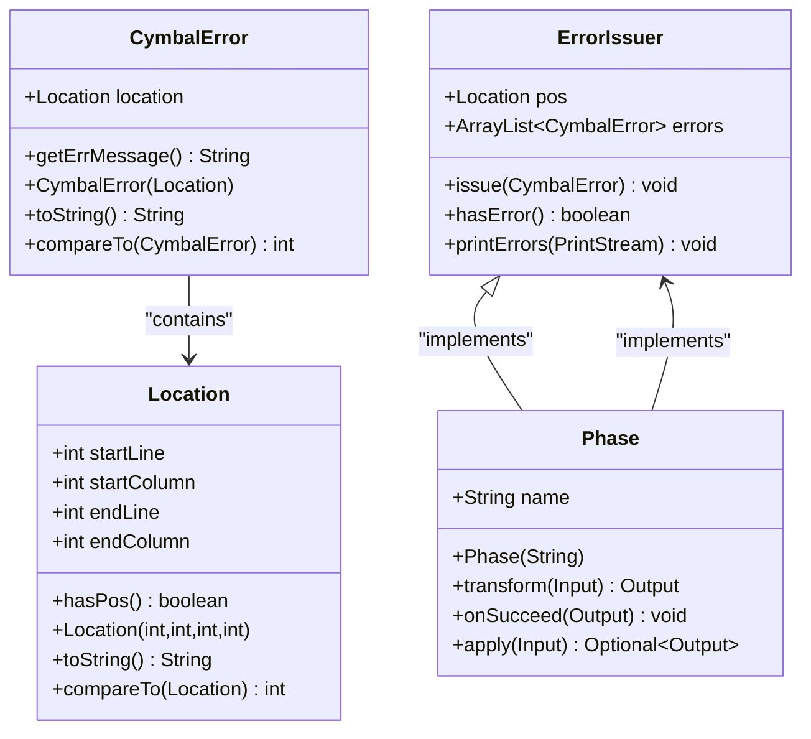
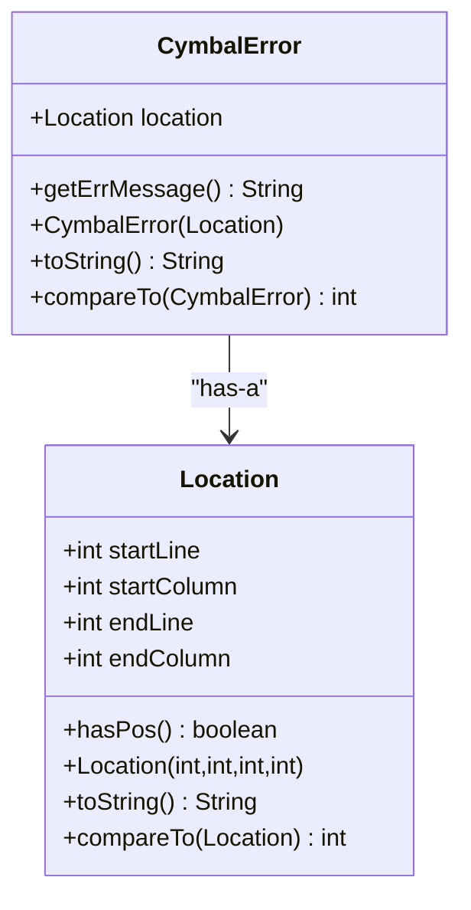
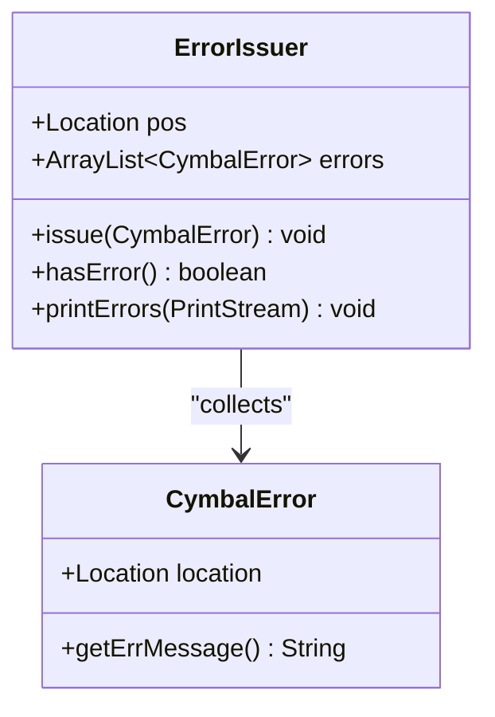
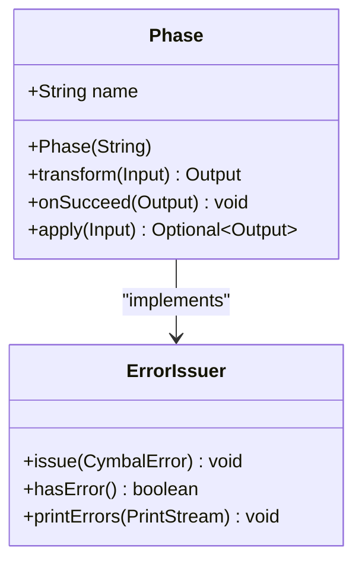
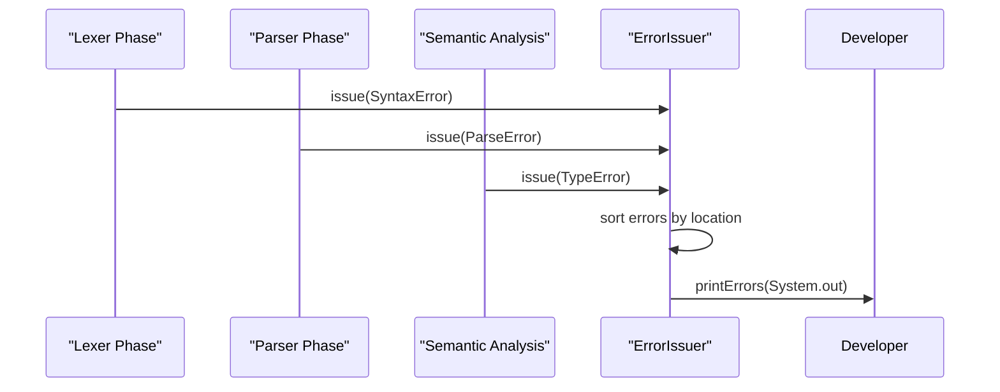
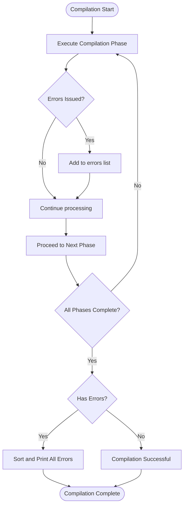

# Error Handling and Diagnostics

<cite>
**Referenced Files in This Document**   
- [CymbalError.java](file://ep20/src/main/java/org/teachfx/antlr4/ep20/error/CymbalError.java)
- [ErrorIssuer.java](file://ep20/src/main/java/org/teachfx/antlr4/ep20/driver/ErrorIssuer.java)
- [Phase.java](file://ep20/src/main/java/org/teachfx/antlr4/ep20/driver/Phase.java)
- [Location.java](file://ep20/src/main/java/org/teachfx/antlr4/ep20/parser/Location.java)
</cite>

## Table of Contents
1. [Introduction](#introduction)
2. [Core Components](#core-components)
3. [Error Representation with CymbalError](#error-representation-with-cymbalerror)
4. [Error Collection and Reporting with ErrorIssuer](#error-collection-and-reporting-with-errorissuer)
5. [Compilation Phases and Phase-Specific Error Handling](#compilation-phases-and-phase-specific-error-handling)
6. [Error Propagation Across Compilation Phases](#error-propagation-across-compilation-phases)
7. [Error Recovery Strategies](#error-recovery-strategies)
8. [Diagnostic Information Formatting and Integration](#diagnostic-information-formatting-and-integration)
9. [Conclusion](#conclusion)

## Introduction
The error handling and diagnostics system in the Cymbal compiler is designed to provide comprehensive, structured, and user-friendly error reporting throughout the compilation process. This system enables developers to quickly identify and resolve issues in their code by providing precise error locations, descriptive messages, and context about the compilation phase where errors occur. The architecture is built around three core components: CymbalError for representing individual errors, ErrorIssuer for collecting and reporting errors, and Phase for managing compilation stages with integrated error handling.

**Section sources**
- [CymbalError.java](file://ep20/src/main/java/org/teachfx/antlr4/ep20/error/CymbalError.java)
- [ErrorIssuer.java](file://ep20/src/main/java/org/teachfx/antlr4/ep20/driver/ErrorIssuer.java)
- [Phase.java](file://ep20/src/main/java/org/teachfx/antlr4/ep20/driver/Phase.java)

## Core Components
The error handling system consists of four primary components that work together to provide robust diagnostics: CymbalError, ErrorIssuer, Phase, and Location. These components form a cohesive framework that captures compilation errors with rich contextual information, manages error collection across different compilation stages, and provides mechanisms for error reporting and recovery.



**Diagram sources**
- [CymbalError.java](file://ep20/src/main/java/org/teachfx/antlr4/ep20/error/CymbalError.java)
- [ErrorIssuer.java](file://ep20/src/main/java/org/teachfx/antlr4/ep20/driver/ErrorIssuer.java)
- [Phase.java](file://ep20/src/main/java/org/teachfx/antlr4/ep20/driver/Phase.java)
- [Location.java](file://ep20/src/main/java/org/teachfx/antlr4/ep20/parser/Location.java)

**Section sources**
- [CymbalError.java](file://ep20/src/main/java/org/teachfx/antlr4/ep20/error/CymbalError.java)
- [ErrorIssuer.java](file://ep20/src/main/java/org/teachfx/antlr4/ep20/driver/ErrorIssuer.java)
- [Phase.java](file://ep20/src/main/java/org/teachfx/antlr4/ep20/driver/Phase.java)
- [Location.java](file://ep20/src/main/java/org/teachfx/antlr4/ep20/parser/Location.java)

## Error Representation with CymbalError
The CymbalError class serves as the foundation for error representation in the compiler, providing a structured way to capture compilation errors with essential diagnostic information. As an abstract class, it defines the common interface for all specific error types while encapsulating location information and error message generation.

CymbalError instances contain a Location object that precisely identifies where in the source code the error occurred, including start and end line numbers and column positions. The class implements the Comparable interface to enable sorting of errors by their position in the source code, ensuring that errors are reported in a logical order that follows the code's structure.

The abstract getErrMessage() method requires concrete error subclasses to provide descriptive error messages, while the toString() method combines the location information with the error message to produce a human-readable diagnostic output. When location information is available, the output includes the specific line and column range; otherwise, it provides a generic error indication.



**Diagram sources**
- [CymbalError.java](file://ep20/src/main/java/org/teachfx/antlr4/ep20/error/CymbalError.java)
- [Location.java](file://ep20/src/main/java/org/teachfx/antlr4/ep20/parser/Location.java)

**Section sources**
- [CymbalError.java](file://ep20/src/main/java/org/teachfx/antlr4/ep20/error/CymbalError.java)
- [Location.java](file://ep20/src/main/java/org/teachfx/antlr4/ep20/parser/Location.java)

## Error Collection and Reporting with ErrorIssuer
The ErrorIssuer interface provides a standardized mechanism for collecting and reporting compilation errors across different components of the compiler. It acts as a central error repository that can be implemented by various compiler components to ensure consistent error handling.

ErrorIssuer maintains an ArrayList of CymbalError objects to store reported errors and provides three primary methods for error management: issue() to add new errors, hasError() to check if any errors have been collected, and printErrors() to output all collected errors in a sorted manner. The printErrors() method sorts errors by their location before printing, ensuring that diagnostic messages appear in the same order as they occur in the source code.

The interface includes a static pos field of type Location, which can be used to track the current position during compilation. This design allows any class that implements ErrorIssuer to immediately gain error collection capabilities without needing to implement the underlying storage and reporting mechanisms.



**Diagram sources**
- [ErrorIssuer.java](file://ep20/src/main/java/org/teachfx/antlr4/ep20/driver/ErrorIssuer.java)
- [CymbalError.java](file://ep20/src/main/java/org/teachfx/antlr4/ep20/error/CymbalError.java)

**Section sources**
- [ErrorIssuer.java](file://ep20/src/main/java/org/teachfx/antlr4/ep20/driver/ErrorIssuer.java)

## Compilation Phases and Phase-Specific Error Handling
The Phase class represents a fundamental building block of the compilation pipeline, encapsulating a specific stage of compilation while integrating error handling capabilities. By extending the ErrorIssuer interface, each Phase instance can collect errors that occur during its execution, creating a natural connection between compilation stages and error reporting.

Each Phase is parameterized with input and output types, reflecting the transformation it performs on the compilation data. The abstract transform() method defines the core functionality of the phase, while the apply() method provides a standardized execution wrapper that checks for errors after transformation. If errors are detected, apply() prints them to standard output and returns an empty Optional, signaling failure in the compilation pipeline.

The Phase class includes a name field to identify the compilation stage, which helps developers understand where in the compilation process an error occurred. The onSucceed() method provides a hook for post-processing when a phase completes successfully, allowing for phase-specific success handling.



**Diagram sources**
- [Phase.java](file://ep20/src/main/java/org/teachfx/antlr4/ep20/driver/Phase.java)
- [ErrorIssuer.java](file://ep20/src/main/java/org/teachfx/antlr4/ep20/driver/ErrorIssuer.java)

**Section sources**
- [Phase.java](file://ep20/src/main/java/org/teachfx/antlr4/ep20/driver/Phase.java)

## Error Propagation Across Compilation Phases
Errors are propagated through the compilation pipeline via the integrated error handling system that connects CymbalError, ErrorIssuer, and Phase components. When a compilation phase encounters an issue, it creates a CymbalError instance with appropriate location and message information, then issues it through the ErrorIssuer interface.

The Phase class's apply() method automatically checks for errors after executing the transform() method. If any errors have been issued, the method prints all collected errors and returns an empty Optional, effectively halting the compilation pipeline. This mechanism ensures that errors are not silently ignored while allowing multiple errors to be collected and reported before termination.

Location information is preserved throughout the error propagation process, enabling precise source code positioning. The Location class captures start and end line and column numbers, which are then included in the error output. This allows developers to quickly navigate to the exact location of each issue in their source code.



**Diagram sources**
- [Phase.java](file://ep20/src/main/java/org/teachfx/antlr4/ep20/driver/Phase.java)
- [ErrorIssuer.java](file://ep20/src/main/java/org/teachfx/antlr4/ep20/driver/ErrorIssuer.java)
- [CymbalError.java](file://ep20/src/main/java/org/teachfx/antlr4/ep20/error/CymbalError.java)

**Section sources**
- [Phase.java](file://ep20/src/main/java/org/teachfx/antlr4/ep20/driver/Phase.java)
- [ErrorIssuer.java](file://ep20/src/main/java/org/teachfx/antlr4/ep20/driver/ErrorIssuer.java)
- [CymbalError.java](file://ep20/src/main/java/org/teachfx/antlr4/ep20/error/CymbalError.java)

## Error Recovery Strategies
The compiler implements error recovery strategies that allow multiple errors to be reported in a single compilation run, rather than terminating after the first error is encountered. This approach significantly improves developer productivity by providing a comprehensive view of all issues in the code.

The error recovery mechanism is built into the Phase class's apply() method, which continues to execute the compilation pipeline even after errors are detected, as long as the data structures remain valid. While the method returns an empty Optional when errors are present, it does not throw exceptions that would terminate the process, allowing subsequent phases to potentially detect and report additional errors.

The ErrorIssuer's error collection approach enables this recovery strategy by accumulating all errors in an ArrayList rather than failing immediately. This design choice prioritizes comprehensive error reporting over strict fail-fast behavior, recognizing that developers often prefer to see all issues at once rather than fixing errors one at a time through iterative compilation.



**Diagram sources**
- [ErrorIssuer.java](file://ep20/src/main/java/org/teachfx/antlr4/ep20/driver/ErrorIssuer.java)
- [Phase.java](file://ep20/src/main/java/org/teachfx/antlr4/ep20/driver/Phase.java)

**Section sources**
- [ErrorIssuer.java](file://ep20/src/main/java/org/teachfx/antlr4/ep20/driver/ErrorIssuer.java)
- [Phase.java](file://ep20/src/main/java/org/teachfx/antlr4/ep20/driver/Phase.java)

## Diagnostic Information Formatting and Integration
Diagnostic information is formatted for optimal developer consumption through a combination of structured data and human-readable output. The CymbalError class's toString() method produces error messages in a consistent format that includes location information and descriptive text, making it easy to identify and understand issues.

Error messages follow the pattern "*** Error at Line X:Y-Z:W: [message]" when location information is available, or "*** Error: [message]" when it is not. This format clearly separates the error indicator from the descriptive message while providing precise source code positioning. The Location class formats position information to show line ranges when appropriate, such as "Line 5:10-15" for errors spanning multiple columns on the same line.

The system is designed to integrate seamlessly with IDEs and build tools through its standardized error reporting interface. The printErrors() method outputs to a PrintStream, allowing redirection to various output destinations, while the structured nature of CymbalError objects enables programmatic processing by external tools. The sorting of errors by location ensures that diagnostic output follows the natural reading order of the source code.

```mermaid
flowchart LR
A[CymbalError Instance] --> B{hasPos()?}
B --> |Yes| C["*** Error at Line X-Y:Z-W: message"]
B --> |No| D["*** Error: message"]
C --> E[PrintStream Output]
D --> E
E --> F[IDE Integration]
E --> G[Build Tool Integration]
E --> H[Console Output]
```

**Diagram sources**
- [CymbalError.java](file://ep20/src/main/java/org/teachfx/antlr4/ep20/error/CymbalError.java)
- [ErrorIssuer.java](file://ep20/src/main/java/org/teachfx/antlr4/ep20/driver/ErrorIssuer.java)

**Section sources**
- [CymbalError.java](file://ep20/src/main/java/org/teachfx/antlr4/ep20/error/CymbalError.java)
- [ErrorIssuer.java](file://ep20/src/main/java/org/teachfx/antlr4/ep20/driver/ErrorIssuer.java)

## Conclusion
The error handling and diagnostics system in the Cymbal compiler provides a robust framework for capturing, reporting, and managing compilation errors. By combining the CymbalError class for structured error representation, the ErrorIssuer interface for error collection, and the Phase class for phase-specific error handling, the system offers comprehensive diagnostic capabilities that enhance developer productivity.

The design enables precise error location reporting, supports error recovery to report multiple issues in a single compilation run, and provides clear, consistent diagnostic output. The integration of location tracking, error sorting, and standardized formatting ensures that developers receive actionable feedback that is easy to understand and act upon.

This architecture not only improves the usability of the compiler but also provides a solid foundation for future enhancements, such as more sophisticated error recovery strategies, enhanced IDE integration, and improved error message quality.