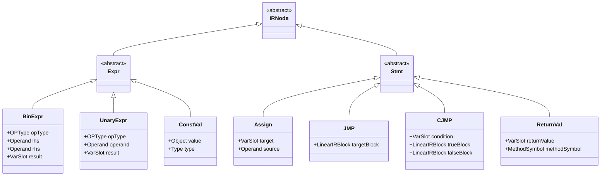
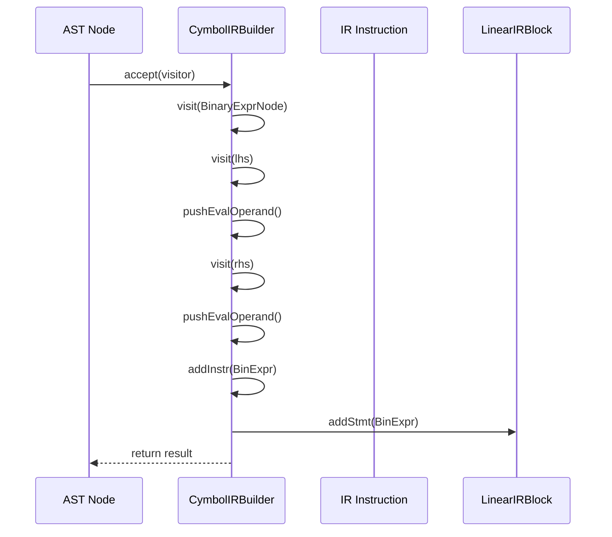
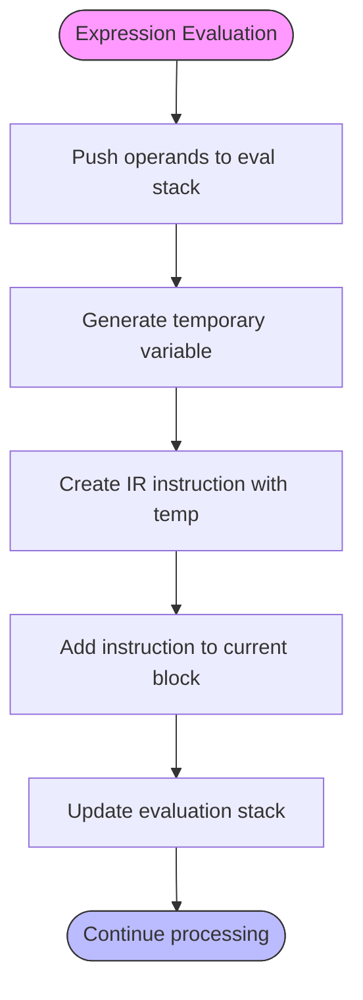
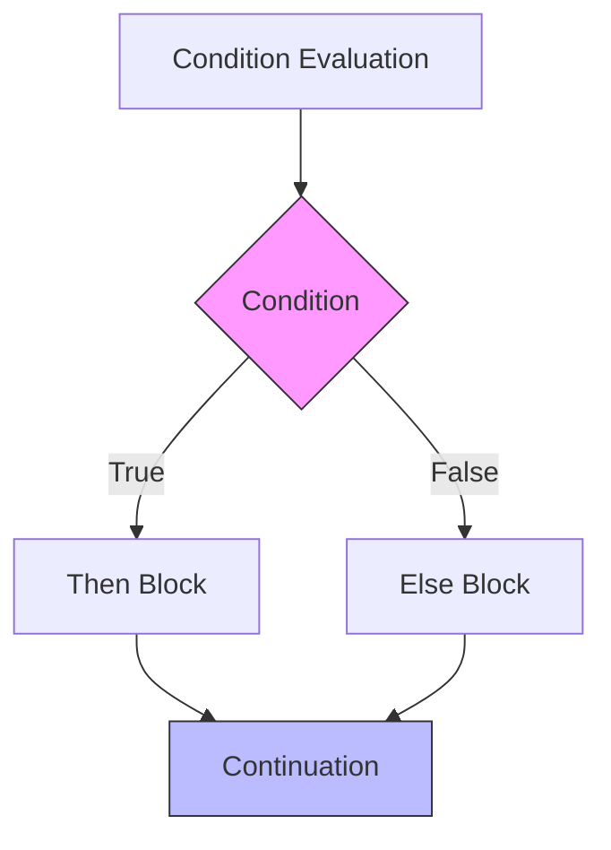
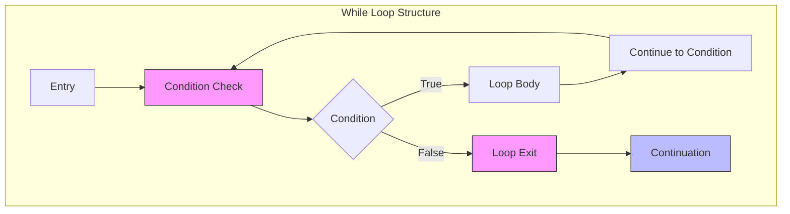

# Intermediate Representation (IR) Generation

<cite>
**Referenced Files in This Document**   
- [CymbolIRBuilder.java](file://ep20/src/main/java/org/teachfx/antlr4/ep20/pass/ir/CymbolIRBuilder.java)
- [IRNode.java](file://ep20/src/main/java/org/teachfx/antlr4/ep20/ir/IRNode.java)
- [BinExpr.java](file://ep20/src/main/java/org/teachfx/antlr4/ep20/ir/expr/arith/BinExpr.java)
- [UnaryExpr.java](file://ep20/src/main/java/org/teachfx/antlr4/ep20/ir/expr/arith/UnaryExpr.java)
- [ConstVal.java](file://ep20/src/main/java/org/teachfx/antlr4/ep20/ir/expr/val/ConstVal.java)
- [Assign.java](file://ep20/src/main/java/org/teachfx/antlr4/ep20/ir/stmt/Assign.java)
- [JMP.java](file://ep20/src/main/java/org/teachfx/antlr4/ep20/ir/stmt/JMP.java)
- [CJMP.java](file://ep20/src/main/java/org/teachfx/antlr4/ep20/ir/stmt/CJMP.java)
- [ReturnVal.java](file://ep20/src/main/java/org/teachfx/antlr4/ep20/ir/stmt/ReturnVal.java)
- [VarSlot.java](file://ep20/src/main/java/org/teachfx/antlr4/ep20/ir/expr/VarSlot.java)
- [OperandSlot.java](file://ep20/src/main/java/org/teachfx/antlr4/ep20/ir/expr/addr/OperandSlot.java)
- [FrameSlot.java](file://ep20/src/main/java/org/teachfx/antlr4/ep20/ir/expr/addr/FrameSlot.java)
- [LinearIRBlock.java](file://ep20/src/main/java/org/teachfx/antlr4/ep20/pass/cfg/LinearIRBlock.java)
</cite>

## Table of Contents
1. [Introduction](#introduction)
2. [IR Node Hierarchy](#ir-node-hierarchy)
3. [Three-Address Code Construction](#three-address-code-construction)
4. [Temporary Variables and Operand Management](#temporary-variables-and-operand-management)
5. [Control Flow Primitives](#control-flow-primitives)
6. [High-Level Construct Lowering](#high-level-construct-lowering)
7. [Design Advantages of IR](#design-advantages-of-ir)
8. [Conclusion](#conclusion)

## Introduction
The Intermediate Representation (IR) generation phase in the Cymbol compiler transforms Abstract Syntax Tree (AST) nodes into a linear, imperative form of three-address code. This phase serves as a crucial abstraction layer between high-level source code and target-specific bytecode generation. The IR representation enables optimization opportunities and simplifies code generation by providing a uniform, low-level instruction set that is independent of both the source language syntax and target architecture specifics. The CymbolIRBuilder.java implementation systematically traverses the AST and emits IR instructions that represent program operations in a simplified, executable format.

**Section sources**
- [CymbolIRBuilder.java](file://ep20/src/main/java/org/teachfx/antlr4/ep20/pass/ir/CymbolIRBuilder.java#L1-L50)

## IR Node Hierarchy
The IR node hierarchy forms the foundation of the three-address code representation, with all IR instructions inheriting from the base IRNode class. The hierarchy is divided into expression types and statement types, each serving specific purposes in the intermediate representation.

### Expression Types
The expression types in the IR hierarchy represent computational operations that produce values:

- **BinExpr**: Represents binary operations with three operands (two sources and one destination) following the three-address code format. This includes arithmetic operations like addition, subtraction, multiplication, and division, as well as comparison operations.
- **UnaryExpr**: Represents unary operations such as negation or logical NOT, taking a single operand and producing a result.
- **ConstVal**: Represents constant values of various types (int, float, bool, string) that can be embedded directly in IR instructions.

### Statement Types
The statement types represent imperative operations that affect program state or control flow:

- **Assign**: Represents assignment operations that copy values between variables or from expressions to variables.
- **JMP**: Represents unconditional jump instructions that transfer control to a specified basic block.
- **CJMP**: Represents conditional jump instructions that evaluate a condition and branch to one of two possible basic blocks.
- **ReturnVal**: Represents function return statements, optionally carrying a return value.

**Diagram sources**
- [IRNode.java](file://ep20/src/main/java/org/teachfx/antlr4/ep20/ir/IRNode.java#L2-L4)
- [BinExpr.java](file://ep20/src/main/java/org/teachfx/antlr4/ep20/ir/expr/arith/BinExpr.java#L1-L20)
- [UnaryExpr.java](file://ep20/src/main/java/org/teachfx/antlr4/ep20/ir/expr/arith/UnaryExpr.java#L1-L20)
- [ConstVal.java](file://ep20/src/main/java/org/teachfx/antlr4/ep20/ir/expr/val/ConstVal.java#L1-L20)
- [Assign.java](file://ep20/src/main/java/org/teachfx/antlr4/ep20/ir/stmt/Assign.java#L1-L20)
- [JMP.java](file://ep20/src/main/java/org/teachfx/antlr4/ep20/ir/stmt/JMP.java#L1-L20)
- [CJMP.java](file://ep20/src/main/java/org/teachfx/antlr4/ep20/ir/stmt/CJMP.java#L1-L20)
- [ReturnVal.java](file://ep20/src/main/java/org/teachfx/antlr4/ep20/ir/stmt/ReturnVal.java#L1-L20)

**Section sources**
- [IRNode.java](file://ep20/src/main/java/org/teachfx/antlr4/ep20/ir/IRNode.java#L2-L4)
- [BinExpr.java](file://ep20/src/main/java/org/teachfx/antlr4/ep20/ir/expr/arith/BinExpr.java#L1-L30)
- [UnaryExpr.java](file://ep20/src/main/java/org/teachfx/antlr4/ep20/ir/expr/arith/UnaryExpr.java#L1-L30)
- [ConstVal.java](file://ep20/src/main/java/org/teachfx/antlr4/ep20/ir/expr/val/ConstVal.java#L1-L30)
- [Assign.java](file://ep20/src/main/java/org/teachfx/antlr4/ep20/ir/stmt/Assign.java#L1-L30)
- [JMP.java](file://ep20/src/main/java/org/teachfx/antlr4/ep20/ir/stmt/JMP.java#L1-L30)
- [CJMP.java](file://ep20/src/main/java/org/teachfx/antlr4/ep20/ir/stmt/CJMP.java#L1-L30)
- [ReturnVal.java](file://ep20/src/main/java/org/teachfx/antlr4/ep20/ir/stmt/ReturnVal.java#L1-L30)

## Three-Address Code Construction
The three-address code construction process in CymbolIRBuilder.java follows a systematic approach of translating AST nodes into low-level IR instructions. Each AST node type has a corresponding visit method that generates appropriate IR instructions while maintaining the three-address code format where at most three operands are used per instruction.

The construction process begins with function declarations, where a new basic block is created for each function entry point. The IR builder maintains a current block pointer that tracks where instructions should be emitted. For expression nodes like BinaryExprNode, the translation process involves recursively visiting the left and right operands, retrieving their values from the evaluation stack, and generating a BinExpr instruction with a temporary variable as the destination.

For assignment operations, the IR builder first evaluates the right-hand side expression, then generates an Assign instruction that copies the result to the appropriate FrameSlot representing the left-hand side variable. This approach ensures that complex expressions are broken down into simple, atomic operations that can be easily optimized and translated to target bytecode.

**Diagram sources**
- [CymbolIRBuilder.java](file://ep20/src/main/java/org/teachfx/antlr4/ep20/pass/ir/CymbolIRBuilder.java#L100-L150)
- [LinearIRBlock.java](file://ep20/src/main/java/org/teachfx/antlr4/ep20/pass/cfg/LinearIRBlock.java#L1-L20)

**Section sources**
- [CymbolIRBuilder.java](file://ep20/src/main/java/org/teachfx/antlr4/ep20/pass/ir/CymbolIRBuilder.java#L100-L200)

## Temporary Variables and Operand Management
The IR generation phase employs a sophisticated system of temporary variables and operand management to handle intermediate computation results. The CymbolIRBuilder uses an evaluation stack (evalExprStack) to manage temporary values during expression evaluation, ensuring proper ordering and lifetime management.

Temporary variables are represented through the OperandSlot class, which provides a mechanism for generating and managing temporary storage locations. When a binary operation is processed, the IR builder pops the operands from the evaluation stack, generates a BinExpr instruction with a new temporary variable as the destination, and pushes the result back onto the stack. This approach effectively implements a stack-based temporary allocation system that automatically handles the creation and tracking of intermediate values.

The system distinguishes between different types of operand slots:
- **OperandSlot**: Represents temporary variables used for intermediate computation results
- **FrameSlot**: Represents variables allocated in the function's local frame (corresponding to declared variables)
- **ConstVal**: Represents constant values embedded directly in instructions

The pushEvalOperand and popEvalOperand methods in CymbolIRBuilder manage the evaluation stack, ensuring that temporary variables are properly tracked and that the stack remains balanced throughout the translation process.

**Diagram sources**
- [CymbolIRBuilder.java](file://ep20/src/main/java/org/teachfx/antlr4/ep20/pass/ir/CymbolIRBuilder.java#L300-L400)
- [OperandSlot.java](file://ep20/src/main/java/org/teachfx/antlr4/ep20/ir/expr/addr/OperandSlot.java#L1-L20)
- [FrameSlot.java](file://ep20/src/main/java/org/teachfx/antlr4/ep20/ir/expr/addr/FrameSlot.java#L1-L20)

**Section sources**
- [CymbolIRBuilder.java](file://ep20/src/main/java/org/teachfx/antlr4/ep20/pass/ir/CymbolIRBuilder.java#L300-L400)
- [OperandSlot.java](file://ep20/src/main/java/org/teachfx/antlr4/ep20/ir/expr/addr/OperandSlot.java#L1-L30)
- [FrameSlot.java](file://ep20/src/main/java/org/teachfx/antlr4/ep20/ir/expr/addr/FrameSlot.java#L1-L30)

## Control Flow Primitives
The IR generation phase implements control flow primitives that enable the representation of structured programming constructs in a low-level, imperative form. These primitives include unconditional jumps (JMP), conditional jumps (CJMP), and function returns (ReturnVal), which form the basis for translating high-level control structures.

The CymbolIRBuilder maintains stacks for break and continue statements (breakStack and continueStack) to properly handle loop control flow. When processing a while loop, the builder creates basic blocks for the condition check, loop body, and exit point, then connects them with appropriate jump instructions. The condition is evaluated and a CJMP instruction is generated to branch to either the loop body or the exit block.

For if-else statements, the IR builder generates a CJMP instruction based on the condition, with the true branch leading to the then-block and the false branch leading to either the else-block or the continuation point. This approach effectively lowers structured control flow into a sequence of basic blocks connected by jump instructions, creating a control flow graph that can be further analyzed and optimized.

**Diagram sources**
- [CymbolIRBuilder.java](file://ep20/src/main/java/org/teachfx/antlr4/ep20/pass/ir/CymbolIRBuilder.java#L250-L300)
- [JMP.java](file://ep20/src/main/java/org/teachfx/antlr4/ep20/ir/stmt/JMP.java#L1-L20)
- [CJMP.java](file://ep20/src/main/java/org/teachfx/antlr4/ep20/ir/stmt/CJMP.java#L1-L20)

**Section sources**
- [CymbolIRBuilder.java](file://ep20/src/main/java/org/teachfx/antlr4/ep20/pass/ir/CymbolIRBuilder.java#L200-L350)

## High-Level Construct Lowering
The process of lowering high-level constructs into basic blocks with jump instructions is a core function of the IR generation phase. This transformation converts structured programming elements into a linear sequence of instructions that can be easily optimized and translated to target bytecode.

### If-Statement Lowering
When processing an IfStmtNode, the IR builder follows these steps:
1. Evaluate the condition expression and retrieve its value
2. Create basic blocks for the then-branch, else-branch (if present), and continuation
3. Generate a CJMP instruction that branches based on the condition value
4. Process the then-block and else-block in their respective basic blocks
5. Set the current block to the continuation block

This approach effectively transforms the structured if-else construct into a control flow graph with conditional branching, where the original structure is preserved through the arrangement of basic blocks and jump instructions.

### Loop Lowering
For WhileStmtNode processing, the IR builder implements the following pattern:
1. Create basic blocks for the condition check, loop body, and loop exit
2. Generate an unconditional jump from the current block to the condition block
3. Push the exit block onto the break stack and the condition block onto the continue stack
4. In the condition block, evaluate the loop condition and generate a CJMP instruction
5. Process the loop body in the designated block, ending with a jump back to the condition check
6. Set the current block to the exit block after processing

This pattern ensures that break statements jump to the exit block and continue statements jump back to the condition check, preserving the semantics of the original loop construct.

**Diagram sources**
- [CymbolIRBuilder.java](file://ep20/src/main/java/org/teachfx/antlr4/ep20/pass/ir/CymbolIRBuilder.java#L250-L300)
- [LinearIRBlock.java](file://ep20/src/main/java/org/teachfx/antlr4/ep20/pass/cfg/LinearIRBlock.java#L1-L20)

**Section sources**
- [CymbolIRBuilder.java](file://ep20/src/main/java/org/teachfx/antlr4/ep20/pass/ir/CymbolIRBuilder.java#L200-L350)

## Design Advantages of IR
The use of Intermediate Representation in the Cymbol compiler provides several significant design advantages that enhance both optimization opportunities and code generation flexibility.

### Abstraction from Source Language
The IR serves as a language-agnostic representation that abstracts away from the specific syntax and features of the Cymbol language. This abstraction allows the compiler to implement optimizations and code generation strategies that are independent of the source language's particular constructs. By translating high-level language features into a uniform set of low-level instructions, the compiler can apply generic optimization techniques to any program regardless of its original structure.

### Target Architecture Independence
The three-address code IR is designed to be independent of any specific target architecture, making it easier to retarget the compiler to different virtual machines or physical processors. The EP18 stack-based virtual machine can be targeted by translating the IR instructions into appropriate bytecode sequences, but the same IR could potentially be used to generate code for register-based architectures with different code generation passes.

### Optimization Opportunities
The linear, imperative nature of the IR enables a wide range of optimization techniques:
- **Constant folding**: Evaluating constant expressions at compile time
- **Common subexpression elimination**: Identifying and eliminating redundant computations
- **Dead code elimination**: Removing instructions that do not affect program output
- **Jump optimization**: Simplifying or eliminating unnecessary jump instructions

The separation of IR generation from optimization and code generation creates a modular compiler architecture where each phase can be developed and improved independently.

### Control Flow Analysis
The basic block structure of the IR facilitates sophisticated control flow analysis, enabling optimizations such as:
- **Liveness analysis**: Determining when variables are no longer needed
- **Reachability analysis**: Identifying unreachable code
- **Loop analysis**: Detecting loop structures and optimizing loop-invariant code

These analyses are essential for advanced optimizations and can be performed on the IR representation before code generation.

**Section sources**
- [CymbolIRBuilder.java](file://ep20/src/main/java/org/teachfx/antlr4/ep20/pass/ir/CymbolIRBuilder.java#L1-L50)
- [README.md](file://ep20/README.md#L0-L50)

## Conclusion
The Intermediate Representation generation phase in the Cymbol compiler effectively bridges the gap between high-level source code and low-level bytecode through the systematic construction of three-address code. By translating AST nodes into a linear sequence of IR instructions, the compiler creates a simplified, imperative representation that preserves the semantics of the original program while enabling optimization and facilitating code generation. The IR node hierarchy, with its expression and statement types, provides a comprehensive set of primitives for representing program operations, while the use of temporary variables and operand management ensures proper handling of intermediate computation results. The lowering of high-level constructs into basic blocks with jump instructions transforms structured programming elements into a control flow graph that can be further analyzed and optimized. This approach demonstrates the power of intermediate representations in compiler design, providing abstraction from both source language specifics and target architecture details while enabling sophisticated optimization techniques.