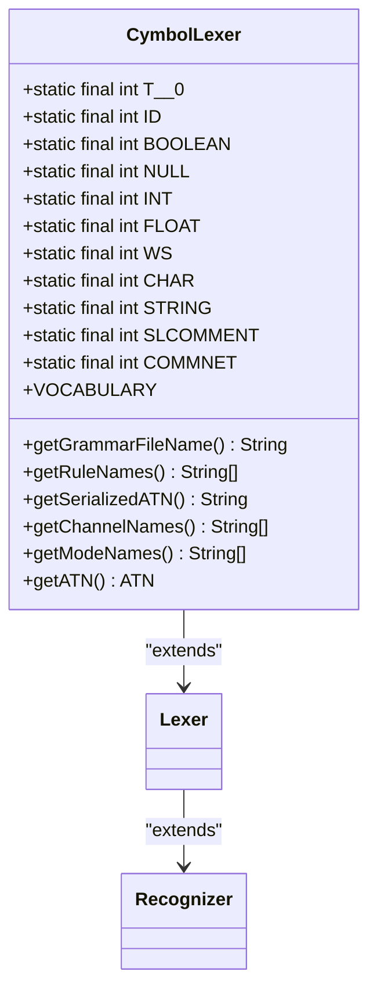
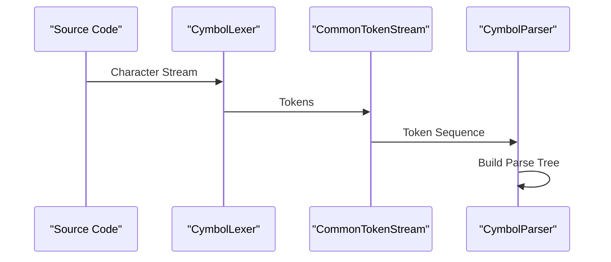
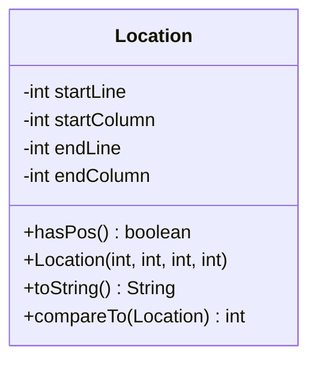

# Lexical Analysis

<cite>
**Referenced Files in This Document**   
- [CymbolLexer.java](file://ep21/src/main/java/org/teachfx/antlr4/ep21/parser/CymbolLexer.java)
- [Location.java](file://ep21/src/main/java/org/teachfx/antlr4/ep21/parser/Location.java)
- [CymbolParser.java](file://ep21/src/main/java/org/teachfx/antlr4/ep21/parser/CymbolParser.java)
- [Cymbol.g4](file://ep21/src/main/antlr4/Cymbol.g4)
</cite>

## Table of Contents
1. [Introduction](#introduction)
2. [Lexer Architecture and ANTLR4 Integration](#lexer-architecture-and-antlr4-integration)
3. Token Types and Lexer Rules
4. Error Handling in Lexical Analysis
5. Lexer-Parser Integration via TokenStream
6. Source Location Tracking with Location Class
7. Lexer Rule Definitions and Token Type Mapping
8. Performance Considerations in Lexical Analysis
9. Handling Whitespace, Comments, and Literals
10. Conclusion

## Introduction
The lexical analysis component of the Cymbol compiler processes source code character streams into meaningful tokens using ANTLR4's lexer infrastructure. This document details how the CymbolLexer.java transforms raw source code into a structured token stream that serves as input for the subsequent parsing phase. The lexer plays a critical role in identifying language elements such as keywords, identifiers, literals, and operators while maintaining source location information for error reporting. This analysis covers the implementation of token types, lexer rules, error handling mechanisms, and the integration between the lexer and parser through the TokenStream interface.

## Lexer Architecture and ANTLR4 Integration
The CymbolLexer class extends ANTLR4's Lexer base class, leveraging the framework's powerful infrastructure for lexical analysis. The lexer processes input character streams and generates tokens according to the grammar rules defined in Cymbol.g4. When instantiated with a CharStream input, the lexer initializes a LexerATNSimulator that uses the ATN (Augmented Transition Network) to determine the appropriate token type for each character sequence. The lexer's architecture follows ANTLR4's standard pattern, with token types defined as constants and lexer rules mapped to specific token types. The integration with ANTLR4 provides automatic handling of complex lexical patterns, including regular expressions for identifiers, numbers, and string literals.

**Diagram sources**
- [CymbolLexer.java](file://ep21/src/main/java/org/teachfx/antlr4/ep21/parser/CymbolLexer.java)

**Section sources**
- [CymbolLexer.java](file://ep21/src/main/java/org/teachfx/antlr4/ep21/parser/CymbolLexer.java)

## Token Types and Lexer Rules
The Cymbol lexer defines a comprehensive set of token types that represent the fundamental building blocks of the Cymbol language. These token types include reserved keywords (such as 'float', 'int', 'void', 'bool', 'string', 'object'), operators (including arithmetic, relational, and logical operators), punctuation, and literals. The lexer rules are implemented as regular expressions that match specific patterns in the input stream. For example, the ID rule matches identifiers that start with a letter followed by letters or digits, while the INT rule matches sequences of digits. The lexer also defines token types for whitespace and comments, which are typically skipped during processing but contribute to source location tracking.

**Section sources**
- [Cymbol.g4](file://ep21/src/main/antlr4/Cymbol.g4)
- [CymbolLexer.java](file://ep21/src/main/java/org/teachfx/antlr4/ep21/parser/CymbolLexer.java)

## Error Handling in Lexical Analysis
The Cymbol lexer implements robust error handling mechanisms to manage invalid input sequences. When the lexer encounters a character sequence that doesn't match any defined token rule, it triggers an error recovery process. The lexer uses ANTLR4's built-in error recovery strategies, which attempt to synchronize the input stream and continue processing after the error. For invalid tokens, the lexer may consume the problematic characters and report an error, allowing the compilation process to continue and potentially identify multiple issues in a single pass. The error handling is integrated with the parser's error recovery mechanisms, ensuring that lexical errors don't terminate the entire compilation process prematurely.

**Section sources**
- [CymbolLexer.java](file://ep21/src/main/java/org/teachfx/antlr4/ep21/parser/CymbolLexer.java)

## Lexer-Parser Integration via TokenStream
The integration between the lexer and parser occurs through the TokenStream interface, which provides a unified view of the token sequence to the parser. The CymbolLexer generates tokens that are consumed by the CymbolParser through a CommonTokenStream, which buffers the tokens and allows the parser to look ahead as needed. This integration enables the parser to access token types, text values, and source location information for each token. The token stream abstraction decouples the lexical analysis from syntactic analysis, allowing each component to operate independently while maintaining a consistent interface. The parser uses the token stream to build the parse tree according to the grammar rules defined in Cymbol.g4.

**Diagram sources**
- [CymbolLexer.java](file://ep21/src/main/java/org/teachfx/antlr4/ep21/parser/CymbolLexer.java)
- [CymbolParser.java](file://ep21/src/main/java/org/teachfx/antlr4/ep21/parser/CymbolParser.java)

**Section sources**
- [CymbolLexer.java](file://ep21/src/main/java/org/teachfx/antlr4/ep21/parser/CymbolLexer.java)
- [CymbolParser.java](file://ep21/src/main/java/org/teachfx/antlr4/ep21/parser/CymbolParser.java)

## Source Location Tracking with Location Class
The Location class provides comprehensive source location tracking for error reporting and debugging purposes. Each token generated by the lexer includes position information that maps back to the original source file. The Location class maintains start and end line numbers, as well as start and end column numbers, for each token. This information is crucial for generating meaningful error messages that help developers identify and fix issues in their code. The lexer updates the location information as it processes each character, incrementing line and column counters appropriately. When an error occurs, the location information can be used to pinpoint the exact position in the source code where the error was detected.

**Diagram sources**
- [Location.java](file://ep21/src/main/java/org/teachfx/antlr4/ep21/parser/Location.java)

**Section sources**
- [Location.java](file://ep21/src/main/java/org/teachfx/antlr4/ep21/parser/Location.java)

## Lexer Rule Definitions and Token Type Mapping
The lexer rule definitions in Cymbol.g4 directly map to token types used throughout the compilation process. Each rule in the grammar file corresponds to a specific token type, creating a clear relationship between the lexical specification and the generated lexer code. For example, the ID rule matches identifiers and produces tokens of type ID, while the INT rule matches integer literals and produces tokens of type INT. The lexer rules also handle special cases such as string literals, which can contain escaped characters, and comments, which are typically skipped but contribute to source location tracking. The mapping between lexer rules and token types ensures that the parser receives a consistent and well-defined token stream that accurately represents the source code structure.

**Section sources**
- [Cymbol.g4](file://ep21/src/main/antlr4/Cymbol.g4)
- [CymbolLexer.java](file://ep21/src/main/java/org/teachfx/antlr4/ep21/parser/CymbolLexer.java)

## Performance Considerations in Lexical Analysis
The lexical analysis component is optimized for performance through several mechanisms. The lexer uses ANTLR4's efficient ATN-based matching algorithm, which provides linear time complexity for most input patterns. The lexer rules are ordered to prioritize common tokens, reducing the number of failed matches during processing. Additionally, the lexer skips whitespace and comments directly in the tokenization process, avoiding unnecessary token creation and storage. The use of a token stream buffer allows for efficient lookahead operations without reprocessing the input stream. These optimizations ensure that lexical analysis remains a fast and efficient phase of the compilation process, even for large source files.

**Section sources**
- [CymbolLexer.java](file://ep21/src/main/java/org/teachfx/antlr4/ep21/parser/CymbolLexer.java)

## Handling Whitespace, Comments, and Literals
The Cymbol lexer implements specialized handling for whitespace, comments, and literals to ensure proper tokenization and source location tracking. Whitespace characters (spaces, tabs, newlines, and carriage returns) are matched by the WS rule and skipped, meaning they don't appear in the final token stream but still contribute to line and column counting. Single-line comments (SLCOMMENT) and multi-line comments (COMMNET) are also skipped, allowing developers to include documentation and notes without affecting the program's structure. Literals such as integers, floating-point numbers, characters, and strings are matched by specific rules that validate their format and extract their values for use in the parse tree.

**Section sources**
- [Cymbol.g4](file://ep21/src/main/antlr4/Cymbol.g4)
- [CymbolLexer.java](file://ep21/src/main/java/org/teachfx/antlr4/ep21/parser/CymbolLexer.java)

## Conclusion
The lexical analysis component of the Cymbol compiler effectively transforms source code character streams into meaningful tokens using ANTLR4's lexer infrastructure. Through well-defined token types, lexer rules, and error handling mechanisms, the CymbolLexer provides a robust foundation for the subsequent parsing phase. The integration with the parser via the TokenStream interface ensures seamless data flow between lexical and syntactic analysis, while the Location class enables precise source location tracking for error reporting. The lexer's handling of whitespace, comments, and literals demonstrates careful consideration of language design and user experience. Overall, the lexical analysis component exemplifies the power and flexibility of ANTLR4 for implementing compiler front-ends.