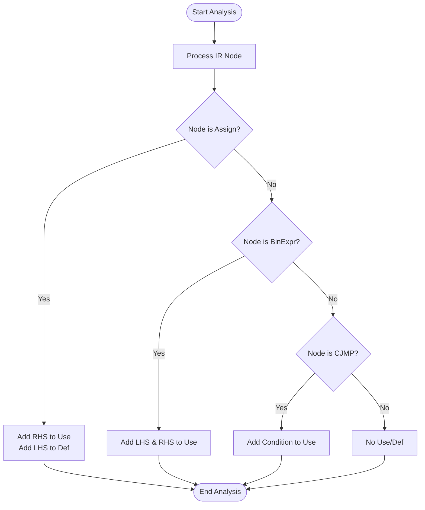
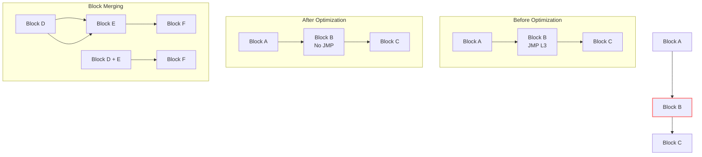
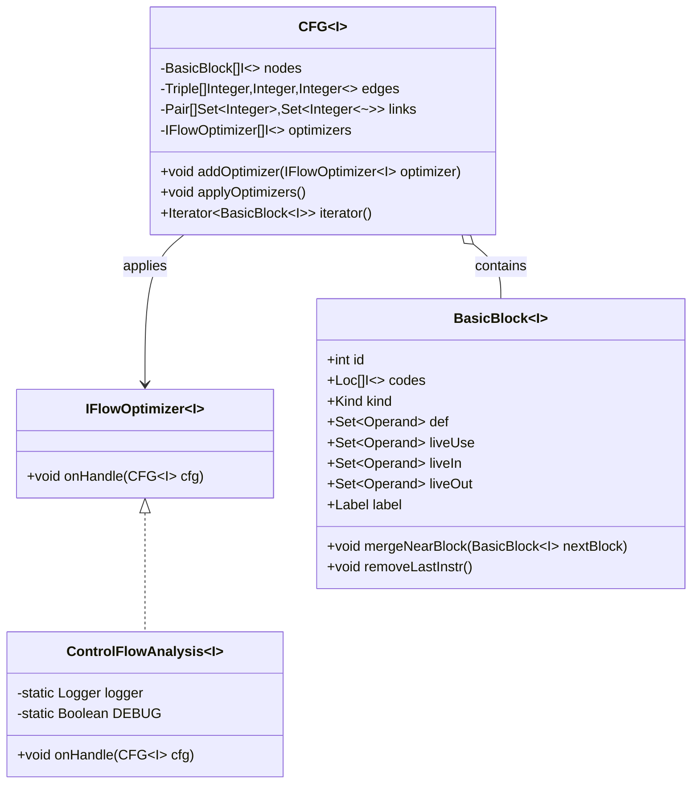
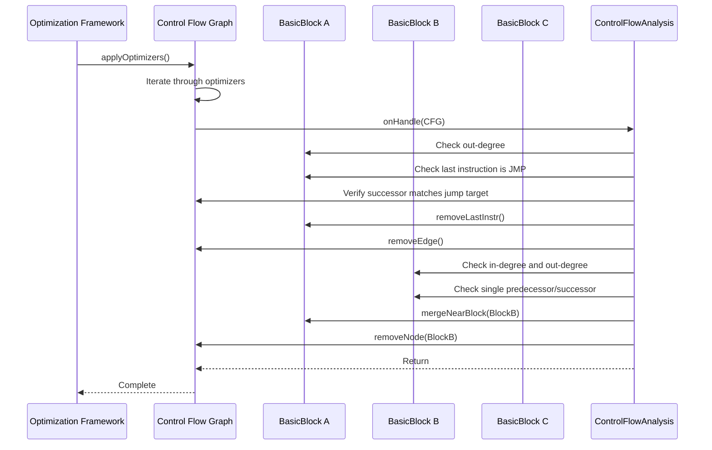

# Optimization Passes

<cite>
**Referenced Files in This Document**   
- [LivenessAnalysis.java](file://ep20/src/main/java/org/teachfx/antlr4/ep20/pass/cfg/LivenessAnalysis.java)
- [ControlFlowAnalysis.java](file://ep20/src/main/java/org/teachfx/antlr4/ep20/pass/cfg/ControlFlowAnalysis.java)
- [IFlowOptimizer.java](file://ep20/src/main/java/org/teachfx/antlr4/ep20/pass/cfg/IFlowOptimizer.java)
- [CFG.java](file://ep20/src/main/java/org/teachfx/antlr4/ep20/pass/cfg/CFG.java)
- [BasicBlock.java](file://ep20/src/main/java/org/teachfx/antlr4/ep20/pass/cfg/BasicBlock.java)
- [IRVisitor.java](file://ep20/src/main/java/org/teachfx/antlr4/ep20/ir/IRVisitor.java)
- [Assign.java](file://ep20/src/main/java/org/teachfx/antlr4/ep20/ir/stmt/Assign.java)
- [CJMP.java](file://ep20/src/main/java/org/teachfx/antlr4/ep20/ir/stmt/CJMP.java)
- [JMP.java](file://ep20/src/main/java/org/teachfx/antlr4/ep20/ir/stmt/JMP.java)
- [Operand.java](file://ep20/src/main/java/org/teachfx/antlr4/ep20/ir/expr/Operand.java)
- [VarSlot.java](file://ep20/src/main/java/org/teachfx/antlr4/ep20/ir/expr/VarSlot.java)
</cite>

## Table of Contents
1. [Introduction](#introduction)
2. [Liveness Analysis for Dead Code Elimination and Register Allocation](#liveness-analysis-for-dead-code-elimination-and-register-allocation)
3. [Control Flow Analysis for Code Structure Optimization](#control-flow-analysis-for-code-structure-optimization)
4. [Pluggable Optimization Framework via IFlowOptimizer](#pluggable-optimization-framework-via-iflowoptimizer)
5. [Optimization Patterns and Examples](#optimization-patterns-and-examples)
6. [Optimization Pipeline Execution Order](#optimization-pipeline-execution-order)
7. [Implementing Custom Optimization Passes](#implementing-custom-optimization-passes)
8. [Conclusion](#conclusion)

## Introduction
This document provides a comprehensive analysis of the optimization framework implemented in the compiler infrastructure. The system leverages data flow and control flow analysis to enable various optimization passes that improve code efficiency while preserving program semantics. The framework supports pluggable optimization passes through a well-defined interface, allowing for extensible and modular optimization strategies. Key components include liveness analysis for register allocation and dead code elimination, control flow analysis for identifying unreachable code and redundant jumps, and a pipeline architecture that coordinates multiple optimization passes.

## Liveness Analysis for Dead Code Elimination and Register Allocation

The `LivenessAnalysis.java` class implements a data flow analysis algorithm that determines which variables are live at each program point. A variable is considered live if its value may be used in the future along some execution path. This information is crucial for both dead code elimination and register allocation.

The analysis works by traversing the intermediate representation (IR) of the program and maintaining two sets for each instruction: use and def. The use set contains variables that are read by the instruction, while the def set contains variables that are written. For assignment statements, the right-hand side operands are added to the use set, and the left-hand side variable is added to the def set. For binary expressions, both operands are added to the use set. Conditional jumps use their condition variable, while unconditional jumps have no use or def.

This liveness information enables dead code elimination by identifying assignments to variables that are never subsequently used. Such assignments can be safely removed without affecting program behavior. For register allocation, liveness information helps determine when registers can be reused, as two variables with non-overlapping live ranges can share the same register.

**Diagram sources**
- [LivenessAnalysis.java](file://ep20/src/main/java/org/teachfx/antlr4/ep20/pass/cfg/LivenessAnalysis.java#L1-L147)
- [IRVisitor.java](file://ep20/src/main/java/org/teachfx/antlr4/ep20/ir/IRVisitor.java#L1-L41)

**Section sources**
- [LivenessAnalysis.java](file://ep20/src/main/java/org/teachfx/antlr4/ep20/pass/cfg/LivenessAnalysis.java#L1-L147)
- [IRVisitor.java](file://ep20/src/main/java/org/teachfx/antlr4/ep20/ir/IRVisitor.java#L1-L41)
- [Assign.java](file://ep20/src/main/java/org/teachfx/antlr4/ep20/ir/stmt/Assign.java#L1-L65)

## Control Flow Analysis for Code Structure Optimization

The `ControlFlowAnalysis.java` class performs structural optimization of the control flow graph (CFG) by identifying and eliminating redundant code patterns. This analysis targets two primary optimization opportunities: removing unnecessary jump instructions and merging basic blocks.

The algorithm first identifies unconditional jump instructions (JMP) at the end of basic blocks where the jump target is the same as the block's natural successor in the CFG. In such cases, the jump instruction is redundant and can be removed, as control will naturally flow to the next block. This optimization reduces instruction count and improves code density.

Second, the analysis identifies chains of basic blocks where a block has exactly one predecessor and one successor, creating a linear control flow sequence. These blocks can be merged into a single block, eliminating the intermediate control flow edges and reducing CFG complexity. The merging process concatenates the instructions of the successor block (excluding its label) to the end of the predecessor block, then removes the redundant block from the CFG.

These optimizations help eliminate unreachable code, reduce jump overhead, and simplify loop structures, making subsequent analyses more effective.

**Diagram sources**
- [ControlFlowAnalysis.java](file://ep20/src/main/java/org/teachfx/antlr4/ep20/pass/cfg/ControlFlowAnalysis.java#L1-L68)
- [CFG.java](file://ep20/src/main/java/org/teachfx/antlr4/ep20/pass/cfg/CFG.java#L1-L158)
- [BasicBlock.java](file://ep20/src/main/java/org/teachfx/antlr4/ep20/pass/cfg/BasicBlock.java#L1-L130)

**Section sources**
- [ControlFlowAnalysis.java](file://ep20/src/main/java/org/teachfx/antlr4/ep20/pass/cfg/ControlFlowAnalysis.java#L1-L68)
- [CFG.java](file://ep20/src/main/java/org/teachfx/antlr4/ep20/pass/cfg/CFG.java#L1-L158)
- [BasicBlock.java](file://ep20/src/main/java/org/teachfx/antlr4/ep20/pass/cfg/BasicBlock.java#L1-L130)
- [JMP.java](file://ep20/src/main/java/org/teachfx/antlr4/ep20/ir/stmt/JMP.java#L1-L45)

## Pluggable Optimization Framework via IFlowOptimizer

The optimization framework is designed around the `IFlowOptimizer.java` interface, which enables pluggable optimization passes that can modify the control flow graph (CFG) and intermediate representation (IR). This interface defines a single method `onHandle(CFG<I> cfg)` that receives a CFG as input and applies transformations to it.

The `CFG` class maintains a list of registered optimizers and provides an `applyOptimizers()` method that iterates through all registered optimizers and invokes their `onHandle` method. This design allows for modular and extensible optimization, where new optimization passes can be added without modifying the core framework.

Each optimization pass operates on the CFG structure, which consists of `BasicBlock` nodes connected by control flow edges. The `BasicBlock` class provides methods for manipulating instructions, merging blocks, and accessing control flow properties. Optimizers can modify the CFG by adding, removing, or modifying basic blocks and their connections.

This pluggable architecture supports various optimization strategies, from simple peephole optimizations to complex interprocedural analyses, all integrated through the same interface.

**Diagram sources**
- [IFlowOptimizer.java](file://ep20/src/main/java/org/teachfx/antlr4/ep20/pass/cfg/IFlowOptimizer.java#L1-L7)
- [ControlFlowAnalysis.java](file://ep20/src/main/java/org/teachfx/antlr4/ep20/pass/cfg/ControlFlowAnalysis.java#L1-L68)
- [CFG.java](file://ep20/src/main/java/org/teachfx/antlr4/ep20/pass/cfg/CFG.java#L1-L158)
- [BasicBlock.java](file://ep20/src/main/java/org/teachfx/antlr4/ep20/pass/cfg/BasicBlock.java#L1-L130)

**Section sources**
- [IFlowOptimizer.java](file://ep20/src/main/java/org/teachfx/antlr4/ep20/pass/cfg/IFlowOptimizer.java#L1-L7)
- [ControlFlowAnalysis.java](file://ep20/src/main/java/org/teachfx/antlr4/ep20/pass/cfg/ControlFlowAnalysis.java#L1-L68)
- [CFG.java](file://ep20/src/main/java/org/teachfx/antlr4/ep20/pass/cfg/CFG.java#L1-L158)
- [BasicBlock.java](file://ep20/src/main/java/org/teachfx/antlr4/ep20/pass/cfg/BasicBlock.java#L1-L130)

## Optimization Patterns and Examples

The optimization framework supports several common optimization patterns that improve code efficiency:

**Jump Threading**: This optimization eliminates intermediate jumps by redirecting control flow directly to the final target. When a jump instruction points to a block that contains another jump, the first jump can be updated to point directly to the second jump's target, effectively "threading" the jumps together.

**Constant Propagation**: This optimization replaces variables that are assigned constant values with the constants themselves. If a variable is assigned a constant and no intervening assignments occur, subsequent uses of the variable can be replaced with the constant value, enabling further optimizations like constant folding.

**Copy Propagation**: Similar to constant propagation, this optimization replaces uses of a variable with the value it was assigned from another variable, when that assignment is a simple copy and no intervening modifications occur.

These optimizations work together to simplify the IR, reduce instruction count, and expose additional optimization opportunities. For example, constant propagation may enable dead code elimination when conditional branches become statically determinable.

**Diagram sources**
- [ControlFlowAnalysis.java](file://ep20/src/main/java/org/teachfx/antlr4/ep20/pass/cfg/ControlFlowAnalysis.java#L1-L68)
- [BasicBlock.java](file://ep20/src/main/java/org/teachfx/antlr4/ep20/pass/cfg/BasicBlock.java#L1-L130)
- [CFG.java](file://ep20/src/main/java/org/teachfx/antlr4/ep20/pass/cfg/CFG.java#L1-L158)

**Section sources**
- [ControlFlowAnalysis.java](file://ep20/src/main/java/org/teachfx/antlr4/ep20/pass/cfg/ControlFlowAnalysis.java#L1-L68)
- [LivenessAnalysis.java](file://ep20/src/main/java/org/teachfx/antlr4/ep20/pass/cfg/LivenessAnalysis.java#L1-L147)
- [BasicBlock.java](file://ep20/src/main/java/org/teachfx/antlr4/ep20/pass/cfg/BasicBlock.java#L1-L130)

## Optimization Pipeline Execution Order

The optimization pipeline executes in a specific order to maximize effectiveness and ensure correctness. The `CFG` class maintains a list of optimizers that are applied sequentially through the `applyOptimizers()` method. The execution order is significant, as earlier optimizations can expose opportunities for later ones.

Typically, the pipeline begins with control flow optimizations like unreachable code elimination and jump threading, which simplify the CFG structure. This is followed by data flow analyses like liveness analysis, which benefit from a cleaner CFG. Register allocation and dead code elimination then use the liveness information to optimize variable usage. Finally, peephole optimizations and instruction scheduling improve the generated code's performance.

The framework ensures that program semantics are preserved throughout the optimization process by only applying transformations that are proven to be equivalent to the original program. Each optimization pass must maintain the program's observable behavior while improving efficiency.

**Section sources**
- [CFG.java](file://ep20/src/main/java/org/teachfx/antlr4/ep20/pass/cfg/CFG.java#L1-L158)
- [ControlFlowAnalysis.java](file://ep20/src/main/java/org/teachfx/antlr4/ep20/pass/cfg/ControlFlowAnalysis.java#L1-L68)
- [LivenessAnalysis.java](file://ep20/src/main/java/org/teachfx/antlr4/ep20/pass/cfg/LivenessAnalysis.java#L1-L147)

## Implementing Custom Optimization Passes

To implement a custom optimization pass, developers should create a class that implements the `IFlowOptimizer<I>` interface. The class must provide an `onHandle(CFG<I> cfg)` method that performs the desired transformations on the control flow graph.

The optimization should follow these steps:
1. Traverse the CFG nodes and identify optimization opportunities
2. Verify that transformations preserve program semantics
3. Modify the CFG structure by adding, removing, or updating basic blocks and edges
4. Update any affected data flow information

Custom passes can be registered with the CFG using the `addOptimizer()` method, after which they will be automatically invoked during the optimization pipeline. Developers should ensure their optimizations are idempotent and can handle edge cases in the IR structure.

**Section sources**
- [IFlowOptimizer.java](file://ep20/src/main/java/org/teachfx/antlr4/ep20/pass/cfg/IFlowOptimizer.java#L1-L7)
- [ControlFlowAnalysis.java](file://ep20/src/main/java/org/teachfx/antlr4/ep20/pass/cfg/ControlFlowAnalysis.java#L1-L68)
- [CFG.java](file://ep20/src/main/java/org/teachfx/antlr4/ep20/pass/cfg/CFG.java#L1-L158)

## Conclusion
The optimization framework provides a robust and extensible infrastructure for improving code efficiency through data flow and control flow analysis. The liveness analysis enables critical optimizations like dead code elimination and register allocation by determining variable usage patterns. Control flow analysis identifies and eliminates redundant code structures, simplifying the program's control flow. The pluggable architecture via the `IFlowOptimizer` interface allows for modular optimization passes that can be easily added to the pipeline. Together, these components form a comprehensive optimization system that preserves program semantics while significantly improving performance.