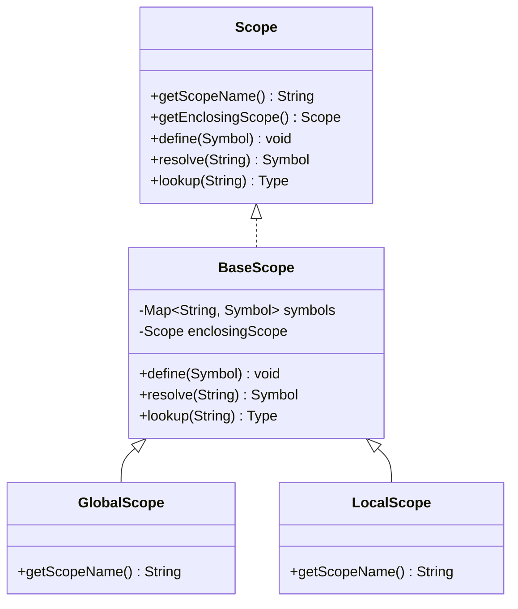
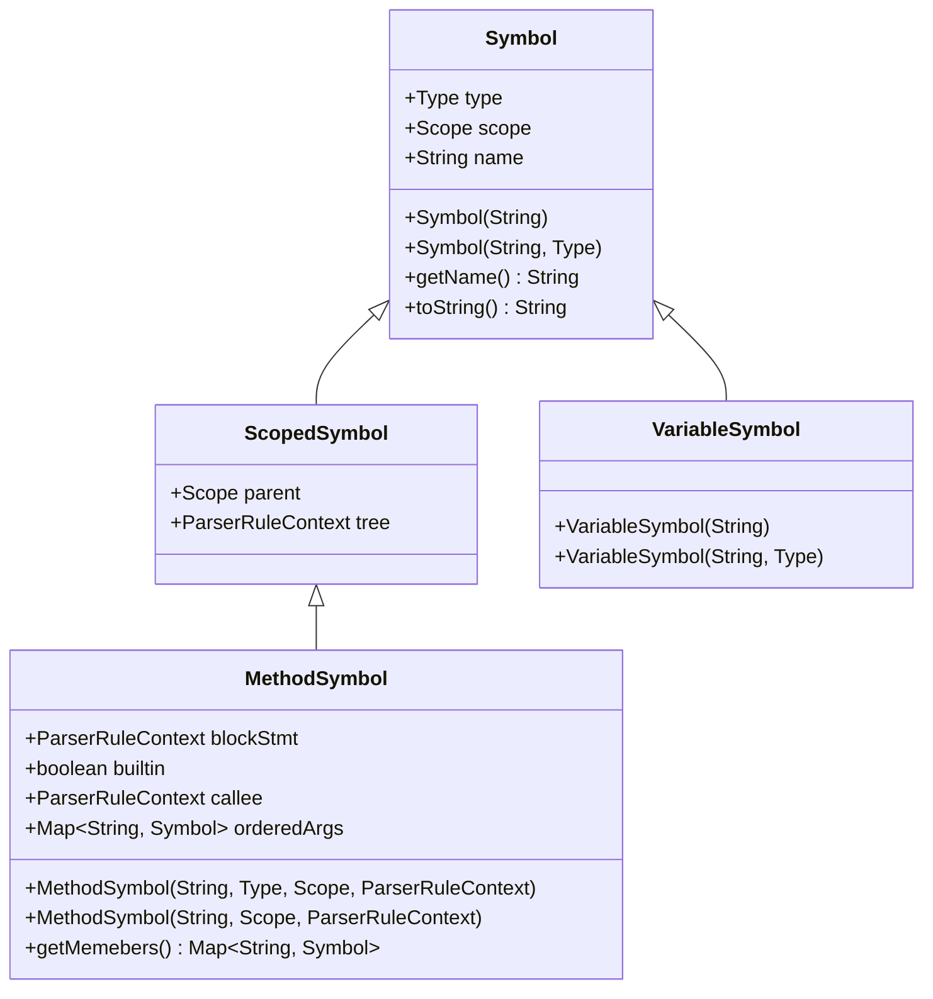
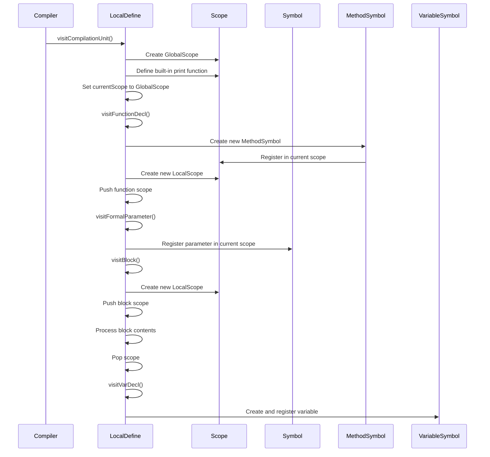
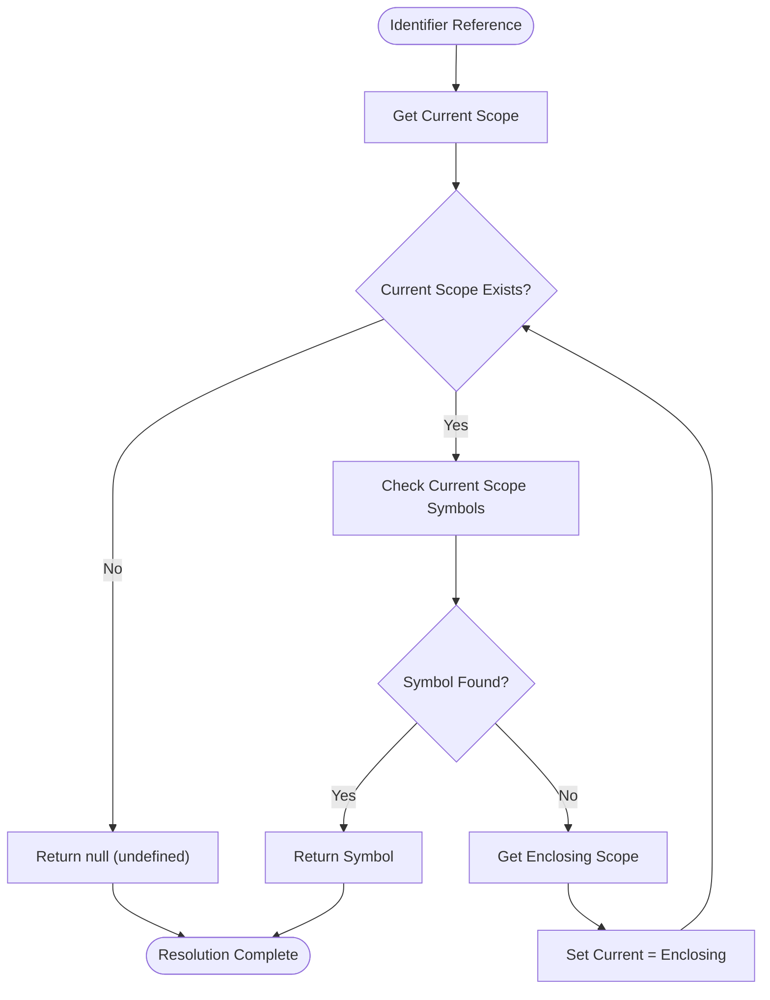
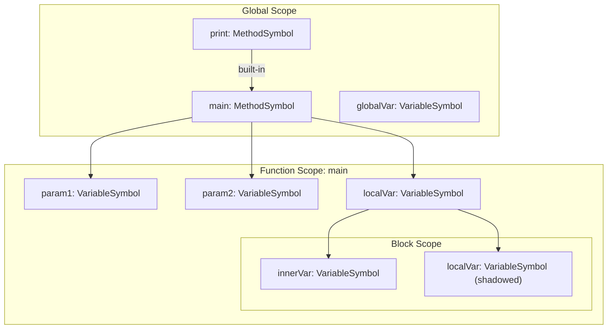
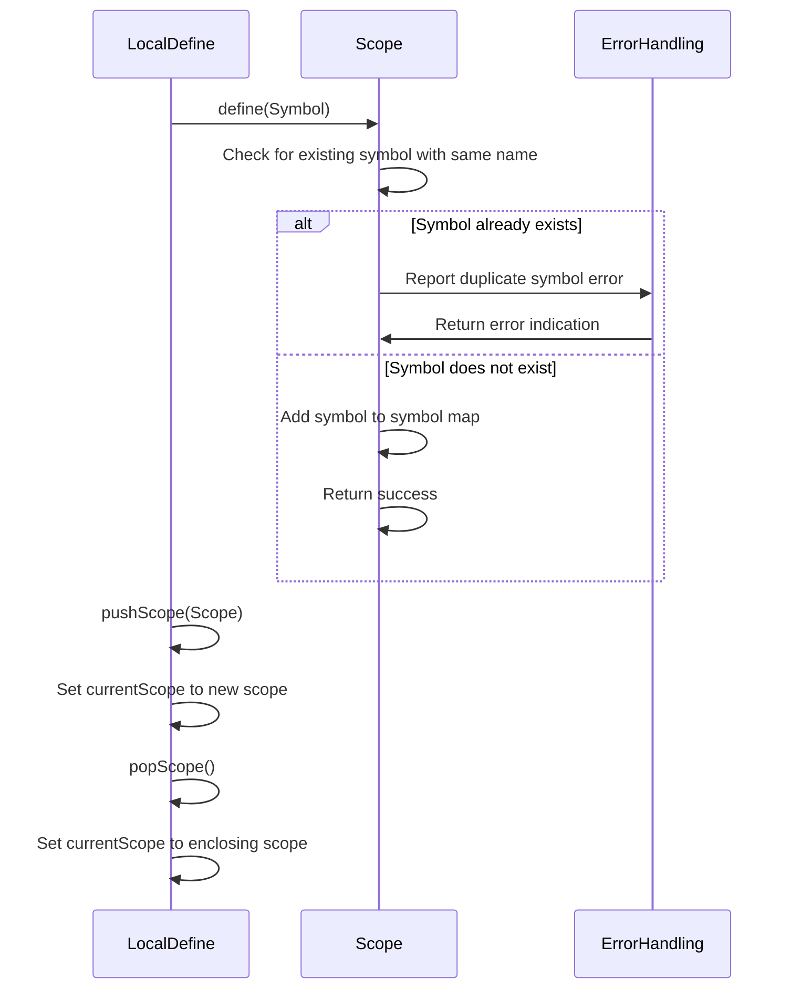

# Symbol Table and Scope Management

<cite>
**Referenced Files in This Document**   
- [LocalDefine.java](file://ep16/src/main/java/org/teachfx/antlr4/ep16/visitor/LocalDefine.java)
- [Scope.java](file://ep16/src/main/java/org/teachfx/antlr4/ep16/symtab/Scope.java)
- [GlobalScope.java](file://ep16/src/main/java/org/teachfx/antlr4/ep16/symtab/GlobalScope.java)
- [LocalScope.java](file://ep16/src/main/java/org/teachfx/antlr4/ep16/symtab/LocalScope.java)
- [Symbol.java](file://ep16/src/main/java/org/teachfx/antlr4/ep16/symtab/Symbol.java)
- [VariableSymbol.java](file://ep16/src/main/java/org/teachfx/antlr4/ep16/symtab/VariableSymbol.java)
- [MethodSymbol.java](file://ep16/src/main/java/org/teachfx/antlr4/ep16/symtab/MethodSymbol.java)
- [BaseScope.java](file://ep16/src/main/java/org/teachfx/antlr4/ep16/symtab/BaseScope.java)
</cite>

## Table of Contents
1. [Introduction](#introduction)
2. [Scope Hierarchy](#scope-hierarchy)
3. [Symbol Hierarchy](#symbol-hierarchy)
4. [Symbol Table Population](#symbol-table-population)
5. [Name Resolution and Lookup](#name-resolution-and-lookup)
6. [Scoping Rules Implementation](#scoping-rules-implementation)
7. [Error Detection and Scope Management](#error-detection-and-scope-management)
8. [Conclusion](#conclusion)

## Introduction
The symbol table and scope management system forms the foundation of semantic analysis in the Cymbol compiler. This system enables proper name resolution, type checking, and variable binding across nested blocks and functions. The implementation uses a hierarchical scope structure with GlobalScope and LocalScope classes that organize identifiers according to their visibility and lifetime. The Symbol hierarchy, including VariableSymbol and MethodSymbol, stores metadata about identifiers such as type, location, and binding information. The LocalDefine visitor performs the first pass of semantic analysis by populating the symbol table during AST traversal, establishing the context for subsequent analysis phases.

## Scope Hierarchy

The scope management system implements a hierarchical structure through the Scope interface and its concrete implementations. The system follows a parent-child relationship where each scope can access symbols from its enclosing scope, enabling proper name resolution across nested contexts.

**Diagram sources**
- [Scope.java](file://ep16/src/main/java/org/teachfx/antlr4/ep16/symtab/Scope.java#L5-L16)
- [BaseScope.java](file://ep16/src/main/java/org/teachfx/antlr4/ep16/symtab/BaseScope.java)
- [GlobalScope.java](file://ep16/src/main/java/org/teachfx/antlr4/ep16/symtab/GlobalScope.java#L2-L14)
- [LocalScope.java](file://ep16/src/main/java/org/teachfx/antlr4/ep16/symtab/LocalScope.java#L2-L12)

The Scope interface defines the core contract for all scope implementations, specifying methods for retrieving the scope name, accessing the enclosing scope, defining new symbols, resolving symbol names, and looking up types. The BaseScope class provides a concrete implementation with a symbol map and reference to the enclosing scope, implementing the fundamental operations for symbol management. GlobalScope represents the outermost scope that contains globally visible entities like built-in functions, while LocalScope handles block-level and function-level scopes that are nested within other scopes.

**Section sources**
- [Scope.java](file://ep16/src/main/java/org/teachfx/antlr4/ep16/symtab/Scope.java#L5-L16)
- [GlobalScope.java](file://ep16/src/main/java/org/teachfx/antlr4/ep16/symtab/GlobalScope.java#L2-L14)
- [LocalScope.java](file://ep16/src/main/java/org/teachfx/antlr4/ep16/symtab/LocalScope.java#L2-L12)

## Symbol Hierarchy

The symbol system implements a class hierarchy that represents different types of program entities, with Symbol as the base class and specialized subclasses for variables and methods. This hierarchy enables the storage of identifier metadata such as type, location, and binding information.

**Diagram sources**
- [Symbol.java](file://ep16/src/main/java/org/teachfx/antlr4/ep16/symtab/Symbol.java#L4-L37)
- [VariableSymbol.java](file://ep16/src/main/java/org/teachfx/antlr4/ep16/symtab/VariableSymbol.java#L2-L12)
- [MethodSymbol.java](file://ep16/src/main/java/org/teachfx/antlr4/ep16/symtab/MethodSymbol.java#L7-L30)

The Symbol class serves as the base representation for all named entities in the program, storing the identifier name, type information, and reference to its defining scope. VariableSymbol extends Symbol to represent variable declarations, inheriting all the base properties while adding no additional fields in this implementation. MethodSymbol extends ScopedSymbol (which itself extends Symbol) to represent function declarations, storing additional metadata such as the function body context, built-in status, caller context, and an ordered map of parameters. The orderedArgs map maintains parameter declarations in the order they appear in the function signature, preserving the calling convention.

**Section sources**
- [Symbol.java](file://ep16/src/main/java/org/teachfx/antlr4/ep16/symtab/Symbol.java#L4-L37)
- [VariableSymbol.java](file://ep16/src/main/java/org/teachfx/antlr4/ep16/symtab/VariableSymbol.java#L2-L12)
- [MethodSymbol.java](file://ep16/src/main/java/org/teachfx/antlr4/ep16/symtab/MethodSymbol.java#L7-L30)

## Symbol Table Population

The LocalDefine class performs the first pass of semantic analysis by traversing the AST and populating the symbol table with declarations. This process establishes the scope context for each AST node and registers symbols for variables, functions, and parameters.

**Diagram sources**
- [LocalDefine.java](file://ep16/src/main/java/org/teachfx/antlr4/ep16/visitor/LocalDefine.java#L20-L152)

The LocalDefine visitor initializes the symbol table by creating a GlobalScope and pre-populating it with built-in functions like "print". During AST traversal, it processes different declaration contexts and establishes appropriate scopes. When encountering a function declaration, it creates a MethodSymbol with the function name, return type, parent scope, and parse tree context, then registers this symbol in the current scope. It then creates a new LocalScope for the function body and pushes it onto the scope stack. For parameter declarations within functions, it processes each formal parameter and registers them in the current (function) scope. For block statements, it creates a new LocalScope, pushes it onto the stack, processes the block contents, and then pops the scope, maintaining proper nesting. Variable declarations are registered in the current scope with their names and types.

**Section sources**
- [LocalDefine.java](file://ep16/src/main/java/org/teachfx/antlr4/ep16/visitor/LocalDefine.java#L20-L152)

## Name Resolution and Lookup

The name resolution system enables the compiler to find the correct symbol for any identifier reference in the program, following the scoping rules and handling nested contexts appropriately. The system implements a hierarchical lookup process that searches from the innermost scope outward.

**Diagram sources**
- [BaseScope.java](file://ep16/src/main/java/org/teachfx/antlr4/ep16/symtab/BaseScope.java)
- [Scope.java](file://ep16/src/main/java/org/teachfx/antlr4/ep16/symtab/Scope.java#L5-L16)

When resolving an identifier, the system starts with the current scope (stored in the LocalDefine visitor's currentScope field) and checks if the symbol exists in that scope's symbol map. If found, the symbol is returned immediately. If not found, the system retrieves the enclosing scope and repeats the search process. This continues until either the symbol is found or the search reaches the outermost scope (which has a null enclosing scope), at which point the identifier is considered undefined. This hierarchical search implements the fundamental scoping rule that inner scopes can access symbols from outer scopes, but not vice versa. The resolve method in BaseScope implements this algorithm, while the define method ensures that new symbols are added to the current scope, potentially shadowing identically named symbols in outer scopes.

**Section sources**
- [Scope.java](file://ep16/src/main/java/org/teachfx/antlr4/ep16/symtab/Scope.java#L5-L16)
- [BaseScope.java](file://ep16/src/main/java/org/teachfx/antlr4/ep16/symtab/BaseScope.java)

## Scoping Rules Implementation

The system implements Cymbol's scoping rules through the interaction of scope classes and the symbol definition process. These rules govern how variables and functions are declared, accessed, and shadowed across different contexts.

**Diagram sources**
- [GlobalScope.java](file://ep16/src/main/java/org/teachfx/antlr4/ep16/symtab/GlobalScope.java#L2-L14)
- [LocalScope.java](file://ep16/src/main/java/org/teachfx/antlr4/ep16/symtab/LocalScope.java#L2-L12)
- [MethodSymbol.java](file://ep16/src/main/java/org/teachfx/antlr4/ep16/symtab/MethodSymbol.java#L7-L30)

The implementation supports several key scoping rules. Function parameters are treated as local variables within the function scope, registered in the MethodSymbol's orderedArgs map during the LocalDefine pass. Local variables declared within functions are added to the function's LocalScope, making them accessible throughout the function body. The system allows variable shadowing, where a variable in an inner scope can have the same name as a variable in an outer scope; the inner variable takes precedence within its scope. Block-level scopes create additional nesting levels, allowing variables declared in inner blocks to shadow those in outer blocks or the containing function. Built-in functions like "print" are pre-registered in the GlobalScope with their built-in flag set to true, distinguishing them from user-defined functions. The scope hierarchy ensures that name lookup follows the proper search order from innermost to outermost scopes.

**Section sources**
- [LocalDefine.java](file://ep16/src/main/java/org/teachfx/antlr4/ep16/visitor/LocalDefine.java#L20-L152)
- [MethodSymbol.java](file://ep16/src/main/java/org/teachfx/antlr4/ep16/symtab/MethodSymbol.java#L7-L30)
- [LocalScope.java](file://ep16/src/main/java/org/teachfx/antlr4/ep16/symtab/LocalScope.java#L2-L12)

## Error Detection and Scope Management

The symbol table system includes mechanisms for detecting common semantic errors and managing the lifecycle of scopes during compilation. These features help ensure program correctness and prevent invalid declarations.

**Diagram sources**
- [BaseScope.java](file://ep16/src/main/java/org/teachfx/antlr4/ep16/symtab/BaseScope.java)
- [LocalDefine.java](file://ep16/src/main/java/org/teachfx/antlr4/ep16/visitor/LocalDefine.java#L20-L152)

The system detects duplicate symbol declarations by checking for existing symbols with the same name before adding a new symbol to a scope. When defining a symbol, the scope first searches its own symbol map for an existing entry with the same name; if found, this indicates a duplicate declaration which should generate a semantic error. The scope lifecycle is managed through the pushScope and popScope methods in LocalDefine, which maintain the current scope pointer as the AST is traversed. When entering a new scope (such as a function or block), a new scope object is created and pushed onto the stack by calling pushScope, making it the current scope for subsequent declarations. When exiting the scope, popScope restores the previous scope, ensuring that symbols declared in the exited scope are no longer accessible. The ParseTreeProperty in LocalDefine stashes the scope information for each AST node, allowing later phases to retrieve the correct scope context for any node in the tree.

**Section sources**
- [LocalDefine.java](file://ep16/src/main/java/org/teachfx/antlr4/ep16/visitor/LocalDefine.java#L20-L152)
- [BaseScope.java](file://ep16/src/main/java/org/teachfx/antlr4/ep16/symtab/BaseScope.java)

## Conclusion
The symbol table and scope management system provides a robust foundation for semantic analysis in the Cymbol compiler. The hierarchical scope structure, implemented through GlobalScope and LocalScope classes, enables proper name resolution across nested blocks and functions. The Symbol hierarchy, with VariableSymbol and MethodSymbol classes, effectively stores identifier metadata including type, location, and binding information. The LocalDefine visitor performs the critical first pass of semantic analysis by populating the symbol table during AST traversal, establishing the context for subsequent compilation phases. The system implements comprehensive scoping rules including shadowing, function parameters, and local variables, while also providing mechanisms for duplicate symbol detection and proper scope lifecycle management. This well-structured approach ensures that the compiler can accurately resolve identifiers and enforce language semantics throughout the compilation process.