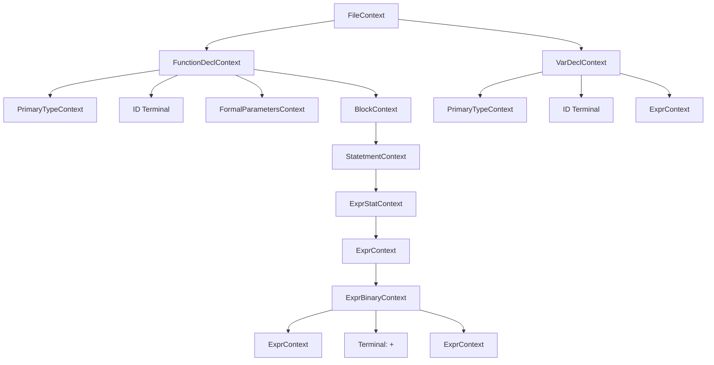
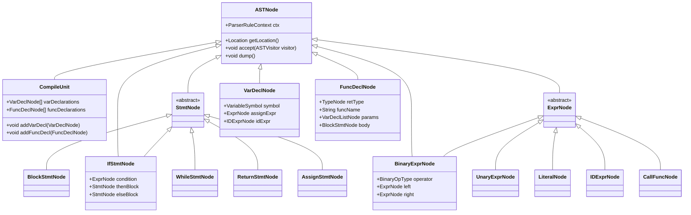
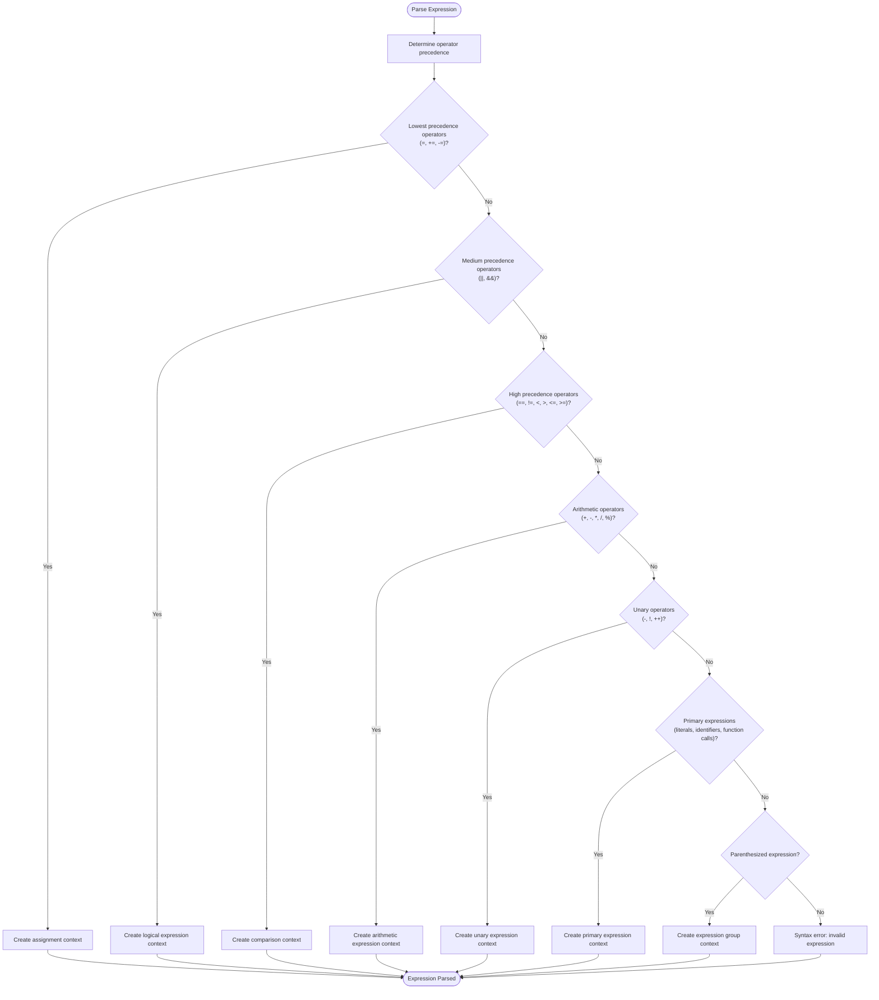

# Syntactic Analysis

<cite>
**Referenced Files in This Document**   
- [CymbolParser.java](file://ep21/src/main/java/org/teachfx/antlr4/ep21/parser/CymbolParser.java)
- [CymbolASTBuilder.java](file://ep21/src/main/java/org/teachfx/antlr4/ep21/pass/ast/CymbolASTBuilder.java)
- [ASTNode.java](file://ep21/src/main/java/org/teachfx/antlr4/ep21/ast/ASTNode.java)
- [ASTVisitor.java](file://ep21/src/main/java/org/teachfx/antlr4/ep21/ast/ASTVisitor.java)
</cite>

## Table of Contents
1. [Introduction](#introduction)
2. [Grammar Design and Parser Implementation](#grammar-design-and-parser-implementation)
3. [Parse Tree Structure](#parse-tree-structure)
4. [Abstract Syntax Tree Construction](#abstract-syntax-tree-construction)
5. [Grammar Rule Implementation](#grammar-rule-implementation)
6. [Error Recovery and Reporting](#error-recovery-and-reporting)
7. [Separation of Parse Tree and AST](#separation-of-parse-tree-and-ast)
8. [Conclusion](#conclusion)

## Introduction
The syntactic analysis phase in the Cymbol compiler transforms a token stream into a structured representation of the source code. This document details how the CymbolParser.java implements context-free grammar rules using ANTLR4 to generate a parse tree, and how this parse tree is transformed into an Abstract Syntax Tree (AST) through the CymbolASTBuilder visitor. The design emphasizes clear separation between concrete syntax (parse tree) and abstract syntax (AST), enabling efficient semantic analysis and code generation in subsequent compilation phases.

## Grammar Design and Parser Implementation
The CymbolParser.java implements a context-free grammar for the Cymbol language using ANTLR4's parser generation capabilities. The grammar defines production rules for various language constructs including declarations, statements, expressions, and control flow. ANTLR4 processes the grammar specification to generate a recursive descent parser that can recognize valid Cymbol programs and construct a parse tree representing the syntactic structure of the input.

The parser implementation follows ANTLR4's standard pattern, with each grammar rule corresponding to a parsing method that returns a context object representing a node in the parse tree. The parser uses ANTLR4's built-in error recovery mechanisms to handle syntax errors gracefully, allowing it to continue parsing even after encountering malformed input.

**Section sources**
- [CymbolParser.java](file://ep21/src/main/java/org/teachfx/antlr4/ep21/parser/CymbolParser.java#L0-L100)

## Parse Tree Structure
The parse tree generated by CymbolParser.java is a concrete syntax tree that mirrors the exact structure of the grammar rules applied during parsing. Each node in the parse tree corresponds to a grammar rule application and contains references to its child nodes (sub-rules) and any terminal tokens matched.

The parse tree structure includes specialized context classes for different grammar rules, such as FileContext, VarDeclContext, FunctionDeclContext, and ExprContext. These context classes provide methods to access child contexts and terminal tokens, enabling traversal of the parse tree. The parse tree preserves all syntactic details of the source code, including punctuation and formatting elements that are not semantically significant.

**Diagram sources**
- [CymbolParser.java](file://ep21/src/main/java/org/teachfx/antlr4/ep21/parser/CymbolParser.java#L100-L200)

## Abstract Syntax Tree Construction
The transformation from parse tree to Abstract Syntax Tree (AST) is performed by the CymbolASTBuilder visitor, which implements the visitor pattern to traverse the parse tree and construct corresponding AST nodes. The AST represents the essential syntactic structure of the program while eliminating redundant elements present in the parse tree.

The CymbolASTBuilder extends CymbolBaseVisitor and implements CymbolVisitor, allowing it to visit each node in the parse tree. For each parse tree node, the visitor creates an appropriate AST node that captures the semantic meaning of the construct. The AST nodes are defined in the ast package and include classes such as CompileUnit, FuncDeclNode, VarDeclNode, BinaryExprNode, and IfStmtNode.

**Diagram sources**
- [CymbolASTBuilder.java](file://ep21/src/main/java/org/teachfx/antlr4/ep21/pass/ast/CymbolASTBuilder.java#L0-L50)
- [ASTNode.java](file://ep21/src/main/java/org/teachfx/antlr4/ep21/ast/ASTNode.java#L0-L48)

**Section sources**
- [CymbolASTBuilder.java](file://ep21/src/main/java/org/teachfx/antlr4/ep21/pass/ast/CymbolASTBuilder.java#L0-L100)

## Grammar Rule Implementation
The Cymbol grammar is designed to handle various language constructs through specific production rules. The implementation demonstrates several key design choices for handling expressions, statements, declarations, and control flow constructs.

For expressions, the grammar uses recursive rules to handle operator precedence and associativity. Binary expressions are implemented with left-recursive rules to ensure left-associativity, while unary expressions are handled with prefix notation. The parser generates appropriate context objects for different expression types, which are then transformed into corresponding AST nodes by the visitor.

**Diagram sources**
- [CymbolParser.java](file://ep21/src/main/java/org/teachfx/antlr4/ep21/parser/CymbolParser.java#L500-L800)

For control flow constructs, the grammar defines specific rules for if-statements, while-loops, and function declarations. Each control flow construct has a corresponding context class that captures the essential components of the construct. For example, the StateConditionContext captures the condition expression and both the then and else statement blocks for if-statements.

The visitor pattern enables systematic transformation of these parse tree nodes into AST nodes. The CymbolASTBuilder implements visit methods for each context type, creating the appropriate AST node and recursively visiting child contexts to build the complete AST.

**Section sources**
- [CymbolParser.java](file://ep21/src/main/java/org/teachfx/antlr4/ep21/parser/CymbolParser.java#L200-L500)
- [CymbolASTBuilder.java](file://ep21/src/main/java/org/teachfx/antlr4/ep21/pass/ast/CymbolASTBuilder.java#L50-L150)

## Error Recovery and Reporting
The Cymbol parser implements ANTLR4's error recovery mechanisms to handle syntax errors in the input source code. When a syntax error is encountered, the parser attempts to recover by skipping tokens until a synchronization point is reached, allowing parsing to continue for the remainder of the input.

The error recovery process is integrated with ANTLR4's default error handling strategy, which includes panic mode recovery and phrase recovery. Panic mode recovery involves discarding input tokens until a token in the follow set of the current context is found. Phrase recovery attempts to insert or delete tokens to make the input conform to the grammar.

Syntax errors are reported with contextual information including the line number, character position, and a descriptive message. This information is captured through ANTLR4's RecognitionException and can be accessed through the parser's error reporting mechanisms. The error messages provide sufficient detail to help developers identify and correct syntax issues in their code.

**Section sources**
- [CymbolParser.java](file://ep21/src/main/java/org/teachfx/antlr4/ep21/parser/CymbolParser.java#L1000-L1200)

## Separation of Parse Tree and AST
The design separates the parse tree (concrete syntax) from the AST (abstract syntax) to provide several important benefits. The parse tree maintains a direct correspondence to the grammar rules and includes all syntactic details, making it suitable for syntax-directed translation and error reporting. In contrast, the AST represents the essential structure of the program, eliminating redundant elements and providing a cleaner representation for semantic analysis and code generation.

This separation enables modular compiler design, where different phases can operate on the representation most appropriate for their task. The parser phase focuses on syntactic correctness and produces the parse tree, while the AST construction phase focuses on creating an abstract representation that captures the semantic meaning of the program.

The visitor pattern facilitates this transformation by providing a clean mechanism for traversing the parse tree and constructing the AST. Each visit method in the CymbolASTBuilder corresponds to a specific parse tree node type and is responsible for creating the appropriate AST node. This approach ensures that the transformation is systematic and maintainable.

**Section sources**
- [CymbolParser.java](file://ep21/src/main/java/org/teachfx/antlr4/ep21/parser/CymbolParser.java#L0-L1557)
- [CymbolASTBuilder.java](file://ep21/src/main/java/org/teachfx/antlr4/ep21/pass/ast/CymbolASTBuilder.java#L0-L235)

## Conclusion
The syntactic analysis phase in the Cymbol compiler effectively transforms source code into a structured representation through the use of ANTLR4-generated parsers and visitor-based AST construction. The CymbolParser.java implements context-free grammar rules to generate a parse tree that captures the complete syntactic structure of the input, while the CymbolASTBuilder visitor transforms this parse tree into an Abstract Syntax Tree that represents the essential semantic structure of the program.

The design choices, including the separation of concrete and abstract syntax, the use of the visitor pattern for AST construction, and the implementation of robust error recovery mechanisms, contribute to a compiler that is both correct and maintainable. This foundation enables subsequent compilation phases to perform semantic analysis, optimization, and code generation on a clean, abstract representation of the program.