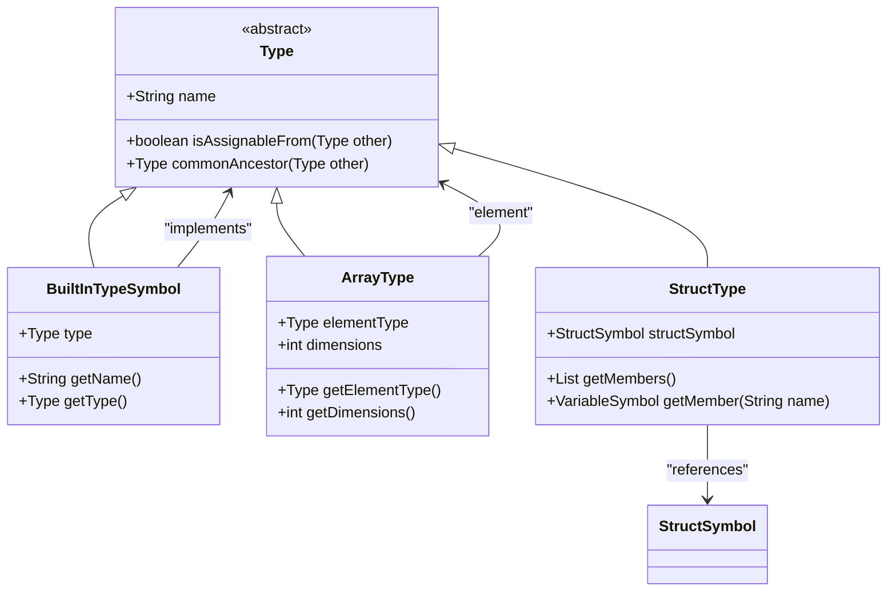
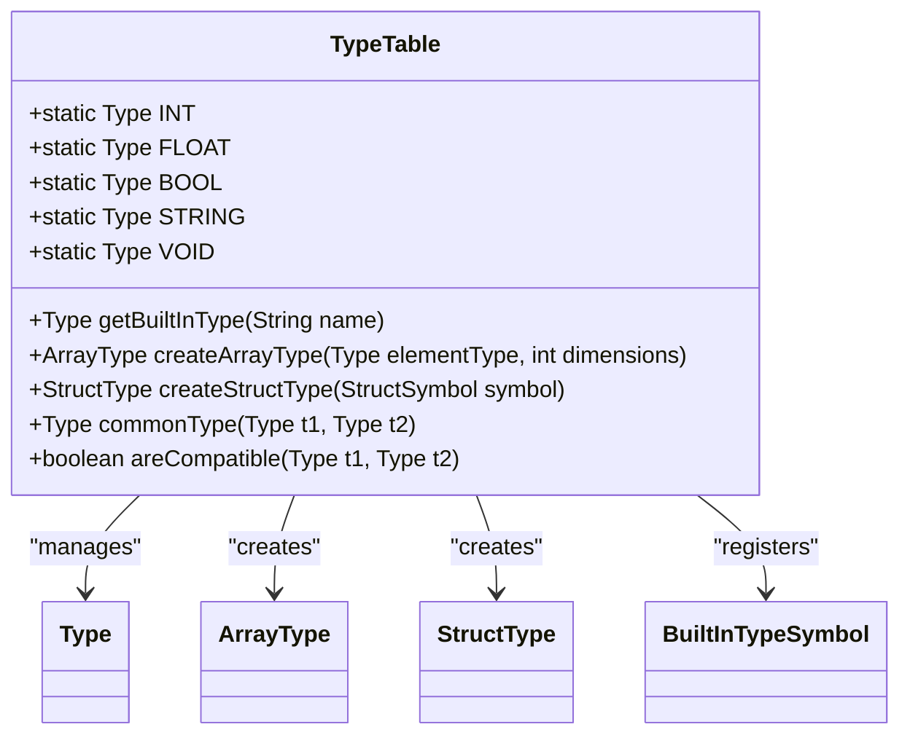
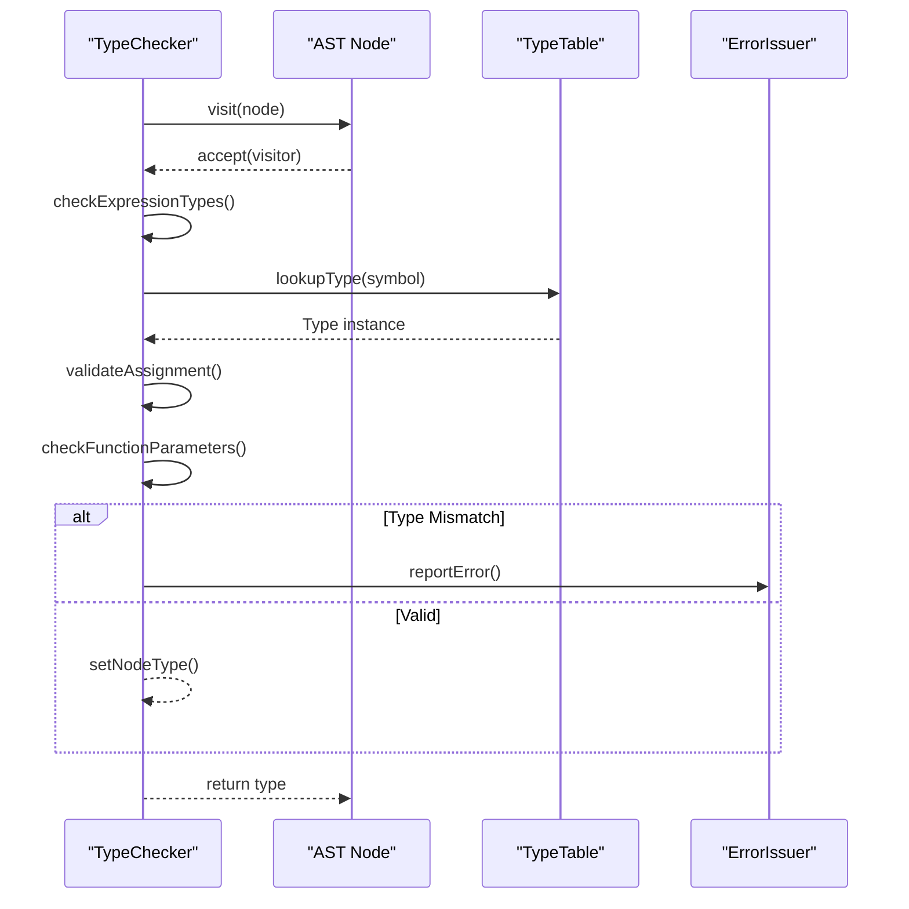
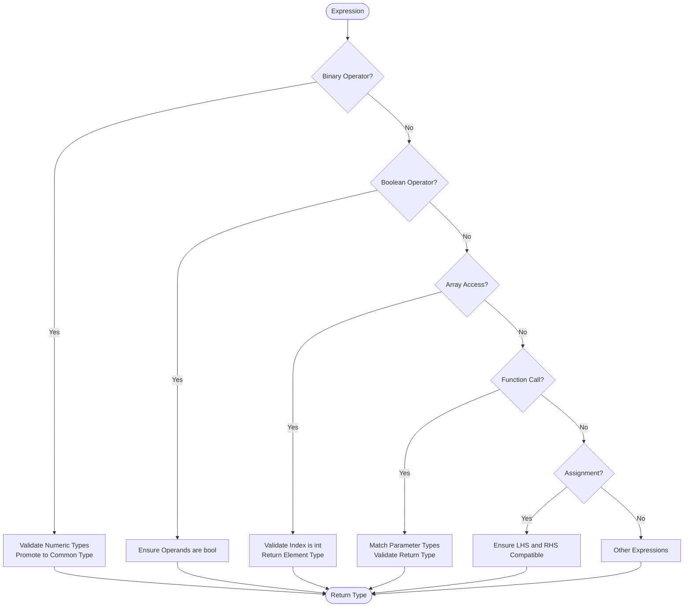
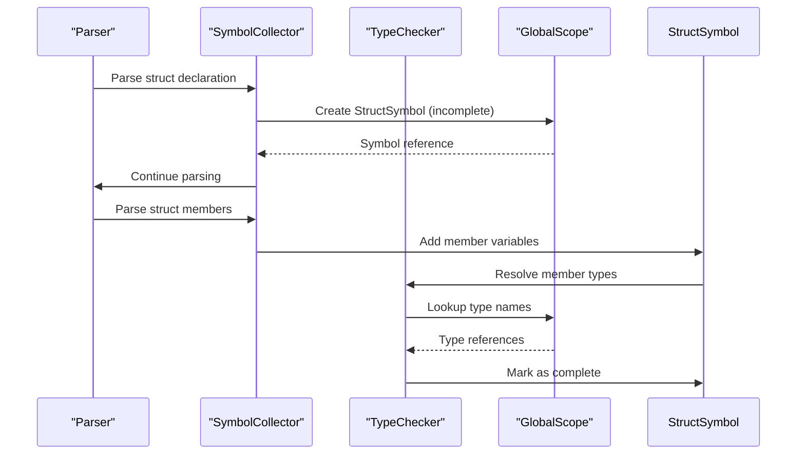
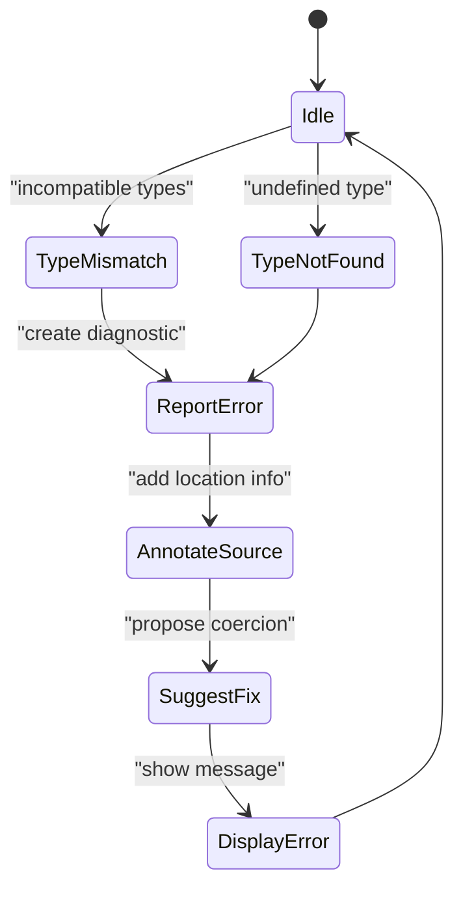

# Type System and Type Checking

<cite>
**Referenced Files in This Document**  
- [Type.java](file://ep20/src/main/java/org/teachfx/antlr4/ep20/symtab/type/Type.java)
- [TypeTable.java](file://ep20/src/main/java/org/teachfx/antlr4/ep20/symtab/type/TypeTable.java)
- [TypeChecker.java](file://ep20/src/main/java/org/teachfx/antlr4/ep20/pass/sementic/TypeChecker.java)
- [ArrayType.java](file://ep20/src/main/java/org/teachfx/antlr4/ep20/symtab/type/ArrayType.java)
- [StructType.java](file://ep20/src/main/java/org/teachfx/antlr4/ep20/symtab/type/StructType.java)
- [BuiltInTypeSymbol.java](file://ep20/src/main/java/org/teachfx/antlr4/ep20/symtab/type/BuiltInTypeSymbol.java)
- [StructSymbol.java](file://ep20/src/main/java/org/teachfx/antlr4/ep20/symtab/symbol/StructSymbol.java)
- [VariableSymbol.java](file://ep20/src/main/java/org/teachfx/antlr4/ep20/symtab/symbol/VariableSymbol.java)
- [MethodSymbol.java](file://ep20/src/main/java/org/teachfx/antlr4/ep20/symtab/symbol/MethodSymbol.java)
- [BinaryExprNode.java](file://ep20/src/main/java/org/teachfx/antlr4/ep20/ast/expr/BinaryExprNode.java)
- [CallFuncNode.java](file://ep20/src/main/java/org/teachfx/antlr4/ep20/ast/expr/CallFuncNode.java)
- [AssignStmtNode.java](file://ep20/src/main/java/org/teachfx/antlr4/ep20/ast/stmt/AssignStmtNode.java)
- [TypeCheckerTest.java](file://ep20/src/test/java/org/teachfx/antlr4/ep20/pass/sementic/TypeCheckerTest.java)
</cite>

## Table of Contents
1. [Introduction](#introduction)
2. [Type Hierarchy and Data Types](#type-hierarchy-and-data-types)
3. [TypeTable: Type Registry and Lookup](#typetable-type-registry-and-lookup)
4. [TypeChecker: Semantic Validation Engine](#typechecker-semantic-validation-engine)
5. [Type Checking Rules](#type-checking-rules)
6. [Type Coercion and Compatibility](#type-coercion-and-compatibility)
7. [User-Defined Type Resolution](#user-defined-type-resolution)
8. [Error Reporting for Type Mismatches](#error-reporting-for-type-mismatches)
9. [Conclusion](#conclusion)

## Introduction
The Cymbol compiler implements a robust static type system to ensure type safety during compilation. This document details the architecture and implementation of the type system, focusing on the core components responsible for type representation, registration, and semantic validation. The system supports built-in primitive types, arrays, and user-defined structures, enforcing type correctness across expressions, assignments, function calls, and declarations. The design emphasizes extensibility, type unification, and clear error reporting to support both language evolution and developer usability.

## Type Hierarchy and Data Types

The type system in Cymbol is built around a hierarchical model implemented through inheritance and composition. At the core is the `Type` abstract class, which serves as the base for all type representations in the language.



**Diagram sources**
- [Type.java](file://ep20/src/main/java/org/teachfx/antlr4/ep20/symtab/type/Type.java)
- [ArrayType.java](file://ep20/src/main/java/org/teachfx/antlr4/ep20/symtab/type/ArrayType.java)
- [StructType.java](file://ep20/src/main/java/org/teachfx/antlr4/ep20/symtab/type/StructType.java)
- [BuiltInTypeSymbol.java](file://ep20/src/main/java/org/teachfx/antlr4/ep20/symtab/type/BuiltInTypeSymbol.java)
- [StructSymbol.java](file://ep20/src/main/java/org/teachfx/antlr4/ep20/symtab/symbol/StructSymbol.java)

**Section sources**
- [Type.java](file://ep20/src/main/java/org/teachfx/antlr4/ep20/symtab/type/Type.java#L1-L50)
- [ArrayType.java](file://ep20/src/main/java/org/teachfx/antlr4/ep20/symtab/type/ArrayType.java#L1-L40)
- [StructType.java](file://ep20/src/main/java/org/teachfx/antlr4/ep20/symtab/type/StructType.java#L1-L35)

### Built-In Types
Cymbol supports standard primitive types such as `int`, `float`, `bool`, and `string`, represented as singleton instances of `BuiltInTypeSymbol`. These types are automatically registered in the global symbol table during compiler initialization.

### Array Types
Arrays are represented by `ArrayType`, which encapsulates the element type and dimensionality. The system supports multi-dimensional arrays with consistent type checking across all dimensions.

### Structure Types
User-defined structures are modeled using `StructType`, which references a `StructSymbol` containing the member variables and their respective types. Field access expressions are validated against the structure's member list.

## TypeTable: Type Registry and Lookup

The `TypeTable` class maintains a centralized registry of all known types in the Cymbol program, enabling efficient type lookup and unification operations.



**Diagram sources**
- [TypeTable.java](file://ep20/src/main/java/org/teachfx/antlr4/ep20/symtab/type/TypeTable.java)
- [Type.java](file://ep20/src/main/java/org/teachfx/antlr4/ep20/symtab/type/Type.java)
- [ArrayType.java](file://ep20/src/main/java/org/teachfx/antlr4/ep20/symtab/type/ArrayType.java)
- [StructType.java](file://ep20/src/main/java/org/teachfx/antlr4/ep20/symtab/type/StructType.java)

**Section sources**
- [TypeTable.java](file://ep20/src/main/java/org/teachfx/antlr4/ep20/symtab/type/TypeTable.java#L1-L100)

### Type Registration
During semantic analysis, `TypeTable` registers all user-defined types (structs) and built-in types in a static initialization block. This ensures that type resolution is consistent across compilation units.

### Type Unification
The `commonType` method implements type unification by determining the least upper bound between two types. For arithmetic operations, this typically results in the more general numeric type (e.g., `int` + `float` → `float`).

### Lookup Mechanism
Type lookup is optimized through static fields for built-in types and factory methods for composite types. This prevents duplication of type instances and enables reference equality checks.

## TypeChecker: Semantic Validation Engine

The `TypeChecker` class performs comprehensive semantic validation by traversing the abstract syntax tree and verifying type correctness at each node.



**Diagram sources**
- [TypeChecker.java](file://ep20/src/main/java/org/teachfx/antlr4/ep20/pass/sementic/TypeChecker.java)
- [TypeTable.java](file://ep20/src/main/java/org/teachfx/antlr4/ep20/symtab/type/TypeTable.java)
- [ErrorIssuer.java](file://ep20/src/main/java/org/teachfx/antlr4/ep20/driver/ErrorIssuer.java)

**Section sources**
- [TypeChecker.java](file://ep20/src/main/java/org/teachfx/antlr4/ep20/pass/sementic/TypeChecker.java#L1-L200)

### Visitor Pattern Implementation
`TypeChecker` extends `ASTVisitor<Type>` and overrides methods for each AST node type, returning the computed type of the expression or statement.

### Context Propagation
The checker maintains context about the current scope, function signature, and expected return types to validate control flow and early returns.

### Type Inference
For variable declarations without explicit types, the checker infers the type from the initializer expression, ensuring consistency with Cymbol's type inference rules.

## Type Checking Rules

The type system enforces strict rules for various language constructs:



**Diagram sources**
- [BinaryExprNode.java](file://ep20/src/main/java/org/teachfx/antlr4/ep20/ast/expr/BinaryExprNode.java)
- [CallFuncNode.java](file://ep20/src/main/java/org/teachfx/antlr4/ep20/ast/expr/CallFuncNode.java)
- [AssignStmtNode.java](file://ep20/src/main/java/org/teachfx/antlr4/ep20/ast/stmt/AssignStmtNode.java)
- [TypeChecker.java](file://ep20/src/main/java/org/teachfx/antlr4/ep20/pass/sementic/TypeChecker.java)

**Section sources**
- [TypeChecker.java](file://ep20/src/main/java/org/teachfx/antlr4/ep20/pass/sementic/TypeChecker.java#L50-L300)

### Arithmetic Operations
Binary arithmetic operators require both operands to be numeric (int or float). The result type is determined by promotion rules: if either operand is float, the result is float.

### Boolean Expressions
Logical operators (`&&`, `||`, `!`) and comparison operators require boolean operands and return boolean results. Relational comparisons between numeric types return boolean.

### Array Indexing
Array access expressions require an integer index and validate that the base expression is of array type. The result type is the element type of the array.

### Function Parameter Matching
Function calls are validated by comparing the argument types against the parameter types in the function's signature. Variadic functions and type coercion are handled according to language specifications.

## Type Coercion and Compatibility

The type system implements a controlled coercion model to balance type safety with usability.

```mermaid
erDiagram
TYPE ||--o{ COERCION_RULE : "has"
TYPE {
string name
boolean isNumeric()
boolean isScalar()
}
COERCION_RULE {
Type sourceType
Type targetType
boolean isImplicit()
int precedence
}
COERCION_RULE }o-- TYPE : "source"
COERCION_RULE }o-- TYPE : "target"
COERCION_RULE ||--|{ ERROR_REPORTING : "generates"
ERROR_REPORTING {
string messageTemplate
Severity level
}
```

**Diagram sources**
- [Type.java](file://ep20/src/main/java/org/teachfx/antlr4/ep20/symtab/type/Type.java)
- [TypeTable.java](file://ep20/src/main/java/org/teachfx/antlr4/ep20/symtab/type/TypeTable.java)
- [TypeChecker.java](file://ep20/src/main/java/org/teachfx/antlr4/ep20/pass/sementic/TypeChecker.java)

**Section sources**
- [Type.java](file://ep20/src/main/java/org/teachfx/antlr4/ep20/symtab/type/Type.java#L50-L80)
- [TypeChecker.java](file://ep20/src/main/java/org/teachfx/antlr4/ep20/pass/sementic/TypeChecker.java#L200-L250)

### Coercion Rules
- **Implicit**: int → float (widening conversion)
- **Explicit**: Requires cast expression for narrowing conversions
- **No Coercion**: Between unrelated types (e.g., int ↔ bool)

### Compatibility Matrix
| From \ To | int | float | bool | string | array | struct |
|-----------|-----|-------|------|--------|-------|--------|
| int       | ✓   | ✓     | ✗    | ✗      | ✗     | ✗      |
| float     | ✗   | ✓     | ✗    | ✗      | ✗     | ✗      |
| bool      | ✗   | ✗     | ✓    | ✗      | ✗     | ✗      |
| string    | ✗   | ✗     | ✗    | ✓      | ✗     | ✗      |
| array     | ✗   | ✗     | ✗    | ✗      | ✓     | ✗      |
| struct    | ✗   | ✗     | ✗    | ✗      | ✗     | ✓      |

## User-Defined Type Resolution

User-defined types, particularly structs, are resolved through a multi-phase process that handles forward declarations and circular dependencies.



**Diagram sources**
- [StructSymbol.java](file://ep20/src/main/java/org/teachfx/antlr4/ep20/symtab/symbol/StructSymbol.java)
- [LocalDefine.java](file://ep20/src/main/java/org/teachfx/antlr4/ep20/pass/symtab/LocalDefine.java)
- [TypeChecker.java](file://ep20/src/main/java/org/teachfx/antlr4/ep20/pass/sementic/TypeChecker.java)
- [GlobalScope.java](file://ep20/src/main/java/org/teachfx/antlr4/ep20/symtab/scope/GlobalScope.java)

**Section sources**
- [StructSymbol.java](file://ep20/src/main/java/org/teachfx/antlr4/ep20/symtab/symbol/StructSymbol.java#L1-L60)
- [TypeChecker.java](file://ep20/src/main/java/org/teachfx/antlr4/ep20/pass/sementic/TypeChecker.java#L150-L180)

### Two-Phase Resolution
1. **Declaration Phase**: Struct symbols are created with incomplete status during the first pass
2. **Definition Phase**: Member types are resolved and the struct is marked complete during type checking

### Forward References
The system supports forward references to struct types within function parameters and pointer declarations, enabling mutually recursive data structures.

## Error Reporting for Type Mismatches

The type checker integrates with the compiler's error reporting system to provide meaningful diagnostics for type errors.



**Diagram sources**
- [TypeChecker.java](file://ep20/src/main/java/org/teachfx/antlr4/ep20/pass/sementic/TypeChecker.java)
- [ErrorIssuer.java](file://ep20/src/main/java/org/teachfx/antlr4/ep20/driver/ErrorIssuer.java)
- [CymbalError.java](file://ep20/src/main/java/org/teachfx/antlr4/ep20/error/CymbalError.java)

**Section sources**
- [TypeChecker.java](file://ep20/src/main/java/org/teachfx/antlr4/ep20/pass/sementic/TypeChecker.java#L300-L400)
- [ErrorIssuer.java](file://ep20/src/main/java/org/teachfx/antlr4/ep20/driver/ErrorIssuer.java#L1-L50)

### Diagnostic Categories
- **E001**: Type mismatch in assignment
- **E002**: Incompatible operand types
- **E003**: Function argument type mismatch
- **E004**: Undefined type name
- **E005**: Invalid array indexing

### Contextual Messages
Error messages include source location, expected type, actual type, and suggestions for correction (e.g., adding a cast or correcting a variable name).

## Conclusion
The Cymbol type system provides a comprehensive framework for static type checking, combining a flexible type hierarchy with rigorous semantic validation. The separation of type representation (`Type`, `ArrayType`, `StructType`), type management (`TypeTable`), and type checking (`TypeChecker`) enables maintainable and extensible type system development. The implementation supports modern language features including user-defined types, type inference, and controlled type coercion while maintaining strong type safety. Future enhancements could include generics, type aliases, and more sophisticated type inference algorithms.