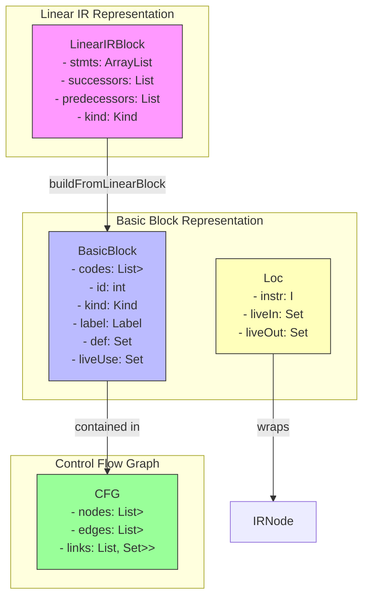
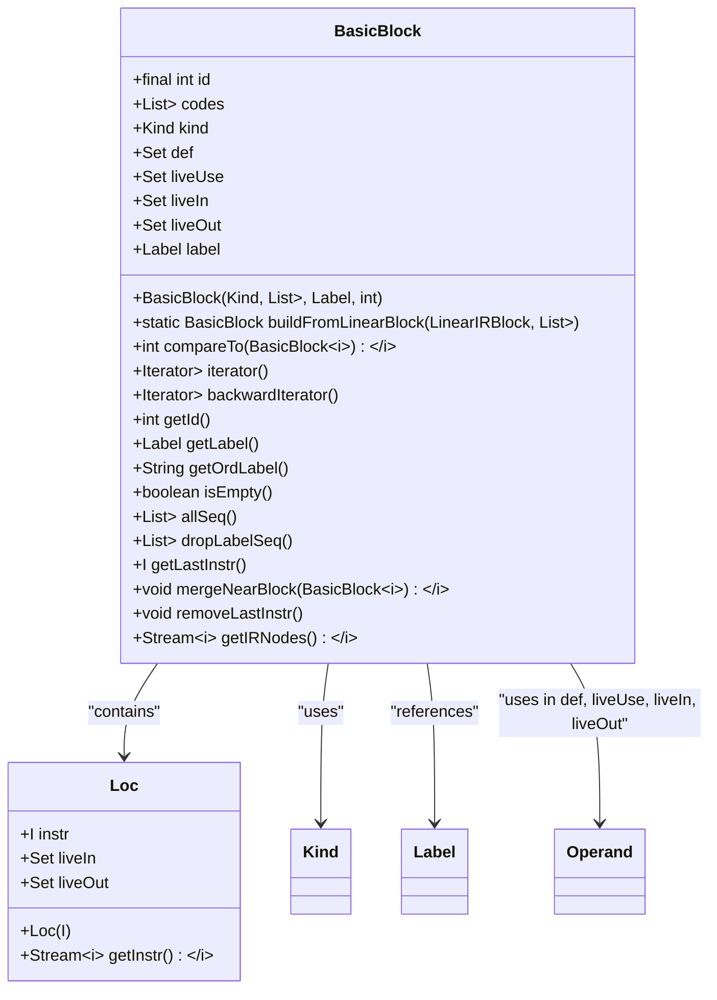
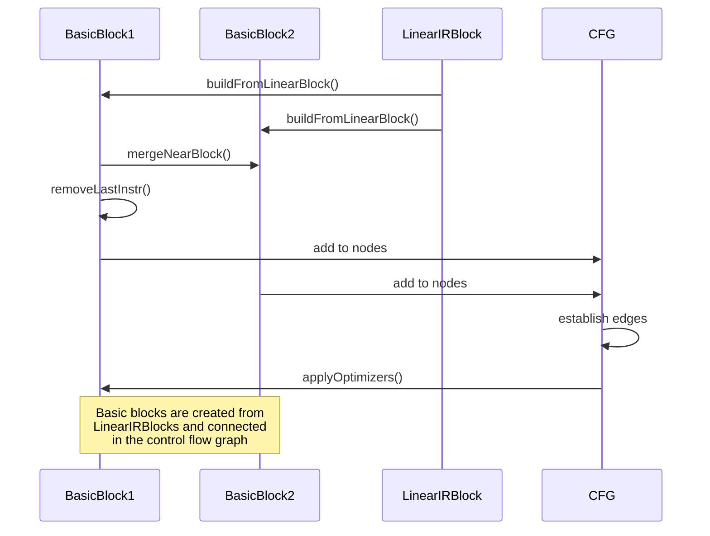
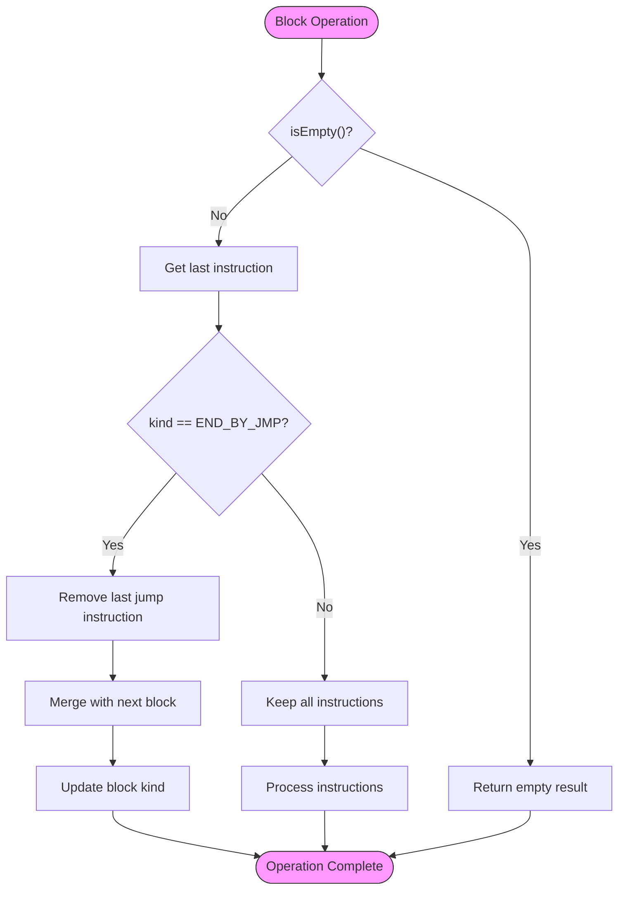
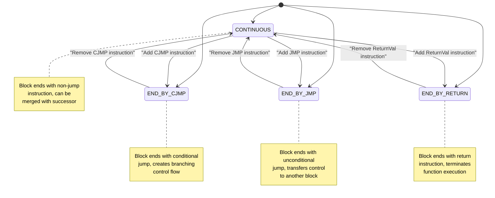
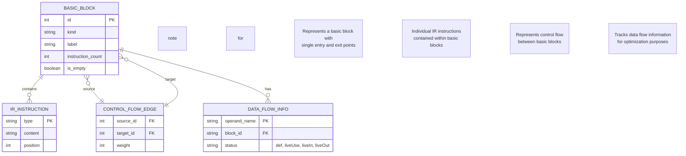

# Basic Block Implementation

<cite>
**Referenced Files in This Document**   
- [BasicBlock.java](file://ep20/src/main/java/org/teachfx/antlr4/ep20/pass/cfg/BasicBlock.java)
- [LinearIRBlock.java](file://ep20/src/main/java/org/teachfx/antlr4/ep20/pass/cfg/LinearIRBlock.java)
- [Kind.java](file://ep20/src/main/java/org/teachfx/antlr4/ep20/utils/Kind.java)
- [Loc.java](file://ep20/src/main/java/org/teachfx/antlr4/ep20/pass/cfg/Loc.java)
- [Label.java](file://ep20/src/main/java/org/teachfx/antlr4/ep20/ir/stmt/Label.java)
- [JMP.java](file://ep20/src/main/java/org/teachfx/antlr4/ep20/ir/stmt/JMP.java)
- [CJMP.java](file://ep20/src/main/java/org/teachfx/antlr4/ep20/ir/stmt/CJMP.java)
- [ReturnVal.java](file://ep20/src/main/java/org/teachfx/antlr4/ep20/ir/stmt/ReturnVal.java)
- [CFG.java](file://ep20/src/main/java/org/teachfx/antlr4/ep20/pass/cfg/CFG.java)
</cite>

## Table of Contents
1. [Introduction](#introduction)
2. [Core Components](#core-components)
3. [Architecture Overview](#architecture-overview)
4. [Detailed Component Analysis](#detailed-component-analysis)
5. [Dependency Analysis](#dependency-analysis)
6. [Performance Considerations](#performance-considerations)
7. [Troubleshooting Guide](#troubleshooting-guide)
8. [Conclusion](#conclusion)

## Introduction
The BasicBlock class represents a fundamental unit in the intermediate representation (IR) of a program, serving as a sequence of IR instructions with single entry and exit points. This documentation provides a comprehensive analysis of the BasicBlock implementation, its relationship with LinearIRBlock, and its role in control flow analysis and optimization. The class forms a critical component in the compiler's intermediate representation phase, enabling various optimization techniques through its structured representation of code blocks.

## Core Components

The BasicBlock implementation consists of several key components that work together to represent and manipulate sequences of IR instructions. The core components include the BasicBlock class itself, the LinearIRBlock class that serves as its source, and supporting classes like Loc, Kind, and various IR statement types. These components form a cohesive system for representing control flow and enabling optimization passes.

**Section sources**
- [BasicBlock.java](file://ep20/src/main/java/org/teachfx/antlr4/ep20/pass/cfg/BasicBlock.java#L1-L130)
- [LinearIRBlock.java](file://ep20/src/main/java/org/teachfx/antlr4/ep20/pass/cfg/LinearIRBlock.java#L1-L236)
- [Kind.java](file://ep20/src/main/java/org/teachfx/antlr4/ep20/utils/Kind.java#L1-L12)

## Architecture Overview

The BasicBlock class is part of a larger control flow analysis system that transforms linear IR blocks into a control flow graph (CFG) representation. This transformation enables various optimization techniques by providing a structured view of the program's control flow. The architecture connects the linear representation of code with a graph-based representation that facilitates analysis and transformation.



**Diagram sources **
- [BasicBlock.java](file://ep20/src/main/java/org/teachfx/antlr4/ep20/pass/cfg/BasicBlock.java#L1-L130)
- [LinearIRBlock.java](file://ep20/src/main/java/org/teachfx/antlr4/ep20/pass/cfg/LinearIRBlock.java#L1-L236)
- [CFG.java](file://ep20/src/main/java/org/teachfx/antlr4/ep20/pass/cfg/CFG.java#L1-L158)
- [Loc.java](file://ep20/src/main/java/org/teachfx/antlr4/ep20/pass/cfg/Loc.java#L1-L30)

## Detailed Component Analysis

### BasicBlock Class Analysis
The BasicBlock class represents a sequence of IR instructions with single entry and exit points, serving as a fundamental unit for optimization and analysis. It encapsulates a collection of IR statements and provides methods for managing control flow edges, enabling various optimization techniques.

#### Class Structure and Fields
The BasicBlock class contains several key fields that define its structure and behavior:



**Diagram sources **
- [BasicBlock.java](file://ep20/src/main/java/org/teachfx/antlr4/ep20/pass/cfg/BasicBlock.java#L1-L130)
- [Loc.java](file://ep20/src/main/java/org/teachfx/antlr4/ep20/pass/cfg/Loc.java#L1-L30)
- [Kind.java](file://ep20/src/main/java/org/teachfx/antlr4/ep20/utils/Kind.java#L1-L12)

#### Control Flow Management
The BasicBlock class provides methods for managing control flow edges and block relationships, which are essential for optimization and analysis:



**Diagram sources **
- [BasicBlock.java](file://ep20/src/main/java/org/teachfx/antlr4/ep20/pass/cfg/BasicBlock.java#L1-L130)
- [LinearIRBlock.java](file://ep20/src/main/java/org/teachfx/antlr4/ep20/pass/cfg/LinearIRBlock.java#L1-L236)
- [CFG.java](file://ep20/src/main/java/org/teachfx/antlr4/ep20/pass/cfg/CFG.java#L1-L158)

#### Block Operations and Transformations
The BasicBlock class supports various operations for modifying and transforming blocks during compilation:



**Diagram sources **
- [BasicBlock.java](file://ep20/src/main/java/org/teachfx/antlr4/ep20/pass/cfg/BasicBlock.java#L1-L130)
- [LinearIRBlock.java](file://ep20/src/main/java/org/teachfx/antlr4/ep20/pass/cfg/LinearIRBlock.java#L1-L236)

### LinearIRBlock Relationship Analysis
The relationship between BasicBlock and LinearIRBlock is fundamental to the compiler's intermediate representation system. LinearIRBlock represents a linear sequence of IR instructions, while BasicBlock represents these instructions in a form suitable for control flow analysis and optimization.

#### Transformation Process
The transformation from LinearIRBlock to BasicBlock involves several steps that prepare the code for optimization:

```mermaid
flowchart LR
LinearIRBlock[LinearIRBlock] --> ExtractStmts["Extract statements<br/>getStmts()"]
ExtractStmts --> CreateLocs["Create Loc objects<br/>for each statement"]
CreateLocs --> AssignId["Assign block ID<br/>from ord"]
AssignId --> DetermineKind["Determine block kind<br/>from last instruction"]
DetermineKind --> CreateLabel["Create label<br/>getLabel()"]
CreateLabel --> ConstructBB["Construct BasicBlock<br/>with parameters"]
ConstructBB --> BasicBlock[BasicBlock]
style LinearIRBlock fill:#f9f,stroke:#333
style BasicBlock fill:#bbf,stroke:#333
```



**Diagram sources **
- [BasicBlock.java](file://ep20/src/main/java/org/teachfx/antlr4/ep20/pass/cfg/BasicBlock.java#L1-L130)
- [LinearIRBlock.java](file://ep20/src/main/java/org/teachfx/antlr4/ep20/pass/cfg/LinearIRBlock.java#L1-L236)

#### Kind Enumeration Analysis
The Kind enumeration defines the different types of basic blocks based on their termination instructions, which affects optimization opportunities:



**Diagram sources **
- [Kind.java](file://ep20/src/main/java/org/teachfx/antlr4/ep20/utils/Kind.java#L1-L12)
- [LinearIRBlock.java](file://ep20/src/main/java/org/teachfx/antlr4/ep20/pass/cfg/LinearIRBlock.java#L1-L236)

### Control Flow Graph Integration
The BasicBlock class integrates with the Control Flow Graph (CFG) to enable comprehensive analysis and optimization of the program structure:



**Diagram sources **
- [BasicBlock.java](file://ep20/src/main/java/org/teachfx/antlr4/ep20/pass/cfg/BasicBlock.java#L1-L130)
- [CFG.java](file://ep20/src/main/java/org/teachfx/antlr4/ep20/pass/cfg/CFG.java#L1-L158)
- [LinearIRBlock.java](file://ep20/src/main/java/org/teachfx/antlr4/ep20/pass/cfg/LinearIRBlock.java#L1-L236)

**Section sources**
- [BasicBlock.java](file://ep20/src/main/java/org/teachfx/antlr4/ep20/pass/cfg/BasicBlock.java#L1-L130)
- [LinearIRBlock.java](file://ep20/src/main/java/org/teachfx/antlr4/ep20/pass/cfg/LinearIRBlock.java#L1-L236)
- [CFG.java](file://ep20/src/main/java/org/teachfx/antlr4/ep20/pass/cfg/CFG.java#L1-L158)
- [Kind.java](file://ep20/src/main/java/org/teachfx/antlr4/ep20/utils/Kind.java#L1-L12)

## Dependency Analysis

The BasicBlock class has several key dependencies that enable its functionality in the compiler's intermediate representation system:

```mermaid
graph TD
BasicBlock --> LinearIRBlock : "buildFromLinearBlock"
BasicBlock --> Loc : "contains Loc objects"
BasicBlock --> Kind : "uses for block type"
BasicBlock --> Label : "references for labeling"
BasicBlock --> Operand : "uses for data flow analysis"
BasicBlock --> IRNode : "generic type constraint"
BasicBlock --> CFG : "part of control flow graph"
LinearIRBlock --> JMP : "contains JMP instructions"
LinearIRBlock --> CJMP : "contains CJMP instructions"
LinearIRBlock --> ReturnVal : "contains return instructions"
LinearIRBlock --> Label : "contains label instructions"
CFG --> BasicBlock : "contains nodes"
CFG --> Triple : "represents edges"
style BasicBlock fill:#bbf,stroke:#333
style LinearIRBlock fill:#f9f,stroke:#333
style Loc fill:#ffb,stroke:#333
style CFG fill:#9f9,stroke:#333
```

**Diagram sources **
- [BasicBlock.java](file://ep20/src/main/java/org/teachfx/antlr4/ep20/pass/cfg/BasicBlock.java#L1-L130)
- [LinearIRBlock.java](file://ep20/src/main/java/org/teachfx/antlr4/ep20/pass/cfg/LinearIRBlock.java#L1-L236)
- [CFG.java](file://ep20/src/main/java/org/teachfx/antlr4/ep20/pass/cfg/CFG.java#L1-L158)
- [Loc.java](file://ep20/src/main/java/org/teachfx/antlr4/ep20/pass/cfg/Loc.java#L1-L30)

**Section sources**
- [BasicBlock.java](file://ep20/src/main/java/org/teachfx/antlr4/ep20/pass/cfg/BasicBlock.java#L1-L130)
- [LinearIRBlock.java](file://ep20/src/main/java/org/teachfx/antlr4/ep20/pass/cfg/LinearIRBlock.java#L1-L236)
- [CFG.java](file://ep20/src/main/java/org/teachfx/antlr4/ep20/pass/cfg/CFG.java#L1-L158)

## Performance Considerations
The BasicBlock implementation is designed with performance in mind, particularly for optimization passes that traverse and transform the control flow graph. The use of efficient data structures like ArrayList for instruction storage and TreeSet for predecessor/successor tracking ensures good performance characteristics. The separation of the linear IR representation from the graph-based basic block representation allows for efficient transformation between these forms as needed during different compilation phases.

## Troubleshooting Guide
When working with BasicBlock and related components, several common issues may arise:

1. **Empty Block Handling**: Ensure that operations on empty blocks are handled correctly, as methods like getLastInstr() will throw IndexOutOfBoundsException on empty blocks.

2. **Block Merging Issues**: When merging blocks with mergeNearBlock(), verify that the last instruction is properly handled, especially when it's a jump instruction.

3. **Kind Mismatch**: Ensure that the block kind is correctly updated after modifications, as this affects control flow analysis and optimization.

4. **Data Flow Analysis**: Verify that the def, liveUse, liveIn, and liveOut sets are properly maintained during block transformations.

5. **Label Management**: Ensure that labels are correctly assigned and referenced, particularly when blocks are split or merged.

**Section sources**
- [BasicBlock.java](file://ep20/src/main/java/org/teachfx/antlr4/ep20/pass/cfg/BasicBlock.java#L1-L130)
- [BasicBlockTest.java](file://ep20/src/test/java/org/teachfx/antlr4/ep20/pass/cfg/BasicBlockTest.java#L1-L405)

## Conclusion
The BasicBlock class provides a robust foundation for control flow analysis and optimization in the compiler. By representing sequences of IR instructions as units with well-defined entry and exit points, it enables various optimization techniques such as dead code elimination, constant propagation, and loop optimization. The relationship with LinearIRBlock allows for efficient transformation between linear and graph-based representations, while the integration with the CFG system enables comprehensive analysis of the program structure. The design supports both forward and backward traversal of instructions, making it suitable for various data flow analysis algorithms. Overall, the BasicBlock implementation serves as a critical component in the compiler's optimization pipeline.