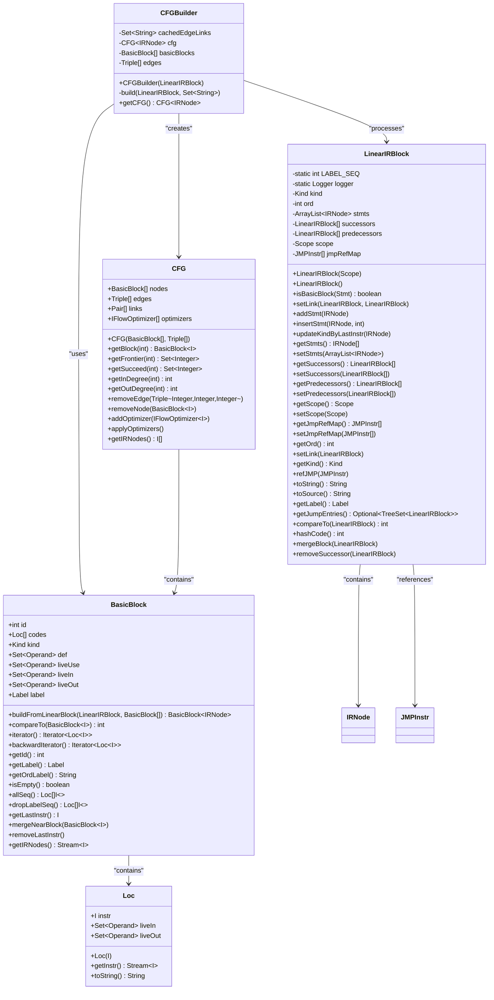
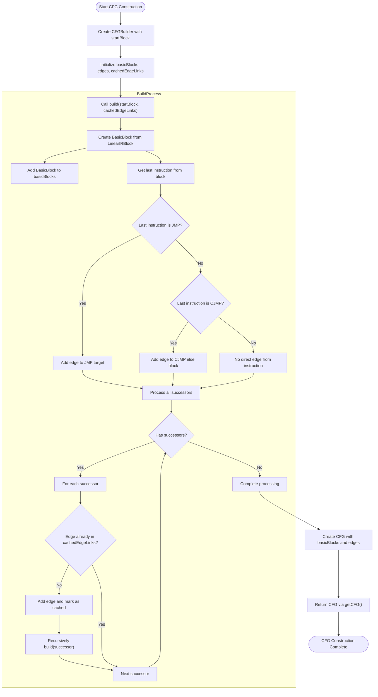
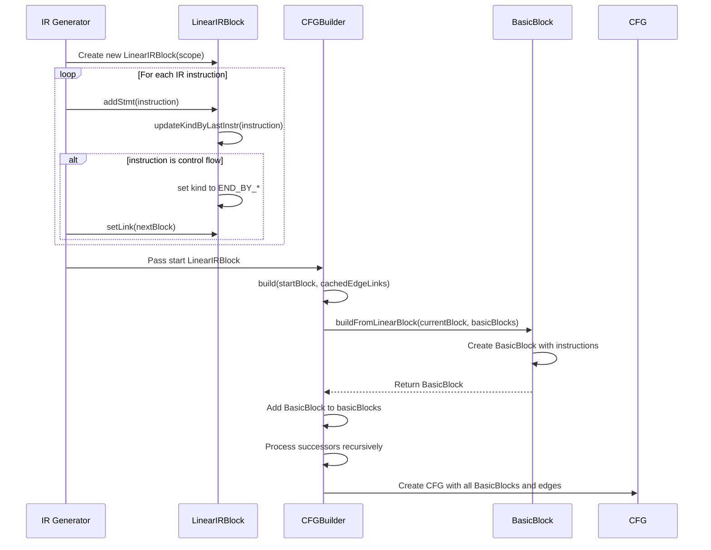
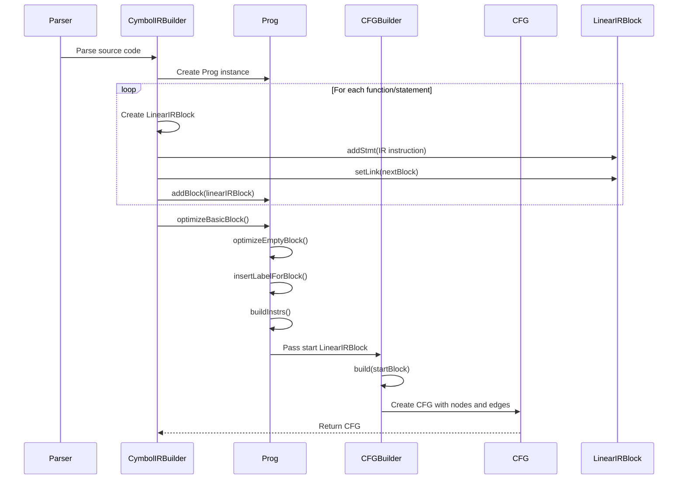
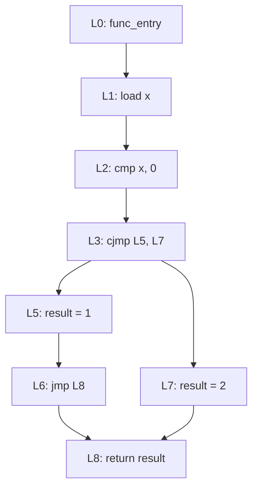

# CFG Construction Algorithm

<cite>
**Referenced Files in This Document**   
- [CFGBuilder.java](file://ep20/src/main/java/org/teachfx/antlr4/ep20/pass/cfg/CFGBuilder.java)
- [LinearIRBlock.java](file://ep20/src/main/java/org/teachfx/antlr4/ep20/pass/cfg/LinearIRBlock.java)
- [BasicBlock.java](file://ep20/src/main/java/org/teachfx/antlr4/ep20/pass/cfg/BasicBlock.java)
- [CFG.java](file://ep20/src/main/java/org/teachfx/antlr4/ep20/pass/cfg/CFG.java)
- [JMP.java](file://ep20/src/main/java/org/teachfx/antlr4/ep20/ir/stmt/JMP.java)
- [CJMP.java](file://ep20/src/main/java/org/teachfx/antlr4/ep20/ir/stmt/CJMP.java)
- [Label.java](file://ep20/src/main/java/org/teachfx/antlr4/ep20/ir/stmt/Label.java)
- [FuncEntryLabel.java](file://ep20/src/main/java/org/teachfx/antlr4/ep20/ir/stmt/FuncEntryLabel.java)
- [Prog.java](file://ep20/src/main/java/org/teachfx/antlr4/ep20/ir/Prog.java)
</cite>

## Table of Contents
1. [Introduction](#introduction)
2. [Core Components](#core-components)
3. [CFG Construction Algorithm](#cfg-construction-algorithm)
4. [Leader Identification and Basic Block Formation](#leader-identification-and-basic-block-formation)
5. [Control Flow Edge Establishment](#control-flow-edge-establishment)
6. [Edge Case Handling](#edge-case-handling)
7. [Integration with IR Generation](#integration-with-ir-generation)
8. [Step-by-Step Example](#step-by-step-example)
9. [Conclusion](#conclusion)

## Introduction
The Control Flow Graph (CFG) construction algorithm transforms linear Intermediate Representation (IR) code into a structured graph representation that captures program control flow. This document details the implementation of the `CFGBuilder` class, which processes `LinearIRBlock` instances to create `CFG` objects composed of `BasicBlock` nodes connected by control flow edges. The algorithm identifies leaders, forms basic blocks, establishes edges based on jump instructions, and handles various edge cases in program flow.

**Section sources**
- [CFGBuilder.java](file://ep20/src/main/java/org/teachfx/antlr4/ep20/pass/cfg/CFGBuilder.java#L1-L63)
- [LinearIRBlock.java](file://ep20/src/main/java/org/teachfx/antlr4/ep20/pass/cfg/LinearIRBlock.java#L1-L237)

## Core Components

The CFG construction system consists of several key components that work together to transform linear IR code into a structured control flow graph. The `CFGBuilder` class orchestrates the construction process, taking a `LinearIRBlock` as input and producing a `CFG` object. The `LinearIRBlock` represents a sequence of IR instructions with explicit successor relationships, while `BasicBlock` encapsulates these instructions as nodes in the final graph. The `CFG` class maintains the graph structure with nodes and edges, providing methods for traversal and analysis.



**Diagram sources**
- [CFGBuilder.java](file://ep20/src/main/java/org/teachfx/antlr4/ep20/pass/cfg/CFGBuilder.java#L1-L63)
- [CFG.java](file://ep20/src/main/java/org/teachfx/antlr4/ep20/pass/cfg/CFG.java#L1-L159)
- [BasicBlock.java](file://ep20/src/main/java/org/teachfx/antlr4/ep20/pass/cfg/BasicBlock.java#L1-L131)
- [LinearIRBlock.java](file://ep20/src/main/java/org/teachfx/antlr4/ep20/pass/cfg/LinearIRBlock.java#L1-L237)
- [Loc.java](file://ep20/src/main/java/org/teachfx/antlr4/ep20/pass/cfg/Loc.java#L1-L31)

**Section sources**
- [CFGBuilder.java](file://ep20/src/main/java/org/teachfx/antlr4/ep20/pass/cfg/CFGBuilder.java#L1-L63)
- [CFG.java](file://ep20/src/main/java/org/teachfx/antlr4/ep20/pass/cfg/CFG.java#L1-L159)
- [BasicBlock.java](file://ep20/src/main/java/org/teachfx/antlr4/ep20/pass/cfg/BasicBlock.java#L1-L131)
- [LinearIRBlock.java](file://ep20/src/main/java/org/teachfx/antlr4/ep20/pass/cfg/LinearIRBlock.java#L1-L237)
- [Loc.java](file://ep20/src/main/java/org/teachfx/antlr4/ep20/pass/cfg/Loc.java#L1-L31)

## CFG Construction Algorithm

The CFG construction algorithm implemented in `CFGBuilder` follows a recursive approach to transform linear IR blocks into a control flow graph. The process begins with a starting `LinearIRBlock` and recursively processes all reachable blocks. For each block, the algorithm creates a corresponding `BasicBlock` and establishes control flow edges based on the block's termination instruction and successor relationships.

The algorithm uses a depth-first traversal pattern, ensuring that all reachable blocks are processed. It maintains a cache of edge links to prevent duplicate edges in the graph. The construction process preserves the ordinal numbering of blocks, which is crucial for maintaining the relationship between the original IR code and the constructed CFG.



**Diagram sources**
- [CFGBuilder.java](file://ep20/src/main/java/org/teachfx/antlr4/ep20/pass/cfg/CFGBuilder.java#L1-L63)

**Section sources**
- [CFGBuilder.java](file://ep20/src/main/java/org/teachfx/antlr4/ep20/pass/cfg/CFGBuilder.java#L1-L63)

## Leader Identification and Basic Block Formation

The algorithm identifies leaders (first instructions of basic blocks) through the structure of `LinearIRBlock` objects, which are created during the IR generation phase. Each `LinearIRBlock` inherently represents a basic block, with its first instruction serving as a leader. The formation of basic blocks occurs during the IR generation phase, where consecutive instructions are grouped into `LinearIRBlock` instances until a control flow instruction (JMP, CJMP, or return) is encountered.

The `LinearIRBlock` class maintains the kind of block through its `kind` field, which is updated based on the last instruction added. This allows the system to distinguish between blocks that end with conditional jumps (`END_BY_CJMP`), unconditional jumps (`END_BY_JMP`), returns (`END_BY_RETURN`), or fall-through execution (`CONTINUOUS`). The block formation process ensures that each basic block contains a maximal sequence of instructions with a single entry point (the first instruction) and a single exit point (the last instruction).



**Diagram sources**
- [LinearIRBlock.java](file://ep20/src/main/java/org/teachfx/antlr4/ep20/pass/cfg/LinearIRBlock.java#L1-L237)
- [BasicBlock.java](file://ep20/src/main/java/org/teachfx/antlr4/ep20/pass/cfg/BasicBlock.java#L1-L131)
- [CFGBuilder.java](file://ep20/src/main/java/org/teachfx/antlr4/ep20/pass/cfg/CFGBuilder.java#L1-L63)

**Section sources**
- [LinearIRBlock.java](file://ep20/src/main/java/org/teachfx/antlr4/ep20/pass/cfg/LinearIRBlock.java#L1-L237)
- [BasicBlock.java](file://ep20/src/main/java/org/teachfx/antlr4/ep20/pass/cfg/BasicBlock.java#L1-L131)

## Control Flow Edge Establishment

Control flow edges are established based on both explicit jump instructions and implicit successor relationships. The algorithm processes two types of jump instructions: unconditional jumps (`JMP`) and conditional jumps (`CJMP`). For `JMP` instructions, an edge is created from the current block to the target block specified in the jump. For `CJMP` instructions, an edge is created to the else block, while the then block is handled through the successor relationship.

The edge establishment process uses a caching mechanism with the `cachedEdgeLinks` set to prevent duplicate edges. Each edge is represented as a triple containing the source block ordinal, target block ordinal, and a weight value. The weight values (5 for jump-based edges and 10 for successor-based edges) may be used for analysis or visualization purposes, though their specific meaning depends on the context in which the CFG is used.

The algorithm also processes all successor blocks, creating edges to each successor and recursively building the CFG for those blocks. This ensures that the entire control flow graph reachable from the starting block is constructed.

```mermaid
graph TD
A[Current Block] --> |Last instruction is JMP| B[JMP Target Block]
A --> |Last instruction is CJMP| C[CJMP Else Block]
A --> |Successor relationship| D[Successor Block 1]
A --> |Successor relationship| E[Successor Block 2]
D --> F[Further Successors]
E --> G[Further Successors]
style A fill:#f9f,stroke:#333
style B fill:#bbf,stroke:#333
style C fill:#bbf,stroke:#333
style D fill:#bbf,stroke:#333
style E fill:#bbf,stroke:#333
classDef jumpEdge stroke:#f66,stroke-width:2px
classDef successorEdge stroke:#66f,stroke-width:1px,stroke-dasharray:5,5
class A--B jumpEdge
class A--C jumpEdge
class A--D successorEdge
class A--E successorEdge
```

**Diagram sources**
- [CFGBuilder.java](file://ep20/src/main/java/org/teachfx/antlr4/ep20/pass/cfg/CFGBuilder.java#L1-L63)
- [JMP.java](file://ep20/src/main/java/org/teachfx/antlr4/ep20/ir/stmt/JMP.java#L1-L46)
- [CJMP.java](file://ep20/src/main/java/org/teachfx/antlr4/ep20/ir/stmt/CJMP.java#L1-L61)

**Section sources**
- [CFGBuilder.java](file://ep20/src/main/java/org/teachfx/antlr4/ep20/pass/cfg/CFGBuilder.java#L1-L63)
- [JMP.java](file://ep20/src/main/java/org/teachfx/antlr4/ep20/ir/stmt/JMP.java#L1-L46)
- [CJMP.java](file://ep20/src/main/java/org/teachfx/antlr4/ep20/ir/stmt/CJMP.java#L1-L61)

## Edge Case Handling

The CFG construction algorithm handles several edge cases that commonly occur in program control flow. One important edge case is empty blocks, which are processed during the IR optimization phase in the `Prog` class. The `optimizeEmptyBlock` method detects empty blocks and redirects all references to point to the block's successor, effectively removing the empty block from the control flow.

Another edge case is the handling of function entry points, which are marked with `FuncEntryLabel` instructions. These labels are preserved in the CFG but may be filtered out during certain analyses. The algorithm also handles multiple entry and exit points through the successor and predecessor relationships in `LinearIRBlock`, allowing for complex control flow patterns including loops and exception handling.

The construction process also handles unconditional jumps at the end of functions by creating appropriate edges to the target blocks, even if those blocks represent function exits or other termination points. The recursive nature of the algorithm ensures that all reachable blocks are processed, regardless of the complexity of the control flow.

```mermaid
flowchart TD
subgraph EmptyBlockHandling
A[Empty Block] --> B{Has Successors?}
B --> |No| C[Mark for Removal]
B --> |Yes| D[Get First Successor]
D --> E[Update JMP/CJMP references]
E --> F[Update Predecessor Successors]
F --> G[Mark for Removal]
G --> H[Remove in cleanup phase]
end
subgraph FunctionEntryHandling
I[FuncEntryLabel] --> J[Preserve in BasicBlock]
J --> K[May be filtered in analysis]
K --> L[Source location preserved]
end
subgraph MultipleExitHandling
M[Block with multiple exits] --> N[Process each successor]
N --> O[Create edge to each successor]
O --> P[Recursive processing]
end
subgraph UnconditionalJumpHandling
Q[Unconditional JMP] --> R[Create edge to target]
R --> S[Process target block]
S --> T[Handle fall-through if applicable]
end
```



**Diagram sources**
- [Prog.java](file://ep20/src/main/java/org/teachfx/antlr4/ep20/ir/Prog.java#L1-L138)
- [FuncEntryLabel.java](file://ep20/src/main/java/org/teachfx/antlr4/ep20/ir/stmt/FuncEntryLabel.java#L1-L22)
- [LinearIRBlock.java](file://ep20/src/main/java/org/teachfx/antlr4/ep20/pass/cfg/LinearIRBlock.java#L1-L237)

**Section sources**
- [Prog.java](file://ep20/src/main/java/org/teachfx/antlr4/ep20/ir/Prog.java#L1-L138)
- [FuncEntryLabel.java](file://ep20/src/main/java/org/teachfx/antlr4/ep20/ir/stmt/FuncEntryLabel.java#L1-L22)

## Integration with IR Generation

The CFG construction process is tightly integrated with the IR generation phase, with location information preserved throughout the transformation. The `CymbolIRBuilder` class, which generates the linear IR code, creates `LinearIRBlock` instances with proper successor relationships established through the `setLink` method. This ensures that the control flow structure is accurately represented before CFG construction begins.

Location information is preserved through the `Scope` objects associated with each block and instruction. The `Label` class maintains sequence numbers and scope information, allowing the original source location to be reconstructed when needed. The `Prog` class serves as the container for all IR blocks and provides methods for linearizing the instructions and optimizing the block structure before CFG construction.

The integration between IR generation and CFG construction follows a pipeline pattern, where the output of the IR generation phase (a collection of linked `LinearIRBlock` objects) serves as the input to the CFG construction phase. This separation of concerns allows each phase to focus on its specific responsibilities while maintaining the necessary information for the next phase.



**Diagram sources**
- [Prog.java](file://ep20/src/main/java/org/teachfx/antlr4/ep20/ir/Prog.java#L1-L138)
- [LinearIRBlock.java](file://ep20/src/main/java/org/teachfx/antlr4/ep20/pass/cfg/LinearIRBlock.java#L1-L237)
- [CFGBuilder.java](file://ep20/src/main/java/org/teachfx/antlr4/ep20/pass/cfg/CFGBuilder.java#L1-L63)
- [Label.java](file://ep20/src/main/java/org/teachfx/antlr4/ep20/ir/stmt/Label.java#L1-L114)

**Section sources**
- [Prog.java](file://ep20/src/main/java/org/teachfx/antlr4/ep20/ir/Prog.java#L1-L138)
- [LinearIRBlock.java](file://ep20/src/main/java/org/teachfx/antlr4/ep20/pass/cfg/LinearIRBlock.java#L1-L237)

## Step-by-Step Example

Consider a simple program with a conditional statement that translates to the following linear IR code:

1. Function entry label
2. Load variable 'x'
3. Compare with constant 0
4. Conditional jump to else block if false
5. Assign 1 to result
6. Unconditional jump to end
7. Else block label
8. Assign 2 to result
9. End block label
10. Return result

The CFG construction process would handle this as follows:



The algorithm starts with the first block (L0-L3) and identifies it as ending with a CJMP instruction. It creates an edge from block L1 to block L7 (the else block) based on the CJMP instruction. It then processes the successors of block L1, which includes block L5 (the then block). For block L5, it creates an edge to block L8 based on the JMP instruction. Finally, it processes block L7 and creates an edge to block L8. The resulting CFG accurately represents the control flow of the original program, with the conditional branch properly connected to both the then and else paths.

**Section sources**
- [CFGBuilder.java](file://ep20/src/main/java/org/teachfx/antlr4/ep20/pass/cfg/CFGBuilder.java#L1-L63)
- [LinearIRBlock.java](file://ep20/src/main/java/org/teachfx/antlr4/ep20/pass/cfg/LinearIRBlock.java#L1-L237)

## Conclusion

The CFG construction algorithm implemented in the `CFGBuilder` class provides a robust mechanism for transforming linear IR code into a structured control flow graph. By leveraging the `LinearIRBlock` structure created during IR generation, the algorithm efficiently identifies basic blocks and establishes control flow edges based on jump instructions and successor relationships. The recursive depth-first approach ensures comprehensive coverage of all reachable code paths, while the caching mechanism prevents duplicate edges.

The integration between IR generation and CFG construction preserves location information and maintains the semantic structure of the original program. The algorithm handles various edge cases, including empty blocks and complex control flow patterns, making it suitable for use in optimization and analysis passes. The resulting CFG provides a foundation for subsequent compiler phases such as data flow analysis, optimization, and code generation.

**Section sources**
- [CFGBuilder.java](file://ep20/src/main/java/org/teachfx/antlr4/ep20/pass/cfg/CFGBuilder.java#L1-L63)
- [LinearIRBlock.java](file://ep20/src/main/java/org/teachfx/antlr4/ep20/pass/cfg/LinearIRBlock.java#L1-L237)
- [CFG.java](file://ep20/src/main/java/org/teachfx/antlr4/ep20/pass/cfg/CFG.java#L1-L159)