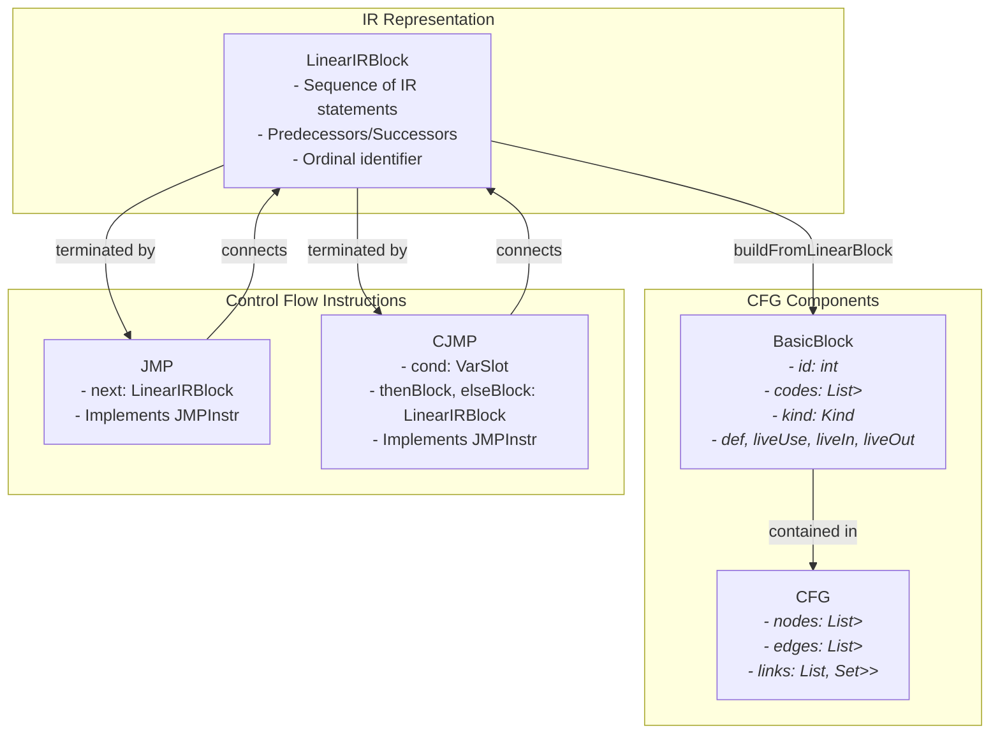
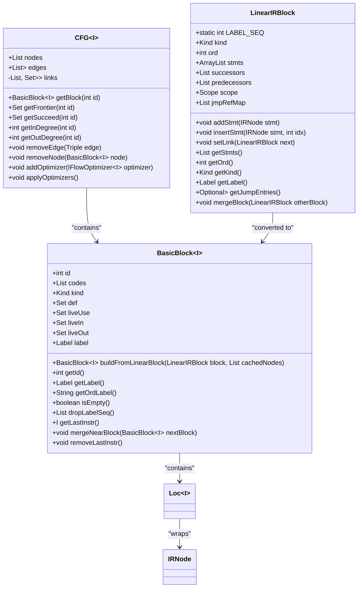
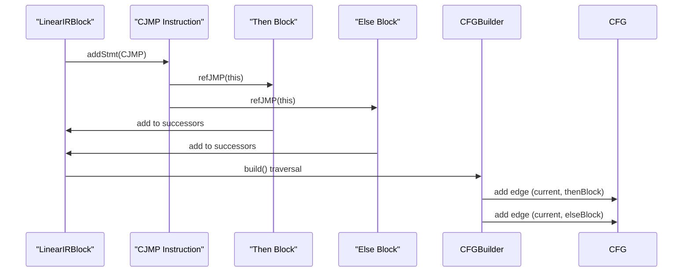
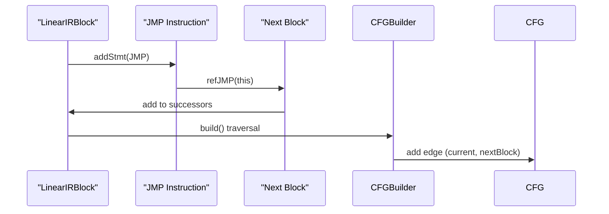
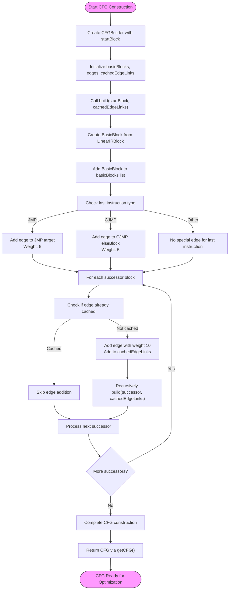

# CFG Representation

<cite>
**Referenced Files in This Document**   
- [CFG.java](file://ep20/src/main/java/org/teachfx/antlr4/ep20/pass/cfg/CFG.java)
- [BasicBlock.java](file://ep20/src/main/java/org/teachfx/antlr4/ep20/pass/cfg/BasicBlock.java)
- [CFGBuilder.java](file://ep20/src/main/java/org/teachfx/antlr4/ep20/pass/cfg/CFGBuilder.java)
- [LinearIRBlock.java](file://ep20/src/main/java/org/teachfx/antlr4/ep20/pass/cfg/LinearIRBlock.java)
- [CJMP.java](file://ep20/src/main/java/org/teachfx/antlr4/ep20/ir/stmt/CJMP.java)
- [JMP.java](file://ep20/src/main/java/org/teachfx/antlr4/ep20/ir/stmt/JMP.java)
- [Label.java](file://ep20/src/main/java/org/teachfx/antlr4/ep20/ir/stmt/Label.java)
</cite>

## Table of Contents
1. [Introduction](#introduction)
2. [Core Components](#core-components)
3. [Architecture Overview](#architecture-overview)
4. [Detailed Component Analysis](#detailed-component-analysis)
5. [Control Flow Graph Construction](#control-flow-graph-construction)
6. [Graph Traversal and Manipulation](#graph-traversal-and-manipulation)
7. [CFG Representations for Control Structures](#cfg-representations-for-control-structures)
8. [Relationship Between IR Statements and CFG Structure](#relationship-between-ir-statements-and-cfg-structure)
9. [Fall-Through and Jump Edge Management](#fall-through-and-jump-edge-management)
10. [Conclusion](#conclusion)

## Introduction
The Control Flow Graph (CFG) is a fundamental data structure in compiler design that represents the flow of execution within a program. This document provides a comprehensive analysis of the CFG implementation in the Antlr4-based programming language compiler, focusing on how it models program control flow using basic blocks and directed edges. The CFG serves as a critical intermediate representation that enables various compiler optimizations and analyses.

## Core Components
The CFG system is built upon several core components that work together to represent and manipulate control flow. These include the CFG class itself, BasicBlock for representing sequences of instructions, LinearIRBlock as an intermediate representation, and specialized IR statements like CJMP and JMP that define control flow transitions.

**Section sources**
- [CFG.java](file://ep20/src/main/java/org/teachfx/antlr4/ep20/pass/cfg/CFG.java#L1-L158)
- [BasicBlock.java](file://ep20/src/main/java/org/teachfx/antlr4/ep20/pass/cfg/BasicBlock.java#L1-L130)

## Architecture Overview
The CFG architecture follows a hierarchical structure where LinearIRBlock instances are transformed into BasicBlock instances, which are then connected through directed edges to form the complete control flow graph. The system uses a builder pattern (CFGBuilder) to construct the graph from linear intermediate representation blocks, ensuring proper connection of basic blocks based on control flow instructions.



**Diagram sources**
- [LinearIRBlock.java](file://ep20/src/main/java/org/teachfx/antlr4/ep20/pass/cfg/LinearIRBlock.java#L1-L236)
- [BasicBlock.java](file://ep20/src/main/java/org/teachfx/antlr4/ep20/pass/cfg/BasicBlock.java#L1-L130)
- [CFG.java](file://ep20/src/main/java/org/teachfx/antlr4/ep20/pass/cfg/CFG.java#L1-L158)
- [JMP.java](file://ep20/src/main/java/org/teachfx/antlr4/ep20/ir/stmt/JMP.java#L1-L45)
- [CJMP.java](file://ep20/src/main/java/org/teachfx/antlr4/ep20/ir/stmt/CJMP.java#L1-L60)

## Detailed Component Analysis

### CFG Class Analysis
The CFG class serves as the primary container for the control flow graph, managing basic blocks and their interconnections. It implements Iterable<BasicBlock<I>> to allow traversal of all blocks in the graph.

#### Data Structures for Predecessors and Successors
The CFG uses a sophisticated data structure to efficiently manage predecessor and successor relationships between basic blocks. The `links` field contains a list of pairs, where each pair consists of sets of predecessor and successor node IDs.



**Diagram sources**
- [CFG.java](file://ep20/src/main/java/org/teachfx/antlr4/ep20/pass/cfg/CFG.java#L1-L158)
- [BasicBlock.java](file://ep20/src/main/java/org/teachfx/antlr4/ep20/pass/cfg/BasicBlock.java#L1-L130)
- [LinearIRBlock.java](file://ep20/src/main/java/org/teachfx/antlr4/ep20/pass/cfg/LinearIRBlock.java#L1-L236)

**Section sources**
- [CFG.java](file://ep20/src/main/java/org/teachfx/antlr4/ep20/pass/cfg/CFG.java#L1-L158)
- [BasicBlock.java](file://ep20/src/main/java/org/teachfx/antlr4/ep20/pass/cfg/BasicBlock.java#L1-L130)

### Control Flow Instructions Analysis
The control flow behavior is defined by specialized IR statements that determine how execution proceeds from one basic block to another.

#### CJMP (Conditional Jump) Analysis
The CJMP instruction represents conditional branching in the control flow, typically corresponding to if-else statements in high-level code.



**Diagram sources**
- [CJMP.java](file://ep20/src/main/java/org/teachfx/antlr4/ep20/ir/stmt/CJMP.java#L1-L60)
- [LinearIRBlock.java](file://ep20/src/main/java/org/teachfx/antlr4/ep20/pass/cfg/LinearIRBlock.java#L1-L236)
- [CFGBuilder.java](file://ep20/src/main/java/org/teachfx/antlr4/ep20/pass/cfg/CFGBuilder.java#L1-L63)

#### JMP (Unconditional Jump) Analysis
The JMP instruction represents unconditional jumps in the control flow, typically corresponding to goto statements or the end of loops.



**Diagram sources**
- [JMP.java](file://ep20/src/main/java/org/teachfx/antlr4/ep20/ir/stmt/JMP.java#L1-L45)
- [LinearIRBlock.java](file://ep20/src/main/java/org/teachfx/antlr4/ep20/pass/cfg/LinearIRBlock.java#L1-L236)
- [CFGBuilder.java](file://ep20/src/main/java/org/teachfx/antlr4/ep20/pass/cfg/CFGBuilder.java#L1-L63)

## Control Flow Graph Construction
The CFG construction process transforms linear intermediate representation blocks into a graph structure that accurately represents program control flow.

### CFGBuilder Process Flow
The CFGBuilder class implements a recursive algorithm to construct the control flow graph from LinearIRBlock instances.



**Diagram sources**
- [CFGBuilder.java](file://ep20/src/main/java/org/teachfx/antlr4/ep20/pass/cfg/CFGBuilder.java#L1-L63)
- [LinearIRBlock.java](file://ep20/src/main/java/org/teachfx/antlr4/ep20/pass/cfg/LinearIRBlock.java#L1-L236)
- [BasicBlock.java](file://ep20/src/main/java/org/teachfx/antlr4/ep20/pass/cfg/BasicBlock.java#L1-L130)

**Section sources**
- [CFGBuilder.java](file://ep20/src/main/java/org/teachfx/antlr4/ep20/pass/cfg/CFGBuilder.java#L1-L63)

## Graph Traversal and Manipulation
The CFG provides various methods for traversing and manipulating the control flow graph, enabling analysis and optimization passes.

### Graph Traversal Methods
The CFG class implements the Iterable interface, allowing direct iteration over basic blocks. Additional methods provide access to predecessor and successor information.

```mermaid
classDiagram
class CFGTraversal {
+iterator() Iterator<BasicBlock~I~>
+getFrontier(int id) Set<Integer>
+getSucceed(int id) Set<Integer>
+getInDegree(int id) int
+getOutDegree(int id) int
+getInEdges(int key) Stream<Triple<Integer, Integer, Integer>>
}
class GraphManipulation {
+removeEdge(Triple<Integer, Integer, Integer> edge) void
+removeNode(BasicBlock~I~ node) void
+addOptimizer(IFlowOptimizer~I~ optimizer) void
+applyOptimizers() void
}
CFGTraversal --> CFG : "methods in"
GraphManipulation --> CFG : "methods in"
CFG --> BasicBlock : "nodes"
CFG --> "Triple<Integer,Integer,Integer>" : "edges"
CFG --> "Pair<Set<Integer>, Set<Integer>>" : "links"
click CFGTraversal href "#graph-traversal-methods" "Go to Traversal Methods"
click GraphManipulation href "#graph-manipulation-methods" "Go to Manipulation Methods"
```

**Diagram sources**
- [CFG.java](file://ep20/src/main/java/org/teachfx/antlr4/ep20/pass/cfg/CFG.java#L1-L158)

**Section sources**
- [CFG.java](file://ep20/src/main/java/org/teachfx/antlr4/ep20/pass/cfg/CFG.java#L1-L158)

## CFG Representations for Control Structures
The CFG accurately represents various control structures found in programming languages through specific patterns of basic blocks and edges.

### If-Else Statement Representation
The if-else control structure is represented by a conditional jump (CJMP) that branches to different basic blocks based on the condition evaluation.

```mermaid
graph TD
A[Condition Block\nCJMP instruction] --> B[Then Block]
A --> C[Else Block]
B --> D[Join Block]
C --> D
style A fill:#ffcccc,stroke:#333
style B fill:#ccffcc,stroke:#333
style C fill:#ccffcc,stroke:#333
style D fill:#ccccff,stroke:#333
subgraph "If-Else Structure"
A
B
C
D
end
note right of A: "CJMP with condition\nCreates two edges"
note right of D: "Join point\nMerges control flow"
```

**Diagram sources**
- [CJMP.java](file://ep20/src/main/java/org/teachfx/antlr4/ep20/ir/stmt/CJMP.java#L1-L60)
- [CFGBuilder.java](file://ep20/src/main/java/org/teachfx/antlr4/ep20/pass/cfg/CFGBuilder.java#L1-L63)

### While Loop Representation
The while loop control structure is represented by a conditional jump that creates a cycle in the control flow graph.

```mermaid
graph TD
A[Loop Condition\nCJMP instruction] --> B[Loop Body]
B --> C[Back Edge\nto Condition]
C --> A
A --> D[Exit Block]
style A fill:#ffcccc,stroke:#333
style B fill:#ccffcc,stroke:#333
style D fill:#ccccff,stroke:#333
subgraph "While Loop Structure"
A
B
C
D
end
note right of A: "Loop header\nContains condition"
note right of B: "Loop body\nExecutes when\ncondition true"
note right of D: "Loop exit\nWhen condition false"
```

**Diagram sources**
- [CJMP.java](file://ep20/src/main/java/org/teachfx/antlr4/ep20/ir/stmt/CJMP.java#L1-L60)
- [CFGBuilder.java](file://ep20/src/main/java/org/teachfx/antlr4/ep20/pass/cfg/CFGBuilder.java#L1-L63)

### Nested Conditional Representation
Nested conditional structures create more complex control flow patterns with multiple levels of branching.

```mermaid
graph TD
A[Outer Condition\nCJMP] --> B[Inner Condition\nCJMP]
A --> C[Else Block 1]
B --> D[Then Block 2]
B --> E[Else Block 2]
D --> F[Join Point]
E --> F
C --> F
F --> G[Continue]
style A fill:#ffcccc,stroke:#333
style B fill:#ffcccc,stroke:#333
style C fill:#ccffcc,stroke:#333
style D fill:#ccffcc,stroke:#333
style E fill:#ccffcc,stroke:#333
style F fill:#ccccff,stroke:#333
subgraph "Nested Conditionals"
A
B
C
D
E
F
G
end
note right of A: "Outer if condition"
note right of B: "Inner if condition"
note right of F: "Multiple paths\nconverge here"
```

**Diagram sources**
- [CJMP.java](file://ep20/src/main/java/org/teachfx/antlr4/ep20/ir/stmt/CJMP.java#L1-L60)
- [CFGBuilder.java](file://ep20/src/main/java/org/teachfx/antlr4/ep20/pass/cfg/CFGBuilder.java#L1-L63)

## Relationship Between IR Statements and CFG Structure
The relationship between intermediate representation statements and the CFG structure is fundamental to the compiler's operation.

### IR Statement to Basic Block Mapping
Each basic block in the CFG corresponds to a sequence of IR statements from a LinearIRBlock, with control flow instructions determining block boundaries.

```mermaid
erDiagram
LINEAR_IR_BLOCK ||--o{ BASIC_BLOCK : "converted to"
BASIC_BLOCK ||--o{ LOC : "contains"
LOC ||--|| IR_NODE : "wraps"
BASIC_BLOCK ||--o{ CFG : "contained in"
IR_NODE ||--o{ JMP_INSTR : "specialized"
JMP_INSTR }o--|| JMP : "implements"
JMP_INSTR }o--|| CJMP : "implements"
LINEAR_IR_BLOCK }o--|| JMP : "contains"
LINEAR_IR_BLOCK }o--|| CJMP : "contains"
LINEAR_IR_BLOCK {
int ord
Kind kind
ArrayList<IRNode> stmts
List<LinearIRBlock> successors
List<LinearIRBlock> predecessors
}
BASIC_BLOCK {
int id
List<Loc<IRNode>> codes
Kind kind
Label label
}
LOC {
IRNode instr
}
IR_NODE {
<<abstract>>
}
JMP_INSTR {
<<interface>>
}
JMP {
LinearIRBlock next
}
CJMP {
VarSlot cond
LinearIRBlock thenBlock
LinearIRBlock elseBlock
}
CFG {
List<BasicBlock<IRNode>> nodes
List<Triple<Integer, Integer, Integer>> edges
}
```

**Diagram sources**
- [LinearIRBlock.java](file://ep20/src/main/java/org/teachfx/antlr4/ep20/pass/cfg/LinearIRBlock.java#L1-L236)
- [BasicBlock.java](file://ep20/src/main/java/org/teachfx/antlr4/ep20/pass/cfg/BasicBlock.java#L1-L130)
- [CFG.java](file://ep20/src/main/java/org/teachfx/antlr4/ep20/pass/cfg/CFG.java#L1-L158)
- [JMP.java](file://ep20/src/main/java/org/teachfx/antlr4/ep20/ir/stmt/JMP.java#L1-L45)
- [CJMP.java](file://ep20/src/main/java/org/teachfx/antlr4/ep20/ir/stmt/CJMP.java#L1-L60)

**Section sources**
- [LinearIRBlock.java](file://ep20/src/main/java/org/teachfx/antlr4/ep20/pass/cfg/LinearIRBlock.java#L1-L236)
- [BasicBlock.java](file://ep20/src/main/java/org/teachfx/antlr4/ep20/pass/cfg/BasicBlock.java#L1-L130)

## Fall-Through and Jump Edge Management
The CFG implementation distinguishes between fall-through edges and jump edges, managing them with different weights and handling strategies.

### Edge Weighting Strategy
The system uses edge weights to differentiate between different types of control flow transitions, with jump edges having lower weights than fall-through edges.

```mermaid
graph TD
A[Basic Block] --> |Weight: 5| B[JMP Target]
A --> |Weight: 5| C[CJMP Else Block]
A --> |Weight: 10| D[Successor Block]
style A fill:#f0f0f0,stroke:#333
style B fill:#c0e0ff,stroke:#333
style C fill:#c0e0ff,stroke:#333
style D fill:#e0f0c0,stroke:#333
subgraph "Edge Types"
A
B
C
D
end
note right of B: "Explicit jump\nWeight: 5"
note right of C: "Conditional jump\nWeight: 5"
note right of D: "Fall-through\nWeight: 10"
legend["Edge Weight Legend"]
legend --> "5: Jump edges (JMP, CJMP targets)"
legend --> "10: Fall-through edges (successors)"
```

**Diagram sources**
- [CFGBuilder.java](file://ep20/src/main/java/org/teachfx/antlr4/ep20/pass/cfg/CFGBuilder.java#L1-L63)

**Section sources**
- [CFGBuilder.java](file://ep20/src/main/java/org/teachfx/antlr4/ep20/pass/cfg/CFGBuilder.java#L1-L63)

## Conclusion
The CFG implementation in this Antlr4-based compiler provides a robust foundation for control flow analysis and optimization. By representing program execution as a graph of basic blocks connected by directed edges, the system enables sophisticated compiler analyses such as data flow analysis, optimization, and code generation. The design effectively separates concerns between the linear intermediate representation (LinearIRBlock), the graph structure (CFG), and the individual basic blocks (BasicBlock), while maintaining efficient connections between these components. The use of edge weights to distinguish between jump and fall-through edges provides additional information that can be leveraged by optimization passes. This comprehensive CFG implementation serves as a critical component in the compiler's ability to generate efficient machine code from high-level source programs.