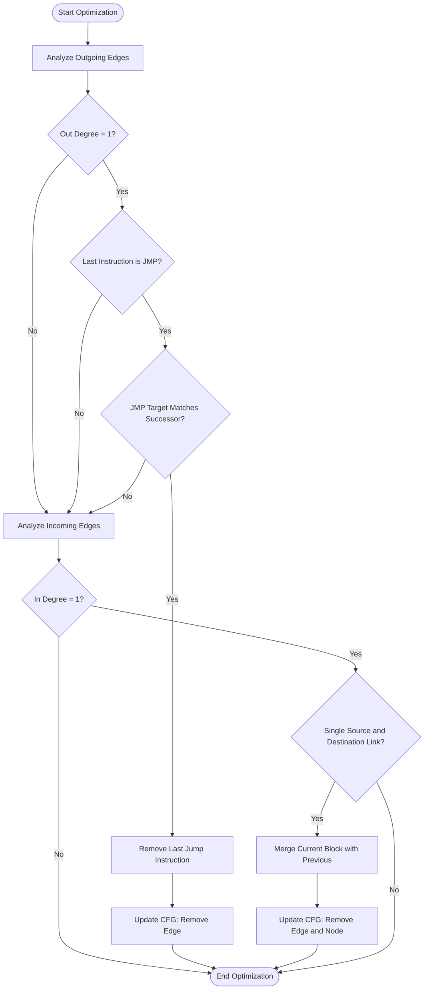
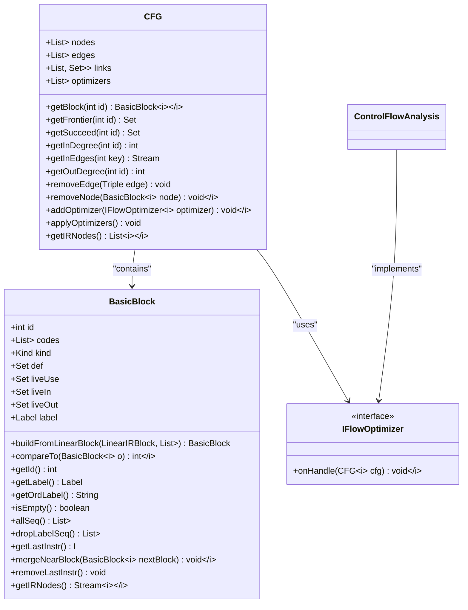
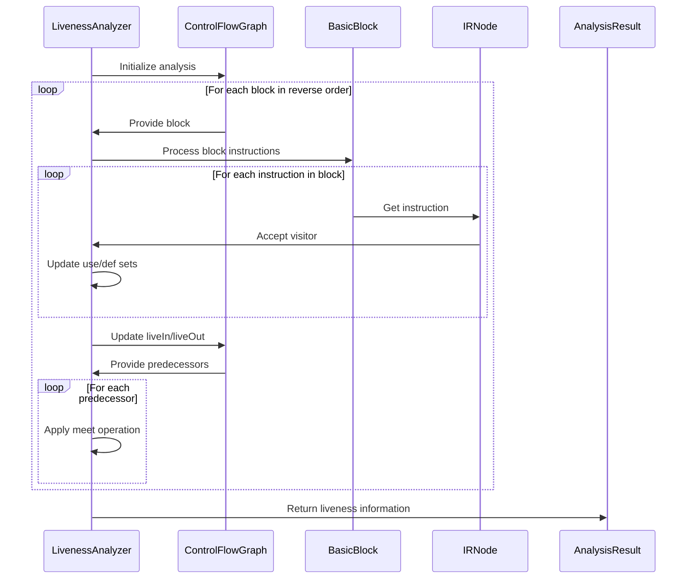

# Control Flow Analysis Framework

<cite>
**Referenced Files in This Document**   
- [ControlFlowAnalysis.java](file://ep20/src/main/java/org/teachfx/antlr4/ep20/pass/cfg/ControlFlowAnalysis.java)
- [CFG.java](file://ep20/src/main/java/org/teachfx/antlr4/ep20/pass/cfg/CFG.java)
- [BasicBlock.java](file://ep20/src/main/java/org/teachfx/antlr4/ep20/pass/cfg/BasicBlock.java)
- [IFlowOptimizer.java](file://ep20/src/main/java/org/teachfx/antlr4/ep20/pass/cfg/IFlowOptimizer.java)
- [LivenessAnalysis.java](file://ep20/src/main/java/org/teachfx/antlr4/ep20/pass/cfg/LivenessAnalysis.java)
</cite>

## Table of Contents
1. [Introduction](#introduction)
2. [Core Components](#core-components)
3. [Architecture Overview](#architecture-overview)
4. [Detailed Component Analysis](#detailed-component-analysis)
5. [Data Flow Analysis Framework](#data-flow-analysis-framework)
6. [Forward and Backward Analysis Support](#forward-and-backward-analysis-support)
7. [Worklist Algorithms](#worklist-algorithms)
8. [Specific Analysis Implementations](#specific-analysis-implementations)
9. [Custom Analysis Implementation](#custom-analysis-implementation)
10. [Convergence Criteria and Complexity](#convergence-criteria-and-complexity)
11. [Configuration Options](#configuration-options)
12. [Analysis Results Storage and Access](#analysis-results-storage-and-access)
13. [Conclusion](#conclusion)

## Introduction
The Control Flow Analysis framework provides infrastructure for data flow analyses on Control Flow Graphs (CFG). This document explains the iterative algorithm framework for solving data flow problems using meet operations and transfer functions. The framework supports both forward and backward analyses with appropriate worklist algorithms. It is used by specific analyses like liveness and reaching definitions, and allows for the implementation of custom analyses. The document covers convergence criteria, complexity considerations, configuration options for analysis precision and performance trade-offs, and how analysis results are stored and accessed by optimization passes.

## Core Components
The Control Flow Analysis framework consists of several core components that work together to enable data flow analysis on control flow graphs. These components include the ControlFlowAnalysis class, CFG (Control Flow Graph) structure, BasicBlock representation, and the IFlowOptimizer interface that defines the optimization contract.

**Section sources**
- [ControlFlowAnalysis.java](file://ep20/src/main/java/org/teachfx/antlr4/ep20/pass/cfg/ControlFlowAnalysis.java#L1-L68)
- [CFG.java](file://ep20/src/main/java/org/teachfx/antlr4/ep20/pass/cfg/CFG.java#L1-L159)
- [BasicBlock.java](file://ep20/src/main/java/org/teachfx/antlr4/ep20/pass/cfg/BasicBlock.java#L1-L131)
- [IFlowOptimizer.java](file://ep20/src/main/java/org/teachfx/antlr4/ep20/pass/cfg/IFlowOptimizer.java#L1-L8)

## Architecture Overview
The Control Flow Analysis framework follows a modular architecture where the CFG structure represents the control flow of the program, BasicBlock objects contain sequences of instructions, and various analyzers implement data flow algorithms. The framework uses an iterative approach to solve data flow problems, applying transfer functions and meet operations until convergence is reached.

```mermaid
graph TD
subgraph "Control Flow Analysis Framework"
CFG[Control Flow Graph]
BasicBlock[Basic Block]
ControlFlowAnalysis[Control Flow Analysis]
IFlowOptimizer[Flow Optimizer Interface]
LivenessAnalysis[Liveness Analysis]
end
CFG --> BasicBlock : "contains"
ControlFlowAnalysis --> CFG : "analyzes"
ControlFlowAnalysis --> IFlowOptimizer : "implements"
LivenessAnalysis --> CFG : "performs analysis on"
LivenessAnalysis --> BasicBlock : "processes"
```

**Diagram sources**
- [CFG.java](file://ep20/src/main/java/org/teachfx/antlr4/ep20/pass/cfg/CFG.java#L1-L159)
- [BasicBlock.java](file://ep20/src/main/java/org/teachfx/antlr4/ep20/pass/cfg/BasicBlock.java#L1-L131)
- [ControlFlowAnalysis.java](file://ep20/src/main/java/org/teachfx/antlr4/ep20/pass/cfg/ControlFlowAnalysis.java#L1-L68)

## Detailed Component Analysis

### ControlFlowAnalysis Class
The ControlFlowAnalysis class implements the IFlowOptimizer interface and provides control flow optimization capabilities on the CFG. It performs two main optimization steps: removing unnecessary jump instructions and merging basic blocks under specific conditions.

#### Control Flow Optimization Process


**Diagram sources**
- [ControlFlowAnalysis.java](file://ep20/src/main/java/org/teachfx/antlr4/ep20/pass/cfg/ControlFlowAnalysis.java#L1-L68)

**Section sources**
- [ControlFlowAnalysis.java](file://ep20/src/main/java/org/teachfx/antlr4/ep20/pass/cfg/ControlFlowAnalysis.java#L1-L68)

### CFG (Control Flow Graph) Structure
The CFG class represents the control flow graph of a program, containing basic blocks as nodes and control flow edges between them. It provides methods for navigating the graph, querying node properties, and modifying the graph structure.

#### CFG Data Structure


**Diagram sources**
- [CFG.java](file://ep20/src/main/java/org/teachfx/antlr4/ep20/pass/cfg/CFG.java#L1-L159)
- [BasicBlock.java](file://ep20/src/main/java/org/teachfx/antlr4/ep20/pass/cfg/BasicBlock.java#L1-L131)
- [IFlowOptimizer.java](file://ep20/src/main/java/org/teachfx/antlr4/ep20/pass/cfg/IFlowOptimizer.java#L1-L8)

**Section sources**
- [CFG.java](file://ep20/src/main/java/org/teachfx/antlr4/ep20/pass/cfg/CFG.java#L1-L159)
- [BasicBlock.java](file://ep20/src/main/java/org/teachfx/antlr4/ep20/pass/cfg/BasicBlock.java#L1-L131)

## Data Flow Analysis Framework
The Control Flow Analysis framework provides a foundation for implementing various data flow analyses. It follows the standard iterative algorithm framework for solving data flow problems using meet operations and transfer functions. The framework supports both forward and backward analyses, allowing for different types of program analysis.

The iterative algorithm works by maintaining data flow information at the boundaries of basic blocks and propagating this information through the control flow graph until a fixed point is reached. For forward analyses, information flows from the entry of the program to the exit, while for backward analyses, information flows from the exit to the entry.

The framework uses transfer functions to compute how data flow information changes as it passes through a basic block, and meet operations to combine information from multiple predecessors (for forward analysis) or successors (for backward analysis). The process continues until no more changes occur, indicating that the solution has converged.

**Section sources**
- [ControlFlowAnalysis.java](file://ep20/src/main/java/org/teachfx/antlr4/ep20/pass/cfg/ControlFlowAnalysis.java#L1-L68)
- [CFG.java](file://ep20/src/main/java/org/teachfx/antlr4/ep20/pass/cfg/CFG.java#L1-L159)

## Forward and Backward Analysis Support
The framework supports both forward and backward data flow analyses through its flexible design. Forward analyses are used for problems where information propagates from the entry point of the program toward the exit, such as reaching definitions. Backward analyses are used for problems where information propagates from the exit point back toward the entry, such as liveness analysis.

The CFG structure provides the necessary methods to support both types of analysis, including getFrontier (predecessors) and getSucceed (successors) methods that allow analyzers to navigate the control flow graph in either direction. The worklist algorithm can be configured to process nodes in an order appropriate for the type of analysis being performed.

For forward analyses, the worklist typically processes nodes in a topological order from the entry point, while for backward analyses, it processes nodes in reverse topological order from the exit point. The framework's design allows for easy implementation of both analysis types by providing the necessary graph traversal capabilities and data structures to store analysis results.

**Section sources**
- [CFG.java](file://ep20/src/main/java/org/teachfx/antlr4/ep20/pass/cfg/CFG.java#L1-L159)
- [LivenessAnalysis.java](file://ep20/src/main/java/org/teachfx/antlr4/ep20/pass/cfg/LivenessAnalysis.java#L1-L148)

## Worklist Algorithms
The framework employs worklist algorithms to efficiently solve data flow problems. The worklist algorithm maintains a list of basic blocks that need to be reprocessed because their data flow information has changed. Initially, all blocks are added to the worklist, or only the entry/exit block for forward/backward analyses respectively.

The algorithm repeatedly selects a block from the worklist, computes its new data flow information using the transfer function and meet operation, and if the information has changed, adds all its successors (for forward analysis) or predecessors (for backward analysis) to the worklist. This process continues until the worklist is empty, indicating that a fixed point has been reached and the analysis has converged.

The worklist algorithm ensures that each block is only reprocessed when necessary, making the analysis more efficient than a naive approach that would process all blocks in each iteration. The order in which blocks are selected from the worklist can affect the performance of the analysis, with some ordering strategies leading to faster convergence.

**Section sources**
- [ControlFlowAnalysis.java](file://ep20/src/main/java/org/teachfx/antlr4/ep20/pass/cfg/ControlFlowAnalysis.java#L1-L68)
- [CFG.java](file://ep20/src/main/java/org/teachfx/antlr4/ep20/pass/cfg/CFG.java#L1-L159)

## Specific Analysis Implementations

### Liveness Analysis
Liveness analysis is a backward data flow analysis that determines which variables are live (will be used in the future) at each point in the program. The LivenessAnalysis class implements this analysis by traversing the IR nodes and tracking the use and definition of operands.

The analysis works by visiting each IR node and determining which operands are used and defined by that node. For assignment statements, the left-hand side is considered a definition, while the right-hand side is considered a use. For control flow statements like CJMP, the condition expression is considered a use. The analysis propagates this information backward through the control flow graph, starting from the exit points of the program.

The results of liveness analysis are stored in the liveIn and liveOut sets of each basic block, which can then be used by optimization passes such as register allocation to determine when variables are no longer needed and their storage can be reused.

#### Liveness Analysis Process


**Diagram sources**
- [LivenessAnalysis.java](file://ep20/src/main/java/org/teachfx/antlr4/ep20/pass/cfg/LivenessAnalysis.java#L1-L148)
- [CFG.java](file://ep20/src/main/java/org/teachfx/antlr4/ep20/pass/cfg/CFG.java#L1-L159)

**Section sources**
- [LivenessAnalysis.java](file://ep20/src/main/java/org/teachfx/antlr4/ep20/pass/cfg/LivenessAnalysis.java#L1-L148)

## Custom Analysis Implementation
The framework allows for the implementation of custom data flow analyses by extending its core components. To implement a custom analysis, developers can create a new class that processes the CFG and applies the appropriate transfer functions and meet operations for their specific analysis problem.

The framework's design, with its clear separation of the CFG structure, basic block representation, and analysis logic, makes it straightforward to implement new analyses. Developers can leverage the existing graph traversal methods and data structures while focusing on the specific logic of their analysis.

Custom analyses can be integrated into the optimization pipeline by implementing the IFlowOptimizer interface or by directly operating on the CFG structure. The results of custom analyses can be stored in the appropriate fields of the BasicBlock objects or in separate data structures, depending on the needs of the analysis and subsequent optimization passes.

**Section sources**
- [ControlFlowAnalysis.java](file://ep20/src/main/java/org/teachfx/antlr4/ep20/pass/cfg/ControlFlowAnalysis.java#L1-L68)
- [IFlowOptimizer.java](file://ep20/src/main/java/org/teachfx/antlr4/ep20/pass/cfg/IFlowOptimizer.java#L1-L8)

## Convergence Criteria and Complexity
The data flow analysis framework uses a fixed-point iteration approach to solve data flow problems, with convergence determined when no more changes occur in the data flow information. The algorithm terminates when the worklist becomes empty, indicating that all basic blocks have been processed and no further updates are needed.

The complexity of the analysis depends on several factors, including the number of basic blocks, the number of data flow facts being tracked, and the structure of the control flow graph. In the worst case, the number of iterations required for convergence is proportional to the number of basic blocks multiplied by the number of possible data flow facts.

The framework's use of a worklist algorithm helps to minimize unnecessary processing by only reprocessing blocks whose predecessors or successors have changed. This can significantly improve performance compared to a naive approach that would process all blocks in each iteration regardless of whether their input information has changed.

The lattice structure of the data flow values also affects convergence, with finite lattices guaranteeing termination. The framework assumes that the transfer functions and meet operations form a monotonic system, ensuring that the iterative process will eventually reach a fixed point.

**Section sources**
- [ControlFlowAnalysis.java](file://ep20/src/main/java/org/teachfx/antlr4/ep20/pass/cfg/ControlFlowAnalysis.java#L1-L68)
- [CFG.java](file://ep20/src/main/java/org/teachfx/antlr4/ep20/pass/cfg/CFG.java#L1-L159)

## Configuration Options
The Control Flow Analysis framework includes configuration options that allow users to trade off analysis precision for performance. The DEBUG flag in the ControlFlowAnalysis class is an example of such a configuration option, enabling or disabling debug output during analysis.

Additional configuration options could include the choice of worklist processing order (e.g., FIFO, LIFO, or priority-based), the level of optimization applied during CFG construction, and the precision of the data flow analysis (e.g., context-sensitive vs. context-insensitive).

These configuration options allow the framework to be adapted to different use cases, from fast, approximate analyses during development to precise, comprehensive analyses during production compilation. The modular design of the framework makes it easy to add new configuration options as needed for specific analysis requirements.

**Section sources**
- [ControlFlowAnalysis.java](file://ep20/src/main/java/org/teachfx/antlr4/ep20/pass/cfg/ControlFlowAnalysis.java#L1-L68)

## Analysis Results Storage and Access
Analysis results are stored directly in the BasicBlock objects, with fields such as def, liveUse, liveIn, and liveOut that hold the results of data flow analyses. This approach allows optimization passes to easily access the analysis results by simply examining the relevant fields of the basic blocks they are processing.

The integration of analysis results into the basic block structure ensures that the information is readily available when needed by optimization passes, without requiring separate data structures or lookup mechanisms. This design choice improves performance by reducing memory indirection and cache misses during optimization.

Optimization passes can access the analysis results through the standard getter methods provided by the BasicBlock class, allowing for a clean and consistent interface regardless of the specific analysis that produced the results. This design also makes it easy to combine multiple analyses, as each analysis can store its results in the appropriate fields without interfering with other analyses.

**Section sources**
- [BasicBlock.java](file://ep20/src/main/java/org/teachfx/antlr4/ep20/pass/cfg/BasicBlock.java#L1-L131)
- [LivenessAnalysis.java](file://ep20/src/main/java/org/teachfx/antlr4/ep20/pass/cfg/LivenessAnalysis.java#L1-L148)

## Conclusion
The Control Flow Analysis framework provides a robust infrastructure for implementing data flow analyses on control flow graphs. Its modular design, with clear separation of concerns between the CFG structure, basic block representation, and analysis logic, makes it easy to implement and extend various types of analyses.

The framework supports both forward and backward analyses through its flexible graph traversal capabilities and worklist algorithm. It provides the necessary tools for implementing standard analyses like liveness and reaching definitions, as well as custom analyses for specific optimization needs.

The integration of analysis results directly into the basic block structure ensures efficient access by optimization passes, while the iterative algorithm with worklist processing guarantees convergence to a fixed point solution. Configuration options allow users to balance analysis precision and performance according to their specific requirements.

Overall, the framework provides a solid foundation for program analysis and optimization, enabling the development of sophisticated compiler optimizations that can significantly improve the performance and efficiency of compiled code.