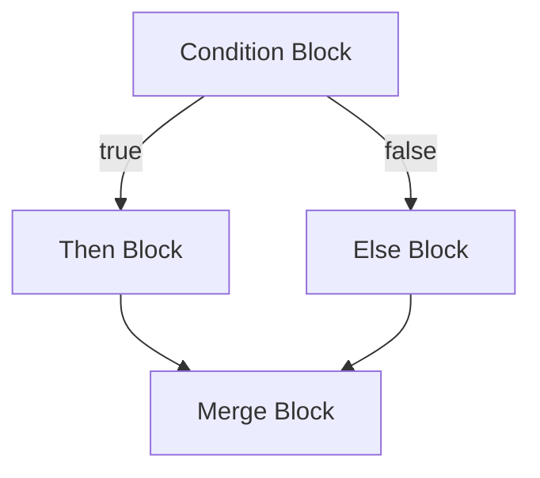
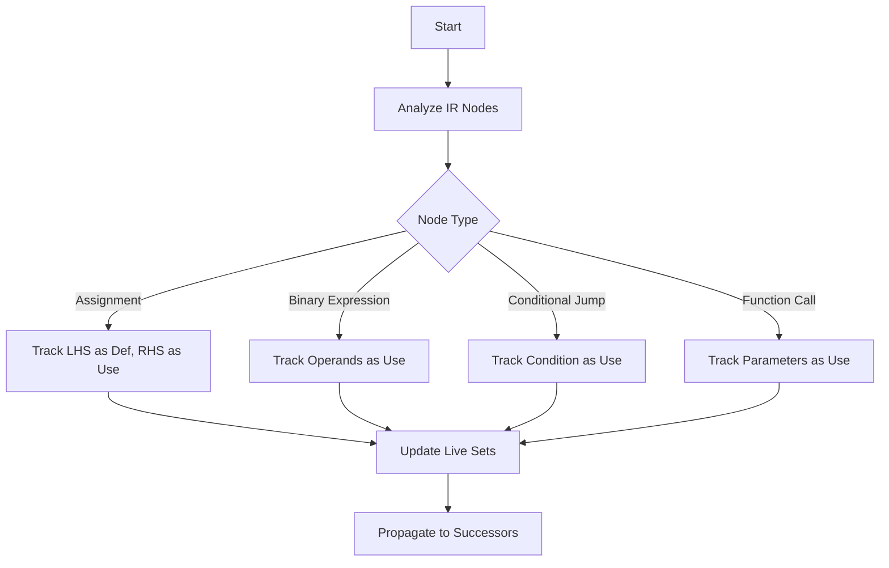
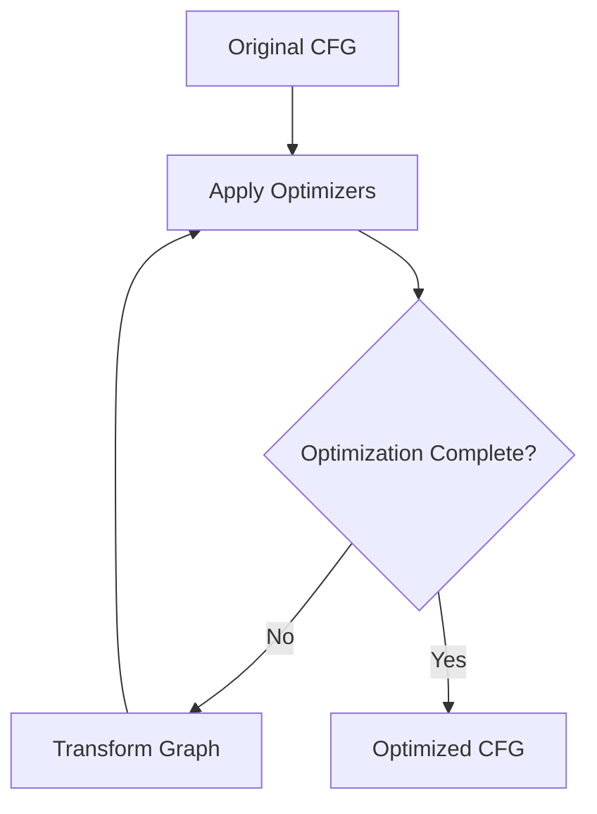

# Control Flow Analysis

<cite>
**Referenced Files in This Document**   
- [CFG.java](file://ep20/src/main/java/org/teachfx/antlr4/ep20/pass/cfg/CFG.java)
- [CFGBuilder.java](file://ep20/src/main/java/org/teachfx/antlr4/ep20/pass/cfg/CFGBuilder.java)
- [BasicBlock.java](file://ep20/src/main/java/org/teachfx/antlr4/ep20/pass/cfg/BasicBlock.java)
- [ControlFlowAnalysis.java](file://ep20/src/main/java/org/teachfx/antlr4/ep20/pass/cfg/ControlFlowAnalysis.java)
- [LivenessAnalysis.java](file://ep20/src/main/java/org/teachfx/antlr4/ep20/pass/cfg/LivenessAnalysis.java)
- [CymbolIRBuilder.java](file://ep20/src/main/java/org/teachfx/antlr4/ep20/pass/ir/CymbolIRBuilder.java)
</cite>

## Table of Contents
1. [Introduction](#introduction)
2. [Control Flow Graph Representation](#control-flow-graph-representation)
3. [CFG Construction Algorithm](#cfg-construction-algorithm)
4. [Basic Block Implementation](#basic-block-implementation)
5. [Control Flow Examples](#control-flow-examples)
6. [Data Flow Analysis and Optimization](#data-flow-analysis-and-optimization)
7. [Special Cases and Exception Handling](#special-cases-and-exception-handling)
8. [Visualization and Transformation](#visualization-and-transformation)
9. [Conclusion](#conclusion)

## Introduction
The Control Flow Graph (CFG) implementation in the Cymbol compiler provides a fundamental representation of program structure for optimization and analysis. This document explains how the CFG system represents control flow using basic blocks and edges, the algorithm for constructing CFGs from Intermediate Representation (IR) code, and how this enables various optimization passes. The implementation supports standard control structures like if-else statements and loops, and provides the foundation for data flow analysis.

## Control Flow Graph Representation

The CFG.java class implements a directed graph structure that represents the control flow of programs using basic blocks as nodes and control flow edges as connections between them. The generic type parameter `<I extends IRNode>` allows the CFG to work with different types of intermediate representation nodes.

The CFG maintains three primary data structures:
- `nodes`: A list of BasicBlock objects representing the basic blocks in the graph
- `edges`: A list of Triple objects representing control flow edges with source, destination, and weight
- `links`: A list of Pair objects storing predecessor and successor sets for each node

The implementation provides essential graph operations including retrieving predecessors (`getFrontier`), successors (`getSucceed`), in-degree, and out-degree for any node. The `toString` method generates a Mermaid-formatted representation of the graph, while the `toDOT` method produces DOT format output suitable for visualization tools.

The CFG also supports optimization through the `addOptimizer` and `applyOptimizers` methods, which allow optimization passes to be registered and executed on the graph. The `removeEdge` and `removeNode` methods enable graph transformations during optimization.

**Section sources**
- [CFG.java](file://ep20/src/main/java/org/teachfx/antlr4/ep20/pass/cfg/CFG.java#L17-L157)

## CFG Construction Algorithm

The CFGBuilder.java class implements the algorithm for constructing Control Flow Graphs from linear IR code. The construction process begins with a starting LinearIRBlock and recursively processes the control flow graph.

The algorithm works as follows:
1. Create a new BasicBlock from the current LinearIRBlock using `BasicBlock.buildFromLinearBlock`
2. Add the block to the basicBlocks list
3. Examine the last instruction in the block to determine control flow:
   - If it's a JMP instruction, add a control flow edge to the target block
   - If it's a CJMP (conditional jump) instruction, add an edge to the else block
4. Process all successor blocks recursively

The builder uses a cache (`cachedEdgeLinks`) to prevent duplicate edges and maintains both the list of basic blocks and edges during construction. The resulting CFG is created with the collected nodes and edges.

The construction algorithm handles various control flow patterns by examining the final instruction in each basic block. For unconditional jumps (JMP), it creates a direct edge to the target. For conditional jumps (CJMP), it creates edges for both the conditional and unconditional branches. The recursive processing ensures all reachable blocks are included in the graph.

**Section sources**
- [CFGBuilder.java](file://ep20/src/main/java/org/teachfx/antlr4/ep20/pass/cfg/CFGBuilder.java#L0-L63)

## Basic Block Implementation

The BasicBlock.java class represents a fundamental unit of the Control Flow Graph, containing a sequence of IR instructions that execute sequentially. Each basic block has a unique identifier (id), a list of instructions (codes), and a type classification (kind).

Key features of the BasicBlock implementation include:
- **Construction**: The static `buildFromLinearBlock` method creates a BasicBlock from a LinearIRBlock, preserving the instruction sequence and block properties
- **Iteration**: Implements Iterable interface with both forward and backward iterators for processing instructions
- **Instruction Access**: Methods like `getLastInstr` and `getIRNodes` provide access to block contents
- **Transformation**: Methods like `mergeNearBlock` and `removeLastInstr` support optimization operations
- **Label Handling**: The `dropLabelSeq` method returns the instruction sequence excluding the initial label when appropriate

The BasicBlock also maintains data flow analysis information including `def` (definitions), `liveUse` (live uses), `liveIn`, and `liveOut` sets, which are used during optimization passes. The `kind` field classifies blocks by their control flow characteristics, which helps in optimization decisions.

The implementation supports the merging of adjacent blocks through `mergeNearBlock`, which combines two blocks by removing the final jump instruction from the first block and appending the instructions from the second block (excluding its label). This operation is essential for optimization passes that eliminate unnecessary jumps.

**Section sources**
- [BasicBlock.java](file://ep20/src/main/java/org/teachfx/antlr4/ep20/pass/cfg/BasicBlock.java#L0-L130)

## Control Flow Examples

### If-Else Statement CFG
For an if-else statement, the CFG contains three basic blocks:
1. **Condition Block**: Evaluates the condition and performs a conditional jump
2. **Then Block**: Contains instructions from the then branch
3. **Else Block**: Contains instructions from the else branch
4. **Merge Block**: Joins the control flow after both branches

The condition block has edges to both the then and else blocks, while both branch blocks have edges to the merge block. This structure represents the two possible execution paths.

### While Loop CFG
A while loop creates a cyclic CFG with:
1. **Header Block**: Evaluates the loop condition
2. **Body Block**: Contains the loop body instructions
3. **Exit Block**: Continues execution after the loop

The header block has a conditional edge to the body block and an unconditional edge to the exit block. The body block has an edge back to the header block, creating the loop structure. This representation enables loop optimization techniques.

**Diagram sources**
- [CymbolIRBuilder.java](file://ep20/src/main/java/org/teachfx/antlr4/ep20/pass/ir/CymbolIRBuilder.java#L0-L473)

## Data Flow Analysis and Optimization

The CFG enables various data flow analysis and optimization passes through its structure and associated components. The ControlFlowAnalysis.java class implements basic control flow optimizations, while LivenessAnalysis.java provides data flow information.

### Control Flow Optimization
The ControlFlowAnalysis class performs two key optimizations:
1. **Jump Threading**: When a block ends with an unconditional jump (JMP) to its only successor, the jump instruction is removed
2. **Block Merging**: When a block has a single predecessor and that predecessor has a single successor, the blocks are merged into one

These optimizations simplify the control flow graph by eliminating unnecessary jumps and combining sequential blocks, improving both code size and execution efficiency.

### Liveness Analysis
The LivenessAnalysis class implements a visitor pattern to determine which variables are live (will be used) at each program point. It tracks:
- `currentUse`: Variables used in the current expression
- `currentDef`: Variables defined in the current expression

For each IR node type, the analysis determines the appropriate use and definition sets. For example, in an assignment statement, the right-hand side contributes to the use set, while the left-hand side contributes to the definition set.

The liveness information is used in register allocation and other optimizations to determine when variables can be safely reused or eliminated.

**Section sources**
- [ControlFlowAnalysis.java](file://ep20/src/main/java/org/teachfx/antlr4/ep20/pass/cfg/ControlFlowAnalysis.java#L0-L68)
- [LivenessAnalysis.java](file://ep20/src/main/java/org/teachfx/antlr4/ep20/pass/cfg/LivenessAnalysis.java#L0-L147)

## Special Cases and Exception Handling

While the current implementation focuses on standard control structures, it provides the foundation for handling more complex scenarios. The CFG structure can be extended to represent exception handling by adding special edges for exception propagation.

For nested control structures, the CFG naturally represents the hierarchical relationships through the graph topology. For example, a loop inside an if-else branch creates a subgraph within the then or else block, with appropriate entry and exit edges.

The implementation handles function calls through the CallFunc IR node, which is processed during IR generation. Return statements create edges to the function exit block, properly terminating the control flow within the function.

The system also handles break and continue statements in loops by maintaining stacks of target blocks (breakStack and continueStack) during IR generation. When a break statement is encountered, it creates a jump to the top of the break stack, while continue statements jump to the top of the continue stack.

These mechanisms ensure that complex control flow patterns are accurately represented in the CFG, enabling correct optimization and analysis.

**Section sources**
- [CymbolIRBuilder.java](file://ep20/src/main/java/org/teachfx/antlr4/ep20/pass/ir/CymbolIRBuilder.java#L0-L473)

## Visualization and Transformation

The CFG implementation includes built-in visualization capabilities through the `toDOT` and `toString` methods. The DOT format output can be rendered with graph visualization tools, while the Mermaid format output can be displayed in documentation.

During optimization, the CFG undergoes various transformations:
- **Edge Removal**: Unnecessary control flow edges are removed
- **Node Removal**: Redundant basic blocks are eliminated
- **Node Merging**: Adjacent blocks are combined
- **Instruction Reordering**: Instructions within blocks may be reordered

These transformations are applied through the optimizer interface, with each optimization pass modifying the graph structure. The visual representation changes accordingly, showing the evolution from the original CFG to the optimized version.

The implementation supports multiple optimization passes that can be chained together, with each pass potentially enabling further optimizations in subsequent passes. This iterative approach maximizes the optimization potential.

**Diagram sources**
- [CFG.java](file://ep20/src/main/java/org/teachfx/antlr4/ep20/pass/cfg/CFG.java#L17-L157)

## Conclusion
The Control Flow Graph implementation provides a robust foundation for program analysis and optimization in the Cymbol compiler. By representing programs as graphs of basic blocks connected by control flow edges, the system enables sophisticated optimization passes and data flow analysis. The modular design with separate CFG, BasicBlock, and CFGBuilder components allows for flexible extension and maintenance. The integration with IR generation and optimization passes creates a complete pipeline for transforming high-level code into optimized intermediate representation, ready for code generation.