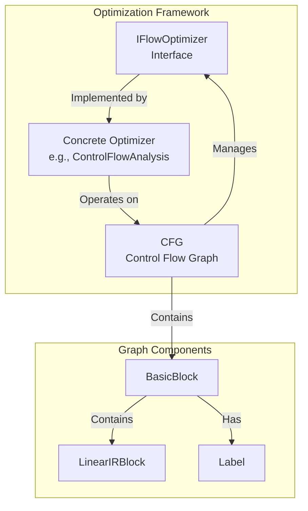
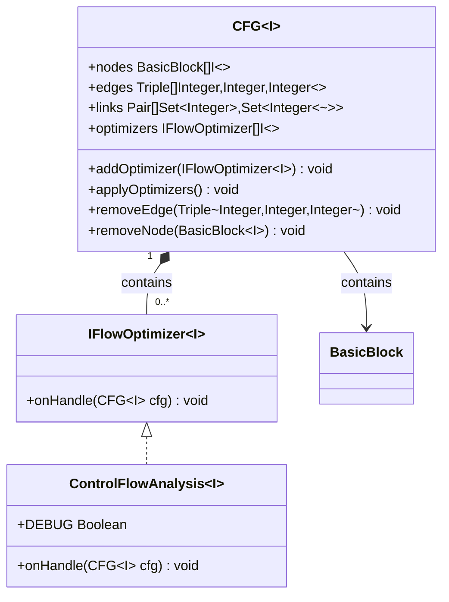
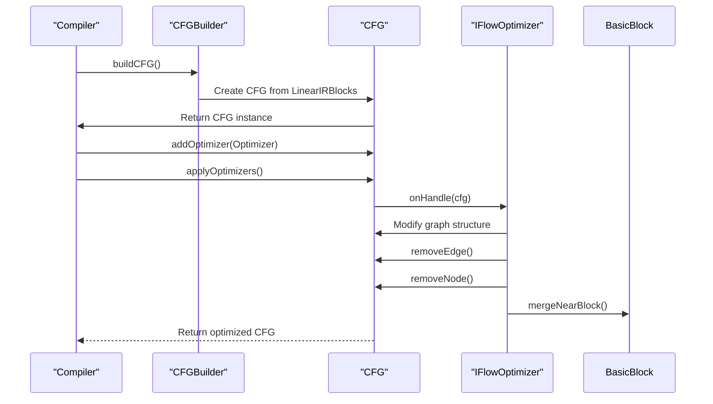
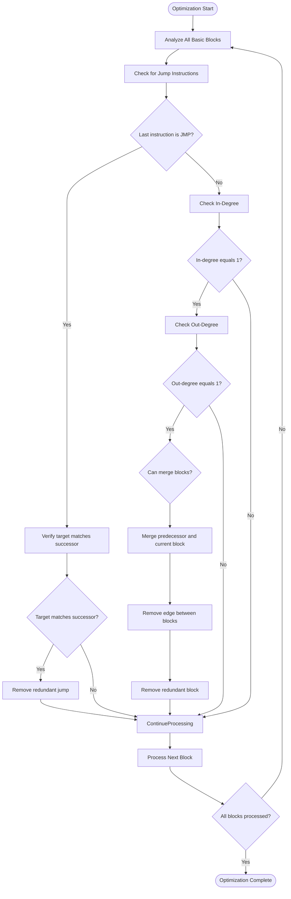
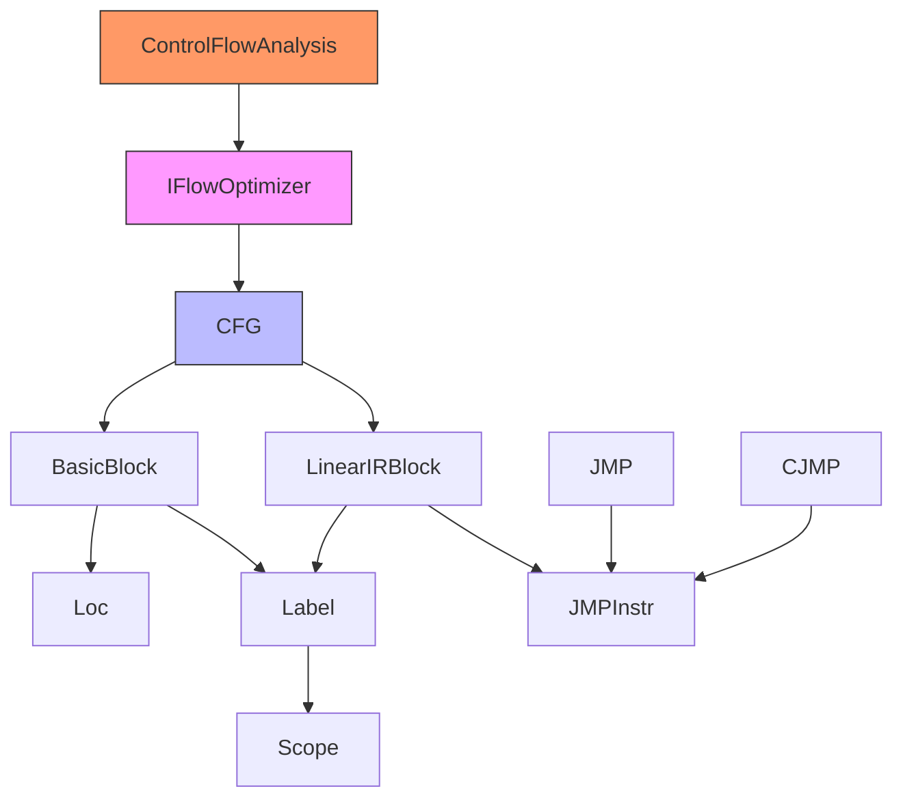

# Control Flow Optimization Interface

<cite>
**Referenced Files in This Document**   
- [IFlowOptimizer.java](file://ep20/src/main/java/org/teachfx/antlr4/ep20/pass/cfg/IFlowOptimizer.java)
- [CFG.java](file://ep20/src/main/java/org/teachfx/antlr4/ep20/pass/cfg/CFG.java)
- [ControlFlowAnalysis.java](file://ep20/src/main/java/org/teachfx/antlr4/ep20/pass/cfg/ControlFlowAnalysis.java)
- [BasicBlock.java](file://ep20/src/main/java/org/teachfx/antlr4/ep20/pass/cfg/BasicBlock.java)
- [LinearIRBlock.java](file://ep20/src/main/java/org/teachfx/antlr4/ep20/pass/cfg/LinearIRBlock.java)
- [JMP.java](file://ep20/src/main/java/org/teachfx/antlr4/ep20/ir/stmt/JMP.java)
- [CJMP.java](file://ep20/src/main/java/org/teachfx/antlr4/ep20/ir/stmt/CJMP.java)
- [Label.java](file://ep20/src/main/java/org/teachfx/antlr4/ep20/ir/stmt/Label.java)
</cite>

## Table of Contents
1. [Introduction](#introduction)
2. [Core Components](#core-components)
3. [Architecture Overview](#architecture-overview)
4. [Detailed Component Analysis](#detailed-component-analysis)
5. [Dependency Analysis](#dependency-analysis)
6. [Performance Considerations](#performance-considerations)
7. [Troubleshooting Guide](#troubleshooting-guide)
8. [Conclusion](#conclusion)

## Introduction
This document provides comprehensive documentation for the `IFlowOptimizer` interface and its surrounding ecosystem within a compiler's control flow optimization framework. The interface defines the contract for optimization passes that operate on Control Flow Graphs (CFGs), enabling transformations that improve code efficiency while preserving program semantics. The system supports various optimization techniques including jump threading, unreachable code elimination, and basic block merging. Optimizers integrate into the compilation pipeline through a pluggable architecture that allows multiple optimization passes to be applied sequentially to the CFG.

## Core Components

The control flow optimization system is built around several key components that work together to analyze and transform the program's control flow structure. The `IFlowOptimizer` interface serves as the foundation for all optimization passes, while the `CFG` class represents the control flow graph structure that these optimizers modify. The `ControlFlowAnalysis` class provides a concrete implementation of flow optimization that demonstrates the interface's usage pattern. Basic blocks are represented by the `BasicBlock` class, which contains sequences of intermediate representation (IR) instructions and maintains connections within the CFG.

**Section sources**
- [IFlowOptimizer.java](file://ep20/src/main/java/org/teachfx/antlr4/ep20/pass/cfg/IFlowOptimizer.java#L1-L8)
- [CFG.java](file://ep20/src/main/java/org/teachfx/antlr4/ep20/pass/cfg/CFG.java#L1-L159)
- [ControlFlowAnalysis.java](file://ep20/src/main/java/org/teachfx/antlr4/ep20/pass/cfg/ControlFlowAnalysis.java#L1-L69)
- [BasicBlock.java](file://ep20/src/main/java/org/teachfx/antlr4/ep20/pass/cfg/BasicBlock.java#L1-L131)

## Architecture Overview

The control flow optimization architecture follows a modular design where optimization passes implement the `IFlowOptimizer` interface to operate on CFG structures. The system processes linear IR blocks that are converted into basic blocks and assembled into a complete CFG. Optimization passes are registered with the CFG and applied in sequence, each modifying the graph structure according to specific optimization rules. The architecture supports both structural optimizations (like block merging) and data flow analyses (like liveness analysis).

**Diagram sources**
- [IFlowOptimizer.java](file://ep20/src/main/java/org/teachfx/antlr4/ep20/pass/cfg/IFlowOptimizer.java#L1-L8)
- [CFG.java](file://ep20/src/main/java/org/teachfx/antlr4/ep20/pass/cfg/CFG.java#L1-L159)
- [ControlFlowAnalysis.java](file://ep20/src/main/java/org/teachfx/antlr4/ep20/pass/cfg/ControlFlowAnalysis.java#L1-L69)

## Detailed Component Analysis

### IFlowOptimizer Interface Analysis

The `IFlowOptimizer` interface defines the contract for all control flow optimization passes. It specifies a single method `onHandle` that takes a CFG as input and performs optimization operations on it. This interface enables a pluggable optimization architecture where multiple optimization passes can be registered and applied to the same CFG.

**Diagram sources**
- [IFlowOptimizer.java](file://ep20/src/main/java/org/teachfx/antlr4/ep20/pass/cfg/IFlowOptimizer.java#L1-L8)
- [CFG.java](file://ep20/src/main/java/org/teachfx/antlr4/ep20/pass/cfg/CFG.java#L1-L159)

**Section sources**
- [IFlowOptimizer.java](file://ep20/src/main/java/org/teachfx/antlr4/ep20/pass/cfg/IFlowOptimizer.java#L1-L8)

### Control Flow Optimization Process

The control flow optimization process follows a systematic approach to transform the CFG while preserving program semantics. The process begins with the construction of the CFG from linear IR blocks, followed by the registration of optimization passes. When optimizations are applied, each registered optimizer modifies the CFG according to its specific rules.

**Diagram sources**
- [CFG.java](file://ep20/src/main/java/org/teachfx/antlr4/ep20/pass/cfg/CFG.java#L1-L159)
- [ControlFlowAnalysis.java](file://ep20/src/main/java/org/teachfx/antlr4/ep20/pass/cfg/ControlFlowAnalysis.java#L1-L69)
- [BasicBlock.java](file://ep20/src/main/java/org/teachfx/antlr4/ep20/pass/cfg/BasicBlock.java#L1-L131)

**Section sources**
- [CFG.java](file://ep20/src/main/java/org/teachfx/antlr4/ep20/pass/cfg/CFG.java#L1-L159)
- [ControlFlowAnalysis.java](file://ep20/src/main/java/org/teachfx/antlr4/ep20/pass/cfg/ControlFlowAnalysis.java#L1-L69)

### Basic Block Optimization Logic

The optimization logic implemented in `ControlFlowAnalysis` demonstrates two key optimization techniques: jump threading and basic block merging. The optimization process analyzes each basic block's control flow properties and applies transformations when specific conditions are met.

**Diagram sources**
- [ControlFlowAnalysis.java](file://ep20/src/main/java/org/teachfx/antlr4/ep20/pass/cfg/ControlFlowAnalysis.java#L1-L69)
- [BasicBlock.java](file://ep20/src/main/java/org/teachfx/antlr4/ep20/pass/cfg/BasicBlock.java#L1-L131)
- [CFG.java](file://ep20/src/main/java/org/teachfx/antlr4/ep20/pass/cfg/CFG.java#L1-L159)

**Section sources**
- [ControlFlowAnalysis.java](file://ep20/src/main/java/org/teachfx/antlr4/ep20/pass/cfg/ControlFlowAnalysis.java#L1-L69)

## Dependency Analysis

The control flow optimization system has a well-defined dependency structure where components interact through clean interfaces. The `IFlowOptimizer` interface serves as the abstraction point that decouples optimization algorithms from the CFG implementation. This design allows new optimization passes to be added without modifying the core CFG structure.

**Diagram sources**
- [IFlowOptimizer.java](file://ep20/src/main/java/org/teachfx/antlr4/ep20/pass/cfg/IFlowOptimizer.java#L1-L8)
- [CFG.java](file://ep20/src/main/java/org/teachfx/antlr4/ep20/pass/cfg/CFG.java#L1-L159)
- [ControlFlowAnalysis.java](file://ep20/src/main/java/org/teachfx/antlr4/ep20/pass/cfg/ControlFlowAnalysis.java#L1-L69)

**Section sources**
- [IFlowOptimizer.java](file://ep20/src/main/java/org/teachfx/antlr4/ep20/pass/cfg/IFlowOptimizer.java#L1-L8)
- [CFG.java](file://ep20/src/main/java/org/teachfx/antlr4/ep20/pass/cfg/CFG.java#L1-L159)

## Performance Considerations

The control flow optimization framework is designed with performance in mind, particularly for the traversal and modification of graph structures. The CFG implementation uses efficient data structures like `TreeSet` for maintaining predecessor and successor relationships, enabling fast lookups during optimization passes. The use of atomic operations and stream processing helps minimize memory allocations during graph transformations.

The optimization process follows a two-phase approach: first identifying optimization opportunities by analyzing control flow patterns, then applying the transformations. This separation ensures that expensive graph modifications are only performed when beneficial. The framework also supports incremental optimization, where multiple passes can be chained together to achieve compound improvements.

**Section sources**
- [CFG.java](file://ep20/src/main/java/org/teachfx/antlr4/ep20/pass/cfg/CFG.java#L1-L159)
- [ControlFlowAnalysis.java](file://ep20/src/main/java/org/teachfx/antlr4/ep20/pass/cfg/ControlFlowAnalysis.java#L1-L69)

## Troubleshooting Guide

When working with the control flow optimization system, several common issues may arise. These include incorrect graph modifications that break control flow semantics, infinite loops during optimization passes, and performance bottlenecks in large CFGs.

To diagnose optimization issues, enable the DEBUG flag in `ControlFlowAnalysis` to trace the optimization steps. Verify that edge removal operations maintain graph connectivity and that node removal doesn't orphan sections of the control flow. When implementing custom optimizers, ensure that the `onHandle` method properly handles edge cases like empty basic blocks or degenerate control flow patterns.

Performance issues can often be addressed by optimizing the order of optimization passes, as some transformations may create opportunities for others. Monitoring the number of edges and nodes before and after optimization can help identify unexpectedly aggressive or ineffective optimizations.

**Section sources**
- [ControlFlowAnalysis.java](file://ep20/src/main/java/org/teachfx/antlr4/ep20/pass/cfg/ControlFlowAnalysis.java#L1-L69)
- [CFG.java](file://ep20/src/main/java/org/teachfx/antlr4/ep20/pass/cfg/CFG.java#L1-L159)

## Conclusion

The `IFlowOptimizer` interface provides a robust foundation for implementing control flow optimizations in a compiler framework. By defining a clear contract for optimization passes, it enables a modular and extensible architecture where various optimization techniques can be implemented and combined. The system effectively balances the need for aggressive optimization with the requirement to preserve program semantics, using well-defined data structures and algorithms to transform control flow graphs. The integration with the compilation pipeline allows for multiple optimization passes to be applied sequentially, maximizing the potential for code improvement while maintaining code clarity and correctness.